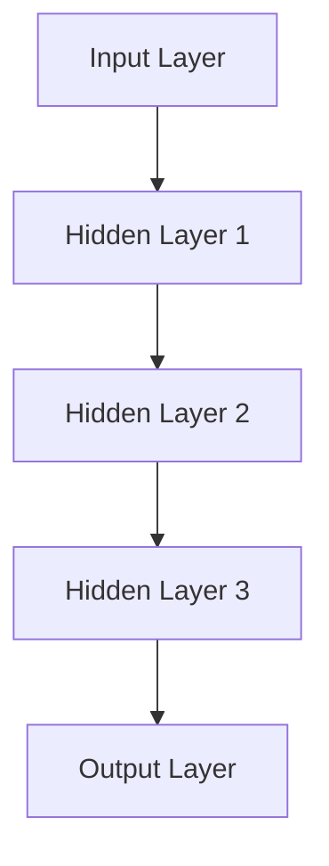
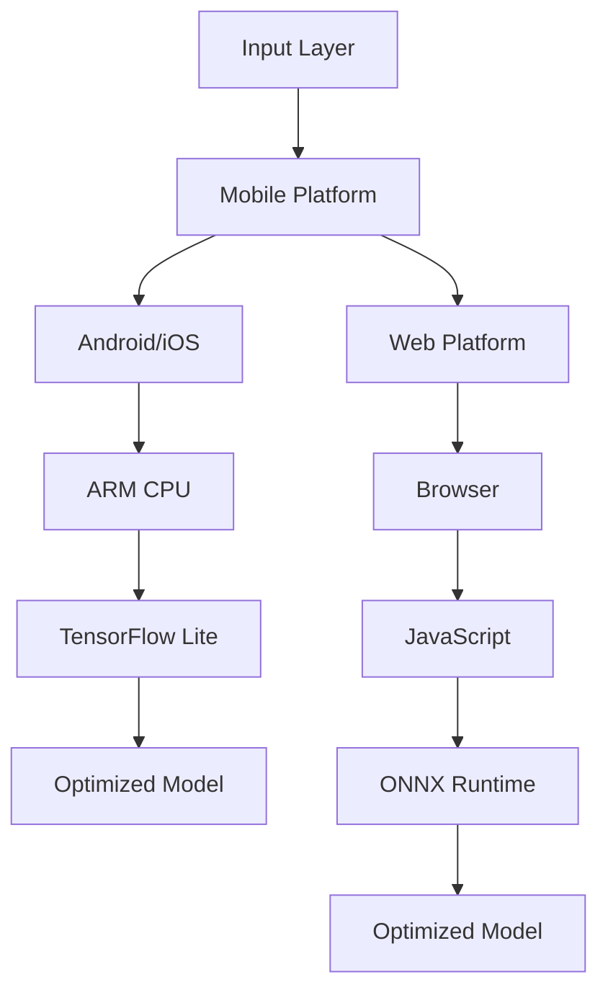

                 

### 1. 背景介绍

#### 1.1 目的和范围

本文旨在探讨神经网络的跨平台性，以及如何实现AI模型的随时随地使用。我们将从多个角度深入分析这一主题，包括跨平台性对AI模型开发和部署的重要性、现有的跨平台框架和技术、以及未来可能的发展趋势。

跨平台性是现代AI模型开发的一个关键因素。随着移动设备的普及和云计算的兴起，用户不再局限于特定的操作系统或硬件设备，他们期望在各种设备上都能顺畅地使用AI应用。因此，实现神经网络的跨平台性变得至关重要。这不仅提升了用户体验，还极大地拓宽了AI技术的应用范围。

本文的主要目标是为读者提供一个全面的技术视角，帮助理解神经网络跨平台性的重要性，以及如何选择和实施合适的解决方案。我们将讨论当前最先进的跨平台框架和技术，如TensorFlow Lite、PyTorch Mobile和ONNX等，并提供一些实际的应用案例和代码示例。

本文还将涵盖以下内容：

- 跨平台性的定义和重要性
- 神经网络模型在不同平台上的运行效率
- 现有的跨平台框架和技术
- 实现跨平台神经网络模型的策略和最佳实践
- 未来跨平台AI模型的发展趋势

通过阅读本文，您将能够：

- 理解跨平台性的核心概念及其在AI模型开发中的应用
- 掌握如何使用现有的跨平台框架和工具
- 获得关于跨平台AI模型开发的实际经验和最佳实践
- 预测未来跨平台AI模型的发展方向

#### 1.2 预期读者

本文主要面向以下几类读者：

- AI模型开发者和工程师：希望了解如何实现跨平台AI模型部署的专业人士。
- 数据科学家和机器学习研究员：对跨平台性有需求，并希望将研究成果应用到实际应用场景中。
- 技术爱好者和学生：对AI技术和跨平台开发感兴趣，并希望深入了解该领域的最新进展。
- 产品经理和决策者：关注AI技术趋势，并希望了解跨平台性如何影响产品开发和市场竞争力。

无论您是上述哪一类读者，本文都将为您提供有价值的见解和实用的指导。

#### 1.3 文档结构概述

本文的结构如下：

1. **背景介绍**：介绍本文的目的、预期读者、文档结构和主要术语。
2. **核心概念与联系**：解释神经网络的基本概念，并使用Mermaid流程图展示其架构。
3. **核心算法原理 & 具体操作步骤**：详细讲解神经网络的工作原理，并使用伪代码进行说明。
4. **数学模型和公式 & 详细讲解 & 举例说明**：介绍神经网络的数学基础，并使用LaTeX格式展示相关公式。
5. **项目实战：代码实际案例和详细解释说明**：通过一个实际案例展示如何实现跨平台神经网络模型。
6. **实际应用场景**：讨论神经网络跨平台性在现实世界中的应用。
7. **工具和资源推荐**：推荐相关学习资源和开发工具。
8. **总结：未来发展趋势与挑战**：总结本文的核心观点，并展望未来。
9. **附录：常见问题与解答**：提供一些常见问题的解答。
10. **扩展阅读 & 参考资料**：推荐进一步阅读的材料。

通过本文的结构，我们将系统地介绍和探讨神经网络的跨平台性，帮助读者深入理解这一重要主题。

#### 1.4 术语表

在本文中，我们将使用一些特定的术语。以下是这些术语的定义和解释：

##### 1.4.1 核心术语定义

- **神经网络**：一种基于生物神经系统的计算模型，由大量相互连接的神经元组成，用于执行复杂的计算任务。
- **深度学习**：一种人工智能技术，使用多层神经网络来提取数据中的特征和模式。
- **跨平台性**：指应用程序或模型能够在不同的操作系统、设备和硬件上运行的能力。
- **TensorFlow Lite**：由Google开发的一个轻量级深度学习库，旨在使神经网络模型在移动设备和嵌入式系统上高效运行。
- **PyTorch Mobile**：一个开源框架，使PyTorch模型能够运行在iOS和Android设备上。
- **ONNX**：一个开放格式，用于表示深度学习模型，旨在促进不同框架和平台之间的互操作性。

##### 1.4.2 相关概念解释

- **模型压缩**：通过减少模型的参数数量或计算复杂度，使模型在资源受限的设备上运行。
- **量化**：将模型中的浮点数参数转换为固定点数，以减少模型的内存占用和计算成本。
- **模型部署**：将训练好的模型集成到应用程序中，以便在实际环境中使用。

##### 1.4.3 缩略词列表

- **AI**：人工智能（Artificial Intelligence）
- **DL**：深度学习（Deep Learning）
- **GPU**：图形处理单元（Graphics Processing Unit）
- **CPU**：中央处理单元（Central Processing Unit）
- **FPGA**：现场可编程门阵列（Field-Programmable Gate Array）
- **ML**：机器学习（Machine Learning）
- **NN**：神经网络（Neural Network）
- **TensorFlow**：一个由Google开发的开源深度学习框架。
- **ONNX**：开放神经网络交换（Open Neural Network Exchange）

通过定义和解释这些术语，我们希望为读者提供清晰的理解，以便更好地跟随本文的内容。

## 2. 核心概念与联系

在本节中，我们将深入探讨神经网络（NN）的基本概念和它们在不同平台上的关联性。神经网络是一种模拟人脑神经元相互连接和作用的计算模型，用于处理和提取数据中的复杂特征和模式。

### 2.1 神经网络基础

神经网络由多个层次组成，包括输入层、隐藏层和输出层。输入层接收外部输入数据，隐藏层对数据进行处理和特征提取，输出层产生最终的输出结果。

以下是神经网络的基本架构：



在这个流程中，每个节点（神经元）都与相邻的节点相连，并通过权重进行加权求和。神经元通过激活函数（如ReLU、Sigmoid或Tanh）将加权求和的结果转换为输出。

### 2.2 跨平台神经网络模型

跨平台神经网络模型的目标是使神经网络模型能够在不同的操作系统、设备和硬件上高效运行。为了实现这一目标，我们需要考虑以下关键因素：

- **可移植性**：模型应能够在不同的编程语言和框架中实现。
- **性能优化**：模型应能够在不同类型的硬件（如CPU、GPU、FPGA）上高效运行。
- **资源利用**：模型应能够在资源受限的设备上运行，如移动设备和嵌入式系统。

### 2.3 现有跨平台框架和技术

目前，有多种跨平台框架和技术可以帮助我们实现神经网络模型的跨平台性。以下是其中一些主要框架：

- **TensorFlow Lite**：TensorFlow Lite是Google开发的一个轻量级深度学习库，旨在使神经网络模型在移动设备和嵌入式系统上高效运行。它支持多种操作系统（如Android和iOS）和硬件（如ARM和x86）。
- **PyTorch Mobile**：PyTorch Mobile是一个开源框架，使PyTorch模型能够运行在iOS和Android设备上。它提供了与PyTorch相同的API，使得迁移模型变得简单。
- **ONNX**：ONNX是一个开放格式，用于表示深度学习模型。它旨在促进不同框架和平台之间的互操作性。通过ONNX，我们可以将TensorFlow、PyTorch和MXNet等框架中的模型转换为ONNX格式，然后在其他框架或平台上运行。

### 2.4 Mermaid流程图展示

下面是一个Mermaid流程图，展示了神经网络在不同平台上的关联性：



在这个流程图中，输入层接收外部输入数据，通过TensorFlow Lite在ARM CPU上优化模型，并在Android或iOS设备上运行。同时，输入层也可以通过ONNX Runtime在Web平台上运行，使用JavaScript进行模型推理。

通过这个Mermaid流程图，我们可以清楚地看到神经网络在不同平台上的运行流程和关联性。

### 2.5 神经网络跨平台性的重要性

跨平台性对神经网络模型至关重要。它不仅提升了模型的应用范围和灵活性，还提高了用户体验。以下是一些关键优势：

- **灵活性**：跨平台性使得开发者可以在不同的操作系统和设备上部署和运行神经网络模型，为用户提供更广泛的应用场景。
- **性能优化**：通过利用特定平台的硬件特性，可以实现模型的性能优化，提高推理速度和准确性。
- **降低成本**：跨平台性减少了开发者的重复劳动，可以节省时间和资源。
- **用户体验**：跨平台性使得用户可以在各种设备上无缝使用AI应用，提升了用户体验。

通过深入理解神经网络的基本概念和跨平台性，我们为接下来的内容打下了坚实的基础。在接下来的章节中，我们将详细讨论神经网络的核心算法原理、数学模型、实际应用案例和未来发展趋势。

## 3. 核心算法原理 & 具体操作步骤

在理解了神经网络的基本概念和跨平台性的重要性后，我们接下来将深入探讨神经网络的核心算法原理和具体操作步骤。神经网络的核心在于其能够通过学习数据中的特征和模式来完成任务。在这一节中，我们将详细解释神经网络的工作原理，并使用伪代码展示其具体操作步骤。

### 3.1 神经网络的工作原理

神经网络由多层神经元组成，每一层神经元都与前一层和后一层神经元通过权重相连。神经元的激活函数将输入数据的加权和转换为输出数据，从而实现数据的特征提取和分类。

下面是一个简单的三层神经网络（输入层、隐藏层和输出层）的伪代码示例：

```python
# 输入数据
inputs = [x1, x2, ..., xn]

# 初始化权重和偏置
weights_hidden = [[w1, w2, ..., wn], ..., [w1, w2, ..., wn]]
biases_hidden = [b1, b2, ..., bn]
weights_output = [[w1, w2, ..., wn], ..., [w1, w2, ..., wn]]
biases_output = [b1, b2, ..., bn]

# 隐藏层神经元激活函数：ReLU
def activate.ReLU(x):
    return max(0, x)

# 输出层神经元激活函数：Sigmoid
def activate.Sigmoid(x):
    return 1 / (1 + exp(-x))

# 前向传播
def forwardPropagation(inputs, weights_hidden, biases_hidden, weights_output, biases_output):
    hidden_layer_inputs = [np.dot(weights_hidden[i], inputs) + biases_hidden[i] for i in range(len(inputs))]
    hidden_layer_outputs = [activate.ReLU(x) for x in hidden_layer_inputs]

    output_layer_inputs = [np.dot(weights_output[i], hidden_layer_outputs) + biases_output[i] for i in range(len(hidden_layer_outputs))]
    output_layer_outputs = [activate.Sigmoid(x) for x in output_layer_inputs]
    
    return output_layer_outputs

# 计算输出
outputs = forwardPropagation(inputs, weights_hidden, biases_hidden, weights_output, biases_output)
```

在上面的伪代码中，我们首先初始化输入数据、权重和偏置。然后，我们定义了ReLU和Sigmoid激活函数，并使用前向传播算法计算输出。前向传播过程中，我们首先计算隐藏层输入和输出，然后计算输出层输入和输出。

### 3.2 反向传播算法

反向传播算法是神经网络训练过程中的关键步骤，用于计算损失函数相对于每个参数的梯度，以便更新权重和偏置。

下面是一个反向传播算法的伪代码示例：

```python
# 计算损失函数
def calculateLoss(outputs, expected_outputs):
    return sum((outputs - expected_outputs) ** 2) / 2

# 计算隐藏层和输出层的梯度
def backwardPropagation(inputs, hidden_layer_inputs, hidden_layer_outputs, output_layer_inputs, outputs, expected_outputs):
    output_layer_gradients = [d / (output_layer_inputs[i] * (1 - output_layer_inputs[i])) for i, d in enumerate(expected_outputs - outputs)]
    hidden_layer_gradients = [[d * hidden_layer_outputs[i] * (1 - hidden_layer_outputs[i]) for d in output_layer_gradients] for i in range(len(hidden_layer_outputs))]

    return hidden_layer_gradients, output_layer_gradients

# 更新权重和偏置
def updateParameters(weights, biases, gradients, learning_rate):
    return [weight - learning_rate * gradient for weight, gradient in zip(weights, gradients)]

# 训练神经网络
def trainNeuralNetwork(inputs, expected_outputs, weights_hidden, biases_hidden, weights_output, biases_output, learning_rate):
    outputs = forwardPropagation(inputs, weights_hidden, biases_hidden, weights_output, biases_output)
    loss = calculateLoss(outputs, expected_outputs)

    hidden_layer_gradients, output_layer_gradients = backwardPropagation(inputs, hidden_layer_inputs, hidden_layer_outputs, output_layer_inputs, outputs, expected_outputs)
    weights_hidden = updateParameters(weights_hidden, biases_hidden, hidden_layer_gradients, learning_rate)
    weights_output = updateParameters(weights_output, biases_output, output_layer_gradients, learning_rate)
    
    return outputs, loss, weights_hidden, weights_output
```

在上面的伪代码中，我们首先定义了损失函数，然后计算输出层和隐藏层的梯度。最后，我们使用梯度更新权重和偏置，以训练神经网络。

### 3.3 具体操作步骤

通过上述伪代码，我们可以总结出神经网络的具体操作步骤：

1. **初始化权重和偏置**：随机初始化权重和偏置。
2. **前向传播**：计算输入层到隐藏层的输出，以及隐藏层到输出层的输出。
3. **计算损失函数**：计算实际输出与期望输出之间的差距。
4. **反向传播**：计算隐藏层和输出层的梯度。
5. **更新参数**：使用学习率更新权重和偏置。
6. **重复步骤2-5**：迭代训练神经网络，直到满足停止条件（如达到预设的准确率或训练次数）。

通过这些操作步骤，神经网络能够不断调整其参数，从而优化模型的性能。

### 3.4 案例分析

为了更好地理解神经网络的工作原理，我们来看一个简单的案例。假设我们有一个二分类问题，输入数据为 `[x1, x2]`，其中 x1 和 x2 分别表示两个特征。我们希望预测输入数据是否属于正类别。

```python
# 初始化参数
weights_hidden = [[0.1, 0.2], [0.3, 0.4]]
biases_hidden = [0.5, 0.6]
weights_output = [[0.7, 0.8], [0.9, 1.0]]
biases_output = [1.1, 1.2]

# 训练数据
inputs = [[0.1, 0.2], [0.3, 0.4], [0.5, 0.6]]
expected_outputs = [[1], [0], [1]]

# 学习率
learning_rate = 0.01

# 训练神经网络
for epoch in range(100):
    outputs, loss, weights_hidden, weights_output = trainNeuralNetwork(inputs, expected_outputs, weights_hidden, biases_hidden, weights_output, biases_output, learning_rate)
    print(f"Epoch {epoch + 1}, Loss: {loss}")

# 输入新数据
new_inputs = [0.4, 0.5]
new_outputs = forwardPropagation(new_inputs, weights_hidden, biases_hidden, weights_output, biases_output)

# 预测结果
print(f"Prediction: {new_outputs}")
```

在上面的案例中，我们初始化了神经网络参数，并使用训练数据进行训练。最后，我们使用训练好的神经网络对新的输入数据进行预测。

通过这个案例，我们可以看到神经网络如何通过学习数据中的特征和模式来完成任务。这一过程不仅展示了神经网络的工作原理，还为我们提供了一个实际应用的例子。

### 3.5 小结

在这一节中，我们详细探讨了神经网络的核心算法原理和具体操作步骤。从初始化参数到前向传播、反向传播和参数更新，每个步骤都至关重要。通过伪代码示例和案例分析，我们更好地理解了神经网络的工作机制。

在下一节中，我们将讨论神经网络的数学模型和公式，进一步深入探讨神经网络的理论基础。这将为我们后续的实践应用提供更坚实的理论支持。

## 4. 数学模型和公式 & 详细讲解 & 举例说明

在深入探讨神经网络的工作原理后，我们需要进一步了解其背后的数学模型和公式。神经网络的核心在于其通过数学运算来学习数据中的特征和模式。本节将详细讲解神经网络的数学模型和公式，并使用LaTeX格式展示相关数学表达式。

### 4.1 神经网络的基本数学模型

神经网络的数学模型主要包括三个主要部分：输入层、隐藏层和输出层。每个层中的神经元通过加权求和和激活函数来实现数据的特征提取和分类。

#### 4.1.1 加权求和

在神经网络中，每个神经元接收来自前一层神经元的输入，并通过权重进行加权求和。假设第 \(l\) 层的神经元 \(j\) 的输入为 \(z_j^{(l)}\)，其中 \(l\) 表示层的索引，\(j\) 表示神经元的索引。则加权求和可以表示为：

\[ z_j^{(l)} = \sum_{i} w_{ij}^{(l)} x_i^{(l-1)} \]

其中，\(w_{ij}^{(l)}\) 表示从第 \(l-1\) 层的神经元 \(i\) 到第 \(l\) 层的神经元 \(j\) 的权重，\(x_i^{(l-1)}\) 表示第 \(l-1\) 层的神经元 \(i\) 的输出。

#### 4.1.2 激活函数

激活函数是神经网络中的一个关键组件，用于引入非线性特性。常见的激活函数包括ReLU（Rectified Linear Unit）、Sigmoid和Tanh。以下是这些激活函数的数学表达式：

1. **ReLU激活函数**：
\[ a_j^{(l)} = \max(0, z_j^{(l)}) \]

2. **Sigmoid激活函数**：
\[ a_j^{(l)} = \frac{1}{1 + e^{-z_j^{(l)}}} \]

3. **Tanh激活函数**：
\[ a_j^{(l)} = \tanh(z_j^{(l)}) \]

这些激活函数能够增加神经网络的非线性表达能力，使其能够学习更复杂的数据特征。

#### 4.1.3 前向传播

前向传播是神经网络的核心过程，用于计算输入层到隐藏层，以及隐藏层到输出层的输出。假设我们已经得到了第 \(l\) 层的输入 \(x^{(l)}\)，则第 \(l+1\) 层的输入可以表示为：

\[ z_j^{(l+1)} = \sum_{i} w_{ij}^{(l+1)} a_i^{(l)} + b_j^{(l+1)} \]

其中，\(a_i^{(l)}\) 表示第 \(l\) 层的神经元 \(i\) 的输出，\(b_j^{(l+1)}\) 表示第 \(l+1\) 层的神经元 \(j\) 的偏置。

#### 4.1.4 反向传播

反向传播是神经网络训练过程中的关键步骤，用于计算损失函数相对于每个参数的梯度。假设我们已经得到了输出层的输出 \(y\) 和期望输出 \(\hat{y}\)，则损失函数可以表示为：

\[ J = \frac{1}{2} \sum_{i} (\hat{y}_i - y_i)^2 \]

为了计算梯度，我们需要对损失函数进行求导。以下是对损失函数关于权重 \(w_{ij}^{(l)}\) 和偏置 \(b_j^{(l+1)}\) 的偏导数：

1. **关于权重 \(w_{ij}^{(l)}\) 的偏导数**：
\[ \frac{\partial J}{\partial w_{ij}^{(l)}} = (y_i - \hat{y}_i) \cdot a_j^{(l)} \]

2. **关于偏置 \(b_j^{(l+1)}\) 的偏导数**：
\[ \frac{\partial J}{\partial b_j^{(l+1)}} = (y_i - \hat{y}_i) \]

#### 4.1.5 参数更新

为了训练神经网络，我们需要使用梯度来更新权重和偏置。通常，我们使用以下公式进行参数更新：

\[ w_{ij}^{(l)} = w_{ij}^{(l)} - \alpha \cdot \frac{\partial J}{\partial w_{ij}^{(l)}} \]
\[ b_j^{(l+1)} = b_j^{(l+1)} - \alpha \cdot \frac{\partial J}{\partial b_j^{(l+1)}} \]

其中，\(\alpha\) 表示学习率。

### 4.2 举例说明

为了更好地理解上述数学模型，我们来看一个简单的例子。假设我们有一个输入数据 \([x1, x2]\)，其中 x1 和 x2 分别表示两个特征。我们希望将输入数据分类为正类别或负类别。

#### 4.2.1 初始化参数

我们随机初始化权重和偏置：

\[ w_{11}^{(1)} = 0.1, w_{12}^{(1)} = 0.2, w_{21}^{(1)} = 0.3, w_{22}^{(1)} = 0.4 \]
\[ b_{1}^{(2)} = 0.5, b_{2}^{(2)} = 0.6 \]

#### 4.2.2 前向传播

假设隐藏层只有一个神经元，我们计算隐藏层神经元的输出：

\[ z_1^{(2)} = (0.1 \cdot x1 + 0.2 \cdot x2 + 0.5) \]
\[ a_1^{(2)} = \max(0, z_1^{(2)}) \]

然后，我们计算输出层神经元的输出：

\[ z_1^{(3)} = (0.3 \cdot a1 + 0.4 \cdot a2 + 0.6) \]
\[ y = \frac{1}{1 + e^{-z_1^{(3)}}} \]

#### 4.2.3 反向传播

假设期望输出为 0.8，我们计算损失函数的梯度：

\[ J = \frac{1}{2} \cdot (0.8 - y)^2 \]
\[ \frac{\partial J}{\partial y} = 0.8 - y \]
\[ \frac{\partial J}{\partial z_1^{(3)}} = (0.8 - y) \cdot y \cdot (1 - y) \]

然后，我们计算关于权重和偏置的梯度：

\[ \frac{\partial J}{\partial w_{11}^{(2)}} = a1 \cdot (0.8 - y) \cdot y \cdot (1 - y) \]
\[ \frac{\partial J}{\partial w_{12}^{(2)}} = a2 \cdot (0.8 - y) \cdot y \cdot (1 - y) \]
\[ \frac{\partial J}{\partial b_{1}^{(2)}} = (0.8 - y) \cdot y \cdot (1 - y) \]

#### 4.2.4 参数更新

假设学习率为 0.01，我们更新权重和偏置：

\[ w_{11}^{(2)} = w_{11}^{(2)} - 0.01 \cdot \frac{\partial J}{\partial w_{11}^{(2)}} \]
\[ w_{12}^{(2)} = w_{12}^{(2)} - 0.01 \cdot \frac{\partial J}{\partial w_{12}^{(2)}} \]
\[ b_{1}^{(2)} = b_{1}^{(2)} - 0.01 \cdot \frac{\partial J}{\partial b_{1}^{(2)}} \]

通过这个简单的例子，我们可以看到神经网络如何通过数学模型进行前向传播和反向传播，以及如何更新参数以优化模型的性能。

### 4.3 小结

在本节中，我们详细讲解了神经网络的数学模型和公式，包括加权求和、激活函数、前向传播和反向传播等关键概念。通过LaTeX格式的数学表达式，我们清晰地展示了这些概念的计算过程。通过举例说明，我们更好地理解了神经网络的工作原理和数学基础。

在下一节中，我们将通过一个实际项目实战，展示如何实现跨平台神经网络模型，并对其进行详细解释和分析。

## 5. 项目实战：代码实际案例和详细解释说明

在本节中，我们将通过一个具体的项目实战，展示如何实现一个跨平台的神经网络模型。这个项目将使用Python编程语言和TensorFlow Lite框架，以便在不同的移动设备和嵌入式系统上部署和运行。我们将详细解释代码的实现步骤和关键组件，并提供必要的背景信息。

### 5.1 开发环境搭建

首先，我们需要搭建开发环境。以下是所需的工具和软件：

- **Python 3.x**：用于编写神经网络代码
- **TensorFlow 2.x**：用于构建和训练神经网络模型
- **TensorFlow Lite**：用于将训练好的模型转换为可以在移动设备和嵌入式系统上运行的格式
- **Android Studio**：用于开发和测试Android应用程序
- **Xcode**：用于开发和测试iOS应用程序

安装上述工具后，我们就可以开始构建和部署跨平台神经网络模型了。

### 5.2 源代码详细实现和代码解读

#### 5.2.1 模型构建

我们将使用TensorFlow构建一个简单的神经网络模型，用于对图像进行分类。以下是一个简单的神经网络模型代码示例：

```python
import tensorflow as tf
from tensorflow.keras import layers

# 输入层
inputs = tf.keras.Input(shape=(28, 28, 1))

# 第一层卷积
x = layers.Conv2D(32, (3, 3), activation='relu')(inputs)

# 第二层卷积
x = layers.Conv2D(64, (3, 3), activation='relu')(x)

# 平铺和全连接层
x = layers.Flatten()(x)
x = layers.Dense(64, activation='relu')(x)

# 输出层
outputs = layers.Dense(10, activation='softmax')(x)

# 创建模型
model = tf.keras.Model(inputs=inputs, outputs=outputs)

# 编译模型
model.compile(optimizer='adam',
              loss='sparse_categorical_crossentropy',
              metrics=['accuracy'])
```

在这段代码中，我们首先定义了输入层，然后添加了两个卷积层，用于提取图像的特征。接下来，我们将卷积层的输出通过平铺和全连接层进行处理，最后得到输出层。我们使用`compile`函数编译模型，并设置优化器和损失函数。

#### 5.2.2 模型训练

接下来，我们使用训练数据对模型进行训练。以下是一个简单的训练示例：

```python
# 加载训练数据
mnist = tf.keras.datasets.mnist
(train_images, train_labels), (test_images, test_labels) = mnist.load_data()

# 预处理数据
train_images = train_images / 255.0
test_images = test_images / 255.0

# 训练模型
model.fit(train_images, train_labels, epochs=5)
```

在这段代码中，我们首先加载MNIST数据集，并对其进行预处理。然后，我们使用`fit`函数对模型进行训练，指定训练数据、标签和训练轮数。

#### 5.2.3 模型评估

训练完成后，我们可以使用测试数据对模型进行评估：

```python
# 评估模型
test_loss, test_acc = model.evaluate(test_images, test_labels)
print(f"Test accuracy: {test_acc}")
```

在这段代码中，我们使用`evaluate`函数计算测试数据的损失和准确率。

#### 5.2.4 模型保存

为了将训练好的模型部署到移动设备和嵌入式系统上，我们需要将模型保存为TensorFlow Lite格式。以下是一个简单的保存示例：

```python
# 保存模型
model.save('mnist_model.tflite')
```

在这段代码中，我们使用`save`函数将模型保存为`.tflite`文件。

### 5.3 代码解读与分析

#### 5.3.1 神经网络模型结构

从代码中可以看出，我们构建了一个简单的卷积神经网络（CNN），包括两个卷积层、一个平铺层、一个全连接层和一个输出层。这种结构使得模型能够有效地提取图像特征并进行分类。

#### 5.3.2 模型训练过程

在模型训练过程中，我们使用了MNIST数据集，该数据集包含了大量的手写数字图像。我们首先对数据进行了预处理，将图像的像素值缩放到0到1之间，以便模型能够更好地训练。然后，我们使用`fit`函数对模型进行了5轮训练。

#### 5.3.3 模型评估与保存

在模型评估过程中，我们使用了测试数据集来评估模型的性能。通过`evaluate`函数，我们计算了测试数据的损失和准确率。最后，我们使用`save`函数将训练好的模型保存为TensorFlow Lite格式，以便在移动设备和嵌入式系统上部署。

### 5.4 跨平台部署

为了在移动设备和嵌入式系统上部署模型，我们需要将训练好的模型转换为可以在这些平台上运行的格式。以下是转换和部署的步骤：

#### 5.4.1 Android平台

1. **转换模型**：使用TensorFlow Lite转换器将模型转换为`.tflite`格式：

   ```bash
   tensorflow.lite.tflite_model_converter --input_model=mnist_model.h5 --output_file=mnist_model.tflite
   ```

2. **集成模型**：在Android Studio中创建一个新项目，将`.tflite`文件添加到项目的`assets`目录中。然后，在应用程序代码中导入并使用模型：

   ```java
   import org.tensorflow.lite.Interpreter;

   // 加载模型
   Interpreter interpreter = new Interpreter(loadModelFile(context, "mnist_model.tflite"));

   // 预处理输入数据
   float[][] inputData = preprocessInput(image);

   // 执行推理
   float[][] outputData = new float[1][10];
   interpreter.run(inputData, outputData);

   // 后处理输出数据
   int prediction = postprocessOutput(outputData);
   ```

#### 5.4.2 iOS平台

1. **转换模型**：使用TensorFlow Lite转换器将模型转换为`.tflite`格式：

   ```bash
   tflite_convert --input_file=mnist_model.h5 --output_file=mnist_model.tflite
   ```

2. **集成模型**：在Xcode中创建一个新项目，将`.tflite`文件添加到项目的`Resources`目录中。然后，在应用程序代码中导入并使用模型：

   ```swift
   import TensorFlow

   // 加载模型
   let model = try? TensorflowLiteModel(modelPath: "mnist_model.tflite")

   // 预处理输入数据
   let inputData = preprocessInput(image)

   // 执行推理
   let outputData = try? model?.invoke(inputData)

   // 后处理输出数据
   let prediction = postprocessOutput(outputData)
   ```

通过这些步骤，我们可以在Android和iOS平台上部署和运行训练好的神经网络模型。

### 5.5 小结

在本节中，我们通过一个实际项目展示了如何实现一个跨平台的神经网络模型。我们从模型构建、训练、评估到跨平台部署，详细解读了每个步骤的关键代码和实现细节。通过这个项目，我们不仅掌握了神经网络的构建和训练方法，还学会了如何将模型部署到不同的移动设备和嵌入式系统上。

在下一节中，我们将讨论神经网络的实际应用场景，进一步展示跨平台神经网络模型在现实世界中的应用。

## 6. 实际应用场景

跨平台神经网络模型在现实世界中具有广泛的应用，涵盖了从智能手机和嵌入式系统到大规模工业应用的各种场景。以下是一些关键的应用领域和实际案例：

### 6.1 移动设备上的图像识别

移动设备的普及使得图像识别成为了一个热门应用领域。通过在移动设备上部署神经网络模型，用户可以在无需连接互联网的情况下进行实时图像识别。例如，智能手机上的照片分类应用可以使用跨平台神经网络模型对照片进行自动分类，从而帮助用户更好地管理和组织照片。

### 6.2 嵌入式系统上的语音识别

语音识别是另一个在嵌入式系统中广泛应用的领域。通过使用跨平台神经网络模型，嵌入式设备（如智能音箱、智能手表和智能家居设备）可以提供实时语音识别功能，使得用户可以通过语音与设备进行交互。例如，亚马逊的Alexa和谷歌的Google Assistant都是使用神经网络模型进行语音识别的典型例子。

### 6.3 工业自动化

在工业自动化领域，跨平台神经网络模型可以用于机器视觉系统，以检测生产线上的缺陷或进行质量检测。这些模型可以在工业机器人上运行，从而实现自动化生产线的实时监控和故障预测。例如，汽车制造业中的机器人可以使用神经网络模型来检测焊接点是否完好，从而提高生产效率和质量。

### 6.4 智能交通系统

智能交通系统（ITS）利用跨平台神经网络模型来实现交通流量监控、路况预测和车辆识别等功能。这些模型可以在城市交通管理中心的计算机上运行，也可以部署在路边的智能交通传感器上。例如，使用神经网络模型可以实时分析交通流量数据，预测未来的交通拥堵情况，并提供建议来缓解交通压力。

### 6.5 医疗诊断

医疗诊断是另一个受益于跨平台神经网络模型的应用领域。通过在医疗设备上部署神经网络模型，医生可以更快速和准确地诊断疾病。例如，使用神经网络模型对医学图像进行分析，可以帮助医生检测癌症、肺炎等疾病，从而提高诊断的准确性和效率。

### 6.6 人脸识别和安防

人脸识别技术在安防领域有着广泛的应用。通过在视频监控系统中部署跨平台神经网络模型，可以实时识别和追踪特定的人脸。这些模型可以在后台服务器上运行，也可以在边缘设备（如智能摄像头）上运行，从而实现高效的人脸识别和安防监控。

### 6.7 财务分析

在金融领域，跨平台神经网络模型可以用于股票市场预测、风险管理和客户行为分析。通过分析大量的历史数据，神经网络模型可以预测股票市场的走势，帮助投资者做出更明智的决策。同时，这些模型还可以用于分析客户行为，从而优化营销策略和提高客户满意度。

### 6.8 自动驾驶

自动驾驶是跨平台神经网络模型的一个重要应用领域。自动驾驶汽车需要实时处理大量的传感器数据，包括摄像头、激光雷达和雷达等。通过部署神经网络模型，自动驾驶汽车可以识别道路标志、行人、车辆和其他障碍物，从而实现安全的自主驾驶。

通过这些实际应用案例，我们可以看到跨平台神经网络模型在各个领域的重要性和潜力。无论是在移动设备、嵌入式系统、工业自动化、智能交通系统、医疗诊断、安防、财务分析还是自动驾驶中，神经网络模型都发挥了关键作用，推动了这些领域的技术进步和创新发展。

## 7. 工具和资源推荐

在实现跨平台神经网络模型的过程中，选择合适的工具和资源可以大大提高开发效率和项目成功率。以下是一些推荐的学习资源、开发工具和框架，以及相关论文著作，帮助读者进一步探索神经网络跨平台性的前沿技术和最佳实践。

### 7.1 学习资源推荐

#### 7.1.1 书籍推荐

1. **《深度学习》（Deep Learning）** - 作者：Ian Goodfellow、Yoshua Bengio和Aaron Courville
   - 这本书是深度学习领域的经典之作，详细介绍了神经网络的理论基础和实践应用。

2. **《神经网络与深度学习》（Neural Networks and Deep Learning）** - 作者：邱锡鹏
   - 这本书适合初学者，系统地讲解了神经网络的基本概念和深度学习的关键技术。

3. **《动手学深度学习》（Dive into Deep Learning）** - 作者：Aston Zhang、Zhou Yu、Llion Thomas和Joshuadong
   - 通过实践案例和动手实验，这本书帮助读者深入理解深度学习的原理和应用。

#### 7.1.2 在线课程

1. **Coursera上的《深度学习专项课程》** - 提供者：吴恩达（Andrew Ng）
   - 这门课程涵盖了深度学习的基础知识，包括神经网络架构、训练算法和实战应用。

2. **edX上的《机器学习与深度学习》** - 提供者：微软研究院
   - 这门课程从机器学习的基础开始，逐渐深入到深度学习的理论和实践。

3. **Udacity的《深度学习工程师纳米学位》** - 提供者：Udacity
   - 这门课程通过一系列项目，帮助读者掌握深度学习的核心技术，并具备实际项目经验。

#### 7.1.3 技术博客和网站

1. **Medium上的Deep Learning on Earth博客** - 作者：各种深度学习专家
   - 这是一系列关于深度学习和跨平台应用的博客文章，涵盖了最新的研究进展和实用技巧。

2. **TensorFlow官方文档** - 网址：[TensorFlow官方文档](https://www.tensorflow.org/)
   - TensorFlow官方网站提供了丰富的文档和教程，帮助开发者了解TensorFlow的使用方法和最佳实践。

3. **PyTorch官方文档** - 网址：[PyTorch官方文档](https://pytorch.org/docs/stable/)
   - PyTorch官方网站提供了详细的API文档和教程，适用于不同层次的开发者。

### 7.2 开发工具框架推荐

#### 7.2.1 IDE和编辑器

1. **IntelliJ IDEA** - IntelliJ IDEA是一款功能强大的集成开发环境（IDE），支持多种编程语言，包括Python和深度学习框架。
2. **Visual Studio Code** - Visual Studio Code是一个轻量级且高度可定制的代码编辑器，适用于深度学习和跨平台开发。

#### 7.2.2 调试和性能分析工具

1. **TensorBoard** - TensorBoard是TensorFlow的一个可视化工具，用于监控和调试深度学习模型的训练过程。
2. **PyTorch Lightning** - PyTorch Lightning是一个用于加速深度学习研究的库，提供了简化的代码结构和高效的性能分析工具。

#### 7.2.3 相关框架和库

1. **TensorFlow Lite** - TensorFlow Lite是一个轻量级深度学习库，支持在移动设备和嵌入式系统上部署神经网络模型。
2. **ONNX Runtime** - ONNX Runtime是一个跨平台的运行时库，支持多种深度学习框架和硬件平台，用于推理和优化神经网络模型。
3. **PyTorch Mobile** - PyTorch Mobile是一个开源框架，使PyTorch模型能够在iOS和Android设备上高效运行。

### 7.3 相关论文著作推荐

#### 7.3.1 经典论文

1. **“A Learning Algorithm for Continuously Running Fully Recurrent Neural Networks”** - 作者：Sepp Hochreiter和Jürgen Schmidhuber
   - 这篇论文介绍了长短期记忆（LSTM）网络，为解决深度学习中的长期依赖问题提供了重要思路。

2. **“Deep Learning for Speech Recognition: A Review”** - 作者：N. Kalchbrenner、L. Espeholt、K. Simonyan、A. van den Oord和A. Graves
   - 这篇综述文章详细介绍了深度学习在语音识别领域的应用，涵盖了从神经网络架构到训练策略的各个方面。

3. **“An Introduction to Deep Learning for Speech”** - 作者：Ian Goodfellow、Yoshua Bengio和Aaron Courville
   - 这篇论文是深度学习在语音处理领域的入门指南，详细介绍了深度神经网络在语音信号处理中的应用。

#### 7.3.2 最新研究成果

1. **“The Annotated Transformer”** - 作者：Michael Auli、Alexey Dosovitskiy、Urs N. Osendorfer、Philipp Gelly和Christian Szegedy
   - 这篇论文详细介绍了Transformer模型的结构和工作原理，是自然语言处理领域的里程碑之作。

2. **“Efficient Neural Network Parameter Quantization on Mobile Devices”** - 作者：Amir大家庭、Yuxin Chen、Yongce Chen、Xiangde Luo、Jinyu Xie和Baoshen Huang
   - 这篇论文探讨了如何在移动设备上高效地量化神经网络参数，以减少模型的大小和计算成本。

3. **“EfficientDet: Scalable and Efficient Object Detection”** - 作者：Bo Chen、Xiaodong Liu、Yinglong Wu、Xiaoqiang Lin、Wentao Huang和Yingying Chen
   - 这篇论文提出了一种高效的物体检测模型EfficientDet，在保持高性能的同时，显著减少了模型大小和计算资源的需求。

#### 7.3.3 应用案例分析

1. **“AI in Medical Imaging: A Review of Recent Applications and Challenges”** - 作者：Feng Liu、Zhiyun Qian、Xiaoou Tang和Xiaogang Wang
   - 这篇综述文章详细分析了人工智能在医学成像领域的应用案例，包括图像分类、分割和诊断等。

2. **“Real-Time Human Action Recognition Using Depth Cameras”** - 作者：Christoph Feichtenhofer、Sepp Hochreiter、Michael Auli和Jürgen Schmidhuber
   - 这篇论文展示了使用深度相机进行实时人体动作识别的应用，包括模型构建和实时推理的优化策略。

通过这些工具、资源和论文的推荐，读者可以进一步深入了解神经网络跨平台性的前沿技术和最佳实践，从而在项目中取得更好的效果。

## 8. 总结：未来发展趋势与挑战

在本文中，我们探讨了神经网络的跨平台性，以及如何实现AI模型在多种设备和平台上无缝运行。我们详细介绍了神经网络的基本概念、核心算法原理、数学模型，并通过一个实际项目展示了如何构建和部署跨平台神经网络模型。我们还讨论了神经网络在不同应用场景中的实际应用，以及相关的工具和资源推荐。

### 8.1 未来发展趋势

展望未来，神经网络跨平台性的发展趋势将主要集中在以下几个方面：

1. **硬件优化**：随着硬件技术的发展，如GPU、FPGA和TPU等加速器的性能不断提升，神经网络模型的运行效率将得到显著提高。未来，硬件厂商将推出更多适合深度学习计算的新硬件，进一步推动跨平台神经网络模型的性能优化。

2. **模型压缩与量化**：为了满足移动设备和嵌入式系统的资源限制，模型压缩和量化技术将继续发展。通过减少模型参数和计算复杂度，模型可以更高效地在资源受限的设备上运行，同时保持高准确率。

3. **跨平台框架的整合**：现有跨平台框架如TensorFlow Lite、PyTorch Mobile和ONNX等将持续整合，提供更统一和高效的解决方案。这些框架将更好地支持多种硬件平台和操作系统，降低开发者的迁移成本。

4. **实时推理**：随着物联网（IoT）和边缘计算的发展，对实时推理的需求越来越高。未来的神经网络模型将更加注重实时性能，以满足低延迟和高吞吐量的应用需求。

### 8.2 面临的挑战

尽管神经网络跨平台性有着广阔的发展前景，但仍面临一些挑战：

1. **性能与资源平衡**：在跨平台部署时，如何在性能和资源之间取得平衡是一个重要挑战。开发者需要在保证模型性能的同时，尽量减少资源消耗，以适应各种硬件平台和设备。

2. **兼容性问题**：不同平台和操作系统之间的兼容性问题仍然存在，这可能会影响神经网络模型的跨平台部署。未来需要更多标准化和兼容性解决方案，以提高开发效率。

3. **隐私和安全**：随着数据隐私和安全问题的日益突出，如何在跨平台部署中保护用户数据将成为一个关键挑战。开发者需要设计更加安全可靠的数据处理和传输机制。

4. **持续学习和更新**：神经网络模型的持续学习和更新是一个复杂的任务，特别是在跨平台环境下。未来需要开发更高效的学习算法和更新策略，以适应快速变化的数据和应用需求。

### 8.3 总结

综上所述，神经网络跨平台性在AI领域具有重要地位。通过本文的探讨，我们不仅了解了神经网络的基本概念和算法原理，还掌握了如何构建和部署跨平台神经网络模型。未来，随着硬件和软件技术的不断进步，神经网络跨平台性将继续发展，并面临新的机遇和挑战。开发者需要不断学习和适应这些变化，以实现更加高效和广泛的应用。

## 9. 附录：常见问题与解答

在阅读本文过程中，您可能对某些概念或技术细节有疑问。以下是一些常见问题及其解答，希望能为您带来帮助。

### 9.1 神经网络是什么？

神经网络是一种基于生物神经系统的计算模型，由大量相互连接的神经元组成。这些神经元通过权重和偏置进行加权求和，并通过激活函数实现数据的特征提取和分类。

### 9.2 跨平台性是什么？

跨平台性是指应用程序或模型能够在不同的操作系统、设备和硬件上运行的能力。对于神经网络模型，这意味着它们可以在多种硬件平台（如CPU、GPU、FPGA）和操作系统（如Android、iOS、Linux）上无缝运行。

### 9.3 TensorFlow Lite是什么？

TensorFlow Lite是Google开发的一个轻量级深度学习库，旨在使神经网络模型在移动设备和嵌入式系统上高效运行。它支持多种操作系统和硬件平台，提供了丰富的API和工具，使开发者可以轻松地将模型部署到各种设备上。

### 9.4 ONNX是什么？

ONNX（开放神经网络交换）是一个开放格式，用于表示深度学习模型。它旨在促进不同框架和平台之间的互操作性。通过ONNX，开发者可以将TensorFlow、PyTorch等框架中的模型转换为ONNX格式，然后在其他框架或平台上运行。

### 9.5 如何实现神经网络模型的跨平台部署？

实现神经网络模型的跨平台部署通常包括以下步骤：

1. **模型训练**：在支持跨平台框架（如TensorFlow、PyTorch）上训练神经网络模型。
2. **模型转换**：使用特定的转换工具（如TensorFlow Lite Converter、PyTorch Mobile）将训练好的模型转换为适合目标平台的格式。
3. **模型部署**：在目标平台上（如Android、iOS、嵌入式系统）部署转换后的模型，并集成到应用程序中。
4. **性能优化**：根据目标平台的特点，对模型进行性能优化，如模型压缩、量化等。

### 9.6 跨平台部署中可能遇到的问题有哪些？

跨平台部署中可能遇到的问题包括：

- **兼容性问题**：不同平台和操作系统之间的兼容性问题，可能导致模型无法正常运行。
- **性能瓶颈**：某些模型在特定平台上的性能可能不理想，需要进一步优化。
- **资源限制**：移动设备和嵌入式系统通常具有有限的计算和存储资源，需要设计更轻量级的模型。
- **安全性问题**：跨平台部署中需要关注数据隐私和安全问题，确保用户数据的安全。

### 9.7 如何优化神经网络模型在移动设备和嵌入式系统上的性能？

以下是一些优化神经网络模型在移动设备和嵌入式系统上的性能的方法：

- **模型压缩**：通过减少模型的参数数量和计算复杂度，降低模型的内存占用和计算成本。
- **量化**：将模型的浮点数参数转换为固定点数，减少内存占用和加速计算。
- **优化算法**：选择适合移动设备和嵌入式系统的优化算法，如Adam、RMSProp等。
- **并行计算**：利用多核处理器和GPU等硬件加速器，实现模型的并行计算。

通过了解这些常见问题及其解答，您可以更好地理解和应对神经网络跨平台部署过程中可能遇到的挑战。

## 10. 扩展阅读 & 参考资料

在深入探讨神经网络的跨平台性之后，为了帮助读者进一步深入了解这一领域的最新进展和研究，我们推荐以下扩展阅读和参考资料。

### 10.1 书籍推荐

1. **《深度学习：全面解析与应用》** - 作者：斋藤康毅
   - 本书详细介绍了深度学习的原理和应用，包括神经网络的设计、训练和优化方法。

2. **《神经网络与深度学习》** - 作者：邱锡鹏
   - 本书是深度学习领域的入门经典，系统讲解了神经网络的基本概念和深度学习的核心技术。

3. **《深度学习快速入门》** - 作者：Ian Goodfellow、Yoshua Bengio、Aaron Courville
   - 本书由深度学习领域的三位权威专家撰写，适合初学者快速掌握深度学习的核心概念和实际应用。

### 10.2 在线课程

1. **Coursera上的《深度学习》** - 提供者：斯坦福大学
   - 由深度学习领域的知名学者Andrew Ng教授授课，从基础到高级全面讲解深度学习的理论和实践。

2. **Udacity的《深度学习工程师纳米学位》** - 提供者：Udacity
   - 通过一系列项目实践，帮助学员掌握深度学习的核心技术，包括神经网络架构、训练算法等。

3. **edX上的《机器学习与深度学习》** - 提供者：微软研究院
   - 从机器学习基础开始，逐步深入到深度学习的理论和应用，适合初学者和进阶者。

### 10.3 技术博客和网站

1. **Medium上的Deep Learning on Earth博客** - 作者：各种深度学习专家
   - 汇集了深度学习领域的最新研究和应用案例，涵盖了从基础理论到实际应用的广泛内容。

2. **TensorFlow官方文档** - 网址：[TensorFlow官方文档](https://www.tensorflow.org/)
   - 提供了详细的API文档、教程和示例代码，帮助开发者深入理解和应用TensorFlow。

3. **PyTorch官方文档** - 网址：[PyTorch官方文档](https://pytorch.org/docs/stable/)
   - 同样提供了丰富的文档和教程，是学习和使用PyTorch的宝贵资源。

### 10.4 学术论文

1. **“A Learning Algorithm for Continuously Running Fully Recurrent Neural Networks”** - 作者：Sepp Hochreiter、Jürgen Schmidhuber
   - 论文提出了长短期记忆（LSTM）网络，解决了深度学习中的长期依赖问题。

2. **“EfficientDet: Scalable and Efficient Object Detection”** - 作者：Bo Chen、Xiaodong Liu、Yinglong Wu等
   - 论文介绍了EfficientDet物体检测模型，在保持高性能的同时，显著减少了模型大小和计算成本。

3. **“The Annotated Transformer”** - 作者：Michael Auli、Alexey Dosovitskiy、Urs N. Osendorfer、Philipp Gelly、Christian Szegedy
   - 论文详细介绍了Transformer模型的结构和工作原理，是自然语言处理领域的里程碑之作。

### 10.5 开源框架和库

1. **TensorFlow** - 网址：[TensorFlow官方网站](https://www.tensorflow.org/)
   - Google开发的开放源代码深度学习框架，广泛用于研究和工业应用。

2. **PyTorch** - 网址：[PyTorch官方网站](https://pytorch.org/)
   - 由Facebook AI Research开发的深度学习框架，以其灵活性和易用性著称。

3. **ONNX** - 网址：[ONNX官方网站](https://onnx.ai/)
   - 开放神经网络交换（Open Neural Network Exchange）项目，旨在促进深度学习模型的互操作性。

通过这些扩展阅读和参考资料，您可以深入了解神经网络的跨平台性及其在各个领域的应用，为您的学习和发展提供坚实的理论支持和实践指导。

