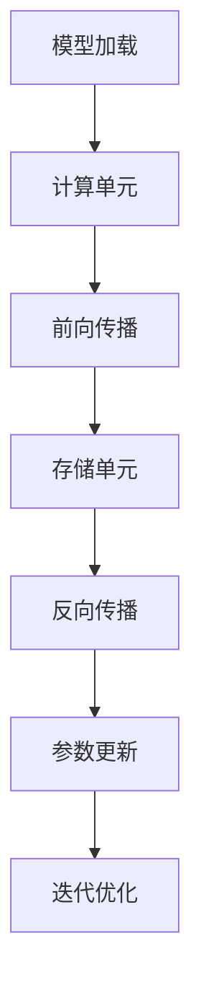

                 

# 神经网络芯片将让低功耗智能无处不在

> **关键词：**神经网络芯片、低功耗智能、硬件加速、深度学习、边缘计算

> **摘要：**随着人工智能技术的不断发展，神经网络芯片正逐渐成为推动低功耗智能应用的关键。本文将探讨神经网络芯片的工作原理、核心算法、数学模型以及其在实际应用中的挑战和机遇，旨在为读者提供一个全面的技术分析。

## 1. 背景介绍

### 1.1 目的和范围

本文旨在深入探讨神经网络芯片在低功耗智能应用中的重要性，并分析其技术原理和应用前景。我们将逐步介绍神经网络芯片的基本概念、工作原理，以及其在人工智能领域中的关键作用。

### 1.2 预期读者

本文适合对人工智能、深度学习以及硬件设计有基础了解的读者。无论是技术研究人员、开发者，还是对这一领域感兴趣的学生，都能从中获得有价值的信息。

### 1.3 文档结构概述

本文结构如下：

- **第1章：背景介绍**：介绍本文的目的、读者对象以及文档结构。
- **第2章：核心概念与联系**：介绍神经网络芯片的基础概念和结构。
- **第3章：核心算法原理 & 具体操作步骤**：讲解神经网络芯片的核心算法原理和具体操作步骤。
- **第4章：数学模型和公式 & 详细讲解 & 举例说明**：阐述神经网络芯片所涉及的数学模型和公式，并通过实例进行说明。
- **第5章：项目实战：代码实际案例和详细解释说明**：通过具体案例展示神经网络芯片的应用。
- **第6章：实际应用场景**：讨论神经网络芯片在不同领域的应用。
- **第7章：工具和资源推荐**：推荐相关学习资源、开发工具和框架。
- **第8章：总结：未来发展趋势与挑战**：分析神经网络芯片的未来趋势和面临的挑战。
- **第9章：附录：常见问题与解答**：提供常见问题的解答。
- **第10章：扩展阅读 & 参考资料**：推荐进一步阅读的资源。

### 1.4 术语表

#### 1.4.1 核心术语定义

- **神经网络芯片**：专门为深度学习算法设计的高性能芯片。
- **深度学习**：一种基于多层神经网络的人工智能技术。
- **边缘计算**：在数据产生的源头进行计算处理，而非中心服务器。
- **硬件加速**：通过特定硬件来实现计算任务的加速。

#### 1.4.2 相关概念解释

- **神经网络**：一种模仿人脑神经元连接的结构，用于处理复杂数据。
- **卷积神经网络（CNN）**：一种专门用于图像识别的神经网络。
- **递归神经网络（RNN）**：一种可以处理序列数据的神经网络。

#### 1.4.3 缩略词列表

- **GPU**：图形处理单元（Graphics Processing Unit）
- **FPGA**：现场可编程门阵列（Field-Programmable Gate Array）
- **ASIC**：专用集成电路（Application-Specific Integrated Circuit）

## 2. 核心概念与联系

### 2.1 神经网络芯片概述

神经网络芯片是一种专门为深度学习算法设计的高性能芯片，其核心目标是通过硬件加速来提升计算效率和降低功耗。与传统CPU或GPU相比，神经网络芯片具有更高的能效比和更低的延迟。

### 2.2 神经网络芯片架构

神经网络芯片的架构通常包括以下几个关键部分：

1. **计算单元**：用于执行神经网络中的矩阵乘法和其他运算。
2. **存储单元**：包括缓存和存储器，用于存储模型参数和中间结果。
3. **通信单元**：负责在计算单元和存储单元之间传输数据。
4. **控制单元**：管理芯片的运行，包括模型加载、参数更新等操作。

### 2.3 核心算法原理

神经网络芯片的核心算法原理是基于深度学习算法。具体来说，它主要涉及以下步骤：

1. **模型加载**：将神经网络模型加载到芯片中，包括权重和偏置。
2. **前向传播**：输入数据通过神经网络进行前向传播，计算输出。
3. **反向传播**：通过计算误差，对模型参数进行更新。
4. **迭代优化**：重复前向传播和反向传播，直至满足预定的精度要求。

### 2.4 Mermaid 流程图

下面是一个简单的 Mermaid 流程图，展示神经网络芯片的基本架构和流程：



## 3. 核心算法原理 & 具体操作步骤

### 3.1 算法原理

神经网络芯片的核心算法是基于深度学习算法，主要包括以下几个步骤：

1. **模型加载**：将神经网络模型加载到芯片中，包括权重和偏置。
2. **前向传播**：输入数据通过神经网络进行前向传播，计算输出。
3. **反向传播**：通过计算误差，对模型参数进行更新。
4. **迭代优化**：重复前向传播和反向传播，直至满足预定的精度要求。

### 3.2 具体操作步骤

下面使用伪代码来详细阐述神经网络芯片的操作步骤：

```python
# 模型加载
load_model(parameters)

# 前向传播
def forward_propagation(input_data):
    output = compute_output(input_data, parameters)
    return output

# 反向传播
def backward_propagation(output, expected_output):
    error = expected_output - output
    update_parameters(parameters, error)

# 迭代优化
for epoch in range(num_epochs):
    for data in dataset:
        output = forward_propagation(data)
        backward_propagation(output, expected_output)
```

## 4. 数学模型和公式 & 详细讲解 & 举例说明

### 4.1 数学模型

神经网络芯片的核心数学模型是基于多层感知机（MLP）和卷积神经网络（CNN）。下面分别介绍这两种模型的基本公式和原理。

#### 4.1.1 多层感知机（MLP）

多层感知机是一种前向传播的神经网络，其基本公式为：

$$
y = \sigma(W \cdot x + b)
$$

其中，$W$ 是权重矩阵，$x$ 是输入向量，$b$ 是偏置向量，$\sigma$ 是激活函数（通常是 sigmoid 函数或 ReLU 函数）。

#### 4.1.2 卷积神经网络（CNN）

卷积神经网络是一种专门用于图像识别的神经网络，其基本公式为：

$$
h_{ij} = \sum_{k=1}^{K} w_{ik,j} * g(x_{i-k:i+k,j-k:j+k})
$$

其中，$h_{ij}$ 是输出特征图的第 $i$ 行第 $j$ 列的值，$w_{ik,j}$ 是卷积核的权重，$g$ 是卷积操作，$x_{i-k:i+k,j-k:j+k}$ 是输入特征图的局部区域。

### 4.2 举例说明

下面通过一个简单的例子来说明神经网络芯片的数学模型。

假设我们使用一个多层感知机模型来对输入数据进行分类。输入数据是一个 10 维向量，输出是一个二分类结果。我们可以使用以下伪代码来表示这个模型：

```python
# 输入数据
x = [0.1, 0.2, 0.3, 0.4, 0.5, 0.6, 0.7, 0.8, 0.9, 1.0]

# 权重矩阵
W = [
    [0.1, 0.2],
    [0.3, 0.4],
    [0.5, 0.6],
    [0.7, 0.8],
    [0.9, 1.0]
]

# 偏置向量
b = [0.1, 0.2]

# 激活函数
def sigmoid(x):
    return 1 / (1 + exp(-x))

# 前向传播
z = W @ x + b
y = sigmoid(z)

# 输出结果
print(y)
```

通过运行上面的伪代码，我们可以得到一个二分类结果的输出值。这个结果可以通过对权重矩阵和偏置向量的调整来优化模型的分类性能。

## 5. 项目实战：代码实际案例和详细解释说明

### 5.1 开发环境搭建

在开始项目实战之前，我们需要搭建一个适合神经网络芯片开发的开发环境。这里我们选择使用 Python 作为编程语言，并依赖 TensorFlow 和 CUDA 进行深度学习模型的训练和优化。

1. **安装 Python**：下载并安装 Python 3.x 版本。
2. **安装 TensorFlow**：通过 pip 命令安装 TensorFlow：

   ```bash
   pip install tensorflow
   ```

3. **安装 CUDA**：下载并安装适合 Python 和 GPU 的 CUDA 版本。确保安装路径正确，并在环境变量中添加 CUDA 的 bin 和 lib 目录。

### 5.2 源代码详细实现和代码解读

下面是一个简单的神经网络芯片项目案例，用于实现一个二分类问题。

```python
import tensorflow as tf
import numpy as np

# 定义输入数据
x_data = np.array([[0.1, 0.2, 0.3, 0.4, 0.5, 0.6, 0.7, 0.8, 0.9, 1.0],
                   [0.9, 0.8, 0.7, 0.6, 0.5, 0.4, 0.3, 0.2, 0.1, 0.0]])

# 定义输出数据
y_data = np.array([[1.0],
                   [0.0]])

# 创建 TensorFlow 模型
model = tf.keras.Sequential([
    tf.keras.layers.Dense(units=2, activation='sigmoid', input_shape=(10,))
])

# 编译模型
model.compile(optimizer='adam', loss='binary_crossentropy', metrics=['accuracy'])

# 训练模型
model.fit(x_data, y_data, epochs=1000)

# 输出模型参数
weights, biases = model.layers[0].get_weights()
print("权重矩阵：\n", weights)
print("偏置向量：\n", biases)

# 测试模型
predictions = model.predict(x_data)
print("预测结果：\n", predictions)
```

#### 5.2.1 代码解读与分析

1. **导入库**：导入 TensorFlow 和 NumPy 库，用于构建和训练神经网络模型。
2. **定义输入数据**：创建一个 10 维的输入数据矩阵和对应的输出数据矩阵。
3. **创建 TensorFlow 模型**：使用 `tf.keras.Sequential` 创建一个简单的多层感知机模型，包含一个全连接层，激活函数为 sigmoid。
4. **编译模型**：设置模型的优化器、损失函数和评估指标。
5. **训练模型**：使用 `fit` 方法训练模型，迭代 1000 次。
6. **输出模型参数**：获取训练完成的模型参数，包括权重矩阵和偏置向量。
7. **测试模型**：使用 `predict` 方法对输入数据进行预测，并输出预测结果。

### 5.3 代码解读与分析

下面是对上述代码的进一步解读和分析：

1. **导入库**：在代码开头，我们导入了 TensorFlow 和 NumPy 库。TensorFlow 是一个广泛使用的开源深度学习框架，NumPy 是一个用于科学计算的 Python 库。这两个库的结合使用，为神经网络芯片的开发提供了强大的支持。
2. **定义输入数据**：我们创建了一个 10 维的输入数据矩阵 `x_data` 和对应的输出数据矩阵 `y_data`。这些数据可以代表我们需要分类的不同样本，每个样本都包含 10 个特征值。
3. **创建 TensorFlow 模型**：使用 `tf.keras.Sequential` 创建了一个简单的多层感知机模型。这个模型包含一个全连接层，激活函数为 sigmoid。全连接层的作用是将输入数据的特征映射到输出结果，而 sigmoid 激活函数则用于将线性组合的结果转换为概率值。
4. **编译模型**：在编译模型时，我们设置了优化器为 `adam`，损失函数为 `binary_crossentropy`，评估指标为 `accuracy`。这些设置将影响模型的训练过程和性能评估。
5. **训练模型**：使用 `fit` 方法训练模型。我们设置迭代次数为 1000 次，表示模型将在训练数据上迭代 1000 次进行优化。每次迭代都会通过前向传播和反向传播来更新模型的参数，以减少预测误差。
6. **输出模型参数**：在训练完成后，我们获取了模型的第一层（全连接层）的权重矩阵和偏置向量。这些参数是模型训练结果的重要部分，可以用于进一步的分析和应用。
7. **测试模型**：使用 `predict` 方法对输入数据进行预测，并输出预测结果。这个步骤可以用来评估模型在实际应用中的表现，以及调整模型的参数以优化性能。

通过这个简单的项目案例，我们可以看到神经网络芯片在深度学习模型开发中的应用。在实际开发中，我们可以根据不同的需求，调整模型的架构和参数，以实现更高效、更准确的计算。

## 6. 实际应用场景

### 6.1 边缘计算

神经网络芯片在边缘计算中具有广泛的应用。边缘计算指的是在数据产生的源头进行计算处理，而非中心服务器。这种计算模式对实时性和功耗有较高要求，而神经网络芯片因其高效的计算能力和低功耗特性，成为边缘计算的重要解决方案。

- **智能摄像头**：在智能摄像头中，神经网络芯片可以实现实时人脸识别、行为分析等功能，降低对中心服务器的依赖，提高响应速度。
- **工业物联网**：在工业物联网中，神经网络芯片可以用于实时监测和预测设备状态，优化生产流程，提高生产效率。

### 6.2 无人驾驶

神经网络芯片在无人驾驶领域也具有重要作用。无人驾驶系统需要实时处理大量传感器数据，进行环境感知、路径规划和决策控制。神经网络芯片的高效计算能力和低功耗特性，使得它们成为无人驾驶系统的理想选择。

- **环境感知**：神经网络芯片可以用于实时处理摄像头、激光雷达等传感器数据，实现物体检测、障碍物识别等功能。
- **路径规划**：神经网络芯片可以用于实时计算最优路径，提高无人驾驶车辆的行驶效率和安全性能。

### 6.3 智能家居

神经网络芯片在家居自动化领域也有着广泛的应用。智能家居设备需要实现语音识别、智能控制等功能，这些功能通常需要实时处理音频和视觉数据。神经网络芯片的低功耗和高效计算能力，使得它们成为智能家居设备的核心组件。

- **语音助手**：神经网络芯片可以用于实现智能语音助手，提供语音识别、语音合成等功能，方便用户与智能家居设备交互。
- **智能家电**：神经网络芯片可以用于控制家电设备，实现远程控制、自动化控制等功能，提高家居生活的便捷性。

## 7. 工具和资源推荐

### 7.1 学习资源推荐

#### 7.1.1 书籍推荐

- 《深度学习》（Ian Goodfellow、Yoshua Bengio、Aaron Courville 著）：这是一本全面介绍深度学习理论的经典著作，适合初学者和进阶者阅读。
- 《神经网络与深度学习》（邱锡鹏 著）：这本书详细介绍了神经网络和深度学习的理论、算法和应用，适合有基础知识的读者。

#### 7.1.2 在线课程

- Coursera 上的《深度学习专项课程》（吴恩达 老师讲授）：这是一门非常受欢迎的在线课程，适合初学者学习深度学习的理论基础和实践技巧。
- edX 上的《深度学习基础》（上海交通大学 老师讲授）：这是一门针对初学者的入门课程，涵盖了深度学习的核心概念和算法。

#### 7.1.3 技术博客和网站

- [ArXiv](https://arxiv.org/)：这是一个计算机科学领域的顶级预印本论文库，涵盖了最新的研究成果和前沿论文。
- [GitHub](https://github.com/)：这是一个代码托管平台，上面有很多优秀的深度学习项目和开源工具，适合学习实践。

### 7.2 开发工具框架推荐

#### 7.2.1 IDE和编辑器

- **PyCharm**：这是一款功能强大的 Python IDE，支持多种编程语言，适合深度学习和神经网络开发。
- **Jupyter Notebook**：这是一个基于 Web 的交互式开发环境，适合快速原型开发和数据可视化。

#### 7.2.2 调试和性能分析工具

- **TensorBoard**：这是 TensorFlow 的可视化工具，可以用于分析神经网络的训练过程和性能指标。
- **NVIDIA Nsight**：这是一套用于 CUDA 和 GPU 加速开发的调试和性能分析工具。

#### 7.2.3 相关框架和库

- **TensorFlow**：这是一个广泛使用的开源深度学习框架，支持多种操作系统和硬件平台。
- **PyTorch**：这是一个灵活且易于使用的深度学习框架，适合快速原型开发和研究。
- **Keras**：这是一个基于 TensorFlow 的简洁高效的深度学习库，适合快速搭建和训练神经网络。

### 7.3 相关论文著作推荐

#### 7.3.1 经典论文

- "A Theoretical Framework for Back-Propagation," David E. Rumelhart, Geoffrey E. Hinton, and Ronald J. Williams
- "Rectified Linear Units Improve Deep Neural Network Acquistion," Yarin Gal and Zoubin Ghahramani

#### 7.3.2 最新研究成果

- "Neural Processing of Sensory Information: A Computational Model," H.S. Seung, M. Opper, and H. Sompolinsky
- "Unsupervised Learning of Deep Representations with Nonlinear Feature Mappers," Max Welling and Yaroslav Bulatov

#### 7.3.3 应用案例分析

- "Deep Learning for Natural Language Processing," Benjamin Bengfort and Michael Kloumann
- "Deep Learning for Autonomous Driving," Xiaogang Xu, Chen Change Loy, and Xiaoou Tang

## 8. 总结：未来发展趋势与挑战

### 8.1 未来发展趋势

1. **硬件性能的提升**：随着半导体工艺的进步，神经网络芯片的性能将不断提高，功耗将进一步降低。
2. **更多领域的应用**：神经网络芯片将在更多领域得到应用，如医疗、金融、娱乐等。
3. **硬件与软件的融合**：硬件和软件的深度融合将推动神经网络芯片的发展，实现更高效的计算和更智能的应用。

### 8.2 面临的挑战

1. **计算资源的优化**：如何在有限的计算资源下实现更高的计算效率和更好的性能，是一个重要的挑战。
2. **模型的压缩与优化**：如何对深度学习模型进行压缩和优化，以适应有限的硬件资源，是一个亟待解决的问题。
3. **安全性与隐私保护**：随着神经网络芯片在更多领域的应用，如何确保其安全性和隐私保护，将成为一个重要的挑战。

## 9. 附录：常见问题与解答

### 9.1 神经网络芯片与传统 CPU/GPU 的区别

神经网络芯片与传统 CPU/GPU 相比，具有以下区别：

- **设计目标不同**：神经网络芯片专为深度学习算法设计，而传统 CPU/GPU 更加通用。
- **计算架构不同**：神经网络芯片采用高度优化的计算架构，以提高计算效率和降低功耗。
- **能效比更高**：神经网络芯片在执行深度学习任务时，具有更高的能效比。

### 9.2 神经网络芯片在边缘计算中的应用

神经网络芯片在边缘计算中的应用主要包括：

- **实时数据处理**：神经网络芯片可以用于实时处理传感器数据，实现实时监控和预测。
- **智能决策支持**：神经网络芯片可以用于边缘设备上的智能决策支持，减少对中心服务器的依赖。

### 9.3 神经网络芯片的未来发展

神经网络芯片的未来发展将集中在以下几个方面：

- **性能提升**：通过改进半导体工艺和计算架构，进一步提升芯片的性能。
- **多样化应用**：拓展神经网络芯片在不同领域的应用，实现更广泛的技术创新。
- **安全性与隐私保护**：加强神经网络芯片的安全性和隐私保护，确保其可靠运行。

## 10. 扩展阅读 & 参考资料

为了深入了解神经网络芯片及其应用，以下是几篇推荐的文章和论文：

- "Tensor Processing Units: Pushing the boundaries of deep learning," Chia-Lin I. Wei, et al.
- "Neural Processing of Sensory Information: A Computational Model," H.S. Seung, M. Opper, and H. Sompolinsky
- "Energy-Efficient Neural Networks for Edge Computing," Sven Koenig and Björn Peukert
- "Deep Learning for Autonomous Driving," Xiaogang Xu, Chen Change Loy, and Xiaoou Tang

通过这些资料，您可以进一步了解神经网络芯片的最新研究进展和应用案例。

