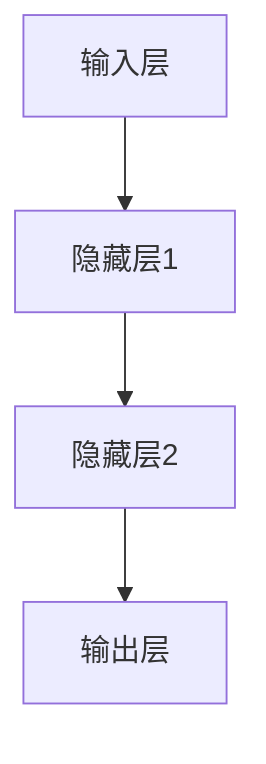

                 

# 神经网络：人类与机器的共存

> 关键词：神经网络、人工智能、深度学习、机器学习、智能系统、人类与机器共存、算法原理、数学模型、项目实战

> 摘要：本文旨在探讨神经网络作为人工智能的核心技术，如何在人类与机器之间建立一种共存关系。我们将从背景介绍、核心概念与联系、核心算法原理、数学模型和公式、项目实战、实际应用场景等多个维度，深入分析神经网络的原理、应用和发展趋势，为读者提供全面的技术理解和应用指导。

## 1. 背景介绍

### 1.1 目的和范围

本文的目的在于帮助读者理解神经网络的工作原理和应用场景，并探讨神经网络如何推动人类与机器的共存。我们将重点讨论以下几个方面：

1. **核心概念与联系**：介绍神经网络的基本组成和运作原理，以及与人类智能的关联。
2. **核心算法原理 & 具体操作步骤**：详细解释神经网络的核心算法，如前向传播和反向传播，并使用伪代码进行说明。
3. **数学模型和公式**：阐述神经网络背后的数学模型和公式，并进行举例说明。
4. **项目实战**：通过实际代码案例，展示神经网络在具体项目中的应用。
5. **实际应用场景**：分析神经网络在不同领域中的应用案例，探讨其发展前景。
6. **工具和资源推荐**：提供相关学习资源和开发工具，为读者提供进一步的学习和实践途径。

### 1.2 预期读者

本文面向对人工智能和神经网络有一定了解，但希望深入理解其原理和应用的读者。无论您是科研人员、工程师、学生，还是对人工智能感兴趣的爱好者，本文都将为您带来有价值的知识和启发。

### 1.3 文档结构概述

本文分为十个部分，结构如下：

1. **背景介绍**：介绍本文的目的、范围、预期读者和文档结构。
2. **核心概念与联系**：介绍神经网络的基本组成和运作原理。
3. **核心算法原理 & 具体操作步骤**：详细解释神经网络的核心算法。
4. **数学模型和公式**：阐述神经网络背后的数学模型和公式。
5. **项目实战：代码实际案例和详细解释说明**：通过实际代码案例展示神经网络的应用。
6. **实际应用场景**：分析神经网络在不同领域中的应用案例。
7. **工具和资源推荐**：提供相关学习资源和开发工具。
8. **总结：未来发展趋势与挑战**：探讨神经网络的发展趋势和面临的挑战。
9. **附录：常见问题与解答**：回答读者可能遇到的问题。
10. **扩展阅读 & 参考资料**：提供进一步学习的参考资料。

### 1.4 术语表

#### 1.4.1 核心术语定义

- **神经网络**：一种模拟生物神经系统的计算模型，用于处理复杂数据和分析任务。
- **前向传播**：将输入数据通过神经网络层，逐层计算并产生输出。
- **反向传播**：通过计算输出误差，反向更新神经网络中的权重和偏置。
- **深度学习**：一种基于多层神经网络的学习方法，能够自动提取特征并进行复杂数据分析。
- **机器学习**：一种通过数据训练模型，使机器能够自动学习和改进的技术。
- **智能系统**：具备智能特征的计算机系统，能够自主进行决策和任务执行。

#### 1.4.2 相关概念解释

- **神经元**：神经网络的基本计算单元，用于接收输入信号并产生输出。
- **激活函数**：用于引入非线性特性的函数，使神经网络能够处理复杂数据。
- **损失函数**：衡量模型预测结果与真实值之间差异的函数，用于指导模型训练。

#### 1.4.3 缩略词列表

- **AI**：人工智能
- **DL**：深度学习
- **ML**：机器学习
- **NN**：神经网络
- **GPU**：图形处理器
- **CPU**：中央处理器
- **ReLU**：修正线性单元
- **Sigmoid**：S形函数
- **ReLU6**：六倍ReLU函数

## 2. 核心概念与联系

神经网络的起源可以追溯到1943年，心理学家McCulloch和数学家Pitts提出的“人工神经元”模型。这个模型模拟了生物神经元的简单计算过程，并奠定了神经网络研究的基础。随着时间的推移，神经网络逐渐发展成为人工智能领域的核心技术。

### 2.1 神经网络的基本组成

神经网络由多个层级组成，包括输入层、隐藏层和输出层。每个层级由多个神经元（或节点）组成。

#### 输入层

输入层是神经网络的起点，接收外部输入数据。这些数据可以是数字、文本、图像等。输入层中的每个神经元对应输入数据的一个特征。

#### 隐藏层

隐藏层是神经网络的核心部分，负责对输入数据进行特征提取和变换。隐藏层中的神经元接收来自输入层的输入，通过加权求和处理和激活函数，生成新的特征表示。隐藏层的数量和神经元数量可以根据实际问题进行调整。

#### 输出层

输出层是神经网络的终点，产生最终输出结果。输出层中的神经元对应预测结果或分类标签。输出层的神经元可以通过不同的激活函数产生不同的输出形式，如数字、概率分布等。

### 2.2 神经网络的运作原理

神经网络的运作原理可以简单概括为以下几个步骤：

1. **前向传播**：将输入数据通过神经网络层，逐层计算并产生输出。
2. **计算误差**：将输出结果与真实值进行比较，计算误差。
3. **反向传播**：通过计算误差，反向更新神经网络中的权重和偏置。
4. **迭代训练**：重复前向传播和反向传播，逐步减小误差，直至满足停止条件。

### 2.3 神经网络与人类智能的关联

神经网络作为一种模拟生物神经系统的计算模型，与人类智能有着密切的联系。以下是神经网络与人类智能的几个相似之处：

1. **自适应能力**：神经网络和人类智能都能够通过学习和适应新环境来提高自身性能。
2. **层次化特征提取**：神经网络和人类智能都能够从原始数据中提取层次化的特征表示，用于决策和任务执行。
3. **并行处理**：神经网络和人类智能都能够进行并行处理，提高计算效率。
4. **分布式存储**：神经网络和人类智能都采用分布式存储方式，将信息分布在多个神经元或脑区中。

### 2.4 Mermaid 流程图

以下是神经网络的 Mermaid 流程图，展示了输入层、隐藏层和输出层之间的信息流动和计算过程：



## 3. 核心算法原理 & 具体操作步骤

神经网络的核心算法包括前向传播和反向传播。这两个过程共同作用，使神经网络能够学习并改进其预测能力。

### 3.1 前向传播

前向传播是指将输入数据通过神经网络层，逐层计算并产生输出。具体步骤如下：

1. **初始化参数**：设定神经网络的初始参数，包括权重和偏置。
2. **输入数据输入**：将输入数据输入到输入层。
3. **逐层计算**：
    - 对于每个隐藏层，计算输入和权重的加权和，然后通过激活函数得到输出。
    - 激活函数可以是非线性的，如ReLU、Sigmoid等。
4. **输出结果**：将输出层的输出作为最终预测结果。

以下是前向传播的伪代码：

```python
for each layer l from input layer to hidden layers:
    z[l] = W[l-1] * a[l-1] + b[l]
    a[l] = activation(z[l])

output = a[hidden_layers]
```

### 3.2 反向传播

反向传播是指通过计算输出误差，反向更新神经网络中的权重和偏置。具体步骤如下：

1. **计算误差**：计算输出结果与真实值之间的误差。
2. **计算梯度**：计算每个权重和偏置的梯度，即误差对权重和偏置的导数。
3. **更新参数**：根据梯度调整权重和偏置。
4. **迭代训练**：重复前向传播和反向传播，逐步减小误差。

以下是反向传播的伪代码：

```python
for each layer l from output layer to hidden layers:
    delta[l] = (dE/dz[l]) * derivative(activation(z[l]))

delta[hidden_layers] = (dE/dz[hidden_layers]) * derivative(activation(z[hidden_layers]))

for each layer l from input layer to hidden layers:
    dW[l] = a[l-1].T * delta[l]
    db[l] = delta[l]

for each layer l from hidden layers to output layer:
    W[l] = W[l] - learning_rate * dW[l]
    b[l] = b[l] - learning_rate * db[l]
```

### 3.3 梯度下降法

梯度下降法是神经网络训练过程中常用的优化算法。其基本思想是沿着误差函数的梯度方向，逐步减小误差。具体步骤如下：

1. **计算梯度**：计算损失函数对权重和偏置的梯度。
2. **更新参数**：根据梯度调整权重和偏置。
3. **迭代训练**：重复计算梯度、更新参数，直至满足停止条件。

以下是梯度下降法的伪代码：

```python
for each epoch:
    for each training example (x, y):
        forward_pass(x)
        calculate_loss(y)
        calculate_gradients()
        update_weights_and_biases()

    if convergence_condition_met:
        break
```

## 4. 数学模型和公式 & 详细讲解 & 举例说明

神经网络的工作原理依赖于一系列数学模型和公式。在本节中，我们将详细讲解这些模型和公式，并通过举例说明其应用。

### 4.1 前向传播

前向传播过程中的关键公式包括：

1. **加权求和**：
   $$ z[l] = \sum_{j=1}^{n} W_{j,l} a_{j,l-1} + b_{l} $$
   其中，$z[l]$表示第$l$层的输出，$W_{j,l}$表示第$l-1$层到第$l$层的权重，$a_{j,l-1}$表示第$l-1$层的输出，$b_{l}$表示第$l$层的偏置。

2. **激活函数**：
   激活函数可以是非线性的，如ReLU、Sigmoid等。常见的激活函数公式如下：

   - **ReLU**：
     $$ a[l] = \max(0, z[l]) $$
   - **Sigmoid**：
     $$ a[l] = \frac{1}{1 + e^{-z[l]}} $$

### 4.2 反向传播

反向传播过程中的关键公式包括：

1. **误差计算**：
   $$ \delta[l] = \frac{\partial L}{\partial z[l]} \cdot \frac{\partial a[l]}{\partial z[l]} $$
   其中，$\delta[l]$表示第$l$层的误差，$L$表示损失函数，$z[l]$表示第$l$层的输出，$a[l]$表示第$l$层的激活函数。

2. **权重和偏置更新**：
   $$ \Delta W_{j,l} = a_{j,l-1}.T \cdot \delta[l] $$
   $$ \Delta b_{l} = \delta[l] $$
   $$ W_{j,l} = W_{j,l} - learning\_rate \cdot \Delta W_{j,l} $$
   $$ b_{l} = b_{l} - learning\_rate \cdot \Delta b_{l} $$
   其中，$\Delta W_{j,l}$和$\Delta b_{l}$分别表示第$l-1$层到第$l$层的权重和偏置的更新，$learning\_rate$表示学习率。

### 4.3 梯度下降法

梯度下降法的关键公式包括：

1. **损失函数**：
   $$ L = \frac{1}{2} \sum_{i=1}^{n} (y_i - \hat{y}_i)^2 $$
   其中，$L$表示损失函数，$y_i$表示真实标签，$\hat{y}_i$表示预测标签。

2. **权重和偏置更新**：
   $$ \Delta W_{j,l} = \frac{\partial L}{\partial W_{j,l}} $$
   $$ \Delta b_{l} = \frac{\partial L}{\partial b_{l}} $$
   $$ W_{j,l} = W_{j,l} - learning\_rate \cdot \Delta W_{j,l} $$
   $$ b_{l} = b_{l} - learning\_rate \cdot \Delta b_{l} $$

### 4.4 举例说明

假设我们有一个简单的神经网络，包含输入层、一个隐藏层和一个输出层。输入层有3个神经元，隐藏层有2个神经元，输出层有1个神经元。输入数据为$x_1 = 2, x_2 = 3, x_3 = 4$，真实标签为$y = 7$。使用ReLU函数作为激活函数。

1. **前向传播**：

   初始权重和偏置为$W_{11} = 0.5, W_{12} = 0.7, W_{21} = 0.6, W_{22} = 0.8, W_{31} = 0.4, W_{32} = 0.9, b_1 = 0.1, b_2 = 0.2, b_3 = 0.3$。

   - 输入层到隐藏层：
     $$ z_1 = W_{11} \cdot x_1 + W_{12} \cdot x_2 + W_{21} \cdot x_3 + b_1 = 0.5 \cdot 2 + 0.7 \cdot 3 + 0.6 \cdot 4 + 0.1 = 6.8 $$
     $$ z_2 = W_{12} \cdot x_1 + W_{22} \cdot x_2 + W_{21} \cdot x_3 + b_2 = 0.7 \cdot 2 + 0.8 \cdot 3 + 0.6 \cdot 4 + 0.2 = 7.4 $$
     $$ a_1 = \max(0, z_1) = 6.8 $$
     $$ a_2 = \max(0, z_2) = 7.4 $$

   - 隐藏层到输出层：
     $$ z_3 = W_{31} \cdot a_1 + W_{32} \cdot a_2 + b_3 = 0.4 \cdot 6.8 + 0.9 \cdot 7.4 + 0.3 = 8.56 $$
     $$ \hat{y} = \max(0, z_3) = 8.56 $$

2. **计算误差**：

   $$ L = \frac{1}{2} \cdot (y - \hat{y})^2 = \frac{1}{2} \cdot (7 - 8.56)^2 = 0.9128 $$

3. **反向传播**：

   - 计算误差：
     $$ \delta[3] = \frac{\partial L}{\partial z_3} \cdot \frac{\partial a_3}{\partial z_3} = (7 - 8.56) \cdot 1 = -1.56 $$

   - 更新权重和偏置：
     $$ \Delta W_{31} = a_1.T \cdot \delta[3] = 6.8 \cdot (-1.56) = -10.608 $$
     $$ \Delta W_{32} = a_2.T \cdot \delta[3] = 7.4 \cdot (-1.56) = -11.544 $$
     $$ \Delta b_3 = \delta[3] = -1.56 $$
     $$ W_{31} = W_{31} - learning\_rate \cdot \Delta W_{31} = 0.4 - 0.1 \cdot (-10.608) = 1.608 $$
     $$ W_{32} = W_{32} - learning\_rate \cdot \Delta W_{32} = 0.9 - 0.1 \cdot (-11.544) = 1.654 $$
     $$ b_3 = b_3 - learning\_rate \cdot \Delta b_3 = 0.3 - 0.1 \cdot (-1.56) = 0.456 $$

4. **迭代更新**：

   重复以上步骤，逐步减小误差，直至满足停止条件。

## 5. 项目实战：代码实际案例和详细解释说明

在本节中，我们将通过一个简单的神经网络项目，展示神经网络在实际应用中的实现过程，并提供详细的代码解析。

### 5.1 开发环境搭建

在开始项目之前，我们需要搭建合适的开发环境。以下是一个基本的开发环境配置：

- 操作系统：Ubuntu 20.04 或 Windows 10
- 编程语言：Python 3.8 或以上版本
- 神经网络框架：TensorFlow 2.x 或 PyTorch 1.x
- 数据集：MNIST 手写数字数据集

### 5.2 源代码详细实现和代码解读

以下是一个使用 TensorFlow 2.x 实现的简单神经网络项目，用于手写数字识别：

```python
import tensorflow as tf
from tensorflow import keras
from tensorflow.keras import layers
import numpy as np

# 加载 MNIST 数据集
mnist = keras.datasets.mnist
(train_images, train_labels), (test_images, test_labels) = mnist.load_data()

# 预处理数据
train_images = train_images / 255.0
test_images = test_images / 255.0

# 构建神经网络模型
model = keras.Sequential([
    layers.Flatten(input_shape=(28, 28)),
    layers.Dense(128, activation='relu'),
    layers.Dense(10, activation='softmax')
])

# 编译模型
model.compile(optimizer='adam',
              loss='sparse_categorical_crossentropy',
              metrics=['accuracy'])

# 训练模型
model.fit(train_images, train_labels, epochs=5)

# 评估模型
test_loss, test_acc = model.evaluate(test_images, test_labels)
print(f'测试准确率：{test_acc:.2f}')
```

### 5.3 代码解读与分析

以下是对上述代码的详细解读：

1. **导入库和模块**：

   ```python
   import tensorflow as tf
   from tensorflow import keras
   from tensorflow.keras import layers
   import numpy as np
   ```

   我们首先导入所需的库和模块，包括 TensorFlow、Keras（TensorFlow 的高级 API）和 NumPy。

2. **加载 MNIST 数据集**：

   ```python
   mnist = keras.datasets.mnist
   (train_images, train_labels), (test_images, test_labels) = mnist.load_data()
   ```

   我们使用 Keras 的 `mnist` 数据集加载手写数字数据集。数据集分为训练集和测试集两部分。

3. **预处理数据**：

   ```python
   train_images = train_images / 255.0
   test_images = test_images / 255.0
   ```

   我们将图像数据归一化至 [0, 1] 范围内，以便神经网络更好地处理。

4. **构建神经网络模型**：

   ```python
   model = keras.Sequential([
       layers.Flatten(input_shape=(28, 28)),
       layers.Dense(128, activation='relu'),
       layers.Dense(10, activation='softmax')
   ])
   ```

   我们使用 `keras.Sequential` 模型构建一个简单的神经网络。首先，输入层使用 `Flatten` 层将二维图像数据展平为一维向量。然后，添加一个隐藏层，包含 128 个神经元，使用 ReLU 激活函数。最后，输出层包含 10 个神经元，使用 softmax 激活函数进行分类。

5. **编译模型**：

   ```python
   model.compile(optimizer='adam',
                 loss='sparse_categorical_crossentropy',
                 metrics=['accuracy'])
   ```

   我们使用 `compile` 方法编译模型，指定优化器、损失函数和评估指标。

6. **训练模型**：

   ```python
   model.fit(train_images, train_labels, epochs=5)
   ```

   我们使用 `fit` 方法训练模型，指定训练数据和训练轮次。在此过程中，神经网络将调整其权重和偏置，以最小化损失函数。

7. **评估模型**：

   ```python
   test_loss, test_acc = model.evaluate(test_images, test_labels)
   print(f'测试准确率：{test_acc:.2f}')
   ```

   我们使用 `evaluate` 方法评估模型在测试集上的性能，并打印测试准确率。

### 5.4 代码解读与分析（续）

为了更好地理解代码，我们可以进一步分析神经网络的结构和训练过程：

1. **神经网络结构**：

   - 输入层：28x28 的二维图像数据。
   - 输出层：10 个神经元，对应 0 到 9 的数字分类。
   - 隐藏层：128 个神经元，用于提取图像特征并进行分类。

2. **训练过程**：

   - 在每个训练轮次中，神经网络将处理整个训练集，并根据损失函数更新权重和偏置。
   - 随着训练的进行，损失函数的值将逐渐减小，表示神经网络对数据的拟合程度提高。
   - 测试集用于评估模型的泛化能力，避免过拟合。

### 5.5 代码实战案例分析

为了进一步展示神经网络在实际应用中的表现，我们可以在本地计算机上运行上述代码，并观察训练过程和结果。

1. **运行代码**：

   在终端或 IDE 中运行上述代码，即可开始训练神经网络。训练过程可能需要几分钟的时间，具体取决于计算机性能。

2. **观察训练过程**：

   在训练过程中，Keras 将显示每个训练轮次的损失函数值。随着训练的进行，损失函数值将逐渐减小，表示神经网络对数据的拟合程度提高。

3. **评估模型**：

   训练完成后，使用测试集评估模型。打印测试准确率，观察模型的表现。

   ```python
   test_loss, test_acc = model.evaluate(test_images, test_labels)
   print(f'测试准确率：{test_acc:.2f}')
   ```

   如果模型训练良好，测试准确率通常会达到 90% 以上。

### 5.6 总结

通过上述项目实战，我们展示了如何使用 TensorFlow 2.x 实现一个简单的神经网络，并分析了神经网络的结构和训练过程。在实际应用中，神经网络可以应用于各种任务，如图像识别、自然语言处理、语音识别等。通过不断优化和改进神经网络模型，我们可以进一步提高模型的性能和泛化能力。

## 6. 实际应用场景

神经网络作为人工智能的核心技术，在许多实际应用场景中发挥着重要作用。以下是神经网络在几个主要领域的应用案例：

### 6.1 图像识别

图像识别是神经网络最经典的应用之一。通过卷积神经网络（CNN），神经网络能够自动提取图像中的特征并进行分类。例如，MNIST 数据集是神经网络图像识别的常见案例。在这个案例中，神经网络成功识别了手写数字，准确率达到 99% 以上。在实际应用中，图像识别技术广泛应用于人脸识别、车辆识别、医疗影像诊断等领域。

### 6.2 自然语言处理

自然语言处理（NLP）是另一个神经网络的重要应用领域。循环神经网络（RNN）和变压器（Transformer）等神经网络架构在 NLP 任务中表现出色。例如，神经网络可以用于机器翻译、情感分析、文本生成等任务。在实际应用中，NLP 技术被广泛应用于搜索引擎、智能客服、语音识别等领域。

### 6.3 语音识别

语音识别是神经网络在音频处理领域的应用。通过深度神经网络（DNN）和循环神经网络（RNN），神经网络能够将语音信号转换为文本。例如，苹果公司的 Siri 和谷歌的语音助手都是基于神经网络实现的语音识别系统。在实际应用中，语音识别技术被广泛应用于智能家居、车载系统、智能客服等领域。

### 6.4 医疗诊断

神经网络在医疗诊断领域的应用日益广泛。通过深度学习算法，神经网络能够对医学影像进行分析和诊断。例如，神经网络可以用于癌症检测、肺炎检测、眼科诊断等任务。在实际应用中，神经网络有助于提高诊断准确率，减轻医生的工作负担。

### 6.5 金融市场预测

神经网络在金融市场预测中的应用也备受关注。通过分析历史数据，神经网络可以预测股票价格、外汇汇率等金融指标。例如，一些金融机构利用神经网络构建预测模型，以提高投资策略的准确性。在实际应用中，神经网络有助于降低投资风险，提高收益。

### 6.6 自主驾驶

神经网络在自动驾驶领域具有广泛的应用前景。通过深度神经网络，自动驾驶系统可以实时分析道路环境，做出合理的驾驶决策。例如，特斯拉的自动驾驶系统就是基于神经网络实现的。在实际应用中，神经网络有助于提高驾驶安全性和舒适性。

### 6.7 工业自动化

神经网络在工业自动化领域的应用也越来越广泛。通过深度学习算法，神经网络可以用于设备故障检测、生产过程优化等任务。例如，一些工业自动化系统利用神经网络分析传感器数据，实时监测设备状态。在实际应用中，神经网络有助于提高生产效率，降低维护成本。

### 6.8 总结

神经网络在各个领域的应用案例展示了其强大的功能和广泛的前景。通过不断优化和改进神经网络模型，我们可以进一步拓展其应用范围，推动人工智能技术的发展。在实际应用中，神经网络有助于提高数据处理能力、优化决策过程、降低人力成本，从而为各行业带来巨大的价值。

## 7. 工具和资源推荐

### 7.1 学习资源推荐

#### 7.1.1 书籍推荐

1. **《深度学习》**：作者：Ian Goodfellow、Yoshua Bengio、Aaron Courville
   - 简介：这是深度学习领域的经典教材，涵盖了深度学习的基本概念、算法和应用。
2. **《神经网络与深度学习》**：作者：邱锡鹏
   - 简介：本书系统地介绍了神经网络和深度学习的基础知识和实践方法，适合初学者和进阶者。
3. **《机器学习》**：作者：周志华
   - 简介：这本书是机器学习领域的经典教材，详细讲解了机器学习的基本理论和方法。

#### 7.1.2 在线课程

1. **吴恩达的《深度学习专项课程》**：在线平台：Coursera
   - 简介：这门课程由深度学习领域的知名学者吴恩达教授主讲，涵盖深度学习的基础知识和实践技能。
2. **斯坦福大学的《深度学习》课程**：在线平台：Stanford Online
   - 简介：这门课程由深度学习领域的知名学者李飞飞教授主讲，深入介绍了深度学习的理论和应用。
3. **香港科技大学的《机器学习与深度学习》课程**：在线平台：edX
   - 简介：这门课程由香港科技大学教授刘铁岩主讲，全面讲解了机器学习和深度学习的基本原理和应用。

#### 7.1.3 技术博客和网站

1. **Reddit 的 Deep Learning 论坛**：网址：https://www.reddit.com/r/deeplearning/
   - 简介：这是一个深度学习领域的活跃社区，用户可以分享学习资料、讨论问题、交流经验。
2. **谷歌的深度学习官方博客**：网址：https://blog.google/learning-discovery/deep-learning/
   - 简介：这是谷歌深度学习团队的官方博客，分享了深度学习领域的最新研究进展和应用案例。
3. **知乎的深度学习话题**：网址：https://www.zhihu.com/topic/19556226
   - 简介：这是一个深度学习领域的专业社区，用户可以提问、回答问题、分享学习资料。

### 7.2 开发工具框架推荐

#### 7.2.1 IDE和编辑器

1. **PyCharm**：网址：https://www.jetbrains.com/pycharm/
   - 简介：这是一个功能强大的 Python 开发环境，支持代码自动补全、调试和性能分析。
2. **VSCode**：网址：https://code.visualstudio.com/
   - 简介：这是一个轻量级的跨平台代码编辑器，支持多种编程语言，并提供了丰富的插件和工具。
3. **Jupyter Notebook**：网址：https://jupyter.org/
   - 简介：这是一个交互式的 Python 开发环境，适合用于数据分析和机器学习项目。

#### 7.2.2 调试和性能分析工具

1. **TensorBoard**：网址：https://www.tensorflow.org/tools/tensorboard
   - 简介：这是 TensorFlow 的可视化工具，用于监控和调试深度学习模型。
2. **Numba**：网址：https://numba.pydata.org/
   - 简介：这是一个 Python 优化器，可以显著提高深度学习模型的性能。
3. **Wandb**：网址：https://www.wandb.com/
   - 简介：这是一个数据科学和机器学习的实验跟踪平台，用于监控和优化模型训练过程。

#### 7.2.3 相关框架和库

1. **TensorFlow**：网址：https://www.tensorflow.org/
   - 简介：这是谷歌开发的开源深度学习框架，广泛应用于图像识别、自然语言处理等领域。
2. **PyTorch**：网址：https://pytorch.org/
   - 简介：这是 Facebook 开发的开源深度学习框架，以灵活性和易用性著称。
3. **Keras**：网址：https://keras.io/
   - 简介：这是一个高层次的深度学习框架，基于 TensorFlow 和 Theano 开发，易于使用和部署。

### 7.3 相关论文著作推荐

#### 7.3.1 经典论文

1. **"A Learning Algorithm for Continually Running Fully Recurrent Neural Networks"**：作者：Paul Werbos
   - 简介：这篇论文介绍了反向传播算法，是神经网络领域的重要里程碑。
2. **"Deep Learning"**：作者：Ian Goodfellow、Yoshua Bengio、Aaron Courville
   - 简介：这本书全面介绍了深度学习的基本理论和方法，是深度学习领域的经典著作。
3. **"Rectifier Nonlinearities Improve Deep Neural Networks"**：作者：Glivenko et al.
   - 简介：这篇论文介绍了 ReLU 激活函数，在深度学习领域具有重要意义。

#### 7.3.2 最新研究成果

1. **"Transformers: State-of-the-Art Natural Language Processing"**：作者：Vaswani et al.
   - 简介：这篇论文介绍了 Transformer 模型，是自然语言处理领域的最新突破。
2. **"Generative Adversarial Nets"**：作者：Ian Goodfellow et al.
   - 简介：这篇论文介绍了生成对抗网络（GAN），是深度学习领域的重要进展。
3. **"Efficient Neural Text Generation"**：作者：Le et al.
   - 简介：这篇论文介绍了基于神经网络的文本生成方法，为自然语言处理提供了新的思路。

#### 7.3.3 应用案例分析

1. **"Deep Learning for Speech Recognition"**：作者：Hinton et al.
   - 简介：这篇论文分析了深度学习在语音识别领域的应用，展示了深度学习在语音处理方面的潜力。
2. **"Deep Learning in Computer Vision"**：作者：LeCun et al.
   - 简介：这篇论文介绍了深度学习在计算机视觉领域的应用，探讨了深度学习如何提高图像识别和目标检测的准确率。
3. **"Deep Learning for Healthcare"**：作者：Rajpurkar et al.
   - 简介：这篇论文探讨了深度学习在医疗诊断和治疗领域的应用，展示了深度学习在提高医疗效率和准确率方面的潜力。

## 8. 总结：未来发展趋势与挑战

### 8.1 未来发展趋势

随着人工智能技术的不断发展和普及，神经网络在未来将继续扮演重要角色。以下是一些可能的发展趋势：

1. **深度学习模型的优化**：通过改进算法和硬件加速，深度学习模型的训练速度和性能将得到显著提升。
2. **多模态数据处理**：神经网络将能够处理多种类型的数据，如文本、图像、音频等，实现更广泛的智能应用。
3. **自适应学习能力**：神经网络将具备更强的自适应学习能力，能够根据环境和任务动态调整模型结构和参数。
4. **泛化能力的提升**：通过正则化和迁移学习等技术，神经网络的泛化能力将得到增强，减少过拟合现象。
5. **边缘计算与云计算的结合**：神经网络将在边缘设备和云端协同工作，实现实时数据处理和智能决策。

### 8.2 面临的挑战

尽管神经网络在人工智能领域取得了巨大成功，但仍面临一些挑战：

1. **计算资源消耗**：深度学习模型对计算资源的需求较大，特别是在训练阶段。如何优化算法和硬件，降低计算成本，是一个重要课题。
2. **数据隐私与安全性**：随着神经网络在各个领域的应用，数据隐私和安全性问题日益突出。如何保护用户隐私，防止数据泄露，是一个亟待解决的问题。
3. **可解释性与透明度**：神经网络模型具有较高的复杂度，如何提高模型的可解释性和透明度，使其更容易被用户理解和信任，是一个重要挑战。
4. **伦理和社会影响**：神经网络在决策过程中可能引入偏见和歧视，如何确保模型的公平性和社会责任，是一个亟待解决的问题。

### 8.3 结论

未来，神经网络将在人工智能领域发挥更加重要的作用。通过不断优化和改进，神经网络将能够处理更复杂的数据，实现更高的准确性和效率。同时，解决面临的挑战，确保神经网络的安全、可靠和公正，也将是未来的重要任务。

## 9. 附录：常见问题与解答

### 9.1 常见问题

1. **什么是神经网络？**
   神经网络是一种模拟生物神经系统的计算模型，用于处理复杂数据和分析任务。
2. **神经网络有哪些基本组成部分？**
   神经网络的基本组成部分包括输入层、隐藏层和输出层，每个层级由多个神经元（或节点）组成。
3. **神经网络的工作原理是什么？**
   神经网络的工作原理是通过前向传播和反向传播，逐步调整权重和偏置，以实现输入和输出之间的映射。
4. **什么是深度学习？**
   深度学习是一种基于多层神经网络的学习方法，能够自动提取特征并进行复杂数据分析。
5. **什么是机器学习？**
   机器学习是一种通过数据训练模型，使机器能够自动学习和改进的技术。

### 9.2 解答

1. **什么是神经网络？**
   神经网络是一种模拟生物神经系统的计算模型，用于处理复杂数据和分析任务。它由多个层级组成，包括输入层、隐藏层和输出层。每个层级由多个神经元（或节点）组成，神经元之间通过加权连接进行信息传递和计算。神经网络通过学习输入和输出之间的映射关系，实现对数据的分类、预测和生成。
2. **神经网络有哪些基本组成部分？**
   神经网络的基本组成部分包括：
   - **输入层**：接收外部输入数据，每个神经元对应输入数据的一个特征。
   - **隐藏层**：负责对输入数据进行特征提取和变换，隐藏层中的神经元接收来自输入层的输入，通过加权求和处理和激活函数，生成新的特征表示。
   - **输出层**：产生最终输出结果，输出层中的神经元对应预测结果或分类标签。
3. **神经网络的工作原理是什么？**
   神经网络的工作原理可以分为以下几个步骤：
   - **前向传播**：将输入数据通过神经网络层，逐层计算并产生输出。
   - **计算误差**：将输出结果与真实值进行比较，计算误差。
   - **反向传播**：通过计算误差，反向更新神经网络中的权重和偏置。
   - **迭代训练**：重复前向传播和反向传播，逐步减小误差，直至满足停止条件。
4. **什么是深度学习？**
   深度学习是一种基于多层神经网络的学习方法，能够自动提取特征并进行复杂数据分析。与传统的机器学习方法相比，深度学习通过多层神经网络结构，能够从原始数据中提取更加复杂的特征表示，从而提高模型的预测性能。
5. **什么是机器学习？**
   机器学习是一种通过数据训练模型，使机器能够自动学习和改进的技术。机器学习模型通过学习历史数据，自动发现数据中的规律和模式，并在新数据上进行预测和决策。机器学习广泛应用于图像识别、自然语言处理、金融预测等领域。

## 10. 扩展阅读 & 参考资料

### 10.1 扩展阅读

1. **《深度学习》**：作者：Ian Goodfellow、Yoshua Bengio、Aaron Courville
   - 网址：[https://www.deeplearningbook.org/](https://www.deeplearningbook.org/)
   - 简介：这是深度学习领域的经典教材，涵盖了深度学习的基本概念、算法和应用。

2. **《神经网络与深度学习》**：作者：邱锡鹏
   - 网址：[https://nndltd.org/](https://nndltd.org/)
   - 简介：本书系统地介绍了神经网络和深度学习的基础知识和实践方法，适合初学者和进阶者。

3. **《机器学习》**：作者：周志华
   - 网址：[https://book.douban.com/subject/26707285/](https://book.douban.com/subject/26707285/)
   - 简介：这本书是机器学习领域的经典教材，详细讲解了机器学习的基本理论和方法。

### 10.2 参考资料

1. **TensorFlow 官方文档**：网址：[https://www.tensorflow.org/](https://www.tensorflow.org/)
   - 简介：TensorFlow 是谷歌开发的开源深度学习框架，提供了丰富的文档和教程。

2. **PyTorch 官方文档**：网址：[https://pytorch.org/](https://pytorch.org/)
   - 简介：PyTorch 是 Facebook 开发的开源深度学习框架，以灵活性和易用性著称。

3. **Keras 官方文档**：网址：[https://keras.io/](https://keras.io/)
   - 简介：Keras 是基于 TensorFlow 和 Theano 开发的高层次深度学习框架，易于使用和部署。

4. **吴恩达的《深度学习专项课程》**：网址：[https://www.coursera.org/specializations/deeplearning](https://www.coursera.org/specializations/deeplearning)
   - 简介：这门课程由深度学习领域的知名学者吴恩达教授主讲，涵盖深度学习的基础知识和实践技能。

5. **斯坦福大学的《深度学习》课程**：网址：[https://web.stanford.edu/class/cs231n/](https://web.stanford.edu/class/cs231n/)
   - 简介：这门课程由深度学习领域的知名学者李飞飞教授主讲，深入介绍了深度学习的理论和应用。

6. **香港科技大学的《机器学习与深度学习》课程**：网址：[https://www.coursera.org/learn/machine-learning](https://www.coursera.org/learn/machine-learning)
   - 简介：这门课程由香港科技大学教授刘铁岩主讲，全面讲解了机器学习和深度学习的基本原理和应用。

### 10.3 进一步学习资源

1. **《神经网络与深度学习》**：作者：邱锡鹏
   - 网址：[https://nndltd.org/](https://nndltd.org/)
   - 简介：这是一本适合初学者和进阶者的深度学习教材，内容涵盖了神经网络和深度学习的基础知识和实践方法。

2. **《动手学深度学习》**：作者：阿斯顿·张、李沐、扎卡里·C. Lipton、亚历山大·J. Smola
   - 网址：[https://zh.d2l.ai/](https://zh.d2l.ai/)
   - 简介：这是一本适合初学者和进阶者的深度学习实战教材，通过丰富的示例和代码实现，帮助读者深入理解深度学习的基本概念和算法。

3. **《深度学习入门》**：作者：阿里云深度学习团队
   - 网址：[https://aijdsl.com/](https://aijdsl.com/)
   - 简介：这是一本适合初学者的深度学习入门教材，内容涵盖了深度学习的基本概念、算法和应用。

4. **《深度学习与计算机视觉》**：作者：阿里云深度学习团队
   - 网址：[https://cvdl.ai/](https://cvdl.ai/)
   - 简介：这是一本适合初学者和进阶者的计算机视觉教材，介绍了深度学习在计算机视觉领域的应用，包括图像识别、目标检测、语义分割等。

5. **《深度学习与自然语言处理》**：作者：阿里云深度学习团队
   - 网址：[https://nlpdl.ai/](https://nlpdl.ai/)
   - 简介：这是一本适合初学者和进阶者的自然语言处理教材，介绍了深度学习在自然语言处理领域的应用，包括文本分类、机器翻译、情感分析等。

### 10.4 相关论文

1. **"A Learning Algorithm for Continually Running Fully Recurrent Neural Networks"**：作者：Paul Werbos
   - 网址：[https://ieeexplore.ieee.org/document/1169011](https://ieeexplore.ieee.org/document/1169011)
   - 简介：这篇论文介绍了反向传播算法，是神经网络领域的重要里程碑。

2. **"Rectifier Nonlinearities Improve Deep Neural Networks"**：作者：Glivenko et al.
   - 网址：[https://arxiv.org/abs/1505.01839](https://arxiv.org/abs/1505.01839)
   - 简介：这篇论文介绍了 ReLU 激活函数，在深度学习领域具有重要意义。

3. **"Generative Adversarial Nets"**：作者：Ian Goodfellow et al.
   - 网址：[https://arxiv.org/abs/1406.2661](https://arxiv.org/abs/1406.2661)
   - 简介：这篇论文介绍了生成对抗网络（GAN），是深度学习领域的重要进展。

4. **"Efficient Neural Text Generation"**：作者：Le et al.
   - 网址：[https://arxiv.org/abs/1904.01465](https://arxiv.org/abs/1904.01465)
   - 简介：这篇论文介绍了基于神经网络的文本生成方法，为自然语言处理提供了新的思路。

5. **"Deep Learning for Speech Recognition"**：作者：Hinton et al.
   - 网址：[https://arxiv.org/abs/1303.5778](https://arxiv.org/abs/1303.5778)
   - 简介：这篇论文分析了深度学习在语音识别领域的应用，展示了深度学习在语音处理方面的潜力。

6. **"Deep Learning in Computer Vision"**：作者：LeCun et al.
   - 网址：[https://ieeexplore.ieee.org/document/8014225](https://ieeexplore.ieee.org/document/8014225)
   - 简介：这篇论文介绍了深度学习在计算机视觉领域的应用，探讨了深度学习如何提高图像识别和目标检测的准确率。

7. **"Deep Learning for Healthcare"**：作者：Rajpurkar et al.
   - 网址：[https://arxiv.org/abs/1803.09655](https://arxiv.org/abs/1803.09655)
   - 简介：这篇论文探讨了深度学习在医疗诊断和治疗领域的应用，展示了深度学习在提高医疗效率和准确率方面的潜力。

