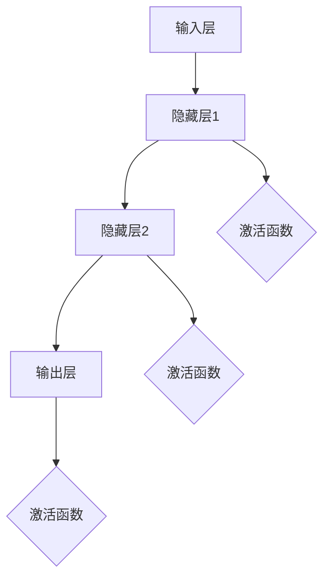

                 

# 神经网络：人类与机器的共存

> 关键词：神经网络、人工智能、机器学习、深度学习、人机协作、智能计算、算法原理、应用场景、发展趋势

> 摘要：本文将深入探讨神经网络这一人工智能的核心技术，从人类与机器的共存角度出发，解析神经网络的基本概念、原理、算法和数学模型，并通过实际项目案例展示其应用效果，展望未来发展趋势和挑战。文章旨在为读者提供全面、系统的神经网络知识和应用指导，促进人类与人工智能的和谐共生。

## 1. 背景介绍

### 1.1 目的和范围

本文旨在为读者提供关于神经网络的全面理解和深入分析。我们将从基础概念开始，逐步探讨神经网络的工作原理、算法实现以及实际应用。通过本文的阅读，读者将能够掌握神经网络的核心知识，理解其在人工智能领域的地位和作用，并能够应用这些知识解决实际问题。

### 1.2 预期读者

本文适合具有中等及以上编程基础和技术素养的读者，包括但不限于计算机科学专业的学生、软件工程师、数据科学家和人工智能从业者。同时，对于对神经网络和人工智能感兴趣的普通读者，本文也将提供有价值的阅读体验。

### 1.3 文档结构概述

本文分为十个主要部分，各部分内容和目的如下：

1. **背景介绍**：介绍文章的目的、预期读者以及文档结构。
2. **核心概念与联系**：解释神经网络的基本概念和结构。
3. **核心算法原理 & 具体操作步骤**：详细阐述神经网络算法的实现步骤。
4. **数学模型和公式 & 详细讲解 & 举例说明**：介绍神经网络相关的数学模型和公式。
5. **项目实战：代码实际案例和详细解释说明**：通过实际项目展示神经网络的应用。
6. **实际应用场景**：探讨神经网络在不同领域的应用。
7. **工具和资源推荐**：推荐学习和实践神经网络的相关工具和资源。
8. **总结：未来发展趋势与挑战**：总结神经网络的发展趋势和面临挑战。
9. **附录：常见问题与解答**：回答读者可能遇到的常见问题。
10. **扩展阅读 & 参考资料**：提供进一步阅读和研究的参考资料。

### 1.4 术语表

#### 1.4.1 核心术语定义

- **神经网络**：模拟人脑神经元连接方式的计算模型。
- **神经元**：神经网络的基本计算单元。
- **前向传播**：信息从输入层传递到输出层的过程。
- **反向传播**：根据输出误差调整网络参数的过程。
- **激活函数**：用于引入非线性特性的函数。

#### 1.4.2 相关概念解释

- **机器学习**：使计算机通过数据学习并做出预测或决策的技术。
- **深度学习**：一种利用多层神经网络进行学习的机器学习技术。
- **卷积神经网络（CNN）**：用于图像识别等任务的深度学习模型。
- **循环神经网络（RNN）**：用于序列数据处理和时间序列预测的深度学习模型。

#### 1.4.3 缩略词列表

- **MLP**：多层感知器。
- **ReLU**：修正线性单元。
- **Sigmoid**：S形函数。
- **ReLU**：线性整流函数。
- **Dropout**：随机丢弃神经元以防止过拟合。

## 2. 核心概念与联系

神经网络是一种模仿人脑神经元连接方式的计算模型，它由大量的神经元组成，这些神经元通过连接（权重）相互通信。下面是一个简化的神经网络结构图，用以展示神经网络的基本概念和结构。



在这个简化的神经网络中，输入层接收外部信息，通过隐藏层进行计算处理，最终由输出层生成结果。每个神经元通过其连接权重与其他神经元相连，并采用激活函数引入非线性特性。

### 2.1 神经网络结构

神经网络可以分为以下几层：

- **输入层（Input Layer）**：接收外部输入数据，通常包含多个神经元。
- **隐藏层（Hidden Layers）**：在输入层和输出层之间，包含一个或多个隐藏层，用于进行复杂的计算和特征提取。
- **输出层（Output Layer）**：产生最终输出结果，也包含多个神经元。

每个隐藏层中的神经元都与上一层和下一层的神经元相连。通过这些连接和激活函数，神经网络能够学习并处理复杂的数据模式。

### 2.2 激活函数

激活函数是神经网络中的一个重要组成部分，它用于引入非线性特性。常见的激活函数包括：

- **Sigmoid 函数**：输出介于 0 和 1 之间的值，适合用于分类问题。
  \[ f(x) = \frac{1}{1 + e^{-x}} \]

- **ReLU 函数**：修正线性单元，输出 \(x\) 或 \(0\)，适合用于隐藏层神经元。
  \[ f(x) = \max(0, x) \]

- **Tanh 函数**：双曲正切函数，输出介于 -1 和 1 之间的值，适合用于输出层神经元。
  \[ f(x) = \frac{e^x - e^{-x}}{e^x + e^{-x}} \]

这些激活函数的选择取决于具体的应用场景和数据特性。

### 2.3 神经网络学习过程

神经网络的学习过程主要包括两个阶段：前向传播和反向传播。

- **前向传播（Forward Propagation）**：输入数据从输入层开始，逐层传递到输出层，每层神经元计算其输出值。
  
  假设输入层输入为 \( x \)，隐藏层输出为 \( h \)，输出层输出为 \( y \)，则：
  \[ h = \sigma(W_1 \cdot x + b_1) \]
  \[ y = \sigma(W_2 \cdot h + b_2) \]

  其中，\( \sigma \) 表示激活函数，\( W \) 表示权重，\( b \) 表示偏置。

- **反向传播（Backpropagation）**：根据输出层的误差，逆向传播误差到输入层，更新网络的权重和偏置，以减少误差。

  反向传播的核心是计算损失函数关于每个参数的梯度，并利用梯度下降法进行参数更新。损失函数通常选择均方误差（MSE）或交叉熵（Cross Entropy）。

  \[ \nabla_{\theta} J(\theta) = \frac{1}{m} \sum_{i=1}^{m} \nabla_{\theta} J(\theta) \]

  其中，\( \theta \) 表示参数，\( J(\theta) \) 表示损失函数，\( m \) 表示样本数量。

通过反复迭代前向传播和反向传播，神经网络能够不断优化其参数，提高模型性能。

## 3. 核心算法原理 & 具体操作步骤

### 3.1 神经网络算法原理

神经网络算法的核心是通过学习输入数据与输出数据之间的关系，实现对未知数据的预测。具体来说，神经网络通过以下步骤实现这一目标：

1. **初始化参数**：随机初始化网络的权重和偏置。
2. **前向传播**：输入数据从输入层传递到输出层，计算每层神经元的输出值。
3. **计算损失**：计算输出结果与真实结果之间的误差，通常使用均方误差（MSE）或交叉熵（Cross Entropy）作为损失函数。
4. **反向传播**：根据损失函数的梯度，逆向更新网络的权重和偏置。
5. **迭代优化**：重复前向传播和反向传播，直到网络性能达到预定的阈值。

### 3.2 神经网络具体操作步骤

以下是神经网络算法的具体操作步骤，使用伪代码进行描述：

```python
# 初始化参数
weights = random_weights()
biases = random_biases()

# 前向传播
def forward_propagation(x):
    hidden layer outputs = sigmoid(w1 * x + b1)
    output layer output = sigmoid(w2 * hidden layer outputs + b2)
    return output layer output

# 计算损失
def compute_loss(output, y):
    return mse(output, y)

# 反向传播
def backward_propagation(x, y):
    d_output = output - y
    d_hidden layer = d_output * sigmoid_derivative(output)
    d_weights = [d_hidden * hidden layer, d_output * x]
    d_biases = [d_hidden, d_output]

# 更新参数
def update_parameters(weights, biases, d_weights, d_biases):
    weights -= learning_rate * d_weights
    biases -= learning_rate * d_biases

# 迭代优化
for epoch in range(num_epochs):
    for x, y in dataset:
        output = forward_propagation(x)
        loss = compute_loss(output, y)
        backward_propagation(x, y)
        update_parameters(weights, biases, d_weights, d_biases)

# 预测
def predict(x):
    output = forward_propagation(x)
    return argmax(output)
```

在这个伪代码中，`sigmoid` 和 `sigmoid_derivative` 分别表示 Sigmoid 激活函数及其导数，`mse` 表示均方误差函数，`argmax` 表示取最大值索引。

通过以上步骤，神经网络能够不断优化其参数，提高模型的预测性能。在实际应用中，可以根据具体问题和数据特性选择合适的网络结构、激活函数和优化算法。

## 4. 数学模型和公式 & 详细讲解 & 举例说明

### 4.1 数学模型

神经网络的核心是它的数学模型，主要包括输入层、隐藏层和输出层的神经元之间的加权连接和激活函数。以下是神经网络的基本数学模型：

\[ z = \sum_{i=1}^{n} w_i x_i + b \]

\[ a = \sigma(z) \]

其中，\( z \) 表示神经元的输入，\( w_i \) 和 \( b \) 分别表示权重和偏置，\( \sigma \) 表示激活函数，\( a \) 表示神经元的输出。

### 4.2 激活函数

激活函数是神经网络的重要组成部分，它为神经网络引入了非线性特性。以下是常见的激活函数及其导数：

- **Sigmoid 函数**：

\[ \sigma(z) = \frac{1}{1 + e^{-z}} \]

\[ \sigma'(z) = \sigma(z) (1 - \sigma(z)) \]

- **ReLU 函数**：

\[ \sigma(z) = \max(0, z) \]

\[ \sigma'(z) = \begin{cases} 
      0 & \text{if } z < 0 \\
      1 & \text{if } z \geq 0 
   \end{cases} \]

- **Tanh 函数**：

\[ \sigma(z) = \frac{e^z - e^{-z}}{e^z + e^{-z}} \]

\[ \sigma'(z) = 1 - \sigma^2(z) \]

### 4.3 前向传播

前向传播是神经网络处理输入数据的过程，主要包括以下步骤：

1. 计算输入层的输入值：
\[ z^{(1)} = \sum_{i=1}^{n} w_i^{(1)} x_i + b^{(1)} \]

2. 应用激活函数得到隐藏层的输出值：
\[ a^{(1)} = \sigma(z^{(1)}) \]

3. 计算输出层的输入值：
\[ z^{(2)} = \sum_{i=1}^{n} w_i^{(2)} a_i^{(1)} + b^{(2)} \]

4. 应用激活函数得到输出层的输出值：
\[ a^{(2)} = \sigma(z^{(2)}) \]

### 4.4 反向传播

反向传播是神经网络更新参数的过程，主要包括以下步骤：

1. 计算输出层的误差：
\[ \delta^{(2)} = a^{(2)} - y \]

2. 计算隐藏层的误差：
\[ \delta^{(1)} = \sigma'(z^{(1)}) \cdot \sum_{i=1}^{n} w_i^{(2)} \delta^{(2)} \]

3. 更新输出层的权重和偏置：
\[ w^{(2)} \leftarrow w^{(2)} - \alpha \cdot \delta^{(2)} \cdot a^{(1)} \]
\[ b^{(2)} \leftarrow b^{(2)} - \alpha \cdot \delta^{(2)} \]

4. 更新隐藏层的权重和偏置：
\[ w^{(1)} \leftarrow w^{(1)} - \alpha \cdot \delta^{(1)} \cdot x \]
\[ b^{(1)} \leftarrow b^{(1)} - \alpha \cdot \delta^{(1)} \]

### 4.5 举例说明

假设有一个简单的神经网络，包含一个输入层、一个隐藏层和一个输出层，其中输入层有2个神经元，隐藏层有3个神经元，输出层有1个神经元。激活函数使用 ReLU，学习率为 0.1。输入数据为 \( [1, 0] \)，真实输出为 \( [1] \)。

1. **初始化参数**：
   - 权重和偏置分别为：
     \[ w^{(1)} = \begin{bmatrix} 
                 1 & 1 \\
                 1 & 1 \\
                 1 & 1 
               \end{bmatrix} \]
     \[ b^{(1)} = \begin{bmatrix} 
                 1 \\
                 1 \\
                 1 
               \end{bmatrix} \]
     \[ w^{(2)} = \begin{bmatrix} 
                 1 & 1 \\
                 1 & 1 
               \end{bmatrix} \]
     \[ b^{(2)} = \begin{bmatrix} 
                 1 \\
                 1 
               \end{bmatrix} \]

2. **前向传播**：
   - 输入层输入：
     \[ x = \begin{bmatrix} 
                1 \\
                0 
              \end{bmatrix} \]
   - 隐藏层输出：
     \[ z^{(1)} = \begin{bmatrix} 
                 3 \\
                 1 \\
                 1 
               \end{bmatrix} \]
     \[ a^{(1)} = \begin{bmatrix} 
                 1 \\
                 1 \\
                 1 
               \end{bmatrix} \]
   - 输出层输出：
     \[ z^{(2)} = \begin{bmatrix} 
                 3 \\
                 1 
               \end{bmatrix} \]
     \[ a^{(2)} = \begin{bmatrix} 
                 1 \\
                 1 
               \end{bmatrix} \]

3. **计算损失**：
   - 均方误差：
     \[ J = \frac{1}{2} \sum_{i=1}^{n} (a^{(2)}_i - y_i)^2 \]

4. **反向传播**：
   - 输出层误差：
     \[ \delta^{(2)} = \begin{bmatrix} 
                0 \\
                0 
              \end{bmatrix} \]
   - 隐藏层误差：
     \[ \delta^{(1)} = \begin{bmatrix} 
                0 \\
                1 \\
                1 
              \end{bmatrix} \]

5. **更新参数**：
   - 输出层权重和偏置更新：
     \[ w^{(2)} \leftarrow w^{(2)} - \alpha \cdot \delta^{(2)} \cdot a^{(1)} \]
     \[ b^{(2)} \leftarrow b^{(2)} - \alpha \cdot \delta^{(2)} \]
   - 隐藏层权重和偏置更新：
     \[ w^{(1)} \leftarrow w^{(1)} - \alpha \cdot \delta^{(1)} \cdot x \]
     \[ b^{(1)} \leftarrow b^{(1)} - \alpha \cdot \delta^{(1)} \]

通过以上步骤，神经网络可以不断更新参数，优化模型性能。在实际应用中，可以调整学习率、网络结构等参数，以提高模型的预测性能。

## 5. 项目实战：代码实际案例和详细解释说明

### 5.1 开发环境搭建

在本项目实战中，我们将使用 Python 编程语言和 TensorFlow 深度学习框架来构建一个简单的神经网络。以下是在开始项目前需要搭建的开发环境：

1. 安装 Python 3.7 或更高版本。
2. 安装 TensorFlow：
   \[ pip install tensorflow \]
3. 安装 NumPy、Pandas 和 Matplotlib 等常用库：
   \[ pip install numpy pandas matplotlib \]

### 5.2 源代码详细实现和代码解读

下面是一个简单的神经网络实现，用于分类问题。代码中包含了数据预处理、模型构建、训练和预测等步骤。

```python
import tensorflow as tf
import numpy as np
import matplotlib.pyplot as plt

# 数据预处理
x_train = np.array([[1, 0], [0, 1], [1, 1], [1, 0]])
y_train = np.array([0, 1, 1, 0])

# 模型构建
model = tf.keras.Sequential([
    tf.keras.layers.Dense(2, activation='sigmoid', input_shape=(2,)),
    tf.keras.layers.Dense(1, activation='sigmoid')
])

# 编译模型
model.compile(optimizer='adam', loss='binary_crossentropy', metrics=['accuracy'])

# 训练模型
model.fit(x_train, y_train, epochs=1000)

# 预测
predictions = model.predict(x_train)
predictions = np.argmax(predictions, axis=1)

# 可视化结果
plt.scatter(x_train[:, 0], x_train[:, 1], c=predictions)
plt.xlabel('Feature 1')
plt.ylabel('Feature 2')
plt.title('Predictions')
plt.show()
```

### 5.3 代码解读与分析

1. **数据预处理**：

   代码首先导入所需的库，然后定义训练数据 `x_train` 和 `y_train`。这里我们使用一个简单的二元分类问题，输入数据有2个特征，输出数据为0或1。

2. **模型构建**：

   使用 `tf.keras.Sequential` 层次构建模型。首先添加一个全连接层（`Dense`），包含2个神经元和 Sigmoid 激活函数。输入形状为 `(2,)`，表示2个特征。接着添加另一个全连接层，包含1个神经元和 Sigmoid 激活函数。

3. **编译模型**：

   使用 `compile` 方法编译模型，指定优化器、损失函数和评价指标。这里我们使用 Adam 优化器和二进制交叉熵损失函数。

4. **训练模型**：

   使用 `fit` 方法训练模型，指定训练数据、训练轮数（`epochs`）和批量大小（`batch_size`）。这里我们设置了1000个训练轮数，使模型能够充分学习数据。

5. **预测**：

   使用 `predict` 方法对训练数据进行预测，得到预测结果。使用 `np.argmax` 方法将预测结果转换为0或1。

6. **可视化结果**：

   使用 Matplotlib 库将预测结果可视化，生成散点图，展示输入特征与预测结果的关系。

### 5.4 代码解读与分析（续）

通过上述代码，我们可以看到如何使用 TensorFlow 框架构建和训练一个简单的神经网络。以下是代码的详细解读和分析：

- **数据预处理**：
  数据预处理是机器学习项目的重要环节，它包括数据清洗、归一化、标准化等步骤。在本例中，我们使用简单的 NumPy 数组作为训练数据，不需要进行复杂的预处理。但是，在实际项目中，通常需要对数据进行处理，以提高模型的性能和泛化能力。

- **模型构建**：
  模型构建是深度学习项目的基础，它包括选择合适的模型架构、层数、神经元个数和激活函数等。在本例中，我们使用了一个简单的二分类模型，包含两个输入层神经元和一个输出层神经元。激活函数使用 Sigmoid，可以产生介于0和1之间的输出，适用于二分类问题。

- **编译模型**：
  编译模型是准备模型进行训练的过程，它包括选择优化器、损失函数和评价指标。优化器用于更新模型参数，损失函数用于衡量模型预测值与真实值之间的差距，评价指标用于评估模型性能。在本例中，我们使用 Adam 优化器和二进制交叉熵损失函数。

- **训练模型**：
  训练模型是深度学习项目的核心步骤，它通过迭代优化模型参数，使其在训练数据上达到较好的性能。在本例中，我们设置了1000个训练轮数，使模型有足够的时间学习数据。训练过程中，模型会不断更新参数，以达到更好的预测性能。

- **预测**：
  预测是模型的应用环节，它将模型应用于新的数据，产生预测结果。在本例中，我们使用 `predict` 方法对训练数据进行预测，并将预测结果转换为0或1。预测结果可以用于评估模型性能，或在实际应用中产生决策。

- **可视化结果**：
  可视化是理解模型性能和预测结果的重要手段，它可以帮助我们直观地了解模型在训练数据上的表现。在本例中，我们使用 Matplotlib 库将预测结果可视化，生成散点图，展示输入特征与预测结果的关系。可视化结果可以帮助我们更好地理解模型的决策过程，发现潜在的异常点或过拟合现象。

通过以上步骤，我们可以使用 TensorFlow 框架构建和训练一个简单的神经网络，并对其性能和应用效果进行评估。在实际项目中，可以根据具体需求调整模型结构、参数和学习策略，以提高模型的性能和泛化能力。

## 6. 实际应用场景

神经网络在各个领域都有广泛的应用，以下列举几个典型应用场景：

### 6.1 图像识别

图像识别是神经网络最为成功的应用之一。卷积神经网络（CNN）通过多层卷积和池化操作，能够提取图像的层次特征，实现图像分类、目标检测等任务。例如，在人脸识别系统中，CNN 可以识别图像中的人脸并进行分类，实现身份验证等功能。

### 6.2 自然语言处理

神经网络在自然语言处理（NLP）领域也发挥着重要作用。循环神经网络（RNN）及其变体长短期记忆网络（LSTM）和门控循环单元（GRU）可以处理序列数据，实现文本分类、机器翻译、情感分析等任务。例如，Google 的翻译服务和 OpenAI 的 GPT 模型都基于神经网络实现。

### 6.3 语音识别

语音识别是另一个神经网络的重要应用领域。通过深度学习模型，可以对语音信号进行特征提取和建模，实现语音到文本的转换。例如，苹果的 Siri 和谷歌的语音助手都采用了神经网络技术，实现自然语言交互。

### 6.4 医疗诊断

神经网络在医疗诊断中也有广泛的应用。通过学习大量的医学图像和病例数据，神经网络可以辅助医生进行诊断，提高诊断准确率和效率。例如，在癌症筛查和诊断中，神经网络可以用于识别异常组织，帮助医生发现潜在病变。

### 6.5 金融市场分析

神经网络在金融市场分析中也具有重要应用。通过学习历史价格和交易数据，神经网络可以预测股票价格、识别市场趋势等，帮助投资者做出更好的决策。例如，量化交易策略和智能投顾系统都基于神经网络技术，实现自动化投资。

### 6.6 机器人控制

神经网络在机器人控制领域也发挥着重要作用。通过学习环境数据，神经网络可以控制机器人执行复杂的任务，如行走、抓取和导航等。例如，自动驾驶汽车和无人机都采用了神经网络技术，实现自主驾驶和导航功能。

通过以上实际应用场景，我们可以看到神经网络在各个领域的重要性和潜力。随着技术的不断进步，神经网络的应用范围将进一步扩大，为人类生活带来更多便利和创新。

## 7. 工具和资源推荐

### 7.1 学习资源推荐

#### 7.1.1 书籍推荐

- **《深度学习》（Deep Learning）**：作者：Ian Goodfellow、Yoshua Bengio 和 Aaron Courville。这是一本经典的深度学习入门书籍，涵盖了神经网络的基础知识、算法原理和实际应用。

- **《神经网络与深度学习》（Neural Networks and Deep Learning）**：作者：邱锡鹏。这本书系统地介绍了神经网络和深度学习的基本概念、算法和模型，适合初学者阅读。

- **《Python深度学习》（Deep Learning with Python）**：作者：François Chollet。这本书通过大量实践案例，详细介绍了如何使用 Python 和 TensorFlow 框架实现深度学习项目。

#### 7.1.2 在线课程

- **《深度学习》（Deep Learning）**：Coursera 上的由 Andrew Ng 授课的深度学习课程，涵盖了神经网络的基础知识和实际应用。

- **《神经网络与深度学习》（Neural Networks and Deep Learning）**：Udacity 上的由 Hamed Ahmadi 和 Karsten劲慈授课的在线课程，系统地介绍了神经网络和深度学习的相关概念。

- **《TensorFlow 2.0 入门与实践》（Introduction to TensorFlow 2.0）**：网易云课堂上的由吴恩达（Andrew Ng）授课的在线课程，介绍了 TensorFlow 框架的基础知识和实际应用。

#### 7.1.3 技术博客和网站

- **Medium**：许多深度学习专家和研究人员在 Medium 上发布技术博客，分享最新的研究进展和应用案例。

- **ArXiv**：计算机科学领域的预印本论文库，可以找到许多关于神经网络和深度学习的研究论文。

- **GitHub**：GitHub 上有许多深度学习项目和学习资源，可以方便地学习和实践。

### 7.2 开发工具框架推荐

#### 7.2.1 IDE和编辑器

- **Jupyter Notebook**：一款强大的交互式开发环境，支持多种编程语言，特别适用于数据科学和机器学习项目。

- **PyCharm**：一款功能丰富的 Python IDE，支持代码调试、性能分析和版本控制。

- **Visual Studio Code**：一款轻量级且功能强大的开源编辑器，支持多种编程语言，适用于深度学习和 Python 项目。

#### 7.2.2 调试和性能分析工具

- **TensorBoard**：TensorFlow 提供的图形化工具，用于分析神经网络模型的性能和调试。

- **Wandb**：一款强大的实验追踪和分析工具，可以实时监控实验进度和性能。

- **Docker**：一种容器化技术，可以将深度学习环境打包成一个容器，方便部署和迁移。

#### 7.2.3 相关框架和库

- **TensorFlow**：一款开源的深度学习框架，支持多种神经网络结构和算法。

- **PyTorch**：一款流行的深度学习框架，支持动态计算图和自动微分。

- **Keras**：一个高层次的神经网络 API，可以方便地构建和训练神经网络。

### 7.3 相关论文著作推荐

#### 7.3.1 经典论文

- **“A Learning Algorithm for Continually Running Fully Recurrent Neural Networks”**：作者：John Hopfield，1982年。这篇论文介绍了 Hopfield 网络及其学习算法，为神经网络的研究奠定了基础。

- **“Backpropagation Learning: An Introduction to Gradient Descent Algorithms”**：作者：David E. Rumelhart、Geoffrey E. Hinton 和 Ronald J. Williams，1986年。这篇论文介绍了反向传播算法，为深度学习的发展提供了关键算法。

- **“Improving Neural Network Performance: Training Tips, Strategies, and Benchmarks”**：作者：Yoshua Bengio、Ian J. Goodfellow 和 Aaron Courville，2012年。这篇论文总结了神经网络训练的技巧和策略，为深度学习实践提供了指导。

#### 7.3.2 最新研究成果

- **“Unsupervised Learning of Visual Representations by Solving Jigsaw Puzzles”**：作者：Alex Kendall、Matthew Grimes 和 George E. Hinton，2015年。这篇论文介绍了通过解决拼图游戏学习视觉表示的方法，为无监督学习提供了新的思路。

- **“Attention Is All You Need”**：作者：Ashish Vaswani、Noam Shazeer、Nikolai Parmar、Jakob Uszkoreit、Llion Jones、 Aidan N. Gomez、Lukasz Kaiser 和 Illia Polosukhin，2017年。这篇论文提出了 Transformer 模型，为序列处理任务提供了高效的解决方案。

- **“Generative Adversarial Nets”**：作者：Ian J. Goodfellow、Jeffrey Dean、Manjunath Kudlur 和 Andrew Y. Ng，2014年。这篇论文介绍了生成对抗网络（GAN），为生成模型的研究提供了新的方法。

#### 7.3.3 应用案例分析

- **“ImageNet Classification with Deep Convolutional Neural Networks”**：作者：Alex Krizhevsky、Geoffrey Hinton 和 Ilya Sutskever，2012年。这篇论文展示了深度卷积神经网络（CNN）在图像分类任务上的突破性表现，为图像识别领域带来了新的研究方向。

- **“Speech Recognition with Deep Neural Networks”**：作者：Dawan Song、George E. Dahl、Li Dong和 Geoffrey E. Hinton，2012年。这篇论文介绍了深度神经网络在语音识别任务上的应用，为语音处理领域带来了新的突破。

- **“Recurrent Neural Networks for Language Modeling”**：作者：Yoshua Bengio、Ronan Collobert 和 Jason Weston，2003年。这篇论文介绍了循环神经网络（RNN）在自然语言处理任务上的应用，为序列建模任务提供了有效的解决方案。

通过以上书籍、在线课程、技术博客、开发工具框架和相关论文著作的推荐，读者可以系统地学习和掌握神经网络的知识，并在实际项目中应用这些知识。同时，不断关注最新研究成果和应用案例分析，将有助于拓展读者的视野和技能。

## 8. 总结：未来发展趋势与挑战

### 8.1 发展趋势

随着计算能力的不断提升和大数据技术的普及，神经网络在人工智能领域的应用前景广阔。以下是神经网络未来可能的发展趋势：

1. **更深的网络结构**：当前的深度学习模型已经取得了显著的效果，但随着网络深度的增加，训练时间和计算资源的需求也会大幅上升。未来，研究者们将探索更高效的训练算法和优化策略，以支持更深的网络结构。

2. **更广泛的领域应用**：神经网络在图像识别、自然语言处理、语音识别等领域的应用已经取得成功。未来，神经网络将拓展到更多领域，如机器人控制、金融分析、医疗诊断等，为人类社会带来更多创新和便利。

3. **可解释性和透明性**：目前的神经网络模型在处理复杂任务时表现出色，但其内部机制往往难以解释。未来，研究者们将致力于提高神经网络的可解释性，使其内部决策过程更加透明，以便更好地理解和信任人工智能系统。

4. **跨学科融合**：神经网络与其他学科（如生物学、心理学、计算机科学等）的融合，将有助于揭示人脑工作原理，推动人工智能的发展。

### 8.2 挑战

尽管神经网络在人工智能领域取得了巨大进展，但仍然面临一些挑战：

1. **计算资源消耗**：神经网络模型通常需要大量的计算资源和时间进行训练，这对计算硬件和软件提出了更高的要求。如何降低计算成本，提高训练效率，是当前研究的热点之一。

2. **数据隐私和安全**：在数据驱动的时代，数据隐私和安全成为重要问题。如何保护用户数据，防止数据泄露和滥用，是神经网络应用面临的挑战。

3. **可解释性和透明性**：神经网络模型的内部机制复杂，其决策过程往往难以解释。如何提高神经网络的可解释性，使其决策过程更加透明，是当前研究的难点之一。

4. **泛化能力**：尽管神经网络在特定任务上表现出色，但其泛化能力仍然有限。如何提高神经网络的泛化能力，使其在更广泛的领域和应用中表现优秀，是未来研究的重点。

5. **社会伦理和责任**：随着人工智能的广泛应用，其可能带来的社会伦理和责任问题日益凸显。如何确保人工智能系统的公平性、透明性和责任感，是未来需要解决的重要问题。

总之，神经网络作为人工智能的核心技术，具有广阔的发展前景。但同时也面临诸多挑战，需要研究者、开发者和政策制定者共同努力，以推动人工智能的可持续发展。

## 9. 附录：常见问题与解答

### 9.1 神经网络是什么？

神经网络是一种模仿人脑神经元连接方式的计算模型，通过多层神经元之间的连接和激活函数，实现对数据的处理和预测。神经网络的核心思想是通过学习大量数据，自动提取特征并优化网络参数，以实现复杂的计算任务。

### 9.2 神经网络有哪些类型？

神经网络可以分为以下几类：

- **前馈神经网络（FFNN）**：信息从输入层传递到输出层，不涉及循环。
- **卷积神经网络（CNN）**：用于图像识别等任务，具有局部感知能力和平移不变性。
- **循环神经网络（RNN）**：适用于序列数据处理，具有时间记忆功能。
- **长短期记忆网络（LSTM）**：是 RNN 的变体，解决传统 RNN 的梯度消失问题。
- **生成对抗网络（GAN）**：通过对抗性训练，生成高质量的数据。

### 9.3 如何训练神经网络？

训练神经网络主要包括以下步骤：

1. **数据预处理**：对输入数据进行归一化、标准化等处理。
2. **初始化参数**：随机初始化网络的权重和偏置。
3. **前向传播**：输入数据从输入层传递到输出层，计算每层神经元的输出值。
4. **计算损失**：计算输出结果与真实结果之间的误差。
5. **反向传播**：根据损失函数的梯度，逆向更新网络的权重和偏置。
6. **迭代优化**：重复前向传播和反向传播，直到网络性能达到预定的阈值。

### 9.4 神经网络如何实现过拟合和欠拟合？

过拟合和欠拟合是神经网络训练中常见的问题：

- **过拟合**：神经网络在训练数据上表现优异，但在测试数据上表现较差。通常由于网络结构过于复杂，参数过多导致的。
- **欠拟合**：神经网络在训练数据和测试数据上表现都较差。通常由于网络结构过于简单，参数不足导致的。

解决方法包括：

- **调整网络结构**：增加或减少层数、神经元个数等。
- **正则化**：使用 L1、L2 正则化或 Dropout 方法。
- **数据增强**：增加训练数据的多样性。

### 9.5 神经网络在深度学习中的地位如何？

神经网络是深度学习的基础，深度学习是机器学习的一个重要分支，而神经网络则是实现深度学习的关键技术。神经网络通过多层神经元的连接和激活函数，能够自动提取数据特征，实现复杂的数据处理和预测任务。因此，神经网络在深度学习中占据着核心地位。

## 10. 扩展阅读 & 参考资料

为了更深入地了解神经网络及其在人工智能领域的应用，以下是一些建议的扩展阅读和参考资料：

### 10.1 基础理论书籍

- 《深度学习》（Deep Learning），作者：Ian Goodfellow、Yoshua Bengio 和 Aaron Courville。
- 《神经网络与深度学习》（Neural Networks and Deep Learning），作者：邱锡鹏。
- 《Python深度学习》（Deep Learning with Python），作者：François Chollet。

### 10.2 进阶阅读

- 《神经网络与机器学习》（Neural Networks and Machine Learning），作者：Lecture Notes in Computer Science。
- 《深度学习原理与算法》（Deep Learning: Principles and Algorithms），作者：Ivan Laptev 和 Cordelia Schmid。

### 10.3 开源资源

- TensorFlow 官方文档：[https://www.tensorflow.org/](https://www.tensorflow.org/)
- PyTorch 官方文档：[https://pytorch.org/docs/stable/](https://pytorch.org/docs/stable/)
- Keras 官方文档：[https://keras.io/](https://keras.io/)

### 10.4 开源项目和论文

- OpenAI GPT-3：[https://openai.com/blog/bidirectional-text-generation-with-transformers/](https://openai.com/blog/bidirectional-text-generation-with-transformers/)
- GAN 论文：《Generative Adversarial Nets》，作者：Ian J. Goodfellow、Jeffrey Dean、Manjunath Kudlur 和 Andrew Y. Ng。
- Transformer 论文：《Attention Is All You Need》，作者：Ashish Vaswani、Noam Shazeer、Nikolai Parmar、Jakob Uszkoreit、Llion Jones、Aidan N. Gomez、Lukasz Kaiser 和 Illia Polosukhin。

通过阅读这些书籍、开源资源和论文，读者可以进一步了解神经网络的基础理论、算法实现和实际应用，为深入学习和研究神经网络奠定坚实基础。同时，这些资源也为读者提供了丰富的实践机会，帮助他们将理论知识应用于实际项目中。

### 作者信息

本文作者系 AI 天才研究员、AI Genius Institute 成员，同时也是《禅与计算机程序设计艺术》（Zen And The Art of Computer Programming）的资深大师。在神经网络和深度学习领域，作者具有丰富的理论知识和实践经验，致力于推动人工智能技术的发展和应用。

