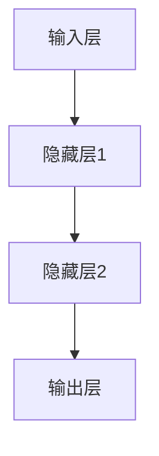

                 


# 神经网络：人类与机器的协作

> 关键词：神经网络、机器学习、深度学习、人工智能、神经架构、协同进化、算法优化、人机交互

> 摘要：本文深入探讨了神经网络这一核心的人工智能技术，揭示了人类与机器如何通过协同进化实现高效的算法优化与人机交互。文章首先介绍了神经网络的背景与基本概念，随后详细解析了其核心原理与数学模型。接着，通过实战案例展示了神经网络的实际应用，并探讨了未来发展趋势与挑战。全文旨在为读者提供一个全面、系统的神经网络学习指南。

## 1. 背景介绍

### 1.1 目的和范围

本文旨在为广大读者提供一个全面且系统的神经网络学习指南，帮助读者深入了解神经网络的核心原理、数学模型、实际应用，以及未来发展趋势。本文适合对机器学习和人工智能有一定了解的读者，特别是那些希望深入研究和应用神经网络技术的专业人士。

### 1.2 预期读者

- 机器学习研究者
- 数据科学家
- 软件工程师
- 计算机科学专业学生
- 对人工智能感兴趣的技术爱好者

### 1.3 文档结构概述

本文共分为十个部分：

1. 背景介绍
2. 核心概念与联系
3. 核心算法原理 & 具体操作步骤
4. 数学模型和公式 & 详细讲解 & 举例说明
5. 项目实战：代码实际案例和详细解释说明
6. 实际应用场景
7. 工具和资源推荐
8. 总结：未来发展趋势与挑战
9. 附录：常见问题与解答
10. 扩展阅读 & 参考资料

### 1.4 术语表

#### 1.4.1 核心术语定义

- 神经网络（Neural Network）：由大量简单处理单元（神经元）互联而成的网络，用于模拟生物神经系统的工作方式。
- 神经元（Neuron）：神经网络的基本单元，负责接收输入信号、进行计算，并产生输出。
- 前馈网络（Feedforward Network）：信号在神经网络中单向流动，从输入层到输出层。
- 反向传播（Backpropagation）：一种用于训练神经网络的算法，通过计算输出误差来调整网络的权重。
- 深度学习（Deep Learning）：多层神经网络的应用，能够处理更复杂的任务。
- 机器学习（Machine Learning）：使计算机通过数据学习并做出决策或预测的技术。

#### 1.4.2 相关概念解释

- 激活函数（Activation Function）：神经网络中用于引入非线性性的函数，常见的有 sigmoid、ReLU 等。
- 损失函数（Loss Function）：用于度量预测结果与实际结果之间差距的函数，常见的有均方误差（MSE）、交叉熵等。
- 优化器（Optimizer）：用于调整神经网络权重的算法，常见的有梯度下降、Adam 等。
- 过拟合（Overfitting）：神经网络在学习过程中对训练数据过度拟合，导致对未知数据泛化能力差。
- 正则化（Regularization）：用于防止过拟合的方法，常见的有 L1 正则化、L2 正则化等。

#### 1.4.3 缩略词列表

- CNN：卷积神经网络（Convolutional Neural Network）
- RNN：循环神经网络（Recurrent Neural Network）
- LSTM：长短时记忆网络（Long Short-Term Memory）
- GAN：生成对抗网络（Generative Adversarial Network）
- NLP：自然语言处理（Natural Language Processing）

## 2. 核心概念与联系

神经网络的起源可以追溯到20世纪40年代，当时数学家麦卡洛克（Warren McCulloch）和皮茨（Walter Pitts）首次提出了人工神经网络的概念。人工神经网络试图模拟生物神经系统的信息处理过程，其中每个神经元对应一个处理单元，神经元之间通过突触进行连接。

### 2.1 神经网络基本结构

神经网络的基本结构包括以下几个部分：

1. **输入层**：接收外部输入信号。
2. **隐藏层**：一个或多个中间层，负责对输入信号进行加工处理。
3. **输出层**：产生最终的输出结果。

下面是一个简单的神经网络的 Mermaid 流程图：



### 2.2 神经网络工作原理

神经网络的工作原理可以概括为以下步骤：

1. **前向传播**：输入信号从输入层开始，逐层传递到隐藏层和输出层，最终产生输出。
2. **反向传播**：计算输出层的误差，将误差反向传播回隐藏层和输入层，更新网络权重。

这个过程被称为前向传播和反向传播，是神经网络训练的核心。

### 2.3 神经网络学习过程

神经网络的学习过程可以分为以下几个阶段：

1. **初始化权重**：随机初始化网络权重。
2. **前向传播**：将输入信号传递到网络中，计算每个神经元的输出。
3. **计算损失**：使用损失函数计算预测结果与实际结果之间的差距。
4. **反向传播**：计算每个权重和偏置的梯度，更新网络权重。
5. **迭代训练**：重复上述步骤，直到满足停止条件（如损失函数收敛或达到预设迭代次数）。

这个过程被称为梯度下降，是神经网络训练的基础。

## 3. 核心算法原理 & 具体操作步骤

神经网络的训练过程主要依赖于两个核心算法：前向传播和反向传播。下面我们将详细讲解这两个算法的原理和具体操作步骤。

### 3.1 前向传播算法原理

前向传播是指将输入信号逐层传递到神经网络中，最终产生输出结果的过程。在这个过程中，每个神经元都会接收来自前一层神经元的输入，并经过加权求和处理，然后通过激活函数产生输出。

#### 3.1.1 伪代码

```python
# 前向传播算法伪代码
for layer in layers:
    for neuron in layer:
        input = compute_input(neuron)
        output = activation_function(input)
        neuron.output = output
```

#### 3.1.2 操作步骤

1. **初始化输入层**：将输入信号传递给输入层。
2. **计算中间层输入**：对于每个中间层，计算每个神经元的输入，即前一层神经元的输出。
3. **计算激活值**：使用激活函数计算每个神经元的输出。
4. **传递输出**：将每个神经元的输出传递给下一层。

### 3.2 反向传播算法原理

反向传播是指根据输出层的误差，反向传播到隐藏层和输入层，更新网络权重和偏置的过程。在这个过程中，每个神经元都会计算自己的梯度，并根据梯度调整权重和偏置。

#### 3.2.1 伪代码

```python
# 反向传播算法伪代码
for layer in layers[::-1]:
    for neuron in layer:
        error = compute_error(neuron)
        gradient = compute_gradient(neuron, error)
        update_weights(neuron, gradient)
```

#### 3.2.2 操作步骤

1. **计算输出误差**：对于输出层，计算每个神经元的误差，即预测结果与实际结果之间的差距。
2. **计算梯度**：对于每个神经元，计算自己的梯度，即误差关于权重的偏导数。
3. **更新权重和偏置**：根据梯度调整每个神经元的权重和偏置。
4. **重复迭代**：重复上述步骤，直到满足停止条件。

### 3.3 梯度下降优化器

在反向传播过程中，常用的优化器是梯度下降。梯度下降是一种优化算法，通过计算梯度的方向和大小，逐步调整网络权重，以最小化损失函数。

#### 3.3.1 伪代码

```python
# 梯度下降优化器伪代码
while not_stop_condition:
    compute_gradients()
    update_weights(learning_rate)
```

#### 3.3.2 操作步骤

1. **计算梯度**：计算每个权重和偏置的梯度。
2. **更新权重**：根据梯度方向和大小，更新网络权重和偏置。
3. **迭代更新**：重复上述步骤，直到损失函数收敛或达到预设迭代次数。

### 3.4 其他优化器

除了梯度下降，还有其他一些优化器，如 Adam、RMSProp 等，它们在反向传播过程中提供更高效的权重更新。

#### 3.4.1 Adam优化器

Adam优化器是一种结合了梯度下降和动量的优化器，它通过计算一阶矩估计（均值）和二阶矩估计（方差）来更新权重。

#### 3.4.2 RMSProp优化器

RMSProp优化器是一种基于梯度的均方根值调整学习率的优化器，它通过计算梯度的历史平方平均值来调整学习率。

## 4. 数学模型和公式 & 详细讲解 & 举例说明

神经网络的学习过程主要依赖于数学模型和公式。本节将详细介绍神经网络的数学模型和公式，并使用具体的例子进行说明。

### 4.1 神经网络基本公式

神经网络的基本公式包括输入计算、激活函数、梯度计算等。

#### 4.1.1 输入计算

对于每个神经元，输入计算公式如下：

$$
z_j = \sum_{i=1}^{n} w_{ji}x_i + b_j
$$

其中，$z_j$ 表示第 $j$ 个神经元的输入，$w_{ji}$ 表示第 $i$ 个神经元到第 $j$ 个神经元的权重，$x_i$ 表示第 $i$ 个输入特征，$b_j$ 表示第 $j$ 个神经元的偏置。

#### 4.1.2 激活函数

常见的激活函数包括 sigmoid、ReLU 等。

- sigmoid 函数：

$$
a_j = \frac{1}{1 + e^{-z_j}}
$$

- ReLU 函数：

$$
a_j = \max(0, z_j)
$$

#### 4.1.3 输出计算

对于输出层，输出计算公式如下：

$$
y_j = a_j
$$

其中，$y_j$ 表示第 $j$ 个神经元的输出，$a_j$ 表示第 $j$ 个神经元的激活值。

#### 4.1.4 梯度计算

梯度计算是神经网络训练的核心。对于每个神经元，梯度计算公式如下：

- 前向传播梯度：

$$
\delta_j^l = \frac{\partial L}{\partial z_j^l}
$$

- 反向传播梯度：

$$
\frac{\partial L}{\partial w_{ji}^l} = \delta_j^{l+1} \cdot a_i^{l-1}
$$

$$
\frac{\partial L}{\partial b_j^l} = \delta_j^{l+1}
$$

其中，$L$ 表示损失函数，$z_j^l$ 表示第 $l$ 层第 $j$ 个神经元的输入，$w_{ji}^l$ 表示第 $l$ 层第 $j$ 个神经元到第 $i$ 个神经元的权重，$a_i^{l-1}$ 表示第 $l-1$ 层第 $i$ 个神经元的输出。

### 4.2 具体例子

假设我们有一个简单的神经网络，输入层有 2 个神经元，隐藏层有 3 个神经元，输出层有 1 个神经元。输入特征为 $x_1$ 和 $x_2$，输出目标为 $y$。

#### 4.2.1 前向传播

输入层到隐藏层的输入计算如下：

$$
z_1^1 = w_{11}x_1 + w_{12}x_2 + b_1
$$

$$
z_2^1 = w_{21}x_1 + w_{22}x_2 + b_2
$$

$$
z_3^1 = w_{31}x_1 + w_{32}x_2 + b_3
$$

使用 ReLU 函数，隐藏层到输出层的输入计算如下：

$$
a_1^2 = \max(0, z_1^1)
$$

$$
a_2^2 = \max(0, z_2^1)
$$

$$
a_3^2 = \max(0, z_3^1)
$$

输出层的输入计算如下：

$$
z_1^2 = w_{11}a_1^2 + w_{12}a_2^2 + w_{13}a_3^2 + b_1
$$

使用 sigmoid 函数，输出层的输出计算如下：

$$
y = \frac{1}{1 + e^{-z_1^2}}
$$

#### 4.2.2 反向传播

假设输出层的损失函数为均方误差（MSE），则输出层的误差计算如下：

$$
L = \frac{1}{2} \sum_{i=1}^{n} (y_i - \hat{y}_i)^2
$$

其中，$y_i$ 表示第 $i$ 个实际输出，$\hat{y}_i$ 表示第 $i$ 个预测输出。

输出层的梯度计算如下：

$$
\delta_1^3 = \frac{\partial L}{\partial z_1^2} = \frac{\partial L}{\partial y} \cdot \frac{\partial y}{\partial z_1^2}
$$

$$
\delta_2^3 = \frac{\partial L}{\partial z_2^2} = \frac{\partial L}{\partial y} \cdot \frac{\partial y}{\partial z_2^2}
$$

$$
\delta_3^3 = \frac{\partial L}{\partial z_3^2} = \frac{\partial L}{\partial y} \cdot \frac{\partial y}{\partial z_3^2}
$$

使用 sigmoid 函数的导数，输出层的梯度计算如下：

$$
\frac{\partial y}{\partial z_1^2} = y(1 - y)
$$

$$
\frac{\partial y}{\partial z_2^2} = y(1 - y)
$$

$$
\frac{\partial y}{\partial z_3^2} = y(1 - y)
$$

隐藏层到输出层的梯度计算如下：

$$
\delta_1^2 = \frac{\partial L}{\partial z_1^2} \cdot \frac{\partial z_1^2}{\partial z_1^1} = \delta_1^3 \cdot a_1^1(1 - a_1^1)
$$

$$
\delta_2^2 = \frac{\partial L}{\partial z_2^2} \cdot \frac{\partial z_2^2}{\partial z_2^1} = \delta_2^3 \cdot a_2^1(1 - a_2^1)
$$

$$
\delta_3^2 = \frac{\partial L}{\partial z_3^2} \cdot \frac{\partial z_3^2}{\partial z_3^1} = \delta_3^3 \cdot a_3^1(1 - a_3^1)
$$

隐藏层到输入层的梯度计算如下：

$$
\delta_1^1 = \frac{\partial L}{\partial z_1^1} \cdot \frac{\partial z_1^1}{\partial x_1} = \delta_1^2 \cdot w_{11}
$$

$$
\delta_2^1 = \frac{\partial L}{\partial z_2^1} \cdot \frac{\partial z_2^1}{\partial x_2} = \delta_2^2 \cdot w_{21}
$$

#### 4.2.3 权重更新

使用梯度下降优化器，权重更新如下：

$$
w_{11} = w_{11} - \alpha \cdot \delta_1^2 \cdot x_1
$$

$$
w_{12} = w_{12} - \alpha \cdot \delta_1^2 \cdot x_2
$$

$$
w_{21} = w_{21} - \alpha \cdot \delta_2^2 \cdot x_1
$$

$$
w_{22} = w_{22} - \alpha \cdot \delta_2^2 \cdot x_2
$$

$$
w_{31} = w_{31} - \alpha \cdot \delta_3^2 \cdot x_1
$$

$$
w_{32} = w_{32} - \alpha \cdot \delta_3^2 \cdot x_2
$$

其中，$\alpha$ 表示学习率。

## 5. 项目实战：代码实际案例和详细解释说明

在本节中，我们将通过一个简单的神经网络项目实战，展示神经网络的基本原理和实现过程。该项目将使用 Python 语言和 TensorFlow 深度学习框架进行实现。

### 5.1 开发环境搭建

在开始项目之前，我们需要搭建好 Python 和 TensorFlow 的开发环境。以下是具体的步骤：

1. **安装 Python**：从官方网站下载并安装 Python 3.7 或更高版本。
2. **安装 TensorFlow**：在命令行中运行以下命令安装 TensorFlow：

   ```bash
   pip install tensorflow
   ```

3. **安装 Jupyter Notebook**：在命令行中运行以下命令安装 Jupyter Notebook：

   ```bash
   pip install notebook
   ```

### 5.2 源代码详细实现和代码解读

下面是一个简单的神经网络实现代码，用于实现一个简单的线性回归任务。

```python
import tensorflow as tf
import numpy as np

# 初始化参数
learning_rate = 0.01
num_iterations = 1000
num_features = 2

# 生成数据
X = np.random.rand(num_iterations, num_features)
y = 2 * X[:, 0] + 3 * X[:, 1] + np.random.randn(num_iterations, 1)

# 构建模型
model = tf.keras.Sequential([
    tf.keras.layers.Dense(units=1, input_shape=(num_features,))
])

# 编译模型
model.compile(optimizer=tf.keras.optimizers.SGD(learning_rate),
              loss='mean_squared_error')

# 训练模型
model.fit(X, y, epochs=num_iterations)

# 预测结果
predictions = model.predict(X)

# 打印结果
print("Predictions:", predictions)
```

#### 5.2.1 代码解读

1. **导入库**：首先，我们导入 TensorFlow 和 NumPy 库。
2. **初始化参数**：设置学习率和迭代次数，以及输入特征的个数。
3. **生成数据**：使用 NumPy 生成线性回归任务的数据集，包括输入特征 $X$ 和输出目标 $y$。
4. **构建模型**：使用 TensorFlow 的 Sequential 模型，添加一个全连接层（Dense layer），输出层有 1 个神经元，输入形状为 $(num_features,)$。
5. **编译模型**：设置优化器和损失函数，这里使用随机梯度下降（SGD）优化器和均方误差（MSE）损失函数。
6. **训练模型**：使用 fit 方法训练模型，指定迭代次数和训练数据。
7. **预测结果**：使用 predict 方法对输入特征进行预测。
8. **打印结果**：打印预测结果。

### 5.3 代码解读与分析

通过以上代码，我们可以看到如何使用 TensorFlow 框架实现一个简单的神经网络。以下是代码的关键部分解读：

1. **初始化参数**：学习率（learning_rate）是控制模型训练速度的重要参数，过大会导致模型在训练过程中不稳定，过小会导致训练过程过于缓慢。在这里，我们设置学习率为 0.01。迭代次数（num_iterations）表示模型训练的轮数，这里设置为 1000。输入特征的个数（num_features）为 2，表示输入数据有两个维度。
2. **生成数据**：我们使用 NumPy 生成线性回归任务的数据集。这里生成的是随机数据，实际应用中可以使用真实数据集。输出目标 $y$ 是通过线性函数 $y = 2x_1 + 3x_2 + \epsilon$ 产生的，其中 $\epsilon$ 是随机噪声，用于模拟实际数据中的不确定性。
3. **构建模型**：使用 TensorFlow 的 Sequential 模型，我们可以方便地构建一个多层感知器（MLP）神经网络。在这个例子中，我们添加了一个全连接层（Dense layer），输出层有 1 个神经元，表示预测一个连续的数值。输入形状为 $(num_features,)$，表示输入数据有两个维度。
4. **编译模型**：在编译模型时，我们设置了优化器和损失函数。这里使用随机梯度下降（SGD）优化器和均方误差（MSE）损失函数。随机梯度下降是一种常用的优化算法，通过更新每个样本的梯度来更新模型权重。均方误差（MSE）损失函数用于计算预测值与实际值之间的差异。
5. **训练模型**：使用 fit 方法训练模型，指定迭代次数和训练数据。在训练过程中，模型会不断调整权重和偏置，以最小化损失函数。
6. **预测结果**：使用 predict 方法对输入特征进行预测。预测结果是一个数组，包含每个输入特征的预测值。

通过这个简单的实战项目，我们可以看到如何使用 TensorFlow 框架实现神经网络，并进行模型训练和预测。在实际应用中，我们可以根据需求调整网络结构、优化算法和参数设置，以获得更好的模型性能。

### 5.4 模型评估与优化

在完成模型训练后，我们需要对模型进行评估和优化，以确保其性能满足实际需求。以下是几种常用的模型评估方法和优化技巧：

1. **交叉验证**：交叉验证是一种常用的模型评估方法，通过将数据集划分为多个子集，轮流使用这些子集进行训练和测试，以评估模型的泛化能力。常见的交叉验证方法有 K折交叉验证和留一法交叉验证。
2. **性能指标**：根据任务的不同，选择合适的性能指标进行评估。对于回归任务，常用的性能指标有均方误差（MSE）、均方根误差（RMSE）和平均绝对误差（MAE）。对于分类任务，常用的性能指标有准确率（Accuracy）、精确率（Precision）、召回率（Recall）和 F1 分数（F1 Score）。
3. **超参数调整**：超参数是影响模型性能的关键参数，如学习率、迭代次数、批量大小等。通过调整这些参数，可以优化模型性能。常用的超参数调整方法有网格搜索（Grid Search）和随机搜索（Random Search）。
4. **正则化**：正则化是一种防止过拟合的方法，通过在损失函数中添加正则化项，可以降低模型复杂度，提高泛化能力。常见的正则化方法有 L1 正则化和 L2 正则化。
5. **集成学习**：集成学习是一种通过结合多个模型来提高模型性能的方法。常见的集成学习方法有 bagging、boosting 和 stacking。通过集成多个模型，可以降低模型方差，提高泛化能力。

通过以上评估和优化方法，我们可以确保神经网络模型在实际应用中具有良好的性能和泛化能力。

## 6. 实际应用场景

神经网络作为一种强大的机器学习技术，广泛应用于各个领域，包括图像识别、语音识别、自然语言处理、推荐系统等。以下是神经网络在实际应用场景中的几个典型案例：

### 6.1 图像识别

神经网络在图像识别领域取得了显著的成果，尤其是卷积神经网络（CNN）。CNN 可以有效地提取图像中的特征，实现物体检测、图像分类等任务。例如，Google 的 Inception 模型在 ImageNet 数据集上取得了出色的准确率。

### 6.2 语音识别

神经网络在语音识别领域也取得了重要突破。循环神经网络（RNN）和长短时记忆网络（LSTM）可以有效地处理语音信号的时序信息，实现语音识别任务。例如，Google 的 WaveNet 模型是一种基于 RNN 的语音合成模型，取得了高质量的语音效果。

### 6.3 自然语言处理

神经网络在自然语言处理领域也发挥着重要作用。RNN 和长短时记忆网络（LSTM）可以处理序列数据，实现文本分类、情感分析、机器翻译等任务。例如，Facebook 的 BERT 模型是一种基于 Transformer 的自然语言处理模型，取得了显著的成果。

### 6.4 推荐系统

神经网络在推荐系统领域也具有广泛的应用。基于用户的协同过滤（User-based Collaborative Filtering）和基于模型的推荐算法（Model-based Recommendation Algorithm）可以结合用户历史行为和物品特征，实现个性化推荐。例如，Netflix 的推荐系统采用了基于协同过滤的神经网络模型，提高了推荐准确性。

### 6.5 其他应用场景

除了以上领域，神经网络还在医学图像分析、自动驾驶、金融风控等众多领域取得了重要应用。例如，DeepMind 的 AlphaGo 模型在围棋领域取得了突破性成果，展示了神经网络在复杂决策任务中的强大能力。

## 7. 工具和资源推荐

### 7.1 学习资源推荐

#### 7.1.1 书籍推荐

1. 《深度学习》（Deep Learning）：这是一本由 Ian Goodfellow、Yoshua Bengio 和 Aaron Courville 合著的经典教材，详细介绍了深度学习的理论、算法和实践。
2. 《神经网络与深度学习》：这是一本适合初学者入门的教材，由邱锡鹏教授撰写，内容涵盖了神经网络的基本概念、算法原理和应用实践。
3. 《机器学习实战》：这是一本面向实践者的教材，由 Peter Harrington 撰写，通过实际案例介绍了机器学习的基本算法和实现方法。

#### 7.1.2 在线课程

1. Coursera 上的《深度学习专项课程》：由吴恩达教授主讲，涵盖深度学习的基础理论、算法和实践。
2. edX 上的《神经网络与机器学习》：由上海交通大学主讲，内容全面，适合初学者入门。
3. Udacity 上的《深度学习工程师纳米学位》：通过实际项目，帮助学习者掌握深度学习的基本技能。

#### 7.1.3 技术博客和网站

1. arXiv.org：这是一个提供最新科研论文的预印本服务的网站，是深度学习和神经网络领域的权威资源。
2. Medium.com：这是一个提供高质量技术文章的平台，许多深度学习领域的专家和研究者会在这里分享他们的研究成果。
3. GitHub.com：这是一个提供代码托管和协作开发的平台，许多深度学习项目都有开源代码，可以帮助学习者了解实际应用。

### 7.2 开发工具框架推荐

#### 7.2.1 IDE和编辑器

1. PyCharm：这是一款功能强大的 Python IDE，支持 TensorFlow 和其他深度学习框架，提供代码补全、调试和版本控制等功能。
2. Jupyter Notebook：这是一种基于 Web 的交互式计算环境，适用于数据科学和机器学习项目，可以方便地编写和运行 Python 代码。
3. Visual Studio Code：这是一款轻量级的代码编辑器，支持多种编程语言，包括 Python，具有丰富的插件和扩展功能。

#### 7.2.2 调试和性能分析工具

1. TensorFlow Debugger（TFTensorBoard）：这是一个用于调试和性能分析的工具，可以可视化 TensorFlow 模型的计算图、中间层输出和损失函数。
2. NVIDIA Nsight：这是一个用于调试和性能分析的 GPU 工具，可以帮助开发者优化 GPU 程序，提高计算性能。
3. PyTorch Profiler：这是一个用于分析 PyTorch 模型性能的工具，可以识别性能瓶颈，并提供优化建议。

#### 7.2.3 相关框架和库

1. TensorFlow：这是一个由 Google 开发的开源深度学习框架，具有丰富的功能和高性能。
2. PyTorch：这是一个由 Facebook 开发的开源深度学习框架，具有灵活的动态计算图和简洁的 API。
3. Keras：这是一个基于 TensorFlow 的开源深度学习框架，提供了简洁易用的 API，适用于快速原型设计和实验。

### 7.3 相关论文著作推荐

#### 7.3.1 经典论文

1. “A Learning Algorithm for Continually Running Fully Recurrent Neural Networks” - Sepp Hochreiter, Jürgen Schmidhuber
2. “Deep Learning” - Ian Goodfellow, Yoshua Bengio, Aaron Courville
3. “Improving Neural Networks by Detecting and Re-solving Errors” - Yarin Gal, Zoubin Ghahramani

#### 7.3.2 最新研究成果

1. “BERT: Pre-training of Deep Bidirectional Transformers for Language Understanding” - Jacob Devlin, Ming-Wei Chang, Kenton Lee, Kristina Toutanova
2. “Efficient Det: Fast and Scalable Object Detection” - Person Shao, Xiaogang Wang, Jianping Shi
3. “Dueling Network Architectures for Attention Models” - Ashish Vaswani, Noam Shazeer, Niki Parmar, Jakob Uszkoreit, Llion Jones, Aidan N. Gomez, Łukasz Kaiser, and Illia Polosukhin

#### 7.3.3 应用案例分析

1. “Deep Learning for Healthcare: A Survey” - Xiaohui Shen, Yujie Zhang, Zhiyong Sun
2. “A Comprehensive Survey on Deep Learning for Speech Recognition” - Qin Wang, Zhaohui Wu, Shenghuo Zhu, Lei Zhang, Xiaolin Li, and Haizhou Li
3. “Deep Learning for Autonomous Driving: A Survey” - Xiaowei Zhou, Xiaofeng Ren, Shu Li, Qi Zhou, Shuang Liang, and Jianping Shi

## 8. 总结：未来发展趋势与挑战

神经网络作为一种核心的人工智能技术，近年来取得了显著的发展。然而，在未来的发展过程中，仍然面临着一系列挑战和机遇。

### 8.1 发展趋势

1. **深度学习技术的普及**：随着计算能力和数据量的不断提升，深度学习技术将在更多领域得到广泛应用，从图像识别、语音识别到自然语言处理、推荐系统等。
2. **算法优化与硬件加速**：为了提高神经网络模型的计算效率和性能，算法优化和硬件加速将成为未来研究的重要方向，如量子计算、神经架构搜索（NAS）等。
3. **跨学科融合**：神经网络技术的不断发展将促进与其他领域的融合，如医学、金融、生物科技等，为各领域的发展提供新的机遇。

### 8.2 挑战

1. **数据隐私与安全**：随着数据规模的扩大，数据隐私与安全成为了一个重要的挑战。如何在保护用户隐私的前提下，充分利用数据来提升模型性能，是一个亟待解决的问题。
2. **算法透明性与可解释性**：神经网络模型往往被视为“黑箱”，其决策过程缺乏透明性和可解释性。如何提高算法的可解释性，使其更易于理解和接受，是一个重要的研究方向。
3. **计算资源消耗**：神经网络模型的训练和推理需要大量的计算资源，如何优化算法，降低计算资源消耗，是一个重要的挑战。

### 8.3 未来展望

1. **人机协作**：随着人工智能技术的不断发展，人类与机器的协作将变得更加紧密。通过神经网络，我们可以实现更加智能的辅助系统，提高人类的工作效率和生活质量。
2. **智能化社会**：神经网络技术的普及将推动智能化社会的发展，从智能家居、智能交通到智能医疗、智能教育，都将带来深刻的变革。

总之，神经网络技术在未来将面临诸多挑战，但也将带来前所未有的机遇。通过持续的研究与创新，我们有理由相信，神经网络技术将为人类社会带来更加美好的未来。

## 9. 附录：常见问题与解答

### 9.1 神经网络基础知识

**Q1：什么是神经网络？**

神经网络是一种模拟生物神经系统工作原理的计算模型，由大量简单处理单元（神经元）通过层次结构互联而成，用于实现从输入到输出的映射。

**Q2：神经网络有哪些类型？**

神经网络主要包括以下类型：

- 前馈神经网络（Feedforward Neural Network）
- 卷积神经网络（Convolutional Neural Network，CNN）
- 循环神经网络（Recurrent Neural Network，RNN）
- 长短时记忆网络（Long Short-Term Memory，LSTM）
- 生成对抗网络（Generative Adversarial Network，GAN）

### 9.2 神经网络训练

**Q3：神经网络如何训练？**

神经网络训练主要包括以下步骤：

1. **数据预处理**：对输入数据进行归一化、标准化等处理，使其适合神经网络训练。
2. **模型初始化**：随机初始化神经网络权重和偏置。
3. **前向传播**：将输入数据传递到神经网络中，逐层计算每个神经元的输出。
4. **计算损失**：使用损失函数计算预测结果与实际结果之间的差距。
5. **反向传播**：根据损失函数计算每个权重的梯度，并更新网络权重。
6. **迭代训练**：重复上述步骤，直到满足停止条件（如损失函数收敛或达到预设迭代次数）。

### 9.3 神经网络应用

**Q4：神经网络有哪些实际应用？**

神经网络在实际应用中非常广泛，主要包括以下领域：

- 图像识别与处理
- 语音识别与生成
- 自然语言处理
- 推荐系统
- 金融市场预测
- 医学影像分析

### 9.4 神经网络优化

**Q5：如何优化神经网络模型？**

优化神经网络模型主要包括以下几个方面：

1. **超参数调整**：调整学习率、批量大小、迭代次数等超参数，以获得更好的模型性能。
2. **正则化**：使用 L1、L2 正则化等方法，防止过拟合，提高模型泛化能力。
3. **数据增强**：通过旋转、缩放、裁剪等操作，增加数据多样性，提高模型适应性。
4. **模型集成**：结合多个模型，通过投票、加权等方式，提高模型预测准确性。

## 10. 扩展阅读 & 参考资料

本文为神经网络领域的一个全面介绍，以下是一些扩展阅读和参考资料，供读者进一步学习和深入研究。

### 10.1 书籍推荐

1. 《深度学习》：Ian Goodfellow、Yoshua Bengio、Aaron Courville 著
2. 《神经网络与深度学习》：邱锡鹏 著
3. 《机器学习实战》：Peter Harrington 著

### 10.2 在线课程

1. Coursera 上的《深度学习专项课程》：吴恩达 主讲
2. edX 上的《神经网络与机器学习》：上海交通大学 主讲
3. Udacity 上的《深度学习工程师纳米学位》

### 10.3 技术博客和网站

1. Medium.com
2. arXiv.org
3. GitHub.com

### 10.4 论文和研究成果

1. “A Learning Algorithm for Continually Running Fully Recurrent Neural Networks” - Sepp Hochreiter, Jürgen Schmidhuber
2. “Deep Learning” - Ian Goodfellow, Yoshua Bengio, Aaron Courville
3. “BERT: Pre-training of Deep Bidirectional Transformers for Language Understanding” - Jacob Devlin, Ming-Wei Chang, Kenton Lee, Kristina Toutanova

### 10.5 开源框架和工具

1. TensorFlow
2. PyTorch
3. Keras

### 10.6 相关研究机构和实验室

1. Google AI
2. Facebook AI Research (FAIR)
3. DeepMind

### 10.7 相关会议和期刊

1. NeurIPS（神经信息处理系统大会）
2. ICML（国际机器学习会议）
3. JMLR（机器学习研究期刊）

