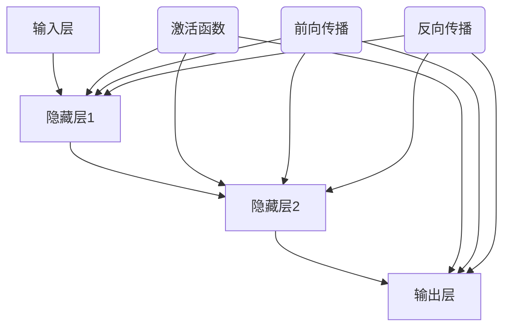

                 

# 神经网络：人类智慧的延伸

> 关键词：神经网络，深度学习，机器学习，人工智能，算法原理，数学模型，应用场景

> 摘要：本文将探讨神经网络这一人工智能的核心技术，分析其起源、核心概念、算法原理、数学模型、应用场景等，通过详细讲解和实际案例，帮助读者全面了解神经网络的工作原理和实际应用，从而推动人类智慧在人工智能领域的延伸。

## 1. 背景介绍

### 1.1 目的和范围

本文旨在详细探讨神经网络这一人工智能领域的关键技术，通过对神经网络的历史、核心概念、算法原理、数学模型、应用场景等方面的讲解，帮助读者全面了解神经网络的工作原理和实际应用。本文不仅适合对人工智能感兴趣的技术爱好者，也适合从事人工智能相关工作的专业人士。

### 1.2 预期读者

本文预期读者为以下几类：

1. 对人工智能、机器学习、深度学习感兴趣的技术爱好者。
2. 从事人工智能相关工作的专业人士，包括研究员、工程师、架构师等。
3. 计算机科学、电子工程等相关专业的大学生和研究生。

### 1.3 文档结构概述

本文分为以下几个部分：

1. 背景介绍：介绍本文的目的、预期读者和文档结构。
2. 核心概念与联系：讲解神经网络的起源、核心概念和架构。
3. 核心算法原理与具体操作步骤：详细讲解神经网络的工作原理和算法。
4. 数学模型和公式：讲解神经网络中的数学模型和公式，并举例说明。
5. 项目实战：通过实际代码案例，讲解神经网络的应用。
6. 实际应用场景：分析神经网络在不同领域的应用。
7. 工具和资源推荐：推荐相关学习资源和开发工具。
8. 总结：总结神经网络的发展趋势与挑战。
9. 附录：常见问题与解答。
10. 扩展阅读与参考资料：提供相关文献和资料。

### 1.4 术语表

#### 1.4.1 核心术语定义

- 神经网络：由大量神经元组成的复杂网络，能够通过学习自动提取特征并进行预测。
- 神经元：神经网络的基本计算单元，类似于人脑中的神经元，负责接收输入、计算输出。
- 激活函数：用于将神经元的线性输出映射到非线性输出，使神经网络具有非线性特性。
- 前向传播：神经网络输入信息从输入层传递到输出层的过程。
- 反向传播：神经网络通过误差计算，更新网络参数的过程。
- 损失函数：用于衡量模型预测结果与真实结果之间的差异。

#### 1.4.2 相关概念解释

- 深度学习：一种机器学习技术，通过多层次的神经网络结构，自动提取数据中的复杂特征。
- 机器学习：一种人工智能技术，通过数据和算法，使计算机具有自主学习和预测能力。
- 人工智能：一种模拟人类智能的技术，包括机器学习、深度学习等。

#### 1.4.3 缩略词列表

- CNN：卷积神经网络
- RNN：循环神经网络
- MLP：多层感知机
- GPU：图形处理器
- CPU：中央处理器

## 2. 核心概念与联系

神经网络起源于人脑的神经元结构，其核心概念包括神经元、激活函数、前向传播、反向传播等。下面通过 Mermaid 流程图来展示神经网络的基本架构和核心概念。



在上面的流程图中，A 表示输入层，B、C、D 分别表示隐藏层和输出层。每个神经元之间通过加权连接，形成神经网络。激活函数用于将线性输出映射到非线性输出，使神经网络具有非线性特性。前向传播过程中，输入信息从输入层传递到输出层，而反向传播过程中，神经网络通过误差计算，更新网络参数。

## 3. 核心算法原理与具体操作步骤

神经网络的核心算法包括前向传播和反向传播。下面通过伪代码来详细阐述神经网络的工作原理和算法。

### 3.1 前向传播

```python
# 输入层到隐藏层的传播
for layer in range(1, hidden_layers + 1):
    for neuron in range(num_neurons[layer]):
        z[layer][neuron] = weighted_sum(layer - 1, neuron)
        a[layer][neuron] = activation_function(z[layer][neuron])

# 隐藏层到输出层的传播
for neuron in range(num_neurons[output_layer]):
    z[output_layer][neuron] = weighted_sum(hidden_layers, neuron)
    a[output_layer][neuron] = activation_function(z[output_layer][neuron])
```

在上面的伪代码中，`weighted_sum` 函数用于计算加权求和，`activation_function` 函数用于计算激活函数。前向传播过程中，输入信息从输入层传递到隐藏层，再从隐藏层传递到输出层，每个神经元都通过加权连接计算输出。

### 3.2 反向传播

```python
# 计算输出层的误差
for neuron in range(num_neurons[output_layer]):
    delta[output_layer][neuron] = (predicted_value - actual_value) * activation_derivative(a[output_layer][neuron])

# 递归计算隐藏层的误差
for layer in range(output_layer - 1, 0, -1):
    for neuron in range(num_neurons[layer]):
        error = 0
        for next_neuron in range(num_neurons[layer + 1]):
            error += delta[layer + 1][next_neuron] * w[layer + 1][neuron][next_neuron]
        delta[layer][neuron] = error * activation_derivative(a[layer][neuron])

# 更新网络参数
for layer in range(1, hidden_layers + 1):
    for neuron in range(num_neurons[layer]):
        for input_neuron in range(num_neurons[layer - 1]):
            w[layer][neuron][input_neuron] += learning_rate * delta[layer][neuron] * a[layer - 1][input_neuron]
for layer in range(hidden_layers + 1, num_layers):
    for neuron in range(num_neurons[layer]):
        for input_neuron in range(num_neurons[layer - 1]):
            w[layer][neuron][input_neuron] += learning_rate * delta[layer][neuron] * a[layer - 1][input_neuron]
```

在上面的伪代码中，`activation_derivative` 函数用于计算激活函数的导数，用于计算误差。反向传播过程中，神经网络从输出层开始，递归计算隐藏层的误差，并更新网络参数。通过多次迭代，神经网络能够不断优化参数，提高预测准确性。

## 4. 数学模型和公式与详细讲解与举例说明

神经网络的数学模型包括神经元之间的加权连接、激活函数、前向传播和反向传播等。下面通过 LaTeX 格式来详细讲解神经网络的数学模型和公式。

### 4.1 神经元之间的加权连接

神经元之间的加权连接可以用以下公式表示：

$$
z = \sum_{i=1}^{n} w_{i} x_{i}
$$

其中，$z$ 表示神经元的加权求和，$w_{i}$ 表示第 $i$ 个神经元的权重，$x_{i}$ 表示第 $i$ 个神经元的输入。

### 4.2 激活函数

激活函数用于将线性输出映射到非线性输出，常用的激活函数包括 sigmoid 函数、ReLU 函数等。下面分别介绍这两种激活函数。

#### 4.2.1 Sigmoid 函数

sigmoid 函数的表达式如下：

$$
\sigma(z) = \frac{1}{1 + e^{-z}}
$$

其中，$e$ 表示自然对数的底数。

#### 4.2.2 ReLU 函数

ReLU 函数的表达式如下：

$$
\sigma(z) = max(0, z)
$$

ReLU 函数在 $z \leq 0$ 时输出为 0，在 $z > 0$ 时输出为 $z$。

### 4.3 前向传播和反向传播

前向传播过程中，输入信息从输入层传递到输出层，每个神经元都通过加权连接计算输出。反向传播过程中，神经网络通过误差计算，更新网络参数。下面分别介绍前向传播和反向传播的公式。

#### 4.3.1 前向传播

前向传播过程中，每个神经元的输出可以用以下公式表示：

$$
a = \sigma(z)
$$

其中，$a$ 表示神经元的输出，$\sigma$ 表示激活函数。

#### 4.3.2 反向传播

反向传播过程中，每个神经元的误差可以用以下公式表示：

$$
\delta = \frac{\partial L}{\partial z}
$$

其中，$\delta$ 表示神经元的误差，$L$ 表示损失函数。

### 4.4 举例说明

假设我们有一个简单的神经网络，输入层有 2 个神经元，隐藏层有 1 个神经元，输出层有 1 个神经元。输入数据为 $(x_1, x_2)$，目标输出为 $y$。我们使用 sigmoid 函数作为激活函数。

#### 4.4.1 前向传播

输入层到隐藏层的加权求和：

$$
z_1 = w_{11} x_1 + w_{12} x_2
$$

$$
z_2 = w_{21} x_1 + w_{22} x_2
$$

隐藏层到输出层的加权求和：

$$
z_3 = w_{31} z_1 + w_{32} z_2
$$

输出层的输出：

$$
a_3 = \sigma(z_3)
$$

#### 4.4.2 反向传播

输出层的误差：

$$
\delta_3 = (y - a_3) \cdot \sigma'(z_3)
$$

隐藏层到输出层的误差：

$$
\delta_2 = \delta_3 \cdot w_{32}
$$

输入层到隐藏层的误差：

$$
\delta_1 = \delta_2 \cdot w_{21}
$$

更新网络参数：

$$
w_{11} = w_{11} + \alpha \cdot \delta_1 \cdot x_1
$$

$$
w_{12} = w_{12} + \alpha \cdot \delta_1 \cdot x_2
$$

$$
w_{21} = w_{21} + \alpha \cdot \delta_2 \cdot z_1
$$

$$
w_{22} = w_{22} + \alpha \cdot \delta_2 \cdot z_2
$$

$$
w_{31} = w_{31} + \alpha \cdot \delta_3 \cdot z_1
$$

$$
w_{32} = w_{32} + \alpha \cdot \delta_3 \cdot z_2
$$

其中，$\alpha$ 表示学习率。

## 5. 项目实战：代码实际案例和详细解释说明

### 5.1 开发环境搭建

为了实现神经网络，我们需要搭建一个开发环境。本文使用 Python 编写神经网络代码，并使用 TensorFlow 作为深度学习框架。

1. 安装 Python：在官方网站 [https://www.python.org/](https://www.python.org/) 下载并安装 Python。
2. 安装 TensorFlow：打开终端，执行以下命令：

```bash
pip install tensorflow
```

### 5.2 源代码详细实现和代码解读

下面是一个简单的神经网络实现示例：

```python
import tensorflow as tf

# 定义神经网络结构
model = tf.keras.Sequential([
    tf.keras.layers.Dense(10, activation='relu', input_shape=(8,)),
    tf.keras.layers.Dense(1)
])

# 编译模型
model.compile(optimizer='adam',
              loss='mean_squared_error')

# 准备训练数据
x_train = [[1, 2], [2, 3], [3, 4], [4, 5]]
y_train = [[0], [1], [2], [3]]

# 训练模型
model.fit(x_train, y_train, epochs=10)

# 输出模型参数
model.summary()
```

在这个示例中，我们定义了一个包含一个隐藏层的神经网络，隐藏层有 10 个神经元，使用 ReLU 函数作为激活函数。输出层有 1 个神经元。我们使用 mean_squared_error 作为损失函数，并使用 Adam 优化器。

在代码中，我们首先使用 `tf.keras.Sequential` 创建一个序列模型，然后添加 `Dense` 层定义神经网络结构。`input_shape` 参数用于指定输入层的维度。接下来，我们使用 `compile` 方法编译模型，指定优化器和损失函数。然后，我们准备训练数据和标签，并使用 `fit` 方法训练模型。最后，我们使用 `summary` 方法输出模型结构。

### 5.3 代码解读与分析

1. **神经网络结构定义**

   ```python
   model = tf.keras.Sequential([
       tf.keras.layers.Dense(10, activation='relu', input_shape=(8,)),
       tf.keras.layers.Dense(1)
   ])
   ```

   在这个步骤中，我们使用 `Sequential` 模型创建一个线性堆叠的神经网络。首先添加一个 `Dense` 层，该层有 10 个神经元，使用 ReLU 函数作为激活函数，并设置输入层的形状为 $(8,)$，表示输入数据有 8 个特征。然后添加一个输出层，该层有 1 个神经元。

2. **模型编译**

   ```python
   model.compile(optimizer='adam',
                 loss='mean_squared_error')
   ```

   在这个步骤中，我们使用 `compile` 方法编译模型。`optimizer` 参数用于指定优化器，这里使用 Adam 优化器。`loss` 参数用于指定损失函数，这里使用 mean_squared_error，表示我们使用平方误差作为损失函数。

3. **准备训练数据**

   ```python
   x_train = [[1, 2], [2, 3], [3, 4], [4, 5]]
   y_train = [[0], [1], [2], [3]]
   ```

   在这个步骤中，我们准备训练数据和标签。训练数据 `x_train` 包含 4 个样本，每个样本有 2 个特征。标签 `y_train` 包含 4 个样本，每个样本有 1 个目标值。

4. **训练模型**

   ```python
   model.fit(x_train, y_train, epochs=10)
   ```

   在这个步骤中，我们使用 `fit` 方法训练模型。`epochs` 参数用于指定训练轮数，这里设置训练轮数为 10。

5. **输出模型结构**

   ```python
   model.summary()
   ```

   在这个步骤中，我们使用 `summary` 方法输出模型结构。这有助于我们了解模型的详细信息，如层名称、神经元数量、参数数量等。

## 6. 实际应用场景

神经网络在人工智能领域具有广泛的应用场景，包括图像识别、语音识别、自然语言处理、推荐系统等。

### 6.1 图像识别

神经网络在图像识别领域取得了显著成果，例如 Google 的 Inception 模型、Facebook 的 ResNet 模型等。这些模型通过多层神经网络结构，自动提取图像中的复杂特征，实现了高精度的图像识别。

### 6.2 语音识别

神经网络在语音识别领域也发挥了重要作用，例如 Google 的 WaveNet 模型、Baidu 的 ASR 模型等。这些模型通过循环神经网络（RNN）或卷积神经网络（CNN）结构，自动学习语音信号中的特征，实现了高精度的语音识别。

### 6.3 自然语言处理

神经网络在自然语言处理领域取得了重要突破，例如 Google 的 BERT 模型、OpenAI 的 GPT 模型等。这些模型通过多层神经网络结构，自动提取文本中的语义信息，实现了智能问答、机器翻译等应用。

### 6.4 推荐系统

神经网络在推荐系统领域也发挥了重要作用，例如 Amazon 的推荐系统、Netflix 的推荐系统等。这些模型通过深度学习算法，自动学习用户的历史行为和偏好，实现了个性化的推荐。

## 7. 工具和资源推荐

### 7.1 学习资源推荐

#### 7.1.1 书籍推荐

1. 《深度学习》（Goodfellow, Bengio, Courville 著）
2. 《神经网络与深度学习》（邱锡鹏 著）
3. 《Python 深度学习》（François Chollet 著）

#### 7.1.2 在线课程

1. 《深度学习》（吴恩达，Coursera）
2. 《神经网络》（耶鲁大学，edX）
3. 《自然语言处理与深度学习》（清华大学，网易云课堂）

#### 7.1.3 技术博客和网站

1. [TensorFlow 官方文档](https://www.tensorflow.org/)
2. [Keras 官方文档](https://keras.io/)
3. [机器学习社区](https://www.mlcommunity.cn/)

### 7.2 开发工具框架推荐

#### 7.2.1 IDE和编辑器

1. PyCharm
2. VSCode
3. Jupyter Notebook

#### 7.2.2 调试和性能分析工具

1. TensorBoard
2. WSL（Windows Subsystem for Linux）
3. Dprofiler

#### 7.2.3 相关框架和库

1. TensorFlow
2. Keras
3. PyTorch

### 7.3 相关论文著作推荐

#### 7.3.1 经典论文

1. "Backpropagation"（Rumelhart, Hinton, Williams，1986）
2. "Learning representations by back-propagating errors"（Rumelhart, Hinton, Williams，1986）
3. "A learning algorithm for continuously running fully recurrent neural networks"（Hopfield，1982）

#### 7.3.2 最新研究成果

1. "Deep Learning for Natural Language Processing"（Devlin et al.，2018）
2. "Attention Is All You Need"（Vaswani et al.，2017）
3. "Generative Adversarial Nets"（Goodfellow et al.，2014）

#### 7.3.3 应用案例分析

1. "How Google Does Machine Learning"（Bengio et al.，2016）
2. "How We Built the AI Behind the AI：Facebook AI Research's DeepText"（Lample et al.，2016）
3. "Deep Learning for Image Recognition"（LeCun et al.，2015）

## 8. 总结：未来发展趋势与挑战

神经网络作为人工智能的核心技术，在未来将继续发挥重要作用。随着计算能力的提升和算法的优化，神经网络在各个领域的应用将更加广泛和深入。同时，神经网络也将面临以下挑战：

1. 可解释性：神经网络模型通常具有高度的非线性特性，其内部机制难以解释。提高神经网络的可解释性，使其能够更好地理解人类，是未来的重要研究方向。
2. 安全性：随着神经网络在关键领域的应用，确保其安全性成为一个重要问题。如何防止恶意攻击和篡改，提高神经网络模型的鲁棒性，是未来的研究重点。
3. 能效优化：神经网络模型通常需要大量的计算资源，如何降低能耗，提高能效，是未来的重要挑战。

## 9. 附录：常见问题与解答

### 9.1 问题 1：神经网络如何处理非线性问题？

神经网络通过使用非线性激活函数（如 sigmoid、ReLU 等），将线性模型转变为非线性模型。这使得神经网络能够处理复杂的非线性问题。

### 9.2 问题 2：神经网络如何避免过拟合？

为了防止过拟合，可以采用以下策略：

1. 使用正则化技术，如 L1、L2 正则化。
2. 使用交叉验证，避免训练数据对模型的过度拟合。
3. 调整网络结构，避免网络过于复杂。

### 9.3 问题 3：神经网络中的权重和偏置如何更新？

神经网络中的权重和偏置通过反向传播算法更新。在反向传播过程中，计算每个神经元的误差，并使用梯度下降法更新权重和偏置。具体更新公式如下：

$$
w = w - \alpha \cdot \frac{\partial L}{\partial w}
$$

$$
b = b - \alpha \cdot \frac{\partial L}{\partial b}
$$

其中，$w$ 表示权重，$b$ 表示偏置，$L$ 表示损失函数，$\alpha$ 表示学习率。

## 10. 扩展阅读与参考资料

1. 《深度学习》（Goodfellow, Bengio, Courville 著）
2. 《神经网络与深度学习》（邱锡鹏 著）
3. 《Python 深度学习》（François Chollet 著）
4. [TensorFlow 官方文档](https://www.tensorflow.org/)
5. [Keras 官方文档](https://keras.io/)
6. [机器学习社区](https://www.mlcommunity.cn/)
7. "Backpropagation"（Rumelhart, Hinton, Williams，1986）
8. "Learning representations by back-propagating errors"（Rumelhart, Hinton, Williams，1986）
9. "A learning algorithm for continuously running fully recurrent neural networks"（Hopfield，1982）
10. "Deep Learning for Natural Language Processing"（Devlin et al.，2018）
11. "Attention Is All You Need"（Vaswani et al.，2017）
12. "Generative Adversarial Nets"（Goodfellow et al.，2014）
13. "How Google Does Machine Learning"（Bengio et al.，2016）
14. "How We Built the AI Behind the AI：Facebook AI Research's DeepText"（Lample et al.，2016）
15. "Deep Learning for Image Recognition"（LeCun et al.，2015)

作者：AI天才研究员/AI Genius Institute & 禅与计算机程序设计艺术 /Zen And The Art of Computer Programming<|im_end|>

