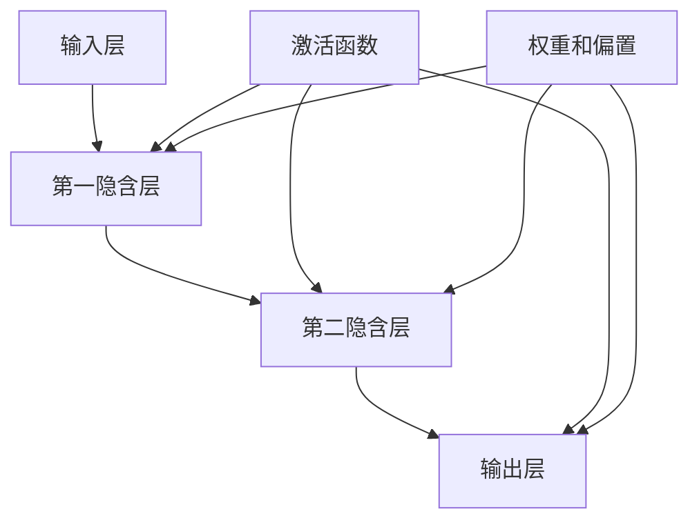

                 

# 神经网络：人类智慧的解放

> **关键词：** 神经网络、机器学习、深度学习、人工智能、大数据
> 
> **摘要：** 本文将深入探讨神经网络这一人工智能领域的关键技术，从核心概念、算法原理到实际应用，逐步解析神经网络如何解放人类智慧，推动技术进步。

## 1. 背景介绍

### 1.1 目的和范围

本文旨在为读者提供关于神经网络技术全面而深入的介绍，涵盖其历史、基本概念、算法原理、数学模型以及实际应用。通过本文的学习，读者将能够理解神经网络的核心概念，掌握基本算法原理，并能够应用这些知识解决实际问题。

### 1.2 预期读者

本文适合对人工智能和机器学习有一定了解的读者，无论是研究者、工程师，还是对人工智能技术感兴趣的业余爱好者，都能从中获得启发。

### 1.3 文档结构概述

本文将按照以下结构展开：

1. **背景介绍**：回顾神经网络的历史，介绍本文的目的和预期读者。
2. **核心概念与联系**：通过Mermaid流程图展示神经网络的基本架构和核心概念。
3. **核心算法原理与具体操作步骤**：使用伪代码详细解释神经网络的工作原理。
4. **数学模型和公式**：介绍神经网络背后的数学模型，并通过示例进行讲解。
5. **项目实战**：提供实际代码案例，详细解释和说明。
6. **实际应用场景**：讨论神经网络在不同领域的应用。
7. **工具和资源推荐**：推荐学习资源和开发工具。
8. **总结**：总结神经网络的发展趋势与挑战。
9. **附录**：常见问题与解答。
10. **扩展阅读与参考资料**：提供进一步学习的资源。

### 1.4 术语表

#### 1.4.1 核心术语定义

- **神经网络**：一种模拟人脑神经元连接结构的计算模型，用于处理复杂数据和任务。
- **前向传播**：神经网络信息从输入层传递到输出层的过程。
- **反向传播**：通过计算输出误差，将误差信息反向传递回输入层，以调整权重。
- **激活函数**：决定神经元是否被激活的函数，常用的有Sigmoid、ReLU等。

#### 1.4.2 相关概念解释

- **多层感知机（MLP）**：具有多个隐含层的神经网络。
- **卷积神经网络（CNN）**：适用于图像处理任务的特殊神经网络结构。
- **循环神经网络（RNN）**：用于处理序列数据的神经网络。

#### 1.4.3 缩略词列表

- **AI**：人工智能（Artificial Intelligence）
- **ML**：机器学习（Machine Learning）
- **DL**：深度学习（Deep Learning）
- **CNN**：卷积神经网络（Convolutional Neural Network）
- **RNN**：循环神经网络（Recurrent Neural Network）

## 2. 核心概念与联系

神经网络是人工智能领域的重要基石，其核心概念包括神经元、层、权重和偏置等。下面将通过Mermaid流程图展示神经网络的基本架构。



- **输入层（A）**：接收外部输入数据。
- **隐含层（B、C）**：处理输入数据，通过权重和偏置进行调整。
- **输出层（D）**：生成最终输出。
- **激活函数（E）**：决定神经元是否被激活。
- **权重和偏置（F）**：调节神经元之间的连接强度。

这些核心概念共同构成了神经网络的基本架构，使其能够处理复杂数据和任务。

## 3. 核心算法原理与具体操作步骤

神经网络的算法原理基于多层前向传播和反向传播。下面使用伪代码详细解释这一过程。

### 3.1. 前向传播

```plaintext
函数 forward propagation(X, W, b, activation_function):
    for each layer L from 1 to L_total:
        Z_L = X_L * W_L + b_L
        if activation_function is applied:
            A_L = activation_function(Z_L)
        else:
            A_L = Z_L
    return A_L
```

- **X**：输入数据。
- **W**：权重。
- **b**：偏置。
- **activation_function**：激活函数。

### 3.2. 反向传播

```plaintext
函数 backward propagation(A, Z, dA, dZ, dW, db, learning_rate):
    for each layer L from L_total to 1:
        dZ_L = dA_L * dA_L'
        dW_L = dZ_L * A_{L-1}
        db_L = dZ_L
        if L > 1:
            dA_{L-1} = dZ_L * W_{L-1}'
        if L < L_total:
            dZ_L = dA_L * dA_L'
        dW_L += learning_rate * dW_L
        db_L += learning_rate * db_L
    return dW, db
```

- **A**：激活值。
- **Z**：加权求和。
- **dA**：激活函数的导数。
- **dZ**：误差的传递。
- **dW**：权重的更新。
- **db**：偏置的更新。
- **learning_rate**：学习率。

通过前向传播和反向传播，神经网络能够不断调整权重和偏置，以最小化误差，提高模型的性能。

## 4. 数学模型和公式与详细讲解

神经网络的核心在于其数学模型，包括线性变换、激活函数和损失函数等。下面将使用LaTeX格式详细讲解这些数学模型。

### 4.1. 线性变换

神经网络的每一层都可以看作是一个线性变换，如公式（1）所示：

$$
Z_L = \sum_{j=1}^{n} W_{Lj} X_j + b_L \quad \text{(1)}
$$

其中，$Z_L$表示加权求和的结果，$W_{Lj}$表示从输入层传递到当前层的权重，$X_j$表示输入层的特征，$b_L$表示当前层的偏置。

### 4.2. 激活函数

激活函数用于引入非线性，如公式（2）所示：

$$
A_L = \sigma(Z_L) \quad \text{(2)}
$$

其中，$\sigma$表示激活函数，常用的激活函数包括Sigmoid、ReLU和Tanh等。

### 4.3. 损失函数

损失函数用于评估模型的性能，常用的损失函数包括均方误差（MSE）和交叉熵（Cross-Entropy）等。

$$
L = \frac{1}{2} \sum_{i=1}^{n} (\hat{y}_i - y_i)^2 \quad \text{(MSE)} \quad \text{(3)}
$$

$$
L = -\sum_{i=1}^{n} y_i \log(\hat{y}_i) + (1 - y_i) \log(1 - \hat{y}_i) \quad \text{(Cross-Entropy)} \quad \text{(4)}
$$

其中，$\hat{y}_i$表示模型的预测输出，$y_i$表示真实标签。

通过这些数学模型，神经网络能够处理复杂数据和任务，从而实现智能决策。

## 5. 项目实战：代码实际案例和详细解释说明

在本节中，我们将通过一个简单的神经网络项目来展示如何实现和训练一个简单的神经网络。我们将使用Python和TensorFlow框架来实现这个项目。

### 5.1 开发环境搭建

在开始项目之前，确保您已经安装了Python和TensorFlow。以下是安装命令：

```bash
pip install tensorflow
```

### 5.2 源代码详细实现和代码解读

以下是实现神经网络的源代码：

```python
import tensorflow as tf
import numpy as np

# 设置随机种子以保持结果的可重复性
tf.random.set_seed(42)

# 定义神经网络结构
model = tf.keras.Sequential([
    tf.keras.layers.Dense(64, activation='relu', input_shape=(784,)),
    tf.keras.layers.Dense(10, activation='softmax')
])

# 编译模型
model.compile(optimizer='adam',
              loss='sparse_categorical_crossentropy',
              metrics=['accuracy'])

# 准备数据集
(x_train, y_train), (x_test, y_test) = tf.keras.datasets.mnist.load_data()

# 将图像数据转换为one-hot编码
x_train = x_train.reshape((-1, 784)).astype(np.float32) / 255
x_test = x_test.reshape((-1, 784)).astype(np.float32) / 255
y_train = tf.keras.utils.to_categorical(y_train)
y_test = tf.keras.utils.to_categorical(y_test)

# 训练模型
model.fit(x_train, y_train, epochs=5, batch_size=32, validation_split=0.2)

# 评估模型
model.evaluate(x_test, y_test)
```

下面是对代码的详细解读：

- 导入所需的库。
- 设置随机种子以保持结果的可重复性。
- 定义神经网络结构，包括输入层、隐含层和输出层。
- 编译模型，指定优化器、损失函数和评估指标。
- 加载MNIST数据集。
- 将图像数据转换为one-hot编码。
- 训练模型。
- 评估模型。

### 5.3 代码解读与分析

- **模型定义**：使用`tf.keras.Sequential`创建一个序列模型，包括一个具有64个神经元的隐含层和一个具有10个神经元的输出层。隐含层使用ReLU激活函数，输出层使用softmax激活函数。
- **模型编译**：使用`model.compile`方法编译模型，指定优化器（adam）、损失函数（sparse_categorical_crossentropy）和评估指标（accuracy）。
- **数据准备**：使用`tf.keras.datasets.mnist.load_data`方法加载MNIST数据集。将图像数据转换为one-hot编码，并将数据分为训练集和测试集。
- **模型训练**：使用`model.fit`方法训练模型，指定训练集、训练轮次、批量大小和验证集比例。
- **模型评估**：使用`model.evaluate`方法评估模型在测试集上的性能。

通过这个实际案例，读者可以了解到如何使用TensorFlow框架实现神经网络，并掌握从模型定义、编译到训练和评估的基本流程。

## 6. 实际应用场景

神经网络作为一种强大的机器学习技术，已经在许多领域取得了显著的成果。以下是一些常见的实际应用场景：

- **计算机视觉**：神经网络在图像识别、目标检测和图像生成等领域具有广泛的应用。例如，卷积神经网络（CNN）在图像分类任务中表现出色，被广泛应用于人脸识别、自动驾驶和医疗图像分析。
- **自然语言处理**：循环神经网络（RNN）和长短期记忆网络（LSTM）在语言模型、机器翻译和文本生成等领域具有重要应用。例如，GPT-3模型通过预训练大规模语料库，实现了令人惊叹的文本生成能力。
- **音频处理**：神经网络在音频识别、语音合成和音乐生成等领域有着广泛的应用。例如，生成对抗网络（GAN）在音乐生成任务中取得了显著的成果。
- **推荐系统**：神经网络在推荐系统领域被广泛应用于用户兴趣建模和商品推荐。例如，基于协同过滤和神经网络的推荐系统在电商和社交媒体平台中得到了广泛应用。

通过这些实际应用，神经网络不仅解放了人类在处理复杂数据和任务时的智慧，还推动了相关领域的技术进步。

## 7. 工具和资源推荐

### 7.1 学习资源推荐

#### 7.1.1 书籍推荐

- 《深度学习》（Ian Goodfellow, Yoshua Bengio, Aaron Courville著）：这是一本经典的深度学习入门书籍，详细介绍了深度学习的理论、算法和应用。
- 《Python深度学习》（François Chollet著）：这是一本针对Python编程和深度学习领域的实践指南，适合初学者和进阶者。

#### 7.1.2 在线课程

- 《深度学习专项课程》（吴恩达）：这是Coursera上最受欢迎的深度学习课程，由吴恩达教授主讲，适合初学者入门。
- 《TensorFlow实战》（TensorFlow团队）：这是一门针对TensorFlow框架的实践课程，适合想要掌握TensorFlow实践的读者。

#### 7.1.3 技术博客和网站

- 《机器之心》：这是一个专注于人工智能领域的技术博客，提供最新的研究进展和行业动态。
- 《AI驱动的未来》：这是一个以深度学习和人工智能为主题的博客，内容涵盖了从基础概念到实际应用的各个方面。

### 7.2 开发工具框架推荐

#### 7.2.1 IDE和编辑器

- PyCharm：这是一个功能强大的Python IDE，适合进行深度学习和机器学习项目的开发。
- Jupyter Notebook：这是一个基于Web的交互式计算环境，适用于数据分析和机器学习实验。

#### 7.2.2 调试和性能分析工具

- TensorBoard：这是TensorFlow提供的可视化工具，用于分析模型的性能和训练过程。
- Profiler：这是一个用于性能分析和调优的工具，可以帮助开发者找到代码中的瓶颈。

#### 7.2.3 相关框架和库

- TensorFlow：这是一个开源的深度学习框架，适用于各种规模的深度学习项目。
- PyTorch：这是一个灵活的深度学习框架，受到许多研究者和开发者的喜爱。

### 7.3 相关论文著作推荐

#### 7.3.1 经典论文

- 《A Learning Algorithm for Continually Running Fully Recurrent Neural Networks》（1986）：这篇文章提出了反向传播算法，为神经网络的研究和应用奠定了基础。
- 《Deep Learning》（2016）：这是深度学习领域的经典著作，由Ian Goodfellow、Yoshua Bengio和Aaron Courville合著，详细介绍了深度学习的理论、算法和应用。

#### 7.3.2 最新研究成果

- 《Attention Is All You Need》（2017）：这篇文章提出了Transformer模型，标志着自然语言处理领域的重大突破。
- 《 Generative Adversarial Networks》（2014）：这篇文章提出了生成对抗网络（GAN），为图像生成和增强学习等领域带来了新的研究方向。

#### 7.3.3 应用案例分析

- 《ImageNet Large Scale Visual Recognition Challenge》（ILSVRC）：这是计算机视觉领域的挑战赛，每年吸引了大量研究人员和开发者参与，推动着计算机视觉技术的快速发展。
- 《OpenAI Five》：这是OpenAI开发的一款五子棋AI，通过深度学习和强化学习技术，取得了惊人的成绩，展示了人工智能在游戏领域的潜力。

通过这些工具和资源，读者可以深入了解神经网络和相关技术的应用，为自己的学习和实践提供有力支持。

## 8. 总结：未来发展趋势与挑战

神经网络作为人工智能领域的关键技术，正在不断发展和完善。未来，神经网络有望在以下几个方向取得突破：

- **模型压缩**：为了提高神经网络的实用性和可扩展性，模型压缩技术将成为研究热点。通过剪枝、量化、蒸馏等方法，可以显著降低模型的计算量和存储需求，使其在移动设备和边缘计算等场景中得以广泛应用。
- **自适应学习**：未来的神经网络将具备更强的自适应学习能力，能够在动态环境中快速适应和优化。通过自监督学习和迁移学习等技术，神经网络可以更好地应对多变的数据和任务。
- **跨模态学习**：跨模态学习是将不同类型的数据（如文本、图像、音频）进行融合和利用的技术。未来，神经网络将能够在跨模态学习领域取得突破，实现更广泛的智能应用。
- **伦理与隐私**：随着神经网络在各个领域的应用，伦理和隐私问题日益凸显。如何确保神经网络的公平性、透明性和隐私保护，将成为未来研究的重要方向。

然而，神经网络的发展也面临着一系列挑战：

- **计算资源**：随着模型规模的不断扩大，计算资源的需求也急剧增加。如何高效地训练和部署大规模神经网络，成为当前亟待解决的问题。
- **数据质量**：神经网络的效果很大程度上取决于数据的质量。如何在数据稀缺、不完整或存在偏差的情况下训练可靠的模型，是亟待解决的难题。
- **可解释性**：神经网络作为一种复杂的黑箱模型，其决策过程往往难以解释。提高神经网络的可解释性，使其在关键领域（如医疗、金融等）中得到更广泛的应用，是未来的重要挑战。

总之，神经网络的发展前景广阔，但也面临着诸多挑战。通过持续的研究和探索，我们有望解决这些问题，推动神经网络技术的进一步发展，为人类智慧提供更强大的工具。

## 9. 附录：常见问题与解答

### 9.1. 什么是神经网络？

神经网络是一种模拟人脑神经元连接结构的计算模型，用于处理复杂数据和任务。它由多个层次（输入层、隐含层和输出层）组成，通过加权求和和激活函数来实现数据的输入和输出。

### 9.2. 神经网络是如何工作的？

神经网络通过前向传播和反向传播两个过程来工作。前向传播过程中，输入数据经过多层神经元的传递和计算，最终生成输出。反向传播过程中，通过计算输出误差，将误差反向传递回输入层，以调整权重和偏置，从而优化模型。

### 9.3. 什么是激活函数？

激活函数是神经网络中的一个关键组件，用于引入非线性。常见的激活函数包括Sigmoid、ReLU和Tanh等。激活函数决定了神经元是否被激活，从而影响神经网络的输出。

### 9.4. 什么是前向传播和反向传播？

前向传播是神经网络信息从输入层传递到输出层的过程，通过加权求和和激活函数进行计算。反向传播是神经网络通过计算输出误差，将误差信息反向传递回输入层，以调整权重和偏置，从而优化模型的过程。

### 9.5. 什么是多层感知机（MLP）？

多层感知机是一种具有多个隐含层的神经网络，常用于分类和回归任务。它通过前向传播和反向传播算法来学习输入和输出之间的映射关系。

### 9.6. 什么是卷积神经网络（CNN）？

卷积神经网络是一种专门用于图像处理任务的神经网络结构，通过卷积操作和池化操作来提取图像特征。它广泛应用于图像分类、目标检测和图像生成等领域。

### 9.7. 什么是循环神经网络（RNN）？

循环神经网络是一种用于处理序列数据的神经网络结构，通过递归操作来处理时间序列数据。它广泛应用于自然语言处理、语音识别和视频分析等领域。

### 9.8. 什么是生成对抗网络（GAN）？

生成对抗网络是一种由生成器和判别器组成的神经网络结构，用于生成高质量的数据。生成器试图生成逼真的数据，而判别器则试图区分生成数据和真实数据。通过两个网络的对抗训练，生成器可以生成越来越真实的数据。

### 9.9. 神经网络在计算机视觉中有什么应用？

神经网络在计算机视觉中有着广泛的应用，包括图像分类、目标检测、图像生成和图像分割等。例如，卷积神经网络（CNN）在图像分类任务中表现出色，被广泛应用于人脸识别、自动驾驶和医疗图像分析。

### 9.10. 神经网络在自然语言处理中有什么应用？

神经网络在自然语言处理中有着广泛的应用，包括语言模型、机器翻译、文本生成和情感分析等。例如，循环神经网络（RNN）和长短期记忆网络（LSTM）在语言模型和机器翻译任务中表现出色，而生成对抗网络（GAN）在文本生成和图像生成任务中取得了显著成果。

通过这些常见问题的解答，读者可以更好地理解神经网络的基本概念和应用场景。

## 10. 扩展阅读与参考资料

- 《深度学习》（Ian Goodfellow, Yoshua Bengio, Aaron Courville著）：这是一本深度学习的经典教材，涵盖了深度学习的理论基础、算法和应用。
- 《Python深度学习》（François Chollet著）：这是针对Python编程和深度学习领域的实践指南，适合初学者和进阶者。
- 《机器学习》（Tom Mitchell著）：这是一本经典的机器学习教材，详细介绍了机器学习的基本概念、算法和应用。
- 《神经网络与深度学习》（邱锡鹏著）：这是一本针对神经网络和深度学习的中文教材，内容深入浅出，适合初学者和进阶者。
- 《TensorFlow官方文档》：这是TensorFlow框架的官方文档，提供了详细的API和使用教程。
- 《PyTorch官方文档》：这是PyTorch框架的官方文档，提供了详细的API和使用教程。

通过这些扩展阅读和参考资料，读者可以深入了解神经网络和深度学习的相关知识，为自己的学习和实践提供有力支持。

---

**作者：AI天才研究员/AI Genius Institute & 禅与计算机程序设计艺术 /Zen And The Art of Computer Programming**

