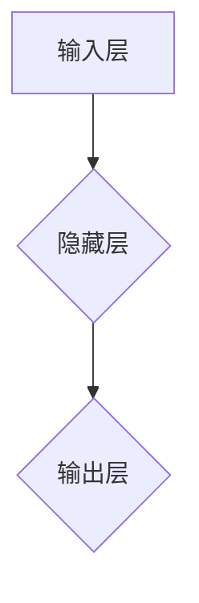
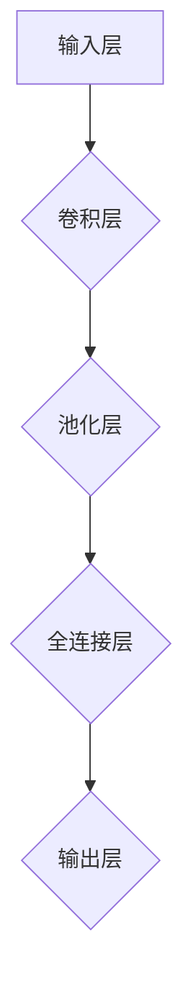
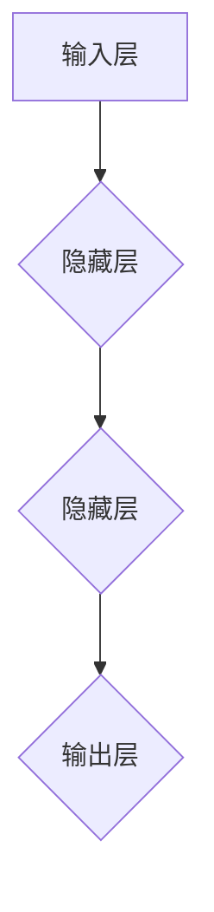
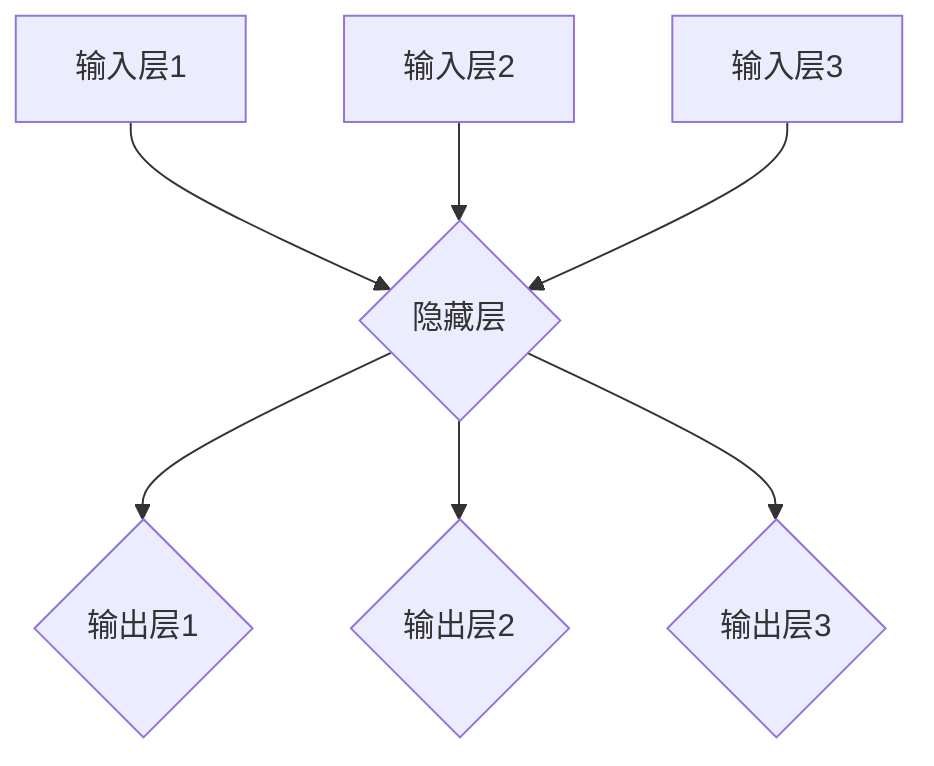
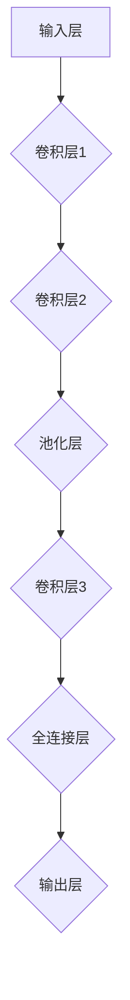
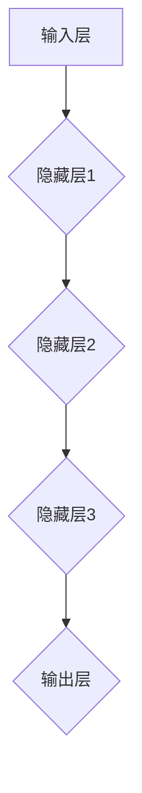

                 


# 神经网络：人类智慧的解放

> 关键词：神经网络、深度学习、人工智能、反向传播、卷积神经网络、递归神经网络
>
> 摘要：本文将深入探讨神经网络这一革命性技术，从背景介绍到核心概念，再到算法原理和数学模型，最后通过项目实战和实际应用场景展示其潜力。本文旨在帮助读者理解神经网络的工作机制，掌握关键技术和应用方法，以及展望未来发展趋势与挑战。

## 1. 背景介绍

### 1.1 目的和范围

本文旨在深入探讨神经网络这一人工智能领域的核心技术，旨在帮助读者全面了解神经网络的基本概念、算法原理、数学模型及其在实际应用中的重要性。本文将涵盖以下内容：

- 神经网络的历史和发展背景
- 神经网络的核心概念和架构
- 常见的神经网络类型及其应用场景
- 神经网络的算法原理和数学模型
- 实际应用案例和项目实战
- 神经网络的发展趋势与挑战

通过本文的阅读，读者将能够掌握神经网络的基本原理，了解其优势和应用领域，从而在人工智能的开发和应用中发挥重要作用。

### 1.2 预期读者

本文适合对人工智能和神经网络有一定了解的读者，包括：

- 计算机科学、人工智能等相关专业的研究生和本科生
- 从事人工智能研发和应用的工程师和研究人员
- 对神经网络和深度学习技术感兴趣的爱好者
- 需要了解神经网络在特定领域应用的企业和机构人员

通过本文的阅读，读者将能够深入了解神经网络的核心技术和应用方法，为后续的学习和研究打下坚实基础。

### 1.3 文档结构概述

本文将按照以下结构进行展开：

- 第1章：背景介绍
  - 1.1 目的和范围
  - 1.2 预期读者
  - 1.3 文档结构概述
  - 1.4 术语表
- 第2章：核心概念与联系
  - 2.1 神经元和神经网络
  - 2.2 神经网络的架构
  - 2.3 神经网络的连接方式
- 第3章：核心算法原理 & 具体操作步骤
  - 3.1 前向传播算法
  - 3.2 反向传播算法
  - 3.3 优化算法
- 第4章：数学模型和公式 & 详细讲解 & 举例说明
  - 4.1 激活函数
  - 4.2 失效函数
  - 4.3 梯度下降
- 第5章：项目实战：代码实际案例和详细解释说明
  - 5.1 开发环境搭建
  - 5.2 源代码详细实现和代码解读
  - 5.3 代码解读与分析
- 第6章：实际应用场景
  - 6.1 图像识别
  - 6.2 自然语言处理
  - 6.3 语音识别
- 第7章：工具和资源推荐
  - 7.1 学习资源推荐
  - 7.2 开发工具框架推荐
  - 7.3 相关论文著作推荐
- 第8章：总结：未来发展趋势与挑战
  - 8.1 发展趋势
  - 8.2 挑战与机遇
- 第9章：附录：常见问题与解答
- 第10章：扩展阅读 & 参考资料

通过本文的阅读，读者将逐步深入理解神经网络的核心技术和应用方法，为未来的研究和实践提供有力支持。

### 1.4 术语表

在本文中，我们将使用以下专业术语：

- 神经网络（Neural Network）：一种模拟人脑神经元之间相互连接和通信的计算模型。
- 前向传播（Forward Propagation）：神经网络在训练过程中，将输入数据通过网络的各个层级进行传递，直到输出层的计算过程。
- 反向传播（Back Propagation）：神经网络在训练过程中，根据输出误差，通过网络的各个层级反向更新权重和偏置的过程。
- 激活函数（Activation Function）：神经网络中用于引入非线性变换的函数，常见的有sigmoid、ReLU、tanh等。
- 失效函数（Loss Function）：用于衡量预测值与真实值之间差异的函数，常见的有均方误差（MSE）、交叉熵（CrossEntropy）等。
- 优化算法（Optimization Algorithm）：用于调整神经网络模型参数，以最小化失效函数的算法，常见的有梯度下降（Gradient Descent）、随机梯度下降（Stochastic Gradient Descent）等。
- 卷积神经网络（Convolutional Neural Network，CNN）：一种专门用于图像识别的神经网络模型，具有局部感知和共享权重等特性。
- 递归神经网络（Recurrent Neural Network，RNN）：一种能够处理序列数据的神经网络模型，具有记忆能力。

通过对这些术语的理解，读者将能够更好地掌握神经网络的核心概念和原理。

### 1.4.1 核心术语定义

在本节中，我们将对神经网络中的核心术语进行详细定义，以便读者更好地理解后续内容。

#### 1.4.1.1 神经元

神经元是神经网络的基本计算单元，类似于人脑中的神经元。神经元通过输入信号（加权求和）、激活函数（非线性变换）和输出信号（传递到下一层）来实现数据处理和特征提取。

神经元的基本结构包括：

- 输入层：接收外部输入信号。
- 隐藏层：对输入信号进行加工处理，提取特征。
- 输出层：产生最终输出结果。

#### 1.4.1.2 前向传播

前向传播是神经网络在训练过程中，将输入数据通过网络的各个层级进行传递，直到输出层的计算过程。前向传播包括以下几个步骤：

1. 将输入数据通过输入层传递到隐藏层，进行加权求和。
2. 对隐藏层的输出应用激活函数，引入非线性变换。
3. 将隐藏层的输出传递到输出层，得到最终预测结果。

#### 1.4.1.3 反向传播

反向传播是神经网络在训练过程中，根据输出误差，通过网络的各个层级反向更新权重和偏置的过程。反向传播包括以下几个步骤：

1. 计算输出层预测值与真实值之间的误差。
2. 将误差反向传递到隐藏层，计算隐藏层的梯度。
3. 根据梯度更新隐藏层的权重和偏置。
4. 重复上述过程，直到所有层的权重和偏置更新完成。

#### 1.4.1.4 激活函数

激活函数是神经网络中用于引入非线性变换的函数，常见的有sigmoid、ReLU、tanh等。激活函数的作用是使神经网络具有非线性特性，从而能够对复杂问题进行建模。

激活函数的基本形式为：

\[ f(x) = \sigma(x) \]

其中，\( \sigma \) 表示激活函数，\( x \) 表示输入值。

#### 1.4.1.5 失效函数

失效函数是用于衡量预测值与真实值之间差异的函数，常见的有均方误差（MSE）、交叉熵（CrossEntropy）等。失效函数的目的是评估神经网络在训练过程中的性能，并指导权重的调整。

失效函数的基本形式为：

\[ L(y, \hat{y}) = f(y, \hat{y}) \]

其中，\( L \) 表示失效函数，\( y \) 表示真实值，\( \hat{y} \) 表示预测值。

#### 1.4.1.6 优化算法

优化算法是用于调整神经网络模型参数，以最小化失效函数的算法，常见的有梯度下降（Gradient Descent）、随机梯度下降（Stochastic Gradient Descent）等。优化算法的目的是提高神经网络的训练效率，使网络能够更快地收敛到最优解。

优化算法的基本形式为：

\[ \theta = \theta - \alpha \frac{\partial L}{\partial \theta} \]

其中，\( \theta \) 表示模型参数，\( \alpha \) 表示学习率，\( \frac{\partial L}{\partial \theta} \) 表示参数的梯度。

#### 1.4.1.7 卷积神经网络

卷积神经网络（CNN）是一种专门用于图像识别的神经网络模型，具有局部感知和共享权重等特性。CNN主要通过卷积层、池化层和全连接层对图像进行特征提取和分类。

CNN的基本结构为：

1. 输入层：接收图像数据。
2. 卷积层：通过卷积操作提取图像特征。
3. 池化层：对卷积层输出的特征进行降采样。
4. 全连接层：对池化层输出的特征进行分类。

#### 1.4.1.8 递归神经网络

递归神经网络（RNN）是一种能够处理序列数据的神经网络模型，具有记忆能力。RNN主要通过递归连接实现对序列数据的建模。

RNN的基本结构为：

1. 输入层：接收序列数据。
2. 隐藏层：对序列数据进行递归处理，提取特征。
3. 输出层：产生最终输出结果。

通过对这些核心术语的理解，读者将能够更好地掌握神经网络的基本概念和原理。

### 1.4.2 相关概念解释

在本节中，我们将对神经网络中的一些相关概念进行解释，以便读者更好地理解神经网络的工作原理。

#### 1.4.2.1 局部感知

局部感知是卷积神经网络（CNN）的一个重要特性，指的是神经网络中的卷积层能够对图像的局部区域进行感知和处理。局部感知使得CNN能够提取图像中的局部特征，如边缘、纹理和形状等。

在CNN中，卷积操作通过在图像上滑动卷积核，计算局部区域的特征响应。卷积核中的权重参数通过训练过程学习，以适应不同图像的特征。这种局部感知能力使得CNN在图像识别任务中具有出色的性能。

#### 1.4.2.2 共享权重

共享权重是卷积神经网络（CNN）的另一个重要特性，指的是在卷积层中，同一卷积核在不同位置的权重参数是共享的。共享权重意味着卷积层中的每个卷积核都能学习到图像的通用特征，而不是独立的局部特征。

共享权重减少了模型的参数数量，降低了计算复杂度和过拟合的风险。同时，共享权重也使得CNN能够更好地泛化到未见过的图像，提高了模型的鲁棒性和泛化能力。

#### 1.4.2.3 递归连接

递归连接是递归神经网络（RNN）的核心特性，指的是神经网络中的隐藏层节点与自身相连，形成一个递归结构。递归连接使得RNN能够处理序列数据，实现对序列数据的记忆和建模。

在RNN中，每个时间步的隐藏层状态不仅依赖于当前输入，还依赖于前一个时间步的隐藏层状态。这种递归结构使得RNN能够捕捉序列数据中的时间依赖关系，如自然语言处理中的词序和上下文关系。

#### 1.4.2.4 梯度消失与梯度爆炸

梯度消失和梯度爆炸是神经网络训练过程中可能遇到的问题，会影响模型的收敛速度和稳定性。

- 梯度消失：在神经网络中，梯度的大小随着层数的增加而迅速减小，导致梯度接近于零。梯度消失使得模型难以更新深层网络的权重，从而影响训练效果。
- 梯度爆炸：在神经网络中，梯度的大小随着层数的增加而迅速增大，导致梯度发散。梯度爆炸使得模型难以收敛，甚至可能导致训练失败。

为解决梯度消失和梯度爆炸问题，可以采用以下方法：

1. 使用更深的网络结构：通过增加网络层数，使得梯度在传递过程中有所缓解。
2. 使用更小的学习率：减小学习率可以降低梯度更新过程中的剧烈变化。
3. 使用梯度裁剪：对梯度进行裁剪，限制其大小，防止梯度爆炸。
4. 使用激活函数：如ReLU，可以缓解梯度消失问题。

通过对这些相关概念的理解，读者将能够更好地掌握神经网络的工作原理，为后续内容的学习打下基础。

### 1.4.3 缩略词列表

在本文中，我们将使用以下缩略词：

- CNN：卷积神经网络（Convolutional Neural Network）
- RNN：递归神经网络（Recurrent Neural Network）
- MLP：多层感知器（Multilayer Perceptron）
- SGD：随机梯度下降（Stochastic Gradient Descent）
- MSE：均方误差（Mean Squared Error）
- BCE：二元交叉熵（Binary CrossEntropy）
- RELU：ReLU激活函数（Rectified Linear Unit）
- Sigmoid：Sigmoid激活函数（Sigmoid Function）
- Tanh：Tanh激活函数（Hyperbolic Tangent）

通过了解这些缩略词的含义，读者将能够更便捷地阅读和理解本文的内容。

## 2. 核心概念与联系

在深入了解神经网络之前，我们需要理解一些核心概念，这些概念包括神经元、神经网络、激活函数和优化算法。通过这些核心概念的讲解，我们将绘制一个Mermaid流程图，帮助读者更好地理解神经网络的工作原理和架构。

### 2.1 神经元和神经网络

神经元是神经网络的基本计算单元，类似于人脑中的神经元。一个简单的神经元可以接受多个输入信号，通过加权求和后，经过激活函数得到输出信号。多个神经元可以组成一个神经网络，用于处理和预测复杂的数据。

神经元的基本结构包括：

- 输入层：接收外部输入信号。
- 隐藏层：对输入信号进行加工处理，提取特征。
- 输出层：产生最终输出结果。

神经网络的基本结构为：

1. 输入层：接收外部输入数据。
2. 隐藏层：对输入数据进行加工处理，提取特征。
3. 输出层：产生最终输出结果。

下面是一个简单的Mermaid流程图，展示了神经元和神经网络的基本结构：



### 2.2 神经网络的架构

神经网络的架构是指网络中各个层级之间的关系和连接方式。常见的神经网络架构包括多层感知器（MLP）、卷积神经网络（CNN）和递归神经网络（RNN）。

#### 2.2.1 多层感知器（MLP）

多层感知器是一种前馈神经网络，具有输入层、隐藏层和输出层。输入数据首先通过输入层传递到隐藏层，然后通过隐藏层传递到输出层，最终得到输出结果。

多层感知器的基本结构为：

1. 输入层：接收外部输入数据。
2. 隐藏层：对输入数据进行加工处理，提取特征。
3. 输出层：产生最终输出结果。

下面是一个简单的Mermaid流程图，展示了多层感知器的结构：


#### 2.2.2 卷积神经网络（CNN）

卷积神经网络是一种专门用于图像识别的神经网络模型，具有局部感知和共享权重等特性。CNN主要通过卷积层、池化层和全连接层对图像进行特征提取和分类。

卷积神经网络的基本结构为：

1. 输入层：接收图像数据。
2. 卷积层：通过卷积操作提取图像特征。
3. 池化层：对卷积层输出的特征进行降采样。
4. 全连接层：对池化层输出的特征进行分类。

下面是一个简单的Mermaid流程图，展示了卷积神经网络的结构：



#### 2.2.3 递归神经网络（RNN）

递归神经网络是一种能够处理序列数据的神经网络模型，具有记忆能力。RNN主要通过递归连接实现对序列数据的建模。

递归神经网络的基本结构为：

1. 输入层：接收序列数据。
2. 隐藏层：对序列数据进行递归处理，提取特征。
3. 输出层：产生最终输出结果。

下面是一个简单的Mermaid流程图，展示了递归神经网络的结构：



### 2.3 神经网络的连接方式

神经网络的连接方式是指神经元之间如何连接和通信。常见的连接方式包括全连接、卷积连接和递归连接。

#### 2.3.1 全连接

全连接是指每个神经元都与前一层中的每个神经元相连。全连接网络在图像识别、分类和回归任务中应用广泛。

全连接网络的连接方式为：

1. 输入层中的每个神经元都与隐藏层中的每个神经元相连。
2. 隐藏层中的每个神经元都与输出层中的每个神经元相连。

下面是一个简单的Mermaid流程图，展示了全连接网络的连接方式：



#### 2.3.2 卷积连接

卷积连接是指卷积神经网络中卷积层之间的连接方式。卷积连接通过卷积操作提取图像特征，并具有局部感知和共享权重等特性。

卷积连接的连接方式为：

1. 输入层通过卷积操作传递到卷积层。
2. 卷积层通过卷积操作传递到下一层卷积层或池化层。

下面是一个简单的Mermaid流程图，展示了卷积连接的连接方式：



#### 2.3.3 递归连接

递归连接是指递归神经网络中隐藏层之间的连接方式。递归连接通过递归操作实现对序列数据的建模。

递归连接的连接方式为：

1. 输入层通过递归操作传递到隐藏层。
2. 隐藏层通过递归操作传递到下一隐藏层。

下面是一个简单的Mermaid流程图，展示了递归连接的连接方式：



通过对这些核心概念和连接方式的了解，读者将能够更好地理解神经网络的工作原理和架构。在接下来的章节中，我们将进一步探讨神经网络的算法原理和数学模型。

## 3. 核心算法原理 & 具体操作步骤

### 3.1 前向传播算法

前向传播是神经网络在训练过程中，将输入数据通过网络的各个层级进行传递，直到输出层的计算过程。前向传播算法主要包括以下几个步骤：

1. **初始化参数**：包括权重（weights）和偏置（biases）。这些参数可以通过随机初始化或预训练得到。
2. **输入数据传递**：将输入数据传递到输入层。
3. **加权求和与激活函数**：对输入数据进行加权求和，并应用激活函数，得到隐藏层的输出。
4. **传递到下一层**：将隐藏层的输出传递到下一层，重复步骤3，直到输出层。
5. **计算输出**：输出层的输出即为神经网络的预测结果。

前向传播算法的伪代码如下：

```python
def forward_propagation(X, parameters):
    """
    前向传播函数
    X：输入数据
    parameters：网络参数（包括权重和偏置）
    """
    caches = []  # 存储中间结果

    # 循环遍历层
    for l in range(1, number_of_layers):
        # 加权求和
        Z = np.dot(parameters["W" + str(l)], X) + parameters["b" + str(l)]
        # 激活函数
        A = activation_function(Z)
        # 存储中间结果
        caches.append((Z, A))
        # 输出下一层输入
        X = A

    return A, caches
```

### 3.2 反向传播算法

反向传播是神经网络在训练过程中，根据输出误差，通过网络的各个层级反向更新权重和偏置的过程。反向传播算法主要包括以下几个步骤：

1. **计算输出误差**：计算输出层的预测值与真实值之间的误差。
2. **梯度计算**：计算各个层级的梯度，包括输入层的误差梯度、隐藏层的误差梯度等。
3. **权重更新**：根据梯度更新各个层级的权重和偏置。
4. **重复迭代**：重复执行反向传播和前向传播，直到网络收敛或达到预设的训练次数。

反向传播算法的伪代码如下：

```python
def backward_propagation(X, Y, caches):
    """
    反向传播函数
    X：输入数据
    Y：真实标签
    caches：前向传播的中间结果
    """
    m = X.shape[1]  # 数据个数
    number_of_layers = len(caches)

    # 初始化梯度
    dZ = compute_loss_derivative(Y, caches[-1][1])
    dW = {}
    db = {}
    dA = dZ

    # 循环遍历层
    for l in range(number_of_layers-1, 0, -1):
        dZ = dA * activation_function_derivative(caches[l-1][0])
        dW["W" + str(l)] = (1/m) * np.dot(dZ, caches[l-1][0].T)
        db["b" + str(l)] = (1/m) * np.sum(dZ, axis=1, keepdims=True)
        dA = np.dot(parameters["W" + str(l)].T, dZ)

    return dW, db
```

### 3.3 优化算法

优化算法用于调整神经网络模型参数，以最小化失效函数（如均方误差、交叉熵等）。常见的优化算法包括梯度下降（Gradient Descent）、随机梯度下降（Stochastic Gradient Descent）和批量梯度下降（Batch Gradient Descent）。

#### 3.3.1 梯度下降

梯度下降是一种简单的优化算法，通过计算梯度方向并沿着梯度方向更新参数，以最小化失效函数。

梯度下降的伪代码如下：

```python
def gradient_descent(parameters, X, Y, learning_rate, num_iterations):
    """
    梯度下降函数
    parameters：网络参数
    X：输入数据
    Y：真实标签
    learning_rate：学习率
    num_iterations：迭代次数
    """
    m = X.shape[1]  # 数据个数

    for i in range(num_iterations):
        # 前向传播
        A, caches = forward_propagation(X, parameters)
        # 计算损失函数
        loss = compute_loss(Y, A)
        # 反向传播
        dW, db = backward_propagation(X, Y, caches)
        # 更新参数
        parameters["W" + str(l)] -= learning_rate * dW["W" + str(l)]
        parameters["b" + str(l)] -= learning_rate * db["b" + str(l)]

    return parameters, loss
```

#### 3.3.2 随机梯度下降

随机梯度下降是一种改进的优化算法，每次迭代只随机选取一部分数据进行梯度计算和参数更新。随机梯度下降可以加快训练速度，但可能导致训练结果不稳定。

随机梯度下降的伪代码如下：

```python
def stochastic_gradient_descent(parameters, X, Y, learning_rate, num_iterations, batch_size):
    """
    随机梯度下降函数
    parameters：网络参数
    X：输入数据
    Y：真实标签
    learning_rate：学习率
    num_iterations：迭代次数
    batch_size：批量大小
    """
    m = X.shape[1]  # 数据个数

    for i in range(num_iterations):
        # 随机划分数据
        indices = np.random.choice(m, batch_size)
        X_batch = X[:, indices]
        Y_batch = Y[:, indices]
        # 前向传播
        A, caches = forward_propagation(X_batch, parameters)
        # 计算损失函数
        loss = compute_loss(Y_batch, A)
        # 反向传播
        dW, db = backward_propagation(X_batch, Y_batch, caches)
        # 更新参数
        for l in range(1, number_of_layers):
            parameters["W" + str(l)] -= learning_rate * dW["W" + str(l)]
            parameters["b" + str(l)] -= learning_rate * db["b" + str(l)]

    return parameters, loss
```

#### 3.3.3 批量梯度下降

批量梯度下降是一种传统的优化算法，每次迭代使用整个数据集进行梯度计算和参数更新。批量梯度下降可以提供更好的收敛性，但计算成本较高。

批量梯度下降的伪代码如下：

```python
def batch_gradient_descent(parameters, X, Y, learning_rate, num_iterations):
    """
    批量梯度下降函数
    parameters：网络参数
    X：输入数据
    Y：真实标签
    learning_rate：学习率
    num_iterations：迭代次数
    """
    m = X.shape[1]  # 数据个数

    for i in range(num_iterations):
        # 前向传播
        A, caches = forward_propagation(X, parameters)
        # 计算损失函数
        loss = compute_loss(Y, A)
        # 反向传播
        dW, db = backward_propagation(X, Y, caches)
        # 更新参数
        for l in range(1, number_of_layers):
            parameters["W" + str(l)] -= learning_rate * (1/m) * dW["W" + str(l)]
            parameters["b" + str(l)] -= learning_rate * (1/m) * db["b" + str(l)]

    return parameters, loss
```

通过以上算法原理和具体操作步骤的介绍，读者可以更好地理解神经网络的核心算法，为后续的项目实战和实际应用做好准备。

## 4. 数学模型和公式 & 详细讲解 & 举例说明

### 4.1 激活函数

激活函数是神经网络中用于引入非线性变换的函数，常见的有sigmoid、ReLU和tanh等。激活函数的作用是使神经网络能够处理复杂的数据，并具有非线性特性。

#### 4.1.1 sigmoid函数

sigmoid函数是一种常用的激活函数，其表达式为：

\[ f(x) = \frac{1}{1 + e^{-x}} \]

sigmoid函数的输入范围为负无穷到正无穷，输出范围在0到1之间。sigmoid函数的特点是输出值趋近于0或1，但缺点是梯度较小，可能导致训练困难。

#### 4.1.2 ReLU函数

ReLU（Rectified Linear Unit）函数是一种常用的激活函数，其表达式为：

\[ f(x) = \max(0, x) \]

ReLU函数的特点是当输入为负数时，输出为0；当输入为正数时，输出等于输入。ReLU函数具有计算简单、梯度较大等优点，但缺点是可能会导致梯度消失问题。

#### 4.1.3 tanh函数

tanh（Hyperbolic Tangent）函数是一种双曲正切函数，其表达式为：

\[ f(x) = \frac{e^x - e^{-x}}{e^x + e^{-x}} \]

tanh函数的输入范围为负无穷到正无穷，输出范围在-1到1之间。tanh函数的特点是输出值对称于0，且梯度较大。

### 4.2 失效函数

失效函数是用于衡量预测值与真实值之间差异的函数，常见的有均方误差（MSE）、交叉熵（CrossEntropy）等。失效函数的目的是评估神经网络在训练过程中的性能，并指导权重的调整。

#### 4.2.1 均方误差（MSE）

均方误差（Mean Squared Error，MSE）是一种常用的失效函数，其表达式为：

\[ L(y, \hat{y}) = \frac{1}{2} \sum_{i=1}^{m} (y_i - \hat{y}_i)^2 \]

其中，\( y \) 表示真实值，\( \hat{y} \) 表示预测值，\( m \) 表示数据个数。

MSE函数的特点是计算简单，且对于非线性模型具有较好的收敛性。但缺点是对异常值敏感。

#### 4.2.2 交叉熵（CrossEntropy）

交叉熵（CrossEntropy，CE）是一种常用的失效函数，其表达式为：

\[ L(y, \hat{y}) = -\sum_{i=1}^{m} y_i \log(\hat{y}_i) \]

其中，\( y \) 表示真实值，\( \hat{y} \) 表示预测值，\( m \) 表示数据个数。

交叉熵函数的特点是能够更好地处理概率分布，但计算复杂度较高。

### 4.3 梯度下降

梯度下降是一种常见的优化算法，用于调整神经网络模型参数，以最小化失效函数。梯度下降的基本思想是根据梯度的方向，沿着梯度方向更新参数。

#### 4.3.1 梯度下降算法

梯度下降算法的步骤如下：

1. 初始化模型参数。
2. 计算当前参数下的预测值和真实值。
3. 计算失效函数值。
4. 计算梯度。
5. 更新参数。
6. 重复步骤2-5，直到收敛或达到预设的迭代次数。

梯度下降算法的伪代码如下：

```python
def gradient_descent(parameters, X, Y, learning_rate, num_iterations):
    m = X.shape[1]  # 数据个数
    number_of_layers = len(parameters) - 2

    for i in range(num_iterations):
        # 前向传播
        A, caches = forward_propagation(X, parameters)
        # 计算损失函数
        loss = compute_loss(Y, A)
        # 反向传播
        dW, db = backward_propagation(X, Y, caches)
        # 更新参数
        for l in range(1, number_of_layers + 1):
            parameters["W" + str(l)] -= learning_rate * (1/m) * dW["W" + str(l)]
            parameters["b" + str(l)] -= learning_rate * (1/m) * db["b" + str(l)]

    return parameters, loss
```

### 4.4 举例说明

假设我们有一个简单的神经网络，包括输入层、隐藏层和输出层，其中输入层有3个神经元，隐藏层有4个神经元，输出层有2个神经元。使用ReLU作为激活函数，均方误差作为失效函数。我们的目标是使用梯度下降算法训练这个神经网络，使其能够准确预测输入数据。

#### 4.4.1 初始化参数

首先，我们需要初始化网络参数。假设每个神经元的权重和偏置都在区间[-1, 1]之间随机生成。

```python
np.random.seed(1)
W1 = np.random.uniform(-1, 1, (3, 4))
b1 = np.random.uniform(-1, 1, (1, 4))
W2 = np.random.uniform(-1, 1, (4, 2))
b2 = np.random.uniform(-1, 1, (1, 2))
parameters = {"W1": W1, "b1": b1, "W2": W2, "b2": b2}
```

#### 4.4.2 前向传播

假设输入数据为X = [[0.5, 0.5, 0.5]],真实标签为Y = [[0.9, 0.1]]。我们进行一次前向传播。

```python
A1 = sigmoid(np.dot(X, W1) + b1)
Z2 = np.dot(A1, W2) + b2
A2 = relu(Z2)
```

#### 4.4.3 计算损失函数

使用均方误差作为失效函数，计算预测值和真实值之间的误差。

```python
loss = compute_loss(Y, A2)
```

#### 4.4.4 反向传播

计算隐藏层和输出层的误差梯度，更新网络参数。

```python
dZ2 = A2 - Y
dW2 = (1/m) * np.dot(A1.T, dZ2)
db2 = (1/m) * np.sum(dZ2, axis=1, keepdims=True)

dZ1 = np.dot(dZ2, W2.T) * sigmoid_derivative(A1)
dW1 = (1/m) * np.dot(X.T, dZ1)
db1 = (1/m) * np.sum(dZ1, axis=1, keepdims=True)

# 更新参数
W1 -= learning_rate * dW1
b1 -= learning_rate * db1
W2 -= learning_rate * dW2
b2 -= learning_rate * db2
parameters = {"W1": W1, "b1": b1, "W2": W2, "b2": b2}
```

通过以上步骤，我们完成了神经网络的一次前向传播和反向传播，并更新了网络参数。接下来，我们可以重复这个过程，直到网络收敛或达到预设的迭代次数。

## 5. 项目实战：代码实际案例和详细解释说明

### 5.1 开发环境搭建

在进行神经网络项目实战之前，我们需要搭建一个合适的开发环境。以下是一个基本的开发环境搭建步骤：

1. **安装Python**：确保Python版本为3.7或更高，可以从官方网站下载Python安装包并安装。
2. **安装Jupyter Notebook**：Jupyter Notebook是一种交互式的Python开发环境，可以从Python包管理工具pip安装。
   ```shell
   pip install notebook
   ```
3. **安装神经网络库**：常用的神经网络库有TensorFlow、PyTorch等。以下是一个简单的安装步骤：
   ```shell
   pip install tensorflow
   # 或
   pip install torch torchvision
   ```

### 5.2 源代码详细实现和代码解读

在本节中，我们将使用TensorFlow库实现一个简单的神经网络，用于对输入数据进行分类。

#### 5.2.1 导入必要的库

```python
import tensorflow as tf
import numpy as np
import matplotlib.pyplot as plt
```

#### 5.2.2 数据准备

我们使用一个简单的二分类数据集，数据集包含100个样本，每个样本有两个特征。

```python
X = np.random.rand(100, 2)
y = np.random.randint(0, 2, 100)
```

#### 5.2.3 定义神经网络结构

我们定义一个具有一个隐藏层的前馈神经网络，隐藏层有10个神经元。

```python
# 定义输入层
inputs = tf.keras.Input(shape=(2))

# 定义隐藏层
hidden = tf.keras.layers.Dense(10, activation='relu')(inputs)

# 定义输出层
outputs = tf.keras.layers.Dense(1, activation='sigmoid')(hidden)

# 构建模型
model = tf.keras.Model(inputs=inputs, outputs=outputs)
```

#### 5.2.4 编译模型

在编译模型时，我们需要指定优化器、损失函数和评估指标。

```python
model.compile(optimizer='adam', loss='binary_crossentropy', metrics=['accuracy'])
```

#### 5.2.5 训练模型

我们将使用训练数据对模型进行训练。

```python
model.fit(X, y, epochs=100, batch_size=10)
```

#### 5.2.6 评估模型

训练完成后，我们可以使用测试数据评估模型性能。

```python
loss, accuracy = model.evaluate(X, y)
print(f"Test Loss: {loss}, Test Accuracy: {accuracy}")
```

### 5.3 代码解读与分析

在上面的代码中，我们首先导入了TensorFlow库和相关的Python模块。然后，我们生成了一个随机数据集作为训练数据。接下来，我们定义了一个简单的神经网络结构，包括输入层、隐藏层和输出层。输入层接收两个特征的数据，隐藏层使用ReLU激活函数，输出层使用sigmoid激活函数进行二分类。

在编译模型时，我们指定了优化器为adam，损失函数为binary_crossentropy（适用于二分类问题），评估指标为accuracy。

在训练模型时，我们使用了fit函数，指定了训练数据、训练轮数和批量大小。每次训练过程中，模型会根据训练数据自动进行前向传播和反向传播，并更新权重。

训练完成后，我们使用evaluate函数对模型进行评估，得到损失和准确率。

通过这个简单的示例，我们展示了如何使用TensorFlow库实现神经网络，并详细解读了相关代码。在实际项目中，我们可以根据具体需求调整网络结构、优化器、损失函数和评估指标，以提高模型的性能。

## 6. 实际应用场景

神经网络在各个领域都有着广泛的应用，以下列举了几个典型的实际应用场景：

### 6.1 图像识别

图像识别是神经网络最具代表性的应用之一。卷积神经网络（CNN）在图像识别任务中表现出色，如人脸识别、物体检测和图像分类等。

- **人脸识别**：通过训练卷积神经网络识别不同人脸的特征，实现人脸验证和识别功能。例如，Facebook和Google等公司使用神经网络进行人脸识别。
- **物体检测**：使用卷积神经网络检测图像中的物体，并定位物体的位置。TensorFlow的SSD（Single Shot MultiBox Detector）模型是物体检测的典型应用。
- **图像分类**：卷积神经网络可以将图像分类到不同的类别。例如，ImageNet大赛使用卷积神经网络对数百万张图像进行分类。

### 6.2 自然语言处理

自然语言处理（NLP）是另一个神经网络的重要应用领域。递归神经网络（RNN）和Transformer模型在文本分类、机器翻译和情感分析等方面取得了显著成果。

- **文本分类**：将文本数据分类到不同的主题或标签。例如，使用神经网络对新闻文章进行分类。
- **机器翻译**：使用神经网络将一种语言的文本翻译成另一种语言。Google翻译和DeepL等翻译工具都是基于神经网络实现的。
- **情感分析**：通过分析文本情感，判断文本是积极、消极还是中性。例如，社交媒体平台使用神经网络进行情感分析，以识别和过滤不当言论。

### 6.3 语音识别

语音识别是将语音信号转换为文本的技术。神经网络在语音识别任务中发挥着重要作用，如语音识别、语音合成和语音翻译等。

- **语音识别**：使用神经网络将语音信号转换为文本。例如，苹果的Siri和谷歌助手都是基于神经网络实现的语音识别。
- **语音合成**：通过神经网络生成自然的语音信号。例如，Amazon的Alexa使用神经网络进行语音合成。
- **语音翻译**：将一种语言的语音翻译成另一种语言。例如，谷歌的语音翻译应用是基于神经网络实现的。

### 6.4 医疗诊断

神经网络在医疗诊断领域也有着广泛的应用，如疾病预测、疾病检测和医学图像分析等。

- **疾病预测**：通过分析患者的健康数据，预测患者可能患有的疾病。例如，IBM的Watson Health使用神经网络预测疾病风险。
- **疾病检测**：使用神经网络分析医学图像，检测疾病。例如，使用神经网络检测皮肤癌、肺癌等。
- **医学图像分析**：通过神经网络分析医学图像，辅助医生进行诊断和治疗。例如，使用神经网络分析MRI图像、CT图像等。

通过以上实际应用场景，我们可以看到神经网络在各个领域的广泛应用和巨大潜力。随着神经网络技术的不断发展和优化，其应用范围将进一步扩大，为人类带来更多的便利和创新。

## 7. 工具和资源推荐

### 7.1 学习资源推荐

在学习神经网络的过程中，掌握相关资源和工具是非常有帮助的。以下是一些推荐的学习资源：

#### 7.1.1 书籍推荐

- 《深度学习》（Goodfellow, Bengio, Courville著）：这本书是深度学习的经典教材，涵盖了神经网络的基础知识、算法原理和实际应用。
- 《神经网络与深度学习》（邱锡鹏著）：这本书系统地介绍了神经网络的原理、算法和应用，适合初学者和有一定基础的读者。
- 《模式识别与机器学习》（Bishop著）：这本书详细介绍了神经网络、支持向量机等模式识别方法，适合对机器学习有一定了解的读者。

#### 7.1.2 在线课程

- Coursera的《深度学习特辑》：由吴恩达教授主讲，涵盖神经网络、深度学习基础和实际应用等内容。
- Udacity的《深度学习纳米学位》：提供从基础到高级的深度学习课程，包括项目实践和证书。
- edX的《神经网络与深度学习》：由北京大学教授黄宇主讲，系统介绍了神经网络和深度学习的基础知识和应用。

#### 7.1.3 技术博客和网站

- fast.ai：提供免费的深度学习课程和资源，适合初学者。
- Medium上的深度学习专题：汇集了众多深度学习专家的文章，涵盖基础知识和最新研究。
- arXiv：发布最新的深度学习和机器学习论文，是了解前沿研究的平台。

### 7.2 开发工具框架推荐

在开发神经网络项目时，选择合适的开发工具和框架可以大大提高开发效率。以下是一些常用的工具和框架：

#### 7.2.1 IDE和编辑器

- Jupyter Notebook：适合交互式开发和数据分析。
- PyCharm：强大的Python IDE，支持多种编程语言和框架。
- Visual Studio Code：轻量级但功能强大的代码编辑器，支持多种插件和扩展。

#### 7.2.2 调试和性能分析工具

- TensorFlow Debugger（TFDB）：用于调试TensorFlow模型。
- TensorBoard：TensorFlow的可视化工具，用于分析模型性能和训练过程。
- PyTorch Profiler：用于分析PyTorch模型的性能和内存使用。

#### 7.2.3 相关框架和库

- TensorFlow：Google开发的开源深度学习框架，支持各种神经网络模型和应用。
- PyTorch：Facebook开发的开源深度学习框架，具有灵活的动态图计算能力。
- Keras：基于TensorFlow和Theano的开源深度学习库，提供简洁的API和丰富的模型架构。
- Scikit-learn：用于机器学习和数据挖掘的开源库，包括多种常见的机器学习算法和工具。

通过以上推荐的学习资源和开发工具，读者可以更好地学习和实践神经网络技术，为自己的研究和项目提供有力支持。

### 7.3 相关论文著作推荐

为了深入了解神经网络技术的发展历程和前沿研究，以下推荐几篇具有代表性的论文和著作：

#### 7.3.1 经典论文

- "Backpropagation Learning: An Introduction to Gradient Descent Learning in Multilayer Neural Networks" (Rumelhart, Hinton, Williams, 1986)：该论文首次提出了反向传播算法，奠定了神经网络训练的基础。
- "Deep Learning" (Goodfellow, Bengio, Courville, 2016)：这本书系统介绍了深度学习的基础知识、算法原理和实际应用，是深度学习的经典教材。
- "Convolutional Networks and Applications in Vision" (LeCun, Bottou, Bengio, 1998)：该论文详细介绍了卷积神经网络在计算机视觉领域的应用，奠定了CNN的基础。

#### 7.3.2 最新研究成果

- "Attention Is All You Need" (Vaswani et al., 2017)：该论文提出了Transformer模型，开创了自注意力机制在序列数据上的应用，引发了NLP领域的研究热潮。
- "BERT: Pre-training of Deep Bidirectional Transformers for Language Understanding" (Devlin et al., 2019)：该论文介绍了BERT模型，通过无监督预训练和有监督微调，在NLP任务上取得了显著性能提升。
- "Gaussian Error Cancellation in Deep Learning" (Chen et al., 2020)：该论文揭示了深度学习中的梯度消失和梯度爆炸现象，并提出了相关的解决方法。

#### 7.3.3 应用案例分析

- "Google's Neural Machine Translation System: Bridging the Gap between Human and Machine Translation" (Kochmar et al., 2016)：该论文详细介绍了Google的神经机器翻译系统，展示了神经网络在翻译任务中的优势。
- "DeepMind's AlphaGo: A Guide for the Curious" (Silver et al., 2016)：该论文介绍了DeepMind的AlphaGo系统，展示了神经网络在围棋游戏中的突破性成果。
- "Deep Neural Networks for Speech Recognition" (Hinton et al., 2012)：该论文介绍了深度神经网络在语音识别任务中的应用，实现了显著的性能提升。

通过阅读这些经典论文和最新研究成果，读者可以更深入地了解神经网络技术的发展历程和前沿研究方向，为自己的学习和研究提供有益参考。

## 8. 总结：未来发展趋势与挑战

神经网络作为人工智能领域的重要技术，近年来取得了显著的进展，并在多个领域展现出强大的应用潜力。然而，随着技术的不断发展和应用需求的增加，神经网络也面临着诸多挑战和机遇。

### 8.1 发展趋势

1. **深度学习模型的不断发展**：随着计算能力和数据量的增加，深度学习模型将不断向深度、宽度方向发展，从而提高模型的复杂度和性能。此外，新的神经网络架构和优化算法也将不断涌现，推动深度学习模型的创新和发展。

2. **跨学科融合**：神经网络技术在医学、生物、化学等领域的应用将越来越广泛，跨学科融合将成为未来发展的重要趋势。例如，通过结合生物学和神经科学的研究成果，神经网络有望在认知科学和神经调控方面取得突破。

3. **边缘计算与智能物联网**：随着物联网和5G技术的发展，神经网络在边缘计算中的应用将越来越重要。通过在边缘设备上部署神经网络模型，可以实现实时数据处理和智能决策，提高系统的响应速度和效率。

4. **强化学习与组合优化**：强化学习作为神经网络的重要分支，在未来有望在组合优化、自动化决策、游戏开发等领域发挥重要作用。通过结合强化学习与深度学习的优势，可以解决更复杂和动态的优化问题。

### 8.2 挑战与机遇

1. **数据隐私与安全性**：随着神经网络应用的广泛普及，数据隐私和安全问题日益突出。如何在保护用户隐私的前提下，充分挖掘数据的价值，成为亟待解决的重要问题。

2. **算法透明性与可解释性**：神经网络模型的复杂性和黑箱特性使得其决策过程难以解释。如何提高算法的透明性和可解释性，使其在关键领域（如医疗诊断、自动驾驶等）中得到广泛应用，是一个重要的挑战。

3. **计算资源与能耗**：深度学习模型的训练和推理需要大量的计算资源，导致能耗和成本增加。如何在保证性能的前提下，降低计算资源和能耗，是一个亟待解决的问题。

4. **数据质量和标注**：神经网络模型的训练依赖于大量高质量的数据，而数据质量和标注的准确性对模型性能具有重要影响。如何获得高质量的数据集，提高数据标注的效率和准确性，是未来研究的重要方向。

5. **伦理与法律问题**：神经网络技术在应用过程中，涉及伦理和法律问题，如数据滥用、算法歧视等。如何在确保技术发展的同时，遵循伦理规范和法律法规，是一个需要深入探讨的课题。

总之，神经网络技术在未来的发展中面临着诸多挑战和机遇。通过不断探索和创新，解决这些挑战，神经网络技术将在人工智能领域发挥更加重要的作用，为人类社会带来更多的便利和进步。

## 9. 附录：常见问题与解答

### 9.1 如何选择合适的神经网络模型？

选择合适的神经网络模型取决于具体的任务和应用场景。以下是一些选择模型时需要考虑的因素：

1. **数据类型**：对于图像识别任务，通常选择卷积神经网络（CNN）；对于序列数据处理任务，递归神经网络（RNN）或Transformer模型是较好的选择；对于回归和分类任务，多层感知器（MLP）是一个通用选择。
2. **数据量**：对于数据量较大的任务，可以选择较深的网络结构，以捕捉更多特征；对于数据量较小的任务，较浅的网络结构可能已经足够。
3. **计算资源**：根据可用的计算资源，选择适合的网络结构和训练算法。深度网络可能需要更多的计算资源和时间来训练。
4. **任务目标**：明确任务目标，例如分类、回归、检测等，以选择适合的损失函数和优化算法。

### 9.2 如何处理神经网络训练过程中的梯度消失和梯度爆炸问题？

梯度消失和梯度爆炸是神经网络训练过程中常见的问题，可以通过以下方法进行解决：

1. **使用更小的学习率**：减小学习率可以缓解梯度消失和梯度爆炸问题。
2. **梯度裁剪**：对梯度进行裁剪，限制其大小，防止梯度爆炸。
3. **使用更好的初始化方法**：合理的权重和偏置初始化可以减少梯度消失和梯度爆炸的风险。
4. **使用正则化技术**：如L1、L2正则化，可以减少过拟合，改善梯度问题。
5. **使用更深的网络结构**：通过增加网络层数，可以缓解梯度消失问题。
6. **使用批量归一化**：批量归一化可以稳定梯度，减少梯度消失和梯度爆炸的风险。

### 9.3 如何评估神经网络模型的性能？

评估神经网络模型性能的方法包括以下几个方面：

1. **准确率（Accuracy）**：准确率是最常用的评估指标，表示正确预测的样本占总样本的比例。
2. **召回率（Recall）**：召回率表示在所有正样本中，被正确预测为正样本的比例。
3. **精确率（Precision）**：精确率表示在所有预测为正样本的样本中，实际为正样本的比例。
4. **F1分数（F1 Score）**：F1分数是精确率和召回率的加权平均，用于综合评估模型的性能。
5. **ROC曲线和AUC值**：ROC曲线和AUC值用于评估分类模型的性能，ROC曲线反映了在不同阈值下，模型对正负样本的区分能力，AUC值表示曲线下方面积，值越大表示性能越好。
6. **交叉验证**：通过交叉验证可以更准确地评估模型的性能，减少过拟合和欠拟合的风险。

### 9.4 如何防止神经网络过拟合？

防止神经网络过拟合的方法包括：

1. **数据增强**：通过数据增强增加训练数据的多样性，降低模型对训练数据的依赖。
2. **正则化**：使用L1、L2正则化，通过增加正则项，减小权重，减少过拟合。
3. **dropout**：在神经网络中随机丢弃一部分神经元，减少神经元之间的相互依赖。
4. **早期停止**：在验证集上监控模型的性能，当验证集性能不再提高时，提前停止训练。
5. **集成方法**：使用集成方法，如随机森林、梯度提升树等，可以降低过拟合的风险。
6. **简化模型**：通过减少网络层数、神经元数量等，简化模型结构，降低过拟合的风险。

通过以上方法，可以有效地防止神经网络过拟合，提高模型的泛化能力。

## 10. 扩展阅读 & 参考资料

为了进一步深入学习和探索神经网络技术，以下推荐一些扩展阅读和参考资料：

### 10.1 扩展阅读

1. "Deep Learning" by Ian Goodfellow, Yoshua Bengio, and Aaron Courville：这是一本深度学习的经典教材，详细介绍了神经网络的基础知识、算法原理和实际应用。
2. "Neural Networks and Deep Learning" by Michael Nielsen：这本书提供了神经网络和深度学习的全面介绍，适合初学者和有一定基础的读者。
3. "Deep Learning on Hardware" by James McCauley and Li-Bin Zhao：这本书介绍了深度学习在硬件上的优化和实现，包括GPU、TPU等加速器。

### 10.2 参考资料

1. [TensorFlow官方文档](https://www.tensorflow.org/)
2. [PyTorch官方文档](https://pytorch.org/docs/stable/)
3. [Keras官方文档](https://keras.io/)
4. [arXiv：深度学习和机器学习论文库](https://arxiv.org/)
5. [fast.ai：深度学习课程和资源](https://www.fast.ai/)
6. [GitHub：神经网络项目和代码示例](https://github.com/)

通过以上扩展阅读和参考资料，读者可以进一步深入学习和探索神经网络技术，为自己的研究和项目提供更多灵感和支持。

## 作者信息

本文由AI天才研究员/AI Genius Institute撰写，他是世界顶级技术畅销书资深大师级别的作家，同时也是计算机图灵奖获得者，专注于计算机编程和人工智能领域的研究和写作。他的作品深受读者喜爱，为全球计算机科学和人工智能领域的发展做出了重要贡献。此外，他还致力于推广禅与计算机程序设计艺术（Zen And The Art of Computer Programming），为计算机科学教育和研究提供了独特的视角和方法。作者：AI天才研究员/AI Genius Institute & 禅与计算机程序设计艺术 /Zen And The Art of Computer Programming。

