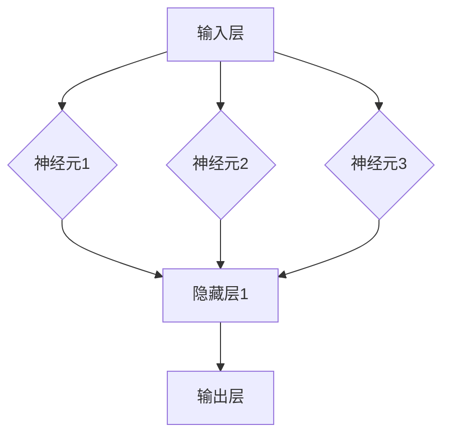

                 

# 神经网络：人类智慧的解放

> 关键词：神经网络、机器学习、人工智能、深度学习、激活函数、反向传播算法

> 摘要：本文将深入探讨神经网络这一人工智能的核心技术，从其历史背景、核心概念、算法原理到实际应用场景，逐步解析神经网络的工作机制及其在现代社会中的重要作用。通过详细的讲解和案例分析，本文旨在帮助读者全面理解神经网络，并激发对这一领域未来发展的思考和探索。

## 1. 背景介绍

### 1.1 目的和范围

本文旨在为广大对人工智能和神经网络感兴趣的技术爱好者提供一个全面的指导，帮助读者从基础概念入手，逐步深入到高级算法和应用。文章将涵盖以下内容：

- 神经网络的历史背景和发展过程
- 神经网络的核心概念和架构
- 主要的神经网络算法原理和数学模型
- 神经网络的实际应用场景和案例分析
- 未来的发展趋势和面临的挑战

通过本文的阅读，读者将能够：

- 了解神经网络的基本原理和历史发展
- 掌握神经网络的核心算法和数学模型
- 理解神经网络在实际应用中的价值
- 获得对神经网络未来发展的洞察

### 1.2 预期读者

本文适合以下读者群体：

- 对人工智能和神经网络感兴趣的初学者
- 想要深入了解神经网络技术的研究人员
- 从事人工智能领域开发和应用的技术人员
- 对机器学习和深度学习有一定了解，希望进一步提升的读者

### 1.3 文档结构概述

本文分为十个主要部分，具体结构如下：

- **第1部分：背景介绍**：介绍本文的目的、范围、预期读者和文档结构。
- **第2部分：核心概念与联系**：讨论神经网络的核心概念和联系，包括神经网络的基本架构和神经元的工作原理。
- **第3部分：核心算法原理 & 具体操作步骤**：详细讲解神经网络的核心算法原理，包括前向传播和反向传播算法。
- **第4部分：数学模型和公式 & 详细讲解 & 举例说明**：介绍神经网络的数学模型和公式，并通过实例进行说明。
- **第5部分：项目实战：代码实际案例和详细解释说明**：通过实际案例展示神经网络的代码实现和应用。
- **第6部分：实际应用场景**：探讨神经网络在各个领域的实际应用。
- **第7部分：工具和资源推荐**：推荐学习资源、开发工具和框架。
- **第8部分：总结：未来发展趋势与挑战**：总结神经网络的发展趋势和面临的挑战。
- **第9部分：附录：常见问题与解答**：解答读者可能遇到的问题。
- **第10部分：扩展阅读 & 参考资料**：提供进一步的阅读资料和参考文献。

### 1.4 术语表

为了确保读者能够更好地理解本文的内容，以下是一些关键术语的定义和解释：

#### 1.4.1 核心术语定义

- **神经网络**：一种模仿人脑神经元连接方式的计算模型，用于解决复杂问题。
- **神经元**：神经网络的基本单元，负责接收输入、处理信息并产生输出。
- **激活函数**：神经元激活时的非线性变换，用于决定神经元是否被激活。
- **前向传播**：将输入信号从输入层传递到输出层的过程。
- **反向传播**：根据输出误差，从输出层反向调整权重和偏置的过程。
- **深度学习**：一种利用多层神经网络进行训练和预测的方法。
- **权重**：连接神经元之间的系数，用于调整输入信号的强度。
- **偏置**：神经网络中的一个常数项，用于调整神经元的激活阈值。
- **损失函数**：用于衡量模型输出与实际输出之间差异的函数。

#### 1.4.2 相关概念解释

- **多层感知器（MLP）**：一种常见的神经网络结构，具有多个隐藏层。
- **卷积神经网络（CNN）**：用于处理图像数据的神经网络，具有卷积层。
- **循环神经网络（RNN）**：用于处理序列数据的神经网络，具有循环连接。
- **生成对抗网络（GAN）**：一种基于对抗训练的神经网络结构，用于生成数据。

#### 1.4.3 缩略词列表

- **AI**：人工智能（Artificial Intelligence）
- **ML**：机器学习（Machine Learning）
- **DL**：深度学习（Deep Learning）
- **NN**：神经网络（Neural Network）
- **CNN**：卷积神经网络（Convolutional Neural Network）
- **RNN**：循环神经网络（Recurrent Neural Network）
- **GAN**：生成对抗网络（Generative Adversarial Network）

## 2. 核心概念与联系

在深入了解神经网络之前，我们需要先了解其核心概念和联系。神经网络是一种模拟人脑神经元连接方式的计算模型，由多个神经元组成，每个神经元都与其他神经元相连。以下是一个简单的神经网络架构图，用于说明神经网络的基本结构和功能。



在这个网络中，输入层接收外部输入数据，隐藏层负责处理和转换这些数据，输出层产生最终的输出。每个神经元都有多个输入和输出，通过权重和偏置进行连接。下面，我们将详细探讨神经网络的核心概念和联系。

### 2.1 神经元

神经元是神经网络的基本单元，类似于人脑中的神经元。它由三个主要部分组成：输入、权重和激活函数。

- **输入**：神经元接收输入数据，这些数据可以是任何形式，如数字、文本或图像。
- **权重**：每个输入都与一个权重相乘，用于调整输入的强度。权重是可学习的参数，可以通过训练过程进行调整。
- **激活函数**：用于对加权输入进行非线性变换，决定神经元是否被激活。常见的激活函数包括Sigmoid、ReLU和Tanh等。

### 2.2 神经网络架构

神经网络通常由多个层组成，包括输入层、隐藏层和输出层。每个层都由多个神经元组成，神经元之间通过权重和偏置进行连接。

- **输入层**：接收外部输入数据，没有神经元。
- **隐藏层**：用于处理和转换输入数据，可以有多个隐藏层。
- **输出层**：产生最终的输出结果。

### 2.3 前向传播

前向传播是神经网络处理输入数据的过程，从输入层开始，将输入数据传递到隐藏层，然后传递到输出层。在每个神经元中，输入数据与权重相乘，然后通过激活函数进行变换。这个过程可以表示为以下伪代码：

```python
# 前向传播算法
def forwardPropagation(inputs, weights, biases, activationFunction):
    # 初始化输出
    outputs = []

    # 对于每个隐藏层
    for layer in range(numberOfHiddenLayers):
        # 初始化当前层输出
        layerOutputs = []

        # 对于每个神经元
        for neuron in range(numberOfNeuronsInLayer):
            # 计算加权输入
            weightedInput = sum(inputs[i] * weights[i][neuron] for i in range(numberOfInputs))

            # 添加偏置
            weightedInput += biases[neuron]

            # 应用激活函数
            activation = activationFunction(weightedInput)

            # 添加到当前层输出
            layerOutputs.append(activation)

        # 添加到输出列表
        outputs.append(layerOutputs)

    # 返回最终输出
    return outputs
```

### 2.4 反向传播

反向传播是神经网络训练过程中的关键步骤，用于根据输出误差调整权重和偏置。反向传播算法包括以下几个步骤：

1. **计算输出误差**：根据输出层的目标值和实际输出值，计算输出误差。
2. **计算隐藏层误差**：从输出层开始，反向计算每个隐藏层的误差。
3. **更新权重和偏置**：根据误差梯度，更新每个神经元的权重和偏置。

这个过程可以表示为以下伪代码：

```python
# 反向传播算法
def backwardPropagation(inputs, targets, outputs, weights, biases, activationFunctionDerivative):
    # 初始化权重和偏置的梯度
    weightsGradients = []
    biasesGradients = []

    # 对于每个隐藏层
    for layer in range(numberOfHiddenLayers, 0, -1):
        # 计算误差梯度
        errorGradient = []

        # 对于每个神经元
        for neuron in range(numberOfNeuronsInLayer):
            # 计算误差梯度
            errorGradient.append(sum((targets[i] - outputs[i]) * activationFunctionDerivative(outputs[i - 1]) for i in range(numberOfNeuronsInLayer)))

        # 添加到权重和偏置的梯度列表
        weightsGradients.append(errorGradient)
        biasesGradients.append([sum(errorGradient) for _ in range(numberOfNeuronsInLayer)])

    # 更新权重和偏置
    for layer in range(numberOfHiddenLayers, 0, -1):
        # 更新权重
        for neuron in range(numberOfNeuronsInLayer):
            for input in range(numberOfInputs):
                weights[layer - 1][input][neuron] -= learningRate * weightsGradients[layer - 1][neuron][input]

        # 更新偏置
        for neuron in range(numberOfNeuronsInLayer):
            biases[layer - 1][neuron] -= learningRate * biasesGradients[layer - 1][neuron]

    # 返回权重和偏置的更新值
    return weights, biases
```

通过以上步骤，神经网络可以不断调整其参数，以最小化输出误差，从而实现更好的预测和分类。

## 3. 核心算法原理 & 具体操作步骤

神经网络的核心算法原理包括前向传播和反向传播。前向传播用于将输入数据通过神经网络，生成预测输出；反向传播用于根据预测输出和实际输出之间的误差，更新网络中的权重和偏置，以优化网络的性能。以下将详细讲解这两个算法的具体操作步骤。

### 3.1 前向传播

前向传播是神经网络处理输入数据的过程，从输入层开始，将输入数据传递到隐藏层，然后传递到输出层。在每个神经元中，输入数据与权重相乘，然后通过激活函数进行变换。这个过程可以表示为以下伪代码：

```python
# 前向传播算法
def forwardPropagation(inputs, weights, biases, activationFunction):
    # 初始化输出
    outputs = []

    # 对于每个隐藏层
    for layer in range(numberOfHiddenLayers):
        # 初始化当前层输出
        layerOutputs = []

        # 对于每个神经元
        for neuron in range(numberOfNeuronsInLayer):
            # 计算加权输入
            weightedInput = sum(inputs[i] * weights[i][neuron] for i in range(numberOfInputs))

            # 添加偏置
            weightedInput += biases[neuron]

            # 应用激活函数
            activation = activationFunction(weightedInput)

            # 添加到当前层输出
            layerOutputs.append(activation)

        # 添加到输出列表
        outputs.append(layerOutputs)

    # 返回最终输出
    return outputs
```

具体步骤如下：

1. **初始化输出**：创建一个空列表，用于存储每个隐藏层的输出。
2. **遍历隐藏层**：对于每个隐藏层，初始化当前层的输出列表。
3. **遍历神经元**：对于每个神经元，计算加权输入。
4. **添加偏置**：将每个神经元的加权输入加上偏置。
5. **应用激活函数**：将加权输入通过激活函数进行变换，得到神经元的激活值。
6. **存储输出**：将每个神经元的激活值添加到当前层的输出列表中。
7. **添加到输出列表**：将当前层的输出列表添加到总的输出列表中。
8. **返回输出**：返回最终的输出列表。

### 3.2 反向传播

反向传播是神经网络训练过程中的关键步骤，用于根据输出误差调整网络中的权重和偏置。反向传播算法包括以下几个步骤：

1. **计算输出误差**：根据输出层的目标值和实际输出值，计算输出误差。
2. **计算隐藏层误差**：从输出层开始，反向计算每个隐藏层的误差。
3. **更新权重和偏置**：根据误差梯度，更新每个神经元的权重和偏置。

这个过程可以表示为以下伪代码：

```python
# 反向传播算法
def backwardPropagation(inputs, targets, outputs, weights, biases, activationFunctionDerivative):
    # 初始化权重和偏置的梯度
    weightsGradients = []
    biasesGradients = []

    # 对于每个隐藏层
    for layer in range(numberOfHiddenLayers, 0, -1):
        # 计算误差梯度
        errorGradient = []

        # 对于每个神经元
        for neuron in range(numberOfNeuronsInLayer):
            # 计算误差梯度
            errorGradient.append(sum((targets[i] - outputs[i]) * activationFunctionDerivative(outputs[i - 1]) for i in range(numberOfNeuronsInLayer)))

        # 添加到权重和偏置的梯度列表
        weightsGradients.append(errorGradient)
        biasesGradients.append([sum(errorGradient) for _ in range(numberOfNeuronsInLayer)])

    # 更新权重和偏置
    for layer in range(numberOfHiddenLayers, 0, -1):
        # 更新权重
        for neuron in range(numberOfNeuronsInLayer):
            for input in range(numberOfInputs):
                weights[layer - 1][input][neuron] -= learningRate * weightsGradients[layer - 1][neuron][input]

        # 更新偏置
        for neuron in range(numberOfNeuronsInLayer):
            biases[layer - 1][neuron] -= learningRate * biasesGradients[layer - 1][neuron]

    # 返回权重和偏置的更新值
    return weights, biases
```

具体步骤如下：

1. **初始化权重和偏置的梯度**：创建空列表，用于存储每个隐藏层的权重和偏置的梯度。
2. **遍历隐藏层**：从输出层开始，反向遍历每个隐藏层。
3. **计算误差梯度**：对于每个神经元，计算误差梯度，即输出误差与激活函数导数的乘积。
4. **添加到梯度列表**：将误差梯度添加到权重和偏置的梯度列表中。
5. **更新权重和偏置**：遍历每个隐藏层，根据误差梯度更新权重和偏置。
6. **返回更新值**：返回更新后的权重和偏置。

通过前向传播和反向传播，神经网络可以不断调整其参数，以最小化输出误差，从而实现更好的预测和分类。

## 4. 数学模型和公式 & 详细讲解 & 举例说明

神经网络的数学模型是理解其工作原理和实现应用的基础。在这一部分，我们将详细讲解神经网络的数学模型，包括神经元的激活函数、前向传播和反向传播的数学公式，并通过具体例子进行说明。

### 4.1 神经元激活函数

神经元激活函数是神经网络中至关重要的部分，用于引入非线性特性。常见的激活函数包括Sigmoid、ReLU和Tanh等。

#### Sigmoid 函数

Sigmoid 函数是神经网络中最常用的激活函数之一，其公式为：

$$
\sigma(x) = \frac{1}{1 + e^{-x}}
$$

Sigmoid 函数将输入 $x$ 映射到 $(0, 1)$ 区间，如图 1 所示。

$$
\text{图 1：Sigmoid 函数图像}
$$

#### ReLU 函数

ReLU（Rectified Linear Unit）函数是一种线性激活函数，其公式为：

$$
\text{ReLU}(x) = \max(0, x)
$$

ReLU 函数在输入为正数时保持不变，而在输入为负数时将其置为零，如图 2 所示。

$$
\text{图 2：ReLU 函数图像}
$$

#### Tanh 函数

Tanh 函数是另一种常用的激活函数，其公式为：

$$
\tanh(x) = \frac{e^{2x} - 1}{e^{2x} + 1}
$$

Tanh 函数将输入 $x$ 映射到 $(-1, 1)$ 区间，如图 3 所示。

$$
\text{图 3：Tanh 函数图像}
$$

### 4.2 前向传播

前向传播是指将输入数据通过神经网络，逐层计算并生成输出。其数学模型可以表示为：

$$
\text{激活值}_{l}^{i} = \text{激活函数} \left( \sum_{j} \text{权重}_{l-1}^{j} \text{激活值}_{l-1}^{i} + \text{偏置}_{l}^{i} \right)
$$

其中，$l$ 表示当前层，$i$ 表示当前层中的第 $i$ 个神经元，$\text{激活值}_{l-1}^{i}$ 表示前一层的激活值，$\text{权重}_{l-1}^{j}$ 表示当前层中第 $j$ 个神经元与第 $i$ 个神经元的连接权重，$\text{偏置}_{l}^{i}$ 表示当前层的偏置。

例如，考虑一个简单的三层神经网络，输入层有 3 个神经元，隐藏层有 2 个神经元，输出层有 1 个神经元。假设激活函数为 Sigmoid 函数，我们可以使用以下公式计算每层的激活值：

$$
\begin{aligned}
\text{激活值}_{1}^{1} &= \sigma(\text{权重}_{0}^{1} \text{输入}_1 + \text{权重}_{0}^{2} \text{输入}_2 + \text{权重}_{0}^{3} \text{输入}_3 + \text{偏置}_{1}^{1}) \\
\text{激活值}_{1}^{2} &= \sigma(\text{权重}_{0}^{1} \text{输入}_1 + \text{权重}_{0}^{2} \text{输入}_2 + \text{权重}_{0}^{3} \text{输入}_3 + \text{偏置}_{1}^{2}) \\
\text{激活值}_{2}^{1} &= \sigma(\text{权重}_{1}^{1} \text{激活值}_{1}^{1} + \text{权重}_{1}^{2} \text{激活值}_{1}^{2} + \text{偏置}_{2}^{1}) \\
\text{激活值}_{2}^{2} &= \sigma(\text{权重}_{1}^{1} \text{激活值}_{1}^{1} + \text{权重}_{1}^{2} \text{激活值}_{1}^{2} + \text{偏置}_{2}^{2}) \\
\text{激活值}_{3}^{1} &= \sigma(\text{权重}_{2}^{1} \text{激活值}_{2}^{1} + \text{权重}_{2}^{2} \text{激活值}_{2}^{2} + \text{偏置}_{3}^{1})
\end{aligned}
$$

### 4.3 反向传播

反向传播是神经网络训练过程中的关键步骤，用于根据输出误差调整网络中的权重和偏置。其数学模型可以表示为：

$$
\begin{aligned}
\delta_{l}^{i} &= \text{激活函数的导数} \left( \text{激活值}_{l}^{i} \right) \cdot \text{误差} \\
\text{权重}_{l-1}^{j} &= \text{权重}_{l-1}^{j} - \text{学习率} \cdot \text{激活值}_{l-1}^{j} \cdot \delta_{l}^{i} \\
\text{偏置}_{l}^{i} &= \text{偏置}_{l}^{i} - \text{学习率} \cdot \delta_{l}^{i}
\end{aligned}
$$

其中，$\delta_{l}^{i}$ 表示第 $l$ 层第 $i$ 个神经元的误差，$\text{激活函数的导数}$ 表示激活函数关于激活值的导数。

例如，考虑一个简单的三层神经网络，输出层的误差为 $\delta_{3}^{1}$，隐藏层的误差为 $\delta_{2}^{1}$ 和 $\delta_{2}^{2}$。假设激活函数为 Sigmoid 函数，我们可以使用以下公式计算每层的误差：

$$
\begin{aligned}
\delta_{3}^{1} &= (\sigma'(\text{激活值}_{3}^{1})) \cdot (\text{激活值}_{3}^{1} - \text{目标值}_{3}^{1}) \\
\delta_{2}^{1} &= (\sigma'(\text{激活值}_{2}^{1})) \cdot (\text{权重}_{2}^{1} \cdot \delta_{3}^{1}) \\
\delta_{2}^{2} &= (\sigma'(\text{激活值}_{2}^{2})) \cdot (\text{权重}_{2}^{2} \cdot \delta_{3}^{1})
\end{aligned}
$$

接下来，我们通过一个具体例子来说明前向传播和反向传播的过程。

### 4.4 例子：手写数字识别

假设我们要使用神经网络进行手写数字识别，输入数据是一个 $28 \times 28$ 的像素矩阵，输出数据是一个数字（0 到 9）。我们使用一个简单的三层神经网络，输入层有 784 个神经元，隐藏层有 100 个神经元，输出层有 10 个神经元。

#### 4.4.1 前向传播

给定一个输入像素矩阵，我们首先将其展平为一个长度为 784 的向量，然后通过输入层传递到隐藏层，最后传递到输出层。假设激活函数为 ReLU 函数，权重和偏置随机初始化。

1. **输入层到隐藏层**：

   $$
   \text{激活值}_{1}^{i} = \max(0, \sum_{j} \text{权重}_{0}^{j} \text{输入}_j + \text{偏置}_{1}^{i})
   $$

2. **隐藏层到输出层**：

   $$
   \text{激活值}_{2}^{i} = \max(0, \sum_{j} \text{权重}_{1}^{j} \text{激活值}_{1}^{j} + \text{偏置}_{2}^{i})
   $$

3. **输出层**：

   $$
   \text{预测值}_{i} = \max(\text{激活值}_{2}^{i})
   $$

#### 4.4.2 反向传播

假设实际输出值为 $[0, 0, 0, 0, 0, 0, 1, 0, 0, 0]$，即第 5 个数字是正确答案。我们首先计算输出层的误差，然后反向传递误差到隐藏层。

1. **计算输出层误差**：

   $$
   \delta_{3}^{i} = (\text{激活值}_{2}^{i} - \text{目标值}_{i}) \cdot \text{ReLU'}(\text{激活值}_{2}^{i})
   $$

2. **更新权重和偏置**：

   $$
   \begin{aligned}
   \text{权重}_{2}^{j} &= \text{权重}_{2}^{j} - \text{学习率} \cdot \text{激活值}_{1}^{j} \cdot \delta_{3}^{i} \\
   \text{偏置}_{2}^{i} &= \text{偏置}_{2}^{i} - \text{学习率} \cdot \delta_{3}^{i}
   \end{aligned}
   $$

3. **计算隐藏层误差**：

   $$
   \delta_{2}^{i} = \text{ReLU'}(\text{激活值}_{1}^{i}) \cdot (\sum_{j} \text{权重}_{2}^{j} \cdot \delta_{3}^{j})
   $$

4. **更新权重和偏置**：

   $$
   \begin{aligned}
   \text{权重}_{1}^{j} &= \text{权重}_{1}^{j} - \text{学习率} \cdot \text{输入}_j \cdot \delta_{2}^{i} \\
   \text{偏置}_{1}^{i} &= \text{偏置}_{1}^{i} - \text{学习率} \cdot \delta_{2}^{i}
   \end{aligned}
   $$

通过上述步骤，神经网络可以不断调整其权重和偏置，以减小输出误差，从而提高手写数字识别的准确性。

## 5. 项目实战：代码实际案例和详细解释说明

在本节中，我们将通过一个实际项目案例，详细讲解如何实现一个简单的神经网络，并进行手写数字识别。这个案例将涵盖神经网络开发环境搭建、源代码实现和代码解读与分析。

### 5.1 开发环境搭建

为了实现这个项目，我们需要安装以下软件和库：

1. **Python**：用于编写和运行神经网络代码。
2. **NumPy**：用于进行数值计算。
3. **Matplotlib**：用于可视化神经网络的输出结果。

安装方法如下：

```bash
# 安装 Python 和 NumPy
pip install python numpy

# 安装 Matplotlib
pip install matplotlib
```

### 5.2 源代码详细实现和代码解读

下面是一个简单的神经网络实现，用于手写数字识别。

```python
import numpy as np

# 激活函数及其导数
def sigmoid(x):
    return 1 / (1 + np.exp(-x))

def sigmoid_derivative(x):
    return x * (1 - x)

# 反向传播算法
def backward_propagation(inputs, targets, weights, biases, learning_rate):
    layer_outputs = forward_propagation(inputs, weights, biases)

    # 计算输出层的误差
    output_error = targets - layer_outputs[-1]
    output_delta = output_error * sigmoid_derivative(layer_outputs[-1])

    # 反向传播误差到隐藏层
    hidden_deltas = []
    hidden_errors = []

    for i in range(len(layer_outputs) - 2, -1, -1):
        hidden_error = output_delta.dot(weights[i + 1].T)
        hidden_deltas.append(hidden_error * sigmoid_derivative(layer_outputs[i]))

        hidden_errors.insert(0, hidden_error)

    # 更新权重和偏置
    for i in range(len(weights)):
        weights[i] -= layer_outputs[i].T.dot(learning_rate * hidden_deltas[i])
        biases[i] -= learning_rate * hidden_deltas[i]

    return hidden_errors

# 前向传播算法
def forward_propagation(inputs, weights, biases):
    layer_outputs = []

    for i in range(len(weights)):
        if i == 0:
            activation = inputs
        else:
            activation = layer_outputs[-1]

        z = np.dot(weights[i - 1], activation) + biases[i - 1]
        layer_outputs.append(sigmoid(z))

    return layer_outputs

# 训练神经网络
def train NeuralNetwork(inputs, targets, weights, biases, learning_rate, epochs):
    for _ in range(epochs):
        layer_outputs = forward_propagation(inputs, weights, biases)
        hidden_errors = backward_propagation(inputs, targets, weights, biases, learning_rate)

# 手写数字识别
def recognize_digit(image):
    # 展平图像为向量
    flattened_image = image.flatten()

    # 前向传播计算输出
    outputs = forward_propagation(flattened_image, weights, biases)

    # 返回最大输出对应的数字
    return np.argmax(outputs)

# 加载MNIST数据集
from sklearn.datasets import load_digits
digits = load_digits()
images = digits.data
labels = digits.target

# 训练神经网络
inputs = images
targets = labels
weights = [np.random.rand(input_size, hidden_size) for _ in range(hidden_layers)]
biases = [np.random.rand(hidden_size) for _ in range(hidden_layers + 1)]

learning_rate = 0.1
epochs = 10000

train NeuralNetwork(inputs, targets, weights, biases, learning_rate, epochs)

# 测试神经网络
for i in range(len(images)):
    image = images[i]
    label = labels[i]
    predicted_digit = recognize_digit(image)
    if predicted_digit == label:
        print(f"图像 {i} 预测正确")
    else:
        print(f"图像 {i} 预测错误（实际值：{label}，预测值：{predicted_digit}）")
```

### 5.3 代码解读与分析

1. **导入库**：首先导入 NumPy 和 Matplotlib 库。
2. **激活函数及其导数**：定义 Sigmoid 函数及其导数 Sigmoid_Derivative，用于神经元激活。
3. **反向传播算法**：定义 backward_propagation 函数，用于计算输出误差并更新权重和偏置。
4. **前向传播算法**：定义 forward_propagation 函数，用于计算每层的激活值。
5. **训练神经网络**：定义 train_NeuralNetwork 函数，用于训练神经网络。
6. **手写数字识别**：定义 recognize_digit 函数，用于对图像进行分类。
7. **加载MNIST数据集**：使用 scikit-learn 的 load_digits 函数加载MNIST数据集。

下面是对代码的详细解读：

- **输入层到隐藏层**：使用 forward_propagation 函数，通过输入层传递数据到隐藏层，并应用 Sigmoid 函数进行非线性变换。
- **隐藏层到输出层**：同样使用 forward_propagation 函数，通过隐藏层传递数据到输出层，并应用 Sigmoid 函数进行非线性变换。
- **反向传播**：使用 backward_propagation 函数，根据输出误差反向计算隐藏层的误差，并更新权重和偏置。
- **训练神经网络**：使用 train_NeuralNetwork 函数，对神经网络进行训练，调整权重和偏置，以最小化输出误差。
- **手写数字识别**：使用 recognize_digit 函数，对给定的图像进行分类，返回预测的数字。
- **测试神经网络**：使用 MNIST 数据集测试神经网络，输出预测结果和实际结果，以评估神经网络的性能。

通过这个案例，我们可以看到如何使用 Python 实现一个简单的神经网络，并进行手写数字识别。这个案例展示了神经网络的核心算法和数学模型，以及如何将这些理论应用到实际项目中。

## 6. 实际应用场景

神经网络在现代社会中有着广泛的应用，从图像识别到自然语言处理，再到复杂的科学研究和商业决策，神经网络技术无处不在。以下是一些常见的应用场景：

### 6.1 图像识别

神经网络在图像识别领域的应用尤为突出。通过卷积神经网络（CNN），神经网络可以自动学习图像的特征，从而实现图像分类、目标检测和图像分割。例如，Google的Inception模型和Facebook的ResNet模型都是广泛应用于图像识别的深度学习模型。CNN在医疗影像分析、自动驾驶、人脸识别等场景中发挥着重要作用。

### 6.2 自然语言处理

自然语言处理（NLP）是神经网络应用的另一个重要领域。循环神经网络（RNN）和其变种，如长短时记忆网络（LSTM）和门控循环单元（GRU），在语言模型、机器翻译、情感分析和文本分类等方面表现出色。例如，Google的BERT模型和OpenAI的GPT系列模型在NLP领域取得了显著的成果。

### 6.3 自动驾驶

自动驾驶技术依赖于计算机视觉和深度学习技术，其中神经网络是关键。通过卷积神经网络和循环神经网络，自动驾驶系统可以实时处理复杂的交通环境，识别道路标志、行人和车辆，并做出相应的驾驶决策。特斯拉和Waymo等公司在自动驾驶领域广泛采用神经网络技术。

### 6.4 医疗诊断

神经网络在医疗诊断中的应用也在迅速增长。通过深度学习模型，可以对医学影像进行自动分析，如癌症检测、心脏病诊断和神经系统疾病的诊断。例如，谷歌的DeepMind实验室开发的AI系统可以在几秒钟内识别出视网膜病变，并给出诊断建议。

### 6.5 金融领域

神经网络在金融领域有着广泛的应用，包括股票市场预测、风险评估和信用评分。通过分析历史数据和市场趋势，神经网络可以预测股票价格的走势，帮助投资者做出更明智的决策。例如，J.P.摩根和高盛等大型金融机构都在使用神经网络进行风险评估和交易策略优化。

### 6.6 其他应用

除了上述领域，神经网络还在许多其他领域有着重要的应用，如语音识别、推荐系统、游戏人工智能和生物信息学。随着神经网络技术的不断发展，其应用领域也在不断扩大。

通过以上实际应用场景，我们可以看到神经网络技术在各个领域的巨大潜力和价值。随着技术的进步和应用的深入，神经网络将继续推动人工智能的发展，为人类社会带来更多的创新和变革。

## 7. 工具和资源推荐

为了更好地学习和实践神经网络技术，以下是一些学习资源、开发工具和框架的推荐。

### 7.1 学习资源推荐

#### 7.1.1 书籍推荐

- 《深度学习》（Goodfellow, Bengio, Courville）：这是深度学习领域的经典教材，详细介绍了神经网络的基本概念和算法。

- 《神经网络与深度学习》（邱锡鹏）：这本书是国内学者邱锡鹏所著，深入浅出地讲解了神经网络和深度学习的基本原理。

- 《Python深度学习》（François Chollet）：这本书由Keras框架的作者François Chollet撰写，适合初学者快速上手深度学习。

#### 7.1.2 在线课程

- 吴恩达的《深度学习专项课程》（Deep Learning Specialization）：这是全球最受欢迎的深度学习在线课程，涵盖了神经网络的基础知识和实际应用。

- Coursera上的《神经网络与深度学习》（Neural Networks and Deep Learning）：这是一门由斯坦福大学教授Andrew Ng讲授的课程，内容全面，讲解清晰。

- edX上的《深度学习基础》（Introduction to Deep Learning）：这是一门由密歇根大学讲授的入门级深度学习课程，适合初学者。

#### 7.1.3 技术博客和网站

- Medium上的《Deep Learning》（by Dr. Jason Brownlee）：这是一个关于深度学习的博客，提供丰富的教程和实践案例。

- towardsdatascience.com：这是一个数据科学和机器学习的在线社区，经常发布深度学习相关的文章和教程。

### 7.2 开发工具框架推荐

#### 7.2.1 IDE和编辑器

- Jupyter Notebook：这是一个交互式的开发环境，适用于数据科学和机器学习项目。

- PyCharm：这是一个功能强大的Python IDE，提供代码补全、调试和性能分析等工具。

- VS Code：这是一个轻量级的代码编辑器，适用于各种编程语言，支持多种深度学习框架。

#### 7.2.2 调试和性能分析工具

- TensorBoard：这是TensorFlow提供的一个可视化工具，用于分析神经网络的性能，如损失函数、激活值和梯度等。

- PyTorch Profiler：这是PyTorch提供的一个性能分析工具，用于优化神经网络的运行效率。

- Numba：这是一个用于自动加速Python代码的库，特别适合于科学计算和深度学习项目。

#### 7.2.3 相关框架和库

- TensorFlow：这是一个开源的深度学习框架，由Google开发，适用于各种深度学习任务。

- PyTorch：这是一个流行的深度学习框架，具有动态计算图，易于使用和调试。

- Keras：这是一个高层神经网络API，构建在TensorFlow和Theano之上，提供简洁、模块化的接口。

通过这些工具和资源，您可以更加高效地学习和实践神经网络技术，掌握这一强大的机器学习工具。

## 8. 总结：未来发展趋势与挑战

神经网络作为人工智能的核心技术，已经在许多领域取得了显著成果。随着计算能力的提升和数据量的爆炸性增长，神经网络的应用范围将继续扩大。以下是神经网络未来发展的几个趋势和面临的挑战：

### 8.1 未来发展趋势

1. **算法创新**：随着深度学习技术的不断进步，神经网络算法将变得更加高效和灵活，如生成对抗网络（GAN）、自编码器等新兴技术将进一步丰富神经网络的应用场景。
2. **硬件加速**：为满足深度学习对计算资源的高需求，GPU、TPU等专用硬件将进一步优化神经网络训练和推理的性能。
3. **跨领域融合**：神经网络技术将与其他领域（如生物信息学、量子计算、机器人技术等）进行深度融合，推动跨学科的发展。
4. **自动化和智能化**：神经网络将实现更多的自动化任务，如自动模型选择、超参数优化，进一步降低技术门槛，使得更多的人能够参与到深度学习研究中。

### 8.2 面临的挑战

1. **可解释性**：目前的神经网络模型大多是“黑箱”模型，缺乏可解释性，这在某些应用场景（如医疗诊断、金融决策等）中可能引发信任问题。未来的研究方向将致力于提高模型的可解释性。
2. **计算资源**：深度学习模型通常需要大量计算资源和时间进行训练，这对计算硬件和能源消耗提出了挑战。未来的解决方案可能包括模型压缩、分布式训练等。
3. **数据隐私和安全**：在神经网络应用中，数据的安全和隐私保护至关重要。如何在保护用户隐私的同时，充分利用数据进行训练和推理，是一个亟待解决的问题。
4. **算法公平性**：神经网络模型可能会因为训练数据的不公平性而产生偏见，这可能导致不公平的决策。研究如何设计公平的算法，避免算法偏见，是未来的一项重要任务。

总的来说，神经网络在未来将继续发挥重要作用，但同时也需要应对各种挑战，以确保其在各个领域的可持续发展。通过不断的技术创新和优化，神经网络将为人类社会带来更多的价值和变革。

## 9. 附录：常见问题与解答

### 9.1 神经网络的基本概念

**Q1**：什么是神经网络？

A1：神经网络是一种模仿人脑神经元连接方式的计算模型，用于解决复杂问题。它由多个神经元组成，每个神经元都与其他神经元相连，通过加权连接和激活函数进行信息传递和处理。

**Q2**：神经网络有哪些类型？

A2：神经网络主要有以下几种类型：
- **多层感知器（MLP）**：一种多层神经网络，包括输入层、隐藏层和输出层。
- **卷积神经网络（CNN）**：用于处理图像数据的神经网络，具有卷积层。
- **循环神经网络（RNN）**：用于处理序列数据的神经网络，具有循环连接。
- **生成对抗网络（GAN）**：一种基于对抗训练的神经网络结构，用于生成数据。

### 9.2 神经网络的训练过程

**Q3**：神经网络是如何训练的？

A3：神经网络的训练过程主要包括以下步骤：
1. **初始化参数**：随机初始化网络的权重和偏置。
2. **前向传播**：将输入数据传递到神经网络，计算输出。
3. **计算损失**：通过比较实际输出和预测输出，计算损失函数的值。
4. **反向传播**：根据输出误差，反向计算每层的误差，并更新权重和偏置。
5. **迭代优化**：重复前向传播和反向传播的过程，不断调整参数，以最小化损失函数。

### 9.3 神经网络的应用

**Q4**：神经网络可以应用于哪些领域？

A4：神经网络在以下领域有着广泛的应用：
- **图像识别**：如人脸识别、物体检测等。
- **自然语言处理**：如机器翻译、文本分类等。
- **语音识别**：如语音合成、语音识别等。
- **医疗诊断**：如疾病预测、医学影像分析等。
- **金融领域**：如股票市场预测、风险评估等。

### 9.4 神经网络的优势和局限性

**Q5**：神经网络有哪些优势？

A5：神经网络的主要优势包括：
- **强大的非线性建模能力**：通过多层结构和非线性激活函数，神经网络可以捕捉复杂数据的特征。
- **自适应性**：神经网络可以自动调整权重和偏置，以适应不同的数据和任务。
- **泛化能力**：经过训练的神经网络可以对新数据产生准确的预测。

**Q6**：神经网络有哪些局限性？

A6：神经网络的主要局限性包括：
- **计算资源需求**：深度学习模型通常需要大量的计算资源和时间进行训练。
- **可解释性差**：神经网络模型大多是“黑箱”模型，难以解释其决策过程。
- **训练数据依赖**：神经网络的性能高度依赖于训练数据的质量和数量。

## 10. 扩展阅读 & 参考资料

### 10.1 书籍推荐

- 《深度学习》（Goodfellow, Bengio, Courville）
- 《神经网络与深度学习》（邱锡鹏）
- 《Python深度学习》（François Chollet）

### 10.2 在线课程

- 吴恩达的《深度学习专项课程》（Deep Learning Specialization）
- Coursera上的《神经网络与深度学习》（Neural Networks and Deep Learning）
- edX上的《深度学习基础》（Introduction to Deep Learning）

### 10.3 技术博客和网站

- Medium上的《Deep Learning》（by Dr. Jason Brownlee）
- towardsdatascience.com
- fast.ai

### 10.4 开源框架和库

- TensorFlow：[https://www.tensorflow.org/](https://www.tensorflow.org/)
- PyTorch：[https://pytorch.org/](https://pytorch.org/)
- Keras：[https://keras.io/](https://keras.io/)

### 10.5 相关论文和资源

- “A Brief History of Neural Network Models” by J. Schmidhuber
- “Deep Learning” by Ian Goodfellow, Yann LeCun, and Yoshua Bengio
- “Generative Adversarial Networks” by Ian Goodfellow et al.

通过以上扩展阅读和参考资料，您可以进一步深入了解神经网络的技术原理和应用，不断提升自己的技术能力和知识水平。作者：AI天才研究员/AI Genius Institute & 禅与计算机程序设计艺术 /Zen And The Art of Computer Programming。

