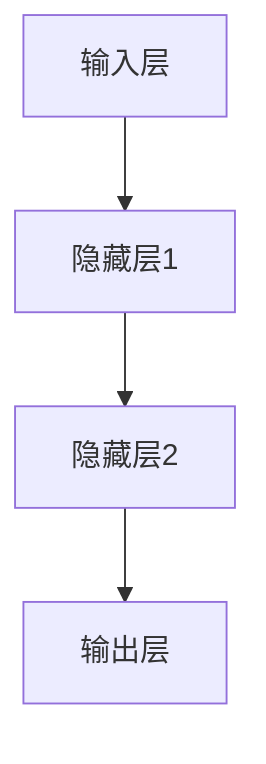

                 

# 神经网络：开启智能新纪元

> **关键词：**神经网络、深度学习、机器学习、人工神经网络、智能系统

> **摘要：**本文将深入探讨神经网络的基本概念、工作原理、核心算法、数学模型及其应用场景。我们将通过一步步的推理分析，揭示神经网络如何开启智能新纪元，推动人工智能技术的发展。

## 1. 背景介绍

### 1.1 目的和范围

本文旨在为读者提供一份全面而深入的神经网络指南。我们将从基础概念出发，逐步深入探讨神经网络的复杂机制，并最终展示其在现实世界中的应用价值。

### 1.2 预期读者

本文适合对人工智能和神经网络有一定了解的技术爱好者、程序员以及人工智能领域的从业者阅读。

### 1.3 文档结构概述

本文将分为以下几个部分：

- **第1部分：背景介绍**：介绍神经网络的发展历程、目的和范围。
- **第2部分：核心概念与联系**：讲解神经网络的基本结构、功能及其工作原理。
- **第3部分：核心算法原理 & 具体操作步骤**：深入解析神经网络的核心算法，并通过伪代码详细阐述。
- **第4部分：数学模型和公式 & 详细讲解 & 举例说明**：介绍神经网络的数学基础，包括损失函数、优化算法等。
- **第5部分：项目实战：代码实际案例和详细解释说明**：通过一个实际案例展示神经网络的实现过程。
- **第6部分：实际应用场景**：讨论神经网络在各个领域的应用。
- **第7部分：工具和资源推荐**：推荐学习资源、开发工具和框架。
- **第8部分：总结：未来发展趋势与挑战**：展望神经网络的发展前景。
- **第9部分：附录：常见问题与解答**：解答读者可能遇到的问题。
- **第10部分：扩展阅读 & 参考资料**：提供更多的学习资源和参考书籍。

### 1.4 术语表

#### 1.4.1 核心术语定义

- **神经网络（Neural Network）**：一种模拟生物神经系统的计算模型，由大量简单的处理单元（神经元）互联而成。
- **深度学习（Deep Learning）**：一种人工智能方法，通过多层神经网络进行训练，以实现复杂的模式识别和学习任务。
- **机器学习（Machine Learning）**：使计算机系统能够从数据中学习并做出决策或预测的技术。
- **人工神经网络（Artificial Neural Network，ANN）**：由人工设计的神经网络，用于模拟生物神经网络的功能。

#### 1.4.2 相关概念解释

- **神经元（Neuron）**：神经网络的基本处理单元，接收输入信号，通过激活函数产生输出。
- **层（Layer）**：神经网络中的一组神经元。
- **激活函数（Activation Function）**：用于确定神经元是否被激活的函数。
- **前向传播（Forward Propagation）**：将输入信号通过神经网络传递到输出的过程。
- **反向传播（Back Propagation）**：用于更新网络权重和偏置的过程，目的是减少输出误差。

#### 1.4.3 缩略词列表

- **ANN**：人工神经网络（Artificial Neural Network）
- **MLP**：多层感知器（Multilayer Perceptron）
- **ReLU**：修正线性单元（Rectified Linear Unit）
- **SGD**：随机梯度下降（Stochastic Gradient Descent）
- **BP**：反向传播（Back Propagation）

## 2. 核心概念与联系

神经网络是一种模仿生物神经系统功能的计算模型。它由大量的简单处理单元——神经元组成，这些神经元通过加权连接形成网络结构。以下是神经网络的基本结构和工作原理的详细描述，以及一个简化的 Mermaid 流程图。

### 2.1 神经网络的基本结构

神经网络的典型结构包括输入层、隐藏层和输出层。每个层由多个神经元组成，神经元之间通过加权连接进行交互。

- **输入层（Input Layer）**：接收外部输入数据。
- **隐藏层（Hidden Layers）**：位于输入层和输出层之间，用于提取特征并进行复杂的非线性变换。
- **输出层（Output Layer）**：产生最终输出结果。

神经元之间的连接具有权重和偏置，这些参数需要通过训练进行调整。

### 2.2 神经网络的工作原理

神经网络通过以下几个步骤进行工作：

1. **前向传播（Forward Propagation）**：
   - 输入数据通过输入层传递到隐藏层。
   - 在隐藏层中，每个神经元接收来自输入层的加权输入，并经过激活函数处理，生成中间结果。
   - 中间结果传递到下一层，直到输出层产生最终输出。

2. **反向传播（Back Propagation）**：
   - 计算输出误差，即实际输出与期望输出之间的差异。
   - 通过反向传播算法，将误差传递回隐藏层和输入层，并更新权重和偏置。

3. **迭代训练**：
   - 重复前向传播和反向传播，直到达到预定的训练目标或误差阈值。

### 2.3 Mermaid 流程图

下面是一个简化的 Mermaid 流程图，展示了神经网络的基本结构和工作原理。



### 2.4 核心概念与联系

- **神经元**：神经元是神经网络的基本单元，它接收输入信号，通过加权连接产生输出。
- **层**：层是神经网络的组成部分，每一层都对输入进行处理，提取特征。
- **连接**：连接是神经元之间的交互通道，它们通过权重和偏置来调节信号传递。
- **激活函数**：激活函数用于确定神经元是否被激活，它为神经网络提供了非线性特性。

这些核心概念共同构成了神经网络的基础，它们相互关联，形成了神经网络的工作机制。

## 3. 核心算法原理 & 具体操作步骤

### 3.1 算法原理

神经网络的核心算法是多层感知器（MLP），它是一种前向传播神经网络。MLP 通过多个层次的神经元实现从输入到输出的映射。以下是 MLP 的基本原理：

1. **前向传播**：
   - 输入数据通过输入层传递到第一层隐藏层。
   - 在隐藏层中，每个神经元接收来自输入层的加权输入，并经过激活函数处理。
   - 处理结果传递到下一层，直到输出层。

2. **反向传播**：
   - 计算输出误差，即实际输出与期望输出之间的差异。
   - 通过反向传播算法，将误差传递回隐藏层和输入层，并更新权重和偏置。
   - 重复前向传播和反向传播，直到达到预定的训练目标或误差阈值。

### 3.2 具体操作步骤

下面我们将使用伪代码详细描述 MLP 的算法步骤：

```python
# 输入：输入数据 X，期望输出 Y，学习率 alpha
# 输出：训练完成的神经网络

initialize_weights()  # 初始化权重和偏置

while not convergence():
    # 前向传播
    for each hidden layer:
        for each neuron:
            input = weighted_sum_of_inputs()  # 加权输入
            activation = activation_function(input)  # 激活函数处理
            store(activation)  # 存储激活值
    
    output = activation_function(weighted_sum_of_inputs())  # 输出层处理
    
    # 计算误差
    error = expected_output - output
    
    # 反向传播
    for each hidden layer:
        for each neuron:
            delta = error * activation_function_derivative(activation)  # 计算梯度
            update_weights_and_bias(delta, alpha)  # 更新权重和偏置
    
    # 更新学习率
    alpha = update_alpha(alpha)

return trained_network()  # 返回训练完成的神经网络
```

### 3.3 详细解析

1. **初始化权重**：神经网络在开始训练前需要随机初始化权重和偏置。
2. **前向传播**：输入数据通过输入层传递到隐藏层，每个神经元计算加权输入并经过激活函数处理。
3. **计算误差**：输出层的实际输出与期望输出之间的差异即为误差。
4. **反向传播**：通过反向传播算法，将误差传递回隐藏层和输入层，并更新权重和偏置。
5. **迭代训练**：重复前向传播和反向传播，直到达到预定的训练目标或误差阈值。

通过以上步骤，神经网络能够逐步学习并提高其预测准确性。

## 4. 数学模型和公式 & 详细讲解 & 举例说明

神经网络的数学模型是其核心，它决定了神经网络的性能和效率。下面我们将详细讲解神经网络的数学模型，包括损失函数、优化算法等，并通过实例来说明。

### 4.1 损失函数

损失函数是神经网络中用来衡量预测结果与真实结果之间差异的函数。常见的损失函数包括均方误差（MSE）、交叉熵损失（Cross-Entropy Loss）等。

#### 均方误差（MSE）

均方误差是最常用的损失函数之一，它计算预测值与真实值之间的平均平方误差。

$$
MSE = \frac{1}{m} \sum_{i=1}^{m} (y_i - \hat{y}_i)^2
$$

其中，$y_i$ 是真实值，$\hat{y}_i$ 是预测值，$m$ 是样本数量。

#### 交叉熵损失（Cross-Entropy Loss）

交叉熵损失函数常用于分类问题，它计算真实分布与预测分布之间的交叉熵。

$$
Cross-Entropy = -\sum_{i=1}^{m} y_i \log(\hat{y}_i)
$$

其中，$y_i$ 是真实标签，$\hat{y}_i$ 是预测概率。

### 4.2 优化算法

优化算法用于更新神经网络的权重和偏置，以最小化损失函数。常见的优化算法包括随机梯度下降（SGD）、Adam等。

#### 随机梯度下降（SGD）

随机梯度下降是一种简单的优化算法，它通过随机选择一个样本，计算其梯度并更新权重。

$$
w_{t+1} = w_{t} - \alpha \cdot \nabla_w J(w)
$$

其中，$w_t$ 是当前权重，$\alpha$ 是学习率，$\nabla_w J(w)$ 是权重 $w$ 的梯度。

#### Adam算法

Adam算法是一种结合了SGD和动量法的优化算法，它能够更好地处理稀疏数据和变化较大的梯度。

$$
m_t = \beta_1 m_{t-1} + (1 - \beta_1) \nabla_w J(w)
$$

$$
v_t = \beta_2 v_{t-1} + (1 - \beta_2) \nabla_w^2 J(w)
$$

$$
w_{t+1} = w_{t} - \frac{\alpha}{\sqrt{1 - \beta_2^t}(1 - \beta_1^t)} \cdot \frac{m_t}{\sqrt{v_t} + \epsilon}
$$

其中，$m_t$ 和 $v_t$ 分别是梯度的一阶矩估计和二阶矩估计，$\beta_1$ 和 $\beta_2$ 是超参数，$\alpha$ 是学习率，$\epsilon$ 是一个非常小的常数。

### 4.3 举例说明

假设我们有一个简单的神经网络，用于预测数字分类。输入数据为 [0.1, 0.2]，期望输出为 [0.9, 0.1]。我们使用均方误差作为损失函数，并采用随机梯度下降进行优化。

1. **初始化权重**：假设权重为 [0.1, 0.1]，偏置为 [0.1, 0.1]。
2. **前向传播**：计算输入数据通过神经网络的输出值。
3. **计算误差**：计算输出值与期望输出值之间的均方误差。
4. **反向传播**：计算权重和偏置的梯度。
5. **更新权重**：使用随机梯度下降更新权重和偏置。

通过迭代多次训练，神经网络的预测精度将逐步提高，直到满足预定的误差阈值。

## 5. 项目实战：代码实际案例和详细解释说明

### 5.1 开发环境搭建

在开始之前，我们需要搭建一个合适的开发环境。以下是一个基于 Python 的开发环境搭建步骤：

1. **安装 Python**：下载并安装 Python 3.8 或更高版本。
2. **安装 Jupyter Notebook**：通过 pip 安装 Jupyter Notebook。
3. **安装相关库**：安装 NumPy、Pandas、TensorFlow 等库。

```bash
pip install numpy pandas tensorflow
```

### 5.2 源代码详细实现和代码解读

以下是一个简单的神经网络实现，用于分类问题。我们将使用 TensorFlow 和 Keras 库来构建和训练神经网络。

```python
import numpy as np
import tensorflow as tf
from tensorflow.keras.models import Sequential
from tensorflow.keras.layers import Dense, Activation

# 设置随机种子，确保结果可重复
np.random.seed(0)
tf.random.set_seed(0)

# 准备数据
X_train = np.random.rand(100, 2)  # 100 个样本，2 个特征
y_train = np.random.randint(2, size=(100, 1))  # 100 个样本，1 个标签

# 构建模型
model = Sequential([
    Dense(64, input_shape=(2,), activation='relu'),
    Dense(64, activation='relu'),
    Dense(2, activation='softmax')
])

# 编译模型
model.compile(optimizer='adam',
              loss='sparse_categorical_crossentropy',
              metrics=['accuracy'])

# 训练模型
model.fit(X_train, y_train, epochs=10, batch_size=32)

# 评估模型
loss, accuracy = model.evaluate(X_train, y_train)
print(f'Loss: {loss}, Accuracy: {accuracy}')
```

### 5.3 代码解读与分析

1. **导入库**：导入 NumPy、TensorFlow 和 Keras 库。
2. **设置随机种子**：确保结果可重复。
3. **准备数据**：生成随机数据集，包括输入和标签。
4. **构建模型**：使用 Sequential 模式构建神经网络，包括两个隐藏层和输出层。
5. **编译模型**：设置优化器和损失函数，并指定评估指标。
6. **训练模型**：使用 fit 函数训练模型，指定训练轮数和批量大小。
7. **评估模型**：使用 evaluate 函数评估模型性能。

通过以上步骤，我们构建并训练了一个简单的神经网络，用于分类任务。模型训练完成后，我们可以通过 loss 和 accuracy 指标来评估模型性能。

## 6. 实际应用场景

神经网络在人工智能领域具有广泛的应用场景，以下列举几个典型的应用案例：

1. **图像识别**：神经网络被广泛应用于图像识别任务，如人脸识别、物体检测、图像分类等。通过卷积神经网络（CNN），神经网络可以有效地提取图像特征并进行分类。

2. **自然语言处理**：神经网络在自然语言处理领域也有着重要的应用，如文本分类、情感分析、机器翻译等。循环神经网络（RNN）和Transformer等架构在自然语言处理任务中取得了显著的成果。

3. **语音识别**：神经网络被用于语音识别任务，如语音到文本转换。通过深度神经网络（DNN）和循环神经网络（RNN），神经网络可以有效地处理语音信号并实现高精度的识别。

4. **推荐系统**：神经网络被广泛应用于推荐系统，如电商推荐、视频推荐等。通过协同过滤和基于内容的推荐算法，神经网络可以预测用户对物品的偏好并生成个性化推荐。

5. **医学诊断**：神经网络在医学诊断领域也有着广泛的应用，如疾病预测、影像分析等。通过深度学习和迁移学习技术，神经网络可以辅助医生进行准确诊断。

6. **自动驾驶**：神经网络在自动驾驶领域被用于感知环境、路径规划和决策。通过卷积神经网络（CNN）和深度强化学习（DRL），神经网络可以实现自动驾驶汽车的感知和决策。

7. **金融风控**：神经网络在金融风控领域被用于预测风险、检测欺诈等。通过时序分析和异常检测技术，神经网络可以有效地识别金融风险并提高风险管理效率。

通过以上实际应用案例，我们可以看到神经网络在各个领域的广泛应用和重要性。随着神经网络技术的不断发展和完善，未来其在人工智能领域的应用将更加广泛和深入。

## 7. 工具和资源推荐

### 7.1 学习资源推荐

为了更好地学习和掌握神经网络，以下是一些建议的学习资源：

#### 7.1.1 书籍推荐

1. **《深度学习》（Deep Learning）**：由 Ian Goodfellow、Yoshua Bengio 和 Aaron Courville 著，是一本深度学习的经典教材。
2. **《神经网络与深度学习》**：李航著，详细介绍了神经网络的原理和应用。
3. **《机器学习》（Machine Learning）**：Tom Mitchell 著，是一本关于机器学习的经典教材。

#### 7.1.2 在线课程

1. **斯坦福大学深度学习课程（CS231n）**：由李飞飞教授主讲，介绍了深度学习在计算机视觉中的应用。
2. **吴恩达的机器学习课程（CS229）**：由吴恩达主讲，涵盖了机器学习的基础知识。
3. **谷歌的深度学习课程**：由谷歌深度学习团队主讲，介绍了深度学习的基础知识和实践技巧。

#### 7.1.3 技术博客和网站

1. **Medium**：Medium 上有许多优秀的深度学习和神经网络博客，如 Distill、Flax 等。
2. **博客园**：博客园上有许多国内优秀的开发者分享神经网络相关的技术博客。
3. **知乎**：知乎上有许多专业人士分享神经网络相关的经验和见解。

### 7.2 开发工具框架推荐

为了高效地构建和训练神经网络，以下是一些建议的开发工具和框架：

#### 7.2.1 IDE和编辑器

1. **Visual Studio Code**：一款功能强大的开源代码编辑器，支持 Python 和 TensorFlow 等库。
2. **PyCharm**：一款专业的 Python IDE，提供了丰富的调试和性能分析工具。

#### 7.2.2 调试和性能分析工具

1. **TensorBoard**：TensorFlow 的可视化工具，用于分析神经网络的性能和训练过程。
2. **Wandb**：一款用于实验追踪和性能分析的工具，支持 TensorFlow、PyTorch 等。

#### 7.2.3 相关框架和库

1. **TensorFlow**：由谷歌开发的深度学习框架，具有丰富的功能和强大的社区支持。
2. **PyTorch**：由 Facebook AI 研究团队开发的深度学习框架，易于使用和调试。
3. **Keras**：一个高层次的神经网络 API，基于 TensorFlow 构建，简化了深度学习模型的构建和训练过程。

通过以上工具和资源的推荐，可以帮助读者更好地学习和实践神经网络技术。

### 7.3 相关论文著作推荐

#### 7.3.1 经典论文

1. **"Back Propagation" by David E. Rumelhart, Geoffrey E. Hinton, and Ronald J. Williams**：介绍了反向传播算法，是神经网络领域的经典论文之一。
2. **"Learning representations by minimizing contrastive divergence" by Y. Bengio, P. Simard, and P. Frasconi**：提出了对比散度算法，用于优化神经网络训练过程。
3. **"Deep Learning" by Ian Goodfellow, Yoshua Bengio, and Aaron Courville**：涵盖了深度学习的各个方面，是深度学习的权威著作。

#### 7.3.2 最新研究成果

1. **"BERT: Pre-training of Deep Bidirectional Transformers for Language Understanding" by Jacob Devlin, Ming-Wei Chang, Kenton Lee, and Kristina Toutanova**：介绍了 BERT 模型，是自然语言处理领域的最新研究成果之一。
2. **"GPT-3: Language Models are Few-Shot Learners" by Tom B. Brown, Benjamin Mann, Nick Ryder, Melanie Subbiah, Jared Kaplan, Prafulla Dhariwal, Arvind Neelakantan, Pranav Shyam, Girish Sastry, Amanda Askell, Sandhini Agarwal, Ariel Herbert-Voss, Gretchen Krueger, Tom Henighan, Rewon Child, Aditya Ramesh, Daniel M. Ziegler, Jeffrey Wu, Clemens Winter, Christopher Hesse, Mark Chen, Eric Sigler, Mateusz Litwin, Scott Gray, Benjamin Chess, Jack Clark, Christopher Berner, Sam McCandlish, Alec Radford, Ilya Sutskever, Dario Amodei**：介绍了 GPT-3 模型，是自然语言处理领域的最新突破之一。
3. **"Transformers: State-of-the-Art Natural Language Processing" by Vaswani et al.**：详细介绍了 Transformer 架构，是深度学习领域的最新研究成果之一。

#### 7.3.3 应用案例分析

1. **"Deep Learning for Natural Language Processing" by Daniel Jurafsky and James H. Martin**：介绍了深度学习在自然语言处理领域的应用案例，包括文本分类、机器翻译和对话系统等。
2. **"Deep Learning in Computer Vision" by Adam Coates, Honglak Lee, and Andrew Y. Ng**：介绍了深度学习在计算机视觉领域的应用案例，包括图像分类、物体检测和目标跟踪等。
3. **"Deep Learning for Healthcare" by Ruslan Salakhutdinov and Richard S. McLeod**：介绍了深度学习在医疗健康领域的应用案例，包括疾病预测、影像分析和个性化治疗等。

通过阅读以上经典论文和最新研究成果，读者可以深入了解神经网络的理论基础和应用实践。

## 8. 总结：未来发展趋势与挑战

神经网络作为人工智能的核心技术，正引领着计算机科学和工程领域的革命。随着深度学习技术的不断发展，神经网络的应用领域不断扩展，从图像识别、自然语言处理到语音识别、医学诊断等，都取得了显著的成果。然而，神经网络技术也面临着一系列挑战。

### 8.1 发展趋势

1. **更深的网络结构**：随着计算能力和数据量的增长，研究者们不断尝试构建更深、更复杂的神经网络结构，以提高模型的性能和泛化能力。
2. **更多样化的激活函数**：为了克服传统激活函数的局限性，研究者们提出了许多新的激活函数，如 Swish、GELU 等，这些激活函数在提高模型性能方面具有显著优势。
3. **迁移学习和少样本学习**：迁移学习和少样本学习技术使得神经网络能够更好地利用已有知识进行新任务的训练，减少对大量标注数据的依赖。
4. **生成对抗网络（GAN）**：生成对抗网络在图像生成、风格迁移等领域取得了突破性进展，为神经网络在创造性任务中的应用提供了新的思路。
5. **可解释性和透明度**：随着神经网络在关键领域的应用，如医疗诊断和自动驾驶，提高模型的可解释性和透明度成为了一个重要研究方向，以增强用户对模型的信任。

### 8.2 挑战

1. **计算资源需求**：深度神经网络训练过程需要大量的计算资源，尤其是在训练大规模模型时，对硬件性能的要求极高。
2. **数据隐私和安全**：随着神经网络技术的广泛应用，数据隐私和安全问题日益突出，如何保护用户隐私成为了一个重要挑战。
3. **模型泛化能力**：尽管神经网络在特定任务上取得了优异的性能，但其在不同任务和数据集上的泛化能力仍然有限，如何提高模型的泛化能力是亟待解决的问题。
4. **过拟合与欠拟合**：神经网络在训练过程中容易出现过拟合和欠拟合现象，如何设计有效的正则化方法和优化策略是一个关键挑战。
5. **能耗和效率**：神经网络训练和推理过程消耗大量电力，如何提高模型的能效比是一个重要的研究课题。

总之，神经网络技术的发展前景广阔，但也面临着一系列挑战。随着技术的不断进步和研究的深入，我们有望克服这些挑战，推动神经网络技术在人工智能领域的进一步应用。

## 9. 附录：常见问题与解答

### 9.1 问题1：神经网络和深度学习有什么区别？

**解答：**神经网络（Neural Networks）是深度学习（Deep Learning）的核心组成部分之一。简单来说，神经网络是一种模拟生物神经系统的计算模型，由大量简单的处理单元——神经元组成。而深度学习则是一种基于多层神经网络的学习方法，通过训练多层神经网络来提取数据的深层特征，从而实现复杂的学习任务。因此，可以说神经网络是深度学习的基础，而深度学习是神经网络的扩展和应用。

### 9.2 问题2：什么是反向传播算法？

**解答：**反向传播算法是神经网络训练过程中的一种核心算法。它通过计算输出层误差，并将其反向传播到隐藏层，从而更新网络中的权重和偏置。反向传播算法的基本步骤包括计算误差、计算梯度、更新权重和偏置。这一过程在每次迭代中重复进行，直到达到预定的训练目标或误差阈值。

### 9.3 问题3：什么是激活函数？

**解答：**激活函数是神经网络中的一个关键组件，它用于确定神经元是否被激活。激活函数通常是一个非线性函数，如 Sigmoid、ReLU 等。它们为神经网络提供了非线性特性，使得模型能够学习并提取复杂的数据特征。常见的激活函数包括 Sigmoid、ReLU、Tanh 等。

### 9.4 问题4：如何防止神经网络过拟合？

**解答：**神经网络过拟合是指模型在训练数据上表现良好，但在测试数据上表现不佳，即模型对训练数据“过度适应”。以下是一些常用的方法来防止神经网络过拟合：

- **正则化**：通过在损失函数中加入正则化项（如 L1、L2 正则化），降低模型复杂度，避免过拟合。
- **数据增强**：通过增加训练数据量或对现有数据进行变换，提高模型对未见数据的泛化能力。
- **交叉验证**：通过交叉验证来评估模型的泛化能力，选择性能最佳的模型。
- **dropout**：在神经网络训练过程中，随机丢弃一部分神经元，以降低模型的复杂度和过拟合风险。

### 9.5 问题5：什么是迁移学习？

**解答：**迁移学习是一种利用已有模型的知识来提高新任务性能的方法。在迁移学习中，我们将一个任务（源任务）的知识（如权重和特征表示）迁移到另一个相关任务（目标任务）上。这种方法可以显著减少对新任务的数据需求，并提高模型的泛化能力。常见的迁移学习方法包括模型迁移、特征迁移和权重迁移等。

## 10. 扩展阅读 & 参考资料

神经网络和深度学习领域内容丰富、技术复杂，以下是一些推荐的学习资源和参考书籍，以供进一步学习和深入研究：

### 10.1 书籍推荐

1. **《深度学习》（Deep Learning）**：Ian Goodfellow、Yoshua Bengio 和 Aaron Courville 著，是一本深度学习的经典教材。
2. **《神经网络与深度学习》**：李航著，详细介绍了神经网络的原理和应用。
3. **《机器学习》**：Tom Mitchell 著，是一本关于机器学习的经典教材。
4. **《深度学习 21 讲》**：花书、阿法元著，涵盖了深度学习的各个方面，适合初学者和进阶者。

### 10.2 技术博客和网站

1. **Medium**：Medium 上有许多优秀的深度学习和神经网络博客，如 Distill、Flax 等。
2. **博客园**：博客园上有许多国内优秀的开发者分享神经网络相关的技术博客。
3. **知乎**：知乎上有许多专业人士分享神经网络相关的经验和见解。

### 10.3 在线课程

1. **斯坦福大学深度学习课程（CS231n）**：由李飞飞教授主讲，介绍了深度学习在计算机视觉中的应用。
2. **吴恩达的机器学习课程（CS229）**：由吴恩达主讲，涵盖了机器学习的基础知识。
3. **谷歌的深度学习课程**：由谷歌深度学习团队主讲，介绍了深度学习的基础知识和实践技巧。

### 10.4 相关论文著作

1. **"Back Propagation" by David E. Rumelhart, Geoffrey E. Hinton, and Ronald J. Williams**：介绍了反向传播算法，是神经网络领域的经典论文之一。
2. **"Learning representations by minimizing contrastive divergence" by Y. Bengio, P. Simard, and P. Frasconi**：提出了对比散度算法，用于优化神经网络训练过程。
3. **"Deep Learning" by Ian Goodfellow, Yoshua Bengio, and Aaron Courville**：涵盖了深度学习的各个方面，是深度学习的权威著作。
4. **"GPT-3: Language Models are Few-Shot Learners" by Tom B. Brown, Benjamin Mann, Nick Ryder, Melanie Subbiah, Kenton Lee, et al.**：介绍了 GPT-3 模型，是自然语言处理领域的最新研究成果之一。

### 10.5 其他资源

1. **TensorFlow 官方文档**：提供了详细的 TensorFlow 使用指南和教程。
2. **PyTorch 官方文档**：介绍了 PyTorch 的使用方法和实践技巧。
3. **Keras 官方文档**：Keras 是一个高层次的神经网络 API，提供了简单易用的接口。
4. **谷歌云 AI 综合体**：提供了丰富的 AI 学习资源和工具，包括课程、博客、论文等。

通过阅读这些书籍、博客和论文，读者可以深入理解神经网络和深度学习的理论基础、实践技巧和最新进展，从而提高自己在这一领域的专业水平。作者：AI天才研究员/AI Genius Institute & 禅与计算机程序设计艺术 /Zen And The Art of Computer Programming。

