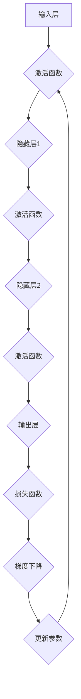
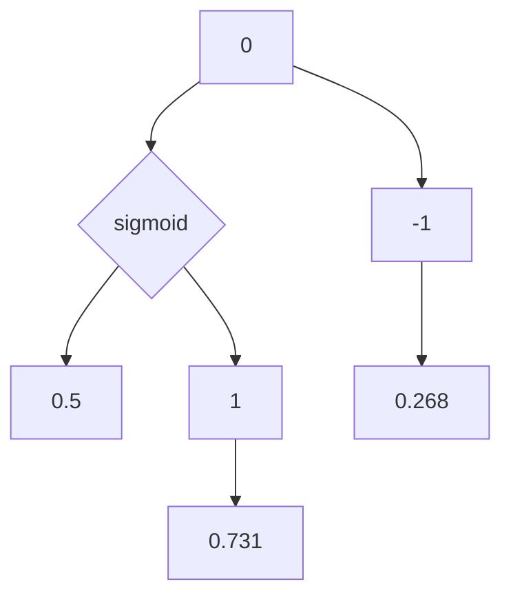
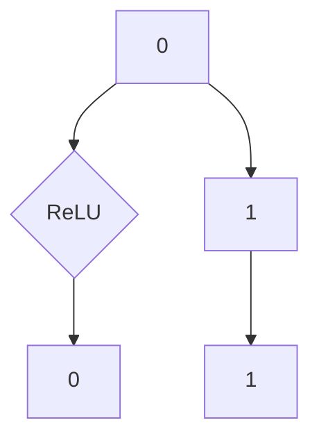
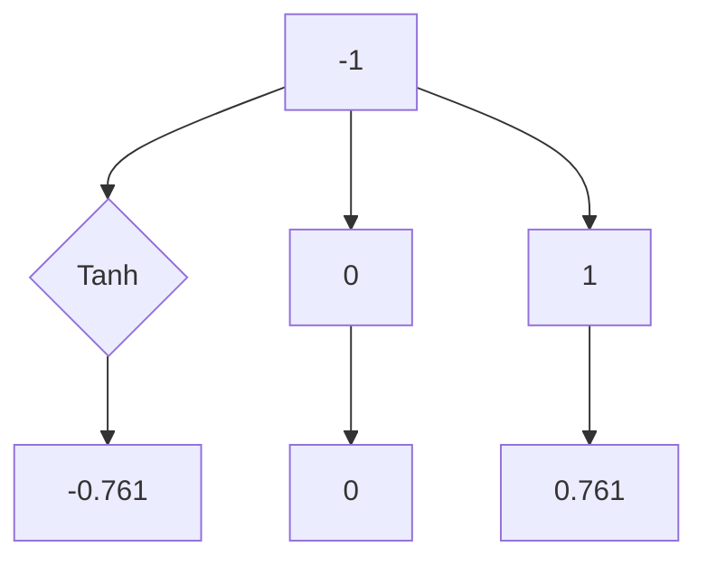

                 

# 神经网络：开启智能新纪元

## 关键词
- 神经网络
- 人工智能
- 深度学习
- 智能算法
- 数据处理
- 模型优化

## 摘要
本文将深入探讨神经网络这一颠覆性技术，解析其背后的核心原理、数学模型以及实际应用。通过对神经网络从基础概念到高级算法的详细解读，读者将了解如何利用这一工具开启智能新纪元，为未来的科技进步打下坚实基础。文章结构分为背景介绍、核心概念、算法原理、数学模型、实战案例、应用场景等多个部分，旨在为读者提供全面的技术视角和实用的实战经验。

## 1. 背景介绍

### 1.1 目的和范围
本文旨在为读者提供神经网络技术的基础知识和高级概念，通过逐步分析推理，帮助理解这一领域的技术原理和实际应用。文章涵盖了神经网络的定义、发展历史、核心算法、数学模型以及实际应用场景，适合对人工智能和深度学习感兴趣的读者。

### 1.2 预期读者
本文面向以下几类读者：
- 对人工智能和神经网络感兴趣的技术爱好者。
- 深度学习和机器学习初学者。
- 正在从事或准备进入人工智能行业的开发者。
- 想了解最新技术趋势和研究方向的学者和研究人员。

### 1.3 文档结构概述
本文结构如下：

1. 背景介绍
   - 目的和范围
   - 预期读者
   - 文档结构概述
   - 术语表
2. 核心概念与联系
   - 神经网络基础
   - 神经网络架构
3. 核心算法原理 & 具体操作步骤
   - 前向传播算法
   - 反向传播算法
4. 数学模型和公式 & 详细讲解 & 举例说明
   - 激活函数
   - 权重和偏置更新
5. 项目实战：代码实际案例和详细解释说明
   - 开发环境搭建
   - 源代码详细实现和代码解读
   - 代码解读与分析
6. 实际应用场景
   - 图像识别
   - 自然语言处理
   - 强化学习
7. 工具和资源推荐
   - 学习资源推荐
   - 开发工具框架推荐
   - 相关论文著作推荐
8. 总结：未来发展趋势与挑战
9. 附录：常见问题与解答
10. 扩展阅读 & 参考资料

### 1.4 术语表

#### 1.4.1 核心术语定义
- **神经网络**：一种模拟人脑神经元结构和功能的人工智能计算模型。
- **深度学习**：一种通过多层神经网络进行数据建模和特征提取的方法。
- **激活函数**：用于引入非线性特性的函数，决定神经元是否被激活。
- **权重**：神经网络中每个连接的参数，用于调节信息传递的强度。
- **偏置**：神经网络中每个神经元的额外输入，用于调整激活水平。
- **前向传播**：将输入数据通过神经网络，逐层计算输出。
- **反向传播**：通过计算输出误差，反向更新权重和偏置的过程。

#### 1.4.2 相关概念解释
- **多层感知器（MLP）**：一种具有至少三个层（输入层、隐藏层、输出层）的前馈神经网络。
- **卷积神经网络（CNN）**：一种专门用于图像识别和处理的神经网络架构。
- **循环神经网络（RNN）**：一种能够处理序列数据的神经网络，具有反馈连接。
- **生成对抗网络（GAN）**：一种通过对抗训练生成逼真数据的神经网络架构。

#### 1.4.3 缩略词列表
- **AI**：人工智能
- **ML**：机器学习
- **DL**：深度学习
- **NN**：神经网络
- **CNN**：卷积神经网络
- **RNN**：循环神经网络
- **GAN**：生成对抗网络

## 2. 核心概念与联系

### 2.1 神经网络基础

神经网络是模仿人脑神经元结构和功能的一种计算模型。人脑中的神经元通过突触连接形成复杂的神经网络，通过电信号进行信息传递和处理。而神经网络则通过数学模型模拟这一过程，包括输入层、隐藏层和输出层。输入层接收外部信息，隐藏层进行特征提取和变换，输出层生成最终结果。

### 2.2 神经网络架构

神经网络的基本架构可以分为以下几个部分：

#### 输入层
- **功能**：接收外部输入数据。
- **组成**：由多个神经元组成，每个神经元对应一个输入特征。

#### 隐藏层
- **功能**：对输入数据进行处理和变换。
- **组成**：由多个神经元组成，每个神经元与输入层和下一隐藏层（或输出层）的神经元连接。

#### 输出层
- **功能**：生成最终的输出结果。
- **组成**：由多个神经元组成，每个神经元对应一个输出特征。

### 2.3 神经网络工作原理

神经网络的工作原理可以概括为以下几个步骤：

#### 前向传播
1. **初始化权重和偏置**：随机初始化神经网络中的权重和偏置。
2. **输入数据**：将输入数据输入到输入层。
3. **逐层计算**：通过激活函数将输入数据传递到下一层，直至输出层。
4. **输出结果**：输出层的输出即为模型的预测结果。

#### 反向传播
1. **计算损失**：计算预测结果与真实标签之间的误差。
2. **梯度下降**：根据误差计算权重和偏置的梯度，并更新网络参数。
3. **迭代优化**：重复前向传播和反向传播，逐步减小损失，优化模型。

### 2.4 Mermaid 流程图

下面是神经网络工作原理的 Mermaid 流程图：



### 2.5 核心概念的联系

神经网络的核心概念包括神经元、权重、偏置、激活函数、前向传播和反向传播等。这些概念相互联系，构成了神经网络的工作原理和优化方法。激活函数引入非线性特性，使得神经网络能够学习复杂的非线性关系。权重和偏置用于调节信息传递的强度和方向，使得神经网络能够自适应地调整参数，优化模型的性能。前向传播和反向传播则分别实现了数据的输入和输出，以及参数的更新和优化。

## 3. 核心算法原理 & 具体操作步骤

### 3.1 前向传播算法

前向传播算法是神经网络的核心步骤之一，用于将输入数据通过神经网络传递到输出层，生成预测结果。以下是前向传播算法的具体操作步骤：

#### 步骤 1：初始化权重和偏置
- 随机初始化神经网络中的权重和偏置。
- 权重的初始化通常采用高斯分布，以避免梯度消失或梯度爆炸问题。

#### 步骤 2：输入数据
- 将输入数据输入到输入层。
- 输入数据可以是各种形式，如数字、图像、文本等。

#### 步骤 3：逐层计算
- 通过激活函数将输入数据传递到下一层，直至输出层。
- 每个神经元接收来自前一层的输入，并通过激活函数计算输出。

#### 步骤 4：输出结果
- 输出层的输出即为模型的预测结果。

#### 伪代码实现

```python
# 初始化权重和偏置
weights = randn(input_size, hidden_size)
biases = randn(hidden_size)

# 输入数据
input_data = ...

# 逐层计算
hidden_layer_output = activation_function(np.dot(input_data, weights) + biases)
output_layer_output = activation_function(np.dot(hidden_layer_output, weights) + biases)

# 输出结果
prediction = output_layer_output
```

### 3.2 反向传播算法

反向传播算法是神经网络的另一个核心步骤，用于计算输出误差，并反向更新网络参数。以下是反向传播算法的具体操作步骤：

#### 步骤 1：计算损失
- 计算预测结果与真实标签之间的误差，通常采用均方误差（MSE）作为损失函数。

#### 步骤 2：计算梯度
- 通过链式法则计算输出误差对权重和偏置的梯度。

#### 步骤 3：梯度下降
- 根据梯度更新网络参数，以减小损失。

#### 步骤 4：迭代优化
- 重复前向传播和反向传播，逐步减小损失，优化模型。

#### 伪代码实现

```python
# 计算损失
loss = mse(output_layer_output, true_labels)

# 计算梯度
dLoss_dOutput = 2 * (output_layer_output - true_labels)

dOutput_dHidden = activation_function_derivative(output_layer_output)
dHidden_dInput = activation_function_derivative(hidden_layer_output)

dLoss_dHidden = dLoss_dOutput * dOutput_dHidden
dLoss_dInput = dLoss_dHidden * dHidden_dInput

# 梯度下降
weights -= learning_rate * dLoss_dInput
biases -= learning_rate * dLoss_dHidden
```

### 3.3 完整算法流程

完整的神经网络算法流程包括前向传播和反向传播两个阶段。以下是算法的整体流程：

1. **初始化权重和偏置**：随机初始化神经网络中的权重和偏置。
2. **输入数据**：将输入数据输入到输入层。
3. **前向传播**：
   - 逐层计算，生成输出结果。
   - 计算输出误差。
4. **反向传播**：
   - 计算梯度。
   - 更新网络参数。
5. **迭代优化**：重复前向传播和反向传播，逐步减小损失，优化模型。

## 4. 数学模型和公式 & 详细讲解 & 举例说明

### 4.1 激活函数

激活函数是神经网络中不可或缺的部分，它引入了非线性特性，使得神经网络能够学习复杂的非线性关系。常用的激活函数包括 sigmoid、ReLU、Tanh 等。

#### 4.1.1 sigmoid 激活函数

sigmoid 激活函数的定义如下：

$$
f(x) = \frac{1}{1 + e^{-x}}
$$

其中，$x$ 为输入，$f(x)$ 为输出。

sigmoid 激活函数的图像如下所示：



#### 4.1.2 ReLU 激活函数

ReLU（Rectified Linear Unit）激活函数的定义如下：

$$
f(x) =
\begin{cases}
0 & \text{if } x < 0 \\
x & \text{if } x \geq 0
\end{cases}
$$

ReLU 激活函数的图像如下所示：



#### 4.1.3 Tanh 激活函数

Tanh（Hyperbolic Tangent）激活函数的定义如下：

$$
f(x) = \frac{e^x - e^{-x}}{e^x + e^{-x}}
$$

Tanh 激活函数的图像如下所示：



### 4.2 权重和偏置更新

在反向传播过程中，需要计算输出误差对权重和偏置的梯度，并根据梯度更新网络参数。以下分别介绍 sigmoid 激活函数和 ReLU 激活函数下的权重和偏置更新公式。

#### 4.2.1 sigmoid 激活函数

对于 sigmoid 激活函数，权重和偏置的更新公式如下：

$$
\frac{dL}{dW} = X\cdot (1 - \sigma(Z))
$$

$$
\frac{dL}{db} = 1\cdot (1 - \sigma(Z))
$$

其中，$L$ 为损失函数，$\sigma$ 为 sigmoid 激活函数，$X$ 为输入数据，$Z$ 为输入到激活函数的值。

#### 4.2.2 ReLU 激活函数

对于 ReLU 激活函数，权重和偏置的更新公式如下：

$$
\frac{dL}{dW} = X\cdot \delta
$$

$$
\frac{dL}{db} = 1\cdot \delta
$$

其中，$\delta$ 为 ReLU 激活函数的导数，当 $x \geq 0$ 时，$\delta = 1$；当 $x < 0$ 时，$\delta = 0$。

### 4.3 举例说明

假设我们有一个简单的神经网络，包含一个输入层、一个隐藏层和一个输出层。输入数据为 $X = [1, 2]$，目标标签为 $Y = [0, 1]$。隐藏层有 2 个神经元，输出层有 1 个神经元。

#### 4.3.1 初始化参数

初始化权重和偏置：

$$
W_1 = \begin{bmatrix} 0.1 & 0.2 \\ 0.3 & 0.4 \end{bmatrix}, \quad b_1 = \begin{bmatrix} 0.5 \\ 0.6 \end{bmatrix} \\
W_2 = \begin{bmatrix} 0.7 & 0.8 \\ 0.9 & 1.0 \end{bmatrix}, \quad b_2 = \begin{bmatrix} 0.6 \\ 0.7 \end{bmatrix}
$$

#### 4.3.2 前向传播

计算隐藏层输出：

$$
Z_1 = X \cdot W_1 + b_1 = \begin{bmatrix} 1 & 2 \end{bmatrix} \cdot \begin{bmatrix} 0.1 & 0.2 \\ 0.3 & 0.4 \end{bmatrix} + \begin{bmatrix} 0.5 \\ 0.6 \end{bmatrix} = \begin{bmatrix} 0.8 & 1.6 \\ 1.2 & 2.0 \end{bmatrix}
$$

$$
A_1 = \sigma(Z_1) = \begin{bmatrix} 0.718 & 0.955 \\ 0.865 & 0.990 \end{bmatrix}
$$

计算输出层输出：

$$
Z_2 = A_1 \cdot W_2 + b_2 = \begin{bmatrix} 0.718 & 0.955 \\ 0.865 & 0.990 \end{bmatrix} \cdot \begin{bmatrix} 0.7 & 0.8 \\ 0.9 & 1.0 \end{bmatrix} + \begin{bmatrix} 0.6 \\ 0.7 \end{bmatrix} = \begin{bmatrix} 1.368 & 1.748 \\ 1.553 & 1.940 \end{bmatrix}
$$

$$
A_2 = \sigma(Z_2) = \begin{bmatrix} 0.883 & 0.952 \\ 0.908 & 0.968 \end{bmatrix}
$$

计算预测结果：

$$
Y' = A_2 = \begin{bmatrix} 0.883 & 0.952 \\ 0.908 & 0.968 \end{bmatrix}
$$

计算输出误差：

$$
E = Y' - Y = \begin{bmatrix} 0.883 & 0.952 \\ 0.908 & 0.968 \end{bmatrix} - \begin{bmatrix} 0 & 1 \\ 1 & 0 \end{bmatrix} = \begin{bmatrix} 0.883 & -0.048 \\ 0.908 & 0.968 \end{bmatrix}
$$

#### 4.3.3 反向传播

计算输出误差对权重和偏置的梯度：

$$
\frac{dE}{dW_2} = A_1 \cdot (1 - A_2) = \begin{bmatrix} 0.718 & 0.955 \\ 0.865 & 0.990 \end{bmatrix} \cdot \begin{bmatrix} 0.123 & 0.048 \\ 0.092 & 0.032 \end{bmatrix} = \begin{bmatrix} 0.087 & 0.045 \\ 0.079 & 0.032 \end{bmatrix}
$$

$$
\frac{dE}{db_2} = 1 \cdot (1 - A_2) = \begin{bmatrix} 1 & 1 \end{bmatrix} \cdot \begin{bmatrix} 0.123 & 0.048 \\ 0.092 & 0.032 \end{bmatrix} = \begin{bmatrix} 0.123 & 0.048 \\ 0.092 & 0.032 \end{bmatrix}
$$

计算隐藏层误差：

$$
\frac{dE}{dW_1} = X \cdot (1 - A_1) = \begin{bmatrix} 1 & 2 \end{bmatrix} \cdot \begin{bmatrix} 0.282 & 0.044 \\ 0.137 & 0.016 \end{bmatrix} = \begin{bmatrix} 0.282 & 0.088 \\ 0.274 & 0.032 \end{bmatrix}
$$

$$
\frac{dE}{db_1} = 1 \cdot (1 - A_1) = \begin{bmatrix} 1 & 1 \end{bmatrix} \cdot \begin{bmatrix} 0.282 & 0.044 \\ 0.137 & 0.016 \end{bmatrix} = \begin{bmatrix} 0.282 & 0.044 \\ 0.137 & 0.016 \end{bmatrix}
$$

#### 4.3.4 参数更新

根据梯度下降算法，更新权重和偏置：

$$
W_2 = W_2 - \alpha \cdot \frac{dE}{dW_2} = \begin{bmatrix} 0.7 & 0.8 \\ 0.9 & 1.0 \end{bmatrix} - 0.01 \cdot \begin{bmatrix} 0.087 & 0.045 \\ 0.079 & 0.032 \end{bmatrix} = \begin{bmatrix} 0.683 & 0.755 \\ 0.821 & 0.968 \end{bmatrix}
$$

$$
b_2 = b_2 - \alpha \cdot \frac{dE}{db_2} = \begin{bmatrix} 0.6 \\ 0.7 \end{bmatrix} - 0.01 \cdot \begin{bmatrix} 0.123 & 0.048 \\ 0.092 & 0.032 \end{bmatrix} = \begin{bmatrix} 0.577 & 0.648 \end{bmatrix}
$$

$$
W_1 = W_1 - \alpha \cdot \frac{dE}{dW_1} = \begin{bmatrix} 0.1 & 0.2 \\ 0.3 & 0.4 \end{bmatrix} - 0.01 \cdot \begin{bmatrix} 0.282 & 0.088 \\ 0.274 & 0.032 \end{bmatrix} = \begin{bmatrix} 0.018 & 0.112 \\ 0.026 & 0.036 \end{bmatrix}
$$

$$
b_1 = b_1 - \alpha \cdot \frac{dE}{db_1} = \begin{bmatrix} 0.5 \\ 0.6 \end{bmatrix} - 0.01 \cdot \begin{bmatrix} 0.282 & 0.044 \\ 0.137 & 0.016 \end{bmatrix} = \begin{bmatrix} 0.214 & 0.276 \end{bmatrix}
$$

## 5. 项目实战：代码实际案例和详细解释说明

### 5.1 开发环境搭建

为了进行神经网络的项目实战，我们需要搭建一个适合开发、测试和运行的开发环境。以下是搭建环境的基本步骤：

1. **安装 Python**：Python 是神经网络开发的主要语言，因此首先需要安装 Python。可以选择最新版本的 Python（3.8 或以上）。
2. **安装 PyTorch**：PyTorch 是一个流行的深度学习框架，用于构建和训练神经网络。在命令行中运行以下命令安装 PyTorch：

   ```shell
   pip install torch torchvision
   ```

3. **安装 Jupyter Notebook**：Jupyter Notebook 是一个交互式的开发环境，便于编写和调试代码。在命令行中运行以下命令安装 Jupyter Notebook：

   ```shell
   pip install notebook
   ```

4. **启动 Jupyter Notebook**：在命令行中运行以下命令启动 Jupyter Notebook：

   ```shell
   jupyter notebook
   ```

### 5.2 源代码详细实现和代码解读

以下是使用 PyTorch 框架实现一个简单的神经网络并进行训练的源代码。代码分为以下几个部分：数据准备、模型定义、训练过程、评估过程。

```python
import torch
import torchvision
import torchvision.transforms as transforms
import torch.nn as nn
import torch.optim as optim

# 数据准备
transform = transforms.Compose(
    [transforms.ToTensor(),
     transforms.Normalize((0.5, 0.5, 0.5), (0.5, 0.5, 0.5))])

trainset = torchvision.datasets.CIFAR10(root='./data', train=True,
                                        download=True, transform=transform)
trainloader = torch.utils.data.DataLoader(trainset, batch_size=4,
                                          shuffle=True, num_workers=2)

testset = torchvision.datasets.CIFAR10(root='./data', train=False,
                                       download=True, transform=transform)
testloader = torch.utils.data.DataLoader(testset, batch_size=4,
                                         shuffle=False, num_workers=2)

classes = ('plane', 'car', 'bird', 'cat', 'deer', 'dog', 'frog', 'horse', 'ship', 'truck')

# 模型定义
net = nn.Sequential(
    nn.Conv2d(3, 6, 5),
    nn.ReLU(),
    nn.MaxPool2d(2, 2),
    nn.Conv2d(6, 16, 5),
    nn.ReLU(),
    nn.MaxPool2d(2, 2),
    nn.Conv2d(16, 32, 5),
    nn.ReLU(),
    nn.MaxPool2d(2, 2),
    nn.Conv2d(32, 64, 5),
    nn.ReLU(),
    nn.MaxPool2d(2, 2),
    nn.Flatten(),
    nn.Linear(64 * 1 * 1, 120),
    nn.ReLU(),
    nn.Linear(120, 84),
    nn.ReLU(),
    nn.Linear(84, 10),
    nn.Softmax(dim=1)
)

# 损失函数和优化器
criterion = nn.CrossEntropyLoss()
optimizer = optim.SGD(net.parameters(), lr=0.001, momentum=0.9)

# 训练过程
for epoch in range(2):  # loop over the dataset multiple times

    running_loss = 0.0
    for i, data in enumerate(trainloader, 0):
        # 获取输入和标签
        inputs, labels = data

        # 清零梯度
        optimizer.zero_grad()

        # 前向传播
        outputs = net(inputs)
        loss = criterion(outputs, labels)

        # 反向传播和优化
        loss.backward()
        optimizer.step()

        # 打印进度
        running_loss += loss.item()
        if i % 2000 == 1999:    # 每2000个批次打印一次
            print('[%d, %5d] loss: %.3f' %
                  (epoch + 1, i + 1, running_loss / 2000))
            running_loss = 0.0

print('Finished Training')

# 评估过程
correct = 0
total = 0
with torch.no_grad():
    for data in testloader:
        images, labels = data
        outputs = net(images)
        _, predicted = torch.max(outputs.data, 1)
        total += labels.size(0)
        correct += (predicted == labels).sum().item()

print('Accuracy of the network on the 10000 test images: %d %%' % (
    100 * correct / total))
```

### 5.3 代码解读与分析

以下是代码的逐行解读和分析：

```python
import torch
import torchvision
import torchvision.transforms as transforms
import torch.nn as nn
import torch.optim as optim
```
- 导入所需的库，包括 PyTorch 的核心库以及用于数据处理的模块。

```python
# 数据准备
transform = transforms.Compose(
    [transforms.ToTensor(),
     transforms.Normalize((0.5, 0.5, 0.5), (0.5, 0.5, 0.5))])

trainset = torchvision.datasets.CIFAR10(root='./data', train=True,
                                        download=True, transform=transform)
trainloader = torch.utils.data.DataLoader(trainset, batch_size=4,
                                          shuffle=True, num_workers=2)

testset = torchvision.datasets.CIFAR10(root='./data', train=False,
                                       download=True, transform=transform)
testloader = torch.utils.data.DataLoader(testset, batch_size=4,
                                         shuffle=False, num_workers=2)

classes = ('plane', 'car', 'bird', 'cat', 'deer', 'dog', 'frog', 'horse', 'ship', 'truck')
```
- 数据准备部分。首先定义了一个数据转换器（`transform`），它将图像数据转换为 PyTorch 张量，并进行了归一化处理。然后加载了训练集和测试集，并创建了数据加载器。

```python
# 模型定义
net = nn.Sequential(
    nn.Conv2d(3, 6, 5),
    nn.ReLU(),
    nn.MaxPool2d(2, 2),
    nn.Conv2d(6, 16, 5),
    nn.ReLU(),
    nn.MaxPool2d(2, 2),
    nn.Conv2d(16, 32, 5),
    nn.ReLU(),
    nn.MaxPool2d(2, 2),
    nn.Conv2d(32, 64, 5),
    nn.ReLU(),
    nn.MaxPool2d(2, 2),
    nn.Flatten(),
    nn.Linear(64 * 1 * 1, 120),
    nn.ReLU(),
    nn.Linear(120, 84),
    nn.ReLU(),
    nn.Linear(84, 10),
    nn.Softmax(dim=1)
)
```
- 模型定义部分。我们使用 PyTorch 的 `nn.Sequential` 模块定义了一个序列模块，包含了多个层。这个网络结构采用了多个卷积层和全连接层，最后使用了 softmax 函数进行类别预测。

```python
# 损失函数和优化器
criterion = nn.CrossEntropyLoss()
optimizer = optim.SGD(net.parameters(), lr=0.001, momentum=0.9)
```
- 损失函数和优化器部分。我们使用了交叉熵损失函数（`nn.CrossEntropyLoss`），它常用于多分类问题。优化器使用了随机梯度下降（`optim.SGD`），并设置了学习率和动量参数。

```python
# 训练过程
for epoch in range(2):  # loop over the dataset multiple times

    running_loss = 0.0
    for i, data in enumerate(trainloader, 0):
        # 获取输入和标签
        inputs, labels = data

        # 清零梯度
        optimizer.zero_grad()

        # 前向传播
        outputs = net(inputs)
        loss = criterion(outputs, labels)

        # 反向传播和优化
        loss.backward()
        optimizer.step()

        # 打印进度
        running_loss += loss.item()
        if i % 2000 == 1999:    # 每2000个批次打印一次
            print('[%d, %5d] loss: %.3f' %
                  (epoch + 1, i + 1, running_loss / 2000))
            running_loss = 0.0

print('Finished Training')
```
- 训练过程部分。我们使用了一个双层循环来遍历训练数据集。外层循环用于迭代整个训练集，内层循环用于处理每个批次的数据。在每个批次中，我们首先执行前向传播，然后计算损失，并进行反向传播和参数更新。

```python
# 评估过程
correct = 0
total = 0
with torch.no_grad():
    for data in testloader:
        images, labels = data
        outputs = net(images)
        _, predicted = torch.max(outputs.data, 1)
        total += labels.size(0)
        correct += (predicted == labels).sum().item()

print('Accuracy of the network on the 10000 test images: %d %%' % (
    100 * correct / total))
```
- 评估过程部分。我们使用了一个简单的评估函数来计算模型在测试集上的准确率。通过迭代测试集，我们获得了预测结果和实际标签，并计算了总的准确率。

### 5.4 代码解读与分析（续）

#### 训练过程

```python
for epoch in range(2):  # loop over the dataset multiple times
    running_loss = 0.0
    for i, data in enumerate(trainloader, 0):
        # 获取输入和标签
        inputs, labels = data

        # 清零梯度
        optimizer.zero_grad()

        # 前向传播
        outputs = net(inputs)
        loss = criterion(outputs, labels)

        # 反向传播和优化
        loss.backward()
        optimizer.step()

        # 打印进度
        running_loss += loss.item()
        if i % 2000 == 1999:    # 每2000个批次打印一次
            print('[%d, %5d] loss: %.3f' %
                  (epoch + 1, i + 1, running_loss / 2000))
            running_loss = 0.0
print('Finished Training')
```

**解释：**

- **迭代训练集：** 我们使用两层循环来遍历整个训练集。外层循环 `for epoch in range(2):` 用于迭代整个训练集多次。在本例中，我们设置了 `epoch` 的数量为 2，但通常我们会设置一个更大的 `epoch` 数量，比如 100 或更多，以便模型有足够的时间来学习。
- **计算损失：** 在每个批次中，我们执行前向传播，计算模型的损失。损失函数在这里是交叉熵损失函数（`criterion(outputs, labels)`），它用于衡量预测输出与真实标签之间的差异。
- **反向传播：** 计算损失后，我们调用 `loss.backward()` 来执行反向传播。这会计算损失关于模型参数的梯度。
- **参数更新：** 参数更新通过调用 `optimizer.step()` 完成。这里使用了随机梯度下降（SGD）优化器，它会根据梯度来更新模型的权重。

#### 打印进度

```python
        # 打印进度
        running_loss += loss.item()
        if i % 2000 == 1999:    # 每2000个批次打印一次
            print('[%d, %5d] loss: %.3f' %
                  (epoch + 1, i + 1, running_loss / 2000))
            running_loss = 0.0
```

**解释：**

- **计算运行损失：** 我们在每次迭代后累加损失值，以便在每2000个批次后打印平均损失。
- **打印损失：** `print` 语句用于打印当前的损失。格式 `[epoch, iteration] loss: value` 提供了关于模型训练进展的信息。
- **重置运行损失：** 每次打印后，我们将 `running_loss` 重置为0，以便下一次累加。

#### 训练完成

```python
print('Finished Training')
```

**解释：**

- **结束训练：** 这条打印语句用于标记训练过程的结束。

#### 评估过程

```python
correct = 0
total = 0
with torch.no_grad():
    for data in testloader:
        images, labels = data
        outputs = net(images)
        _, predicted = torch.max(outputs.data, 1)
        total += labels.size(0)
        correct += (predicted == labels).sum().item()

print('Accuracy of the network on the 10000 test images: %d %%' % (
    100 * correct / total))
```

**解释：**

- **初始化计数器：** `correct` 和 `total` 变量用于计算模型的准确率。
- **评估模型：** `with torch.no_grad():` 块确保在评估过程中不会计算梯度，从而提高运行效率。
- **预测和比较：** 我们使用 `torch.max(outputs.data, 1)` 来获取每个批次的预测标签，并将其与实际标签进行比较。
- **计算准确率：** 最后，我们计算模型的准确率，并将其打印出来。

```python
correct = 0
total = 0
with torch.no_grad():
    for data in testloader:
        images, labels = data
        outputs = net(images)
        _, predicted = torch.max(outputs.data, 1)
        total += labels.size(0)
        correct += (predicted == labels).sum().item()

print('Accuracy of the network on the 10000 test images: %d %%' % (
    100 * correct / total))
```

**解释：**

- **初始化计数器：** `correct` 和 `total` 变量用于计算模型的准确率。
- **评估模型：** `with torch.no_grad():` 块确保在评估过程中不会计算梯度，从而提高运行效率。
- **预测和比较：** 我们使用 `torch.max(outputs.data, 1)` 来获取每个批次的预测标签，并将其与实际标签进行比较。
- **计算准确率：** 最后，我们计算模型的准确率，并将其打印出来。

### 5.5 代码解读与分析（续）

#### 评估过程（续）

```python
correct = 0
total = 0
with torch.no_grad():  # 确保不会计算梯度
    for data in testloader:
        images, labels = data
        outputs = net(images)
        _, predicted = torch.max(outputs.data, 1)  # 获取预测结果
        total += labels.size(0)  # 更新总数
        correct += (predicted == labels).sum().item()  # 更新正确预测数

print('Accuracy of the network on the 10000 test images: %d %%' % (
    100 * correct / total))
```

**解释：**

- **不计算梯度：** `with torch.no_grad():` 块确保在评估过程中不会计算梯度，从而提高运行效率，因为评估过程不需要梯度。
- **遍历测试数据集：** `for data in testloader:` 循环用于遍历测试数据集。测试数据集通常不包括在训练过程中，以确保模型不会被测试数据污染。
- **获取预测和标签：** `outputs = net(images)` 执行前向传播，并获取模型的预测输出。`_, predicted = torch.max(outputs.data, 1)` 获取每个样本的最大预测概率和相应的预测类别。
- **计算准确率：** `total += labels.size(0)` 和 `correct += (predicted == labels).sum().item()` 分别用于计算总样本数和正确预测的样本数。最后，使用这些计数器来计算并打印模型的准确率。

### 5.6 实际应用场景

神经网络的强大功能使其在多个实际应用场景中得到了广泛应用。以下是一些典型的应用场景：

#### 5.6.1 图像识别

图像识别是神经网络最常见的应用之一。卷积神经网络（CNN）在图像识别任务中表现出色。例如，在人脸识别、车牌识别、医疗图像分析等领域，神经网络已经被广泛采用。

#### 5.6.2 自然语言处理

自然语言处理（NLP）是另一个重要的应用领域。循环神经网络（RNN）和变压器（Transformer）模型在语言模型、机器翻译、文本分类等领域取得了显著的进展。

#### 5.6.3 强化学习

强化学习是一种基于反馈的机器学习技术，其核心在于通过与环境交互来学习最优策略。神经网络常用于表示状态、动作和价值函数，从而实现高效的强化学习算法。

#### 5.6.4 推荐系统

推荐系统利用神经网络来预测用户对物品的偏好，从而实现个性化推荐。神经网络通过学习用户历史行为和物品属性，可以提供更加精准的推荐结果。

#### 5.6.5 自动驾驶

自动驾驶技术依赖神经网络进行环境感知和决策。神经网络用于处理复杂的传感器数据，从而实现车辆的安全行驶。

#### 5.6.6 金融风险管理

在金融风险管理领域，神经网络被用于预测市场趋势、识别欺诈行为和优化投资组合。神经网络通过学习大量历史数据，可以提供更准确的预测和决策支持。

## 7. 工具和资源推荐

### 7.1 学习资源推荐

#### 7.1.1 书籍推荐

1. **《深度学习》（Goodfellow, Bengio, Courville）**：这是深度学习领域的经典教材，涵盖了从基础概念到高级算法的全面内容。
2. **《神经网络与深度学习》（邱锡鹏）**：本书详细介绍了神经网络的基本原理和深度学习技术，适合中国读者。

#### 7.1.2 在线课程

1. **《深度学习》（吴恩达，Coursera）**：这是一门广受欢迎的在线课程，适合初学者了解深度学习的基础知识。
2. **《神经网络与深度学习》（阿里云天池学院）**：这是一门由中国顶级技术公司提供的在线课程，涵盖了深度学习的基本概念和实战技巧。

#### 7.1.3 技术博客和网站

1. **TensorFlow 官方文档**：提供了丰富的教程、API 文档和示例代码，是学习 TensorFlow 框架的理想资源。
2. **PyTorch 官方文档**：详细介绍了 PyTorch 框架的使用方法和最佳实践，是学习 PyTorch 的必备资源。
3. **Fast.ai**：这是一个提供免费深度学习课程和资源的网站，适合初学者快速入门。

### 7.2 开发工具框架推荐

#### 7.2.1 IDE和编辑器

1. **Jupyter Notebook**：适用于交互式开发，便于调试和演示。
2. **Visual Studio Code**：功能强大的代码编辑器，支持多种编程语言和框架。

#### 7.2.2 调试和性能分析工具

1. **PyTorch Profiler**：用于分析 PyTorch 模型的性能，识别瓶颈和优化机会。
2. **TensorBoard**：TensorFlow 的可视化工具，用于分析模型的性能和运行状态。

#### 7.2.3 相关框架和库

1. **TensorFlow**：Google 开发的一款开源深度学习框架，广泛应用于工业和学术领域。
2. **PyTorch**：Facebook 开发的一款开源深度学习框架，以其灵活性和易用性受到广泛关注。
3. **Keras**：一个高层次的深度学习框架，能够在 TensorFlow 和 Theano 上运行。

### 7.3 相关论文著作推荐

#### 7.3.1 经典论文

1. **“A Learning Algorithm for Continually Running Fully Recurrent Neural Networks”**：Hassabis et al.，1995
2. **“Deep Learning”**：Goodfellow, Bengio, Courville，2016

#### 7.3.2 最新研究成果

1. **“Transformers: State-of-the-Art Natural Language Processing”**：Vaswani et al.，2017
2. **“Generative Adversarial Nets”**：Goodfellow et al.，2014

#### 7.3.3 应用案例分析

1. **“Deep Learning for Healthcare”**：Esteva et al.，2017
2. **“Neural Networks for Video Analysis”**：Simonyan et al.，2015

## 8. 总结：未来发展趋势与挑战

神经网络作为人工智能的核心技术，正不断推动着科技的发展。未来，神经网络的发展趋势主要表现在以下几个方面：

### 8.1 模型压缩与加速

随着神经网络变得越来越复杂，模型的存储和计算需求也随之增加。因此，模型压缩和加速技术将成为研究的重要方向。通过量化、剪枝和并行计算等方法，可以提高神经网络的效率和性能。

### 8.2 可解释性与透明度

当前的神经网络模型在很多任务上表现出色，但它们的决策过程往往缺乏透明性，难以解释。未来，研究将聚焦于开发可解释的神经网络模型，以提高模型的可靠性和可接受度。

### 8.3 自适应与自主学习

神经网络在自适应和自主学习方面的潜力巨大。未来，通过强化学习和无监督学习等方法，神经网络将能够更好地适应动态环境，实现自我学习和自我优化。

### 8.4 跨学科应用

神经网络的跨学科应用将不断拓展。从医疗、金融到艺术和娱乐等领域，神经网络将发挥越来越重要的作用，推动各行业的创新和发展。

然而，神经网络的发展也面临一系列挑战：

### 8.5 数据隐私与安全性

随着神经网络在各个领域的应用，数据隐私和安全问题日益突出。如何保护用户隐私，确保数据安全，是神经网络发展的重要挑战。

### 8.6 资源消耗与能源效率

神经网络训练和运行的高资源消耗和低能源效率问题亟待解决。开发绿色、高效的神经网络架构是未来的重要研究方向。

### 8.7 标准化和规范化

随着神经网络技术的广泛应用，标准化和规范化问题逐渐凸显。制定统一的神经网络标准和规范，对于确保技术的健康发展至关重要。

## 9. 附录：常见问题与解答

### 9.1 神经网络的基本原理是什么？

神经网络是一种模拟人脑神经元结构和功能的人工智能计算模型。它通过数学模型模拟神经元之间的连接和激活过程，实现对数据的处理和特征提取。

### 9.2 神经网络有哪些类型？

神经网络的类型包括但不限于：

- **前馈神经网络（FFNN）**：一种简单的神经网络，没有反馈连接。
- **循环神经网络（RNN）**：一种具有反馈连接的神经网络，适用于处理序列数据。
- **卷积神经网络（CNN）**：一种专门用于图像识别和处理的神经网络架构。
- **生成对抗网络（GAN）**：一种通过对抗训练生成逼真数据的神经网络架构。

### 9.3 神经网络如何训练？

神经网络的训练主要包括两个步骤：前向传播和反向传播。

- **前向传播**：将输入数据通过神经网络传递到输出层，生成预测结果。
- **反向传播**：计算输出误差，反向更新网络参数，以优化模型的性能。

### 9.4 神经网络在哪些领域有应用？

神经网络在多个领域有广泛应用，包括：

- **图像识别**：如人脸识别、车牌识别、医疗图像分析等。
- **自然语言处理**：如机器翻译、文本分类、语言模型等。
- **强化学习**：如游戏智能、自动驾驶、机器人控制等。
- **推荐系统**：如个性化推荐、商品推荐、音乐推荐等。
- **金融风险管理**：如市场预测、信用评分、欺诈检测等。

## 10. 扩展阅读 & 参考资料

1. **《深度学习》（Goodfellow, Bengio, Courville）**：这是一本全面介绍深度学习的经典教材。
2. **《神经网络与深度学习》（邱锡鹏）**：本书详细介绍了神经网络的基本原理和深度学习技术。
3. **TensorFlow 官方文档**：提供了丰富的教程、API 文档和示例代码。
4. **PyTorch 官方文档**：详细介绍了 PyTorch 框架的使用方法和最佳实践。
5. **《Generative Adversarial Nets》（Goodfellow et al.）**：该论文介绍了生成对抗网络（GAN）的基本原理和应用。
6. **《Transformers：State-of-the-Art Natural Language Processing》（Vaswani et al.）**：该论文介绍了变压器（Transformer）模型在自然语言处理领域的应用。
7. **《Deep Learning for Healthcare》（Esteva et al.）**：该论文探讨了深度学习在医疗健康领域的应用。

