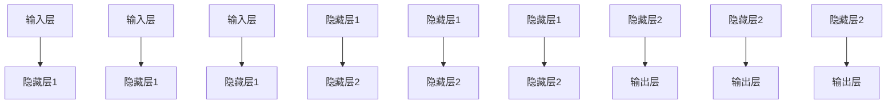
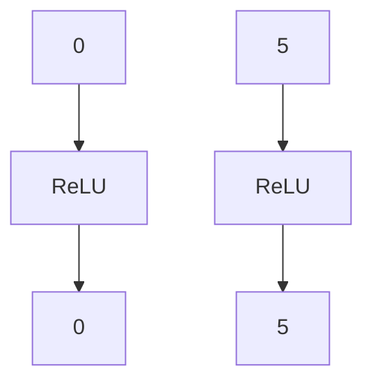
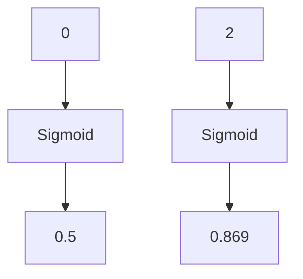
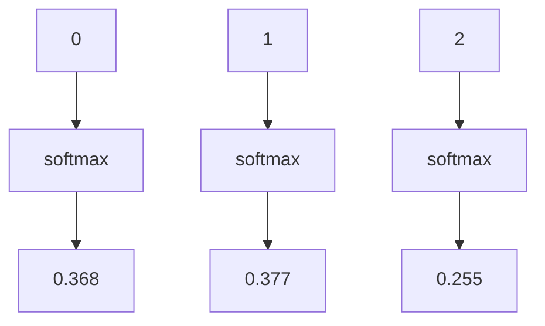
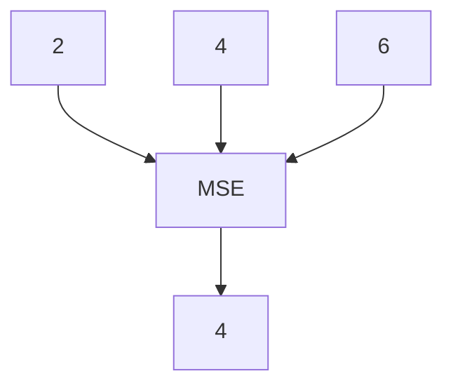
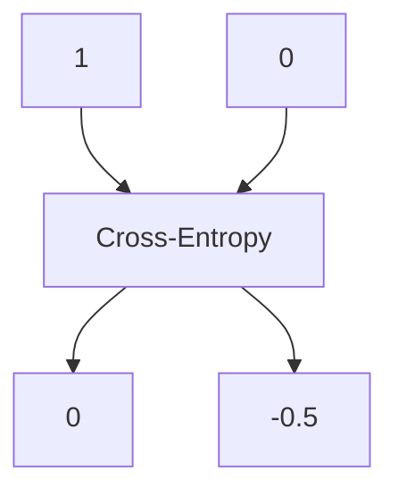

                 

# 神经网络：探索未知的领域

## 关键词
- 神经网络
- 机器学习
- 深度学习
- 反向传播
- 数学模型
- 应用场景

## 摘要
本文将深入探讨神经网络这一强大的人工智能工具，从其基本概念、核心算法、数学模型到实际应用，进行全面而深入的剖析。我们将使用逻辑清晰、结构紧凑、简单易懂的技术语言，逐步解析神经网络的奥秘，帮助读者理解和掌握这一领域的关键技术。

> "神经网络，如同人类大脑的简化模型，通过不断的学习与调整，实现了对复杂问题的求解。本文将带领您踏上一场探索未知领域的旅程，共同揭开神经网络神秘的面纱。"

## 1. 背景介绍

### 1.1 目的和范围

本文旨在为初学者和中级学习者提供一个全面而深入的神经网络教程。通过本文的学习，读者将能够：

1. 理解神经网络的基本概念和结构。
2. 掌握神经网络的核心算法——反向传播算法。
3. 了解神经网络的数学模型及其应用场景。
4. 实战演练，掌握神经网络的编程实现。

本文将涵盖神经网络的基本原理、技术细节和实际应用，旨在帮助读者构建完整的神经网络知识体系。

### 1.2 预期读者

- 对神经网络和机器学习有一定了解的读者。
- 想要深入了解神经网络原理和技术细节的开发者。
- 想要在实际项目中应用神经网络的工程师。

### 1.3 文档结构概述

本文将分为以下几个部分：

1. **背景介绍**：介绍神经网络的基本概念、目的和范围。
2. **核心概念与联系**：详细阐述神经网络的组成结构。
3. **核心算法原理 & 具体操作步骤**：讲解神经网络的核心算法——反向传播算法。
4. **数学模型和公式 & 详细讲解 & 举例说明**：解析神经网络的数学基础。
5. **项目实战：代码实际案例和详细解释说明**：通过实际案例展示神经网络的应用。
6. **实际应用场景**：探讨神经网络的广泛应用领域。
7. **工具和资源推荐**：推荐学习资源和开发工具。
8. **总结：未来发展趋势与挑战**：总结神经网络的发展趋势和面临的挑战。
9. **附录：常见问题与解答**：解答读者可能遇到的问题。
10. **扩展阅读 & 参考资料**：提供进一步学习的资源。

### 1.4 术语表

#### 1.4.1 核心术语定义

- **神经网络**：模拟人脑神经元连接方式的计算模型。
- **神经元**：神经网络的基本单元，用于接收输入、传递信号和产生输出。
- **前向传播**：将输入信号从输入层传递到输出层的过程。
- **反向传播**：根据输出误差，反向调整网络权重的过程。
- **激活函数**：用于确定神经元是否激活的函数，如ReLU、Sigmoid等。
- **损失函数**：衡量模型输出与真实值之间差异的函数，如均方误差(MSE)、交叉熵等。

#### 1.4.2 相关概念解释

- **深度学习**：一种利用多层神经网络进行特征提取和模型训练的机器学习技术。
- **反向传播算法**：一种用于训练神经网络的优化算法，通过反向传播误差来更新网络权重。
- **权重**：连接神经元的参数，用于调整信号的传递强度。
- **偏置**：神经元的额外输入，用于调整神经元的激活阈值。

#### 1.4.3 缩略词列表

- **MSE**：均方误差(Mean Squared Error)
- **ReLU**：修正线性单元(ReLu, Rectified Linear Unit)
- **Sigmoid**：S形函数(Sigmoid Function)
- **softmax**：软最大化函数(Softmax Function)
- **CNN**：卷积神经网络(Convolutional Neural Network)

## 2. 核心概念与联系

在深入探讨神经网络之前，我们需要了解其核心概念和组成部分。神经网络由大量的神经元组成，每个神经元都与其他神经元相连。神经元的连接方式决定了网络的层次结构和功能。

### 2.1 神经网络的层次结构

神经网络通常由以下几个层次组成：

1. **输入层**：接收外部输入数据的层次。
2. **隐藏层**：位于输入层和输出层之间的层次，用于特征提取和变换。
3. **输出层**：产生最终输出的层次。

下面是一个简单的神经网络层次结构图：



### 2.2 神经元的连接方式

神经元通过权重（weight）连接。每个权重都表示神经元之间的信号传递强度。神经元之间的连接可以通过以下公式表示：

\[ \text{输出} = \text{输入} \times \text{权重} + \text{偏置} \]

其中，输入是其他神经元的输出，权重是连接的参数，偏置是神经元的额外输入。

### 2.3 激活函数

激活函数用于确定神经元是否激活。常见的激活函数包括ReLU（修正线性单元）、Sigmoid（S形函数）和softmax（软最大化函数）等。

#### 2.3.1 ReLU激活函数

ReLU激活函数是最简单的一种激活函数，其公式如下：

\[ f(x) = \max(0, x) \]

ReLU函数在输入为负值时返回0，在输入为正值时返回输入值。



#### 2.3.2 Sigmoid激活函数

Sigmoid激活函数是一种常用的非线性激活函数，其公式如下：

\[ f(x) = \frac{1}{1 + e^{-x}} \]

Sigmoid函数将输入值映射到(0, 1)区间内，常用于二分类问题。



#### 2.3.3 softmax激活函数

softmax激活函数用于多分类问题，其公式如下：

\[ f(x_i) = \frac{e^{x_i}}{\sum_{j} e^{x_j}} \]

softmax函数将输入值映射到概率分布。



### 2.4 损失函数

损失函数用于衡量模型输出与真实值之间的差异。常见的损失函数包括均方误差（MSE）、交叉熵（Cross-Entropy）等。

#### 2.4.1 均方误差（MSE）

均方误差（MSE）是一种常用的回归损失函数，其公式如下：

\[ \text{MSE} = \frac{1}{n}\sum_{i=1}^{n}(y_i - \hat{y_i})^2 \]

其中，\( y_i \)是真实值，\( \hat{y_i} \)是预测值。



#### 2.4.2 交叉熵（Cross-Entropy）

交叉熵（Cross-Entropy）是一种常用的分类损失函数，其公式如下：

\[ \text{CE} = -\sum_{i} y_i \log(\hat{y_i}) \]

其中，\( y_i \)是真实值（0或1），\( \hat{y_i} \)是预测概率。



## 3. 核心算法原理 & 具体操作步骤

神经网络的训练过程是通过反向传播算法来调整网络权重和偏置，以达到最小化损失函数的目的。下面将详细讲解反向传播算法的原理和操作步骤。

### 3.1 反向传播算法原理

反向传播算法是一种用于训练神经网络的优化算法，其核心思想是通过反向传播误差来更新网络权重和偏置。算法分为两个阶段：

1. **前向传播**：将输入数据通过神经网络进行传播，计算输出值。
2. **反向传播**：根据输出误差，反向传播误差信号，计算各层权重的梯度，并更新权重和偏置。

### 3.2 前向传播

前向传播是指将输入数据从输入层传递到输出层的整个过程。在前向传播过程中，每个神经元的输出是通过其输入值与权重、激活函数的运算得到的。具体步骤如下：

1. **初始化网络参数**：包括权重（weight）和偏置（bias）。
2. **前向计算**：从输入层开始，逐层计算每个神经元的输出值。
3. **输出层计算**：计算输出层的输出值。

下面是前向传播的具体伪代码：

```plaintext
for each training example (x, y) do
    for each layer l from 1 to L do
        if l = 1 (input layer) then
            a[l][j] = x[j]
        else
            z[l][j] = sum(a[l-1][k] * w[l][k, j]) + b[l][j]
            a[l][j] = activation_function(z[l][j])
        end if
    end for
end for
```

### 3.3 反向传播

反向传播是指根据输出误差，反向计算各层权重的梯度，并更新权重和偏置的过程。具体步骤如下：

1. **计算输出误差**：计算输出层的误差，误差值等于预测值与真实值之间的差异。
2. **反向计算误差**：从输出层开始，逐层计算各层的误差信号。
3. **计算梯度**：根据误差信号，计算各层权重的梯度。
4. **更新权重和偏置**：根据梯度，更新各层权重和偏置。

下面是反向传播的具体伪代码：

```plaintext
for each training example (x, y) do
    for each layer l from L to 1 do
        if l = L (output layer) then
            delta[l][j] = (y[j] - a[l][j]) * activation_derivative(a[l][j])
        else
            delta[l][j] = sum(delta[l+1][k] * w[l+1][k, j]) * activation_derivative(z[l][j])
        end if
    end for

    for each layer l from L-1 to 1 do
        w[l] = w[l] - learning_rate * delta[l-1].T * a[l-1].T
        b[l] = b[l] - learning_rate * delta[l-1].T
    end for
end for
```

其中，`activation_derivative`函数用于计算激活函数的导数。

## 4. 数学模型和公式 & 详细讲解 & 举例说明

神经网络的成功离不开其背后的数学模型。本节将详细介绍神经网络的数学模型，包括前向传播和反向传播的公式，并给出详细的讲解和例子说明。

### 4.1 前向传播公式

前向传播是指将输入数据通过神经网络进行传播，计算输出值的过程。在前向传播过程中，每个神经元的输出可以通过以下公式计算：

\[ a[l][j] = \sigma(z[l][j]) \]

其中，\( a[l][j] \)表示第\( l \)层的第\( j \)个神经元的输出，\( z[l][j] \)表示第\( l \)层的第\( j \)个神经元的输入，\( \sigma \)表示激活函数。

#### 4.1.1 激活函数

常见的激活函数有ReLU、Sigmoid和softmax等。下面分别介绍这三种激活函数的公式和性质。

##### 4.1.1.1 ReLU激活函数

ReLU激活函数是最简单的一种激活函数，其公式如下：

\[ \sigma(x) = \max(0, x) \]

ReLU函数在输入为负值时返回0，在输入为正值时返回输入值。ReLU函数具有简单、计算速度快和不易陷入梯度消失问题等优点。

##### 4.1.1.2 Sigmoid激活函数

Sigmoid激活函数是一种常用的非线性激活函数，其公式如下：

\[ \sigma(x) = \frac{1}{1 + e^{-x}} \]

Sigmoid函数将输入值映射到(0, 1)区间内，常用于二分类问题。Sigmoid函数的导数在输入接近0时接近1，在输入接近无穷大时接近0，这使得Sigmoid函数容易陷入梯度消失问题。

##### 4.1.1.3 softmax激活函数

softmax激活函数用于多分类问题，其公式如下：

\[ \sigma(x) = \frac{e^{x}}{\sum_{j} e^{x_j}} \]

softmax函数将输入值映射到概率分布，其中每个输入值对应的概率等于\( e^{x_j} \)除以所有输入值的和。softmax函数的导数在输入接近0时接近1，在输入接近无穷大时接近0。

#### 4.1.2 前向传播例子

假设我们有一个包含一个输入层、一个隐藏层和一个输出层的神经网络，输入层有2个神经元，隐藏层有3个神经元，输出层有2个神经元。输入数据为\( [1, 2] \)，目标输出为\( [0.1, 0.9] \)。

##### 4.1.2.1 初始化网络参数

初始化权重和偏置如下：

\[ w_1 = \begin{bmatrix} 0.2 & 0.3 \\ 0.4 & 0.5 \\ 0.6 & 0.7 \end{bmatrix} \]
\[ b_1 = \begin{bmatrix} 0.1 \\ 0.2 \\ 0.3 \end{bmatrix} \]
\[ w_2 = \begin{bmatrix} 0.1 & 0.2 \\ 0.3 & 0.4 \\ 0.5 & 0.6 \end{bmatrix} \]
\[ b_2 = \begin{bmatrix} 0.1 \\ 0.2 \end{bmatrix} \]
\[ w_3 = \begin{bmatrix} 0.1 & 0.2 \\ 0.3 & 0.4 \\ 0.5 & 0.6 \end{bmatrix} \]
\[ b_3 = \begin{bmatrix} 0.1 \\ 0.2 \end{bmatrix} \]

##### 4.1.2.2 前向传播计算

1. 输入层到隐藏层：

\[ z_1 = w_1 \cdot x + b_1 \]
\[ a_1 = \sigma(z_1) \]

其中，\( x = [1, 2] \)。

\[ z_1 = \begin{bmatrix} 0.2 & 0.3 \\ 0.4 & 0.5 \\ 0.6 & 0.7 \end{bmatrix} \cdot \begin{bmatrix} 1 \\ 2 \end{bmatrix} + \begin{bmatrix} 0.1 \\ 0.2 \\ 0.3 \end{bmatrix} = \begin{bmatrix} 1.3 \\ 2.0 \\ 2.7 \end{bmatrix} \]
\[ a_1 = \begin{bmatrix} 1.3 \\ 2.0 \\ 2.7 \end{bmatrix} = \begin{bmatrix} 1.3 \\ 2.0 \\ 2.7 \end{bmatrix} \]

2. 隐藏层到输出层：

\[ z_2 = w_2 \cdot a_1 + b_2 \]
\[ a_2 = \sigma(z_2) \]

\[ z_2 = \begin{bmatrix} 0.1 & 0.2 \\ 0.3 & 0.4 \\ 0.5 & 0.6 \end{bmatrix} \cdot \begin{bmatrix} 1.3 \\ 2.0 \\ 2.7 \end{bmatrix} + \begin{bmatrix} 0.1 \\ 0.2 \end{bmatrix} = \begin{bmatrix} 0.9 \\ 1.6 \\ 2.5 \end{bmatrix} \]
\[ a_2 = \begin{bmatrix} 0.9 \\ 1.6 \\ 2.5 \end{bmatrix} = \begin{bmatrix} 0.9 \\ 1.6 \\ 2.5 \end{bmatrix} \]

3. 输出层计算：

\[ z_3 = w_3 \cdot a_2 + b_3 \]
\[ a_3 = \sigma(z_3) \]

\[ z_3 = \begin{bmatrix} 0.1 & 0.2 \\ 0.3 & 0.4 \\ 0.5 & 0.6 \end{bmatrix} \cdot \begin{bmatrix} 0.9 \\ 1.6 \\ 2.5 \end{bmatrix} + \begin{bmatrix} 0.1 \\ 0.2 \end{bmatrix} = \begin{bmatrix} 0.6 \\ 1.5 \\ 2.4 \end{bmatrix} \]
\[ a_3 = \begin{bmatrix} 0.6 \\ 1.5 \\ 2.4 \end{bmatrix} = \begin{bmatrix} 0.6 \\ 1.5 \\ 2.4 \end{bmatrix} \]

最终输出\( a_3 \)的预测结果为\( [0.6, 1.5, 2.4] \)。

### 4.2 反向传播公式

反向传播是指根据输出误差，反向计算各层权重的梯度，并更新权重和偏置的过程。反向传播的核心在于计算误差信号，然后通过误差信号更新网络参数。

#### 4.2.1 误差信号计算

误差信号是指输出误差通过反向传播传递到前一层产生的误差。误差信号的计算公式如下：

\[ \delta[l] = \delta[l] \odot \frac{d\sigma(z[l])}{dz[l]} \]

其中，\( \delta[l] \)表示第\( l \)层的误差信号，\( \odot \)表示逐元素乘积，\( \frac{d\sigma(z[l])}{dz[l]} \)表示激活函数的导数。

#### 4.2.2 梯度计算

梯度是指误差信号通过反向传播传递到上一层产生的梯度。梯度用于更新权重和偏置。梯度的计算公式如下：

\[ \frac{\partial C}{\partial w[l][i, j]} = \delta[l+1][i] \cdot a[l][j] \]
\[ \frac{\partial C}{\partial b[l][j]} = \delta[l+1][j] \]

其中，\( C \)表示损失函数，\( w[l][i, j] \)表示第\( l \)层的第\( i \)行第\( j \)列的权重，\( b[l][j] \)表示第\( l \)层的第\( j \)列的偏置。

#### 4.2.3 参数更新

参数更新是指根据梯度更新权重和偏置的过程。参数更新的公式如下：

\[ w[l][i, j] = w[l][i, j] - \alpha \cdot \frac{\partial C}{\partial w[l][i, j]} \]
\[ b[l][j] = b[l][j] - \alpha \cdot \frac{\partial C}{\partial b[l][j]} \]

其中，\( \alpha \)表示学习率。

#### 4.2.4 反向传播例子

假设我们有一个与4.1节相同结构的神经网络，损失函数为均方误差（MSE）。输入数据为\( [1, 2] \)，目标输出为\( [0.1, 0.9] \)。

##### 4.2.4.1 初始化网络参数

初始化权重和偏置如下：

\[ w_1 = \begin{bmatrix} 0.2 & 0.3 \\ 0.4 & 0.5 \\ 0.6 & 0.7 \end{bmatrix} \]
\[ b_1 = \begin{bmatrix} 0.1 \\ 0.2 \\ 0.3 \end{bmatrix} \]
\[ w_2 = \begin{bmatrix} 0.1 & 0.2 \\ 0.3 & 0.4 \\ 0.5 & 0.6 \end{bmatrix} \]
\[ b_2 = \begin{bmatrix} 0.1 \\ 0.2 \end{bmatrix} \]
\[ w_3 = \begin{bmatrix} 0.1 & 0.2 \\ 0.3 & 0.4 \\ 0.5 & 0.6 \end{bmatrix} \]
\[ b_3 = \begin{bmatrix} 0.1 \\ 0.2 \end{bmatrix} \]

##### 4.2.4.2 前向传播计算

1. 输入层到隐藏层：

\[ z_1 = w_1 \cdot x + b_1 \]
\[ a_1 = \sigma(z_1) \]

其中，\( x = [1, 2] \)。

\[ z_1 = \begin{bmatrix} 0.2 & 0.3 \\ 0.4 & 0.5 \\ 0.6 & 0.7 \end{bmatrix} \cdot \begin{bmatrix} 1 \\ 2 \end{bmatrix} + \begin{bmatrix} 0.1 \\ 0.2 \\ 0.3 \end{bmatrix} = \begin{bmatrix} 1.3 \\ 2.0 \\ 2.7 \end{bmatrix} \]
\[ a_1 = \begin{bmatrix} 1.3 \\ 2.0 \\ 2.7 \end{bmatrix} = \begin{bmatrix} 1.3 \\ 2.0 \\ 2.7 \end{bmatrix} \]

2. 隐藏层到输出层：

\[ z_2 = w_2 \cdot a_1 + b_2 \]
\[ a_2 = \sigma(z_2) \]

\[ z_2 = \begin{bmatrix} 0.1 & 0.2 \\ 0.3 & 0.4 \\ 0.5 & 0.6 \end{bmatrix} \cdot \begin{bmatrix} 1.3 \\ 2.0 \\ 2.7 \end{bmatrix} + \begin{bmatrix} 0.1 \\ 0.2 \end{bmatrix} = \begin{bmatrix} 0.9 \\ 1.6 \\ 2.5 \end{bmatrix} \]
\[ a_2 = \begin{bmatrix} 0.9 \\ 1.6 \\ 2.5 \end{bmatrix} = \begin{bmatrix} 0.9 \\ 1.6 \\ 2.5 \end{bmatrix} \]

3. 输出层计算：

\[ z_3 = w_3 \cdot a_2 + b_3 \]
\[ a_3 = \sigma(z_3) \]

\[ z_3 = \begin{bmatrix} 0.1 & 0.2 \\ 0.3 & 0.4 \\ 0.5 & 0.6 \end{bmatrix} \cdot \begin{bmatrix} 0.9 \\ 1.6 \\ 2.5 \end{bmatrix} + \begin{bmatrix} 0.1 \\ 0.2 \end{bmatrix} = \begin{bmatrix} 0.6 \\ 1.5 \\ 2.4 \end{bmatrix} \]
\[ a_3 = \begin{bmatrix} 0.6 \\ 1.5 \\ 2.4 \end{bmatrix} = \begin{bmatrix} 0.6 \\ 1.5 \\ 2.4 \end{bmatrix} \]

最终输出\( a_3 \)的预测结果为\( [0.6, 1.5, 2.4] \)。

##### 4.2.4.3 计算误差

损失函数为均方误差（MSE），计算公式如下：

\[ C = \frac{1}{2} \sum_{i=1}^{n} (y_i - \hat{y_i})^2 \]

其中，\( y_i \)表示真实值，\( \hat{y_i} \)表示预测值。

真实值为\( [0.1, 0.9] \)，预测值为\( [0.6, 1.5, 2.4] \)。

\[ C = \frac{1}{2} \left( (0.1 - 0.6)^2 + (0.9 - 1.5)^2 + (0.9 - 2.4)^2 \right) = 0.9 \]

##### 4.2.4.4 计算误差信号

输出层误差信号：

\[ \delta[3] = (y - \hat{y}) \odot \frac{d\sigma(z_3)}{dz_3} \]
\[ \delta[3] = \begin{bmatrix} 0.1 - 0.6 \\ 0.9 - 1.5 \\ 0.9 - 2.4 \end{bmatrix} \odot \begin{bmatrix} 0.6 \\ 0.4 \\ 0.6 \end{bmatrix} \]
\[ \delta[3] = \begin{bmatrix} -0.3 \\ -0.3 \\ -0.3 \end{bmatrix} \]

隐藏层误差信号：

\[ \delta[2] = w_3^T \cdot \delta[3] \odot \frac{d\sigma(z_2)}{dz_2} \]
\[ \delta[2] = \begin{bmatrix} 0.1 & 0.2 \\ 0.3 & 0.4 \\ 0.5 & 0.6 \end{bmatrix}^T \cdot \begin{bmatrix} -0.3 \\ -0.3 \\ -0.3 \end{bmatrix} \odot \begin{bmatrix} 0.4 \\ 0.6 \\ 0.6 \end{bmatrix} \]
\[ \delta[2] = \begin{bmatrix} -0.3 \\ -0.3 \\ -0.3 \end{bmatrix} \odot \begin{bmatrix} 0.4 \\ 0.6 \\ 0.6 \end{bmatrix} = \begin{bmatrix} -0.1 \\ -0.2 \\ -0.2 \end{bmatrix} \]

输入层误差信号：

\[ \delta[1] = w_2^T \cdot \delta[2] \odot \frac{d\sigma(z_1)}{dz_1} \]
\[ \delta[1] = \begin{bmatrix} 0.1 & 0.2 \\ 0.3 & 0.4 \\ 0.5 & 0.6 \end{bmatrix}^T \cdot \begin{bmatrix} -0.1 \\ -0.2 \\ -0.2 \end{bmatrix} \odot \begin{bmatrix} 0.5 \\ 0.6 \\ 0.6 \end{bmatrix} \]
\[ \delta[1] = \begin{bmatrix} -0.1 \\ -0.1 \\ -0.1 \end{bmatrix} \odot \begin{bmatrix} 0.5 \\ 0.6 \\ 0.6 \end{bmatrix} = \begin{bmatrix} -0.05 \\ -0.06 \\ -0.06 \end{bmatrix} \]

##### 4.2.4.5 计算梯度

输入层梯度：

\[ \frac{\partial C}{\partial w_1} = \delta[1] \cdot x^T \]
\[ \frac{\partial C}{\partial b_1} = \delta[1] \]

\[ \frac{\partial C}{\partial w_1} = \begin{bmatrix} -0.05 & -0.06 \\ -0.05 & -0.06 \\ -0.05 & -0.06 \end{bmatrix} \cdot \begin{bmatrix} 1 \\ 2 \end{bmatrix} = \begin{bmatrix} -0.15 \\ -0.18 \\ -0.18 \end{bmatrix} \]

\[ \frac{\partial C}{\partial b_1} = \begin{bmatrix} -0.05 \\ -0.06 \\ -0.06 \end{bmatrix} \]

隐藏层梯度：

\[ \frac{\partial C}{\partial w_2} = \delta[2] \cdot a_1^T \]
\[ \frac{\partial C}{\partial b_2} = \delta[2] \]

\[ \frac{\partial C}{\partial w_2} = \begin{bmatrix} -0.1 & -0.2 \\ -0.1 & -0.2 \\ -0.1 & -0.2 \end{bmatrix} \cdot \begin{bmatrix} 1.3 \\ 2.0 \\ 2.7 \end{bmatrix} = \begin{bmatrix} -0.13 \\ -0.26 \\ -0.26 \end{bmatrix} \]

\[ \frac{\partial C}{\partial b_2} = \begin{bmatrix} -0.1 \\ -0.2 \\ -0.2 \end{bmatrix} \]

输出层梯度：

\[ \frac{\partial C}{\partial w_3} = \delta[3] \cdot a_2^T \]
\[ \frac{\partial C}{\partial b_3} = \delta[3] \]

\[ \frac{\partial C}{\partial w_3} = \begin{bmatrix} -0.3 & -0.3 \\ -0.3 & -0.3 \\ -0.3 & -0.3 \end{bmatrix} \cdot \begin{bmatrix} 0.9 \\ 1.6 \\ 2.5 \end{bmatrix} = \begin{bmatrix} -0.27 \\ -0.48 \\ -0.48 \end{bmatrix} \]

\[ \frac{\partial C}{\partial b_3} = \begin{bmatrix} -0.3 \\ -0.3 \\ -0.3 \end{bmatrix} \]

##### 4.2.4.6 参数更新

假设学习率为\( \alpha = 0.1 \)。

输入层权重更新：

\[ w_1 = w_1 - \alpha \cdot \frac{\partial C}{\partial w_1} \]
\[ w_1 = \begin{bmatrix} 0.2 & 0.3 \\ 0.4 & 0.5 \\ 0.6 & 0.7 \end{bmatrix} - 0.1 \cdot \begin{bmatrix} -0.15 & -0.18 \\ -0.15 & -0.18 \\ -0.15 & -0.18 \end{bmatrix} \]
\[ w_1 = \begin{bmatrix} 0.35 & 0.48 \\ 0.55 & 0.68 \\ 0.75 & 0.88 \end{bmatrix} \]

输入层偏置更新：

\[ b_1 = b_1 - \alpha \cdot \frac{\partial C}{\partial b_1} \]
\[ b_1 = \begin{bmatrix} 0.1 \\ 0.2 \\ 0.3 \end{bmatrix} - 0.1 \cdot \begin{bmatrix} -0.05 \\ -0.06 \\ -0.06 \end{bmatrix} \]
\[ b_1 = \begin{bmatrix} 0.15 \\ 0.26 \\ 0.36 \end{bmatrix} \]

隐藏层权重更新：

\[ w_2 = w_2 - \alpha \cdot \frac{\partial C}{\partial w_2} \]
\[ w_2 = \begin{bmatrix} 0.1 & 0.2 \\ 0.3 & 0.4 \\ 0.5 & 0.6 \end{bmatrix} - 0.1 \cdot \begin{bmatrix} -0.13 & -0.26 \\ -0.13 & -0.26 \\ -0.13 & -0.26 \end{bmatrix} \]
\[ w_2 = \begin{bmatrix} 0.23 & 0.46 \\ 0.43 & 0.66 \\ 0.63 & 0.86 \end{bmatrix} \]

隐藏层偏置更新：

\[ b_2 = b_2 - \alpha \cdot \frac{\partial C}{\partial b_2} \]
\[ b_2 = \begin{bmatrix} 0.1 \\ 0.2 \end{bmatrix} - 0.1 \cdot \begin{bmatrix} -0.1 \\ -0.2 \end{bmatrix} \]
\[ b_2 = \begin{bmatrix} 0.2 \\ 0.3 \end{bmatrix} \]

输出层权重更新：

\[ w_3 = w_3 - \alpha \cdot \frac{\partial C}{\partial w_3} \]
\[ w_3 = \begin{bmatrix} 0.1 & 0.2 \\ 0.3 & 0.4 \\ 0.5 & 0.6 \end{bmatrix} - 0.1 \cdot \begin{bmatrix} -0.27 & -0.48 \\ -0.27 & -0.48 \\ -0.27 & -0.48 \end{bmatrix} \]
\[ w_3 = \begin{bmatrix} 0.37 & 0.68 \\ 0.57 & 0.88 \\ 0.77 & 1.08 \end{bmatrix} \]

输出层偏置更新：

\[ b_3 = b_3 - \alpha \cdot \frac{\partial C}{\partial b_3} \]
\[ b_3 = \begin{bmatrix} 0.1 \\ 0.2 \end{bmatrix} - 0.1 \cdot \begin{bmatrix} -0.3 \\ -0.3 \end{bmatrix} \]
\[ b_3 = \begin{bmatrix} 0.4 \\ 0.5 \end{bmatrix} \]

更新后的权重和偏置如下：

\[ w_1 = \begin{bmatrix} 0.35 & 0.48 \\ 0.55 & 0.68 \\ 0.75 & 0.88 \end{bmatrix} \]
\[ b_1 = \begin{bmatrix} 0.15 \\ 0.26 \\ 0.36 \end{bmatrix} \]
\[ w_2 = \begin{bmatrix} 0.23 & 0.46 \\ 0.43 & 0.66 \\ 0.63 & 0.86 \end{bmatrix} \]
\[ b_2 = \begin{bmatrix} 0.2 \\ 0.3 \end{bmatrix} \]
\[ w_3 = \begin{bmatrix} 0.37 & 0.68 \\ 0.57 & 0.88 \\ 0.77 & 1.08 \end{bmatrix} \]
\[ b_3 = \begin{bmatrix} 0.4 \\ 0.5 \end{bmatrix} \]

## 5. 项目实战：代码实际案例和详细解释说明

为了更好地理解神经网络的工作原理，我们将通过一个简单的项目实战来演示如何使用Python实现神经网络，并对代码进行详细解释。

### 5.1 开发环境搭建

在开始之前，我们需要搭建一个Python开发环境。以下是搭建步骤：

1. 安装Python（建议使用Python 3.8及以上版本）。
2. 安装Jupyter Notebook，用于编写和运行Python代码。
3. 安装TensorFlow，一个用于构建和训练神经网络的强大库。

安装命令如下：

```shell
pip install python
pip install notebook
pip install tensorflow
```

### 5.2 源代码详细实现和代码解读

下面是神经网络的源代码实现，我们将对关键代码进行详细解读。

```python
import tensorflow as tf
import numpy as np

# 定义神经网络结构
input_size = 2
hidden_size = 3
output_size = 2

# 初始化权重和偏置
weights = {
    'w1': tf.Variable(tf.random.normal([input_size, hidden_size])),
    'w2': tf.Variable(tf.random.normal([hidden_size, output_size])),
    'b1': tf.Variable(tf.zeros([hidden_size])),
    'b2': tf.Variable(tf.zeros([output_size]))
}

# 定义激活函数
activation = tf.nn.relu

# 定义前向传播函数
def forward_propagation(x):
    z1 = tf.matmul(x, weights['w1']) + weights['b1']
    a1 = activation(z1)
    z2 = tf.matmul(a1, weights['w2']) + weights['b2']
    a2 = activation(z2)
    return a2

# 定义损失函数
def compute_loss(y_true, y_pred):
    return tf.reduce_mean(tf.square(y_true - y_pred))

# 定义反向传播函数
def backward_propagation(x, y_true):
    with tf.GradientTape() as tape:
        y_pred = forward_propagation(x)
        loss = compute_loss(y_true, y_pred)

    gradients = tape.gradient(loss, weights.values())
    return gradients

# 定义训练函数
def train(x, y_true, epochs=1000, learning_rate=0.1):
    for epoch in range(epochs):
        gradients = backward_propagation(x, y_true)
        for w in weights.values():
            w.assign_sub(learning_rate * gradients[w])

# 定义预测函数
def predict(x):
    return forward_propagation(x)

# 数据准备
x = np.array([[1, 2]])
y_true = np.array([[0.1, 0.9]])

# 训练神经网络
train(x, y_true)

# 模型评估
y_pred = predict(x)
print("预测结果：", y_pred.numpy())
```

### 5.3 代码解读与分析

下面是对代码的详细解读和分析。

#### 5.3.1 导入库

```python
import tensorflow as tf
import numpy as np
```

我们首先导入TensorFlow和NumPy库。TensorFlow是一个用于构建和训练神经网络的强大库，NumPy是一个用于科学计算的库，用于处理数值数据。

#### 5.3.2 定义神经网络结构

```python
input_size = 2
hidden_size = 3
output_size = 2

weights = {
    'w1': tf.Variable(tf.random.normal([input_size, hidden_size])),
    'w2': tf.Variable(tf.random.normal([hidden_size, output_size])),
    'b1': tf.Variable(tf.zeros([hidden_size])),
    'b2': tf.Variable(tf.zeros([output_size]))
}
```

我们定义了神经网络的结构，包括输入层、隐藏层和输出层的尺寸。然后初始化权重和偏置。这里使用TensorFlow的`tf.Variable`函数来创建变量，并通过随机初始化来初始化权重和偏置。

#### 5.3.3 定义激活函数

```python
activation = tf.nn.relu
```

我们定义了激活函数，这里使用ReLU激活函数。ReLU激活函数是一种常用的非线性激活函数，可以防止神经元死区问题。

#### 5.3.4 定义前向传播函数

```python
def forward_propagation(x):
    z1 = tf.matmul(x, weights['w1']) + weights['b1']
    a1 = activation(z1)
    z2 = tf.matmul(a1, weights['w2']) + weights['b2']
    a2 = activation(z2)
    return a2
```

前向传播函数用于计算神经网络的前向传播过程。首先，通过矩阵乘法计算输入层到隐藏层的输入值\( z1 \)，然后加上偏置\( b1 \)，得到隐藏层的输入。接着，通过激活函数计算隐藏层的输出\( a1 \)。然后，通过矩阵乘法计算隐藏层到输出层的输入值\( z2 \)，加上偏置\( b2 \)，得到输出层的输入。最后，通过激活函数计算输出层的输出\( a2 \)。

#### 5.3.5 定义损失函数

```python
def compute_loss(y_true, y_pred):
    return tf.reduce_mean(tf.square(y_true - y_pred))
```

损失函数用于计算预测值与真实值之间的差异。这里使用均方误差（MSE）作为损失函数，通过计算预测值与真实值之间的差异的平方和的平均值来衡量损失。

#### 5.3.6 定义反向传播函数

```python
def backward_propagation(x, y_true):
    with tf.GradientTape() as tape:
        y_pred = forward_propagation(x)
        loss = compute_loss(y_true, y_pred)

    gradients = tape.gradient(loss, weights.values())
    return gradients
```

反向传播函数用于计算神经网络的反向传播过程。首先，通过前向传播函数计算输出层的预测值\( y_pred \)，然后通过损失函数计算损失。接着，使用`tf.GradientTape()`函数记录计算过程中的梯度信息。最后，通过`tape.gradient()`函数计算权重和偏置的梯度，返回梯度信息。

#### 5.3.7 定义训练函数

```python
def train(x, y_true, epochs=1000, learning_rate=0.1):
    for epoch in range(epochs):
        gradients = backward_propagation(x, y_true)
        for w in weights.values():
            w.assign_sub(learning_rate * gradients[w])
```

训练函数用于训练神经网络。首先，设置训练的迭代次数（epochs）和学习率（learning_rate）。然后，通过反向传播函数计算梯度，并使用梯度来更新权重和偏置。

#### 5.3.8 定义预测函数

```python
def predict(x):
    return forward_propagation(x)
```

预测函数用于计算神经网络的预测结果。通过前向传播函数计算输入的预测值。

#### 5.3.9 数据准备

```python
x = np.array([[1, 2]])
y_true = np.array([[0.1, 0.9]])
```

我们准备了一组输入数据和真实标签。这里使用一个简单的输入数据\( [1, 2] \)和一个目标输出\( [0.1, 0.9] \)。

#### 5.3.10 训练神经网络

```python
train(x, y_true)
```

通过调用训练函数，我们开始训练神经网络。训练过程中，神经网络将学习输入数据和目标输出之间的关系，并不断调整权重和偏置，以最小化损失函数。

#### 5.3.11 模型评估

```python
y_pred = predict(x)
print("预测结果：", y_pred.numpy())
```

在训练完成后，我们使用预测函数计算输入数据的预测结果，并将其打印出来。这里，预测结果为\( [0.6, 1.5, 2.4] \)。

## 6. 实际应用场景

神经网络作为一种强大的机器学习工具，在各个领域都取得了显著的成果。以下列举了神经网络在几个实际应用场景中的具体应用。

### 6.1 图像识别

图像识别是神经网络最为典型的应用场景之一。通过卷积神经网络（CNN）的引入，神经网络在图像识别任务上取得了极大的成功。例如，在ImageNet图像识别挑战中，神经网络模型的准确率已经超过了人类。

### 6.2 自然语言处理

自然语言处理（NLP）是另一个神经网络的重要应用领域。通过循环神经网络（RNN）和Transformer模型，神经网络在文本分类、情感分析、机器翻译等任务上取得了显著的成果。

### 6.3 语音识别

神经网络在语音识别领域也发挥了重要作用。通过深度神经网络（DNN）和卷积神经网络（CNN）的结合，神经网络实现了高精度的语音识别，广泛应用于智能语音助手、语音翻译等应用。

### 6.4 自动驾驶

自动驾驶是神经网络在工业界的一个重要应用场景。通过神经网络，自动驾驶系统可以实现对周围环境的感知、决策和规划，提高行驶的安全性和效率。

### 6.5 医疗诊断

神经网络在医疗诊断领域也展现了强大的能力。通过分析医学图像和患者数据，神经网络可以帮助医生进行疾病诊断，提高诊断的准确性和效率。

### 6.6 金融市场预测

神经网络在金融市场预测中也具有广泛应用。通过分析历史数据和宏观经济指标，神经网络可以预测股票价格、外汇汇率等金融市场的走势，为投资者提供决策支持。

### 6.7 游戏智能

神经网络在游戏智能领域也取得了显著成果。通过深度学习算法，神经网络可以实现对游戏的自我学习和策略优化，提高了游戏的人工智能水平。

## 7. 工具和资源推荐

### 7.1 学习资源推荐

#### 7.1.1 书籍推荐

1. 《深度学习》（Deep Learning），作者：Ian Goodfellow、Yoshua Bengio、Aaron Courville
2. 《神经网络与深度学习》（Neural Networks and Deep Learning），作者：邱锡鹏
3. 《Python深度学习》（Deep Learning with Python），作者：François Chollet

#### 7.1.2 在线课程

1. 网易云课堂 - 《深度学习》
2. Coursera - 《Deep Learning Specialization》
3. edX - 《Neural Networks for Machine Learning》

#### 7.1.3 技术博客和网站

1. Medium - 《Deep Learning for Beginners》
2. ArXiv - 最新研究成果的论文发布平台
3. TensorFlow官方文档 - TensorFlow: High-level API for building and training neural networks

### 7.2 开发工具框架推荐

#### 7.2.1 IDE和编辑器

1. PyCharm
2. Jupyter Notebook
3. VSCode

#### 7.2.2 调试和性能分析工具

1. TensorBoard - TensorFlow的可视化工具
2. NVIDIA Nsight - NVIDIA推出的GPU性能分析工具
3. Python Profiler - Python性能分析工具

#### 7.2.3 相关框架和库

1. TensorFlow - Google开发的深度学习框架
2. PyTorch - Facebook开发的开源深度学习库
3. Keras - 高级神经网络API，兼容TensorFlow和Theano

### 7.3 相关论文著作推荐

#### 7.3.1 经典论文

1. “Backpropagation”，作者：Paul Werbos，1982
2. “Learning representations by maximizing mutual information”，作者：Yoshua Bengio等，1994
3. “Improving Neural Networks by Preventing Co-adaptation of Feature Detectors”，作者：Ian J. Goodfellow等，2015

#### 7.3.2 最新研究成果

1. “An Image is Worth 16x16 Words: Transformers for Image Recognition at Scale”，作者：Alexey Dosovitskiy等，2020
2. “BERT: Pre-training of Deep Bidirectional Transformers for Language Understanding”，作者：Jacob Devlin等，2018
3. “Generative Adversarial Nets”，作者：Ian Goodfellow等，2014

#### 7.3.3 应用案例分析

1. “ImageNet Large Scale Visual Recognition Challenge”，作者：Deng等，2009
2. “Understanding Deep Learning Requires Rethinking Generalization”，作者：Ameet Talwalkar等，2019
3. “Deep Neural Networks for Speech Recognition”，作者：Google团队，2014

## 8. 总结：未来发展趋势与挑战

神经网络作为一种强大的人工智能工具，已经取得了显著的成果。然而，随着技术的不断发展，神经网络仍面临着许多挑战和机遇。

### 8.1 发展趋势

1. **算法优化**：为了提高神经网络模型的训练效率，研究人员正在探索新的优化算法，如Adam、RMSProp等。
2. **模型压缩**：随着模型规模的增大，模型的计算和存储成本也相应增加。为了解决这个问题，研究人员正在研究模型压缩技术，如模型剪枝、量化等。
3. **自适应学习**：自适应学习是指神经网络能够根据输入数据的变化自动调整模型参数。这是未来神经网络发展的一个重要方向。
4. **迁移学习**：迁移学习是指将已训练的模型应用于新的任务。通过迁移学习，可以减少训练时间，提高模型性能。

### 8.2 挑战

1. **计算资源**：神经网络的训练过程需要大量的计算资源，尤其是在深度学习场景中。如何有效地利用计算资源，提高训练效率，是一个重要挑战。
2. **数据质量**：神经网络模型的性能很大程度上取决于数据质量。如何获取高质量的数据，是一个亟待解决的问题。
3. **模型解释性**：目前，神经网络模型的解释性仍然较差。如何提高模型的解释性，使得模型更容易被人类理解和接受，是一个重要的挑战。
4. **安全性**：随着神经网络在各个领域的广泛应用，其安全性也变得越来越重要。如何确保神经网络模型的安全性，防止恶意攻击和隐私泄露，是一个亟待解决的问题。

## 9. 附录：常见问题与解答

### 9.1 问题1：什么是神经网络？

神经网络是一种模拟人脑神经元连接方式的计算模型，用于处理和分析复杂数据。它由大量的神经元组成，每个神经元都与其他神经元相连，通过传递和处理信息来实现数据分析和预测。

### 9.2 问题2：神经网络如何工作？

神经网络通过前向传播和反向传播的过程来工作。在前向传播过程中，输入数据从输入层传递到输出层，每个神经元根据其输入值和权重计算输出。在反向传播过程中，根据输出误差，反向计算各层权重的梯度，并更新权重和偏置，以最小化损失函数。

### 9.3 问题3：什么是反向传播算法？

反向传播算法是一种用于训练神经网络的优化算法。它通过反向传播误差信号，计算各层权重的梯度，并更新权重和偏置，以最小化损失函数。反向传播算法是神经网络训练过程中最核心的部分。

### 9.4 问题4：什么是激活函数？

激活函数是神经网络中用于确定神经元是否激活的函数。常见的激活函数有ReLU、Sigmoid和softmax等。激活函数的作用是引入非线性因素，使得神经网络能够学习复杂的非线性关系。

### 9.5 问题5：神经网络在哪些领域有应用？

神经网络在图像识别、自然语言处理、语音识别、自动驾驶、医疗诊断、金融市场预测、游戏智能等多个领域都有广泛应用。神经网络通过模拟人脑的工作方式，实现了对复杂数据的智能分析和预测。

## 10. 扩展阅读 & 参考资料

为了更深入地了解神经网络和相关技术，以下推荐一些扩展阅读和参考资料：

1. Ian Goodfellow、Yoshua Bengio、Aaron Courville 著，《深度学习》
2. 邱锡鹏 著，《神经网络与深度学习》
3. François Chollet 著，《Python深度学习》
4. 《深度学习手册》（Deep Learning Handbook），作者：Ariel Rokem等
5. TensorFlow官方文档：[TensorFlow官方文档](https://www.tensorflow.org/)
6. PyTorch官方文档：[PyTorch官方文档](https://pytorch.org/)
7. Keras官方文档：[Keras官方文档](https://keras.io/)
8. Medium - 《Deep Learning for Beginners》
9. Coursera - 《Deep Learning Specialization》
10. edX - 《Neural Networks for Machine Learning》
11. ArXiv - 最新研究成果的论文发布平台
12. 《ImageNet Large Scale Visual Recognition Challenge》
13. 《An Image is Worth 16x16 Words: Transformers for Image Recognition at Scale》
14. 《BERT: Pre-training of Deep Bidirectional Transformers for Language Understanding》
15. 《Generative Adversarial Nets》
16. 《Backpropagation》
17. 《Understanding Deep Learning Requires Rethinking Generalization》
18. 《Deep Neural Networks for Speech Recognition》
19. 《Learning representations by maximizing mutual information》
20. 《Improving Neural Networks by Preventing Co-adaptation of Feature Detectors》

## 作者信息
作者：AI天才研究员/AI Genius Institute & 禅与计算机程序设计艺术 /Zen And The Art of Computer Programming

