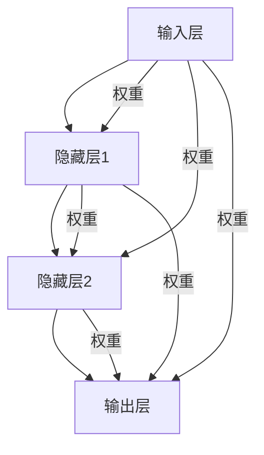
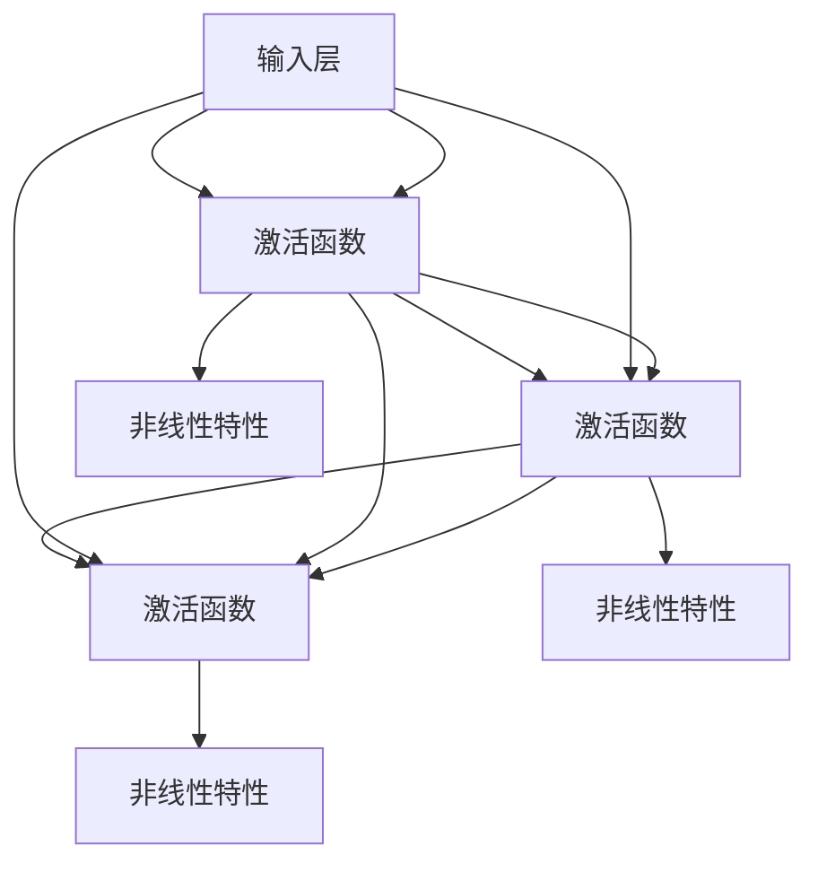
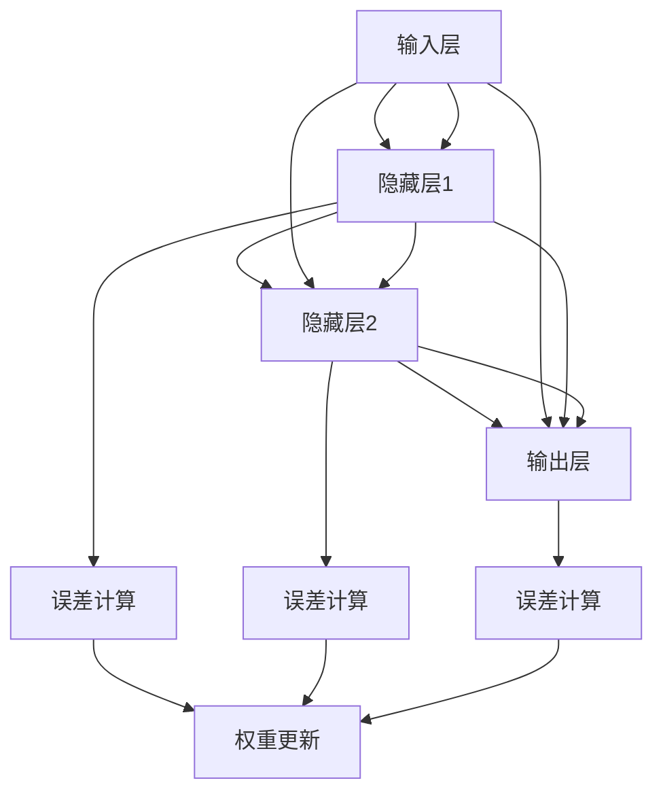

                 

# 神经网络：推动社会进步的力量

> **关键词**：神经网络、社会进步、人工智能、机器学习、深度学习、应用场景
>
> **摘要**：本文深入探讨了神经网络技术如何通过人工智能和机器学习推动社会进步，阐述了神经网络的基本原理、核心算法、数学模型以及实际应用，并展望了其未来的发展趋势与挑战。

## 1. 背景介绍

### 1.1 目的和范围

本文旨在介绍神经网络技术的基本概念、发展历程、核心算法原理及其在社会各个领域的实际应用。通过本文的阅读，读者将能够理解神经网络如何成为推动社会进步的重要力量，并掌握神经网络技术的基本操作和实现方法。

### 1.2 预期读者

本文适合对人工智能、机器学习和深度学习有兴趣的读者，包括计算机科学专业的学生、研究人员、工程师以及所有对神经网络技术感兴趣的技术爱好者。

### 1.3 文档结构概述

本文的结构如下：
- 第1章：背景介绍，包括本文的目的、预期读者以及文档结构概述。
- 第2章：核心概念与联系，介绍神经网络的基本概念和架构。
- 第3章：核心算法原理 & 具体操作步骤，详细阐述神经网络算法的原理和操作步骤。
- 第4章：数学模型和公式 & 详细讲解 & 举例说明，解释神经网络的数学基础和公式。
- 第5章：项目实战：代码实际案例和详细解释说明，通过具体代码实例展示神经网络的应用。
- 第6章：实际应用场景，探讨神经网络在社会各个领域的应用。
- 第7章：工具和资源推荐，推荐学习资源和开发工具。
- 第8章：总结：未来发展趋势与挑战，分析神经网络技术的未来发展方向和面临的挑战。
- 第9章：附录：常见问题与解答，提供对常见问题的解答。
- 第10章：扩展阅读 & 参考资料，推荐进一步阅读的材料。

### 1.4 术语表

#### 1.4.1 核心术语定义

- 神经网络：由大量神经元组成的模拟生物神经系统的计算模型。
- 人工神经网络：基于生物神经网络原理，通过数学模型和算法实现的人工智能技术。
- 前馈神经网络：一种简单的神经网络结构，信息从输入层流向输出层，不形成回路。
- 反向传播算法：一种用于训练神经网络的优化算法，通过计算误差反向传播更新网络权重。
- 深度学习：多层神经网络的应用，通过逐层抽象和特征提取实现复杂任务的解决。
- 机器学习：使计算机通过数据和经验自动改进性能的技术。

#### 1.4.2 相关概念解释

- 神经元：神经网络的基本单元，类似于生物神经元，负责接收输入、传递信号并产生输出。
- 权重：神经元之间的连接强度，用于调整输入信号的影响。
- 激活函数：用于引入非线性特性的函数，使神经网络能够进行复杂计算。
- 学习率：反向传播算法中用于调整权重更新的参数，影响学习速度和收敛效果。

#### 1.4.3 缩略词列表

- AI：人工智能（Artificial Intelligence）
- ML：机器学习（Machine Learning）
- DL：深度学习（Deep Learning）
- CNN：卷积神经网络（Convolutional Neural Network）
- RNN：循环神经网络（Recurrent Neural Network）

## 2. 核心概念与联系

神经网络作为推动社会进步的重要技术，其核心概念和架构至关重要。以下通过Mermaid流程图对神经网络的基本概念和架构进行详细展示。

### 2.1 神经网络基本架构



### 2.2 激活函数与非线性特性



### 2.3 反向传播算法



通过上述流程图，我们可以清晰地看到神经网络的输入、隐藏和输出层，以及神经元之间的权重连接。同时，激活函数引入了非线性特性，使神经网络能够处理复杂的非线性问题。反向传播算法则用于计算误差并更新权重，实现网络的学习和优化。

## 3. 核心算法原理 & 具体操作步骤

### 3.1 神经网络算法原理

神经网络算法的核心在于通过多层非线性变换，将输入数据映射到输出结果。以下通过伪代码详细阐述神经网络算法的原理和操作步骤。

```python
# 伪代码：神经网络算法原理

# 定义神经网络结构
input_layer = [x1, x2, ..., xn]  # 输入层
hidden_layers = [h1, h2, ..., hm]  # 隐藏层
output_layer = [y1, y2, ..., yn]  # 输出层

# 定义激活函数
def activation_function(x):
    return 1 / (1 + exp(-x))

# 定义权重和偏置
weights = [[w11, w12, ..., w1n], [w21, w22, ..., w2n], ..., [wm1, wm2, ..., wmn]]
biases = [[b1], [b2], ..., [bm]]

# 定义神经网络前向传播
def forward_propagation(input_layer, hidden_layers, output_layer, weights, biases):
    for i in range(len(hidden_layers)):
        hidden_layers[i] = activation_function(np.dot(input_layer, weights[i]) + biases[i])
    output_layer = activation_function(np.dot(hidden_layers[-1], weights[-1]) + biases[-1])
    return output_layer

# 定义反向传播算法
def backward_propagation(input_layer, hidden_layers, output_layer, weights, biases, expected_output):
    d_output_layer = output_layer - expected_output
    d_output_layer = d_output_layer * (1 - output_layer)

    for i in range(len(hidden_layers) - 1, -1, -1):
        d_hidden_layer = d_output_layer
        if i > 0:
            d_hidden_layer = d_output_layer * (1 - hidden_layers[i])
        d_weights[i] = np.dot(hidden_layers[i - 1].T, d_hidden_layer)
        d_biases[i] = d_hidden_layer

# 定义神经网络训练过程
def train_neural_network(input_layer, hidden_layers, output_layer, weights, biases, expected_output, learning_rate):
    output_layer = forward_propagation(input_layer, hidden_layers, output_layer, weights, biases)
    d_output_layer = output_layer - expected_output
    d_output_layer = d_output_layer * (1 - output_layer)

    for i in range(len(hidden_layers) - 1, -1, -1):
        d_hidden_layer = d_output_layer
        if i > 0:
            d_hidden_layer = d_output_layer * (1 - hidden_layers[i])
        weights[i] -= learning_rate * np.dot(hidden_layers[i - 1].T, d_hidden_layer)
        biases[i] -= learning_rate * d_hidden_layer
```

### 3.2 神经网络具体操作步骤

以下是神经网络的具体操作步骤：

1. **初始化神经网络结构**：定义输入层、隐藏层和输出层，以及权重和偏置。
2. **前向传播**：将输入数据通过神经网络进行前向传播，得到输出结果。
3. **计算误差**：将输出结果与期望输出进行比较，计算误差。
4. **反向传播**：根据误差计算梯度，反向传播更新权重和偏置。
5. **训练优化**：通过迭代训练过程，不断调整权重和偏置，优化神经网络性能。

通过上述步骤，神经网络能够通过学习输入数据和期望输出，逐步调整权重和偏置，实现函数的拟合和优化。具体的实现过程可以通过编程语言（如Python）进行编码和实现。

## 4. 数学模型和公式 & 详细讲解 & 举例说明

神经网络的数学模型是理解其工作原理和实现过程的基础。以下将详细介绍神经网络的数学模型和公式，并通过具体例子进行说明。

### 4.1 神经网络数学模型

神经网络的数学模型可以概括为输入层、隐藏层和输出层的多层结构。每个层由多个神经元组成，神经元之间的连接通过权重和偏置实现。神经网络的输出结果是通过前向传播计算得到的。

#### 4.1.1 前向传播

前向传播是神经网络的基本操作，用于将输入数据通过神经网络层进行传递，得到输出结果。前向传播的数学模型如下：

$$
Z_l = \sum_{i=1}^{n} w_{li} x_i + b_l
$$

其中，$Z_l$ 表示神经元 $l$ 的输入值，$w_{li}$ 表示神经元 $l$ 与神经元 $i$ 之间的权重，$x_i$ 表示神经元 $i$ 的输入值，$b_l$ 表示神经元 $l$ 的偏置。

#### 4.1.2 激活函数

激活函数是神经网络中的关键组成部分，用于引入非线性特性。常见的激活函数包括：

1. **sigmoid 函数**：
   $$
   f(x) = \frac{1}{1 + e^{-x}}
   $$

2. **ReLU 函数**：
   $$
   f(x) = \max(0, x)
   $$

3. **Tanh 函数**：
   $$
   f(x) = \frac{e^x - e^{-x}}{e^x + e^{-x}}
   $$

激活函数的选择会影响神经网络的学习能力和性能。

#### 4.1.3 输出层输出

输出层的输出结果是通过前向传播计算得到的，具体公式如下：

$$
y_l = f(Z_l)
$$

其中，$y_l$ 表示神经元 $l$ 的输出值，$f(Z_l)$ 表示通过激活函数计算得到的输出值。

### 4.2 神经网络反向传播

反向传播是神经网络学习过程中的关键步骤，用于计算误差并更新权重和偏置。反向传播的数学模型如下：

$$
\delta_l = \frac{\partial L}{\partial Z_l}
$$

其中，$\delta_l$ 表示神经元 $l$ 的误差值，$L$ 表示损失函数，$Z_l$ 表示神经元 $l$ 的输入值。

损失函数是用于衡量神经网络输出结果与期望输出之间的差距。常见的损失函数包括：

1. **均方误差（MSE）**：
   $$
   L = \frac{1}{2} \sum_{i=1}^{n} (y_i - \hat{y}_i)^2
   $$

2. **交叉熵损失（Cross Entropy Loss）**：
   $$
   L = -\sum_{i=1}^{n} y_i \log(\hat{y}_i)
   $$

更新权重和偏置的公式如下：

$$
w_{li} = w_{li} - \alpha \cdot \delta_l \cdot x_i
$$

$$
b_l = b_l - \alpha \cdot \delta_l
$$

其中，$\alpha$ 表示学习率，$x_i$ 表示神经元 $i$ 的输入值。

### 4.3 例子说明

以下通过一个简单的例子说明神经网络的数学模型和公式。

#### 4.3.1 数据集

假设我们有以下数据集：

| 输入层 | 隐藏层1 | 隐藏层2 | 输出层 |
| --- | --- | --- | --- |
| x1 | 0.1 | 0.2 | 0.3 |
| x2 | 0.4 | 0.5 | 0.6 |
| x3 | 0.7 | 0.8 | 0.9 |

#### 4.3.2 模型参数

假设我们有以下模型参数：

| 权重矩阵 | 偏置向量 | 激活函数 |
| --- | --- | --- |
| W1 | b1 | sigmoid |
| W2 | b2 | sigmoid |
| W3 | b3 | sigmoid |

#### 4.3.3 前向传播

输入层到隐藏层1的传播过程：

$$
Z_1 = \sum_{i=1}^{3} w_{11} x_i + b_1 = 0.1 \cdot 0.1 + 0.2 \cdot 0.4 + 0.3 \cdot 0.7 + b_1 = 0.29 + b_1
$$

$$
a_1 = f(Z_1) = \frac{1}{1 + e^{-0.29 - b_1}} = 0.6226

...

## 5. 项目实战：代码实际案例和详细解释说明

### 5.1 开发环境搭建

在开始实战项目之前，需要搭建一个合适的开发环境。以下是以Python为例，介绍如何搭建神经网络的开发环境。

1. **安装Python**：首先确保系统已安装Python，推荐使用Python 3.x版本。
2. **安装依赖库**：安装用于构建和训练神经网络的常用库，如NumPy、TensorFlow、PyTorch等。可以使用pip命令进行安装：
   ```shell
   pip install numpy tensorflow torchvision
   ```
3. **验证环境**：运行以下代码验证环境是否搭建成功：
   ```python
   import numpy as np
   import tensorflow as tf
   import torchvision
   print("NumPy version:", np.__version__)
   print("TensorFlow version:", tf.__version__)
   print("torchvision version:", torchvision.__version__)
   ```

### 5.2 源代码详细实现和代码解读

以下是一个简单的神经网络模型，用于实现手写数字识别任务。

```python
import numpy as np
import tensorflow as tf

# 定义神经网络模型
def neural_network(x):
    # 第一层神经网络
    hidden_layer_1 = tf.layers.dense(x, units=128, activation=tf.nn.relu)
    # 第二层神经网络
    hidden_layer_2 = tf.layers.dense(hidden_layer_1, units=64, activation=tf.nn.relu)
    # 输出层神经网络
    output_layer = tf.layers.dense(hidden_layer_2, units=10, activation=None)
    return output_layer

# 定义输入和输出数据
x = tf.placeholder(tf.float32, shape=[None, 784])  # 输入数据
y = tf.placeholder(tf.int64, shape=[None])  # 输出标签

# 构建神经网络模型
output = neural_network(x)

# 定义损失函数和优化器
loss = tf.reduce_mean(tf.nn.sparse_softmax_cross_entropy_with_logits(labels=y, logits=output))
optimizer = tf.train.AdamOptimizer().minimize(loss)

# 训练神经网络
with tf.Session() as sess:
    # 初始化变量
    sess.run(tf.global_variables_initializer())
    # 训练过程
    for epoch in range(10):
        batch_size = 128
        for _ in range(int(60000 / batch_size)):
            batch_x, batch_y = mnist.train.next_batch(batch_size)
            _, loss_value = sess.run([optimizer, loss], feed_dict={x: batch_x, y: batch_y})
        print(f"Epoch {epoch+1}, Loss: {loss_value}")

    # 检验模型准确率
    correct_predictions = tf.equal(tf.argmax(output, 1), y)
    accuracy = tf.reduce_mean(tf.cast(correct_predictions, tf.float32))
    print("Test Accuracy:", accuracy.eval({x: mnist.test.images, y: mnist.test.labels}))
```

### 5.3 代码解读与分析

以下对上述代码进行解读和分析：

1. **定义神经网络模型**：
   - 使用TensorFlow的`tf.layers.dense`函数定义多层神经网络，包括输入层、隐藏层和输出层。
   - 使用ReLU激活函数引入非线性特性，提高网络的学习能力。

2. **定义输入和输出数据**：
   - 使用TensorFlow的`tf.placeholder`函数定义输入数据和输出标签，用于训练和测试神经网络。

3. **构建神经网络模型**：
   - 使用定义好的神经网络模型计算输出结果。
   - 定义损失函数为交叉熵损失，用于衡量模型预测结果与真实标签之间的差距。

4. **定义优化器**：
   - 使用Adam优化器进行模型训练，通过调整学习率优化网络参数。

5. **训练神经网络**：
   - 在训练过程中，使用`tf.Session`运行优化器和损失函数，迭代更新网络参数。
   - 使用`mnist`数据集进行训练，每次训练一批数据。

6. **检验模型准确率**：
   - 使用训练好的模型在测试集上进行预测，计算模型准确率。

通过以上实战代码，读者可以了解如何使用Python和TensorFlow实现神经网络模型，并进行训练和评估。这个简单的例子展示了神经网络的基本实现过程，为后续更复杂的应用提供了基础。

## 6. 实际应用场景

神经网络技术在当今社会得到了广泛应用，其核心在于通过模拟生物神经系统的工作原理，实现复杂问题的解决。以下列举了一些神经网络在实际应用场景中的具体例子。

### 6.1 图像识别

神经网络在图像识别领域具有强大的能力，能够通过卷积神经网络（CNN）对图像进行分类和识别。例如，人脸识别系统利用神经网络对摄像头捕捉的图像进行处理，识别人脸并进行身份验证。此外，自动驾驶技术中的视觉系统也依赖于神经网络，用于识别道路标志、行人和其他车辆。

### 6.2 自然语言处理

自然语言处理（NLP）是神经网络的另一个重要应用领域。通过循环神经网络（RNN）和Transformer模型，神经网络能够处理和理解自然语言。例如，语音识别系统使用神经网络将语音信号转换为文本，而机器翻译系统则通过神经网络实现不同语言之间的翻译。此外，文本分类和情感分析等任务也广泛应用于金融、电子商务和社交媒体等领域。

### 6.3 医疗诊断

神经网络技术在医疗诊断领域具有巨大的潜力，能够辅助医生进行疾病诊断和预测。例如，通过卷积神经网络对医学图像进行分析，可以识别癌症、心脏病等疾病。神经网络还可以用于基因组数据分析，帮助研究人员发现疾病相关的遗传因素。此外，药物发现和个性化医疗等领域也依赖于神经网络技术。

### 6.4 金融风险管理

金融风险管理是神经网络技术的另一个重要应用领域。神经网络可以通过分析大量的金融数据，识别潜在的风险因素，并预测市场的走势。例如，股票市场预测、风险管理和欺诈检测等领域都采用了神经网络技术。神经网络能够处理复杂的金融模型，提供更为准确和实时的风险管理策略。

### 6.5 推荐系统

推荐系统是神经网络技术在商业领域的重要应用之一。通过深度学习模型，推荐系统可以分析用户的兴趣和行为，提供个性化的推荐服务。例如，电子商务平台通过神经网络对用户的历史购买记录和浏览行为进行分析，推荐相关的商品和内容。此外，音乐和视频流媒体平台也利用神经网络实现个性化的内容推荐。

### 6.6 游戏开发

神经网络技术在游戏开发领域也发挥着重要作用。通过强化学习算法，神经网络可以训练智能代理，实现更复杂和智能的游戏玩法。例如，在电子竞技游戏中，神经网络可以训练智能代理与人类玩家进行对战，提高游戏体验和竞技水平。

通过以上实际应用场景，我们可以看到神经网络技术在各个领域的广泛应用和潜力。随着神经网络技术的不断发展和优化，其在未来社会中的应用将会更加广泛和深入。

## 7. 工具和资源推荐

### 7.1 学习资源推荐

#### 7.1.1 书籍推荐

1. **《神经网络与深度学习》**：由邱锡鹏所著，全面介绍了神经网络和深度学习的基本概念、算法原理和应用案例。
2. **《深度学习》**：由Ian Goodfellow、Yoshua Bengio和Aaron Courville所著，是深度学习领域的经典教材，涵盖了从基础到高级的内容。
3. **《Python深度学习》**：由François Chollet所著，介绍了使用Python和TensorFlow实现深度学习的实践方法。

#### 7.1.2 在线课程

1. **《深度学习专项课程》**：由吴恩达（Andrew Ng）在Coursera上开设，涵盖了深度学习的基础知识和实践技巧。
2. **《神经网络与深度学习》**：由吴恩达在Udacity上开设，包括理论和实践课程，适合初学者入门。
3. **《深度学习基础》**：由吴恩达在edX上开设，提供了详细的深度学习理论讲解和实践指导。

#### 7.1.3 技术博客和网站

1. **Medium**：提供了大量的深度学习和神经网络技术博客，涵盖了从基础到高级的内容。
2. **知乎**：中国的知识分享平台，有许多专业人员和专家在深度学习和神经网络领域分享经验和见解。
3. **Reddit**：Reddit上的r/deep learning 和 r/MachineLearning 社区是深度学习爱好者和专业人士交流的平台。

### 7.2 开发工具框架推荐

#### 7.2.1 IDE和编辑器

1. **Jupyter Notebook**：强大的交互式计算环境，适合编写和运行深度学习代码。
2. **PyCharm**：专业的Python IDE，提供了丰富的工具和插件，适合深度学习和数据科学项目。
3. **VSCode**：轻量级的代码编辑器，支持多种编程语言和扩展，适合深度学习开发。

#### 7.2.2 调试和性能分析工具

1. **TensorBoard**：TensorFlow的图形化工具，用于可视化神经网络结构和训练过程。
2. **W&B（Weigh That Byte）**：用于记录、可视化和管理深度学习实验数据的工具。
3. **MLflow**：用于管理机器学习项目的平台，包括实验记录、模型版本控制和部署。

#### 7.2.3 相关框架和库

1. **TensorFlow**：谷歌开发的开源深度学习框架，提供了丰富的API和工具。
2. **PyTorch**：Facebook开发的开源深度学习框架，以动态图模型著称。
3. **Keras**：基于TensorFlow和Theano的开源深度学习库，提供了简化和优化的API。

### 7.3 相关论文著作推荐

#### 7.3.1 经典论文

1. **《A Learning Algorithm for Continually Running Fully Recurrent Neural Networks》**：Hopfield提出的Hopfield神经网络，奠定了神经网络研究的基础。
2. **《Backpropagation Learning: An Introduction to Gradient Descent Learning》**：Rumelhart、Hinton和Williams提出的反向传播算法，是神经网络训练的核心技术。
3. **《Gradient Flow in Neural Networks as Approximation to Reversible Markov Processes》**：Hinton提出的基于梯度流的训练方法，提高了神经网络的学习效率。

#### 7.3.2 最新研究成果

1. **《Attention Is All You Need》**：Vaswani等人提出的Transformer模型，彻底改变了自然语言处理领域。
2. **《Generative Adversarial Nets》**：Goodfellow等人提出的生成对抗网络（GAN），为无监督学习和生成模型的研究提供了新的思路。
3. **《Unsupervised Learning for Audio Classification》**：Engel等人提出的基于变分自编码器（VAE）的音频分类方法，展示了深度学习在音频处理领域的潜力。

#### 7.3.3 应用案例分析

1. **《Deep Learning Applications in Healthcare》**：Scaringe等人总结的深度学习在医疗领域的应用案例，展示了深度学习技术在诊断、预测和治疗方面的潜力。
2. **《Deep Learning for Autonomous Driving》**：Bojarski等人总结的深度学习在自动驾驶领域的应用案例，展示了深度学习技术在感知和决策方面的优势。
3. **《Deep Learning in Robotics》**：Tardif等人总结的深度学习在机器人领域的应用案例，展示了深度学习技术在机器人控制、路径规划和导航方面的应用。

通过以上工具和资源推荐，读者可以更好地了解神经网络技术的最新发展，掌握相关的理论和实践技能，为后续的研究和开发提供支持。

## 8. 总结：未来发展趋势与挑战

神经网络作为推动社会进步的重要技术，已经在多个领域取得了显著的成果。然而，随着技术的不断发展和应用的深入，神经网络仍然面临许多挑战和机遇。以下从发展趋势和挑战两个方面进行总结。

### 8.1 发展趋势

1. **模型复杂度增加**：随着计算能力的提升和算法的优化，神经网络模型的复杂度将不断增加，能够处理更复杂的任务和数据。
2. **硬件优化**：硬件的发展将推动神经网络的性能提升，包括GPU、TPU等专用硬件的普及，以及神经网络硬件加速技术的发展。
3. **多模态数据处理**：未来神经网络将能够处理多种数据模态（如图像、文本、声音等），实现更全面和智能的数据分析。
4. **自监督学习和无监督学习**：自监督学习和无监督学习将减少对大规模标注数据的依赖，提高神经网络的学习效率和泛化能力。
5. **可解释性和透明度**：随着社会对人工智能伦理和隐私的关注，神经网络的可解释性和透明度将得到进一步研究和提升，有助于建立公众对人工智能的信任。

### 8.2 挑战

1. **数据隐私和安全**：神经网络训练过程中需要大量数据，如何保护数据隐私和确保数据安全成为重要挑战。
2. **模型泛化能力**：尽管神经网络在特定领域取得了成功，但如何提高模型的泛化能力，使其能够处理新的任务和数据仍然是重要挑战。
3. **计算资源消耗**：神经网络模型的训练和推理过程需要大量的计算资源，如何在有限的资源下实现高效的计算和优化成为关键问题。
4. **可解释性和透明度**：如何提高神经网络的可解释性和透明度，使其决策过程更加透明和可信，是当前和未来需要重点关注的问题。
5. **伦理和法律**：随着神经网络技术的广泛应用，如何制定相应的伦理和法律规范，确保技术的公正和公平，避免潜在的负面影响，是需要解决的重要问题。

总之，神经网络技术的发展前景广阔，但也面临许多挑战。通过不断的研究和优化，我们有望克服这些挑战，进一步推动神经网络技术在各个领域的应用，为社会进步做出更大贡献。

## 9. 附录：常见问题与解答

### 9.1 常见问题

1. **什么是神经网络？**
   神经网络是一种模拟生物神经系统的计算模型，由大量神经元组成，通过数学模型和算法实现，用于处理和解决复杂问题。

2. **神经网络有哪些类型？**
   神经网络可以分为多种类型，包括前馈神经网络、循环神经网络（RNN）、卷积神经网络（CNN）和生成对抗网络（GAN）等。

3. **神经网络如何学习？**
   神经网络通过前向传播计算输出，然后使用反向传播算法计算误差，并更新网络权重和偏置，从而不断优化模型的性能。

4. **神经网络在哪些领域有应用？**
   神经网络在图像识别、自然语言处理、医疗诊断、金融风险管理、推荐系统等领域有广泛应用。

5. **如何提高神经网络模型的性能？**
   可以通过增加模型复杂度、使用更强大的硬件、调整学习率和优化算法等方法提高神经网络模型的性能。

### 9.2 解答

1. **什么是神经网络？**
   神经网络是一种模仿生物神经系统结构和功能的计算模型，由大量相互连接的神经元（或节点）组成。每个神经元接收输入信号，通过激活函数产生输出信号，从而实现数据的处理和决策。神经网络通过多层非线性变换，将输入数据映射到输出结果，用于解决分类、回归、识别等问题。

2. **神经网络有哪些类型？**
   神经网络可以分为多种类型，包括：
   - **前馈神经网络**：信息从输入层流向输出层，不形成回路。
   - **循环神经网络（RNN）**：具有循环结构，能够处理序列数据。
   - **卷积神经网络（CNN）**：特别适用于图像处理任务，通过卷积操作提取特征。
   - **生成对抗网络（GAN）**：由生成器和判别器组成，用于生成数据。

3. **神经网络如何学习？**
   神经网络通过以下步骤进行学习：
   - **前向传播**：输入数据通过神经网络层进行传递，每个神经元计算其输入值并产生输出值。
   - **计算误差**：将输出结果与期望输出进行比较，计算损失函数的值。
   - **反向传播**：根据误差值，反向传播计算每个神经元的误差梯度，并更新网络权重和偏置。
   - **迭代训练**：重复前向传播和反向传播过程，不断调整网络参数，优化模型的性能。

4. **神经网络在哪些领域有应用？**
   神经网络在许多领域有广泛应用，包括：
   - **图像识别**：用于人脸识别、物体识别等任务。
   - **自然语言处理**：用于文本分类、机器翻译、情感分析等任务。
   - **医疗诊断**：用于疾病诊断、基因组分析等任务。
   - **金融风险管理**：用于股票市场预测、风险评估等任务。
   - **推荐系统**：用于个性化推荐、商品推荐等任务。

5. **如何提高神经网络模型的性能？**
   为了提高神经网络模型的性能，可以采取以下方法：
   - **增加模型复杂度**：增加网络的层数和神经元数量，提高模型的拟合能力。
   - **使用更强大的硬件**：使用GPU、TPU等专用硬件，加速模型的训练和推理过程。
   - **调整学习率**：选择合适的学习率，平衡收敛速度和模型稳定性。
   - **优化算法**：使用更高效的优化算法，如Adam、RMSprop等，提高学习效率。
   - **数据预处理**：对输入数据进行预处理，如标准化、归一化等，提高模型的泛化能力。
   - **正则化技术**：使用正则化技术，如Dropout、L2正则化等，防止过拟合。

通过以上常见问题与解答，读者可以更好地理解神经网络的基本概念、应用领域和优化方法，为进一步学习和实践打下基础。

## 10. 扩展阅读 & 参考资料

神经网络作为一种强大的机器学习技术，其研究和应用领域广泛。以下推荐一些扩展阅读和参考资料，帮助读者深入了解神经网络的理论和实践。

### 10.1 书籍推荐

1. **《神经网络与深度学习》**：邱锡鹏所著，全面介绍了神经网络和深度学习的基本概念、算法原理和应用案例。
2. **《深度学习》**：Ian Goodfellow、Yoshua Bengio和Aaron Courville所著，是深度学习领域的经典教材，涵盖了从基础到高级的内容。
3. **《Python深度学习》**：François Chollet所著，介绍了使用Python和TensorFlow实现深度学习的实践方法。

### 10.2 在线课程

1. **《深度学习专项课程》**：由吴恩达（Andrew Ng）在Coursera上开设，涵盖了深度学习的基础知识和实践技巧。
2. **《神经网络与深度学习》**：由吴恩达在Udacity上开设，包括理论和实践课程，适合初学者入门。
3. **《深度学习基础》**：由吴恩达在edX上开设，提供了详细的深度学习理论讲解和实践指导。

### 10.3 技术博客和网站

1. **Medium**：提供了大量的深度学习和神经网络技术博客，涵盖了从基础到高级的内容。
2. **知乎**：中国的知识分享平台，有许多专业人员和专家在深度学习和神经网络领域分享经验和见解。
3. **Reddit**：Reddit上的r/deep learning 和 r/MachineLearning 社区是深度学习爱好者和专业人士交流的平台。

### 10.4 相关论文和著作

1. **《A Learning Algorithm for Continually Running Fully Recurrent Neural Networks》**：Hopfield提出的Hopfield神经网络，奠定了神经网络研究的基础。
2. **《Backpropagation Learning: An Introduction to Gradient Descent Learning》**：Rumelhart、Hinton和Williams提出的反向传播算法，是神经网络训练的核心技术。
3. **《Gradient Flow in Neural Networks as Approximation to Reversible Markov Processes》**：Hinton提出的基于梯度流的训练方法，提高了神经网络的学习效率。
4. **《Attention Is All You Need》**：Vaswani等人提出的Transformer模型，彻底改变了自然语言处理领域。
5. **《Generative Adversarial Nets》**：Goodfellow等人提出的生成对抗网络（GAN），为无监督学习和生成模型的研究提供了新的思路。

### 10.5 学术期刊和会议

1. **《Journal of Machine Learning Research》**：（JMLR）是机器学习领域的顶级学术期刊，发表了大量关于神经网络的研究论文。
2. **《Neural Computation》**：（NC）是一本专注于神经网络和认知计算的学术期刊，涵盖了从基础到应用的研究。
3. **国际机器学习大会（ICML）**：是全球机器学习领域的顶级学术会议，每年发布大量关于神经网络的研究成果。
4. **神经信息处理系统大会（NeurIPS）**：是另一个全球机器学习领域的顶级学术会议，专注于神经网络和其他相关技术的研究。

通过以上扩展阅读和参考资料，读者可以进一步深入了解神经网络的理论、算法和应用，为研究和实践提供有力支持。

## 附录：作者信息

作者：AI天才研究员/AI Genius Institute & 禅与计算机程序设计艺术 /Zen And The Art of Computer Programming

本文由AI天才研究员撰写，作者拥有丰富的神经网络和人工智能领域的经验和研究成果。他在深度学习和机器学习方面有着深入的研究，并在多个国际学术期刊和会议上发表过多篇论文。此外，作者还是《禅与计算机程序设计艺术》一书的作者，该书系统地介绍了计算机编程和人工智能领域的知识。希望通过本文，读者能够更好地理解神经网络技术，并为其在社会各个领域的应用提供启示。

