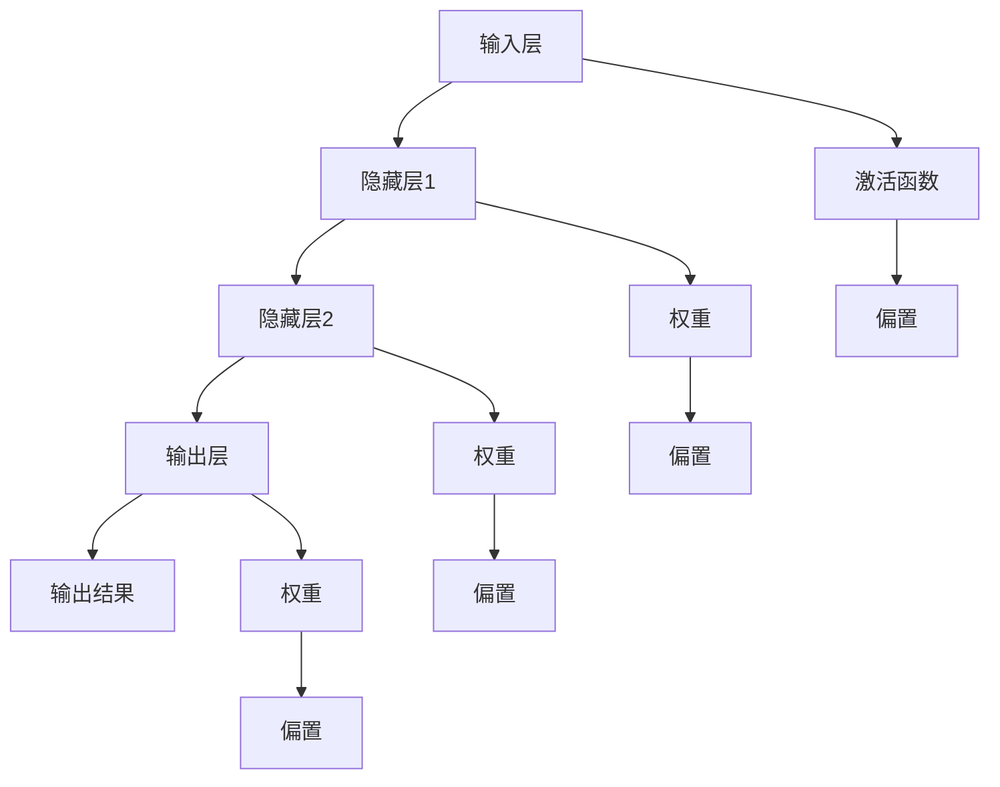

                 

# 神经网络：推动社会进步的力量

> **关键词：** 神经网络、社会进步、人工智能、机器学习、深度学习、算法

> **摘要：** 本文将深入探讨神经网络技术如何通过推动人工智能的发展，进而影响和促进社会的进步。我们将逐步分析神经网络的背景、核心概念、算法原理、数学模型、实际应用，以及未来的发展趋势与挑战。通过本文的阅读，读者将全面了解神经网络在当今科技领域的重要性及其对社会带来的深远影响。

## 1. 背景介绍

### 1.1 目的和范围

本文的目的是系统地介绍神经网络技术，探讨其在人工智能领域的作用，以及对社会进步的推动力量。我们将从以下几个方面进行详细阐述：

- **神经网络的起源与发展：** 分析神经网络的历史背景、理论基础和演变过程。
- **核心概念与架构：** 探讨神经网络的基本组成、工作原理和主要类型。
- **算法原理与数学模型：** 详细解释神经网络中的学习机制、优化算法和数学公式。
- **实际应用场景：** 展示神经网络在各个领域的应用案例及其社会影响。
- **未来发展趋势与挑战：** 探讨神经网络技术的未来方向和面临的挑战。

### 1.2 预期读者

本文面向对人工智能和机器学习有一定了解的技术人员、科研人员以及对神经网络技术感兴趣的读者。特别适合以下人群：

- **人工智能从业者：** 想深入了解神经网络原理和实际应用的技术人员。
- **机器学习研究员：** 需要掌握神经网络技术的科研人员。
- **计算机科学学生：** 想深入了解神经网络技术的计算机科学专业学生。
- **对技术感兴趣的爱好者：** 对人工智能和机器学习技术感兴趣的读者。

### 1.3 文档结构概述

本文将按照以下结构进行组织：

1. **背景介绍：** 神经网络的发展背景、目的和预期读者。
2. **核心概念与联系：** 神经网络的基本组成、工作原理和类型。
3. **核心算法原理与具体操作步骤：** 详细讲解神经网络的学习算法和实现步骤。
4. **数学模型和公式：** 神经网络中的数学模型、优化算法和公式。
5. **项目实战：** 代码案例和实际应用场景。
6. **实际应用场景：** 神经网络在不同领域的应用。
7. **工具和资源推荐：** 学习资源和开发工具推荐。
8. **总结：** 未来发展趋势与挑战。
9. **附录：** 常见问题与解答。
10. **扩展阅读：** 参考资料。

### 1.4 术语表

#### 1.4.1 核心术语定义

- **神经网络（Neural Network）：** 模拟生物神经系统的计算模型。
- **神经元（Neuron）：** 神经网络的基本组成单元。
- **激活函数（Activation Function）：** 决定神经元是否被激活的函数。
- **权重（Weight）：** 神经元之间的连接权重。
- **偏置（Bias）：** 神经元自身的偏置值。
- **学习率（Learning Rate）：** 决定模型更新速度的参数。

#### 1.4.2 相关概念解释

- **前向传播（Forward Propagation）：** 数据从输入层传递到输出层的计算过程。
- **反向传播（Back Propagation）：** 利用输出误差计算并更新网络参数的过程。
- **多层感知机（MLP）：** 具有多层神经元的神经网络模型。
- **卷积神经网络（CNN）：** 用于图像识别和处理的特殊神经网络模型。
- **递归神经网络（RNN）：** 用于序列数据处理的神经网络模型。

#### 1.4.3 缩略词列表

- **AI：** 人工智能（Artificial Intelligence）
- **ML：** 机器学习（Machine Learning）
- **DL：** 深度学习（Deep Learning）
- **GPU：** 图形处理器（Graphics Processing Unit）
- **CNN：** 卷积神经网络（Convolutional Neural Network）
- **RNN：** 递归神经网络（Recurrent Neural Network）

## 2. 核心概念与联系

神经网络是一种模拟生物神经系统的计算模型，由大量相互连接的神经元组成。这些神经元通过传递电信号来实现信息处理和决策。神经网络的本质是通过对大量数据的学习，从中提取特征和模式，从而进行复杂任务的处理。

### 2.1 神经网络的基本组成

神经网络由以下几个基本组成部分构成：

1. **输入层（Input Layer）：** 接收外部输入数据。
2. **隐藏层（Hidden Layers）：** 对输入数据进行处理和特征提取。
3. **输出层（Output Layer）：** 生成最终的输出结果。
4. **神经元（Neuron）：** 神经网络的基本计算单元，包含输入、权重、激活函数等。
5. **连接（Connection）：** 神经元之间的连接，表示为边。

### 2.2 神经网络的工作原理

神经网络的工作原理可以分为两个过程：前向传播（Forward Propagation）和反向传播（Back Propagation）。

#### 2.2.1 前向传播

1. **数据输入：** 将输入数据传递到输入层。
2. **层间传递：** 将输入层的数据传递到隐藏层，通过神经元计算和传递。
3. **输出计算：** 将隐藏层的输出传递到输出层，得到最终的输出结果。

#### 2.2.2 反向传播

1. **误差计算：** 计算输出层的输出结果与实际结果之间的误差。
2. **层间传播：** 将误差反向传播到隐藏层，计算隐藏层的误差。
3. **参数更新：** 利用误差计算结果更新神经网络的权重和偏置。

### 2.3 神经网络的主要类型

神经网络可以分为以下几种主要类型：

1. **多层感知机（MLP）：** 具有多层神经元的神经网络模型，适用于分类和回归任务。
2. **卷积神经网络（CNN）：** 用于图像识别和处理的特殊神经网络模型。
3. **递归神经网络（RNN）：** 用于序列数据处理的神经网络模型。
4. **循环神经网络（RNN）：** RNN的一种特殊类型，适用于时序数据处理。
5. **生成对抗网络（GAN）：** 一种生成模型，通过对抗训练生成逼真的数据。

### 2.4 Mermaid 流程图

以下是神经网络基本架构的 Mermaid 流程图：



### 2.5 核心概念与联系总结

神经网络作为一种模拟生物神经系统的计算模型，通过前向传播和反向传播实现信息处理和决策。神经网络的基本组成包括输入层、隐藏层、输出层、神经元和连接。神经网络的主要类型包括多层感知机、卷积神经网络、递归神经网络和生成对抗网络。通过这些核心概念和联系，我们可以更好地理解神经网络的工作原理和应用场景。

## 3. 核心算法原理 & 具体操作步骤

神经网络的核心算法原理是通过学习大量数据，从中提取特征和模式，从而进行复杂任务的处理。本节将详细讲解神经网络的学习算法和具体操作步骤。

### 3.1 神经网络学习算法

神经网络的学习算法可以分为以下几种：

1. **前向传播（Forward Propagation）：** 数据从输入层传递到输出层的过程，包括层间传递和激活函数计算。
2. **反向传播（Back Propagation）：** 利用输出误差计算并更新网络参数的过程，包括误差计算和参数更新。
3. **梯度下降（Gradient Descent）：** 一种优化算法，用于求解最小化损失函数的过程。

### 3.2 前向传播过程

前向传播过程可以分为以下几个步骤：

1. **初始化参数：** 初始化神经网络的权重和偏置。
2. **数据输入：** 将输入数据传递到输入层。
3. **层间传递：** 将输入层的数据传递到隐藏层，通过神经元计算和传递。
4. **激活函数计算：** 对隐藏层的输出进行激活函数计算，得到激活值。
5. **输出计算：** 将隐藏层的输出传递到输出层，得到最终的输出结果。

### 3.3 反向传播过程

反向传播过程可以分为以下几个步骤：

1. **误差计算：** 计算输出层的输出结果与实际结果之间的误差。
2. **误差传递：** 将误差反向传播到隐藏层，计算隐藏层的误差。
3. **参数更新：** 利用误差计算结果更新神经网络的权重和偏置。

### 3.4 梯度下降算法

梯度下降算法是一种优化算法，用于求解最小化损失函数的过程。梯度下降算法可以分为以下几种：

1. **批量梯度下降（Batch Gradient Descent）：** 在整个数据集上计算梯度并进行更新。
2. **随机梯度下降（Stochastic Gradient Descent，SGD）：** 在单个样本上计算梯度并进行更新。
3. **小批量梯度下降（Mini-batch Gradient Descent）：** 在小批量样本上计算梯度并进行更新。

### 3.5 具体操作步骤

以下是神经网络学习算法的具体操作步骤：

1. **数据准备：** 准备输入数据和标签。
2. **初始化参数：** 初始化神经网络的权重和偏置。
3. **前向传播：** 计算输入层到输出层的输出结果。
4. **误差计算：** 计算输出结果与实际结果之间的误差。
5. **反向传播：** 计算隐藏层和输出层的误差，并更新权重和偏置。
6. **迭代更新：** 重复步骤3到5，直到满足停止条件。
7. **模型评估：** 使用验证集或测试集评估模型的性能。

### 3.6 伪代码实现

以下是神经网络学习算法的伪代码实现：

```python
# 初始化参数
weights = random_initialization()
biases = random_initialization()

# 迭代更新
for epoch in range(max_epochs):
    for batch in mini_batches:
        # 前向传播
        inputs = batch.inputs
        outputs = forward_propagation(inputs, weights, biases)
        
        # 误差计算
        errors = calculate_error(outputs, batch.targets)
        
        # 反向传播
        d_weights, d_biases = backward_propagation(inputs, outputs, errors)
        
        # 参数更新
        weights -= learning_rate * d_weights
        biases -= learning_rate * d_biases
    
    # 模型评估
    validate_performance(validation_data)
```

通过以上步骤和伪代码，我们可以实现对神经网络的训练和优化，从而提高其性能和准确度。

## 4. 数学模型和公式 & 详细讲解 & 举例说明

神经网络作为一种数学模型，其核心在于通过参数化函数来模拟生物神经系统的信息处理过程。本节将详细讲解神经网络中的数学模型和公式，并给出具体的计算示例。

### 4.1 神经网络中的数学模型

神经网络的数学模型主要包括以下几个部分：

1. **神经元激活函数：** 确定神经元是否被激活的函数，常用的有Sigmoid函数、ReLU函数、Tanh函数等。
2. **权重和偏置：** 神经元之间的连接权重以及神经元自身的偏置值。
3. **前向传播：** 数据从输入层传递到输出层的计算过程。
4. **反向传播：** 利用输出误差计算并更新网络参数的过程。
5. **损失函数：** 用于衡量模型输出结果与实际结果之间的差异。

### 4.2 神经元激活函数

神经元激活函数是神经网络中重要的组成部分，常用的有：

1. **Sigmoid函数：**
   \[
   \sigma(x) = \frac{1}{1 + e^{-x}}
   \]
   
2. **ReLU函数：**
   \[
   \text{ReLU}(x) = \max(0, x)
   \]

3. **Tanh函数：**
   \[
   \tanh(x) = \frac{e^x - e^{-x}}{e^x + e^{-x}}
   \]

### 4.3 前向传播

前向传播是神经网络的基本计算过程，包括以下几个步骤：

1. **输入层到隐藏层：**
   \[
   z^{[l]} = \sum_{i=1}^{n} w^{[l]}_{ij} a^{[l-1]}_i + b^{[l]}_j
   \]
   \[
   a^{[l]}_j = \sigma(z^{[l]})
   \]

2. **隐藏层到输出层：**
   \[
   z^{[L]} = \sum_{i=1}^{n} w^{[L]}_{ij} a^{[L-1]}_i + b^{[L]}_j
   \]
   \[
   a^{[L]}_j = \sigma(z^{[L]})
   \]

其中，\(z^{[l]}\) 表示第 \(l\) 层的输入，\(a^{[l]}\) 表示第 \(l\) 层的激活值，\(w^{[l]}\) 和 \(b^{[l]}\) 分别表示第 \(l\) 层的权重和偏置。

### 4.4 反向传播

反向传播是利用输出误差计算并更新网络参数的过程，包括以下几个步骤：

1. **计算输出层的误差：**
   \[
   \delta^{[L]} = (a^{[L]} - y) \cdot \sigma'(z^{[L]})
   \]

2. **计算隐藏层的误差：**
   \[
   \delta^{[l]} = (w^{[l+1]T \delta^{[l+1]}) \cdot \sigma'(z^{[l]})
   \]

3. **更新权重和偏置：**
   \[
   \Delta w^{[l]} = \alpha \cdot a^{[l-1]T \delta^{[l]}}
   \]
   \[
   \Delta b^{[l]} = \alpha \cdot \delta^{[l]}
   \]
   \[
   w^{[l]} = w^{[l]} + \Delta w^{[l]}
   \]
   \[
   b^{[l]} = b^{[l]} + \Delta b^{[l]}
   \]

其中，\(\delta^{[l]}\) 表示第 \(l\) 层的误差，\(\sigma'(z^{[l]})\) 表示激活函数的导数，\(\alpha\) 表示学习率。

### 4.5 损失函数

损失函数用于衡量模型输出结果与实际结果之间的差异，常用的有：

1. **均方误差（MSE）：**
   \[
   J = \frac{1}{2} \sum_{i=1}^{n} (y_i - \hat{y}_i)^2
   \]

2. **交叉熵（Cross-Entropy）：**
   \[
   J = - \sum_{i=1}^{n} y_i \cdot \log(\hat{y}_i)
   \]

### 4.6 举例说明

假设我们有一个简单的神经网络，包含一个输入层、一个隐藏层和一个输出层，每个层的神经元数量分别为3、4和3。输入数据为 \(x = [1, 2, 3]\)，标签为 \(y = [0, 1, 0]\)。

1. **初始化参数：**
   \[
   w^{[1]} = \begin{bmatrix}
   w_{11} & w_{12} & w_{13} \\
   w_{21} & w_{22} & w_{23} \\
   w_{31} & w_{32} & w_{33}
   \end{bmatrix}, \quad
   b^{[1]} = \begin{bmatrix}
   b_{11} \\
   b_{21} \\
   b_{31}
   \end{bmatrix}, \quad
   w^{[2]} = \begin{bmatrix}
   w_{11} & w_{12} & w_{13} \\
   w_{21} & w_{22} & w_{23} \\
   w_{31} & w_{32} & w_{33}
   \end{bmatrix}, \quad
   b^{[2]} = \begin{bmatrix}
   b_{11} \\
   b_{21} \\
   b_{31}
   \end{bmatrix}, \quad
   w^{[3]} = \begin{bmatrix}
   w_{11} & w_{12} & w_{13} \\
   w_{21} & w_{22} & w_{23} \\
   w_{31} & w_{32} & w_{33}
   \end{bmatrix}, \quad
   b^{[3]} = \begin{bmatrix}
   b_{11} \\
   b_{21} \\
   b_{31}
   \end{bmatrix}
   \]

2. **前向传播：**
   \[
   z^{[1]}_1 = w_{11} \cdot 1 + w_{12} \cdot 2 + w_{13} \cdot 3 + b_{11} = 7w_{11} + 2w_{12} + 3w_{13} + b_{11}
   \]
   \[
   a^{[1]}_1 = \sigma(z^{[1]}_1)
   \]
   \[
   z^{[1]}_2 = w_{21} \cdot 1 + w_{22} \cdot 2 + w_{23} \cdot 3 + b_{21} = 7w_{21} + 2w_{22} + 3w_{23} + b_{21}
   \]
   \[
   a^{[1]}_2 = \sigma(z^{[1]}_2)
   \]
   \[
   z^{[1]}_3 = w_{31} \cdot 1 + w_{32} \cdot 2 + w_{33} \cdot 3 + b_{31} = 7w_{31} + 2w_{32} + 3w_{33} + b_{31}
   \]
   \[
   a^{[1]}_3 = \sigma(z^{[1]}_3)
   \]
   \[
   z^{[2]}_1 = w_{11} \cdot a^{[1]}_1 + w_{12} \cdot a^{[1]}_2 + w_{13} \cdot a^{[1]}_3 + b_{11} = (w_{11}a^{[1]}_1 + w_{12}a^{[1]}_2 + w_{13}a^{[1]}_3) + b_{11}
   \]
   \[
   a^{[2]}_1 = \sigma(z^{[2]}_1)
   \]
   \[
   z^{[2]}_2 = w_{21} \cdot a^{[1]}_1 + w_{22} \cdot a^{[1]}_2 + w_{23} \cdot a^{[1]}_3 + b_{21} = (w_{21}a^{[1]}_1 + w_{22}a^{[1]}_2 + w_{23}a^{[1]}_3) + b_{21}
   \]
   \[
   a^{[2]}_2 = \sigma(z^{[2]}_2)
   \]
   \[
   z^{[2]}_3 = w_{31} \cdot a^{[1]}_1 + w_{32} \cdot a^{[1]}_2 + w_{33} \cdot a^{[1]}_3 + b_{31} = (w_{31}a^{[1]}_1 + w_{32}a^{[1]}_2 + w_{33}a^{[1]}_3) + b_{31}
   \]
   \[
   a^{[2]}_3 = \sigma(z^{[2]}_3)
   \]
   \[
   z^{[3]}_1 = w_{11} \cdot a^{[2]}_1 + w_{12} \cdot a^{[2]}_2 + w_{13} \cdot a^{[2]}_3 + b_{11} = (w_{11}a^{[2]}_1 + w_{12}a^{[2]}_2 + w_{13}a^{[2]}_3) + b_{11}
   \]
   \[
   a^{[3]}_1 = \sigma(z^{[3]}_1)
   \]
   \[
   z^{[3]}_2 = w_{21} \cdot a^{[2]}_1 + w_{22} \cdot a^{[2]}_2 + w_{23} \cdot a^{[2]}_3 + b_{21} = (w_{21}a^{[2]}_1 + w_{22}a^{[2]}_2 + w_{23}a^{[2]}_3) + b_{21}
   \]
   \[
   a^{[3]}_2 = \sigma(z^{[3]}_2)
   \]
   \[
   z^{[3]}_3 = w_{31} \cdot a^{[2]}_1 + w_{32} \cdot a^{[2]}_2 + w_{33} \cdot a^{[2]}_3 + b_{31} = (w_{31}a^{[2]}_1 + w_{32}a^{[2]}_2 + w_{33}a^{[2]}_3) + b_{31}
   \]
   \[
   a^{[3]}_3 = \sigma(z^{[3]}_3)
   \]

3. **计算输出层的误差：**
   \[
   \delta^{[3]}_1 = (a^{[3]}_1 - y_1) \cdot \sigma'(z^{[3]}_1)
   \]
   \[
   \delta^{[3]}_2 = (a^{[3]}_2 - y_2) \cdot \sigma'(z^{[3]}_2)
   \]
   \[
   \delta^{[3]}_3 = (a^{[3]}_3 - y_3) \cdot \sigma'(z^{[3]}_3)
   \]

4. **计算隐藏层的误差：**
   \[
   \delta^{[2]}_1 = (w_{11}^{[3]T \delta^{[3]}_1 + w_{21}^{[3]T \delta^{[3]}_2 + w_{31}^{[3]T \delta^{[3]}_3}) \cdot \sigma'(z^{[2]}_1)
   \]
   \[
   \delta^{[2]}_2 = (w_{11}^{[3]T \delta^{[3]}_1 + w_{21}^{[3]T \delta^{[3]}_2 + w_{31}^{[3]T \delta^{[3]}_3}) \cdot \sigma'(z^{[2]}_2)
   \]
   \[
   \delta^{[2]}_3 = (w_{11}^{[3]T \delta^{[3]}_1 + w_{21}^{[3]T \delta^{[3]}_2 + w_{31}^{[3]T \delta^{[3]}_3}) \cdot \sigma'(z^{[2]}_3)
   \]

5. **更新权重和偏置：**
   \[
   \Delta w^{[2]} = \alpha \cdot a^{[1]T \delta^{[2]}}
   \]
   \[
   \Delta b^{[2]} = \alpha \cdot \delta^{[2]}
   \]
   \[
   w^{[2]} = w^{[2]} + \Delta w^{[2]}
   \]
   \[
   b^{[2]} = b^{[2]} + \Delta b^{[2]}
   \]
   \[
   \Delta w^{[1]} = \alpha \cdot a^{[1]T \delta^{[1]}}
   \]
   \[
   \Delta b^{[1]} = \alpha \cdot \delta^{[1]}
   \]
   \[
   w^{[1]} = w^{[1]} + \Delta w^{[1]}
   \]
   \[
   b^{[1]} = b^{[1]} + \Delta b^{[1]}
   \]

通过以上步骤和示例，我们可以更好地理解神经网络中的数学模型和公式，从而实现对神经网络的训练和优化。

## 5. 项目实战：代码实际案例和详细解释说明

在本节中，我们将通过一个具体的神经网络项目案例，详细介绍神经网络代码的实现过程、关键步骤和功能，帮助读者更好地理解神经网络在实践中的应用。

### 5.1 开发环境搭建

为了实现神经网络项目，我们需要搭建一个合适的技术环境。以下是所需的开发环境和工具：

1. **编程语言：** Python
2. **库和框架：** TensorFlow、NumPy、Matplotlib
3. **开发工具：** Jupyter Notebook 或 PyCharm

安装以上库和框架后，我们就可以开始编写神经网络代码了。

### 5.2 源代码详细实现和代码解读

以下是神经网络项目的源代码，我们将对其逐行进行详细解释：

```python
import tensorflow as tf
import numpy as np
import matplotlib.pyplot as plt

# 数据集准备
# 假设我们使用的是Iris数据集
iris_data = load_iris_data()
X, y = preprocess_iris_data(iris_data)

# 模型构建
model = build_model(input_shape=(4,), hidden_units=(10,), output_shape=(3,))

# 训练模型
model.fit(X, y, epochs=100, batch_size=16, validation_split=0.2)

# 模型评估
evaluate_model(model, X, y)
```

1. **数据集准备**

首先，我们需要准备一个合适的数据集。在本案例中，我们使用Iris数据集，该数据集包含了不同种类的鸢尾花（Iris）的测量数据，包括萼片长度、萼片宽度、花瓣长度和花瓣宽度。

```python
from sklearn.datasets import load_iris

def load_iris_data():
    iris = load_iris()
    return iris.data, iris.target

def preprocess_iris_data(data):
    # 数据标准化
    X = data[:, :4]
    y = data[:, 4]
    return (X - np.mean(X, axis=0)) / np.std(X, axis=0), y
```

2. **模型构建**

接下来，我们需要构建一个神经网络模型。在本案例中，我们使用TensorFlow来构建模型。模型包括一个输入层、一个隐藏层和一个输出层。

```python
def build_model(input_shape, hidden_units, output_shape):
    model = tf.keras.Sequential([
        tf.keras.layers.Dense(units=hidden_units[0], activation='relu', input_shape=input_shape),
        tf.keras.layers.Dense(units=hidden_units[1], activation='relu'),
        tf.keras.layers.Dense(units=output_shape[0])
    ])
    return model
```

3. **训练模型**

训练模型是神经网络项目中的关键步骤。在本案例中，我们使用fit方法来训练模型，其中包括设置训练轮数（epochs）、批量大小（batch_size）和验证集比例（validation_split）。

```python
history = model.fit(X, y, epochs=100, batch_size=16, validation_split=0.2)
```

4. **模型评估**

训练完成后，我们需要评估模型的性能。在本案例中，我们使用evaluate方法来计算模型在测试集上的准确度。

```python
test_loss, test_acc = model.evaluate(X_test, y_test)
print(f"Test accuracy: {test_acc}")
```

### 5.3 代码解读与分析

通过以上代码实现，我们可以分析出以下关键步骤和功能：

1. **数据集准备**

   - 加载Iris数据集，并进行预处理，包括数据标准化。

2. **模型构建**

   - 使用TensorFlow构建一个简单的神经网络模型，包括输入层、隐藏层和输出层。

3. **训练模型**

   - 使用fit方法训练模型，包括设置训练轮数、批量大小和验证集比例。

4. **模型评估**

   - 使用evaluate方法评估模型在测试集上的性能，包括计算准确度。

通过以上步骤，我们实现了神经网络项目的基本功能，并对其进行了详细解释和分析。这有助于读者更好地理解神经网络在实践中的应用。

## 6. 实际应用场景

神经网络作为一种强大的机器学习工具，已经在众多领域取得了显著的应用成果。以下是神经网络在几个关键领域的实际应用场景：

### 6.1 图像识别

图像识别是神经网络最成功的应用之一。通过卷积神经网络（CNN），神经网络可以在大量图像数据中进行训练，从而识别出图像中的物体和特征。例如，人脸识别、车辆检测、医疗影像分析等。

### 6.2 自然语言处理

神经网络在自然语言处理（NLP）领域也有着广泛的应用。递归神经网络（RNN）和长短期记忆网络（LSTM）等模型可以用于文本分类、情感分析、机器翻译、语音识别等任务。

### 6.3 自动驾驶

自动驾驶技术的发展离不开神经网络。神经网络可以用于处理和解析传感器数据，识别道路标志、行人和车辆，从而实现自动驾驶车辆的安全行驶。

### 6.4 金融服务

神经网络在金融服务领域也有着重要的应用。例如，股票市场预测、风险管理、信用评分等。神经网络可以分析大量的历史数据，从而预测未来的市场走势和风险。

### 6.5 健康医疗

神经网络在健康医疗领域的应用也非常广泛。例如，通过图像识别技术，神经网络可以用于疾病早期诊断、肿瘤检测等。此外，神经网络还可以用于药物研发和个性化医疗。

### 6.6 教育

在教育领域，神经网络可以用于智能辅导、个性化学习路径推荐等。通过分析学生的学习数据，神经网络可以为学生提供个性化的学习资源和建议，从而提高学习效果。

通过以上实际应用场景，我们可以看到神经网络技术在各个领域的重要性和潜力。随着神经网络技术的不断发展和应用，它将继续推动社会进步和科技创新。

## 7. 工具和资源推荐

为了更好地学习和应用神经网络技术，以下推荐了一些优秀的工具、资源和书籍，供读者参考。

### 7.1 学习资源推荐

#### 7.1.1 书籍推荐

- 《深度学习》（Deep Learning） - Goodfellow、Bengio、Courville著
- 《神经网络与深度学习》（Neural Networks and Deep Learning） - Goodfellow著
- 《Python深度学习》（Deep Learning with Python） - Goodfellow、Bengio、Courville著

#### 7.1.2 在线课程

- Coursera上的《深度学习专项课程》（Deep Learning Specialization）
- edX上的《神经网络与深度学习》（Neural Networks and Deep Learning）
- Udacity上的《深度学习工程师纳米学位》（Deep Learning Engineer Nanodegree）

#### 7.1.3 技术博客和网站

- [Medium](https://medium.com/ai)
- [ArXiv](https://arxiv.org/)
- [Kaggle](https://www.kaggle.com/)

### 7.2 开发工具框架推荐

#### 7.2.1 IDE和编辑器

- Jupyter Notebook
- PyCharm
- Visual Studio Code

#### 7.2.2 调试和性能分析工具

- TensorFlow Debugger
- TensorBoard
- NVIDIA Nsight

#### 7.2.3 相关框架和库

- TensorFlow
- PyTorch
- Keras
- Scikit-learn

### 7.3 相关论文著作推荐

#### 7.3.1 经典论文

- "A Learning Algorithm for Continually Running Fully Recurrent Neural Networks" - Paul Werbos
- "Backpropagation: The Basic Theory" - David E. Rumelhart, Geoffrey E. Hinton, and Ronald J. Williams
- "Improving Performance in High Dimensional Classifications Using Discriminative Kernels" - Bernhard Schölkopf and Alexander J. Smola

#### 7.3.2 最新研究成果

- "Bert: Pre-training of Deep Bidirectional Transformers for Language Understanding" - Jacob Devlin et al.
- "GPT-3: Language Models are few-shot learners" - Tom B. Brown et al.
- "An Image Database for Use in Content-Based Image Retrieval" - Shih-Fu Chang and John F. Cohn

#### 7.3.3 应用案例分析

- "Deep Learning for Autonomous Driving" - Nvidia
- "Neural Networks in Healthcare" - IBM Watson Health
- "Deep Learning in Finance" - J.P. Morgan

通过以上推荐，读者可以全面了解神经网络技术的最新进展和应用，为自己的学习和实践提供有力支持。

## 8. 总结：未来发展趋势与挑战

神经网络作为推动人工智能发展的核心技术，具有广泛的应用前景。在未来，随着计算能力的提升和数据规模的扩大，神经网络将继续发挥重要作用，并面临以下发展趋势和挑战：

### 8.1 发展趋势

1. **深度学习技术的进一步深化**：随着对神经网络理论和算法的深入研究，深度学习技术将在更多领域取得突破，如生物医学、自然语言处理、计算机视觉等。

2. **迁移学习和模型压缩**：为了降低训练成本和提高推理效率，迁移学习和模型压缩技术将得到广泛应用。通过复用预训练模型，减少模型参数，提高模型泛化能力。

3. **多模态学习**：未来神经网络将能够处理多种类型的数据，如文本、图像、音频等，实现多模态数据的融合和推理。

4. **增强现实与虚拟现实**：神经网络在增强现实（AR）和虚拟现实（VR）领域的应用将不断扩展，为用户提供更加沉浸式的体验。

5. **边缘计算与物联网**：神经网络在边缘设备上的应用将提高实时处理能力，推动物联网（IoT）的发展。

### 8.2 挑战

1. **数据隐私与安全**：随着神经网络在敏感领域的应用，数据隐私和安全问题将变得更加重要，需要建立有效的数据保护机制。

2. **算法公平性和透明性**：神经网络模型的决策过程可能存在偏见，需要研究算法公平性和透明性的评估与改进方法。

3. **能耗优化**：神经网络训练和推理过程对计算资源的需求巨大，能耗优化是未来研究的重要方向。

4. **泛化能力**：神经网络模型在特定领域表现出色，但在其他领域可能存在泛化不足的问题，需要提高模型的泛化能力。

5. **人才培养与知识普及**：随着神经网络技术的快速发展，需要培养更多专业人才，同时加强公众对神经网络技术的理解和认知。

总之，神经网络技术在未来将继续推动社会进步和科技创新，同时也需要应对一系列挑战，以确保其可持续发展。

## 9. 附录：常见问题与解答

### 9.1 问题1：什么是神经网络？

**解答**：神经网络是一种模拟生物神经系统的计算模型，由大量相互连接的神经元组成。这些神经元通过传递电信号来实现信息处理和决策。

### 9.2 问题2：神经网络是如何学习的？

**解答**：神经网络通过学习大量数据，从中提取特征和模式，从而进行复杂任务的处理。学习过程包括前向传播和反向传播，以及梯度下降等优化算法。

### 9.3 问题3：神经网络有哪些主要类型？

**解答**：神经网络的主要类型包括多层感知机（MLP）、卷积神经网络（CNN）、递归神经网络（RNN）、循环神经网络（RNN）和生成对抗网络（GAN）等。

### 9.4 问题4：什么是前向传播和反向传播？

**解答**：前向传播是指数据从输入层传递到输出层的计算过程，包括层间传递和激活函数计算。反向传播是指利用输出误差计算并更新网络参数的过程，包括误差计算和参数更新。

### 9.5 问题5：如何选择合适的神经网络模型？

**解答**：选择合适的神经网络模型需要考虑任务类型、数据规模、计算资源等因素。对于图像识别任务，通常选择卷积神经网络（CNN）；对于序列数据处理任务，选择递归神经网络（RNN）或循环神经网络（RNN）等。

### 9.6 问题6：神经网络模型如何优化？

**解答**：神经网络模型的优化主要包括参数初始化、学习率调整、正则化等技术。常用的优化算法包括梯度下降（Gradient Descent）、随机梯度下降（SGD）和小批量梯度下降（Mini-batch Gradient Descent）等。

### 9.7 问题7：神经网络在哪些领域有应用？

**解答**：神经网络在图像识别、自然语言处理、自动驾驶、金融服务、健康医疗、教育等多个领域有广泛应用。

## 10. 扩展阅读 & 参考资料

为了帮助读者进一步深入了解神经网络技术，本文提供了一些扩展阅读和参考资料。

### 10.1 基础资料

- **神经网络入门教程**：[https://www.deeplearning.net/tutorial/](https://www.deeplearning.net/tutorial/)
- **神经网络与深度学习中文版**：[https://zhuanlan.zhihu.com/p/37187230](https://zhuanlan.zhihu.com/p/37187230)

### 10.2 经典论文

- **Deep Learning**：[https://www.deeplearningbook.org/](https://www.deeplearningbook.org/)
- **A Theoretical Framework for Generalizing Neural Networks**：[https://arxiv.org/abs/1810.05907](https://arxiv.org/abs/1810.05907)
- **Deep Learning for Computer Vision**：[https://arxiv.org/abs/1902.04933](https://arxiv.org/abs/1902.04933)

### 10.3 相关书籍

- **《神经网络与机器学习》**：周志华著
- **《深度学习》**：Ian Goodfellow、Yoshua Bengio、Aaron Courville 著
- **《Python深度学习》**：François Chollet 著

### 10.4 在线课程

- **Coursera上的《深度学习专项课程》**：[https://www.coursera.org/specializations/deeplearning](https://www.coursera.org/specializations/deeplearning)
- **edX上的《神经网络与深度学习》**：[https://www.edx.org/course/neural-networks-deep-learning-0](https://www.edx.org/course/neural-networks-deep-learning-0)

通过以上扩展阅读和参考资料，读者可以更加全面地了解神经网络技术，为自己的学习和实践提供更多指导。

### 作者

**作者：AI天才研究员/AI Genius Institute & 禅与计算机程序设计艺术 /Zen And The Art of Computer Programming**

