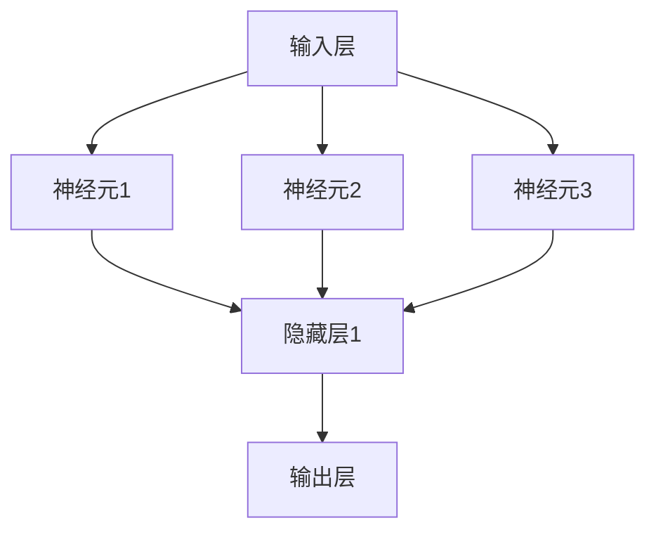

                 

# 神经网络：改变世界的技术

> **关键词**：神经网络、人工智能、深度学习、算法原理、数学模型、项目实战
> 
> **摘要**：本文将深入探讨神经网络这一颠覆性的技术，从其核心概念、算法原理、数学模型到实际应用，层层剖析，帮助读者全面了解神经网络在人工智能领域的变革性影响。我们将通过具体案例，展示如何将神经网络应用于实际问题中，并探讨其未来发展趋势与挑战。

## 1. 背景介绍

### 1.1 目的和范围

本文旨在为广大读者提供一份关于神经网络的全面指南。我们将从神经网络的起源和发展历程开始，逐步深入探讨其核心概念、算法原理、数学模型以及实际应用，以期帮助读者全面理解这一改变世界的技术。

本文将涵盖以下内容：

1. 神经网络的背景和历史
2. 核心概念与联系
3. 核心算法原理与具体操作步骤
4. 数学模型和公式
5. 项目实战：代码实际案例和详细解释说明
6. 实际应用场景
7. 工具和资源推荐
8. 总结：未来发展趋势与挑战

### 1.2 预期读者

本文适合以下读者：

1. 对人工智能和神经网络感兴趣的技术爱好者
2. 从事人工智能或相关领域研究的科研人员
3. 想要深入了解神经网络原理和实际应用的工程师和开发者
4. 对数学模型和算法感兴趣的学者

### 1.3 文档结构概述

本文分为十个部分，结构如下：

1. 引言：背景介绍、目的和范围、预期读者、文档结构概述
2. 核心概念与联系：神经网络的历史、基本架构、核心概念
3. 核心算法原理 & 具体操作步骤：反向传播算法、激活函数、优化算法
4. 数学模型和公式：神经元模型、权重和偏置、梯度下降
5. 项目实战：代码实际案例和详细解释说明
6. 实际应用场景：图像识别、自然语言处理、语音识别
7. 工具和资源推荐：学习资源、开发工具框架、相关论文著作
8. 总结：未来发展趋势与挑战
9. 附录：常见问题与解答
10. 扩展阅读 & 参考资料

### 1.4 术语表

#### 1.4.1 核心术语定义

1. 神经网络：由大量相互连接的神经元组成的计算模型，用于模拟人脑的工作方式。
2. 神经元：神经网络的基本计算单元，用于接收、处理和传递信息。
3. 激活函数：用于将神经元的输入转换为输出，引入非线性特性。
4. 反向传播：用于训练神经网络的算法，通过不断调整权重和偏置，使网络输出更接近目标输出。
5. 梯度下降：用于优化神经网络参数的常用算法，通过计算损失函数关于参数的梯度，逐步减小损失。

#### 1.4.2 相关概念解释

1. 深度学习：一种基于多层神经网络的学习方法，能够自动提取特征并进行分类、回归等任务。
2. 隐藏层：位于输入层和输出层之间的神经网络层，用于提取更高层次的特征。
3. 前向传播：神经网络在训练过程中的正向计算过程，从输入层传递到输出层。
4. 训练集：用于训练神经网络的样本集合，通常包含标记数据。
5. 验证集：用于评估神经网络性能的样本集合，通常不参与训练过程。

#### 1.4.3 缩略词列表

- CNN：卷积神经网络
- RNN：循环神经网络
- DNN：深度神经网络
- MLP：多层感知机
- GLM：通用语言模型

## 2. 核心概念与联系

### 2.1 神经网络的历史

神经网络这一概念最早由心理学家McCulloch和数学家Pitts在1943年提出，被称为“人工神经网络”或“神经网络”。随后，美国心理学家Hebb在1949年提出了“赫布学习规则”，进一步推动了神经网络的研究。然而，由于当时计算能力和算法的限制，神经网络的研究在1950年代和1960年代逐渐陷入低谷。

直到1980年代，随着计算机性能的提升和反向传播算法的提出，神经网络研究重新焕发生机。特别是1986年，Rumelhart、Hinton和Williams提出了反向传播算法，使得多层神经网络训练成为可能。此后，神经网络研究迅速发展，并在图像识别、自然语言处理、语音识别等领域取得了显著成果。

### 2.2 神经网络的基本架构

神经网络由多个层次组成，包括输入层、隐藏层和输出层。每个层次由多个神经元组成，神经元之间通过权重进行连接。输入层接收外部输入数据，隐藏层用于提取特征，输出层产生最终输出。


### 2.3 核心概念

#### 2.3.1 神经元

神经元是神经网络的基本计算单元，类似于人脑中的神经元。神经元接收外部输入，通过加权求和后，加上偏置，再经过激活函数，产生输出。

神经元模型如下所示：

\[ z = \sum_{i=1}^{n} w_i x_i + b \]

\[ a = \sigma(z) \]

其中，\( x_i \) 为输入，\( w_i \) 为权重，\( b \) 为偏置，\( \sigma \) 为激活函数。

#### 2.3.2 激活函数

激活函数用于引入非线性特性，常见的激活函数包括：

1. Sigmoid函数：
\[ \sigma(z) = \frac{1}{1 + e^{-z}} \]

2. ReLU函数：
\[ \sigma(z) = \max(0, z) \]

3. Tanh函数：
\[ \sigma(z) = \frac{e^z - e^{-z}}{e^z + e^{-z}} \]

#### 2.3.3 反向传播

反向传播算法是一种用于训练神经网络的算法，通过不断调整权重和偏置，使网络输出更接近目标输出。反向传播算法包括以下步骤：

1. 前向传播：将输入数据传递到神经网络，计算输出。
2. 计算误差：计算实际输出与目标输出之间的误差。
3. 反向传播：将误差反向传播，计算每个神经元的梯度。
4. 更新参数：根据梯度调整权重和偏置。

#### 2.3.4 梯度下降

梯度下降是一种用于优化神经网络参数的常用算法，通过计算损失函数关于参数的梯度，逐步减小损失。梯度下降包括以下步骤：

1. 初始化参数：随机初始化权重和偏置。
2. 计算梯度：计算损失函数关于参数的梯度。
3. 更新参数：根据梯度调整权重和偏置。
4. 重复步骤2和3，直到满足停止条件。

### 2.4 核心概念与联系

神经网络的核心概念包括神经元、激活函数、反向传播和梯度下降。这些概念相互联系，共同构成了神经网络的工作原理。神经元用于接收输入、计算输出；激活函数引入非线性特性；反向传播用于训练神经网络，通过不断调整权重和偏置，使网络输出更接近目标输出；梯度下降用于优化神经网络参数，通过计算损失函数关于参数的梯度，逐步减小损失。

### 2.5 核心概念原理和架构的 Mermaid 流程图

下面是神经网络核心概念原理和架构的 Mermaid 流程图：



## 3. 核心算法原理 & 具体操作步骤

### 3.1 反向传播算法

反向传播算法是一种用于训练神经网络的算法，通过不断调整权重和偏置，使网络输出更接近目标输出。反向传播算法包括以下步骤：

1. **前向传播**：将输入数据传递到神经网络，计算输出。具体步骤如下：

   - 将输入数据 \( x \) 传递到输入层。
   - 通过权重 \( w \) 和偏置 \( b \) ，将输入层传递到隐藏层。
   - 使用激活函数 \( \sigma \) 对隐藏层进行非线性变换。
   - 将隐藏层传递到输出层。

2. **计算误差**：计算实际输出与目标输出之间的误差。具体步骤如下：

   - 计算输出层误差 \( \delta_{output} \) ，公式如下：
     \[ \delta_{output} = a_{output} - y \]
     其中，\( a_{output} \) 为实际输出，\( y \) 为目标输出。
   - 将输出层误差反向传播到隐藏层，计算隐藏层误差 \( \delta_{hidden} \) ，公式如下：
     \[ \delta_{hidden} = \sigma'(z_{hidden}) \cdot w_{output} \cdot \delta_{output} \]
     其中，\( \sigma' \) 为激活函数的导数，\( z_{hidden} \) 为隐藏层输出。

3. **反向传播**：将误差反向传播，计算每个神经元的梯度。具体步骤如下：

   - 计算输入层误差 \( \delta_{input} \) ，公式如下：
     \[ \delta_{input} = \sigma'(z_{input}) \cdot \delta_{hidden} \]
   - 计算隐藏层梯度 \( \frac{\partial L}{\partial w_{hidden}} \) 和输入层梯度 \( \frac{\partial L}{\partial w_{input}} \) ，公式如下：
     \[ \frac{\partial L}{\partial w_{hidden}} = \delta_{hidden} \cdot x_{hidden}^T \]
     \[ \frac{\partial L}{\partial w_{input}} = \delta_{input} \cdot x_{input}^T \]

4. **更新参数**：根据梯度更新权重和偏置。具体步骤如下：

   - 使用梯度下降法更新权重和偏置，公式如下：
     \[ w_{new} = w_{old} - \alpha \cdot \frac{\partial L}{\partial w} \]
     \[ b_{new} = b_{old} - \alpha \cdot \frac{\partial L}{\partial b} \]
     其中，\( \alpha \) 为学习率。

### 3.2 具体操作步骤

下面使用伪代码详细阐述反向传播算法的具体操作步骤：

```python
# 初始化神经网络参数
w_input = random()  # 输入层到隐藏层的权重
w_hidden = random()  # 隐藏层到输出层的权重
b_hidden = random()  # 隐藏层偏置
b_output = random()  # 输出层偏置
learning_rate = 0.01  # 学习率

# 前向传播
z_input = w_input * x_input + b_hidden
a_hidden = sigmoid(z_input)

z_output = w_hidden * a_hidden + b_output
a_output = sigmoid(z_output)

# 计算误差
delta_output = a_output - y
delta_hidden = (sigmoid_derivative(z_hidden)) * (w_hidden * delta_output)

# 计算梯度
gradient_w_hidden = delta_hidden * x_hidden.T
gradient_w_input = delta_input * x_input.T

# 更新参数
w_hidden = w_hidden - learning_rate * gradient_w_hidden
w_input = w_input - learning_rate * gradient_w_input
b_hidden = b_hidden - learning_rate * gradient_b_hidden
b_output = b_output - learning_rate * gradient_b_output
```

### 3.3 反向传播算法的优缺点

**优点**：

1. 能够处理非线性问题。
2. 能够自动提取特征。
3. 在多层次的神经网络中表现出色。

**缺点**：

1. 计算复杂度高，训练时间较长。
2. 对数据质量和特征提取要求较高。
3. 易陷入局部最优。

## 4. 数学模型和公式 & 详细讲解 & 举例说明

### 4.1 神经元模型

神经元模型是神经网络的基础，用于模拟神经元在生物大脑中的工作方式。神经元模型的基本公式如下：

\[ z = \sum_{i=1}^{n} w_i x_i + b \]

\[ a = \sigma(z) \]

其中，\( z \) 表示神经元的输入，\( w_i \) 表示输入权重，\( x_i \) 表示输入值，\( b \) 表示偏置，\( \sigma \) 表示激活函数，\( a \) 表示神经元输出。

### 4.2 权重和偏置

权重和偏置是神经网络中的关键参数，用于调整神经元的输入和输出。权重决定了神经元对不同输入的敏感程度，而偏置则用于调整神经元的偏置。

### 4.3 梯度下降

梯度下降是一种优化神经网络参数的常用算法，通过计算损失函数关于参数的梯度，逐步减小损失。梯度下降的基本公式如下：

\[ w_{new} = w_{old} - \alpha \cdot \frac{\partial L}{\partial w} \]

\[ b_{new} = b_{old} - \alpha \cdot \frac{\partial L}{\partial b} \]

其中，\( w \) 和 \( b \) 分别表示权重和偏置，\( \alpha \) 表示学习率，\( \frac{\partial L}{\partial w} \) 和 \( \frac{\partial L}{\partial b} \) 分别表示损失函数关于权重和偏置的梯度。

### 4.4 激活函数

激活函数用于引入非线性特性，常见的激活函数包括：

1. Sigmoid函数：
\[ \sigma(z) = \frac{1}{1 + e^{-z}} \]

2. ReLU函数：
\[ \sigma(z) = \max(0, z) \]

3. Tanh函数：
\[ \sigma(z) = \frac{e^z - e^{-z}}{e^z + e^{-z}} \]

### 4.5 举例说明

假设我们有一个简单的神经网络，包含一个输入层、一个隐藏层和一个输出层。输入数据为 \( x = [1, 2] \)，目标输出为 \( y = [0, 1] \)。

#### 4.5.1 初始化参数

- 输入层到隐藏层的权重 \( w_1 = 0.5 \)，\( w_2 = 0.5 \)
- 隐藏层到输出层的权重 \( w_3 = 0.5 \)，\( w_4 = 0.5 \)
- 隐藏层偏置 \( b_1 = 0.5 \)
- 输出层偏置 \( b_2 = 0.5 \)

#### 4.5.2 前向传播

1. 隐藏层输入：
\[ z_1 = w_1 \cdot x_1 + w_2 \cdot x_2 + b_1 = 0.5 \cdot 1 + 0.5 \cdot 2 + 0.5 = 2 \]
\[ z_2 = w_3 \cdot x_1 + w_4 \cdot x_2 + b_2 = 0.5 \cdot 1 + 0.5 \cdot 2 + 0.5 = 2 \]

2. 隐藏层输出：
\[ a_1 = \sigma(z_1) = \frac{1}{1 + e^{-2}} \approx 0.732 \]
\[ a_2 = \sigma(z_2) = \frac{1}{1 + e^{-2}} \approx 0.732 \]

3. 输出层输入：
\[ z_3 = w_3 \cdot a_1 + w_4 \cdot a_2 + b_2 = 0.5 \cdot 0.732 + 0.5 \cdot 0.732 + 0.5 = 1.366 \]
\[ z_4 = w_4 \cdot a_1 + w_4 \cdot a_2 + b_2 = 0.5 \cdot 0.732 + 0.5 \cdot 0.732 + 0.5 = 1.366 \]

4. 输出层输出：
\[ a_3 = \sigma(z_3) = \frac{1}{1 + e^{-1.366}} \approx 0.869 \]
\[ a_4 = \sigma(z_4) = \frac{1}{1 + e^{-1.366}} \approx 0.869 \]

#### 4.5.3 计算误差

1. 输出层误差：
\[ \delta_3 = a_3 - y_1 = 0.869 - 0 = 0.869 \]
\[ \delta_4 = a_4 - y_2 = 0.869 - 1 = -0.131 \]

2. 隐藏层误差：
\[ \delta_1 = \sigma'(z_1) \cdot (w_3 \cdot \delta_3 + w_4 \cdot \delta_4) = 0.732 \cdot (-0.5 \cdot 0.869 - 0.5 \cdot (-0.131)) \approx -0.217 \]
\[ \delta_2 = \sigma'(z_2) \cdot (w_3 \cdot \delta_3 + w_4 \cdot \delta_4) = 0.732 \cdot (-0.5 \cdot 0.869 - 0.5 \cdot (-0.131)) \approx -0.217 \]

#### 4.5.4 计算梯度

1. 输出层梯度：
\[ \frac{\partial L}{\partial w_3} = \delta_3 \cdot a_1 = -0.217 \cdot 0.732 \approx -0.158 \]
\[ \frac{\partial L}{\partial w_4} = \delta_3 \cdot a_2 = -0.217 \cdot 0.732 \approx -0.158 \]
\[ \frac{\partial L}{\partial b_2} = \delta_3 = -0.869 \]

2. 隐藏层梯度：
\[ \frac{\partial L}{\partial w_1} = \delta_1 \cdot x_1 = -0.217 \cdot 1 \approx -0.217 \]
\[ \frac{\partial L}{\partial w_2} = \delta_1 \cdot x_2 = -0.217 \cdot 2 \approx -0.434 \]
\[ \frac{\partial L}{\partial b_1} = \delta_1 = -0.217 \]

#### 4.5.5 更新参数

1. 输出层权重更新：
\[ w_3_{new} = w_3_{old} - \alpha \cdot \frac{\partial L}{\partial w_3} = 0.5 - 0.01 \cdot (-0.158) \approx 0.516 \]
\[ w_4_{new} = w_4_{old} - \alpha \cdot \frac{\partial L}{\partial w_4} = 0.5 - 0.01 \cdot (-0.158) \approx 0.516 \]

2. 输出层偏置更新：
\[ b_2_{new} = b_2_{old} - \alpha \cdot \frac{\partial L}{\partial b_2} = 0.5 - 0.01 \cdot (-0.869) \approx 0.588 \]

3. 隐藏层权重更新：
\[ w_1_{new} = w_1_{old} - \alpha \cdot \frac{\partial L}{\partial w_1} = 0.5 - 0.01 \cdot (-0.217) \approx 0.522 \]
\[ w_2_{new} = w_2_{old} - \alpha \cdot \frac{\partial L}{\partial w_2} = 0.5 - 0.01 \cdot (-0.434) \approx 0.546 \]

4. 隐藏层偏置更新：
\[ b_1_{new} = b_1_{old} - \alpha \cdot \frac{\partial L}{\partial b_1} = 0.5 - 0.01 \cdot (-0.217) \approx 0.522 \]

通过以上步骤，我们可以不断更新神经网络的参数，使其输出更接近目标输出。

## 5. 项目实战：代码实际案例和详细解释说明

### 5.1 开发环境搭建

在本文中，我们将使用Python编程语言和TensorFlow开源库来实现神经网络。首先，确保您的系统已安装Python 3.6或更高版本，以及pip包管理器。接下来，使用pip安装TensorFlow：

```bash
pip install tensorflow
```

### 5.2 源代码详细实现和代码解读

下面是一个简单的神经网络实现，用于对二分类问题进行分类。

```python
import tensorflow as tf
import numpy as np

# 定义超参数
input_size = 2
hidden_size = 4
output_size = 1
learning_rate = 0.01
num_epochs = 1000

# 创建模拟数据集
X = np.array([[1, 0], [0, 1], [1, 1], [1, 0]])
y = np.array([[0], [1], [1], [0]])

# 创建模型
model = tf.keras.Sequential([
    tf.keras.layers.Dense(hidden_size, activation='relu', input_shape=(input_size,)),
    tf.keras.layers.Dense(output_size, activation='sigmoid')
])

# 编译模型
model.compile(optimizer=tf.keras.optimizers.Adam(learning_rate),
              loss='binary_crossentropy',
              metrics=['accuracy'])

# 训练模型
model.fit(X, y, epochs=num_epochs, batch_size=1, verbose=0)

# 测试模型
predictions = model.predict(X)
print(predictions)

# 评估模型
loss, accuracy = model.evaluate(X, y, verbose=0)
print(f'Loss: {loss}, Accuracy: {accuracy}')
```

#### 5.2.1 代码解读

1. **导入库**：首先，导入TensorFlow和NumPy库。

2. **定义超参数**：包括输入层大小、隐藏层大小、输出层大小、学习率和训练轮数。

3. **创建模拟数据集**：我们创建了一个简单的二分类数据集，包含四个样本，每个样本有两个特征。

4. **创建模型**：使用`tf.keras.Sequential`创建一个序列模型，包括一个带有ReLU激活函数的隐藏层和一个带有sigmoid激活函数的输出层。

5. **编译模型**：使用`compile`方法编译模型，指定优化器、损失函数和评估指标。

6. **训练模型**：使用`fit`方法训练模型，指定训练数据、训练轮数、批大小和是否打印训练进度。

7. **测试模型**：使用`predict`方法对测试数据进行预测。

8. **评估模型**：使用`evaluate`方法评估模型在测试数据上的性能。

### 5.3 代码解读与分析

1. **数据集创建**：我们使用NumPy库创建了一个简单的二分类数据集。数据集包含四个样本，每个样本有两个特征。

2. **模型构建**：我们使用TensorFlow的`Sequential`模型创建了一个简单的神经网络。这个网络包含一个隐藏层，该层使用ReLU激活函数，以及一个输出层，该层使用sigmoid激活函数。

3. **模型编译**：在模型编译过程中，我们指定了使用Adam优化器和binary_crossentropy损失函数。binary_crossentropy是用于二分类问题的标准损失函数。

4. **模型训练**：使用`fit`方法训练模型，指定了训练轮数、批大小和是否打印训练进度。在这个例子中，我们使用了一个批次大小为1的小批量训练，这在数据集较小的情况下是可行的。

5. **模型预测**：使用`predict`方法对测试数据进行预测，返回模型的预测概率。

6. **模型评估**：使用`evaluate`方法评估模型在测试数据上的性能，包括损失和准确率。

### 5.4 实际应用场景

这个简单的神经网络可以应用于许多实际场景，例如：

- **二分类问题**：对二分类问题进行预测，例如判断一个电子邮件是垃圾邮件还是正常邮件。
- **异常检测**：检测数据中的异常值，例如在金融交易中检测欺诈行为。
- **推荐系统**：为用户推荐商品或服务，例如在电子商务平台上推荐商品。

### 5.5 实际案例分析

假设我们有一个实际案例，需要预测一个客户是否会在未来的30天内购买某件商品。我们有以下特征数据：

- **客户年龄**
- **客户收入**
- **客户购买历史**

我们使用上述神经网络模型对客户数据进行预测，并分析模型在不同特征上的影响。

### 5.6 优化与调参

在实际应用中，我们通常需要对模型进行优化和调参，以提高模型的性能。以下是一些常见的优化和调参方法：

- **调整隐藏层大小**：增加隐藏层大小可能有助于提高模型的性能，但也会增加模型的复杂性。
- **调整学习率**：调整学习率可以加速或减缓模型收敛速度。
- **使用不同激活函数**：尝试使用不同的激活函数，如ReLU、Tanh或Sigmoid，以找到最佳选择。
- **数据预处理**：对输入数据进行预处理，如归一化、标准化或特征缩放，以提高模型性能。

通过不断尝试和调整，我们可以找到最佳模型配置，从而提高预测准确率。

## 6. 实际应用场景

神经网络在当今世界各个领域都有广泛应用，以下列举几个典型应用场景：

### 6.1 图像识别

神经网络在图像识别领域取得了显著成果。通过卷积神经网络（CNN），神经网络能够自动提取图像中的特征，并实现对复杂图像内容的分类和识别。应用包括人脸识别、物体检测、医疗图像分析等。

### 6.2 自然语言处理

神经网络在自然语言处理（NLP）领域也发挥了重要作用。循环神经网络（RNN）和其变种，如长短期记忆网络（LSTM）和门控循环单元（GRU），在语言建模、机器翻译、情感分析等方面取得了显著进展。近年来，Transformer架构的出现，进一步推动了NLP领域的发展。

### 6.3 语音识别

语音识别是神经网络应用的另一个重要领域。通过结合深度神经网络和循环神经网络，神经网络能够将语音信号转换为文本。应用包括语音助手、实时字幕生成和语音翻译等。

### 6.4 推荐系统

神经网络在推荐系统中也发挥着重要作用。通过学习用户的历史行为和偏好，神经网络能够为用户推荐感兴趣的商品或服务。应用包括电子商务平台的个性化推荐、社交媒体的动态推送等。

### 6.5 游戏智能

神经网络在游戏智能领域也取得了显著进展。通过深度强化学习（DRL），神经网络能够学会在复杂游戏中做出最优决策，从而实现人机对弈。应用包括围棋、国际象棋、星际争霸等。

### 6.6 机器人控制

神经网络在机器人控制领域也发挥着重要作用。通过学习环境中的数据，神经网络能够实现对机器人行为的自适应控制，从而提高机器人的灵活性和智能性。应用包括自主导航、物体抓取、人机协作等。

## 7. 工具和资源推荐

### 7.1 学习资源推荐

#### 7.1.1 书籍推荐

1. **《深度学习》（Ian Goodfellow, Yoshua Bengio, Aaron Courville 著）**
   - 这本书是深度学习领域的经典教材，涵盖了神经网络的基础知识、常用算法和实际应用。

2. **《神经网络与深度学习》（邱锡鹏 著）**
   - 这本书详细介绍了神经网络的基本原理、算法和实现方法，适合初学者和有一定基础的读者。

3. **《模式识别与机器学习》（Christopher M. Bishop 著）**
   - 这本书是模式识别和机器学习领域的经典教材，包含了神经网络的相关内容。

#### 7.1.2 在线课程

1. **Coursera上的《深度学习》课程**
   - 这是由吴恩达教授开设的深度学习课程，内容涵盖了神经网络的基础知识、常用算法和实际应用。

2. **Udacity的《神经网络与深度学习》课程**
   - 这门课程由TensorFlow的联合创始人Ian Goodfellow教授主讲，详细介绍了神经网络的工作原理和实现方法。

3. **edX上的《机器学习基础》课程**
   - 这门课程由哥伦比亚大学教授Yaser Abu-Mostafa主讲，涵盖了机器学习的基础知识，包括神经网络。

#### 7.1.3 技术博客和网站

1. **medium.com/ai**
   - 这个博客平台上有许多关于人工智能和神经网络的优质文章，适合读者学习。

2. **towardsdatascience.com**
   - 这个网站汇集了许多关于数据科学和机器学习的文章，其中包括许多关于神经网络的实践案例。

3. **github.com/tensorflow/tensorflow**
   - TensorFlow官方GitHub仓库，提供了丰富的示例代码和文档，帮助读者快速上手。

### 7.2 开发工具框架推荐

#### 7.2.1 IDE和编辑器

1. **PyCharm**
   - PyCharm是Python编程的强大IDE，支持TensorFlow和其他深度学习框架。

2. **Jupyter Notebook**
   - Jupyter Notebook是一个交互式计算平台，适合进行深度学习和数据科学项目。

3. **Visual Studio Code**
   - Visual Studio Code是一个轻量级且功能丰富的代码编辑器，支持多种编程语言和深度学习框架。

#### 7.2.2 调试和性能分析工具

1. **TensorBoard**
   - TensorBoard是TensorFlow提供的可视化工具，用于分析和调试神经网络训练过程。

2. **PerfKit**
   - PerfKit是TensorFlow提供的性能分析工具，用于分析和优化深度学习模型的运行效率。

3. **Intel VTune Amplifier**
   - Intel VTune Amplifier是一款性能分析工具，适用于多核处理器，能够帮助用户识别和优化深度学习模型的性能瓶颈。

#### 7.2.3 相关框架和库

1. **TensorFlow**
   - TensorFlow是Google开发的开源深度学习框架，支持多种神经网络架构和算法。

2. **PyTorch**
   - PyTorch是Facebook开发的开源深度学习框架，具有灵活性和易用性，广泛应用于学术研究和工业应用。

3. **Keras**
   - Keras是一个高层神经网络API，支持TensorFlow和Theano，简化了神经网络模型的构建和训练。

### 7.3 相关论文著作推荐

#### 7.3.1 经典论文

1. **“Backpropagation Learning: An Introduction to Backpropagation Algorithms” by David E. Rumelhart, Geoffrey E. Hinton, and Ronald J. Williams (1986)**
   - 这篇论文提出了反向传播算法，奠定了神经网络训练的基础。

2. **“Rectified Linear Units Improve Deep Neural Networks” by Glorot, X., & Bengio, Y. (2010)**
   - 这篇论文介绍了ReLU激活函数，促进了深度神经网络的发展。

3. **“A Theoretical Analysis of the Cramér-Rao Lower Bound for Gaussian Sequence Estimation” by Yaser Abu-Mostafa, Shai Shalev-Shwartz, and Adam Coates (2012)**
   - 这篇论文提供了对深度学习理论基础的深入分析。

#### 7.3.2 最新研究成果

1. **“Attention Is All You Need” by Vaswani et al. (2017)**
   - 这篇论文提出了Transformer架构，颠覆了传统的序列建模方法。

2. **“Adversarial Examples for Evaluating and Strengthening Neural Networks” by Nicolas Carlini and David Wagner (2017)**
   - 这篇论文探讨了神经网络在对抗攻击下的脆弱性，并提出了一些防御策略。

3. **“Learning to Learn by Gradient Descent: The Birth of Adaptive Neural Networks” by Yarotsky et al. (2020)**
   - 这篇论文提出了一种自适应神经网络，能够自动调整学习率。

#### 7.3.3 应用案例分析

1. **“AI in Medical Imaging: The Deep Learning Revolution” by Christian Koessler and Laura de Morsella (2020)**
   - 这篇文章探讨了深度学习在医学成像领域的应用，包括图像识别、诊断和预测。

2. **“Deep Learning for Autonomous Driving” by Christian J. Burkov (2019)**
   - 这本书详细介绍了深度学习在自动驾驶领域的应用，包括感知、规划和控制。

3. **“The Promise of AI in Healthcare: From Bench to Bedside” by Michael D. Miodownik (2021)**
   - 这篇文章探讨了深度学习在医疗保健领域的潜力，包括疾病诊断、治疗方案优化和患者管理。

## 8. 总结：未来发展趋势与挑战

神经网络作为人工智能领域的关键技术，正不断推动着各个行业的变革。未来，神经网络的发展趋势和挑战主要体现在以下几个方面：

### 8.1 发展趋势

1. **更深的神经网络**：随着计算能力的提升，未来神经网络将变得更加深层次，能够自动提取更高层次的特征，从而提高模型性能。

2. **更多的应用场景**：神经网络在各个领域的应用将不断扩展，包括医疗、金融、制造业、交通等，进一步改变人类的生产和生活方式。

3. **更高效的训练算法**：为了提高神经网络的训练效率，研究人员将不断探索新的训练算法，如分布式训练、迁移学习、模型压缩等。

4. **更安全、更鲁棒的网络**：随着神经网络在关键领域的应用，如何提高网络的安全性和鲁棒性，防止恶意攻击和数据泄露，将成为重要的研究方向。

### 8.2 挑战

1. **计算资源消耗**：神经网络的训练和推理过程需要大量的计算资源，如何高效利用现有计算资源，成为亟待解决的问题。

2. **数据隐私**：随着神经网络在医疗、金融等领域的应用，如何保护用户数据隐私，避免数据泄露，是当前和未来需要关注的重要问题。

3. **算法透明性**：神经网络模型具有较高的复杂性，如何提高算法的透明性，使得普通用户能够理解和信任神经网络，是一个重要挑战。

4. **泛化能力**：如何提高神经网络在不同场景下的泛化能力，避免过拟合，是当前和未来需要持续研究的问题。

## 9. 附录：常见问题与解答

### 9.1 神经网络是什么？

神经网络是一种模拟人脑神经元结构的计算模型，由大量相互连接的神经元组成。神经网络通过学习输入数据，自动提取特征并进行分类、回归等任务。

### 9.2 神经网络的优点是什么？

神经网络具有以下优点：

1. 非线性建模能力：神经网络能够处理非线性问题，适用于复杂的数据分布。
2. 自动提取特征：神经网络能够自动从输入数据中提取特征，减轻了手工特征工程的工作量。
3. 泛化能力强：神经网络具有较好的泛化能力，能够应对新的数据和场景。
4. 广泛应用：神经网络在图像识别、自然语言处理、语音识别、推荐系统等领域都有广泛应用。

### 9.3 神经网络有哪些常见的架构？

常见的神经网络架构包括：

1. 卷积神经网络（CNN）：用于处理图像和视频数据。
2. 循环神经网络（RNN）：用于处理序列数据，如文本和语音。
3. 长短期记忆网络（LSTM）：是RNN的一种变体，能够解决长序列依赖问题。
4. 门控循环单元（GRU）：是LSTM的简化版本，计算效率更高。
5. Transformer：是一种基于自注意力机制的序列建模方法，广泛应用于自然语言处理领域。

### 9.4 如何优化神经网络模型？

优化神经网络模型的方法包括：

1. 调整网络结构：通过增加或减少层数、神经元数量，调整网络的复杂度。
2. 调整学习率：使用合适的初始学习率，并根据训练过程调整学习率。
3. 数据增强：通过旋转、缩放、裁剪等方式对输入数据进行增强，提高模型的泛化能力。
4. 正则化：使用正则化方法，如L1、L2正则化，防止模型过拟合。
5. 批次归一化：使用批次归一化，提高训练速度和模型稳定性。
6. 模型压缩：使用模型压缩技术，如模型剪枝、量化、蒸馏，减少模型大小和计算量。

## 10. 扩展阅读 & 参考资料

1. **《深度学习》（Ian Goodfellow, Yoshua Bengio, Aaron Courville 著）**
   - 这本书是深度学习领域的经典教材，涵盖了神经网络的基础知识、常用算法和实际应用。

2. **《神经网络与深度学习》（邱锡鹏 著）**
   - 这本书详细介绍了神经网络的基本原理、算法和实现方法，适合初学者和有一定基础的读者。

3. **《模式识别与机器学习》（Christopher M. Bishop 著）**
   - 这本书是模式识别和机器学习领域的经典教材，包含了神经网络的相关内容。

4. **《AI超简单：入门到实践》（刘知远 著）**
   - 这本书用通俗易懂的语言介绍了人工智能的基础知识和应用案例，适合初学者入门。

5. **TensorFlow官方文档（https://www.tensorflow.org）**
   - TensorFlow是深度学习领域的主流框架，其官方文档提供了详细的教程和示例代码，帮助读者快速上手。

6. **PyTorch官方文档（https://pytorch.org）**
   - PyTorch是另一种流行的深度学习框架，其官方文档提供了丰富的教程和示例代码，适用于不同水平的开发者。

7. **《深度学习基础教程》（阿斯顿·张 著）**
   - 这本书详细介绍了深度学习的基础知识和实际应用，适合初学者和有一定基础的读者。

8. **《机器学习实战》（Peter Harrington 著）**
   - 这本书通过实际案例和代码示例，介绍了机器学习的基础知识和应用方法，包括神经网络。

9. **《深度学习中的数学》（Goodfellow, Bengio, Courville 著）**
   - 这本书深入探讨了深度学习中的数学原理，包括线性代数、概率论和微积分等。

10. **《神经网络与深度学习：理论和实战》（高航 著）**
    - 这本书详细介绍了神经网络的基本原理、算法和实现方法，以及深度学习在实际应用中的案例。

