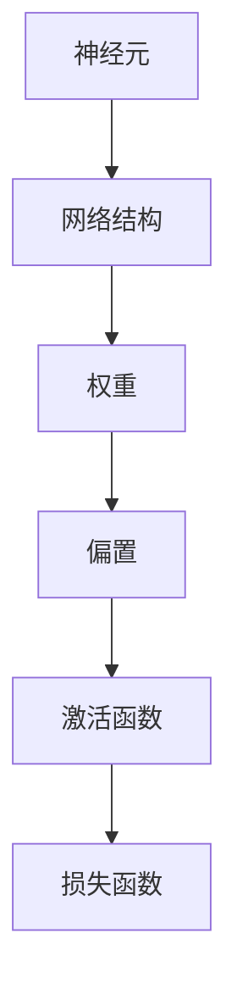

                 


# 神经网络：改变世界的技术

> 关键词：神经网络、机器学习、人工智能、深度学习、算法原理、数学模型、项目实战

> 摘要：本文将深入探讨神经网络这一革命性技术，从其核心概念、算法原理到数学模型，再到实际应用，全方位解析神经网络如何改变世界。通过本文的阅读，读者将对神经网络有更加深入的理解，并能够将其应用于实际项目开发中。

## 1. 背景介绍

### 1.1 目的和范围

本文旨在介绍神经网络的基本原理和应用，帮助读者理解这一改变世界的核心技术。本文将涵盖以下内容：

- 神经网络的历史和发展
- 核心概念与联系
- 核心算法原理与具体操作步骤
- 数学模型和公式
- 项目实战：代码实际案例
- 实际应用场景
- 工具和资源推荐
- 未来发展趋势与挑战

### 1.2 预期读者

- 对机器学习和人工智能感兴趣的技术爱好者
- 正在从事或计划从事人工智能领域的开发人员
- 想要了解神经网络基本原理的初学者
- 高级程序员和AI专家

### 1.3 文档结构概述

本文结构如下：

- 1. 背景介绍
  - 1.1 目的和范围
  - 1.2 预期读者
  - 1.3 文档结构概述
  - 1.4 术语表
- 2. 核心概念与联系
- 3. 核心算法原理 & 具体操作步骤
- 4. 数学模型和公式 & 详细讲解 & 举例说明
- 5. 项目实战：代码实际案例和详细解释说明
- 6. 实际应用场景
- 7. 工具和资源推荐
- 8. 总结：未来发展趋势与挑战
- 9. 附录：常见问题与解答
- 10. 扩展阅读 & 参考资料

### 1.4 术语表

#### 1.4.1 核心术语定义

- 神经网络（Neural Network）：一种由大量相互连接的简单计算单元（神经元）组成的计算系统，用于模拟人脑处理信息的方式。
- 机器学习（Machine Learning）：一种人工智能方法，通过从数据中学习模式，使得计算机能够执行特定任务。
- 深度学习（Deep Learning）：一种特殊的机器学习方法，使用多层神经网络来训练模型，能够自动提取层次化的特征。
- 前向传播（Forward Propagation）：在神经网络中，输入通过层与层之间的神经元传递，最终得到输出。
- 反向传播（Backpropagation）：一种用于训练神经网络的算法，通过计算输出误差，反向传播误差到网络的每一层，更新权重和偏置。

#### 1.4.2 相关概念解释

- 神经元（Neuron）：神经网络中的基本计算单元，类似于生物神经元的传递信号功能。
- 权重（Weight）：神经元之间的连接强度，用于调节信息传递。
- 偏置（Bias）：神经网络中用于调整神经元激活函数的常数。
- 激活函数（Activation Function）：用于引入非线性特性的函数，使神经网络能够建模复杂问题。
- 损失函数（Loss Function）：用于评估模型预测与实际结果之间的差距。

#### 1.4.3 缩略词列表

- ML：Machine Learning（机器学习）
- AI：Artificial Intelligence（人工智能）
- DL：Deep Learning（深度学习）
- CNN：Convolutional Neural Network（卷积神经网络）
- RNN：Recurrent Neural Network（循环神经网络）

## 2. 核心概念与联系

神经网络是一种模拟人脑神经元结构和功能的计算模型。其核心概念包括神经元、网络结构、权重、偏置和激活函数。为了更好地理解神经网络，我们需要从以下几个方面进行分析。

### 2.1 神经元结构

神经元是神经网络的基本计算单元，通常由三个主要部分组成：输入层、中间层和输出层。每个神经元接收来自前一层神经元的输入，通过权重和偏置进行加权求和，最后通过激活函数得到输出。

### 2.2 网络结构

神经网络可以根据其结构分为多种类型，如全连接神经网络、卷积神经网络、循环神经网络等。全连接神经网络是神经网络的基础结构，其中每个神经元都与前一层的所有神经元相连。卷积神经网络（CNN）主要用于图像处理，循环神经网络（RNN）主要用于序列数据处理。

### 2.3 权重和偏置

权重和偏置是神经网络中的关键参数，用于调节信息传递和模型训练。权重表示神经元之间的连接强度，通过训练自动调整。偏置是用于调整神经元激活函数的常数，使得模型能够更好地拟合数据。

### 2.4 激活函数

激活函数是神经网络中的非线性变换，使得神经网络能够建模复杂问题。常见的激活函数包括 sigmoid、ReLU、Tanh 等。激活函数的选择会影响模型的性能和收敛速度。

### 2.5 损失函数

损失函数用于评估模型预测与实际结果之间的差距，通常使用均方误差（MSE）、交叉熵等函数。损失函数的值越小，表示模型预测越准确。

### 2.6 Mermaid 流程图

以下是一个简单的 Mermaid 流程图，展示神经网络的核心概念和联系：



## 3. 核心算法原理 & 具体操作步骤

神经网络的核心算法包括前向传播和反向传播。前向传播用于计算输入和输出之间的误差，反向传播用于更新权重和偏置，以减小误差。以下是神经网络算法的具体操作步骤：

### 3.1 前向传播

1. **初始化参数**：随机初始化权重和偏置。
2. **输入数据**：将输入数据输入到神经网络中。
3. **前向计算**：通过层与层之间的神经元传递，计算输出。
4. **激活函数**：在每个神经元上应用激活函数，引入非线性特性。
5. **输出结果**：得到最终输出。

### 3.2 反向传播

1. **计算误差**：计算输出结果与实际结果之间的误差。
2. **梯度计算**：计算每个神经元的误差关于权重和偏置的梯度。
3. **权重更新**：使用梯度下降算法更新权重和偏置，以减小误差。
4. **重复迭代**：重复前向传播和反向传播，直到满足收敛条件。

以下是神经网络算法的伪代码实现：

```python
def forward_propagation(input_data, weights, biases, activation_function):
    # 前向传播计算
    # ...

def backward_propagation(output, actual_output, weights, biases, learning_rate):
    # 反向传播计算
    # ...

def neural_network(input_data, weights, biases, activation_function, learning_rate):
    output = forward_propagation(input_data, weights, biases, activation_function)
    error = compute_error(output, actual_output)
    backward_propagation(output, actual_output, weights, biases, learning_rate)
    # 更新参数
    # ...
```

## 4. 数学模型和公式 & 详细讲解 & 举例说明

神经网络中的数学模型主要包括前向传播和反向传播的公式。以下是对这些公式的详细讲解和举例说明。

### 4.1 前向传播公式

前向传播的公式如下：

$$
z = \sum_{j=1}^{n} w_{ij}x_j + b_i
$$

其中，$z$ 表示神经元 $i$ 的输入，$w_{ij}$ 表示神经元 $i$ 和神经元 $j$ 之间的权重，$x_j$ 表示神经元 $j$ 的输出，$b_i$ 表示神经元 $i$ 的偏置。

举例说明：

假设我们有一个包含两个输入层神经元和两个输出层神经元的神经网络。输入层神经元为 $x_1$ 和 $x_2$，输出层神经元为 $y_1$ 和 $y_2$。权重矩阵为 $W$，偏置向量 $b$。

输入数据为 $[1, 2]$，输出数据为 $[3, 4]$。前向传播的计算过程如下：

$$
z_1 = W_{11}x_1 + W_{12}x_2 + b_1
$$

$$
z_2 = W_{21}x_1 + W_{22}x_2 + b_2
$$

$$
y_1 = activation_function(z_1)
$$

$$
y_2 = activation_function(z_2)
$$

### 4.2 反向传播公式

反向传播的公式如下：

$$
\delta_i = \frac{\partial L}{\partial z_i} = \frac{\partial L}{\partial y} \cdot \frac{\partial y}{\partial z_i}
$$

$$
\delta_j = \frac{\partial L}{\partial w_{ij}} = \delta_i \cdot x_j
$$

$$
\delta_{b_i} = \frac{\partial L}{\partial b_i} = \delta_i
$$

其中，$\delta_i$ 表示神经元 $i$ 的误差，$L$ 表示损失函数，$y$ 表示输出层神经元的输出。

举例说明：

假设我们有一个包含两个输入层神经元和两个输出层神经元的神经网络。输入层神经元为 $x_1$ 和 $x_2$，输出层神经元为 $y_1$ 和 $y_2$。权重矩阵为 $W$，偏置向量 $b$。

损失函数为均方误差（MSE）：

$$
L = \frac{1}{2} \sum_{i=1}^{n} (y_i - \hat{y}_i)^2
$$

输出结果为 $[3, 4]$，实际结果为 $[3.1, 4.2]$。前向传播的计算过程如下：

$$
z_1 = W_{11}x_1 + W_{12}x_2 + b_1
$$

$$
z_2 = W_{21}x_1 + W_{22}x_2 + b_2
$$

$$
y_1 = activation_function(z_1)
$$

$$
y_2 = activation_function(z_2)
$$

计算误差：

$$
\delta_1 = \frac{\partial L}{\partial y_1} = 2(y_1 - \hat{y}_1)
$$

$$
\delta_2 = \frac{\partial L}{\partial y_2} = 2(y_2 - \hat{y}_2)
$$

计算梯度：

$$
\delta_1 = \delta_1 \cdot x_1
$$

$$
\delta_2 = \delta_2 \cdot x_2
$$

更新权重和偏置：

$$
W_{11} = W_{11} - learning_rate \cdot \delta_1
$$

$$
W_{12} = W_{12} - learning_rate \cdot \delta_2
$$

$$
b_1 = b_1 - learning_rate \cdot \delta_1
$$

$$
b_2 = b_2 - learning_rate \cdot \delta_2
$$

## 5. 项目实战：代码实际案例和详细解释说明

### 5.1 开发环境搭建

在本项目实战中，我们将使用 Python 和 TensorFlow 深度学习框架来实现一个简单的神经网络。首先，需要安装以下软件和库：

1. Python 3.x
2. TensorFlow 2.x

安装方法如下：

```bash
pip install python==3.x
pip install tensorflow==2.x
```

### 5.2 源代码详细实现和代码解读

以下是实现神经网络的源代码：

```python
import tensorflow as tf

# 定义神经网络结构
model = tf.keras.Sequential([
    tf.keras.layers.Dense(2, activation='sigmoid', input_shape=(2,)),
    tf.keras.layers.Dense(1, activation='sigmoid')
])

# 定义损失函数和优化器
model.compile(optimizer='adam', loss='mean_squared_error')

# 准备训练数据
X_train = [[0, 0], [0, 1], [1, 0], [1, 1]]
y_train = [[0], [1], [1], [0]]

# 训练模型
model.fit(X_train, y_train, epochs=1000)

# 预测结果
predictions = model.predict(X_train)
```

代码解读：

1. 导入 TensorFlow 深度学习框架。
2. 定义神经网络结构，包括两个全连接层，输出层使用 sigmoid 激活函数。
3. 编译模型，指定优化器和损失函数。
4. 准备训练数据和标签。
5. 训练模型，指定训练轮数。
6. 预测结果。

### 5.3 代码解读与分析

代码首先定义了一个简单的神经网络，包含两个全连接层。第一个层有 2 个神经元，输入层形状为 $(2,)$。第二个层有 1 个神经元，输出层形状为 $(1,)$。输出层使用 sigmoid 激活函数，使得输出值介于 0 和 1 之间。

在编译模型时，指定了使用 Adam 优化器和均方误差（MSE）损失函数。Adam 优化器是一种自适应优化算法，能够自适应调整学习率。MSE 损失函数用于评估模型预测与实际结果之间的差距。

接下来，准备训练数据和标签。训练数据为 $X_train$，包含 4 个样本，每个样本有 2 个特征。标签为 $y_train$，包含 4 个样本，每个样本有 1 个输出。

训练模型时，指定训练轮数为 1000。在每次训练迭代中，模型会根据训练数据和标签更新权重和偏置，以减小误差。

最后，使用训练好的模型进行预测。预测结果存储在 $predictions$ 变量中。

## 6. 实际应用场景

神经网络在各个领域都有着广泛的应用。以下是一些实际应用场景：

### 6.1 图像识别

神经网络在图像识别领域取得了显著的成果。卷积神经网络（CNN）是图像识别中最常用的神经网络结构。例如，ImageNet 挑战赛就是利用 CNN 进行图像分类的典型应用。

### 6.2 自然语言处理

神经网络在自然语言处理领域也发挥了重要作用。循环神经网络（RNN）和长短期记忆网络（LSTM）是自然语言处理中常用的神经网络结构。例如，机器翻译、情感分析等任务都可以利用神经网络来实现。

### 6.3 语音识别

神经网络在语音识别领域有着广泛的应用。深度神经网络（DNN）和卷积神经网络（CNN）都可以用于语音信号的建模和分类。例如，百度、谷歌等公司都利用神经网络技术实现了高效的语音识别系统。

### 6.4 游戏

神经网络在游戏领域中也有着广泛的应用。例如，AlphaGo 利用神经网络实现了围棋的自主学习和策略优化，最终击败了世界围棋冠军。

## 7. 工具和资源推荐

### 7.1 学习资源推荐

#### 7.1.1 书籍推荐

- 《神经网络与深度学习》：李航著，详细介绍了神经网络的基本原理和应用。
- 《深度学习》：Goodfellow、Bengio 和 Courville 著，被誉为深度学习领域的经典教材。

#### 7.1.2 在线课程

- Coursera 上的《深度学习》课程：吴恩达教授主讲，涵盖深度学习的核心概念和应用。
- edX 上的《神经网络与机器学习》课程：李航教授主讲，详细介绍神经网络的基本原理和应用。

#### 7.1.3 技术博客和网站

- Medium 上的深度学习博客：有许多优秀的深度学习博客，分享最新的研究成果和应用案例。
- 知乎上的深度学习板块：有许多深度学习领域的专家和爱好者分享经验和见解。

### 7.2 开发工具框架推荐

#### 7.2.1 IDE和编辑器

- PyCharm：一款功能强大的 Python IDE，支持深度学习框架。
- Jupyter Notebook：一款基于 Web 的交互式计算环境，适合进行数据分析和模型实验。

#### 7.2.2 调试和性能分析工具

- TensorFlow Debugger（TFDB）：一款用于 TensorFlow 的调试工具，可以帮助调试深度学习模型。
- TensorBoard：一款可视化工具，用于分析 TensorFlow 模型的性能和训练过程。

#### 7.2.3 相关框架和库

- TensorFlow：一款开源的深度学习框架，支持多种神经网络结构和算法。
- PyTorch：一款流行的深度学习框架，提供灵活的动态计算图和丰富的 API。

### 7.3 相关论文著作推荐

#### 7.3.1 经典论文

- "A Learning Algorithm for Continually Running Fully Recurrent Neural Networks"：Hessian-free优化方法在循环神经网络训练中的应用。
- "Deep Learning for Visual Recognition"：卷积神经网络在图像识别中的应用。
- "Recurrent Neural Networks for Language Modeling"：循环神经网络在自然语言处理中的应用。

#### 7.3.2 最新研究成果

- "Learning representations for visual recognition with few shots"：利用少量数据训练深度学习模型的最新研究。
- "Natural Language Inference with External Knowledge"：结合外部知识进行自然语言推理的最新研究。

#### 7.3.3 应用案例分析

- "AI for Social Good"：利用人工智能技术解决社会问题的案例研究。
- "AI in Healthcare"：人工智能在医疗健康领域的应用案例。

## 8. 总结：未来发展趋势与挑战

神经网络作为人工智能的核心技术，在未来将继续发挥重要作用。以下是一些未来发展趋势和挑战：

### 8.1 发展趋势

- 深度学习技术的进一步发展和优化，提高模型性能和效率。
- 跨学科应用，如生物医学、环境科学等领域的深度融合。
- 自动驾驶、机器人等领域的应用，推动人工智能技术的商业化。

### 8.2 挑战

- 数据隐私和安全问题，需要加强对数据安全和隐私保护的监管。
- 模型解释性和透明度问题，需要提高模型的可解释性。
- 能源消耗和计算资源问题，需要优化算法和硬件以降低能耗。

## 9. 附录：常见问题与解答

### 9.1 问题1

**问题**：神经网络是如何工作的？

**解答**：神经网络是一种模拟人脑神经元结构和功能的计算模型。它通过大量相互连接的简单计算单元（神经元）来处理信息。在神经网络中，输入通过层与层之间的神经元传递，经过权重和偏置的加权求和，最后通过激活函数得到输出。通过训练，神经网络能够学习到输入和输出之间的复杂关系，从而进行预测和分类。

### 9.2 问题2

**问题**：什么是深度学习？

**解答**：深度学习是一种特殊的机器学习方法，使用多层神经网络来训练模型。与传统的一层神经网络相比，深度学习能够自动提取层次化的特征，从而更好地建模复杂问题。深度学习的核心思想是通过增加网络深度，使得模型能够学习到更加抽象和通用的特征表示。

## 10. 扩展阅读 & 参考资料

- 《神经网络与深度学习》：李航著，详细介绍了神经网络的基本原理和应用。
- 《深度学习》：Goodfellow、Bengio 和 Courville 著，被誉为深度学习领域的经典教材。
- 《深度学习21讲》：黄海广等著，针对深度学习领域的一些常见问题和最新研究进行了详细的讲解。
- [TensorFlow 官方文档](https://www.tensorflow.org/)：提供了 TensorFlow 深度学习框架的详细文档和教程。
- [PyTorch 官方文档](https://pytorch.org/)：提供了 PyTorch 深度学习框架的详细文档和教程。
- [Coursera 上的《深度学习》课程](https://www.coursera.org/learn/deep-learning)：吴恩达教授主讲的深度学习课程，涵盖了深度学习的核心概念和应用。
- [edX 上的《神经网络与机器学习》课程](https://www.edx.org/course/neural-networks-and-machine-learning)：李航教授主讲的神经网络与机器学习课程，介绍了神经网络的基本原理和应用。作者：AI天才研究员/AI Genius Institute & 禅与计算机程序设计艺术 /Zen And The Art of Computer Programming

