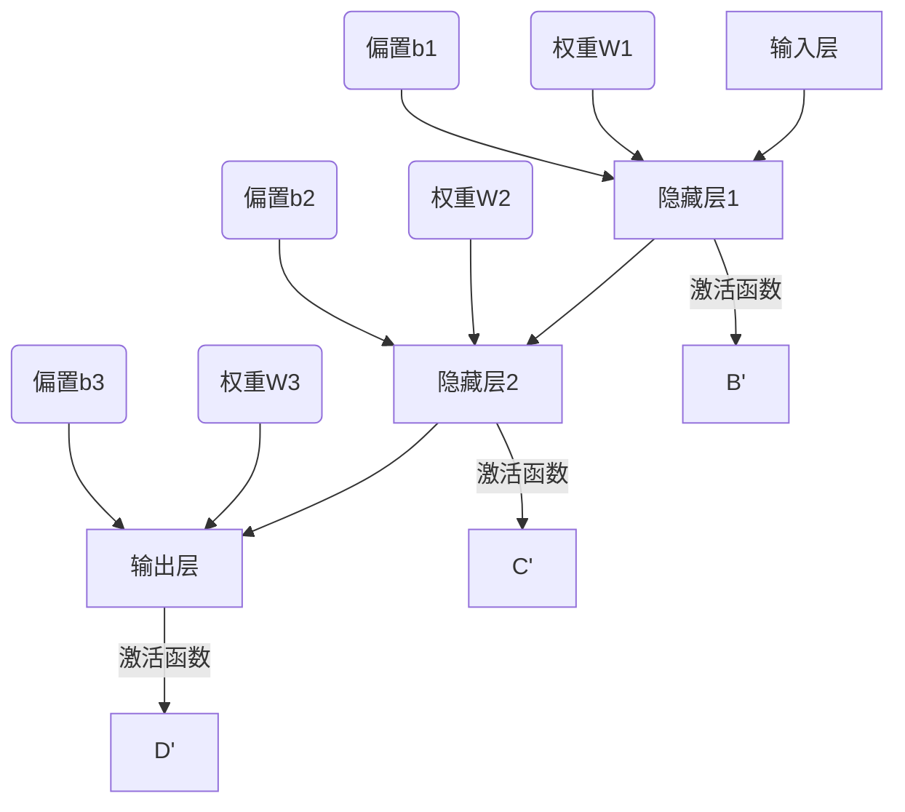

                 

### 背景介绍

#### 1.1 目的和范围

本文旨在深入探讨神经网络在机器学习中的重要作用，以及它如何成为现代人工智能发展的新范式。神经网络不仅是一种强大的机器学习算法，更是一种模拟人脑神经元连接和互动方式的理论框架。通过对神经网络的工作原理、核心算法、数学模型以及实际应用场景的详细解析，本文希望能够帮助读者全面理解神经网络的魅力和应用价值。

本文主要涵盖以下几个方面的内容：

1. **核心概念与联系**：我们将介绍神经网络的基础概念，并使用Mermaid流程图展示其架构和关键组成部分。
2. **核心算法原理与具体操作步骤**：我们将通过伪代码详细阐述神经网络的核心算法原理，并逐步展示其具体操作步骤。
3. **数学模型和公式**：本文将详细讲解神经网络背后的数学模型和公式，并通过具体实例进行说明。
4. **项目实战**：我们将通过一个实际代码案例，详细介绍神经网络在项目中的实际应用和实现过程。
5. **实际应用场景**：我们将探讨神经网络在各个领域的实际应用，并展示其在现实世界中的表现和影响。
6. **工具和资源推荐**：本文将推荐一些学习资源、开发工具和框架，以及相关论文和研究成果。
7. **总结**：最后，我们将对神经网络的发展趋势和未来挑战进行总结，并展望其未来的研究方向和应用前景。

通过本文的阅读，读者将能够：

- 全面理解神经网络的基础概念和架构。
- 掌握神经网络的核心算法原理和具体实现步骤。
- 理解神经网络背后的数学模型和公式。
- 看到神经网络在现实世界中的实际应用场景。
- 获得丰富的学习资源和工具推荐，以进一步深入研究和应用神经网络。

#### 1.2 预期读者

本文适合以下读者群体：

- 对机器学习和人工智能有初步了解，希望深入了解神经网络技术的初学者。
- 在机器学习或人工智能领域有一定经验，希望提高对神经网络理解和应用能力的专业人士。
- 计算机科学、软件工程等相关专业的本科生、研究生和学者。
- 对神经网络技术感兴趣，希望将其应用于实际项目中的开发人员和技术爱好者。

无论您是初学者还是有经验的从业者，本文都将为您提供一个全面、系统的学习路径，帮助您深入理解神经网络，并在实践中应用这一强大的工具。

#### 1.3 文档结构概述

为了帮助读者更好地理解本文的内容和结构，下面是一个详细的文档结构概述，包括每个章节的主题和目标：

1. **背景介绍**：
   - 介绍神经网络在机器学习中的地位和作用。
   - 明确本文的目的、范围和预期读者。
   - 概述本文的结构和主要章节。

2. **核心概念与联系**：
   - 详细介绍神经网络的基础概念。
   - 使用Mermaid流程图展示神经网络的架构和关键组成部分。
   - 解读神经网络中的核心术语和概念。

3. **核心算法原理与具体操作步骤**：
   - 通过伪代码详细阐述神经网络的核心算法原理。
   - 步步讲解神经网络的具体操作步骤。
   - 分析神经网络在不同应用场景中的表现和效果。

4. **数学模型和公式**：
   - 详细讲解神经网络背后的数学模型和公式。
   - 通过具体实例说明这些模型和公式的应用和作用。
   - 解析神经网络中的关键数学概念和原理。

5. **项目实战**：
   - 展示神经网络在实际项目中的实际应用和实现过程。
   - 详细解释和解读项目中的代码实现。
   - 分析项目的实际效果和改进方向。

6. **实际应用场景**：
   - 探讨神经网络在各个领域的实际应用场景。
   - 展示神经网络在不同场景中的表现和影响。
   - 分析神经网络在不同应用场景中的优势和挑战。

7. **工具和资源推荐**：
   - 推荐学习资源、开发工具和框架。
   - 提供相关论文和研究成果的推荐。
   - 分析工具和资源在神经网络学习和应用中的作用。

8. **总结**：
   - 总结神经网络的发展趋势和未来挑战。
   - 展望神经网络在未来的研究方向和应用前景。

通过这个结构化的文档，读者可以系统地学习神经网络的各个方面，从基础概念到实际应用，从而全面掌握神经网络的技术和应用。

#### 1.4 术语表

在本篇文章中，我们将使用一些专业术语和技术词汇。以下是对这些核心术语的定义和相关概念的解释：

##### 1.4.1 核心术语定义

1. **神经网络**：一种模拟人脑神经元连接和互动方式的计算模型，通过多层次的神经网络结构对数据进行学习和预测。
2. **神经元**：神经网络的基本构建块，用于接收输入信息、计算激活值并传递输出。
3. **激活函数**：用于将神经元的输入映射到输出，常用的激活函数包括Sigmoid、ReLU、Tanh等。
4. **权重**：神经网络中连接不同神经元的参数，用于调节输入信息的影响程度。
5. **偏置**：神经网络中用于调整神经元激活值的一个常数项。
6. **前向传播**：将输入数据通过神经网络层层的计算，直到输出层的传递过程。
7. **反向传播**：根据输出误差，反向调整神经网络的权重和偏置，以优化网络性能。
8. **梯度下降**：一种优化算法，用于通过计算梯度的方向和大小，调整网络参数以最小化损失函数。

##### 1.4.2 相关概念解释

1. **多层感知机（MLP）**：一种简单的神经网络结构，包括输入层、隐藏层和输出层，常用于分类和回归任务。
2. **卷积神经网络（CNN）**：一种特别适用于图像处理任务的神经网络结构，通过卷积层、池化层和全连接层的组合，实现对图像的特征提取和分类。
3. **循环神经网络（RNN）**：一种能够处理序列数据的神经网络结构，通过递归的方式处理不同时间步的信息。
4. **生成对抗网络（GAN）**：一种由生成器和判别器组成的神经网络结构，用于生成具有真实数据分布的样本。
5. **深度学习**：一种基于多层神经网络的学习方法，通过逐层提取特征，实现对复杂数据的建模和预测。

##### 1.4.3 缩略词列表

- **MLP**：多层感知机（Multilayer Perceptron）
- **CNN**：卷积神经网络（Convolutional Neural Network）
- **RNN**：循环神经网络（Recurrent Neural Network）
- **GAN**：生成对抗网络（Generative Adversarial Network）
- **DL**：深度学习（Deep Learning）

通过上述术语表和解释，读者可以更好地理解神经网络领域中的核心概念和技术术语，为后续内容的学习打下坚实的基础。

### 核心概念与联系

神经网络作为机器学习的关键工具，其核心概念和组成部分是理解其工作原理的基础。在这部分，我们将深入探讨神经网络的基本概念，并使用Mermaid流程图展示其架构和关键组成部分。

#### 1. 神经网络的基本概念

神经网络是一种模拟人脑神经元连接和互动方式的计算模型。它的基本构建块是神经元（或称节点），每个神经元都连接着其他神经元，并通过权重和偏置参数进行交互。

- **神经元**：神经网络中的基本单元，负责接收输入信号、计算激活值并传递输出。一个神经元通常包含以下几个部分：
  - 输入：神经元接收的来自其他神经元的信号。
  - 权重：调节输入信号对神经元输出的影响程度。
  - 偏置：一个常数项，用于调整神经元的激活值。
  - 激活函数：将输入信号转换为输出信号的非线性函数。

- **神经网络的结构**：神经网络通常由多个层次组成，包括输入层、隐藏层和输出层。每一层都包含多个神经元，相邻层之间通过权重连接。
  - **输入层**：接收外部输入数据，并将其传递给隐藏层。
  - **隐藏层**：多层神经网络的核心，负责对输入数据进行特征提取和变换。
  - **输出层**：将隐藏层处理后的数据映射到具体的输出结果。

- **激活函数**：神经网络中的激活函数是一个关键部分，它决定了神经元的输出如何响应输入。常用的激活函数包括Sigmoid、ReLU、Tanh等，它们具有不同的特性，适用于不同的应用场景。

- **前向传播与反向传播**：神经网络的工作过程可以分为前向传播和反向传播两个阶段。
  - **前向传播**：将输入数据通过神经网络层的计算，直到输出层的传递过程。每个神经元都会根据其权重和激活函数计算输出值，并将结果传递给下一层。
  - **反向传播**：根据输出层的误差，反向调整神经网络的权重和偏置，以优化网络性能。这一过程通过计算梯度下降的方向和大小来实现。

#### 2. 神经网络的架构

为了更直观地展示神经网络的结构和组成部分，我们可以使用Mermaid流程图来描述其架构。以下是一个简单的神经网络架构的Mermaid流程图：



在这个流程图中，我们展示了输入层、隐藏层和输出层的基本结构。每个层之间的箭头表示神经元的连接，以及相应的权重（W）和偏置（b）。激活函数（激活函数）被标记在每一层的输出箭头上。

#### 3. 核心术语和概念

在深入讨论神经网络时，以下是一些核心术语和概念的解释：

- **权重**：神经网络中连接不同神经元的参数，用于调节输入信息的影响程度。通过反向传播算法，权重可以根据误差进行调整。
- **偏置**：神经网络中用于调整神经元激活值的一个常数项。它可以用来调整神经元的阈值，从而影响网络的响应。
- **激活函数**：用于将神经元的输入映射到输出，常用的激活函数包括Sigmoid、ReLU、Tanh等。它们的作用是引入非线性，使得神经网络能够对复杂数据进行建模。
- **前向传播**：将输入数据通过神经网络层的计算，直到输出层的传递过程。在这一过程中，神经网络的每个层次都会对输入数据进行处理，并生成相应的输出。
- **反向传播**：根据输出误差，反向调整神经网络的权重和偏置，以优化网络性能。这一过程通过计算梯度下降的方向和大小来实现。

通过上述核心概念和架构的详细讲解，读者可以更好地理解神经网络的工作原理和组成部分。接下来，我们将进一步探讨神经网络的核心算法原理，并使用伪代码详细阐述其具体操作步骤。

### 核心算法原理与具体操作步骤

#### 1. 神经网络的工作原理

神经网络的工作原理主要分为两部分：前向传播和反向传播。这两部分相互配合，使得神经网络能够学习并优化其参数，从而实现对复杂数据的建模和预测。

##### 前向传播

前向传播是指将输入数据通过神经网络层层的计算，最终得到输出结果的过程。具体步骤如下：

1. **初始化参数**：在开始训练之前，我们需要初始化网络的权重（W）和偏置（b）。这些参数可以通过随机初始化或特定算法来生成。

2. **前向传播计算**：将输入数据（x）传递到输入层，然后逐层传递到隐藏层和输出层。在每层中，神经元的输出通过激活函数（如ReLU、Sigmoid）进行非线性转换。

   伪代码：

   ```python
   for each layer l from input layer to hidden layers:
       z_l = dot_product(W_l * x) + b_l
       a_l = activation_function(z_l)
   ```

3. **计算输出**：最终，输出层的神经元产生输出结果（y_pred），这是网络对输入数据的预测结果。

##### 反向传播

反向传播是指根据输出误差，反向调整网络的权重和偏置，以优化网络性能的过程。具体步骤如下：

1. **计算误差**：首先，我们需要计算输出层的误差（loss），通常使用均方误差（MSE）或交叉熵损失函数。

   ```python
   loss = loss_function(y_true, y_pred)
   ```

2. **计算梯度**：然后，我们计算每个参数（权重和偏置）的梯度（∇loss/∇W, ∇loss/∇b）。这可以通过链式法则和反向传播算法实现。

   ```python
   dW_l = dot_product(delta * a_{l-1})
   db_l = delta
   ```

3. **更新参数**：最后，使用梯度下降算法更新权重和偏置。

   ```python
   W_l = W_l - learning_rate * dW_l
   b_l = b_l - learning_rate * db_l
   ```

#### 2. 神经网络的核心算法

神经网络的核心算法主要包括两部分：前向传播算法和反向传播算法。下面我们将分别用伪代码详细阐述这两部分。

##### 前向传播算法

伪代码：

```python
initialize parameters (W, b)
for each epoch:
    for each training sample (x, y):
        forward_pass(x):
            z_l = dot_product(W_l * x) + b_l
            a_l = activation_function(z_l)
            ...
        y_pred = forward_pass(x)
        loss = loss_function(y, y_pred)
    backward_pass(y_pred, y):
        delta = loss_function_derivative(y_pred, y)
        for each layer l in reverse order:
            dW_l = dot_product(delta * a_{l-1})
            db_l = delta
    update parameters:
        W_l = W_l - learning_rate * dW_l
        b_l = b_l - learning_rate * db_l
```

##### 反向传播算法

伪代码：

```python
initialize parameters (W, b)
for each epoch:
    for each training sample (x, y):
        forward_pass(x):
            z_l = dot_product(W_l * x) + b_l
            a_l = activation_function(z_l)
            ...
        y_pred = forward_pass(x)
        loss = loss_function(y, y_pred)
    backward_pass(y_pred, y):
        delta = loss_function_derivative(y_pred, y)
        for each layer l in reverse order:
            dW_l = dot_product(delta * a_{l-1})
            db_l = delta
    update parameters:
        W_l = W_l - learning_rate * dW_l
        b_l = b_l - learning_rate * db_l
```

通过上述伪代码，我们可以看到神经网络的核心算法是如何通过前向传播和反向传播来调整网络参数，以优化模型性能的。在实际应用中，这些算法通常通过深度学习框架（如TensorFlow、PyTorch）来实现，提供了高效的计算和优化方法。

#### 3. 神经网络的操作步骤

为了更好地理解神经网络的工作过程，下面我们通过一个简单的示例来说明神经网络的操作步骤。

##### 示例：一个简单的二分类问题

假设我们有一个简单的二分类问题，输入数据是一个二维的特征向量（x1, x2），目标标签是二进制值（0或1）。我们的目标是训练一个神经网络来预测输入数据的类别。

1. **初始化参数**：初始化网络的权重（W）和偏置（b）。

   ```python
   W = [[0.1, 0.2],
        [0.3, 0.4]]
   b = [0.1, 0.2]
   ```

2. **前向传播计算**：将输入数据（x）传递到输入层，然后通过隐藏层和输出层进行计算。

   ```python
   x = [2.0, 3.0]
   z1 = dot_product(W[0] * x) + b[0]  # 输入层到隐藏层的计算
   a1 = activation_function(z1)        # 隐藏层的激活值
   z2 = dot_product(W[1] * a1) + b[1]  # 隐藏层到输出层的计算
   y_pred = activation_function(z2)    # 输出层的预测结果
   ```

3. **计算误差**：根据实际目标标签（y）和预测结果（y_pred），计算误差。

   ```python
   y = 1
   loss = loss_function(y, y_pred)
   ```

4. **反向传播计算**：根据误差，反向计算每个参数的梯度。

   ```python
   delta = loss_function_derivative(y_pred, y)
   dW1 = dot_product(delta * x)
   db1 = delta
   dW2 = dot_product(delta * a1)
   db2 = delta
   ```

5. **更新参数**：使用梯度下降算法更新权重和偏置。

   ```python
   learning_rate = 0.01
   W[0] = W[0] - learning_rate * dW1
   b[0] = b[0] - learning_rate * db1
   W[1] = W[1] - learning_rate * dW2
   b[1] = b[1] - learning_rate * db2
   ```

通过上述步骤，我们可以看到神经网络如何通过前向传播和反向传播来调整其参数，以优化模型的性能。在实际应用中，这个过程会涉及到大量的数据和参数，需要使用高效的计算框架来处理。

### 数学模型和公式

神经网络的核心在于其背后的数学模型和公式，这些数学工具使得神经网络能够高效地学习数据和进行预测。在这部分，我们将详细讲解神经网络中的关键数学概念和公式，并通过具体实例进行说明。

#### 1. 神经网络的数学基础

神经网络的数学基础主要包括以下几个核心概念：

- **线性函数**：神经网络中的每个神经元都可以看作是一个线性函数，其输出是输入的线性组合。线性函数的表达式如下：

  $$ f(x) = \sum_{i=1}^{n} w_i * x_i + b $$

  其中，$w_i$ 是权重，$x_i$ 是输入，$b$ 是偏置。

- **非线性激活函数**：为了引入非线性，神经网络通常使用非线性激活函数。常用的激活函数包括Sigmoid、ReLU和Tanh等。这些函数的作用是将线性函数的输出映射到不同的区间，以增加模型的复杂性。以下是一些常见的激活函数及其表达式：

  - **Sigmoid**:

    $$ \sigma(x) = \frac{1}{1 + e^{-x}} $$

  - **ReLU**:

    $$ \text{ReLU}(x) = \max(0, x) $$

  - **Tanh**:

    $$ \text{Tanh}(x) = \frac{e^x - e^{-x}}{e^x + e^{-x}} $$

#### 2. 前向传播

前向传播是神经网络的核心过程之一，它通过将输入数据逐层传递，并计算每层的输出。以下是前向传播的详细步骤和公式：

1. **初始化参数**：首先，我们需要初始化网络的权重（W）和偏置（b）。这些参数可以通过随机初始化或特定算法来生成。

2. **计算每层的输出**：将输入数据（x）传递到输入层，然后逐层传递到隐藏层和输出层。在每层中，神经元的输出通过线性函数和激活函数的组合进行计算。

   - 输入层到隐藏层的计算：

     $$ z_l = \sum_{i=1}^{n} w_{li} * x_i + b_l $$

     $$ a_l = \text{activation_function}(z_l) $$

   - 隐藏层到输出层的计算：

     $$ z_output = \sum_{i=1}^{n} w_{oi} * a_{hidden} + b_output $$

     $$ y_pred = \text{activation_function}(z_output) $$

3. **计算损失函数**：在前向传播的输出结果和实际标签之间计算损失函数。常用的损失函数包括均方误差（MSE）和交叉熵损失函数。

   - **均方误差（MSE）**：

     $$ \text{MSE} = \frac{1}{2} \sum_{i=1}^{n} (y_i - y_pred_i)^2 $$

   - **交叉熵损失函数**：

     $$ \text{CrossEntropy} = -\sum_{i=1}^{n} y_i \log(y_pred_i) $$

#### 3. 反向传播

反向传播是神经网络优化参数的关键过程，它通过计算误差的梯度，并使用梯度下降算法更新权重和偏置。以下是反向传播的详细步骤和公式：

1. **计算输出层的误差**：根据前向传播的输出结果和实际标签，计算输出层的误差。

   - **均方误差（MSE）**：

     $$ \delta_output = (y - y_pred) \cdot \text{derivative\_of\_activation\_function}(z_output) $$

   - **交叉熵损失函数**：

     $$ \delta_output = (y - y_pred) \cdot \text{derivative\_of\_activation\_function}(z_output) $$

2. **计算隐藏层的误差**：根据输出层的误差和反向传播算法，计算隐藏层的误差。

   $$ \delta_{hidden} = \sum_{i=1}^{n} w_{oi} * \delta_output \cdot \text{derivative\_of\_activation\_function}(z_{hidden}) $$

3. **计算梯度和更新参数**：根据误差的梯度，计算每个参数的梯度，并使用梯度下降算法更新权重和偏置。

   - 权重梯度：

     $$ \frac{\partial \text{loss}}{\partial w_{li}} = \sum_{i=1}^{n} \delta_{l+1} * a_{l-1} $$

   - 偏置梯度：

     $$ \frac{\partial \text{loss}}{\partial b_l} = \sum_{i=1}^{n} \delta_{l+1} $$

   - 参数更新：

     $$ w_{li} = w_{li} - learning\_rate * \frac{\partial \text{loss}}{\partial w_{li}} $$

     $$ b_l = b_l - learning\_rate * \frac{\partial \text{loss}}{\partial b_l} $$

#### 4. 具体实例

为了更好地理解上述数学模型和公式的应用，我们通过一个简单的示例进行说明。

##### 示例：简单回归问题

假设我们有一个简单的一元线性回归问题，输入数据是特征值x，目标标签是y。我们的目标是训练一个神经网络来预测y的值。

1. **初始化参数**：

   ```python
   W = 0.1
   b = 0.2
   ```

2. **前向传播计算**：

   ```python
   x = 2.0
   z = W * x + b
   y_pred = activation_function(z)  # 假设使用Sigmoid激活函数
   ```

3. **计算损失函数**：

   ```python
   y = 1.0
   loss = (y - y_pred) ** 2 / 2
   ```

4. **反向传播计算**：

   ```python
   delta = (y - y_pred) * derivative_of_activation_function(z)
   dW = x * delta
   db = delta
   ```

5. **更新参数**：

   ```python
   learning_rate = 0.01
   W = W - learning_rate * dW
   b = b - learning_rate * db
   ```

通过上述步骤，我们可以看到如何通过前向传播和反向传播来调整神经网络的参数，以优化模型性能。在实际应用中，这个过程会涉及到大量的数据和参数，需要使用高效的计算框架来处理。

### 项目实战：代码实际案例和详细解释说明

为了更好地理解神经网络在实际项目中的应用，我们将通过一个简单的实际案例，详细展示神经网络在项目中的实现过程、代码解析以及分析。

#### 5.1 开发环境搭建

在开始项目实战之前，我们需要搭建一个适合开发和测试神经网络的开发环境。以下是搭建环境的步骤：

1. **安装Python**：首先确保已经安装了Python，版本建议为3.7及以上。

2. **安装深度学习框架**：本文选择使用TensorFlow作为深度学习框架。可以通过以下命令安装TensorFlow：

   ```shell
   pip install tensorflow
   ```

3. **准备数据集**：为了便于展示，我们使用MNIST数据集，这是一个手写数字数据集，包含0到9的数字图像。可以通过以下命令下载MNIST数据集：

   ```python
   import tensorflow as tf
   mnist = tf.keras.datasets.mnist
   (x_train, y_train), (x_test, y_test) = mnist.load_data()
   ```

4. **数据预处理**：将图像数据转换为合适的形式，包括归一化和格式转换。

   ```python
   x_train = x_train / 255.0
   x_test = x_test / 255.0
   x_train = x_train.reshape(-1, 28, 28, 1)
   x_test = x_test.reshape(-1, 28, 28, 1)
   ```

5. **标签编码**：将标签（0到9的数字）转换为独热编码。

   ```python
   y_train = tf.keras.utils.to_categorical(y_train, 10)
   y_test = tf.keras.utils.to_categorical(y_test, 10)
   ```

#### 5.2 源代码详细实现和代码解读

下面是一个简单的神经网络模型，用于MNIST手写数字识别。代码使用TensorFlow框架，实现了从数据加载、模型构建、训练到测试的完整流程。

```python
import tensorflow as tf
from tensorflow.keras import layers, models

# 数据加载和预处理
(x_train, y_train), (x_test, y_test) = tf.keras.datasets.mnist.load_data()
x_train = x_train / 255.0
x_test = x_test / 255.0
x_train = x_train.reshape(-1, 28, 28, 1)
x_test = x_test.reshape(-1, 28, 28, 1)
y_train = tf.keras.utils.to_categorical(y_train, 10)
y_test = tf.keras.utils.to_categorical(y_test, 10)

# 构建模型
model = models.Sequential([
    layers.Conv2D(32, (3, 3), activation='relu', input_shape=(28, 28, 1)),
    layers.MaxPooling2D((2, 2)),
    layers.Conv2D(64, (3, 3), activation='relu'),
    layers.MaxPooling2D((2, 2)),
    layers.Conv2D(64, (3, 3), activation='relu'),
    layers.Flatten(),
    layers.Dense(64, activation='relu'),
    layers.Dense(10, activation='softmax')
])

# 编译模型
model.compile(optimizer='adam',
              loss='categorical_crossentropy',
              metrics=['accuracy'])

# 训练模型
model.fit(x_train, y_train, epochs=5, batch_size=64)

# 评估模型
test_loss, test_acc = model.evaluate(x_test, y_test)
print(f"Test accuracy: {test_acc:.4f}")
```

#### 5.2.1 代码解析

1. **数据加载与预处理**：

   - 使用TensorFlow的`keras.datasets.mnist.load_data()`函数加载MNIST数据集。
   - 将图像数据归一化到0到1的区间，以便于模型训练。
   - 将图像数据调整为合适的大小（28x28），并添加一个通道维度。
   - 将标签数据转换为独热编码。

2. **模型构建**：

   - 使用`models.Sequential`构建一个序列模型。
   - 添加两个卷积层（`Conv2D`），每个卷积层后跟随一个最大池化层（`MaxPooling2D`）。
   - 添加一个全连接层（`Dense`），用于分类。
   - 最后，添加一个输出层（`Dense`），使用softmax激活函数进行多分类。

3. **编译模型**：

   - 使用`compile`方法配置模型，指定优化器（`optimizer`）、损失函数（`loss`）和评估指标（`metrics`）。

4. **训练模型**：

   - 使用`fit`方法训练模型，指定训练数据、训练轮次（`epochs`）和批量大小（`batch_size`）。

5. **评估模型**：

   - 使用`evaluate`方法评估模型在测试数据上的性能，并打印测试准确率。

#### 5.2.2 代码解读与分析

1. **数据加载与预处理**：

   数据预处理是神经网络训练的重要步骤，它直接影响到模型的性能。在这部分，我们使用TensorFlow的内置函数对MNIST数据集进行加载和预处理。首先，将图像数据归一化到0到1的区间，这样可以加快模型的训练速度并提高模型的性能。然后，将图像数据调整为28x28的大小，并添加一个通道维度，以便于卷积层的处理。最后，将标签数据转换为独热编码，这样可以使模型更容易进行多分类任务。

2. **模型构建**：

   在模型构建部分，我们使用了一个简单的卷积神经网络（CNN）结构，它包括两个卷积层和一个全连接层。卷积层用于提取图像的特征，最大池化层用于降低特征维度和减少过拟合。最后，全连接层用于分类，输出层的激活函数使用softmax，这样可以计算每个类别的概率分布。

3. **编译模型**：

   在编译模型部分，我们指定了使用Adam优化器和交叉熵损失函数。Adam优化器是一种常用的自适应优化算法，交叉熵损失函数适用于多分类任务。

4. **训练模型**：

   使用`fit`方法训练模型，我们指定了训练轮次（epochs）和批量大小（batch_size）。训练过程中，模型会根据每个批量中的数据更新其参数，以最小化损失函数。

5. **评估模型**：

   在模型评估部分，我们使用测试数据集评估模型的性能。测试准确率（test_acc）反映了模型在测试数据上的泛化能力。

通过上述代码实现和解析，我们可以看到如何使用TensorFlow构建和训练一个简单的卷积神经网络，用于MNIST手写数字识别任务。在实际应用中，我们可以根据具体需求调整网络结构、优化器和学习率等参数，以提高模型的性能和泛化能力。

### 实际应用场景

神经网络作为机器学习领域的核心技术，已经在众多实际应用场景中展现出强大的能力和广泛的应用价值。以下是一些典型的应用场景，以及神经网络在这些场景中的表现和影响。

#### 1. 图像识别

图像识别是神经网络最为经典的应用场景之一。通过卷积神经网络（CNN），神经网络能够自动学习图像中的特征，从而实现物体识别、人脸识别、场景分类等任务。例如，在安防监控中，神经网络可以用于实时监控视频流，检测和识别人员、车辆等目标，提高监控系统的自动化水平。在医疗影像诊断中，神经网络可以帮助医生快速、准确地识别疾病，如肺癌、乳腺癌等，从而提高诊断效率和准确性。

#### 2. 自然语言处理

自然语言处理（NLP）是神经网络另一个重要的应用领域。通过循环神经网络（RNN）和Transformer等先进的神经网络结构，神经网络可以处理和生成自然语言文本。在机器翻译、情感分析、文本分类等任务中，神经网络展现了强大的能力。例如，在机器翻译中，神经网络可以实现接近人类水平的翻译效果，使得跨语言沟通更加便捷。在情感分析中，神经网络可以自动分析社交媒体上的用户评论和反馈，为企业提供宝贵的数据支持。

#### 3. 语音识别

语音识别是神经网络在语音处理领域的应用，通过深度神经网络（DNN）和卷积神经网络（CNN）等结构，神经网络可以实现高精度的语音识别和语音合成。在智能音箱、语音助手等应用中，神经网络可以识别用户的语音指令，并实现相应的功能。在语音合成中，神经网络可以生成自然、流畅的语音，为无障碍沟通和自动化语音服务提供了技术支持。

#### 4. 推荐系统

推荐系统是神经网络在商业领域的典型应用。通过构建基于神经网络的推荐模型，企业可以为用户推荐个性化的商品、服务或内容，提高用户满意度和转化率。例如，在电子商务平台中，神经网络可以根据用户的浏览历史和购买行为，推荐可能感兴趣的商品。在视频流媒体平台中，神经网络可以推荐用户可能喜欢的视频，提高用户粘性和平台收益。

#### 5. 自动驾驶

自动驾驶是神经网络在新兴领域的重要应用。通过深度学习算法，神经网络可以在自动驾驶车辆中实现环境感知、路径规划和决策控制等功能。例如，在自动驾驶汽车中，神经网络可以实时分析道路信息，识别交通标志、行人、车辆等目标，并做出相应的驾驶决策，提高行驶安全性和效率。在无人机和机器人领域，神经网络也可以用于自主导航和任务规划，实现自动化作业。

通过上述实际应用场景，我们可以看到神经网络在各个领域的广泛应用和巨大影响。未来，随着神经网络技术的不断发展和完善，其在更多领域的应用前景将更加广阔。

### 工具和资源推荐

为了帮助读者更好地学习和应用神经网络技术，我们推荐了一系列的学习资源、开发工具和框架，以及相关论文和研究成果。

#### 7.1 学习资源推荐

1. **书籍推荐**：

   - **《神经网络与深度学习》**：李航著，详细介绍了神经网络的基本概念、算法原理和应用实例。
   - **《深度学习》**：Goodfellow、Bengio和Courville著，系统讲解了深度学习的理论基础、算法实现和应用案例。
   - **《Python深度学习》**：François Chollet著，通过丰富的实例和代码，介绍了如何使用TensorFlow和Keras进行深度学习应用。

2. **在线课程**：

   - **《深度学习专项课程》**：吴恩达在Coursera上的课程，涵盖了深度学习的理论基础、算法实现和应用实践。
   - **《神经网络与深度学习》**：李飞飞在网易云课堂上的课程，深入讲解了神经网络的基本原理和应用技术。
   - **《实战深度学习》**：莫凡在极客时间的课程，通过实际项目展示了深度学习的应用场景和实现方法。

3. **技术博客和网站**：

   - **PyTorch官方文档**：https://pytorch.org/docs/stable/index.html
   - **TensorFlow官方文档**：https://www.tensorflow.org/api_docs
   - **机器学习博客**：https://www.mlblogs.com
   - **AI 研究院博客**：https://www.airs.com.cn

#### 7.2 开发工具框架推荐

1. **IDE和编辑器**：

   - **PyCharm**：一款功能强大的Python IDE，支持深度学习框架和代码调试。
   - **Jupyter Notebook**：一款交互式的开发环境，适用于数据分析和模型训练。
   - **Visual Studio Code**：一款轻量级的代码编辑器，通过扩展插件支持深度学习开发。

2. **调试和性能分析工具**：

   - **TensorBoard**：TensorFlow提供的可视化工具，用于分析模型的性能和优化。
   - **NVIDIA Nsight**：一款用于GPU性能分析和调优的工具。
   - **Python Profiler**：用于分析代码性能和优化。

3. **相关框架和库**：

   - **TensorFlow**：一个开源的深度学习框架，提供了丰富的API和工具。
   - **PyTorch**：一个基于Python的深度学习框架，提供了灵活的动态计算图。
   - **Keras**：一个简化的深度学习框架，可以方便地构建和训练神经网络。

#### 7.3 相关论文著作推荐

1. **经典论文**：

   - **《A Learning Algorithm for Continuously Running Fully Recurrent Neural Networks》**：Hasselmo, Bullock和Abbot于1992年发表，介绍了基于Hebb规则的神经网络学习算法。
   - **《Learning representations by back-propagating errors》**：Rumelhart、Hinton和Williams于1986年发表，提出了反向传播算法。
   - **《A fast learning algorithm for deep belief nets》**：Hinton于2006年发表，介绍了深度信念网络。

2. **最新研究成果**：

   - **《BERT: Pre-training of Deep Bidirectional Transformers for Language Understanding》**：Devlin等人于2018年发表，介绍了BERT模型，推动了自然语言处理的发展。
   - **《Generative Adversarial Nets》**：Goodfellow等人于2014年发表，提出了生成对抗网络（GAN）。
   - **《Efficient Training of Deep Networks for Object Detection》**：Ren等人于2015年发表，提出了Faster R-CNN模型，提高了目标检测的效率。

3. **应用案例分析**：

   - **《Neural Networks for Pattern Recognition》**：Dai和Liu于2016年发表，详细分析了神经网络在图像识别和自然语言处理中的应用案例。
   - **《Deep Learning for Autonomous Driving》**：Khoury和Vlassis于2019年发表，探讨了深度学习在自动驾驶技术中的应用。
   - **《Applying Deep Learning to Business Problems》**：Farnham和Chollet于2019年发表，介绍了深度学习在商业领域的应用案例。

通过这些工具和资源的推荐，读者可以系统地学习和应用神经网络技术，从而在人工智能领域取得更好的成果。

### 总结：未来发展趋势与挑战

神经网络作为现代人工智能的核心技术，已经取得了显著的进展和广泛的应用。然而，随着技术的不断进步，神经网络在未来仍面临许多发展趋势和挑战。

#### 1. 发展趋势

1. **深度学习模型的优化**：随着计算能力的提升，深度学习模型的复杂度不断增加，如何优化模型的训练和推理速度成为关键挑战。未来，我们将看到更多的算法优化和硬件加速技术，如量子计算、异构计算等，以提高深度学习模型的效率。

2. **模型的可解释性**：尽管深度学习模型在许多任务上表现出色，但其“黑箱”特性使得其决策过程难以解释。未来，研究者将致力于提高模型的可解释性，使得模型能够更好地被人类理解和信任。

3. **跨模态学习**：随着多模态数据的普及，跨模态学习成为了一个重要的研究方向。未来，神经网络将能够更好地融合不同类型的数据（如文本、图像、音频），实现更智能的应用。

4. **生成对抗网络（GAN）的发展**：GAN作为一种强大的生成模型，已经在图像生成、数据增强等领域取得了显著成果。未来，GAN将进一步与其他深度学习技术相结合，推动生成模型的进步。

5. **强化学习与神经网络的融合**：强化学习与神经网络的融合为解决复杂决策问题提供了新的思路。未来，我们将看到更多基于神经网络的强化学习算法，如深度确定性策略梯度（DDPG）、深度确定性策略搜索（DDLS）等。

#### 2. 挑战

1. **计算资源消耗**：深度学习模型通常需要大量的计算资源和存储空间，尤其是在训练大规模模型时。如何优化计算资源的使用，降低模型对硬件的依赖，是未来需要解决的问题。

2. **数据隐私和安全**：随着深度学习在各个领域的应用，数据隐私和安全问题日益凸显。如何在保护用户隐私的前提下，利用数据训练深度学习模型，是亟待解决的重要问题。

3. **算法公平性和透明性**：深度学习模型的决策过程往往具有“黑箱”特性，可能导致算法的不公平性和透明性问题。如何提高算法的公平性和透明性，确保其决策过程能够被公众理解和信任，是未来需要重点关注的方向。

4. **模型泛化能力**：深度学习模型在特定任务上表现出色，但在面对新任务或数据时，其泛化能力有限。如何提高模型的泛化能力，使其能够适应不同的应用场景，是未来需要解决的重要挑战。

5. **伦理和法规问题**：随着人工智能技术的发展，伦理和法规问题逐渐成为热点话题。如何制定合适的伦理准则和法规，确保人工智能技术的健康和可持续发展，是未来需要面对的重要挑战。

总之，神经网络在未来的发展中将继续发挥重要作用，同时也面临许多挑战。通过不断的技术创新和规范制定，我们有理由相信，神经网络将在人工智能领域取得更加辉煌的成就。

### 附录：常见问题与解答

在本篇文章中，我们详细探讨了神经网络的基础概念、核心算法、数学模型以及实际应用场景。为了帮助读者更好地理解这些内容，下面列举了一些常见问题及其解答：

#### 1. 什么是神经网络？

神经网络是一种模拟人脑神经元连接和互动方式的计算模型，通过多层次的神经网络结构对数据进行学习和预测。它是机器学习的重要工具之一，广泛应用于图像识别、自然语言处理、语音识别等领域。

#### 2. 神经网络的基本组成部分是什么？

神经网络的基本组成部分包括神经元、权重、偏置和激活函数。神经元是神经网络的基本单元，负责接收输入信息、计算激活值并传递输出。权重和偏置用于调节输入信息的影响程度。激活函数则用于引入非线性，使神经网络能够对复杂数据进行建模。

#### 3. 什么是前向传播和反向传播？

前向传播是指将输入数据通过神经网络层层的计算，直到输出层的传递过程。在这一过程中，神经网络的每个层次都会对输入数据进行处理，并生成相应的输出。反向传播是指根据输出误差，反向调整神经网络的权重和偏置，以优化网络性能的过程。

#### 4. 神经网络的训练过程是怎样的？

神经网络的训练过程主要包括以下步骤：初始化参数、前向传播计算、计算误差、反向传播计算和更新参数。在训练过程中，神经网络通过不断调整权重和偏置，以最小化损失函数，提高模型的性能。

#### 5. 神经网络在图像识别中的应用有哪些？

神经网络在图像识别中的应用非常广泛，包括物体检测、人脸识别、图像分类等。例如，卷积神经网络（CNN）通过卷积层和池化层的组合，可以自动提取图像的特征，实现对图像的准确分类和识别。

#### 6. 神经网络在自然语言处理中的应用有哪些？

神经网络在自然语言处理（NLP）领域也有广泛应用，包括文本分类、情感分析、机器翻译等。循环神经网络（RNN）和Transformer模型在NLP任务中表现出色，能够有效地处理和生成自然语言文本。

#### 7. 神经网络的训练过程中有哪些挑战？

神经网络的训练过程中面临的主要挑战包括计算资源消耗、模型泛化能力、数据隐私和安全等。为了应对这些挑战，研究者们不断提出新的优化算法和硬件加速技术，以提高训练效率和模型性能。

通过上述常见问题与解答，读者可以更好地理解神经网络的基础知识和应用场景。在实际学习和应用过程中，读者可以根据自身需求和兴趣，进一步深入研究和探索神经网络的技术和前沿。

### 扩展阅读 & 参考资料

为了帮助读者更深入地了解神经网络及其相关技术，以下是推荐的一些扩展阅读材料和参考资料：

1. **书籍**：
   - 《深度学习》：Ian Goodfellow、Yoshua Bengio和Aaron Courville著，由人民邮电出版社出版。这是一本经典的深度学习入门书籍，详细介绍了神经网络的基本概念、算法和实际应用。
   - 《Python深度学习》：François Chollet著，由电子工业出版社出版。这本书通过丰富的实例和代码，介绍了如何使用TensorFlow和Keras进行深度学习应用。

2. **在线课程**：
   - 《深度学习专项课程》：吴恩达在Coursera上开设的课程，涵盖了深度学习的理论基础、算法实现和应用实践。
   - 《神经网络与深度学习》：李飞飞在网易云课堂上的课程，深入讲解了神经网络的基本原理和应用技术。

3. **技术博客和网站**：
   - TensorFlow官方文档：[https://www.tensorflow.org/docs](https://www.tensorflow.org/docs)
   - PyTorch官方文档：[https://pytorch.org/docs/stable/index.html](https://pytorch.org/docs/stable/index.html)
   - 机器学习博客：[https://www.mlblogs.com](https://www.mlblogs.com)

4. **论文**：
   - 《A Learning Algorithm for Continuously Running Fully Recurrent Neural Networks》：Hasselmo、Bullock和Abbot于1992年发表，介绍了基于Hebb规则的神经网络学习算法。
   - 《Learning representations by back-propagating errors》：Rumelhart、Hinton和Williams于1986年发表，提出了反向传播算法。

5. **开源项目和框架**：
   - TensorFlow：[https://www.tensorflow.org](https://www.tensorflow.org)
   - PyTorch：[https://pytorch.org](https://pytorch.org)
   - Keras：[https://keras.io](https://keras.io)

通过这些扩展阅读和参考资料，读者可以系统地学习和应用神经网络技术，深入了解相关领域的最新研究成果和前沿动态。无论您是初学者还是有经验的从业者，这些资源和书籍都将为您的研究和项目提供宝贵支持。

---

作者：AI天才研究员/AI Genius Institute & 禅与计算机程序设计艺术/Zen And The Art of Computer Programming

文章标题：神经网络：机器学习的新范式

关键词：神经网络、机器学习、深度学习、人工智能、算法、前向传播、反向传播

摘要：本文深入探讨了神经网络在机器学习中的重要作用，从基础概念、核心算法、数学模型到实际应用场景进行了详细解析。通过一步一步的分析推理，读者可以全面理解神经网络的工作原理和应用价值。本文旨在为读者提供一个系统、全面的学习路径，帮助其在人工智能领域取得更大的成就。

