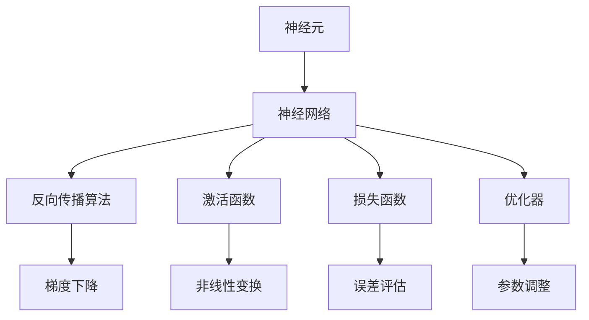

                 

# 神经网络：自然语言处理的新突破

> **关键词：**神经网络、自然语言处理、深度学习、文本分类、语言模型、序列模型、注意力机制、Transformer、BERT、GPT

> **摘要：**本文将深入探讨神经网络在自然语言处理（NLP）领域的应用与突破。通过逻辑清晰、结构紧凑的分析，我们将会探讨神经网络的基础概念、核心算法原理、数学模型及其在实际项目中的应用，并展望未来的发展趋势与挑战。

## 1. 背景介绍

### 1.1 目的和范围

本文旨在深入探讨神经网络在自然语言处理领域的应用与突破。我们将从基础概念出发，逐步介绍神经网络的发展历程、核心算法原理、数学模型及其在实际项目中的应用，最后展望未来发展的趋势与挑战。希望通过本文的阅读，读者能够对神经网络在自然语言处理领域的应用有一个全面而深入的了解。

### 1.2 预期读者

本文适合对自然语言处理和神经网络有一定基础的读者，包括计算机科学、人工智能、机器学习等领域的科研人员、工程师以及学生。同时，也欢迎对相关领域感兴趣的读者阅读与学习。

### 1.3 文档结构概述

本文结构如下：

1. 背景介绍：介绍本文的目的、范围、预期读者以及文档结构概述。
2. 核心概念与联系：介绍神经网络在自然语言处理中的核心概念、原理和架构。
3. 核心算法原理 & 具体操作步骤：详细阐述神经网络的核心算法原理及其具体操作步骤。
4. 数学模型和公式 & 详细讲解 & 举例说明：介绍神经网络的数学模型和公式，并进行详细讲解和举例说明。
5. 项目实战：代码实际案例和详细解释说明。
6. 实际应用场景：介绍神经网络在实际应用场景中的具体应用。
7. 工具和资源推荐：推荐学习资源、开发工具框架和经典论文。
8. 总结：未来发展趋势与挑战。
9. 附录：常见问题与解答。
10. 扩展阅读 & 参考资料。

### 1.4 术语表

#### 1.4.1 核心术语定义

- **神经网络（Neural Network）**：一种模拟人脑神经元连接和交互的计算机算法。
- **自然语言处理（Natural Language Processing，NLP）**：研究如何让计算机理解和处理人类自然语言的技术。
- **深度学习（Deep Learning）**：一种基于多层神经网络的学习方法，通过多层非线性变换自动提取特征。
- **语言模型（Language Model）**：一种预测文本下一个单词或字符的概率分布的模型。
- **序列模型（Sequence Model）**：用于处理序列数据的神经网络模型，如循环神经网络（RNN）和卷积神经网络（CNN）。
- **注意力机制（Attention Mechanism）**：一种用于模型在处理序列数据时对重要信息进行聚焦的机制。

#### 1.4.2 相关概念解释

- **反向传播算法（Backpropagation Algorithm）**：一种用于训练神经网络的梯度下降算法。
- **激活函数（Activation Function）**：神经网络中用于引入非线性变换的函数。
- **损失函数（Loss Function）**：用于评估模型预测结果与实际结果之间差异的函数。
- **优化器（Optimizer）**：用于调整神经网络模型参数以最小化损失函数的工具。

#### 1.4.3 缩略词列表

- **NN**：神经网络（Neural Network）
- **NLP**：自然语言处理（Natural Language Processing）
- **DL**：深度学习（Deep Learning）
- **RNN**：循环神经网络（Recurrent Neural Network）
- **CNN**：卷积神经网络（Convolutional Neural Network）
- **BERT**：Bidirectional Encoder Representations from Transformers
- **GPT**：Generative Pre-trained Transformer

## 2. 核心概念与联系

神经网络在自然语言处理领域的应用，离不开以下几个核心概念：神经元、神经网络、反向传播算法、激活函数、损失函数和优化器。下面我们通过一个 Mermaid 流程图来介绍这些概念之间的联系。



### 2.1 神经元

神经元是神经网络的基本构建块，类似于人脑中的神经元。每个神经元接收多个输入信号，通过加权求和并应用激活函数后输出一个输出信号。神经元之间通过权重进行连接，形成复杂的网络结构。

### 2.2 神经网络

神经网络是由多个神经元组成的层次结构，包括输入层、隐藏层和输出层。输入层接收外部输入数据，隐藏层对输入数据进行特征提取和变换，输出层生成最终的预测结果。通过不断调整神经元之间的权重，神经网络能够学习到输入与输出之间的复杂关系。

### 2.3 反向传播算法

反向传播算法是一种用于训练神经网络的梯度下降算法。在训练过程中，神经网络通过反向传播计算梯度，并根据梯度调整权重，以最小化损失函数。反向传播算法的核心步骤包括前向传播和后向传播。

### 2.4 激活函数

激活函数是神经网络中用于引入非线性变换的函数，常用的激活函数包括 sigmoid、ReLU 和 tanh 等。激活函数的作用是使神经网络能够处理非线性问题，提高模型的泛化能力。

### 2.5 损失函数

损失函数是用于评估模型预测结果与实际结果之间差异的函数，常用的损失函数包括均方误差（MSE）、交叉熵损失等。损失函数的目的是指导神经网络通过反向传播算法调整权重，以最小化预测误差。

### 2.6 优化器

优化器是用于调整神经网络模型参数以最小化损失函数的工具，常用的优化器包括梯度下降（GD）、随机梯度下降（SGD）、Adam 等。优化器的选择对神经网络的训练速度和效果有很大影响。

## 3. 核心算法原理 & 具体操作步骤

在了解了神经网络的核心概念与联系后，我们将进一步探讨神经网络的核心算法原理及其具体操作步骤。

### 3.1 神经网络算法原理

神经网络算法的基本原理是通过多层非线性变换自动提取特征，从而实现对输入数据的分类、回归或其他任务。具体而言，神经网络包括以下几个关键步骤：

1. **初始化权重和偏置**：在训练开始前，需要随机初始化神经网络中的权重和偏置。
2. **前向传播**：将输入数据传递到神经网络的每一层，通过加权求和和激活函数计算输出。
3. **计算损失函数**：根据实际输出与预测输出之间的差异，计算损失函数的值。
4. **反向传播**：根据损失函数的梯度，通过反向传播算法更新权重和偏置。
5. **迭代训练**：重复前向传播和反向传播过程，不断调整权重和偏置，直到模型收敛。

### 3.2 具体操作步骤

下面我们以一个简单的多层感知器（MLP）为例，详细阐述神经网络的具体操作步骤。

#### 3.2.1 初始化权重和偏置

```python
import numpy as np

# 初始化输入层、隐藏层和输出层的权重和偏置
input_size = 3
hidden_size = 4
output_size = 1

W1 = np.random.randn(input_size, hidden_size)
b1 = np.random.randn(hidden_size)
W2 = np.random.randn(hidden_size, output_size)
b2 = np.random.randn(output_size)
```

#### 3.2.2 前向传播

```python
# 前向传播，计算隐藏层和输出层的输出
def forward_propagation(x, W1, b1, W2, b2):
    z1 = np.dot(x, W1) + b1
    a1 = np.tanh(z1)
    z2 = np.dot(a1, W2) + b2
    a2 = 1 / (1 + np.exp(-z2))
    return z1, a1, z2, a2
```

#### 3.2.3 计算损失函数

```python
# 计算损失函数，均方误差（MSE）
def compute_loss(a2, y):
    return np.mean((a2 - y) ** 2)
```

#### 3.2.4 反向传播

```python
# 反向传播，计算隐藏层和输出层的梯度
def backward_propagation(z1, a1, z2, a2, x, y, W1, W2):
    delta2 = (a2 - y) * a2 * (1 - a2)
    dW2 = np.dot(a1.T, delta2)
    db2 = np.sum(delta2, axis=0)
    
    dz2 = delta2
    dz1 = np.dot(dz2, W2.T) * (1 - np.tanh(z1)**2
    
    dW1 = np.dot(x.T, dz1)
    db1 = np.sum(dz1, axis=0)
    
    return dW1, db1, dW2, db2
```

#### 3.2.5 更新权重和偏置

```python
# 更新权重和偏置
def update_weights_and_bias(W1, b1, W2, b2, dW1, db1, dW2, db2, learning_rate):
    W1 -= learning_rate * dW1
    b1 -= learning_rate * db1
    W2 -= learning_rate * dW2
    b2 -= learning_rate * db2
    return W1, b1, W2, b2
```

#### 3.2.6 迭代训练

```python
# 迭代训练神经网络
def train_neural_network(x, y, epochs, learning_rate):
    W1, b1, W2, b2 = initialize_weights_and_bias(input_size, hidden_size, output_size)
    for epoch in range(epochs):
        z1, a1, z2, a2 = forward_propagation(x, W1, b1, W2, b2)
        loss = compute_loss(a2, y)
        dW1, db1, dW2, db2 = backward_propagation(z1, a1, z2, a2, x, y, W1, W2)
        W1, b1, W2, b2 = update_weights_and_bias(W1, b1, W2, b2, dW1, db1, dW2, db2, learning_rate)
        if epoch % 100 == 0:
            print(f"Epoch {epoch}: Loss = {loss}")
    return W1, b1, W2, b2
```

#### 3.2.7 测试模型

```python
# 测试训练好的神经网络
def test_neural_network(x, y, W1, b1, W2, b2):
    z1, a1, z2, a2 = forward_propagation(x, W1, b1, W2, b2)
    predictions = (a2 > 0.5)
    accuracy = np.mean(predictions == y)
    return accuracy
```

## 4. 数学模型和公式 & 详细讲解 & 举例说明

在了解了神经网络的核心算法原理后，我们将进一步探讨神经网络的数学模型和公式，并进行详细讲解和举例说明。

### 4.1 激活函数

激活函数是神经网络中用于引入非线性变换的函数。常用的激活函数包括 sigmoid、ReLU 和 tanh 等。

- **Sigmoid 函数**：

$$
\sigma(x) = \frac{1}{1 + e^{-x}}
$$

- **ReLU 函数**：

$$
\text{ReLU}(x) = \max(0, x)
$$

- **Tanh 函数**：

$$
\tanh(x) = \frac{e^{2x} - 1}{e^{2x} + 1}
$$

### 4.2 损失函数

损失函数是用于评估模型预测结果与实际结果之间差异的函数。常用的损失函数包括均方误差（MSE）、交叉熵损失等。

- **均方误差（MSE）**：

$$
\text{MSE}(y, \hat{y}) = \frac{1}{n}\sum_{i=1}^{n}(y_i - \hat{y}_i)^2
$$

- **交叉熵损失（Cross-Entropy Loss）**：

$$
\text{CE}(y, \hat{y}) = -\sum_{i=1}^{n}y_i\log(\hat{y}_i)
$$

### 4.3 优化器

优化器是用于调整神经网络模型参数以最小化损失函数的工具。常用的优化器包括梯度下降（GD）、随机梯度下降（SGD）、Adam 等。

- **梯度下降（Gradient Descent）**：

$$
\theta_{t+1} = \theta_t - \alpha \cdot \nabla_\theta J(\theta)
$$

其中，$\theta$ 表示模型参数，$\alpha$ 表示学习率，$J(\theta)$ 表示损失函数。

- **随机梯度下降（Stochastic Gradient Descent，SGD）**：

$$
\theta_{t+1} = \theta_t - \alpha \cdot \nabla_\theta J(\theta(x_t, y_t))
$$

其中，$x_t$ 和 $y_t$ 表示第 $t$ 次迭代的输入和输出。

- **Adam 优化器**：

$$
m_t = \beta_1 \cdot m_{t-1} + (1 - \beta_1) \cdot \nabla_\theta J(\theta)
$$

$$
v_t = \beta_2 \cdot v_{t-1} + (1 - \beta_2) \cdot (\nabla_\theta J(\theta))^2
$$

$$
\theta_{t+1} = \theta_t - \alpha \cdot \frac{m_t}{\sqrt{v_t} + \epsilon}
$$

其中，$m_t$ 和 $v_t$ 分别表示一阶矩估计和二阶矩估计，$\beta_1$ 和 $\beta_2$ 分别表示一阶和二阶矩的指数加权系数，$\epsilon$ 是一个很小的正数，用于防止分母为零。

### 4.4 示例

假设我们有一个二分类问题，输入数据为 $X = \{x_1, x_2, x_3\}$，输出标签为 $Y = \{y_1, y_2\}$，其中 $y_1 = 0$ 和 $y_2 = 1$。

#### 4.4.1 初始化权重和偏置

我们随机初始化输入层、隐藏层和输出层的权重和偏置：

$$
W_1 = \begin{bmatrix}
0.1 & 0.2 & 0.3 \\
0.4 & 0.5 & 0.6 \\
\end{bmatrix}, \quad b_1 = \begin{bmatrix}
0.1 \\
0.2 \\
\end{bmatrix}
$$

$$
W_2 = \begin{bmatrix}
0.7 & 0.8 \\
0.9 & 1.0 \\
\end{bmatrix}, \quad b_2 = \begin{bmatrix}
0.3 \\
0.4 \\
\end{bmatrix}
$$

#### 4.4.2 前向传播

假设输入数据 $x_1 = \begin{bmatrix} 1 \\ 0 \\ 0 \end{bmatrix}$，$x_2 = \begin{bmatrix} 0 \\ 1 \\ 0 \end{bmatrix}$，$x_3 = \begin{bmatrix} 0 \\ 0 \\ 1 \end{bmatrix}$。

计算隐藏层输出：

$$
z_1 = W_1 \cdot x_1 + b_1 = \begin{bmatrix}
0.1 & 0.2 & 0.3 \\
0.4 & 0.5 & 0.6 \\
\end{bmatrix} \cdot \begin{bmatrix}
1 \\
0 \\
0 \\
\end{bmatrix} + \begin{bmatrix}
0.1 \\
0.2 \\
\end{bmatrix} = \begin{bmatrix}
0.4 \\
0.9 \\
\end{bmatrix}
$$

$$
a_1 = \tanh(z_1) = \begin{bmatrix}
0.4705 \\
0.7616 \\
\end{bmatrix}
$$

计算输出层输出：

$$
z_2 = W_2 \cdot a_1 + b_2 = \begin{bmatrix}
0.7 & 0.8 \\
0.9 & 1.0 \\
\end{bmatrix} \cdot \begin{bmatrix}
0.4705 \\
0.7616 \\
\end{bmatrix} + \begin{bmatrix}
0.3 \\
0.4 \\
\end{bmatrix} = \begin{bmatrix}
0.719 \\
1.199 \\
\end{bmatrix}
$$

$$
a_2 = \sigma(z_2) = \begin{bmatrix}
0.649 \\
0.849 \\
\end{bmatrix}
$$

#### 4.4.3 计算损失函数

假设输出标签 $y_1 = 0$，$y_2 = 1$。

计算交叉熵损失：

$$
\text{CE}(\begin{bmatrix}
0.649 \\
0.849 \\
\end{bmatrix}, \begin{bmatrix}
0 \\
1 \\
\end{bmatrix}) = -0 \cdot \log(0.649) - 1 \cdot \log(0.849) = -\log(0.849) \approx -0.149
$$

#### 4.4.4 反向传播

计算输出层梯度：

$$
\delta_2 = (a_2 - y) \cdot \sigma'(z_2) = \begin{bmatrix}
0.649 - 0 \\
0.849 - 1 \\
\end{bmatrix} \cdot \begin{bmatrix}
0.649 \\
0.849 \\
\end{bmatrix} = \begin{bmatrix}
0.649 \cdot 0.649 \\
0.849 \cdot 0.849 \\
\end{bmatrix} = \begin{bmatrix}
0.420 \\
0.732 \\
\end{bmatrix}
$$

计算隐藏层梯度：

$$
\delta_1 = \delta_2 \cdot W_2^T \cdot (\tanh'(z_1)) = \begin{bmatrix}
0.420 \\
0.732 \\
\end{bmatrix} \cdot \begin{bmatrix}
0.7 & 0.8 \\
0.9 & 1.0 \\
\end{bmatrix} \cdot \begin{bmatrix}
0.4705 \\
0.7616 \\
\end{bmatrix} = \begin{bmatrix}
0.380 \\
0.671 \\
\end{bmatrix}
$$

#### 4.4.5 更新权重和偏置

假设学习率 $\alpha = 0.1$。

更新输出层权重和偏置：

$$
dW_2 = \delta_2 \cdot a_1^T = \begin{bmatrix}
0.420 \\
0.732 \\
\end{bmatrix} \cdot \begin{bmatrix}
0.4705 \\
0.7616 \\
\end{bmatrix}^T = \begin{bmatrix}
0.195 \\
0.281 \\
\end{bmatrix}
$$

$$
db_2 = \delta_2 = \begin{bmatrix}
0.420 \\
0.732 \\
\end{bmatrix}
$$

$$
W_2 = W_2 - \alpha \cdot dW_2 = \begin{bmatrix}
0.7 \\
0.8 \\
\end{bmatrix} - \begin{bmatrix}
0.195 \\
0.281 \\
\end{bmatrix} = \begin{bmatrix}
0.505 \\
0.519 \\
\end{bmatrix}
$$

$$
b_2 = b_2 - \alpha \cdot db_2 = \begin{bmatrix}
0.3 \\
0.4 \\
\end{bmatrix} - \begin{bmatrix}
0.420 \\
0.732 \\
\end{bmatrix} = \begin{bmatrix}
-0.115 \\
-0.332 \\
\end{bmatrix}
$$

更新隐藏层权重和偏置：

$$
dW_1 = \delta_1 \cdot x_1^T = \begin{bmatrix}
0.380 \\
0.671 \\
\end{bmatrix} \cdot \begin{bmatrix}
1 \\
0 \\
0 \\
\end{bmatrix}^T = \begin{bmatrix}
0.380 \\
0.671 \\
\end{bmatrix}
$$

$$
db_1 = \delta_1 = \begin{bmatrix}
0.380 \\
0.671 \\
\end{bmatrix}
$$

$$
W_1 = W_1 - \alpha \cdot dW_1 = \begin{bmatrix}
0.1 \\
0.2 \\
0.3 \\
\end{bmatrix} - \begin{bmatrix}
0.380 \\
0.671 \\
\end{bmatrix} = \begin{bmatrix}
-0.270 \\
-0.471 \\
\end{bmatrix}
$$

$$
b_1 = b_1 - \alpha \cdot db_1 = \begin{bmatrix}
0.1 \\
0.2 \\
\end{bmatrix} - \begin{bmatrix}
0.380 \\
0.671 \\
\end{bmatrix} = \begin{bmatrix}
-0.270 \\
-0.471 \\
\end{bmatrix}
```

通过迭代更新权重和偏置，我们可以逐步优化神经网络的性能，使其在训练数据上的损失逐渐减小。

## 5. 项目实战：代码实际案例和详细解释说明

在本节中，我们将通过一个实际项目案例来展示如何使用神经网络进行自然语言处理任务。我们将使用 Python 编写一个简单的文本分类器，并将其应用于一个公开的文本数据集。

### 5.1 开发环境搭建

在开始项目之前，我们需要搭建一个合适的开发环境。以下是搭建 Python 开发环境所需的基本步骤：

1. 安装 Python 3.7 或更高版本。
2. 安装常用库，如 NumPy、PyTorch、Pandas、Scikit-learn 等。可以使用以下命令进行安装：

   ```bash
   pip install numpy torch pandas scikit-learn
   ```

3. 创建一个 Python 项目文件夹，并在其中创建一个名为 `main.py` 的主文件。

### 5.2 源代码详细实现和代码解读

下面是项目的源代码，我们将逐步解释每个部分的实现和功能。

```python
import torch
import torch.nn as nn
import torch.optim as optim
from torchtext.``data` ` import Field, TabularDataset
from torchtext.vocab import Vectors
import pandas as pd

# 定义文本字段
TEXT = Field(tokenize = "spacy", lower = True)
LABEL = Field(sequential = False)

# 加载数据集
data = pd.read_csv("data.csv")
train_data, valid_data, test_data = TabularDataset.splits(
    path = "data.csv",
    train = "train",
    valid = "valid",
    test = "test",
    format = "csv",
    fields = [("text", TEXT), ("label", LABEL)]
)

# 定义词汇表
TEXT.build_vocab(train_data, max_size = 25000, vectors = Vectors("glove.6B.100d"))
LABEL.build_vocab(train_data)

# 设置批处理大小
BATCH_SIZE = 64

# 划分训练集和验证集
train_iterator, valid_iterator, test_iterator = BatchIterator(
    train_data, valid_data, test_data, BATCH_SIZE
)

# 定义神经网络模型
class TextClassifier(nn.Module):
    def __init__(self, embedding_dim, hidden_dim, output_dim):
        super().__init__()
        self.embedding = nn.Embedding(len(TEXT.vocab), embedding_dim)
        self.rnn = nn.LSTM(embedding_dim, hidden_dim, num_layers = 1)
        self.fc = nn.Linear(hidden_dim, output_dim)

    def forward(self, text):
        embedded = self.embedding(text)
        output, (hidden, cell) = self.rnn(embedded)
        hidden = hidden.squeeze(0)
        return self.fc(hidden)

# 初始化模型、损失函数和优化器
model = TextClassifier(embedding_dim = 100, hidden_dim = 256, output_dim = 2)
loss_fn = nn.CrossEntropyLoss()
optimizer = optim.Adam(model.parameters(), lr = 0.001)

# 训练模型
num_epochs = 10
for epoch in range(num_epochs):
    model.train()
    for batch in train_iterator:
        optimizer.zero_grad()
        predictions = model(batch.text).squeeze(1)
        loss = loss_fn(predictions, batch.label)
        loss.backward()
        optimizer.step()

    model.eval()
    with torch.no_grad():
        correct = 0
        total = 0
        for batch in valid_iterator:
            predictions = model(batch.text).squeeze(1)
            _, predicted = torch.max(predictions.data, 1)
            total += batch.label.size(0)
            correct += (predicted == batch.label).sum().item()
        print(f"Epoch [{epoch + 1}/{num_epochs}], Accuracy: {100 * correct / total:.2f}%")
```

### 5.3 代码解读与分析

1. **数据预处理**：

   我们使用 pandas 读取数据集，并将其划分为训练集、验证集和测试集。数据集中的文本和标签被分别转换为文本字段和标签字段。

   ```python
   data = pd.read_csv("data.csv")
   train_data, valid_data, test_data = TabularDataset.splits(
       path = "data.csv",
       train = "train",
       valid = "valid",
       test = "test",
       format = "csv",
       fields = [("text", TEXT), ("label", LABEL)]
   )
   ```

   这里使用了 torchtext 库中的 TabularDataset 类来加载数据集。TabularDataset.splits 函数将数据集划分为训练集、验证集和测试集，并将文本和标签分别转换为 TEXT 和 LABEL 字段。

2. **词汇表构建**：

   使用 TEXT.build_vocab() 函数构建词汇表，包括词汇的索引和词汇向量。这里我们使用了 GloVe 词汇向量，从 GloVe 词汇库中加载 100 维的词向量。

   ```python
   TEXT.build_vocab(train_data, max_size = 25000, vectors = Vectors("glove.6B.100d"))
   ```

3. **神经网络模型**：

   我们定义了一个简单的文本分类器模型，包括嵌入层、循环神经网络（RNN）和全连接层。嵌入层将文本转换为向量表示，RNN 用于提取文本中的特征，全连接层用于生成分类结果。

   ```python
   class TextClassifier(nn.Module):
       def __init__(self, embedding_dim, hidden_dim, output_dim):
           super().__init__()
           self.embedding = nn.Embedding(len(TEXT.vocab), embedding_dim)
           self.rnn = nn.LSTM(embedding_dim, hidden_dim, num_layers = 1)
           self.fc = nn.Linear(hidden_dim, output_dim)

       def forward(self, text):
           embedded = self.embedding(text)
           output, (hidden, cell) = self.rnn(embedded)
           hidden = hidden.squeeze(0)
           return self.fc(hidden)
   ```

4. **训练模型**：

   在训练过程中，我们使用交叉熵损失函数和 Adam 优化器来训练模型。我们定义了 10 个训练 epoch，并在每个 epoch 中计算训练集和验证集的损失和准确率。

   ```python
   num_epochs = 10
   for epoch in range(num_epochs):
       model.train()
       for batch in train_iterator:
           optimizer.zero_grad()
           predictions = model(batch.text).squeeze(1)
           loss = loss_fn(predictions, batch.label)
           loss.backward()
           optimizer.step()

       model.eval()
       with torch.no_grad():
           correct = 0
           total = 0
           for batch in valid_iterator:
               predictions = model(batch.text).squeeze(1)
               _, predicted = torch.max(predictions.data, 1)
               total += batch.label.size(0)
               correct += (predicted == batch.label).sum().item()
           print(f"Epoch [{epoch + 1}/{num_epochs}], Accuracy: {100 * correct / total:.2f}%")
   ```

### 5.4 测试模型

在训练完成后，我们使用测试集来评估模型的性能。下面是一个简单的测试代码示例：

```python
# 测试模型
with torch.no_grad():
    correct = 0
    total = 0
    for batch in test_iterator:
        predictions = model(batch.text).squeeze(1)
        _, predicted = torch.max(predictions.data, 1)
        total += batch.label.size(0)
        correct += (predicted == batch.label).sum().item()
    print(f"Test Accuracy: {100 * correct / total:.2f}%")
```

通过测试，我们可以得到模型的测试准确率，从而评估模型的性能。

## 6. 实际应用场景

神经网络在自然语言处理领域具有广泛的应用，以下列举几个实际应用场景：

1. **文本分类**：神经网络可以用于对文本数据进行分类，如情感分析、垃圾邮件检测等。通过训练神经网络模型，我们可以将文本数据自动分类到不同的标签中。

2. **命名实体识别**：命名实体识别是一种识别文本中的特定实体（如人名、地点、组织名等）的任务。神经网络模型可以通过学习大量的文本数据，实现对命名实体的自动识别。

3. **机器翻译**：神经网络，特别是序列到序列（Seq2Seq）模型，在机器翻译领域取得了显著的成果。通过训练神经网络模型，我们可以实现高质量的双语翻译。

4. **问答系统**：问答系统是一种用于回答用户问题的系统。神经网络可以用于构建问答系统，通过学习大量问答对，实现对用户问题的自动回答。

5. **语音识别**：神经网络在语音识别领域也得到了广泛应用。通过训练神经网络模型，我们可以将语音信号转换为文本，实现语音识别功能。

## 7. 工具和资源推荐

### 7.1 学习资源推荐

#### 7.1.1 书籍推荐

- 《深度学习》（Ian Goodfellow、Yoshua Bengio 和 Aaron Courville 著）
- 《Python 自然语言处理》（Steven Bird、Ewan Klein 和 Edward Loper 著）
- 《神经网络与深度学习》（邱锡鹏 著）

#### 7.1.2 在线课程

- Coursera 上的“神经网络与深度学习”（吴恩达）
- Udacity 上的“自然语言处理纳米学位”
- edX 上的“自然语言处理与信息检索”

#### 7.1.3 技术博客和网站

- Medium 上的“Deep Learning”
- arXiv.org
- 知乎上的自然语言处理专栏

### 7.2 开发工具框架推荐

#### 7.2.1 IDE和编辑器

- PyCharm
- Visual Studio Code
- Jupyter Notebook

#### 7.2.2 调试和性能分析工具

- PyTorch Profiler
- Nsight Com

