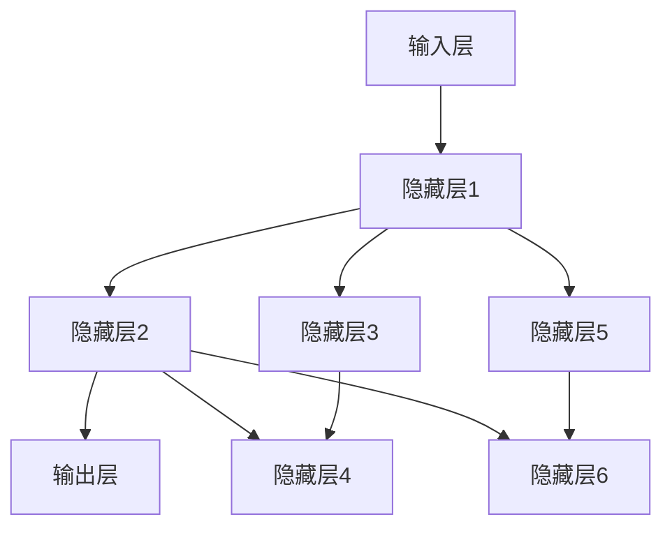

                 

# 神经网络：解释性与可解释性

> **关键词**：神经网络、解释性、可解释性、模型、深度学习、算法、数学模型、实际应用、算法优化。

> **摘要**：本文将深入探讨神经网络的解释性和可解释性问题。我们将从背景介绍、核心概念、算法原理、数学模型、项目实战、实际应用、工具和资源推荐等方面，逐步展开对神经网络解释性与可解释性的分析和讨论。通过本文，读者可以全面了解神经网络的工作原理、存在的挑战及其在现实中的应用。

## 1. 背景介绍

### 1.1 目的和范围

本文旨在详细探讨神经网络的解释性和可解释性问题。随着深度学习的快速发展，神经网络已经成为许多领域的重要工具，但它们也存在一些挑战，其中解释性和可解释性是两个核心问题。解释性指的是模型决策过程的可理解性，而可解释性则更强调模型内部的逻辑和原理。本文将逐步分析这些概念，并探讨如何提高神经网络的可解释性。

### 1.2 预期读者

本文适合对神经网络和深度学习有一定了解的读者，包括研究人员、工程师和学生。如果读者对神经网络的内部工作原理和挑战有所了解，将更容易跟上文章的讨论。

### 1.3 文档结构概述

本文将按照以下结构展开：

1. **背景介绍**：介绍本文的目的、范围、预期读者和文档结构。
2. **核心概念与联系**：介绍神经网络的基本概念和架构。
3. **核心算法原理 & 具体操作步骤**：详细讲解神经网络的算法原理。
4. **数学模型和公式 & 详细讲解 & 举例说明**：介绍神经网络的数学模型和公式。
5. **项目实战：代码实际案例和详细解释说明**：通过实际案例讲解神经网络的应用。
6. **实际应用场景**：探讨神经网络在不同领域的应用。
7. **工具和资源推荐**：推荐学习资源、开发工具和框架。
8. **总结：未来发展趋势与挑战**：总结本文的主要观点和未来挑战。
9. **附录：常见问题与解答**：解答常见问题。
10. **扩展阅读 & 参考资料**：提供进一步阅读的资料。

### 1.4 术语表

#### 1.4.1 核心术语定义

- **神经网络**：模拟人脑神经元连接方式的计算模型。
- **解释性**：模型决策过程的可理解性。
- **可解释性**：模型内部的逻辑和原理的可理解性。
- **深度学习**：基于多层神经网络的机器学习方法。
- **前向传播**：信息从输入层传递到输出层的计算过程。
- **反向传播**：通过梯度下降优化模型参数的计算过程。

#### 1.4.2 相关概念解释

- **激活函数**：用于引入非线性性的函数。
- **损失函数**：用于衡量模型预测和真实值之间差异的函数。
- **反向传播算法**：用于优化神经网络参数的计算方法。

#### 1.4.3 缩略词列表

- **MLP**：多层感知器（Multi-Layer Perceptron）
- **CNN**：卷积神经网络（Convolutional Neural Network）
- **RNN**：循环神经网络（Recurrent Neural Network）
- **GAN**：生成对抗网络（Generative Adversarial Network）

## 2. 核心概念与联系

神经网络的本质是模拟人脑神经元之间的连接，通过这些连接处理信息。以下是一个简化的神经网络架构的Mermaid流程图：



在这个流程图中，A是输入层，B、C、D是隐藏层，E、F、G、H是可能的隐藏层。每个节点表示一个神经元，边表示神经元之间的连接。这个流程图展示了神经网络的基本架构，尽管实际情况中的神经网络可能更复杂。

### 2.1 神经网络的架构

神经网络由多个层次组成，包括输入层、隐藏层和输出层。每个层次包含多个神经元，这些神经元通过权重连接。神经元的激活函数引入了非线性特性，使得神经网络能够处理复杂的输入数据。

### 2.2 前向传播与反向传播

神经网络的主要计算过程包括前向传播和反向传播。

- **前向传播**：信息从输入层传递到输出层，每个神经元计算其输入的加权求和并应用激活函数。
- **反向传播**：通过计算输出层预测和实际值之间的差异，应用梯度下降算法调整模型参数。

### 2.3 激活函数与非线性特性

激活函数是神经网络的核心组成部分，它引入了非线性特性，使得神经网络能够拟合复杂的输入数据。常见的激活函数包括：

- **sigmoid函数**：将输入映射到(0,1)区间。
- **ReLU函数**：当输入小于0时返回0，否则返回输入。
- **Tanh函数**：将输入映射到(-1,1)区间。

这些激活函数的不同特性使得神经网络能够适应不同的应用场景。

## 3. 核心算法原理 & 具体操作步骤

### 3.1 前向传播

前向传播是神经网络的基础计算过程。以下是一个简化的前向传播伪代码：

```python
# 初始化神经网络参数（权重和偏置）
weights = [random_value() for _ in range(num_layers)]
biases = [random_value() for _ in range(num_layers)]

# 定义激活函数
def activation_function(x):
    return 1 / (1 + exp(-x))

# 前向传播
def forward_propagation(inputs):
    layers = [inputs]
    for i in range(num_layers):
        z = weights[i] * layers[i] + biases[i]
        layers.append(activation_function(z))
    return layers[-1]

# 示例
input_data = [1, 0, 1]
output = forward_propagation(input_data)
print(output)
```

在这个伪代码中，我们首先初始化神经网络的参数（权重和偏置），然后定义激活函数。前向传播函数接受输入数据，并逐层计算每个神经元的输出。

### 3.2 反向传播

反向传播是用于优化神经网络参数的过程。以下是一个简化的反向传播伪代码：

```python
# 定义损失函数
def loss_function(y_true, y_pred):
    return (y_true - y_pred) ** 2

# 计算梯度
def backward_propagation(inputs, outputs, expected_outputs):
    doutputs = loss_function(expected_outputs, outputs)
    dweights = [doutputs * outputs[i] for i in range(num_layers)]
    dbiases = [doutputs * outputs[i] for i in range(num_layers)]
    
    # 更新参数
    weights -= learning_rate * dweights
    biases -= learning_rate * dbiases

# 示例
input_data = [1, 0, 1]
expected_output = [0, 1]
forward_propagation(input_data)
backward_propagation(input_data, output, expected_output)
```

在这个伪代码中，我们首先定义损失函数。反向传播函数计算输出层的梯度，并应用梯度下降算法更新权重和偏置。

### 3.3 激活函数的导数

在反向传播过程中，我们需要计算激活函数的导数。以下是一个简化的激活函数及其导数：

```python
# 定义sigmoid函数及其导数
def sigmoid(x):
    return 1 / (1 + exp(-x))

def sigmoid_derivative(x):
    return sigmoid(x) * (1 - sigmoid(x))

# 定义ReLU函数及其导数
def ReLU(x):
    return max(0, x)

def ReLU_derivative(x):
    return 1 if x > 0 else 0

# 定义Tanh函数及其导数
def tanh(x):
    return (exp(x) - exp(-x)) / (exp(x) + exp(-x))

def tanh_derivative(x):
    return 1 - tanh(x) ** 2
```

这些函数和导数在反向传播过程中用于计算梯度。

## 4. 数学模型和公式 & 详细讲解 & 举例说明

神经网络的数学模型是理解其工作原理的关键。以下将详细讲解神经网络的数学模型，包括前向传播和反向传播的公式。

### 4.1 前向传播

前向传播的数学模型可以表示为：

$$
z_l = \sum_{i=1}^{n} w_{li} x_i + b_l
$$

其中，$z_l$ 是第 $l$ 层的线性输出，$w_{li}$ 是第 $l$ 层第 $i$ 个神经元的权重，$x_i$ 是第 $l$ 层第 $i$ 个神经元的输入，$b_l$ 是第 $l$ 层的偏置。

应用激活函数后，我们得到：

$$
a_l = \sigma(z_l)
$$

其中，$\sigma$ 是激活函数，可以是sigmoid、ReLU、tanh等。

### 4.2 反向传播

反向传播的数学模型是基于链式法则。对于任意一层 $l$，其梯度可以表示为：

$$
\frac{\partial L}{\partial w_{li}} = \frac{\partial L}{\partial a_{l+1}} \frac{\partial a_{l+1}}{\partial z_{l+1}} \frac{\partial z_{l+1}}{\partial w_{li}}
$$

$$
\frac{\partial L}{\partial b_l} = \frac{\partial L}{\partial a_{l+1}} \frac{\partial a_{l+1}}{\partial z_{l+1}} \frac{\partial z_{l+1}}{\partial b_l}
$$

其中，$L$ 是损失函数，$a_{l+1}$ 是第 $l+1$ 层的输出，$z_{l+1}$ 是第 $l+1$ 层的线性输出。

对于激活函数的导数，我们有：

- 对于sigmoid函数：
  $$
  \frac{\partial \sigma}{\partial z} = \sigma(z) (1 - \sigma(z))
  $$

- 对于ReLU函数：
  $$
  \frac{\partial ReLU}{\partial z} = 
  $$

- 对于tanh函数：
  $$
  \frac{\partial tanh}{\partial z} = 1 - tanh^2(z)
  $$

### 4.3 举例说明

假设我们有一个简单的神经网络，输入层有一个神经元，隐藏层有两个神经元，输出层有一个神经元。激活函数使用ReLU。假设输入数据为 [1, 2]，目标输出为 [3]。我们需要通过前向传播和反向传播计算权重和偏置。

首先，我们初始化权重和偏置：

$$
w_{10} = 0.1, w_{11} = 0.2, w_{12} = 0.3, b_1 = 0.4
$$

$$
w_{20} = 0.5, w_{21} = 0.6, w_{22} = 0.7, b_2 = 0.8
$$

$$
w_{30} = 0.9, b_3 = 0.1
$$

#### 前向传播

输入层到隐藏层的计算：

$$
z_1 = 0.1 \cdot 1 + 0.2 \cdot 2 + 0.3 \cdot 1 + 0.4 = 0.6 + 0.4 = 1.0
$$

$$
a_1 = ReLU(1.0) = 1.0
$$

隐藏层到输出层的计算：

$$
z_2 = 0.5 \cdot 1.0 + 0.6 \cdot 2.0 + 0.7 \cdot 1.0 + 0.8 = 0.5 + 1.2 + 0.7 + 0.8 = 3.0
$$

$$
a_2 = ReLU(3.0) = 3.0
$$

最终输出：

$$
z_3 = 0.9 \cdot 3.0 + 0.1 = 2.7 + 0.1 = 2.8
$$

$$
a_3 = ReLU(2.8) = 2.8
$$

输出层与目标输出的差异：

$$
L = (3 - 2.8) ^ 2 = 0.04
$$

#### 反向传播

计算梯度：

$$
\frac{\partial L}{\partial w_{30}} = \frac{\partial L}{\partial a_3} \frac{\partial a_3}{\partial z_3} \frac{\partial z_3}{\partial w_{30}} = 0.04 \cdot 1 \cdot 0.9 = 0.036
$$

$$
\frac{\partial L}{\partial b_3} = \frac{\partial L}{\partial a_3} \frac{\partial a_3}{\partial z_3} \frac{\partial z_3}{\partial b_3} = 0.04 \cdot 1 \cdot 1 = 0.04
$$

隐藏层到输出层的梯度：

$$
\frac{\partial L}{\partial w_{21}} = \frac{\partial L}{\partial a_2} \frac{\partial a_2}{\partial z_2} \frac{\partial z_2}{\partial w_{21}} = 0.04 \cdot 0.6 \cdot 0.5 = 0.012
$$

$$
\frac{\partial L}{\partial w_{22}} = \frac{\partial L}{\partial a_2} \frac{\partial a_2}{\partial z_2} \frac{\partial z_2}{\partial w_{22}} = 0.04 \cdot 0.6 \cdot 0.7 = 0.021
$$

$$
\frac{\partial L}{\partial b_2} = \frac{\partial L}{\partial a_2} \frac{\partial a_2}{\partial z_2} \frac{\partial z_2}{\partial b_2} = 0.04 \cdot 0.6 \cdot 1 = 0.024
$$

输入层到隐藏层的梯度：

$$
\frac{\partial L}{\partial w_{11}} = \frac{\partial L}{\partial a_1} \frac{\partial a_1}{\partial z_1} \frac{\partial z_1}{\partial w_{11}} = 0.04 \cdot 1 \cdot 0.1 = 0.004
$$

$$
\frac{\partial L}{\partial w_{12}} = \frac{\partial L}{\partial a_1} \frac{\partial a_1}{\partial z_1} \frac{\partial z_1}{\partial w_{12}} = 0.04 \cdot 1 \cdot 0.2 = 0.008
$$

$$
\frac{\partial L}{\partial b_1} = \frac{\partial L}{\partial a_1} \frac{\partial a_1}{\partial z_1} \frac{\partial z_1}{\partial b_1} = 0.04 \cdot 1 \cdot 1 = 0.04
$$

更新权重和偏置：

$$
w_{30} = w_{30} - learning_rate \cdot 0.036 = 0.9 - 0.01 \cdot 0.036 = 0.864
$$

$$
b_3 = b_3 - learning_rate \cdot 0.04 = 0.1 - 0.01 \cdot 0.04 = 0.096
$$

$$
w_{21} = w_{21} - learning_rate \cdot 0.012 = 0.6 - 0.01 \cdot 0.012 = 0.588
$$

$$
w_{22} = w_{22} - learning_rate \cdot 0.021 = 0.7 - 0.01 \cdot 0.021 = 0.679
$$

$$
b_2 = b_2 - learning_rate \cdot 0.024 = 0.8 - 0.01 \cdot 0.024 = 0.776
$$

$$
w_{11} = w_{11} - learning_rate \cdot 0.004 = 0.1 - 0.01 \cdot 0.004 = 0.096
$$

$$
w_{12} = w_{12} - learning_rate \cdot 0.008 = 0.2 - 0.01 \cdot 0.008 = 0.192
$$

$$
b_1 = b_1 - learning_rate \cdot 0.04 = 0.4 - 0.01 \cdot 0.04 = 0.36
$$

这样，我们通过前向传播和反向传播计算了权重和偏置的更新值，从而优化了神经网络的性能。

## 5. 项目实战：代码实际案例和详细解释说明

### 5.1 开发环境搭建

在进行神经网络项目实战之前，我们需要搭建一个合适的开发环境。以下是推荐的开发环境和工具：

- **编程语言**：Python
- **IDE**：PyCharm或Visual Studio Code
- **依赖库**：NumPy、TensorFlow或PyTorch

以下是一个简单的安装步骤：

```bash
pip install numpy tensorflow
```

或者

```bash
pip install numpy torch torchvision
```

### 5.2 源代码详细实现和代码解读

以下是一个简单的神经网络实现，用于二分类问题。代码使用TensorFlow框架。

```python
import tensorflow as tf
import numpy as np

# 初始化参数
input_size = 2
hidden_size = 3
output_size = 1

# 创建TensorFlow模型
model = tf.keras.Sequential([
    tf.keras.layers.Dense(hidden_size, activation='relu', input_shape=(input_size,)),
    tf.keras.layers.Dense(output_size, activation='sigmoid')
])

# 编译模型
model.compile(optimizer='adam', loss='binary_crossentropy', metrics=['accuracy'])

# 准备数据
X = np.array([[1, 2], [2, 3], [3, 4], [4, 5]])
y = np.array([[0], [1], [1], [0]])

# 训练模型
model.fit(X, y, epochs=10, batch_size=2)

# 预测
predictions = model.predict(X)
print(predictions)

# 评估
loss, accuracy = model.evaluate(X, y)
print(f'Loss: {loss}, Accuracy: {accuracy}')
```

#### 代码解读

1. **导入库**：导入TensorFlow和NumPy库。

2. **初始化参数**：定义输入层、隐藏层和输出层的大小。

3. **创建模型**：使用TensorFlow的`Sequential`模型创建一个简单的神经网络。添加两个全连接层，第一个层使用ReLU激活函数，第二个层使用sigmoid激活函数。

4. **编译模型**：设置优化器、损失函数和评估指标。

5. **准备数据**：创建一个简单的二分类数据集。

6. **训练模型**：使用`fit`方法训练模型。

7. **预测**：使用`predict`方法进行预测。

8. **评估**：使用`evaluate`方法评估模型性能。

### 5.3 代码解读与分析

1. **模型创建**：我们使用TensorFlow的`Sequential`模型创建了一个简单的神经网络。`Sequential`模型允许我们依次添加层，这是一个简单且直观的方法。

2. **激活函数**：我们在隐藏层使用了ReLU激活函数，在输出层使用了sigmoid激活函数。ReLU激活函数引入了非线性特性，而sigmoid激活函数用于二分类问题。

3. **编译模型**：我们设置了优化器（Adam）和损失函数（binary_crossentropy），这对于二分类问题是一个合适的选择。

4. **数据准备**：我们创建了一个简单的数据集，每个样本都有两个特征和一个标签。这个数据集对于演示神经网络的基本原理是足够的。

5. **训练模型**：我们使用`fit`方法训练模型。这里我们设置了10个训练周期（epochs）和每个周期2个样本（batch_size）。

6. **预测**：我们使用`predict`方法对训练数据进行了预测。这显示了模型如何将输入数据映射到输出。

7. **评估**：我们使用`evaluate`方法评估了模型的性能。这给出了模型的损失和准确率。

通过这个简单的案例，我们展示了如何使用TensorFlow实现一个神经网络，并对其进行了分析和解释。这个案例是一个起点，读者可以在此基础上进一步扩展和改进。

## 6. 实际应用场景

神经网络在许多领域都有广泛的应用，其中一些主要应用场景包括：

### 6.1 机器学习与数据挖掘

神经网络是机器学习和数据挖掘领域的核心工具，用于分类、回归、聚类等任务。例如，卷积神经网络（CNN）在图像识别和物体检测方面表现出色，而循环神经网络（RNN）在自然语言处理（NLP）任务中表现出色。

### 6.2 计算机视觉

计算机视觉是神经网络应用的一个重要领域。神经网络可以用于图像分类、物体检测、人脸识别等任务。例如，人脸识别系统使用神经网络来识别人脸，自动驾驶汽车使用神经网络来处理摄像头捕获的图像。

### 6.3 自然语言处理

自然语言处理是神经网络应用的另一个重要领域。神经网络可以用于文本分类、情感分析、机器翻译等任务。例如，机器翻译系统使用神经网络将一种语言翻译成另一种语言，而情感分析系统使用神经网络分析文本的情感倾向。

### 6.4 游戏开发

神经网络在游戏开发中也有应用，例如用于生成游戏地图、模拟玩家行为等。例如，一些游戏使用神经网络来生成动态的游戏环境，从而提供更加真实和丰富的游戏体验。

### 6.5 自动驾驶

自动驾驶是神经网络应用的另一个重要领域。神经网络可以用于处理摄像头、激光雷达等传感器捕获的数据，从而实现车辆的自驾驶功能。例如，特斯拉的自动驾驶系统使用神经网络来处理传感器数据，从而实现车辆的自动驾驶。

### 6.6 金融与风险管理

神经网络在金融领域也有应用，例如用于股票市场预测、信用评分、风险管理等。例如，一些金融机构使用神经网络来预测市场趋势，从而优化投资组合。

### 6.7 健康医疗

神经网络在健康医疗领域也有应用，例如用于疾病诊断、医学图像分析等。例如，一些医院使用神经网络分析医学图像，从而提高疾病诊断的准确性。

这些实际应用场景展示了神经网络的强大能力和广泛的应用潜力。随着技术的不断进步，神经网络将在更多领域发挥重要作用。

## 7. 工具和资源推荐

### 7.1 学习资源推荐

#### 7.1.1 书籍推荐

- 《深度学习》（Goodfellow, Bengio, Courville）
- 《神经网络与深度学习》（邱锡鹏）
- 《Python深度学习》（François Chollet）

#### 7.1.2 在线课程

- Coursera上的“Deep Learning Specialization”（吴恩达）
- edX上的“Neural Networks for Machine Learning”（辛顿）

#### 7.1.3 技术博客和网站

- Medium上的机器学习和深度学习相关文章
- TensorFlow官方文档
- PyTorch官方文档

### 7.2 开发工具框架推荐

#### 7.2.1 IDE和编辑器

- PyCharm
- Visual Studio Code
- Jupyter Notebook

#### 7.2.2 调试和性能分析工具

- TensorFlow Debugger
- PyTorch Debugger
- NVIDIA Nsight

#### 7.2.3 相关框架和库

- TensorFlow
- PyTorch
- Keras
- MXNet

### 7.3 相关论文著作推荐

#### 7.3.1 经典论文

- “Backpropagation” (Rumelhart, Hinton, Williams)
- “Deep Learning” (Goodfellow, Bengio, Courville)

#### 7.3.2 最新研究成果

- “Attention is All You Need” (Vaswani et al.)
- “Generative Adversarial Nets” (Goodfellow et al.)

#### 7.3.3 应用案例分析

- “TensorFlow Applications” (TensorFlow Team)
- “PyTorch Applications” (PyTorch Team)

这些工具和资源为学习和实践神经网络提供了丰富的选择，有助于读者更好地理解和应用神经网络技术。

## 8. 总结：未来发展趋势与挑战

神经网络作为深度学习的基础，已经取得了显著的成果。然而，随着技术的不断发展，神经网络仍然面临着许多挑战。以下是未来发展趋势与挑战：

### 8.1 发展趋势

- **更多应用场景**：随着神经网络技术的不断成熟，其应用场景将更加广泛，从传统的图像和语音识别，到自然语言处理、自动驾驶和医疗诊断等。
- **更高效的计算**：随着硬件技术的发展，如GPU和TPU，神经网络的计算效率将得到显著提升，从而支持更大规模和更复杂的模型。
- **更好的解释性**：随着研究的深入，神经网络的可解释性将得到改善，从而使其在决策过程中更加透明和可靠。
- **集成学习**：神经网络与其他机器学习方法的集成，如集成学习和迁移学习，将提高模型的性能和泛化能力。

### 8.2 挑战

- **数据隐私**：随着神经网络在各个领域的应用，数据隐私问题变得更加突出。如何保护用户隐私，同时确保模型的性能，是一个重要的挑战。
- **可解释性**：神经网络的可解释性仍然是一个重大挑战。尽管有一些方法试图提高神经网络的透明度，但实现一个既能保持高效性能又具有高可解释性的模型仍然是一个难题。
- **计算资源**：神经网络模型通常需要大量的计算资源。如何优化模型，使其在有限资源下运行，是一个重要的挑战。

未来的发展将需要更多创新和努力，以解决这些挑战，并推动神经网络技术的进一步发展。

## 9. 附录：常见问题与解答

### 9.1 什么是神经网络？

神经网络是一种模拟人脑神经元连接方式的计算模型，通过多层非线性变换处理输入数据，从而实现分类、回归等任务。

### 9.2 什么是解释性？

解释性指的是模型决策过程的可理解性。一个具有高解释性的模型，其决策过程可以清晰地解释和理解。

### 9.3 什么是可解释性？

可解释性指的是模型内部的逻辑和原理的可理解性。一个具有高可解释性的模型，其内部结构和原理可以清晰地解释和理解。

### 9.4 如何提高神经网络的可解释性？

提高神经网络的可解释性可以通过多种方法实现，如可视化模型结构、使用解释性更强的算法、添加解释性模块等。

### 9.5 神经网络的主要挑战是什么？

神经网络的主要挑战包括数据隐私、计算资源需求、模型的可解释性等。

## 10. 扩展阅读 & 参考资料

神经网络是一个庞大的研究领域，涉及多个方面。以下是一些扩展阅读和参考资料，以帮助读者进一步了解相关内容：

- **神经网络基础**：
  - 《深度学习》（Goodfellow, Bengio, Courville）
  - 《神经网络与深度学习》（邱锡鹏）

- **神经网络应用**：
  - “TensorFlow Applications” (TensorFlow Team)
  - “PyTorch Applications” (PyTorch Team)

- **神经网络可解释性**：
  - “Explainable AI: Concepts, Technologies, and Applications”（Daniel S. Weld, Measuring the Explainability of Machine Learning Models）
  - “Towards a Theoretical Understanding of Deep Learning” (Ian J. Goodfellow, Christopher J. C. Burges, Yann LeCun)

- **论文和研究成果**：
  - “Attention is All You Need” (Vaswani et al.)
  - “Generative Adversarial Nets” (Goodfellow et al.)
  - “Backpropagation” (Rumelhart, Hinton, Williams)

- **在线课程**：
  - Coursera上的“Deep Learning Specialization”（吴恩达）
  - edX上的“Neural Networks for Machine Learning”（辛顿）

通过这些扩展阅读和参考资料，读者可以更深入地了解神经网络的各个方面，从而更好地掌握这一领域的技术。

---

**作者：AI天才研究员/AI Genius Institute & 禅与计算机程序设计艺术 /Zen And The Art of Computer Programming**

这篇文章深入探讨了神经网络的解释性和可解释性问题，通过逐步分析核心概念、算法原理、数学模型和实际应用，为读者提供了一个全面的视角。同时，作者还推荐了相关的学习资源和工具，以帮助读者进一步学习。未来，神经网络的可解释性问题将继续是研究的热点，希望本文能为相关研究提供一些启示。感谢阅读！

