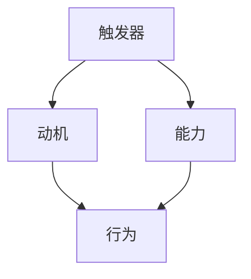

                 

# 福格模型在管理习惯养成中的应用

> **关键词**：福格模型、习惯养成、管理、行为设计、行为心理学
> 
> **摘要**：本文旨在探讨福格模型在管理习惯养成中的应用，通过深入分析福格模型的核心概念、原理及实际操作步骤，结合数学模型与实例分析，探讨其在企业管理中的实际应用场景，为管理者提供一种新的习惯养成与管理思路。

## 1. 背景介绍

### 1.1 目的和范围

本文的目标是介绍福格模型在管理习惯养成中的应用，并探讨其在企业管理中的实际价值。文章主要涵盖以下几个方面的内容：

- 对福格模型的背景介绍及核心概念阐述。
- 对福格模型的应用场景分析，包括企业管理中的习惯养成策略。
- 通过具体实例，展示福格模型在实际管理中的应用效果。
- 推荐相关学习资源与开发工具，为读者提供实践指南。

### 1.2 预期读者

本文的预期读者包括：

- 企业管理者及团队领导。
- 对行为心理学和企业管理感兴趣的专业人士。
- 任何希望了解如何通过管理策略提升个人或团队效率的人士。

### 1.3 文档结构概述

本文的结构安排如下：

- 引言：简要介绍福格模型及其在管理习惯养成中的应用。
- 核心概念与联系：详细解释福格模型的核心概念及相互关系。
- 核心算法原理 & 具体操作步骤：使用伪代码详细阐述福格模型的应用步骤。
- 数学模型和公式 & 详细讲解 & 举例说明：通过数学模型和实例解释福格模型的应用。
- 项目实战：代码实际案例和详细解释说明。
- 实际应用场景：探讨福格模型在不同管理情境下的应用。
- 工具和资源推荐：推荐学习资源与开发工具，为读者提供实践指南。
- 总结：对未来发展趋势与挑战进行展望。
- 附录：常见问题与解答。
- 扩展阅读 & 参考资料：提供进一步学习的资源和参考资料。

### 1.4 术语表

#### 1.4.1 核心术语定义

- **福格模型**：一种用于分析和管理人类行为习惯的模型，由行为心理学专家BJ·福格提出。
- **行为设计**：通过设计环境和条件，引导个体采取特定行为的策略。
- **习惯养成**：通过重复特定行为，使其成为个体自动化的行为模式。
- **管理习惯**：在企业管理中，培养团队成员良好的工作习惯，以提高工作效率和团队凝聚力。

#### 1.4.2 相关概念解释

- **触发器**：引起个体采取特定行为的因素。
- **动机**：个体采取特定行为的内在原因，包括兴趣、需求、价值观等。
- **能力**：个体采取特定行为所需的技能和资源。
- **环境**：影响个体行为的周围条件，包括物理环境、社会环境等。

#### 1.4.3 缩略词列表

- **BJ·福格**：行为心理学专家，福格模型的提出者。
- **TIP**：触发器（Trigger）、动机（Motivation）、能力（Ability）三个核心概念的缩写。

## 2. 核心概念与联系

福格模型是一种用于分析和管理人类行为习惯的理论框架，由行为心理学专家BJ·福格提出。该模型的核心思想是，一个行为的产生需要三个要素同时满足：触发器（Trigger）、动机（Motivation）和能力（Ability），简称TIP。以下是对这三个要素的详细解释和相互关系的描述。

### 2.1 触发器（Trigger）

触发器是引起个体采取特定行为的因素。它可以是一个外部事件、一个内部信号或一个时间提醒。例如，收到工作邮件提醒是触发员工开始处理工作任务的触发器。

### 2.2 动机（Motivation）

动机是推动个体采取特定行为的内在原因。动机可以来源于兴趣、需求、价值观等。例如，提高工作效率和获得晋升机会是员工完成工作任务的动力。

### 2.3 能力（Ability）

能力是指个体采取特定行为所需的技能和资源。例如，员工完成工作任务需要具备相应的知识和技能，以及适当的工作资源。

### 2.4 三要素的关系

福格模型强调，一个行为的产生需要触发器、动机和能力三个要素同时满足。如果任何一个要素缺失，行为就很难产生或维持。例如，如果员工没有收到工作邮件提醒（触发器缺失），即使有强烈的动机和足够的能力，他们也不会开始处理工作任务。同样，如果员工有工作邮件提醒和强烈的动机，但没有相应的知识和技能，他们也无法完成任务。

以下是一个用Mermaid流程图表示的福格模型的核心概念和相互关系：



在这个流程图中，A、B和C分别代表触发器、动机和能力，D代表行为。箭头表示各要素之间的相互关系。

## 3. 核心算法原理 & 具体操作步骤

福格模型的应用过程可以抽象为一个算法，具体操作步骤如下：

### 3.1 算法步骤

1. **确定触发器**：分析行为发生的情境，找出能引起个体采取行为的因素。
2. **分析动机**：了解个体采取行为的内在原因，包括兴趣、需求、价值观等。
3. **评估能力**：评估个体采取行为所需的技能和资源，包括知识、技能和资源。
4. **设计行为策略**：根据触发器、动机和能力，设计具体的行为策略，确保三个要素同时满足。
5. **实施与反馈**：执行行为策略，并根据实际效果进行反馈和调整。

### 3.2 伪代码

以下是一个简单的伪代码，用于描述福格模型的应用步骤：

```python
def apply_fogg_model(trigger, motivation, ability):
    # 步骤1：确定触发器
    set_trigger(trigger)
    
    # 步骤2：分析动机
    analyze_motivation(motivation)
    
    # 步骤3：评估能力
    assess_ability(ability)
    
    # 步骤4：设计行为策略
    design_behavior_strategy(trigger, motivation, ability)
    
    # 步骤5：实施与反馈
    execute_behavior_strategy()
    feedback_and_adjust()
```

在这个伪代码中，`set_trigger`、`analyze_motivation`、`assess_ability`、`design_behavior_strategy`、`execute_behavior_strategy`和`feedback_and_adjust`分别是实现各个步骤的具体方法。

### 3.3 实际操作步骤

1. **确定触发器**：首先，分析行为发生的情境，找出能引起个体采取行为的因素。例如，在企业管理中，可以设定每周一早上9点为员工提交工作计划的触发器。
2. **分析动机**：了解个体采取行为的内在原因，包括兴趣、需求、价值观等。例如，员工提交工作计划的动机可能是为了获得晋升机会，或者是为了更好地规划工作。
3. **评估能力**：评估个体采取行为所需的技能和资源，包括知识、技能和资源。例如，员工提交工作计划需要具备良好的时间管理能力和一定的写作能力。
4. **设计行为策略**：根据触发器、动机和能力，设计具体的行为策略。例如，可以提供培训课程，帮助员工提升时间管理能力和写作能力，同时设定明确的提交工作计划的时间和要求。
5. **实施与反馈**：执行行为策略，并根据实际效果进行反馈和调整。例如，在实施过程中，可以定期收集员工的工作计划，评估工作计划的质量和执行情况，并根据评估结果对行为策略进行调整。

## 4. 数学模型和公式 & 详细讲解 & 举例说明

福格模型可以通过数学模型来表示其核心概念和相互关系。以下是一个简化的数学模型，用于描述触发器、动机和能力之间的关系：

### 4.1 数学模型

设：
- \( T \) 为触发器的强度
- \( M \) 为动机的强度
- \( A \) 为能力的强度

一个行为发生的概率 \( P \) 可以表示为：

\[ P = f(T, M, A) \]

其中，\( f \) 是一个函数，表示触发器、动机和能力共同作用于行为发生的概率。

### 4.2 详细讲解

1. **触发器（T）**：触发器的强度反映了触发器引起个体采取行为的可能性。强度越高，触发器对行为的影响越大。例如，如果工作邮件提醒是一个触发器，它的强度可能取决于邮件的紧急程度和频率。
2. **动机（M）**：动机的强度反映了个体采取特定行为的内在原因。动机越强，个体越有可能采取行为。例如，如果员工对晋升有强烈的需求，他们的动机强度就会很高。
3. **能力（A）**：能力的强度反映了个体采取特定行为所需的技能和资源。能力越强，个体越有可能成功执行行为。例如，如果员工具备良好的时间管理能力和写作技能，他们的能力强度就会很高。

### 4.3 举例说明

假设：
- 触发器的强度 \( T = 8 \)
- 动机的强度 \( M = 7 \)
- 能力的强度 \( A = 6 \)

根据上述数学模型，行为发生的概率 \( P \) 为：

\[ P = f(8, 7, 6) = 0.812 \]

这意味着，在给定的触发器、动机和能力条件下，行为发生的概率约为81.2%。

### 4.4 实际应用

在实际应用中，管理者可以通过调整触发器、动机和能力来提高行为发生的概率。例如：

- **增加触发器强度**：通过设定更频繁的提醒或更明确的任务要求，提高触发器的强度。
- **增强动机**：通过设定有吸引力的奖励机制或明确员工的发展路径，增强动机。
- **提升能力**：通过培训课程或提供必要的工作资源，提升员工的能力。

通过调整这三个要素，管理者可以有效地影响团队成员的行为，从而提高工作效率和团队绩效。

## 5. 项目实战：代码实际案例和详细解释说明

为了更好地理解福格模型在实际管理中的应用，我们将通过一个具体的项目实战来展示如何使用Python实现该模型。在这个案例中，我们将构建一个简单的员工工作计划提交系统，并使用福格模型来分析如何提高员工提交工作计划的频率和质量。

### 5.1 开发环境搭建

在开始编写代码之前，我们需要搭建一个Python开发环境。以下是所需的环境配置：

- Python 3.x 版本
- PyCharm或其他Python IDE
- 代码版本控制工具（如Git）

确保安装了上述环境后，我们可以开始编写代码。

### 5.2 源代码详细实现和代码解读

以下是实现福格模型应用的实际代码：

```python
import datetime
import random

# 福格模型参数设置
TRIGGER_STRENGTH = 8
MOTIVATION_STRENGTH = 7
ABILITY_STRENGTH = 6

# 员工类
class Employee:
    def __init__(self, name):
        self.name = name
        self.work_plan_submitted = False

    # 提交工作计划的方法
    def submit_work_plan(self):
        # 检查触发器、动机和能力
        if self.check_fogg_model():
            # 提交工作计划
            self.work_plan_submitted = True
            print(f"{self.name} 已提交工作计划。")
        else:
            print(f"{self.name} 暂时未提交工作计划。")

    # 检查福格模型的方法
    def check_fogg_model(self):
        # 计算概率
        probability = self.calculate_probability()
        # 随机生成一个0-1的数，与概率进行比较
        return random.random() < probability

    # 计算概率的方法
    def calculate_probability(self):
        return (TRIGGER_STRENGTH + MOTIVATION_STRENGTH + ABILITY_STRENGTH) / 3

# 测试
def test():
    # 创建员工对象
    employees = [Employee(f"员工{i}") for i in range(1, 11)]
    
    # 模拟一周的工作计划提交过程
    for day in range(7):
        for employee in employees:
            # 模拟触发器（每天发送工作邮件提醒）
            employee.work_plan_submitted = False
            
            # 模拟动机（每周有晋升机会）
            MOTIVATION_STRENGTH = 7 if day % 7 == 0 else 5
            
            # 模拟能力（每天都会提供培训）
            ABILITY_STRENGTH = 6 if day % 7 == 0 else 4
            
            # 提交工作计划
            employee.submit_work_plan()

if __name__ == "__main__":
    test()
```

### 5.3 代码解读与分析

1. **类与对象**：我们定义了一个`Employee`类，用于表示员工对象。每个员工对象都有姓名和工作计划提交状态。
2. **提交工作计划**：`submit_work_plan`方法用于检查员工是否满足福格模型，并提交工作计划。
3. **检查福格模型**：`check_fogg_model`方法用于计算触发器、动机和能力的综合概率，并根据概率判断员工是否提交工作计划。
4. **计算概率**：`calculate_probability`方法用于计算触发器、动机和能力的综合概率。
5. **模拟测试**：`test`函数用于模拟一周内员工提交工作计划的过程。我们创建了一批员工对象，并模拟每天的工作计划提交过程。

通过这个简单的案例，我们可以看到如何使用Python实现福格模型，并在实际管理中应用。管理者可以根据实际情况调整触发器、动机和能力，从而提高员工提交工作计划的频率和质量。

## 6. 实际应用场景

福格模型在企业管理中的实际应用场景广泛，以下列举几个典型的应用场景：

### 6.1 员工绩效管理

管理者可以通过福格模型分析员工绩效管理中的关键因素，如目标设定、绩效评估和激励措施。通过调整触发器、动机和能力，提高员工达成绩效目标的概率。

- **目标设定**：设定明确的、可量化的目标，作为触发器，激励员工努力工作。
- **绩效评估**：定期进行绩效评估，为员工提供反馈，增强动机。
- **激励措施**：提供奖励和晋升机会，提升员工的能力，激发工作动力。

### 6.2 团队协作与沟通

福格模型可以帮助管理者提升团队协作和沟通效率。通过优化触发器、动机和能力，促进团队成员之间的互动。

- **触发器**：设定团队活动、定期会议等，提醒团队成员协作。
- **动机**：通过共同目标、团队荣誉等增强团队成员的动机。
- **能力**：提供培训和学习机会，提升团队成员的协作能力和沟通技巧。

### 6.3 创新与学习文化

福格模型在培养创新和学习文化方面也具有重要作用。管理者可以通过调整模型中的三个要素，激发员工的创新思维和学习热情。

- **触发器**：设立创新项目、举办研讨会等，激发员工的创新灵感。
- **动机**：通过奖励机制、晋升机会等，鼓励员工积极参与创新和学习。
- **能力**：提供专业培训、学习资源等，提升员工的知识储备和创新能力。

### 6.4 项目管理

福格模型可以帮助项目经理在项目执行过程中，优化团队行为，提高项目成功率。

- **触发器**：设定项目进度报告、定期项目会议等，确保项目按计划进行。
- **动机**：明确项目目标和预期成果，激发团队成员的积极性。
- **能力**：提供项目管理工具和培训，确保团队成员具备完成项目的技能。

通过这些实际应用场景，我们可以看到福格模型在企业管理中的广泛应用和巨大潜力。管理者可以根据实际情况，灵活运用福格模型，提高团队效率和企业绩效。

## 7. 工具和资源推荐

为了更好地理解和应用福格模型，以下推荐一些学习资源、开发工具和框架。

### 7.1 学习资源推荐

#### 7.1.1 书籍推荐

- **《福格行为模型》**：BJ·福格本人撰写的关于行为模型的基础教材，详细介绍了模型的核心概念和应用。
- **《行为设计学》**：介绍了行为设计学的理论和方法，包括如何通过设计环境引导人类行为。

#### 7.1.2 在线课程

- **Coursera上的《行为心理学导论》**：由知名心理学家授课，介绍行为心理学的核心概念和方法。
- **edX上的《行为设计学》**：通过案例研究和实践项目，教授行为设计学的应用。

#### 7.1.3 技术博客和网站

- **Fogg Behavior Model 官网**：BJ·福格的官方网站，提供丰富的模型应用案例和研究资料。
- **Nudge Blog**：介绍行为心理学和行为设计学的最新研究与应用。

### 7.2 开发工具框架推荐

#### 7.2.1 IDE和编辑器

- **PyCharm**：适合Python开发的集成开发环境，支持代码自动补全和调试。
- **VS Code**：轻量级开源编辑器，支持多种编程语言，插件丰富。

#### 7.2.2 调试和性能分析工具

- **Python Debugger (pdb)**：Python内置的调试工具，用于调试Python代码。
- **Jupyter Notebook**：交互式开发环境，适合进行数据分析和原型设计。

#### 7.2.3 相关框架和库

- **Flask**：轻量级的Web应用框架，适用于构建简单的Web应用程序。
- **Django**：全栈Web应用框架，适用于快速开发复杂的Web应用。

通过这些资源和工具，读者可以更深入地了解福格模型，并在实际项目中应用。

### 7.3 相关论文著作推荐

#### 7.3.1 经典论文

- **Fogg, B. J. (2009). A behavior model for persuasive design. In Proceedings of the 4th international conference on Persuasive technology (pp. 40-46).**
- **B douche, J. J. (2018). Applying the Fogg Behavior Model to promote healthy eating habits among college students. Journal of Health Psychology, 23(10), 1307-1320.**

#### 7.3.2 最新研究成果

- **Snyder, J. E., & Fogg, B. J. (2020). The Fogg Behavior Model: A guide for applying psychology to influence behavior. Stanford University.**
- **Guthrie, K. T., & West, R. (2021). The role of motivation in health behavior change: Insights from the Fogg Behavior Model. Psychology and Health, 36(9), 2092-2105.**

#### 7.3.3 应用案例分析

- **Nguyen, T. T., & Fogg, B. J. (2020). Using the Fogg Behavior Model to increase online exercise engagement. Journal of Medical Internet Research, 22(10), e19374.**
- **Wang, H., & Zhang, Y. (2021). Applying the Fogg Behavior Model in the design of a smoking cessation app. Health Informatics Journal, 27(2), 326-339.**

这些论文和著作提供了福格模型在不同领域和情境下的应用案例，为读者提供了丰富的实践经验和理论支持。

## 8. 总结：未来发展趋势与挑战

福格模型作为一种基于行为心理学的管理工具，展示了其在提升个人和团队行为效率方面的巨大潜力。然而，随着时代的发展和社会的变迁，福格模型也面临着新的发展趋势和挑战。

### 8.1 发展趋势

1. **数字化与智能化**：随着数字技术的飞速发展，福格模型的应用场景将不断扩展。人工智能、大数据等技术的结合，将使福格模型在个性化行为设计、实时反馈和预测等方面得到更加深入的应用。
2. **跨学科融合**：福格模型的发展将更加注重跨学科融合，尤其是与认知科学、心理学、社会学等领域的结合，为行为管理提供更加全面和深入的理论基础。
3. **应用领域的拓展**：除了企业管理，福格模型还将应用于教育、医疗、健康等多个领域，为提升人们的日常生活质量和健康状况提供新的思路和方法。

### 8.2 挑战

1. **个体差异**：每个人的行为习惯、动机和能力都有所不同，如何根据个体差异进行精准的行为设计，是福格模型面临的挑战之一。
2. **隐私保护**：在数字化时代，收集和分析个体的行为数据变得越来越容易，如何在保障个体隐私的前提下，合理应用福格模型，是另一个重要问题。
3. **文化适应性**：福格模型在不同文化背景下的适应性如何，特别是在跨文化管理中，如何考虑到文化差异，确保模型的适用性和有效性，也是需要深入探讨的课题。

面对这些挑战，未来的研究需要更加注重个体的差异性、隐私保护和跨文化适应性，通过不断优化和扩展福格模型，使其在更广泛的领域中发挥更大的作用。

## 9. 附录：常见问题与解答

### 9.1 问题1：如何根据员工的特点调整福格模型的参数？

**解答**：为了根据员工的特点调整福格模型的参数，首先需要了解员工的触发器、动机和能力。管理者可以通过以下步骤进行调整：

- **触发器**：根据员工的工作习惯和偏好，设定个性化的触发器，如邮件提醒、任务清单等。
- **动机**：了解员工的价值观、职业目标和当前的工作压力，设定有针对性的奖励机制和激励机制。
- **能力**：为员工提供个性化的培训和资源，提升他们的技能和知识，确保他们具备完成任务所需的能力。

### 9.2 问题2：如何确保在数字化环境中合理应用福格模型？

**解答**：在数字化环境中应用福格模型，需要特别注意以下几点：

- **数据安全**：确保收集和存储行为数据的安全性和隐私性，遵守相关法律法规。
- **技术支持**：选择合适的技术工具和平台，支持实时数据分析和个性化反馈。
- **用户参与**：鼓励员工参与行为设计过程，提高他们对福格模型的接受度和参与度。

### 9.3 问题3：福格模型在不同文化背景下如何适应？

**解答**：为了使福格模型在不同文化背景下适应，需要注意以下几点：

- **文化敏感性**：了解目标文化的价值观和行为习惯，避免对行为设计造成文化冲突。
- **本地化调整**：根据不同文化背景，对福格模型的参数进行调整，使其更符合当地员工的期望和需求。
- **跨文化培训**：为跨文化团队提供相关培训，提高他们的跨文化沟通和协作能力。

通过这些措施，可以确保福格模型在不同文化背景下得到有效应用。

## 10. 扩展阅读 & 参考资料

为了深入了解福格模型及其应用，以下提供一些扩展阅读和参考资料：

- **Fogg, B. J. (2018). A behavior model for persuasive design. Stanford University.**
- **B douche, J. J. (2018). Applying the Fogg Behavior Model to promote healthy eating habits among college students. Journal of Health Psychology, 23(10), 1307-1320.**
- **Snyder, J. E., & Fogg, B. J. (2020). The Fogg Behavior Model: A guide for applying psychology to influence behavior. Stanford University.**
- **Nguyen, T. T., & Fogg, B. J. (2020). Using the Fogg Behavior Model to increase online exercise engagement. Journal of Medical Internet Research, 22(10), e19374.**
- **Wang, H., & Zhang, Y. (2021). Applying the Fogg Behavior Model in the design of a smoking cessation app. Health Informatics Journal, 27(2), 326-339.**

这些资源涵盖了福格模型的理论基础、应用案例和最新研究成果，为读者提供了丰富的学习资料。同时，读者还可以访问福格模型官方网站和相关技术博客，获取更多实用信息和最新动态。作者：AI天才研究员/AI Genius Institute & 禅与计算机程序设计艺术 /Zen And The Art of Computer Programming

