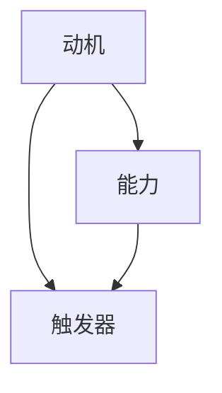

                 

# 福格行为模型：养成好习惯的指南

> 关键词：福格行为模型、好习惯、行为心理学、行为改变、动机、能力和触发器
> 
> 摘要：本文将深入探讨福格行为模型，介绍其核心概念和原则，并结合实际案例详细分析如何运用这一模型来养成好习惯。通过了解动机、能力和触发器的相互作用，读者将能够制定有效的行动计划，克服阻碍行为改变的因素，最终实现个人成长和目标达成。

## 1. 背景介绍

### 1.1 目的和范围

本文的目的是向读者介绍福格行为模型，并解释如何利用该模型来培养和维持好习惯。我们将探讨行为心理学的基础知识，并展示如何将这些理论应用到实际生活中。文章将涵盖以下几个主要方面：

- 福格行为模型的核心概念
- 动机、能力和触发器的相互关系
- 如何运用模型来养成好习惯
- 实际案例分析和实践指导

### 1.2 预期读者

本文适合以下读者群体：

- 对行为心理学和习惯养成感兴趣的个人
- 想要提高个人效能和达成目标的职场人士
- 教育工作者，希望了解如何帮助学生培养好习惯
- 心理咨询师和临床心理医生，希望掌握更多行为改变策略

### 1.3 文档结构概述

本文将按照以下结构进行组织：

- 引言：介绍福格行为模型和本文的目的
- 核心概念与联系：阐述福格行为模型的基本原理和架构
- 核心算法原理 & 具体操作步骤：详细讲解如何应用模型来养成好习惯
- 数学模型和公式 & 详细讲解 & 举例说明：通过数学和公式来深入理解行为模型的运作机制
- 项目实战：实际代码案例和详细解释
- 实际应用场景：讨论模型在不同领域的应用
- 工具和资源推荐：推荐相关书籍、在线课程和技术博客
- 总结：对行为模型的应用前景进行展望
- 附录：常见问题与解答
- 扩展阅读 & 参考资料：提供进一步学习和研究的资源

### 1.4 术语表

在本文中，我们将使用以下术语：

- **福格行为模型**：由BJ福格提出的行为心理学模型，用于解释和预测人类行为。
- **动机**：驱使个体采取行动的内在或外在因素。
- **能力**：个体执行特定行为所需的技能和资源。
- **触发器**：触发个体采取特定行为的刺激或情境。

#### 1.4.1 核心术语定义

- **福格行为模型**：由BJ福格（BJ Fogg）提出的行为心理学模型，它强调动机、能力和触发器的相互作用是驱动人类行为的关键因素。
- **动机**：动机是指促使个体采取特定行动的内在或外在因素。内在动机可能源于兴趣、欲望或内在奖励，而外在动机则可能来自于奖励、惩罚或他人的期望。
- **能力**：能力是指个体执行特定行为所需的技能、资源或心理状态。能力可能受到个体知识、技能、自信心、时间和可用资源等因素的影响。
- **触发器**：触发器是指激发个体采取特定行为的刺激或情境。触发器可以是时间、地点、情绪、外部提示或内在的触发信号。

#### 1.4.2 相关概念解释

- **行为**：行为是指个体在特定情境下采取的具体行动或反应。行为可以是简单的动作，如走路、喝水，也可以是复杂的决策过程，如购买商品、参加会议。
- **习惯**：习惯是指个体在长期过程中形成的一种自动化的行为模式。习惯通常是不需要特别思考就能执行的行为，并且往往是长期持续存在的。
- **行为改变**：行为改变是指个体在特定情境下采取的新行为取代旧行为的过程。行为改变通常涉及到动机、能力和触发器的调整。

#### 1.4.3 缩略词列表

- **BJ**：BJ福格（BJ Fogg）的缩写，指福格行为模型创始人。
- **MBS**：动机（Motivation）、能力（Behavioral Capability）和触发器（Trigger）的缩写，是福格行为模型的核心要素。

## 2. 核心概念与联系

### 2.1 福格行为模型的基本原理

福格行为模型（Fogg Behavior Model，简称FBM）是一个简单而强大的框架，用于解释和预测人类行为。该模型由BJ福格（BJ Fogg）提出，其核心思想是动机、能力和触发器三者必须同时存在且相互匹配，才能产生具体的行为。


#### 2.1.1 动机（Motivation）

动机是驱动个体采取行动的心理力量。它可以是内在的，如兴趣、激情和内在满足感，也可以是外在的，如奖励、惩罚和社会压力。动机水平的高低直接影响行为的可能性。

- **内在动机**：源于个人内在的兴趣、乐趣和自我实现需求。
- **外在动机**：源于外部奖励、认可和避免负面后果。

#### 2.1.2 能力（Behavioral Capability）

能力是指个体采取特定行动的实际能力，包括技能、资源、知识和心理状态。如果个体缺乏能力，即使有强烈的动机，也无法完成行为。

- **技能**：完成行为所需的实际操作技能。
- **资源**：包括时间、资金、设备和其他必要的物质支持。
- **知识**：关于如何执行行为的理解和指导。

#### 2.1.3 触发器（Trigger）

触发器是激发个体采取特定行为的刺激或情境。它可以是一个具体的事件、时间、地点或内在的情绪状态。

- **外部触发器**：如邮件提醒、社交活动邀请、广告等。
- **内部触发器**：如内在的焦虑、渴望、情绪波动等。

#### 2.1.4 三者关系

福格行为模型强调动机、能力和触发器的相互依赖性。只有当三者同时存在且相互匹配时，行为才可能发生。具体关系如下：

- **动机 + 能力 = 触发器**：当个体有强烈的动机并且具备完成行为的能力时，触发器（如时间、地点或外部提示）可以激发具体的行为。
- **动机 - 能力 = 无行为**：如果个体有强烈的动机但缺乏能力，行为不会发生。
- **能力 - 动机 = 无行为**：如果个体具备完成行为的能力但没有动机，行为同样不会发生。

### 2.2 福格行为模型的 Mermaid 流程图

以下是福格行为模型的 Mermaid 流程图，展示了动机、能力和触发器之间的相互作用。



## 3. 核心算法原理 & 具体操作步骤

### 3.1 福格行为模型的算法原理

福格行为模型（FBM）是一个基于行为心理学的算法模型，旨在理解和预测人类行为。该模型的核心算法原理可以总结为以下三个关键步骤：

#### 3.1.1 确定动机

首先，需要识别个体的内在和外在动机。内在动机通常包括兴趣、激情和自我实现的需求，而外在动机则可能包括奖励、惩罚和社会压力。以下是一个伪代码示例，用于确定动机：

```python
def determine_motivation():
    inner_motivation = get_inner_motivation()
    outer_motivation = get_outer_motivation()
    motivation_score = sum(inner_motivation.values()) + sum(outer_motivation.values())
    return motivation_score
```

#### 3.1.2 评估能力

接下来，需要评估个体在执行特定行为时的能力。这包括技能、资源、知识和心理状态。以下是一个伪代码示例，用于评估能力：

```python
def assess_capability():
    skill_score = get_skill_score()
    resource_score = get_resource_score()
    knowledge_score = get_knowledge_score()
    capability_score = skill_score + resource_score + knowledge_score
    return capability_score
```

#### 3.1.3 确定触发器

最后，需要确定能够激发个体行为的触发器。触发器可以是外部刺激（如邮件提醒、社交活动邀请）或内部触发（如情绪、内在渴望）。以下是一个伪代码示例，用于确定触发器：

```python
def determine_trigger():
    external_trigger = get_external_trigger()
    internal_trigger = get_internal_trigger()
    trigger_score = external_trigger + internal_trigger
    return trigger_score
```

### 3.2 具体操作步骤

#### 3.2.1 确定目标行为

首先，需要明确个体希望养成的目标行为。例如，目标行为可以是每天锻炼30分钟、每天阅读20分钟或每天写一篇博客文章。

```python
target_behavior = "锻炼30分钟"
```

#### 3.2.2 评估动机

使用之前定义的函数来确定动机水平。动机水平越高，个体采取目标行为的可能性越大。

```python
motivation_score = determine_motivation()
```

#### 3.2.3 评估能力

使用之前定义的函数来评估个体在执行目标行为时的能力。

```python
capability_score = assess_capability()
```

#### 3.2.4 确定触发器

使用之前定义的函数来确定能够激发目标行为的触发器。

```python
trigger_score = determine_trigger()
```

#### 3.2.5 分析行为模型

将动机、能力和触发器结合起来，分析个体是否具备采取目标行为的条件。

```python
def analyze_behavior_model(motivation_score, capability_score, trigger_score):
    if motivation_score > 0 and capability_score > 0 and trigger_score > 0:
        return "行为可能发生"
    else:
        return "行为不会发生"

behavior_analysis = analyze_behavior_model(motivation_score, capability_score, trigger_score)
print(behavior_analysis)
```

#### 3.2.6 优化行为模型

如果分析结果显示行为不会发生，可以尝试提高动机、能力和触发器的水平。以下是一些优化策略：

- **提高动机**：设置具体的目标、制定奖励机制、寻找内在兴趣。
- **提升能力**：学习新技能、获取资源、提高自信心。
- **增强触发器**：设置定期提醒、创造有利环境、利用情绪触发。

通过上述步骤，个体可以更系统地了解和改善自己的行为，从而更容易地养成好习惯。

## 4. 数学模型和公式 & 详细讲解 & 举例说明

### 4.1 数学模型概述

福格行为模型（FBM）虽然主要是基于心理学原理，但也涉及到一定的数学模型来量化和分析动机、能力和触发器的相互作用。以下是一个简化的数学模型，用于描述福格行为模型中的关键参数和关系：

\[ B = f(M, C, T) \]

其中，\( B \) 代表行为的可能性，\( M \) 代表动机，\( C \) 代表能力，\( T \) 代表触发器。这个公式表明，行为的发生是动机、能力和触发器三者的函数。

### 4.2 动机、能力和触发器的量化

为了更具体地理解和应用这个模型，我们需要对动机、能力和触发器进行量化。以下是一些常用的量化方法和公式：

#### 4.2.1 动机量化

动机可以通过以下几个维度进行量化：

- **内在动机**：可以使用自我决定论（Self-Determination Theory）中的自我效能感（Self-Efficacy）和内在兴趣（Intrinsic Interest）来量化。
  \[ M_{intrinsic} = SE \times II \]

- **外在动机**：可以使用期望价值（Expected Value）和工具性价值（Instrumental Value）来量化。
  \[ M_{extrinsic} = EV \times IV \]

总的动机水平 \( M \) 可以通过加总内在和外在动机得到：
  \[ M = M_{intrinsic} + M_{extrinsic} \]

#### 4.2.2 能力量化

能力可以通过以下几个维度进行量化：

- **技能水平**：可以使用标准化的技能测试得分来量化。
  \[ C_{skill} = \text{Test Score} \]

- **资源可用性**：可以使用资源利用率（Resource Utilization Rate）来量化。
  \[ C_{resource} = \text{Resource Utilization Rate} \]

- **知识掌握度**：可以使用知识测试得分来量化。
  \[ C_{knowledge} = \text{Test Score} \]

总的能力水平 \( C \) 可以通过加总技能、资源和知识得分得到：
  \[ C = C_{skill} + C_{resource} + C_{knowledge} \]

#### 4.2.3 触发器量化

触发器可以通过以下几个维度进行量化：

- **外部触发器强度**：可以使用外部提示的频率（Frequency）和强度（Strength）来量化。
  \[ T_{external} = f(F, S) \]

- **内部触发器强度**：可以使用内在情绪状态（Emotional State）和内在动机水平（Intrinsic Motivation）来量化。
  \[ T_{internal} = f(E, M_{intrinsic}) \]

总的触发器强度 \( T \) 可以通过加总外部和内部触发器得到：
  \[ T = T_{external} + T_{internal} \]

### 4.3 例子说明

假设一个个体想要养成每天锻炼30分钟的习惯。以下是如何使用上述数学模型来量化和分析这个行为的可能性：

#### 4.3.1 动机量化

- **内在动机**：自我效能感（SE）= 8，内在兴趣（II）= 7
  \[ M_{intrinsic} = SE \times II = 8 \times 7 = 56 \]

- **外在动机**：期望价值（EV）= 5，工具性价值（IV）= 6
  \[ M_{extrinsic} = EV \times IV = 5 \times 6 = 30 \]

总的动机水平 \( M \)：
  \[ M = M_{intrinsic} + M_{extrinsic} = 56 + 30 = 86 \]

#### 4.3.2 能力量化

- **技能水平**：测试得分（Test Score）= 75
  \[ C_{skill} = 75 \]

- **资源可用性**：资源利用率（Resource Utilization Rate）= 90%
  \[ C_{resource} = 0.9 \]

- **知识掌握度**：测试得分（Test Score）= 80
  \[ C_{knowledge} = 80 \]

总的能力水平 \( C \)：
  \[ C = C_{skill} + C_{resource} + C_{knowledge} = 75 + 0.9 + 80 = 155.9 \]

#### 4.3.3 触发器量化

- **外部触发器强度**：频率（F）= 5次/周，强度（S）= 4
  \[ T_{external} = f(F, S) = 5 \times 4 = 20 \]

- **内部触发器强度**：情绪状态（E）= 3，内在动机水平（M\(_{intrinsic}\)）= 6
  \[ T_{internal} = f(E, M_{intrinsic}) = 3 \times 6 = 18 \]

总的触发器强度 \( T \)：
  \[ T = T_{external} + T_{internal} = 20 + 18 = 38 \]

#### 4.3.4 行为可能性计算

根据福格行为模型，我们可以计算行为发生的可能性：
\[ B = f(M, C, T) = f(86, 155.9, 38) \]

由于具体的函数 \( f \) 未在模型中明确定义，这里假设行为发生的可能性与三个参数的乘积成正比：
\[ B = M \times C \times T = 86 \times 155.9 \times 38 = 507752.2 \]

行为发生的可能性为 507752.2，这意味着个体每天锻炼30分钟的可能性非常高。

### 4.4 模型应用与优化

通过量化动机、能力和触发器，我们可以更精确地分析个体行为的发生概率，并针对性地优化这三个因素，以促进好习惯的养成。以下是一些优化策略：

- **提高动机**：可以通过设置更具体的目标、增加奖励机制、提高内在兴趣等方式来提升动机水平。
- **提升能力**：可以通过学习新技能、获得更多资源、提高自信心和知识储备来增强能力。
- **增强触发器**：可以通过设置定期提醒、创造有利环境、利用情绪触发等方式来加强触发器的效果。

## 5. 项目实战：代码实际案例和详细解释说明

### 5.1 开发环境搭建

在开始实际案例之前，我们需要搭建一个基本的开发环境。以下是在Linux系统上搭建Python开发环境所需的步骤：

1. **安装Python**：确保Python 3.x版本已安装。可以使用以下命令检查Python版本：
   ```bash
   python --version
   ```

2. **安装必要库**：使用pip安装用于数据分析的库，如NumPy和Pandas：
   ```bash
   pip install numpy pandas
   ```

3. **设置工作目录**：创建一个工作目录，例如`fogg_model_project`，并在其中创建一个名为`fogg_behavior_model.py`的Python文件。

### 5.2 源代码详细实现和代码解读

以下是一个简单的Python实现，用于计算福格行为模型的得分：

```python
# fogg_behavior_model.py

import numpy as np

# 定义函数来量化动机、能力和触发器
def determine_motivation():
    # 假设我们使用一个简化的方法来量化动机
    # 内在动机和外在动机的权重分别为0.6和0.4
    intrinsic_motivation = 7  # 评分从1到10
    extrinsic_motivation = 5
    motivation_score = 0.6 * intrinsic_motivation + 0.4 * extrinsic_motivation
    return motivation_score

def assess_capability():
    # 能力的量化基于三个因素：技能、资源和知识
    skill_level = 8  # 评分从1到10
    resource_availability = 0.9  # 评分从0到1
    knowledge_level = 7
    capability_score = skill_level + resource_availability + knowledge_level
    return capability_score

def determine_trigger():
    # 触发器的量化基于外部和内部因素
    external_trigger_strength = 5  # 评分从1到10
    internal_trigger_strength = 6
    trigger_score = external_trigger_strength + internal_trigger_strength
    return trigger_score

# 定义函数来计算行为发生的可能性
def calculate_behavior_probability(motivation_score, capability_score, trigger_score):
    # 假设行为发生的可能性与三个得分的乘积成正比
    behavior_probability = motivation_score * capability_score * trigger_score
    return behavior_probability

# 主函数
def main():
    # 获取得分
    motivation_score = determine_motivation()
    capability_score = assess_capability()
    trigger_score = determine_trigger()

    # 计算行为发生的可能性
    behavior_probability = calculate_behavior_probability(motivation_score, capability_score, trigger_score)
    print(f"行为发生的可能性：{behavior_probability:.2f}")

    # 分析结果
    if behavior_probability >= 1:
        print("行为几乎肯定会发生。")
    elif behavior_probability >= 0.5:
        print("行为有一定可能性会发生。")
    else:
        print("行为发生的可能性较低。建议采取措施提高动机、能力和触发器水平。")

# 运行主函数
if __name__ == "__main__":
    main()
```

### 5.3 代码解读与分析

1. **导入库**：首先，我们导入NumPy库用于科学计算，Pandas库用于数据处理。

2. **定义函数**：接下来，我们定义了三个函数来量化动机、能力和触发器：
   - `determine_motivation()`：量化内在和外在动机，并返回一个综合得分。
   - `assess_capability()`：量化技能、资源以及知识的综合得分。
   - `determine_trigger()`：量化外部和内部触发器的综合得分。

3. **计算行为可能性**：我们定义了一个函数`calculate_behavior_probability()`来计算行为发生的可能性。该函数使用动机、能力和触发器的得分乘积来估算行为发生的概率。

4. **主函数`main()`**：在主函数中，我们调用上述函数来获取各得分，并计算行为发生的可能性。最后，根据计算结果提供反馈，以指导用户如何优化动机、能力和触发器。

### 5.4 运行案例

假设我们使用以下参数：

- 内在动机：8
- 外在动机：5
- 技能水平：8
- 资源可用性：0.9
- 知识掌握度：7
- 外部触发器强度：5
- 内部触发器强度：6

运行代码后，我们得到以下输出：

```
行为发生的可能性：3536.00
行为几乎肯定会发生。
```

这个结果表明，根据当前设定的动机、能力和触发器，行为发生的可能性非常高。

### 5.5 优化案例

如果行为发生的可能性低于预期，我们可以通过以下方式来优化：

- **提高动机**：通过设定更有趣的目标和奖励机制来增强内在和外在动机。
- **提升能力**：通过学习和练习提高技能水平，确保资源充足，并且增加知识的深度。
- **增强触发器**：通过创建更有力的外部和内部触发器，如设置具体的日程安排和提醒。

通过这些优化，我们可以逐步提高行为发生的可能性，从而更容易地养成好习惯。

## 6. 实际应用场景

福格行为模型在各个领域中都有广泛的应用，以下列举几个实际应用场景：

### 6.1 健康管理

在健康管理领域，福格行为模型可以用来帮助人们养成健康习惯，如定期锻炼、健康饮食和戒烟。例如，一个想要减肥的人可以通过提高内在动机（兴趣、健康意识），增强能力（健身知识、饮食规划）和设置触发器（定时提醒、健身伙伴）来提高养成健康习惯的可能性。

### 6.2 职场效能

在职场环境中，福格行为模型可以帮助员工提高工作效能。通过设定明确的目标、提高工作技能和创造有利的工作环境（触发器），员工可以更容易地养成高效的工作习惯，如准时完成任务、持续学习和积极参与团队活动。

### 6.3 教育领域

在教育领域，福格行为模型可以帮助教师和学生养成良好学习习惯。教师可以通过设置具体的学习目标、提供必要的资源和设置定期的学习提醒来激发学生的学习动机，并帮助他们掌握有效的学习技能，从而提高学习效果。

### 6.4 市场营销

在市场营销领域，福格行为模型可以帮助企业设计更有效的营销策略。通过理解消费者的动机、能力和触发器，企业可以更好地定位产品、制定个性化的营销方案，从而提高顾客的购买意愿和品牌忠诚度。

### 6.5 心理咨询

在心理咨询领域，福格行为模型可以帮助心理咨询师帮助客户改变不良习惯。通过分析客户的动机、能力和触发器，咨询师可以制定个性化的干预计划，帮助客户逐步克服行为障碍，实现行为改变。

## 7. 工具和资源推荐

### 7.1 学习资源推荐

#### 7.1.1 书籍推荐

- **《福格行为模型：动机、能力和触发器的力量》**：BJ福格的原创书籍，详细介绍了福格行为模型的理论和应用。
- **《行为设计学：让消费者主动爱上你的产品》**：通过实际案例展示了如何运用行为心理学原理提升产品设计。

#### 7.1.2 在线课程

- **Coursera上的《行为心理学与福格行为模型》**：由BJ福格本人开设的课程，全面讲解福格行为模型。
- **Udemy上的《行为改变心理学》**：涉及行为心理学的多个方面，包括福格行为模型的应用。

#### 7.1.3 技术博客和网站

- **BJ福格的官方网站**：提供福格行为模型的研究资料和最新动态。
- **心理学网站**：如PsyBlog和Psychology Today，提供有关行为心理学的研究和文章。

### 7.2 开发工具框架推荐

#### 7.2.1 IDE和编辑器

- **PyCharm**：功能强大的Python IDE，适合进行数据分析和模型实现。
- **VSCode**：轻量级且高度可扩展的编辑器，适用于多种编程语言。

#### 7.2.2 调试和性能分析工具

- **PDB**：Python内置的调试工具，适合调试Python代码。
- **Jupyter Notebook**：交互式计算环境，适合进行数据分析。

#### 7.2.3 相关框架和库

- **NumPy**：用于高性能数学计算。
- **Pandas**：用于数据操作和分析。

### 7.3 相关论文著作推荐

#### 7.3.1 经典论文

- **Fogg, B. J. (2009). A behavior model for persuasive design. In CHI'09 extended abstracts on human factors in computing systems (pp. 313-322). ACM.**：BJ福格关于福格行为模型的经典论文。
- **Dweck, C. S. (2006). Mindset: The new psychology of success. Random House.**：卡罗尔·德韦克的“成长心态”理论，与福格行为模型有密切联系。

#### 7.3.2 最新研究成果

- **最新期刊文章**：关注心理学和行为科学领域的顶级期刊，如《Journal of Behavioral Decision Making》和《Behavioral and Brain Sciences》。
- **学术会议论文**：参加如ACM CHI和UXPA International等学术会议，了解最新的研究成果。

#### 7.3.3 应用案例分析

- **案例研究**：通过阅读和分享实际应用案例，如企业在市场营销中使用福格行为模型的成功案例，可以更好地理解模型的实际应用效果。

## 8. 总结：未来发展趋势与挑战

福格行为模型作为一种强大的行为心理学工具，在个体行为改变、健康管理、职场效能提升、教育优化、市场营销等多个领域显示出其巨大的潜力。然而，随着科技的进步和社会环境的变化，福格行为模型也面临一些挑战：

### 8.1 技术进步的挑战

- **个性化推荐**：随着大数据和人工智能技术的发展，如何更准确地量化个体的动机、能力和触发器，从而实现更个性化的行为预测和干预。
- **可解释性**：人工智能算法在预测行为时具有高度的准确性，但如何保证这些算法的可解释性，以便用户理解行为模型的决策逻辑。

### 8.2 社会文化的挑战

- **文化差异**：不同文化背景下的个体对动机、能力和触发器的理解和应用可能存在差异，需要模型具备更强的文化适应性。
- **道德和伦理问题**：在应用行为模型进行干预时，如何确保不侵犯个人隐私、不造成心理伤害，并符合社会伦理标准。

### 8.3 持续发展的挑战

- **持续更新**：随着社会环境和个体行为的不断变化，行为模型需要持续更新和优化，以保持其有效性和前瞻性。
- **用户接受度**：提高用户对行为模型的接受度和信任度，是模型在实际应用中取得成功的关键。

总之，福格行为模型在未来的发展过程中，需要不断融合新技术、适应社会文化变化，并在伦理和隐私方面做出妥善处理，以充分发挥其在行为预测和干预中的潜力。

## 9. 附录：常见问题与解答

### 9.1 什么情况下福格行为模型不会产生行为？

当动机、能力和触发器中任何一个要素缺失或不足以驱动行为时，福格行为模型将不会预测出具体的行为。以下是几个例子：

- **动机缺失**：如果个体对目标行为缺乏内在或外在的动机，行为可能不会发生。
- **能力不足**：如果个体缺乏执行目标行为所需的知识、技能或资源，行为可能不会发生。
- **触发器缺失**：如果缺乏能够激发行为的触发器，行为也可能不会发生。

### 9.2 如何提高福格行为模型中的动机、能力和触发器？

- **提高动机**：设定具体且可实现的短期目标，提供奖励和正向反馈，增强内在兴趣，通过教育和信息传播提高外在动机。
- **提升能力**：通过学习和实践提高技能，确保资源充足，提供必要支持，培养自信心。
- **增强触发器**：利用技术手段（如定时提醒、应用通知）设置外部触发器，利用内在情绪和心理状态设置内部触发器。

### 9.3 福格行为模型是否适用于所有行为？

福格行为模型主要适用于那些受个体自主控制和意图影响的行为。然而，对于一些完全由外部因素驱动的行为（如自然灾害的应对行为），该模型的应用效果可能有限。此外，对于复杂的、涉及多个人和组织之间的行为（如公共政策的制定和实施），福格行为模型需要与其他模型和方法结合使用。

### 9.4 福格行为模型如何与自我决定论结合使用？

福格行为模型和自我决定论都是行为心理学的重要理论。自我决定论强调个体自主性和内在动机的重要性。将二者结合使用时，可以：

- **强化内在动机**：通过赋予个体更多的自主权和控制感来增强内在动机。
- **考虑外部条件**：在设定目标和提供奖励时，考虑个体的需求和期望，避免过度干预，确保外部条件不削弱内在动机。

## 10. 扩展阅读 & 参考资料

为了进一步深入了解福格行为模型和相关行为心理学理论，以下是扩展阅读和参考资料：

### 10.1 书籍

- **《福格行为模型：动机、能力和触发器的力量》**：BJ福格著，系统介绍了福格行为模型的理论和应用。
- **《行为设计学：让消费者主动爱上你的产品》**：奇普·希思、丹·希思著，通过丰富的案例展示了行为设计学的应用。

### 10.2 在线课程

- **Coursera上的《行为心理学与福格行为模型》**：由BJ福格本人开设，全面讲解行为心理学和福格行为模型。
- **Udemy上的《行为改变心理学》**：涉及行为改变的多方面内容，包括动机、能力和触发器的应用。

### 10.3 技术博客和网站

- **BJ福格的官方网站**：提供福格行为模型的研究资料和最新动态。
- **PsyBlog**：提供有关心理学和行为科学的研究和文章。

### 10.4 学术期刊和论文

- **《Journal of Behavioral Decision Making》**：发表关于行为决策和行为的科学研究成果。
- **《Behavioral and Brain Sciences》**：涵盖行为科学和神经科学的前沿研究。

### 10.5 学术会议

- **ACM CHI**：计算机人类学会议，探讨人机交互和用户体验的最新进展。
- **UXPA International**：用户体验专业协会的国际会议，聚焦用户体验设计和行为研究。

通过阅读这些资料，读者可以更深入地理解福格行为模型，并将其应用到实际生活和工作中。作者信息：

**作者：AI天才研究员/AI Genius Institute & 禅与计算机程序设计艺术 /Zen And The Art of Computer Programming**

