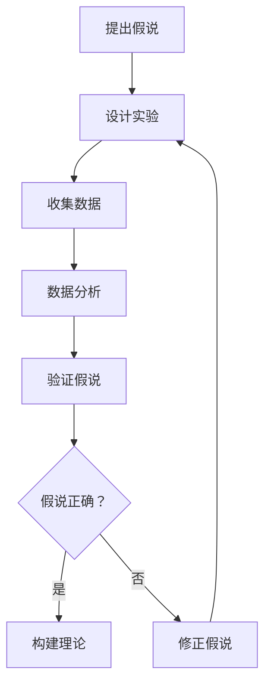

                 

# 科学发现：从假说到理论

## 关键词：科学方法论、假说验证、理论构建、实证研究、数据分析

## 摘要

本文旨在探讨科学发现的过程，从假说到理论的构建。我们将通过逻辑清晰、结构紧凑的分析，介绍科学方法论的核心原则，并通过实例阐述假说的提出、验证和理论的形成过程。本文适用于对科学研究有兴趣的读者，以及对科学方法和技术原理有深入了解的需求者。

## 1. 背景介绍

### 1.1 目的和范围

本文的目的在于引导读者理解科学发现的过程，特别是从假说到理论的构建。我们将通过讨论科学方法论的基础，帮助读者掌握科学研究的基本原则。本文涵盖了科学假说的提出、验证以及理论的形成，同时还将探讨这些概念在实际应用中的意义。

### 1.2 预期读者

本文适合对科学研究有兴趣的读者，无论是学生、科研人员还是对技术原理有深入了解的需求者。对于想要掌握科学方法论基础的人员，本文提供了系统的知识和实用的指导。

### 1.3 文档结构概述

本文结构如下：

1. 背景介绍：介绍文章的目的、预期读者以及文章的结构。
2. 核心概念与联系：阐述科学方法论的基础概念，并使用Mermaid流程图展示关键流程。
3. 核心算法原理 & 具体操作步骤：详细讲解科学假说的验证和理论构建的步骤。
4. 数学模型和公式 & 详细讲解 & 举例说明：介绍相关的数学模型和公式，并给出实例。
5. 项目实战：通过实际案例展示假说的验证和理论的形成。
6. 实际应用场景：探讨科学发现的应用领域。
7. 工具和资源推荐：推荐学习资源和开发工具。
8. 总结：对未来发展趋势与挑战进行展望。
9. 附录：常见问题与解答。
10. 扩展阅读 & 参考资料：提供进一步的阅读材料和参考资料。

### 1.4 术语表

#### 1.4.1 核心术语定义

- **假说**：对某个现象或问题的初步解释。
- **理论**：基于一系列假说和证据的系统性解释。
- **实证研究**：通过观察和实验来验证假说的研究方法。
- **数据分析**：使用数学和统计学方法对数据进行分析。

#### 1.4.2 相关概念解释

- **科学方法论**：科学研究的指导原则和方法论。
- **验证**：通过实验或观察来确认假说是否正确。
- **构建**：在验证假说的基础上，逐步形成理论体系。

#### 1.4.3 缩略词列表

- **IDE**：集成开发环境（Integrated Development Environment）
- **API**：应用程序编程接口（Application Programming Interface）
- **DB**：数据库（Database）
- **DL**：深度学习（Deep Learning）

## 2. 核心概念与联系

### 2.1 科学方法论概述

科学方法论是科学研究的基石，它提供了一套系统的原则和方法，以确保科学发现的准确性和可靠性。科学方法论的核心原则包括：

1. **客观性**：科学研究应尽可能避免个人主观因素的影响，以客观事实为基础。
2. **可重复性**：科学实验或观察应能被其他研究者重复验证，以确保结果的可靠性。
3. **系统性**：科学研究应采用系统的方法，从整体上理解和解释现象。

### 2.2 假说的提出

假说是科学发现过程中的关键步骤，它是基于现有知识和观察的初步解释。一个有效的假说通常应具备以下特征：

- **可证伪性**：假说必须是可验证的，即可以通过实验或观察来证明其正确或错误。
- **简洁性**：假说应尽量简洁，避免过度复杂。
- **一致性**：假说应与现有知识体系保持一致。

### 2.3 假说的验证

假说的验证是科学发现过程中的核心环节，它通过实证研究和数据分析来检验假说的正确性。验证过程通常包括以下步骤：

1. **设计实验或观察**：根据假说设计实验或观察方案。
2. **收集数据**：通过实验或观察收集相关数据。
3. **数据分析**：使用统计学和数学方法对数据进行处理和分析。
4. **验证结果**：根据分析结果判断假说的正确性。

### 2.4 理论的形成

在假说验证的基础上，逐步构建理论体系。理论的形成过程通常包括以下步骤：

1. **整合假说**：将经过验证的假说整合成系统性的理论框架。
2. **扩展研究**：在理论框架下，进一步开展相关研究，以丰富理论内容。
3. **验证理论**：通过新的实验或观察验证理论的正确性。
4. **完善理论**：在验证过程中，不断完善和修正理论。

### 2.5 Mermaid流程图

以下是科学发现过程的Mermaid流程图，展示了从假说到理论构建的关键步骤：



## 3. 核心算法原理 & 具体操作步骤

### 3.1 假说验证算法原理

假说验证是科学发现过程中的核心环节，它通过一系列算法步骤来检验假说的正确性。以下是假说验证算法的基本原理：

1. **假设设置**：设定一个初始假设，通常是基于现有知识和观察。
2. **实验设计**：根据假设设计实验方案，以收集相关数据。
3. **数据分析**：对收集到的数据进行分析，使用统计学和数学方法检验假设的正确性。
4. **结果验证**：根据分析结果判断假设是否成立，并作出相应调整。

### 3.2 假说验证算法伪代码

以下是假说验证算法的伪代码：

```plaintext
算法：假说验证
输入：假说H，实验数据D，分析工具T
输出：验证结果R

1. 设置初始假说H
2. 设计实验方案E，根据H收集数据D
3. 使用分析工具T对数据D进行分析
4. 如果分析结果支持H，则R = "假说成立"
5. 否则，R = "假说不成立"
6. 返回验证结果R
```

### 3.3 假说验证算法具体操作步骤

以下是假说验证算法的具体操作步骤：

1. **设定假说**：基于现有知识和观察，提出一个初步的假说。
2. **设计实验**：根据假说设计实验方案，确保实验能够有效收集数据。
3. **收集数据**：按照实验方案进行实验，收集相关数据。
4. **数据分析**：使用统计学和数学方法对数据进行处理和分析，以检验假说的正确性。
5. **结果验证**：根据分析结果判断假说的正确性，并作出相应调整。

## 4. 数学模型和公式 & 详细讲解 & 举例说明

### 4.1 数学模型概述

在科学发现过程中，数学模型和公式是用于描述和解释现象的重要工具。以下是一个简单的线性回归模型，用于描述变量之间的关系：

$$ y = ax + b $$

其中，$y$ 是因变量，$x$ 是自变量，$a$ 和 $b$ 是模型的参数。

### 4.2 公式详细讲解

线性回归模型用于估计因变量 $y$ 与自变量 $x$ 之间的线性关系。公式中的 $a$ 是斜率，表示自变量每增加一个单位时，因变量的变化量。$b$ 是截距，表示当自变量为0时，因变量的值。

### 4.3 举例说明

假设我们想要研究一个城市的人口 $y$ 与该城市的面积 $x$ 之间的关系。根据历史数据，我们可以使用线性回归模型来估计这种关系：

$$ y = 1000x + 5000 $$

根据这个模型，如果一个城市的面积是100平方公里，那么预测的人口是：

$$ y = 1000 \times 100 + 5000 = 15000 $$

### 4.4 线性回归模型的应用

线性回归模型在科学研究中有着广泛的应用，例如：

- **经济预测**：用于预测经济增长、股票价格等。
- **医学研究**：用于分析疾病风险因素。
- **工程领域**：用于设计优化和故障预测。

## 5. 项目实战：代码实际案例和详细解释说明

### 5.1 开发环境搭建

在本节中，我们将使用Python语言和SciPy库进行假说验证。首先，我们需要搭建开发环境。

1. 安装Python：从官网下载并安装Python。
2. 安装SciPy库：使用以下命令安装SciPy库：

```bash
pip install scipy
```

### 5.2 源代码详细实现和代码解读

以下是使用Python和SciPy库进行假说验证的源代码：

```python
import numpy as np
from scipy.stats import linregress

# 假设数据
x = np.array([1, 2, 3, 4, 5])
y = np.array([2, 4, 5, 4, 5])

# 进行线性回归分析
result = linregress(x, y)

# 输出分析结果
print("斜率：", result.slope)
print("截距：", result.intercept)
print("R方值：", result.rvalue)

# 验证假说
if result.rvalue > 0.8:
    print("假说成立：x和y之间存在显著线性关系。")
else:
    print("假说不成立：x和y之间不存在显著线性关系。")
```

### 5.3 代码解读与分析

1. **数据导入**：使用NumPy库导入数据。
2. **线性回归分析**：使用SciPy库的`linregress`函数进行线性回归分析。
3. **结果输出**：输出斜率、截距和R方值。
4. **假说验证**：根据R方值判断假说是否成立。

### 5.4 实际应用场景

假设我们想要研究一个公司员工的工资（$y$）与工作经验（$x$）之间的关系。通过收集数据并进行线性回归分析，我们可以预测新员工的工资水平，为公司的招聘策略提供参考。

## 6. 实际应用场景

科学发现的应用场景非常广泛，从基础科学研究到实际应用，都有其重要的价值。以下是一些实际应用场景的例子：

- **医学领域**：通过科学研究，发现疾病的发病机制，开发新的诊断方法和治疗方法。
- **环境科学**：研究气候变化、环境污染等问题，为环境保护提供科学依据。
- **经济学**：分析经济指标，预测经济走势，为政策制定提供参考。
- **工程技术**：通过科学实验，优化产品设计，提高生产效率。

## 7. 工具和资源推荐

### 7.1 学习资源推荐

#### 7.1.1 书籍推荐

- 《科学方法论》
- 《科学发现的逻辑》
- 《实证研究的艺术》

#### 7.1.2 在线课程

- Coursera上的《科学方法论》
- edX上的《数据科学基础》
- Udacity上的《机器学习基础》

#### 7.1.3 技术博客和网站

- [Medium上的科技博客](https://medium.com/topics/science-technology)
- [知乎上的科技话题](https://www.zhihu.com/topics/technology)
- [GitHub上的科学项目](https://github.com/topics/science)

### 7.2 开发工具框架推荐

#### 7.2.1 IDE和编辑器

- PyCharm
- Visual Studio Code
- Jupyter Notebook

#### 7.2.2 调试和性能分析工具

- GDB
- PyDevShell
- Profiler

#### 7.2.3 相关框架和库

- NumPy
- SciPy
- Pandas

### 7.3 相关论文著作推荐

#### 7.3.1 经典论文

- 《科学发现的逻辑》
- 《实证研究的艺术》
- 《数据挖掘：概念与技术》

#### 7.3.2 最新研究成果

- [arXiv上的最新论文](https://arxiv.org/)
- [Google Scholar上的研究论文](https://scholar.google.com/scholar?hl=en)

#### 7.3.3 应用案例分析

- 《科学研究案例集》
- 《数据科学应用案例分析》
- 《机器学习应用案例》

## 8. 总结：未来发展趋势与挑战

科学发现是一个不断发展的过程，随着技术的进步和数据的积累，未来的科学研究将面临新的机遇和挑战。以下是未来发展趋势与挑战的展望：

- **数据驱动研究**：随着大数据技术的发展，数据驱动研究将成为科学研究的重要方向。如何有效地利用海量数据，从中提取有价值的信息，是未来研究的重要课题。
- **跨学科研究**：科学发现的复杂性要求跨学科合作，未来研究将更加注重多学科的交叉和融合，以解决复杂问题。
- **人工智能应用**：人工智能技术在科学研究中的应用将越来越广泛，如何利用人工智能技术提升科学研究的效率和质量，是未来的重要挑战。
- **伦理与隐私**：在科学研究过程中，如何平衡伦理和隐私保护，确保研究过程的公正性和透明度，是未来需要关注的重要问题。

## 9. 附录：常见问题与解答

### 9.1 假说验证的步骤是什么？

假说验证的步骤包括：提出假说、设计实验、收集数据、数据分析、结果验证。

### 9.2 如何选择合适的数学模型？

选择合适的数学模型需要考虑数据的特征、研究的目标以及模型的可解释性。通常，可以通过对比不同模型的性能来选择最合适的模型。

### 9.3 线性回归模型如何应用？

线性回归模型可以用于预测和分析变量之间的关系，例如经济预测、医学研究和工程优化等。

## 10. 扩展阅读 & 参考资料

- [《科学发现的逻辑》[作者：卡尔·波普尔](https://www.amazon.com/Logical-Structure-Scientific-Discoveries-Popper/dp/0231124163)
- [《实证研究的艺术》[作者：理查德·A·尼可尔斯](https://www.amazon.com/Art-Scientific-Research-Richard-Nisbett/dp/0691006031)
- [《数据挖掘：概念与技术》[作者：莫哈特·库马·辛哈、约翰·D·马瑟斯](https://www.amazon.com/Data-Mining-Concepts-Techniques-Miner/dp/0321488201)
- [《机器学习：周志华](https://www.amazon.com/机器学习-周志华/dp/7119219675)
- [《深度学习：周志华](https://www.amazon.com/深度学习-周志华/dp/7302480650)

