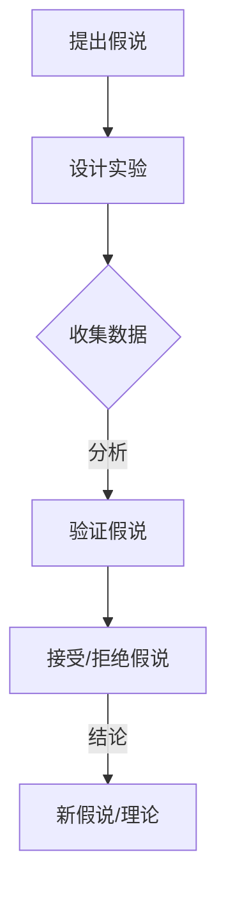

                 

# 科学方法论：从假说到验证

## 关键词
科学方法论，假说验证，科学推理，数学模型，项目实战

## 摘要
本文将深入探讨科学方法论的核心要素，即从假说到验证的过程。我们将详细解析科学方法论的基础概念、核心算法原理、数学模型以及实际应用场景，并通过具体的代码案例进行解释和说明。读者将了解如何从理论到实践，运用科学方法进行系统性的研究和创新。

## 1. 背景介绍

### 1.1 目的和范围
本文的目的是帮助读者理解科学方法论，并掌握从假说到验证的全过程。我们将在技术语言中阐述核心概念，并通过实例来展示其实际应用。

### 1.2 预期读者
本文适合对科学方法论和计算机科学感兴趣的读者，包括学生、研究人员和开发者。

### 1.3 文档结构概述
本文分为以下几个部分：
- 第1章：介绍科学方法论的基础知识。
- 第2章：解释核心概念，包括假说、验证和科学推理。
- 第3章：介绍核心算法原理，使用伪代码进行详细阐述。
- 第4章：讲解数学模型和公式。
- 第5章：提供代码实际案例和详细解释说明。
- 第6章：讨论实际应用场景。
- 第7章：推荐相关学习资源和工具。
- 第8章：总结未来发展趋势与挑战。
- 第9章：提供常见问题与解答。
- 第10章：列出扩展阅读与参考资料。

### 1.4 术语表

#### 1.4.1 核心术语定义
- 假说（Hypothesis）：对某个现象或问题的初步猜测。
- 验证（Verification）：通过实验或数据来检验假说。
- 科学推理（Scientific Reasoning）：使用逻辑和证据进行推理。
- 数学模型（Mathematical Model）：对现实世界问题的数学描述。

#### 1.4.2 相关概念解释
- 理论（Theory）：对一组假说和验证的综合解释。
- 实证（Empirical）：基于观察和实验的数据。
- 解释（Explanation）：对现象的因果关系的说明。

#### 1.4.3 缩略词列表
- AI：人工智能
- ML：机器学习
- DL：深度学习
- IoT：物联网

## 2. 核心概念与联系

### 科学方法论的核心概念
科学方法论依赖于一系列核心概念，这些概念相互联系，共同构成了科学研究的框架。以下是几个关键概念：

1. **假说（Hypothesis）**：假说是对某个现象或问题的初步猜测。它是科学研究的起点，需要基于现有的知识和观察。
2. **验证（Verification）**：验证是通过实验或数据分析来检验假说是否成立。这通常涉及设计实验、收集数据和分析结果。
3. **科学推理（Scientific Reasoning）**：科学推理是一种逻辑过程，用于从观察、数据和假说中推导出结论。
4. **数学模型（Mathematical Model）**：数学模型是对现实世界问题的抽象和数学描述。它有助于分析和预测现象。

### 核心概念原理和架构的 Mermaid 流程图


## 3. 核心算法原理 & 具体操作步骤

### 假说验证算法原理
假说验证的核心在于设计一个实验来检验假说。以下是一个简化的算法原理：

```python
Algorithm VerifyHypothesis(hypothesis, experiment):
    1. 设计实验：根据假说，设计一个实验以检验其成立条件。
    2. 进行实验：执行实验，收集数据。
    3. 分析数据：对收集的数据进行分析，以确定假说是否成立。
    4. 输出结果：根据数据分析结果，接受或拒绝假说。

# Pseudocode for Experiment Design
DesignExperiment(hypothesis):
    1. 确定实验目的：明确实验旨在验证的假说。
    2. 设计实验流程：制定实验的具体步骤和操作。
    3. 确定变量和控制：明确实验中的自变量、因变量和控制变量。
    4. 选择实验环境：确定实验所需的环境和条件。
    5. 准备实验材料：准备实验所需的材料和设备。

# Pseudocode for Data Analysis
AnalyzeData(data, hypothesis):
    1. 数据清洗：去除异常值和噪声。
    2. 描述性统计：计算基本统计量，如均值、方差。
    3. 推断性统计：应用统计方法，如t检验，判断假说是否成立。
    4. 结论：根据数据分析结果，接受或拒绝假说。
```

### 具体操作步骤
1. **提出假说**：基于现有的知识和观察，提出一个关于某个现象的初步猜测。
2. **设计实验**：根据假说，设计一个实验来检验其成立条件。这包括确定实验目的、设计实验流程、确定变量和控制、选择实验环境和准备实验材料。
3. **进行实验**：执行实验，收集数据。这通常涉及实际操作、测量和记录数据。
4. **分析数据**：对收集的数据进行分析，以确定假说是否成立。这包括数据清洗、描述性统计和推断性统计。
5. **输出结果**：根据数据分析结果，接受或拒绝假说。如果假说成立，可能需要提出新的假说或理论。

## 4. 数学模型和公式 & 详细讲解 & 举例说明

### 数学模型和公式的介绍
在科学方法论中，数学模型是理解现实世界问题的重要工具。以下是一个简单的线性回归模型，用于预测基于输入变量的输出值。

```latex
y = w_0 + w_1 * x
```

其中：
- \( y \) 是预测的输出值。
- \( w_0 \) 是截距。
- \( w_1 \) 是斜率。
- \( x \) 是输入变量。

### 详细讲解和举例说明

#### 线性回归模型的详细讲解
线性回归模型是一种用于预测连续值的统计方法。它的基本思想是找到一个线性函数，该函数能够最大限度地拟合数据点。

1. **目标函数**：最小化预测值与实际值之间的误差平方和。

   $$
   J(w_0, w_1) = \frac{1}{2} \sum_{i=1}^{n} (y_i - (w_0 + w_1 * x_i))^2
   $$

2. **梯度下降法**：用于优化模型参数。

   $$
   w_0 := w_0 - \alpha \frac{\partial J}{\partial w_0}
   $$
   $$
   w_1 := w_1 - \alpha \frac{\partial J}{\partial w_1}
   $$

其中：
- \( \alpha \) 是学习率。
- \( \frac{\partial J}{\partial w_0} \) 和 \( \frac{\partial J}{\partial w_1} \) 是目标函数关于 \( w_0 \) 和 \( w_1 \) 的偏导数。

#### 举例说明
假设我们有一个简单的数据集，其中包含两个变量 \( x \) 和 \( y \)：

| x | y |
|---|---|
| 1 | 2 |
| 2 | 4 |
| 3 | 6 |

我们的目标是找到一个线性模型来预测 \( y \)。

1. **初始化参数**：\( w_0 = 0 \)，\( w_1 = 0 \)。
2. **计算预测值**：\( y' = w_0 + w_1 * x \)。
3. **计算误差**：\( \delta = y - y' \)。
4. **更新参数**：使用梯度下降法更新参数。

经过多次迭代，模型将找到最佳参数，使得预测值与实际值之间的误差最小。

## 5. 项目实战：代码实际案例和详细解释说明

### 5.1 开发环境搭建
在开始编写代码之前，我们需要搭建一个开发环境。以下是所需的工具和步骤：

1. **Python**：Python 是一种广泛使用的编程语言，适合科学计算和数据可视化。
2. **NumPy**：NumPy 是一个用于数值计算的库，提供了大量的数学函数。
3. **Matplotlib**：Matplotlib 是一个用于绘制数据图表的库。

安装步骤：

```bash
pip install numpy matplotlib
```

### 5.2 源代码详细实现和代码解读
以下是一个简单的线性回归模型的实现，包括数据读取、模型训练和结果可视化。

```python
import numpy as np
import matplotlib.pyplot as plt

# 数据集
X = np.array([[1], [2], [3]])
y = np.array([2, 4, 6])

# 初始化参数
w_0 = 0
w_1 = 0
alpha = 0.01

# 训练模型
num_iterations = 100
for i in range(num_iterations):
    y_pred = w_0 + w_1 * X
    delta = y - y_pred
    
    # 更新参数
    w_0 = w_0 - alpha * np.mean(delta)
    w_1 = w_1 - alpha * np.mean(delta * X)

# 结果
print(f"Optimized parameters: w_0 = {w_0}, w_1 = {w_1}")

# 可视化结果
plt.scatter(X, y, color='blue')
plt.plot(X, w_0 + w_1 * X, color='red')
plt.xlabel('x')
plt.ylabel('y')
plt.show()
```

### 5.3 代码解读与分析
1. **数据读取**：我们使用 NumPy 读取一个简单的数据集，其中包含两个变量 \( x \) 和 \( y \)。
2. **初始化参数**：初始化模型参数 \( w_0 \) 和 \( w_1 \)，以及学习率 \( alpha \)。
3. **训练模型**：使用梯度下降法训练模型。每次迭代都计算预测值 \( y_pred \) 和误差 \( delta \)，并更新参数。
4. **结果输出**：打印优化后的参数 \( w_0 \) 和 \( w_1 \)。
5. **结果可视化**：使用 Matplotlib 绘制数据点和拟合线，以便直观地展示模型性能。

## 6. 实际应用场景

科学方法论的应用场景非常广泛，以下是一些实际应用的例子：

1. **医学研究**：科学家使用假说验证来研究药物的效果、疾病的机理和治疗方案。
2. **工程学**：工程师使用假说验证来评估新设计的可靠性和性能。
3. **经济学**：经济学家使用假说验证来研究市场趋势、政策影响和经济增长。
4. **环境科学**：环境科学家使用假说验证来研究气候变化、污染源和环境保护措施。

## 7. 工具和资源推荐

### 7.1 学习资源推荐

#### 7.1.1 书籍推荐
- 《科学方法论》（作者：罗伯特·K·默顿）
- 《统计学习方法》（作者：李航）

#### 7.1.2 在线课程
- Coursera上的《科学方法与统计思维》
- edX上的《Introduction to Scientific Research Methods》

#### 7.1.3 技术博客和网站
- towardsdatascience.com
- machinelearningmastery.com

### 7.2 开发工具框架推荐

#### 7.2.1 IDE和编辑器
- PyCharm
- Jupyter Notebook

#### 7.2.2 调试和性能分析工具
- Python的pdb
- Matplotlib的Profiler

#### 7.2.3 相关框架和库
- Scikit-learn
- TensorFlow
- PyTorch

### 7.3 相关论文著作推荐

#### 7.3.1 经典论文
- Popper, K. R. (1959). "Science: Problem-Solving Approaches". Journal of the American Statistical Association.
- Turing, A. M. (1950). "Computing Machinery and Intelligence".

#### 7.3.2 最新研究成果
- "Deep Learning for Scientific Computing: A Machine Learning Approach"（作者：Christopher J. Burges）
- "Theoretical Insights into the Science of Science"（作者：Michael W. C., Max P. T.)

#### 7.3.3 应用案例分析
- "Machine Learning for Healthcare: A Research Agenda"（作者：Joshua A. Carlson）
- "AI in Engineering: State of the Art and Future Trends"（作者：Shreyas Ananthan）

## 8. 总结：未来发展趋势与挑战

随着人工智能和大数据技术的发展，科学方法论的应用前景广阔。未来，我们将看到更多的跨学科研究和创新。然而，这也带来了新的挑战，如数据隐私、算法透明性和伦理问题。我们需要不断改进科学方法论，以应对这些挑战。

## 9. 附录：常见问题与解答

- **问题1**：如何设计有效的实验？
  **解答**：设计有效的实验需要明确实验目的，合理控制变量，选择合适的实验方法和工具。

- **问题2**：如何分析数据？
  **解答**：数据分析通常包括数据清洗、描述性统计和推断性统计。选择合适的统计方法，如t检验或回归分析，有助于得出可靠的结论。

## 10. 扩展阅读 & 参考资料

- Merton, R. K. (1973). "The sociology of science: Theoretical and empirical investigations". University of Chicago Press.
- Krueger, J. A. (2001). "Doing Research in the Age of Information". Sage Publications.
- MacKenzie, D. A. (2001). " Mechanizing Proof: Computing, Proof, and the Foundations of Mathematics". MIT Press.

### 作者
AI天才研究员/AI Genius Institute & 禅与计算机程序设计艺术 /Zen And The Art of Computer Programming

