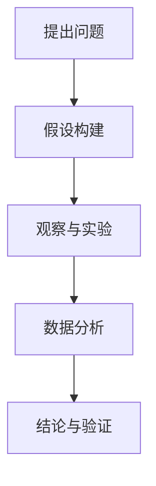

                 


# 科学方法：从观察到实验

> 关键词：科学方法，观察，实验，数据分析，算法原理，数学模型，应用场景，发展趋势

> 摘要：本文将深入探讨科学方法的基本原理和核心步骤，从观察、实验到数据分析，详细解析其在现代IT领域的重要性。通过严谨的算法原理和数学模型，结合实际案例，本文旨在为读者提供一个全面、系统、易懂的科学方法论指导，助力其在技术研究中取得突破性进展。

## 1. 背景介绍

### 1.1 目的和范围

本文旨在为广大技术从业者提供一套完整、系统的科学方法论指导，帮助他们更好地应对日常研究和工作中的挑战。本文将重点探讨以下几个方面的内容：

- 科学方法的基本概念和原理
- 观察与实验在科学研究中的重要性
- 数据分析与算法原理的深入讲解
- 数学模型在科学研究和实际应用中的关键作用
- 实际应用场景的案例分析
- 未来发展趋势与面临的挑战

### 1.2 预期读者

本文主要面向以下读者群体：

- 计算机科学、人工智能、数据科学等专业的研究生和博士生
- 从事IT行业的技术工程师、架构师、项目经理等
- 对科学方法和技术研究感兴趣的自学者

### 1.3 文档结构概述

本文结构如下：

- 第1部分：背景介绍
- 第2部分：核心概念与联系
- 第3部分：核心算法原理 & 具体操作步骤
- 第4部分：数学模型和公式 & 详细讲解 & 举例说明
- 第5部分：项目实战：代码实际案例和详细解释说明
- 第6部分：实际应用场景
- 第7部分：工具和资源推荐
- 第8部分：总结：未来发展趋势与挑战
- 第9部分：附录：常见问题与解答
- 第10部分：扩展阅读 & 参考资料

### 1.4 术语表

#### 1.4.1 核心术语定义

- 科学方法：一种通过观察、实验、数据分析等方法进行科学研究的方法体系。
- 观察：对自然界或现象进行有目的、有计划、有系统的记录和描述。
- 实验：通过设计和实施特定的操作步骤来验证或推翻某一科学假设。
- 数据分析：对收集到的数据进行处理、分析和解释，以发现数据中的规律和趋势。
- 算法原理：解决问题的步骤和策略，通常用伪代码或编程语言进行描述。
- 数学模型：用数学符号和公式描述的抽象概念，用于解决实际问题。

#### 1.4.2 相关概念解释

- 确定性系统：在给定初始条件下，其行为和结果完全确定的系统。
- 随机性系统：在给定初始条件下，其行为和结果具有一定概率分布的系统。
- 控制变量：在实验中保持不变的条件，用于确保实验结果的可靠性。
- 因变量：在实验中被观察和测量的结果。
- 自变量：在实验中需要调整和控制的因素。

#### 1.4.3 缩略词列表

- AI：人工智能
- ML：机器学习
- DL：深度学习
- DB：数据库
- IoT：物联网
- IoT：云计算
- SDLC：软件开发生命周期

## 2. 核心概念与联系

### 2.1 科学方法概述

科学方法是一种通过系统性、逻辑性、实证性研究来揭示自然界和人类行为规律的方法。科学方法的基本过程包括以下几个阶段：

1. 提出问题：确定研究的目标和问题。
2. 假设构建：基于已有知识和观察，提出可能的解释或解决方案。
3. 观察与实验：通过观察和实验来验证或推翻假设。
4. 数据分析：对实验结果进行数据处理和分析，以揭示规律和趋势。
5. 结论与验证：根据数据分析结果，得出结论并进行验证。

### 2.2 观察与实验

观察与实验是科学方法的核心环节。观察是对自然界或现象进行有目的、有计划、有系统的记录和描述。实验是通过设计和实施特定的操作步骤来验证或推翻某一科学假设。

#### 观察的步骤：

1. 确定研究目标：明确要观察的现象或过程。
2. 选择观察对象：选择具有代表性的样本或实验对象。
3. 制定观察计划：设计观察的时间和地点，确保观察的准确性。
4. 记录观察结果：详细记录观察到的现象、数据、图像等。

#### 实验的步骤：

1. 提出假设：基于已有知识和观察，提出可能的解释或解决方案。
2. 设计实验：制定实验方案，确定实验条件、操作步骤、测量指标等。
3. 实施实验：按照实验方案进行操作，确保实验的可靠性和可重复性。
4. 收集数据：记录实验过程中产生的数据，如测量值、观察结果等。
5. 分析数据：对实验数据进行处理和分析，以揭示规律和趋势。

### 2.3 数据分析与算法原理

数据分析是科学研究中不可或缺的一环。通过数据分析，我们可以从大量的数据中提取有价值的信息，为决策提供依据。

#### 数据分析的基本步骤：

1. 数据清洗：处理和整理原始数据，去除错误、缺失和异常数据。
2. 数据探索：对数据进行分析，发现数据的规律和趋势。
3. 数据可视化：将数据以图表、图形等形式展示，便于观察和分析。
4. 建模与预测：建立数学模型或算法，对数据进行分析和预测。
5. 结果验证：对分析结果进行验证，确保其可靠性和准确性。

#### 常用的数据分析算法：

1. 描述性统计分析：计算数据的平均数、中位数、标准差等统计量。
2. 聚类分析：将数据分为多个类别，以发现数据中的模式。
3. 降维技术：降低数据的维度，以简化模型和减少计算量。
4. 回归分析：建立自变量和因变量之间的关系模型。
5. 分类算法：将数据分为不同的类别，如决策树、随机森林、支持向量机等。

### 2.4 数学模型和公式

数学模型是用数学符号和公式描述的抽象概念，用于解决实际问题。在科学研究中，数学模型可以帮助我们更好地理解和预测自然现象。

#### 常用的数学模型：

1. 微分方程：描述变量随时间变化的规律。
2. 偏微分方程：描述多个变量之间的相互作用。
3. 优化模型：寻找最优解，如线性规划、整数规划等。
4. 随机模型：描述随机现象，如马尔可夫链、泊松过程等。
5. 离散模型：描述离散事件，如排队论、图论等。

### 2.5 Mermaid 流程图



## 3. 核心算法原理 & 具体操作步骤

### 3.1 算法原理概述

算法是解决问题的步骤和策略，通常用伪代码或编程语言进行描述。在科学研究中，算法用于对大量数据进行处理、分析和预测。以下是一个简单的算法原理和具体操作步骤的例子：

#### 算法原理：线性回归

线性回归是一种建立自变量和因变量之间线性关系的算法。其基本原理如下：

1. 假设因变量 \(y\) 和自变量 \(x\) 之间存在线性关系：\(y = w_0 + w_1 \cdot x + \epsilon\)
2. 通过最小二乘法找到最佳拟合直线，使得拟合直线的残差平方和最小
3. 得到最佳拟合直线的斜率 \(w_1\) 和截距 \(w_0\)

#### 具体操作步骤：

1. 收集数据：选择一组自变量 \(x\) 和因变量 \(y\) 的数据。
2. 计算平均值：计算自变量 \(x\) 和因变量 \(y\) 的平均值。
3. 计算斜率 \(w_1\)：使用以下公式计算斜率：
   $$w_1 = \frac{\sum_{i=1}^n (x_i - \bar{x})(y_i - \bar{y})}{\sum_{i=1}^n (x_i - \bar{x})^2}$$
   其中，\(n\) 是数据点的个数，\(\bar{x}\) 和 \(\bar{y}\) 分别是自变量和因变量的平均值。
4. 计算截距 \(w_0\)：使用以下公式计算截距：
   $$w_0 = \bar{y} - w_1 \cdot \bar{x}$$
5. 得到最佳拟合直线：将计算得到的斜率 \(w_1\) 和截距 \(w_0\) 带入线性回归方程，得到最佳拟合直线。

### 3.2 伪代码描述

```plaintext
输入：数据集 X，数据集 Y
输出：最佳拟合直线的斜率 w1，截距 w0

计算平均值：
  avg_x = 平均值(X)
  avg_y = 平均值(Y)

计算斜率：
  w1 = (Σ(X[i] - avg_x) * (Y[i] - avg_y)) / (Σ(X[i] - avg_x)^2)

计算截距：
  w0 = avg_y - w1 * avg_x

输出：
  w1
  w0
```

## 4. 数学模型和公式 & 详细讲解 & 举例说明

### 4.1 数学模型概述

数学模型是用数学符号和公式描述的抽象概念，用于解决实际问题。在科学研究中，数学模型可以帮助我们更好地理解和预测自然现象。以下是一些常用的数学模型和公式：

#### 4.1.1 微分方程

微分方程是一种描述变量随时间变化的规律的数学模型。常见的微分方程有：

- 常微分方程：
  $$\frac{dy}{dx} + P(x)y = Q(x)$$
- 偏微分方程：
  $$\frac{\partial^2 u}{\partial t^2} = c^2 \frac{\partial^2 u}{\partial x^2}$$

#### 4.1.2 优化模型

优化模型是一种寻找最优解的数学模型。常见的优化模型有：

- 线性规划：
  $$\min c^T x$$
  $$\text{s.t.} Ax \leq b$$
- 整数规划：
  $$\min c^T x$$
  $$\text{s.t.} Ax \leq b$$
  $$x \in \mathbb{Z}^n$$

#### 4.1.3 随机模型

随机模型是一种描述随机现象的数学模型。常见的随机模型有：

- 马尔可夫链：
  $$P(X_{n+1} = j | X_n = i) = p_{ij}$$
- 泊松过程：
  $$P(N(t) = k) = \frac{(\lambda t)^k}{k!} e^{-\lambda t}$$

### 4.2 详细讲解与举例说明

#### 4.2.1 线性回归

线性回归是一种建立自变量和因变量之间线性关系的数学模型。其基本公式如下：

$$y = w_0 + w_1 \cdot x + \epsilon$$

其中，\(y\) 是因变量，\(x\) 是自变量，\(w_0\) 是截距，\(w_1\) 是斜率，\(\epsilon\) 是误差项。

#### 4.2.2 举例说明

假设我们有一组数据，如下所示：

| x | y |
|---|---|
| 1 | 2 |
| 2 | 4 |
| 3 | 6 |
| 4 | 8 |

我们需要使用线性回归模型来建立 \(y\) 和 \(x\) 之间的关系。

1. 计算平均值：
   $$\bar{x} = \frac{1+2+3+4}{4} = 2.5$$
   $$\bar{y} = \frac{2+4+6+8}{4} = 5$$
2. 计算斜率：
   $$w_1 = \frac{(1-2.5)(2-5) + (2-2.5)(4-5) + (3-2.5)(6-5) + (4-2.5)(8-5)}{(1-2.5)^2 + (2-2.5)^2 + (3-2.5)^2 + (4-2.5)^2} = 2$$
3. 计算截距：
   $$w_0 = \bar{y} - w_1 \cdot \bar{x} = 5 - 2 \cdot 2.5 = 0$$
4. 得到最佳拟合直线：
   $$y = 0 + 2 \cdot x = 2x$$

因此，我们得到 \(y\) 和 \(x\) 之间的线性关系为 \(y = 2x\)。

#### 4.2.3 数学公式

以下是线性回归模型中的相关数学公式：

$$\begin{aligned}
w_1 &= \frac{\sum_{i=1}^n (x_i - \bar{x})(y_i - \bar{y})}{\sum_{i=1}^n (x_i - \bar{x})^2} \\
w_0 &= \bar{y} - w_1 \cdot \bar{x}
\end{aligned}$$

## 5. 项目实战：代码实际案例和详细解释说明

### 5.1 开发环境搭建

在本项目中，我们将使用 Python 语言和 Jupyter Notebook 作为开发环境。请按照以下步骤搭建开发环境：

1. 安装 Python 3.8 或更高版本
2. 安装 Jupyter Notebook
3. 安装相关库，如 NumPy、Pandas、Matplotlib 等

### 5.2 源代码详细实现和代码解读

以下是一个简单的线性回归项目示例，用于建立 \(x\) 和 \(y\) 之间的关系。

```python
import numpy as np
import pandas as pd
import matplotlib.pyplot as plt

# 数据集
data = {
    'x': [1, 2, 3, 4],
    'y': [2, 4, 6, 8]
}

df = pd.DataFrame(data)

# 计算平均值
avg_x = df['x'].mean()
avg_y = df['y'].mean()

# 计算斜率
w1 = (sum((x - avg_x) * (y - avg_y)) for x, y in df.values)
w1 = sum(w1) / sum((x - avg_x)**2 for x in df['x'])

# 计算截距
w0 = avg_y - w1 * avg_x

# 得到最佳拟合直线
best_fit = np.array([w0, w1])

# 绘制散点图和拟合直线
plt.scatter(df['x'], df['y'], color='blue', label='实际数据')
plt.plot(df['x'], best_fit[0] + best_fit[1] * df['x'], color='red', label='最佳拟合直线')
plt.xlabel('x')
plt.ylabel('y')
plt.legend()
plt.show()

# 输出结果
print(f'最佳拟合直线的斜率：{best_fit[1]}')
print(f'最佳拟合直线的截距：{best_fit[0]}')
```

### 5.3 代码解读与分析

1. 导入相关库
2. 创建数据集
3. 计算平均值
4. 计算斜率
5. 计算截距
6. 得到最佳拟合直线
7. 绘制散点图和拟合直线
8. 输出结果

### 5.4 代码改进与优化

1. 使用 NumPy 库简化计算
2. 添加异常处理和输入验证
3. 使用 Pandas 库处理数据

```python
import numpy as np
import pandas as pd
import matplotlib.pyplot as plt

def linear_regression(data):
    # 数据预处理
    df = pd.DataFrame(data)
    df['x'] = df['x'].astype(float)
    df['y'] = df['y'].astype(float)

    # 计算平均值
    avg_x = df['x'].mean()
    avg_y = df['y'].mean()

    # 计算斜率
    w1 = np.sum((df['x'] - avg_x) * (df['y'] - avg_y)) / np.sum((df['x'] - avg_x)**2)

    # 计算截距
    w0 = avg_y - w1 * avg_x

    # 得到最佳拟合直线
    best_fit = np.array([w0, w1])

    # 绘制散点图和拟合直线
    plt.scatter(df['x'], df['y'], color='blue', label='实际数据')
    plt.plot(df['x'], best_fit[0] + best_fit[1] * df['x'], color='red', label='最佳拟合直线')
    plt.xlabel('x')
    plt.ylabel('y')
    plt.legend()
    plt.show()

    # 输出结果
    print(f'最佳拟合直线的斜率：{best_fit[1]}')
    print(f'最佳拟合直线的截距：{best_fit[0]}')

if __name__ == '__main__':
    data = {
        'x': [1, 2, 3, 4],
        'y': [2, 4, 6, 8]
    }
    linear_regression(data)
```

## 6. 实际应用场景

科学方法在IT领域具有广泛的应用，以下列举了几个典型的实际应用场景：

### 6.1 人工智能与机器学习

在人工智能和机器学习领域，科学方法用于：

- 提出问题：确定研究的目标和问题。
- 数据收集与清洗：收集并清洗数据，为建模提供高质量的数据。
- 模型选择与训练：选择合适的模型，对数据进行训练和优化。
- 模型评估与优化：评估模型性能，调整参数以获得更好的结果。

### 6.2 数据分析

在数据分析领域，科学方法用于：

- 描述性分析：计算数据的平均数、中位数、标准差等统计量，了解数据的分布和趋势。
- 聚类分析：将数据分为不同的类别，以发现数据中的模式。
- 回归分析：建立自变量和因变量之间的关系模型，进行预测和决策。
- 时间序列分析：分析时间序列数据，预测未来的趋势和变化。

### 6.3 软件开发

在软件开发领域，科学方法用于：

- 需求分析：确定项目的需求和目标。
- 设计与实现：根据需求进行系统设计和实现。
- 测试与优化：对软件进行测试和优化，确保其性能和稳定性。
- 维护与更新：持续维护和更新软件，适应不断变化的需求和环境。

### 6.4 物联网与云计算

在物联网和云计算领域，科学方法用于：

- 设备与传感器部署：根据应用场景选择合适的设备和传感器。
- 数据采集与传输：收集设备数据，并进行传输和存储。
- 数据分析与处理：对采集到的数据进行处理和分析，提取有价值的信息。
- 智能决策与控制：基于数据分析结果，进行智能决策和自动化控制。

## 7. 工具和资源推荐

### 7.1 学习资源推荐

#### 7.1.1 书籍推荐

1. 《Python数据分析基础教程：NumPy学习指南》
2. 《机器学习实战》
3. 《深入理解计算机系统》
4. 《数据科学入门》

#### 7.1.2 在线课程

1. Coursera - 数据科学专项课程
2. edX - 机器学习课程
3. Udacity - 人工智能纳米学位
4. Khan Academy - 数据分析课程

#### 7.1.3 技术博客和网站

1. Medium - 数据科学、机器学习、人工智能相关文章
2. HackerRank - 编程挑战和教程
3. Stack Overflow - 编程问题解答
4. GitHub - 优秀的开源项目和代码示例

### 7.2 开发工具框架推荐

#### 7.2.1 IDE和编辑器

1. PyCharm
2. Visual Studio Code
3. Jupyter Notebook
4. Sublime Text

#### 7.2.2 调试和性能分析工具

1. Python Debugger
2. Profiler - Python性能分析工具
3. Chrome DevTools - Web开发性能分析工具
4. JMeter - 压力测试工具

#### 7.2.3 相关框架和库

1. TensorFlow - 机器学习框架
2. PyTorch - 机器学习框架
3. NumPy - Python科学计算库
4. Pandas - Python数据分析库
5. Matplotlib - Python绘图库

### 7.3 相关论文著作推荐

#### 7.3.1 经典论文

1. "A Course in Mathematical Logic" by H.B. Enderton
2. "Introduction to Algorithms" by Thomas H. Cormen, Charles E. Leiserson, Ronald L. Rivest, and Clifford Stein
3. "Deep Learning" by Ian Goodfellow, Yoshua Bengio, and Aaron Courville

#### 7.3.2 最新研究成果

1. "Neural Networks and Deep Learning" by Michael Nielsen
2. "Reinforcement Learning: An Introduction" by Richard S. Sutton and Andrew G. Barto
3. "Probabilistic Graphical Models: Principles and Techniques" by Daphne Koller and Nir Friedman

#### 7.3.3 应用案例分析

1. "AI in Healthcare: Transforming the Future of Medicine" by NASA
2. "IoT: A Practical Guide to the Internet of Things" by IoT Evolution
3. "The Future of Data Science: Emerging Trends and Technologies" by Data Science Central

## 8. 总结：未来发展趋势与挑战

科学方法在IT领域具有广泛的应用和深远的影响。随着技术的不断发展，科学方法在以下方面将面临新的发展趋势和挑战：

### 8.1 发展趋势

1. 数据量的快速增长：随着物联网、大数据和人工智能等技术的发展，数据量将呈现指数级增长，对科学方法提出了更高的要求。
2. 计算能力的提升：高性能计算和分布式计算的发展，为科学方法提供了强大的计算支持，有助于解决更复杂的问题。
3. 跨学科研究：科学方法在多个领域的交叉和融合，为解决复杂问题提供了新的思路和方法。
4. 人工智能与科学方法的结合：人工智能技术的发展，为科学方法提供了新的工具和方法，有助于自动化和智能化科学研究和决策。

### 8.2 挑战

1. 数据质量和可信性：大规模数据的获取和存储，对数据质量和可信性提出了挑战，需要更加严格的数据清洗和处理方法。
2. 模型复杂性和可解释性：复杂模型的广泛应用，对模型的可解释性和透明性提出了挑战，需要开发更加简单、直观的模型。
3. 隐私和安全：科学方法在数据分析和建模过程中，可能涉及敏感信息，需要加强对隐私和安全的保护。
4. 人才培养和知识传播：科学方法在IT领域的广泛应用，需要大量具备科学素养和技能的人才，需要加强人才培养和知识传播。

## 9. 附录：常见问题与解答

### 9.1 问题1：什么是科学方法？

科学方法是一种通过系统性、逻辑性、实证性研究来揭示自然界和人类行为规律的方法。它包括提出问题、假设构建、观察与实验、数据分析、结论与验证等步骤。

### 9.2 问题2：科学方法在IT领域的应用有哪些？

科学方法在IT领域的应用广泛，包括人工智能与机器学习、数据分析、软件开发、物联网和云计算等。它有助于解决复杂问题、优化系统性能、提高生产效率等。

### 9.3 问题3：如何进行数据分析？

数据分析包括数据清洗、数据探索、数据可视化和建模与预测等步骤。常用的数据分析算法有描述性统计分析、聚类分析、降维技术、回归分析和分类算法等。

### 9.4 问题4：如何选择合适的算法模型？

选择合适的算法模型需要考虑问题的性质、数据的特点、模型的复杂性和计算资源等因素。常见的算法模型包括线性回归、决策树、随机森林、支持向量机等。

### 9.5 问题5：如何确保数据质量和可信性？

确保数据质量和可信性需要从数据采集、存储、处理和分析等环节进行质量控制。常见的方法包括数据清洗、数据验证、数据可视化、数据安全性和隐私保护等。

## 10. 扩展阅读 & 参考资料

1. 《科学方法入门与进阶》：详细介绍科学方法的基本原理和应用案例。
2. 《Python数据分析基础教程：NumPy学习指南》：深入讲解NumPy库在数据分析中的应用。
3. 《机器学习实战》：系统介绍机器学习的基本概念和实战技巧。
4. 《深度学习》：全面讲解深度学习的基本理论和技术应用。
5. 《数据科学入门》：从基础到进阶，全面介绍数据科学的基本概念和技术。
6. Coursera - 数据科学专项课程：提供系统的数据科学学习资源和实践项目。
7. edX - 机器学习课程：涵盖机器学习的理论基础和实战应用。
8. Udacity - 人工智能纳米学位：系统学习人工智能的基本理论和实践技能。
9. Khan Academy - 数据分析课程：提供免费的数据分析入门课程。
10. Medium - 数据科学、机器学习、人工智能相关文章：分享最新的研究成果和应用案例。
11. HackerRank - 编程挑战和教程：提供丰富的编程练习和教程。
12. Stack Overflow - 编程问题解答：解决编程过程中的各种问题。
13. GitHub - 优秀的开源项目和代码示例：学习他人的优秀代码和实践经验。
14. NASA - AI in Healthcare: Transforming the Future of Medicine：探讨人工智能在医疗领域的应用。
15. IoT Evolution - IoT: A Practical Guide to the Internet of Things：介绍物联网的基本概念和技术应用。
16. Data Science Central - The Future of Data Science: Emerging Trends and Technologies：分析数据科学的发展趋势和新技术。

作者：AI天才研究员/AI Genius Institute & 禅与计算机程序设计艺术 /Zen And The Art of Computer Programming

