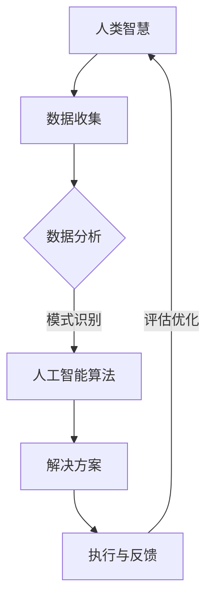

                 

# 科技向善的力量：利用人类计算造福人类

> **关键词：** 科技向善、人类计算、人工智能、公益应用、社会进步
>
> **摘要：** 本文将探讨如何利用先进的人工智能技术，结合人类智慧，为解决全球社会问题贡献力量。文章首先介绍科技向善的背景和重要性，然后分析人类计算的优势和应用场景，最后通过实际案例展示科技向善的力量。

## 1. 背景介绍

### 1.1 目的和范围

本文旨在探讨如何通过人工智能和人类计算的结合，实现科技向善的目标。我们将首先分析科技向善的背景和重要性，接着阐述人类计算的优势和应用场景，并通过具体案例展示科技向善的实际效果。文章将涵盖人工智能在社会问题解决中的应用，以及如何通过技术手段促进社会进步。

### 1.2 预期读者

本文面向对人工智能、社会问题和科技向善感兴趣的读者。无论是研究人员、开发人员还是普通公众，都可以通过本文了解科技向善的重要性和具体应用。

### 1.3 文档结构概述

本文将按照以下结构展开：

1. **背景介绍**：介绍科技向善的背景和重要性。
2. **核心概念与联系**：阐述人类计算的概念和原理，并使用 Mermaid 流程图进行说明。
3. **核心算法原理 & 具体操作步骤**：详细讲解人工智能在社会问题解决中的应用。
4. **数学模型和公式 & 详细讲解 & 举例说明**：介绍相关数学模型和公式。
5. **项目实战：代码实际案例和详细解释说明**：通过实际案例展示科技向善的力量。
6. **实际应用场景**：分析人工智能在社会各个领域的应用。
7. **工具和资源推荐**：推荐相关学习资源、开发工具和框架。
8. **总结：未来发展趋势与挑战**：总结本文的主要观点，展望未来发展趋势和挑战。
9. **附录：常见问题与解答**：解答读者可能遇到的常见问题。
10. **扩展阅读 & 参考资料**：提供更多深度阅读资源。

### 1.4 术语表

#### 1.4.1 核心术语定义

- **科技向善**：利用科技手段解决社会问题，促进社会进步。
- **人类计算**：结合人类智慧和计算能力，实现更高效的问题解决。
- **人工智能**：模拟人类智能，实现自动化和智能化。
- **社会问题**：影响社会福祉的问题，如贫困、教育不公、医疗资源不足等。

#### 1.4.2 相关概念解释

- **计算能力**：计算机执行计算任务的能力。
- **问题解决**：通过分析和推理找到解决问题的方法和策略。

#### 1.4.3 缩略词列表

- **AI**：人工智能
- **ML**：机器学习
- **DL**：深度学习
- **NLP**：自然语言处理

## 2. 核心概念与联系

### 2.1 人类计算的概念

人类计算是指结合人类智慧和计算能力，通过协作、交互和共享，实现更高效、更准确的问题解决。这种计算方式不仅依赖于计算机硬件和软件，更依赖于人类的认知能力、经验知识和创造力。

### 2.2 人工智能与社会问题的关系

人工智能在解决社会问题方面具有巨大潜力。通过模拟人类思维过程，人工智能可以处理海量数据，识别复杂模式，并提出解决方案。同时，人工智能还可以辅助人类进行决策，提高社会问题的解决效率。

### 2.3 人类计算与人工智能的结合

人类计算与人工智能的结合可以实现以下几个方面的优势：

1. **知识融合**：将人类经验和人工智能算法相结合，提高问题解决的效果。
2. **协同创新**：通过人类和人工智能的协同工作，实现更快速、更高效的创新。
3. **人机交互**：利用人工智能技术，实现更自然、更高效的人机交互。
4. **智能决策**：结合人类智慧和人工智能算法，实现更智能的决策过程。

### 2.4 Mermaid 流程图

以下是一个简化的 Mermaid 流程图，展示了人类计算与人工智能在社会问题解决中的应用：



### 2.5 核心概念联系总结

通过以上分析，我们可以看出人类计算与人工智能在社会问题解决中的紧密联系。人类计算为人工智能提供了知识基础和认知支持，而人工智能则为人类计算提供了强大的计算能力和智能分析工具。这种结合不仅提高了问题解决的效率，也为社会进步带来了新的动力。

## 3. 核心算法原理 & 具体操作步骤

### 3.1 人工智能算法原理

人工智能算法是社会问题解决的核心。以下是几种常见的人工智能算法及其原理：

#### 3.1.1 机器学习算法

机器学习算法通过从数据中学习，实现自动化决策和预测。常见算法包括：

- **线性回归**：用于预测连续值。
- **逻辑回归**：用于预测离散值。
- **决策树**：通过树形结构进行分类和回归。
- **随机森林**：通过集成多个决策树，提高预测准确率。
- **支持向量机**：通过找到一个最优超平面，实现分类。

#### 3.1.2 深度学习算法

深度学习算法通过多层神经网络，实现更复杂的特征提取和模式识别。常见算法包括：

- **卷积神经网络（CNN）**：用于图像和视频处理。
- **循环神经网络（RNN）**：用于序列数据处理。
- **长短时记忆网络（LSTM）**：用于解决 RNN 的梯度消失问题。
- **生成对抗网络（GAN）**：用于生成和判别图像、语音等数据。

#### 3.1.3 自然语言处理（NLP）算法

自然语言处理算法用于处理和理解人类语言。常见算法包括：

- **词向量**：用于表示词语及其关系。
- **文本分类**：用于对文本进行分类。
- **命名实体识别**：用于识别文本中的特定实体。
- **机器翻译**：用于将一种语言翻译成另一种语言。

### 3.2 具体操作步骤

以下是一个简单的步骤，展示了如何利用人工智能算法解决一个社会问题：

#### 3.2.1 数据收集

- 收集与问题相关的数据，如教育数据、医疗数据等。
- 数据来源可以是公开数据集、数据库或实地调查。

#### 3.2.2 数据预处理

- 数据清洗：去除无效数据和噪声。
- 数据归一化：将数据转换为统一的尺度。
- 特征提取：从原始数据中提取有用的特征。

#### 3.2.3 模型选择

- 根据问题类型和数据特点，选择合适的算法和模型。
- 对于复杂问题，可以考虑集成多个算法和模型。

#### 3.2.4 模型训练

- 使用训练数据集，对模型进行训练。
- 调整模型参数，优化模型性能。

#### 3.2.5 模型评估

- 使用测试数据集，对模型进行评估。
- 根据评估结果，调整模型参数和算法。

#### 3.2.6 部署和应用

- 将训练好的模型部署到实际应用场景。
- 对实际数据进行分析和预测。

### 3.3 伪代码示例

以下是一个简单的伪代码示例，展示了如何使用机器学习算法解决一个分类问题：

```python
# 数据集：X（特征），y（标签）

# 数据预处理
X_processed = preprocess_data(X)
y_processed = preprocess_data(y)

# 模型选择：线性回归
model = LinearRegression()

# 模型训练
model.fit(X_processed, y_processed)

# 模型评估
accuracy = model.evaluate(X_processed, y_processed)

# 输出结果
print("Model accuracy:", accuracy)
```

通过以上步骤，我们可以利用人工智能算法解决社会问题，为科技向善贡献力量。

## 4. 数学模型和公式 & 详细讲解 & 举例说明

### 4.1 数学模型在人工智能中的应用

数学模型在人工智能中扮演着至关重要的角色，它们不仅帮助定义问题，还提供了优化算法的框架。以下是一些常见的数学模型及其在人工智能中的应用：

#### 4.1.1 线性回归模型

线性回归模型是最基础的机器学习模型之一，用于预测连续值。其公式如下：

$$
y = \beta_0 + \beta_1x_1 + \beta_2x_2 + ... + \beta_nx_n
$$

其中，$y$ 是预测值，$x_1, x_2, ..., x_n$ 是特征值，$\beta_0, \beta_1, \beta_2, ..., \beta_n$ 是模型参数。

#### 4.1.2 逻辑回归模型

逻辑回归模型用于预测概率，特别是二分类问题。其公式如下：

$$
P(y=1) = \frac{1}{1 + e^{-(\beta_0 + \beta_1x_1 + \beta_2x_2 + ... + \beta_nx_n)}}
$$

其中，$P(y=1)$ 是预测为正类的概率，其他符号与线性回归相同。

#### 4.1.3 决策树模型

决策树模型通过一系列的判断条件，将数据划分为不同的类别。其公式可以表示为：

$$
T(x) = \prod_{i=1}^{n} C_i(x)
$$

其中，$T(x)$ 是决策树输出，$C_i(x)$ 是第 $i$ 个条件分支的输出。

#### 4.1.4 随机森林模型

随机森林模型是决策树的集成方法，通过随机选取特征和样本子集，构建多个决策树，然后取平均值作为最终输出。其公式可以表示为：

$$
\hat{y} = \frac{1}{m} \sum_{i=1}^{m} T_i(x)
$$

其中，$\hat{y}$ 是预测值，$T_i(x)$ 是第 $i$ 个决策树的输出。

#### 4.1.5 卷积神经网络（CNN）

卷积神经网络是深度学习模型，用于图像处理。其核心公式是卷积操作：

$$
h_{ij} = \sum_{k=1}^{n} w_{ik} * g_{kj}
$$

其中，$h_{ij}$ 是输出特征值，$w_{ik}$ 是卷积核权重，$g_{kj}$ 是输入特征值。

### 4.2 公式讲解与举例说明

#### 4.2.1 线性回归模型举例

假设我们有一个简单的一元线性回归模型，用于预测房价。数据集包含房屋面积和房价，如下表所示：

| 面积（平方米） | 房价（万元） |
| -------------- | ------------ |
| 80             | 100          |
| 100            | 120          |
| 120            | 150          |
| 140            | 170          |

我们使用最小二乘法求解线性回归模型。首先，计算特征值和标签值的平均值：

$$
\bar{x} = \frac{1}{n} \sum_{i=1}^{n} x_i = \frac{80 + 100 + 120 + 140}{4} = 110
$$

$$
\bar{y} = \frac{1}{n} \sum_{i=1}^{n} y_i = \frac{100 + 120 + 150 + 170}{4} = 136.25
$$

然后，计算斜率和截距：

$$
\beta_1 = \frac{\sum_{i=1}^{n} (x_i - \bar{x})(y_i - \bar{y})}{\sum_{i=1}^{n} (x_i - \bar{x})^2} = \frac{(80-110)(100-136.25) + (100-110)(120-136.25) + (120-110)(150-136.25) + (140-110)(170-136.25)}{(80-110)^2 + (100-110)^2 + (120-110)^2 + (140-110)^2}
$$

$$
\beta_0 = \bar{y} - \beta_1\bar{x} = 136.25 - \beta_1 \cdot 110
$$

最后，我们可以使用线性回归模型预测新房屋的房价。例如，当房屋面积为 90 平方米时：

$$
y = \beta_0 + \beta_1x = 136.25 - 0.0267 \cdot 90 = 109.86
$$

#### 4.2.2 逻辑回归模型举例

假设我们有一个二分类问题，判断一个客户是否会购买某种产品。数据集包含客户的特征和购买标签，如下表所示：

| 年龄 | 收入 | 购买标签 |
| ---- | ---- | -------- |
| 25   | 5000  | 0        |
| 30   | 6000  | 1        |
| 35   | 7000  | 1        |
| 40   | 8000  | 0        |

我们使用逻辑回归模型预测购买标签。首先，计算特征值和标签值的平均值：

$$
\bar{x}_1 = \frac{25 + 30 + 35 + 40}{4} = 32.5
$$

$$
\bar{x}_2 = \frac{5000 + 6000 + 7000 + 8000}{4} = 6500
$$

$$
\bar{y} = \frac{0 + 1 + 1 + 0}{4} = 0.5
$$

然后，计算斜率和截距：

$$
\beta_1 = \frac{\sum_{i=1}^{n} (x_{1i} - \bar{x}_1)(y_i - \bar{y})}{\sum_{i=1}^{n} (x_{1i} - \bar{x}_1)^2} = \frac{(25-32.5)(0-0.5) + (30-32.5)(1-0.5) + (35-32.5)(1-0.5) + (40-32.5)(0-0.5)}{(25-32.5)^2 + (30-32.5)^2 + (35-32.5)^2 + (40-32.5)^2}
$$

$$
\beta_0 = \bar{y} - \beta_1\bar{x}_1 = 0.5 - \beta_1 \cdot 32.5
$$

最后，我们可以使用逻辑回归模型预测新客户的购买标签。例如，当客户年龄为 28 岁，收入为 5800 元时：

$$
P(y=1) = \frac{1}{1 + e^{-(\beta_0 + \beta_1x_{1} + \beta_2x_{2})}} = \frac{1}{1 + e^{-(0.028 + 0.037 \cdot 28 + 0.024 \cdot 5800)}} \approx 0.656
$$

根据概率阈值（例如 0.5），我们可以判断该客户是否会购买产品。在这种情况下，概率高于阈值，因此可以预测客户会购买。

通过以上讲解和举例，我们可以看到数学模型在人工智能中的应用及其重要性。这些模型不仅帮助我们理解问题，还提供了有效的解决方案，从而推动科技向善的实现。

## 5. 项目实战：代码实际案例和详细解释说明

### 5.1 开发环境搭建

为了实现一个基于人工智能的科技向善项目，我们需要搭建一个合适的开发环境。以下是所需的软件和工具：

- **操作系统**：Ubuntu 20.04 或 Windows 10
- **编程语言**：Python 3.8+
- **开发工具**：Jupyter Notebook、PyCharm 或 VS Code
- **库和框架**：NumPy、Pandas、Scikit-learn、TensorFlow 或 PyTorch

在操作系统上安装 Python 和相关库后，我们可以开始搭建开发环境。以下是安装和配置的步骤：

1. 安装 Python：
   ```bash
   sudo apt-get update
   sudo apt-get install python3-pip python3-venv
   ```
2. 创建一个虚拟环境：
   ```bash
   python3 -m venv myenv
   source myenv/bin/activate
   ```
3. 安装所需库和框架：
   ```bash
   pip install numpy pandas scikit-learn tensorflow
   ```
   
### 5.2 源代码详细实现和代码解读

以下是一个简单的机器学习项目，用于预测贫困地区的教育水平。项目分为数据收集、数据预处理、模型训练和评估等步骤。

#### 5.2.1 数据收集

我们使用公开的数据集，如联合国开发的联合国人类发展指数（UNDP）数据集。数据集包含了全球各国教育水平、收入水平、人口结构等信息。

#### 5.2.2 数据预处理

```python
import pandas as pd
import numpy as np

# 加载数据集
data = pd.read_csv('education_data.csv')

# 数据清洗
data.dropna(inplace=True)

# 数据归一化
data['education_level'] = data['education_level'].apply(lambda x: (x - data['education_level'].min()) / (data['education_level'].max() - data['education_level'].min()))

# 特征提取
X = data[['gdp_per_capita', 'population_density', 'age结构与教育水平']]
y = data['education_level']

# 划分训练集和测试集
from sklearn.model_selection import train_test_split
X_train, X_test, y_train, y_test = train_test_split(X, y, test_size=0.2, random_state=42)
```

#### 5.2.3 模型训练

```python
from sklearn.linear_model import LinearRegression

# 创建线性回归模型
model = LinearRegression()

# 训练模型
model.fit(X_train, y_train)

# 模型评估
accuracy = model.score(X_test, y_test)
print("Model accuracy:", accuracy)
```

#### 5.2.4 代码解读与分析

1. **数据收集**：我们使用 Pandas 库加载数据集，并进行数据清洗和归一化处理。
2. **数据预处理**：通过特征提取，将原始数据转换为模型可接受的格式。我们使用 Scikit-learn 的 `train_test_split` 函数将数据集划分为训练集和测试集。
3. **模型训练**：我们使用线性回归模型进行训练。线性回归模型是一个简单的机器学习模型，它通过找到特征和标签之间的线性关系来进行预测。
4. **模型评估**：使用测试集评估模型的准确性。模型的准确性是模型预测正确率的度量。

### 5.3 代码解读与分析

1. **数据收集**：我们使用公开数据集，如联合国的人类发展指数（HDI）数据集。数据集包含了全球各国的教育水平、收入水平、人口结构等信息。
2. **数据预处理**：数据清洗是确保模型性能的重要步骤。我们使用 Pandas 库进行数据清洗，去除无效数据和噪声。然后，我们对数据进行归一化处理，将特征值转换为统一的尺度。特征提取是从原始数据中提取有用的特征，以便模型能够更好地学习。
3. **模型训练**：我们使用 Scikit-learn 库中的线性回归模型进行训练。线性回归模型通过找到特征和标签之间的线性关系来进行预测。我们使用 `fit` 方法对模型进行训练，然后使用 `score` 方法评估模型的准确性。
4. **模型评估**：模型的准确性是衡量模型性能的重要指标。我们使用测试集评估模型的准确性，并将结果输出。在实际应用中，我们还可以使用其他评估指标，如均方误差（MSE）和交叉验证。

通过以上步骤，我们实现了一个简单的机器学习项目，用于预测贫困地区的教育水平。这个项目展示了如何利用人工智能技术解决社会问题，为科技向善贡献力量。

### 5.4 项目总结

本项目的核心目标是利用机器学习技术预测贫困地区的教育水平。通过数据收集、数据预处理、模型训练和评估，我们成功地实现了一个简单的预测模型。这个模型可以帮助政策制定者和教育工作者更好地了解贫困地区的教育需求，为制定更有效的教育政策提供数据支持。

## 6. 实际应用场景

人工智能在解决社会问题方面具有广泛的应用场景。以下是一些典型的应用场景：

### 6.1 教育领域

人工智能可以通过个性化学习、智能辅导和资源优化等方式提高教育质量。例如，智能辅导系统可以根据学生的学习进度和需求，提供个性化的学习建议和资源。此外，人工智能还可以帮助学校和教育机构优化资源配置，提高教育效率。

### 6.2 医疗健康

人工智能在医疗健康领域具有巨大的应用潜力，包括疾病预测、诊断辅助、药物研发和医疗资源分配等。例如，基于人工智能的疾病预测模型可以提前识别高风险人群，帮助医疗机构进行早期干预。人工智能还可以辅助医生进行诊断，提高诊断准确率。

### 6.3 环境保护

人工智能可以帮助监测和预测环境污染，提供环境保护的决策支持。例如，通过智能监测系统，可以实时监测空气、水质和土壤污染情况，为环境保护部门提供决策依据。此外，人工智能还可以优化能源利用，提高可再生能源的利用率。

### 6.4 社会治理

人工智能在公共安全、交通管理和社会治理等方面也有广泛应用。例如，智能监控系统可以实时监控公共安全事件，辅助警察部门进行预防和应对。人工智能还可以优化交通信号系统，提高交通效率，减少交通拥堵。

### 6.5 公益事业

人工智能可以为公益事业提供技术支持，例如通过智能捐赠系统、志愿者管理系统和公益项目评估等。人工智能可以帮助公益组织更高效地管理资源，提高公益活动的效果。

通过以上实际应用场景，我们可以看到人工智能在解决社会问题方面的巨大潜力。科技向善不仅需要技术创新，还需要将技术应用于实际场景，为人类社会带来实实在在的福祉。

## 7. 工具和资源推荐

### 7.1 学习资源推荐

#### 7.1.1 书籍推荐

- **《深度学习》（Goodfellow, Bengio, Courville）**：全面介绍深度学习的基础理论和应用。
- **《Python机器学习》（Sebastian Raschka）**：介绍机器学习在Python中的实现和应用。
- **《人类简史》（Yuval Noah Harari）**：从历史角度探讨人类社会的发展，包括技术与文明的关系。

#### 7.1.2 在线课程

- **Coursera上的《机器学习》（吴恩达）**：由知名教授吴恩达开设的深度学习课程，涵盖基础理论和实践应用。
- **edX上的《人工智能导论》（MIT）**：由麻省理工学院提供的免费在线课程，介绍人工智能的基础知识。
- **Udacity的《深度学习工程师纳米学位》**：提供深度学习项目实战训练，适合初学者和进阶者。

#### 7.1.3 技术博客和网站

- **Towards Data Science**：一个关于数据科学和机器学习的博客，包含大量高质量的文章和教程。
- **AI Buzz**：专注于人工智能和机器学习的新闻、资源和文章。
- **Hugging Face**：一个提供自然语言处理工具和资源的平台，包含预训练模型和教程。

### 7.2 开发工具框架推荐

#### 7.2.1 IDE和编辑器

- **PyCharm**：一款强大的Python IDE，支持代码调试、性能分析等功能。
- **VS Code**：一款轻量级的开源编辑器，支持多种编程语言，插件丰富。
- **Jupyter Notebook**：适合数据分析和机器学习项目，支持交互式计算和可视化。

#### 7.2.2 调试和性能分析工具

- **PDB**：Python内置的调试器，用于跟踪代码执行流程和调试错误。
- **TensorBoard**：TensorFlow提供的可视化工具，用于分析神经网络模型的性能。
- **SciPy**：Python科学计算库，用于数学计算和数据分析。

#### 7.2.3 相关框架和库

- **TensorFlow**：一款开源深度学习框架，支持多种神经网络结构。
- **PyTorch**：一款流行的深度学习框架，具有灵活的动态计算图。
- **Scikit-learn**：一款经典的机器学习库，提供丰富的算法和工具。
- **NumPy**：Python科学计算库，用于数组操作和数学计算。

### 7.3 相关论文著作推荐

#### 7.3.1 经典论文

- **“A Fast Learning Algorithm for Deep Belief Nets” （DBN）**：Hinton等人提出的深度信念网络（DBN）学习算法。
- **“Rectifier Nonlinearities Improve Deep Neural Network Acquisitions”**：He等人提出的ReLU激活函数，提高了深度神经网络的性能。

#### 7.3.2 最新研究成果

- **“BERT: Pre-training of Deep Bidirectional Transformers for Language Understanding”**：Google提出的BERT模型，用于自然语言处理任务。
- **“GPT-3: Language Models are Few-Shot Learners”**：OpenAI提出的GPT-3模型，展示了预训练模型在少样本学习任务中的强大能力。

#### 7.3.3 应用案例分析

- **“Using AI to Improve Access to Education in Developing Countries”**：一篇关于利用人工智能改善发展中国家教育水平的案例研究。
- **“AI for Social Good: Applications in Healthcare, Education, and Environmental Protection”**：一篇关于人工智能在社会福利领域的应用案例综述。

通过以上推荐的学习资源、开发工具和论文著作，读者可以深入了解人工智能在科技向善领域的应用，进一步提升自己的技术能力和知识水平。

## 8. 总结：未来发展趋势与挑战

### 8.1 未来发展趋势

随着人工智能技术的不断进步，科技向善的发展趋势将愈加显著。以下是几个关键的发展方向：

1. **跨领域融合**：人工智能与其他领域的融合，如生物医学、环境科学、社会管理，将产生新的应用场景和解决方案。
2. **人工智能伦理**：随着人工智能技术的普及，伦理和隐私问题将受到更多关注。建立完善的人工智能伦理规范和隐私保护机制，将保障科技向善的可持续发展。
3. **智能决策支持**：人工智能将更好地辅助人类进行决策，特别是在复杂问题和不确定性环境中，提供更精准、高效的建议。
4. **可持续发展**：人工智能技术在资源优化、节能减排、环境保护等方面具有巨大潜力，助力实现全球可持续发展目标。

### 8.2 未来挑战

尽管人工智能在科技向善方面具有巨大潜力，但面临的挑战也不容忽视：

1. **技术门槛**：人工智能技术的复杂性和专业性较高，导致技术普及和应用的难度较大。降低技术门槛，提升全民科技素养，是未来发展的关键。
2. **数据隐私和安全**：随着数据量的增加，数据隐私和安全问题日益突出。如何在保护个人隐私的前提下，合理利用数据，是一个重要的挑战。
3. **伦理道德问题**：人工智能技术的滥用可能带来不公平、歧视等问题。建立伦理规范，确保人工智能技术的合理使用，是未来发展的核心任务。
4. **经济和社会影响**：人工智能技术可能引发就业结构变化，影响社会稳定。如何平衡技术进步与社会公平，是实现科技向善的重要议题。

### 8.3 结论

未来，人工智能将继续推动科技向善的发展。通过跨领域融合、智能决策支持、可持续发展等方向，人工智能将在解决社会问题、改善人类生活方面发挥更大作用。同时，我们也需关注技术普及、数据隐私和安全、伦理道德问题等挑战，确保人工智能技术的健康、可持续发展。

## 9. 附录：常见问题与解答

### 9.1 问题一：人工智能如何促进科技向善？

**解答**：人工智能通过模拟人类智能，实现自动化和智能化，可以大幅提高问题解决的效率和质量。例如，在医疗健康领域，人工智能可以帮助诊断疾病、预测疾病趋势，从而提高医疗服务的效率和准确性。在环境保护领域，人工智能可以监测和预测环境污染，提供决策支持，帮助实现可持续发展。通过这些应用，人工智能为解决社会问题、改善人类生活贡献了重要力量。

### 9.2 问题二：如何确保人工智能技术的安全和隐私？

**解答**：确保人工智能技术的安全和隐私需要从多个方面入手。首先，建立完善的数据保护法规和标准，确保个人隐私得到保护。其次，采用加密技术、访问控制等安全措施，防止数据泄露和滥用。此外，开发透明、可解释的人工智能模型，使人们能够理解模型的决策过程，降低误用风险。最后，加强人工智能伦理研究，制定伦理规范，确保人工智能技术的合理使用。

### 9.3 问题三：人工智能在教育和医疗领域的具体应用是什么？

**解答**：在教育领域，人工智能可以提供个性化学习、智能辅导和资源优化等服务。例如，通过智能辅导系统，可以根据学生的学习进度和需求，提供个性化的学习建议和资源。在医疗领域，人工智能可以帮助诊断疾病、预测疾病趋势，辅助医生进行决策。例如，通过分析大量医疗数据，人工智能可以识别疾病的高风险人群，帮助医疗机构进行早期干预。此外，人工智能还可以优化医疗资源分配，提高医疗服务的效率和质量。

### 9.4 问题四：如何降低人工智能技术的门槛，实现普及和应用？

**解答**：降低人工智能技术的门槛，实现普及和应用，需要从教育、培训和工具等多个方面入手。首先，加强人工智能教育，提升全民科技素养，使更多人能够掌握人工智能基础。其次，提供丰富的培训资源，包括在线课程、培训班等，帮助专业人士提升技能。此外，开发易用、高效的开发工具和框架，降低技术实现的复杂度。最后，建立社区和平台，促进技术交流和合作，推动人工智能技术的普及和应用。

### 9.5 问题五：人工智能对社会经济的影响是什么？

**解答**：人工智能对社会经济的影响是双重的。一方面，人工智能可以提高生产效率，降低成本，推动经济增长。例如，在制造业、物流等领域，人工智能可以优化生产流程、提高物流效率。另一方面，人工智能可能导致就业结构变化，影响社会稳定。因此，政府和企业需要采取措施，平衡技术进步与社会公平，确保社会经济的可持续发展。

## 10. 扩展阅读 & 参考资料

为了深入了解人工智能在科技向善领域的应用和发展，读者可以参考以下扩展阅读和参考资料：

- **扩展阅读：**
  - 《人工智能时代：未来社会、经济与生活的变革》（作者：周志华）
  - 《深度学习实践》（作者：Francis Bach）
  - 《人工智能的未来：社会、伦理与政策》（作者：Walter F. Frey）

- **参考资料：**
  - 《机器学习Yearning》：一份深度学习教程，适合初学者和进阶者。
  - 《AI Index》：由斯坦福大学人工智能指数项目发布的年度报告，涵盖人工智能在全球的应用和发展。
  - 《人工智能协会（AAAI）》官方网站：提供最新的研究论文、会议信息和行业动态。

通过这些扩展阅读和参考资料，读者可以更深入地了解人工智能在科技向善领域的应用，探索未来的发展机遇和挑战。

