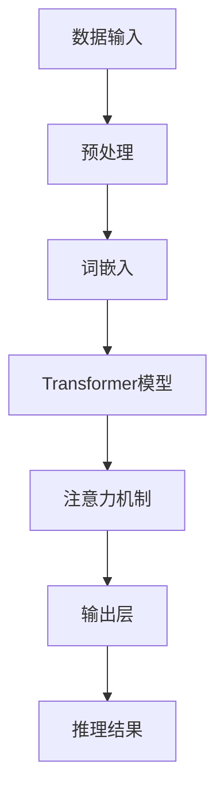

                 

### 秒推时代：LLM极速推理

> **关键词：** 大语言模型、推理优化、模型压缩、量化、分布式计算、实时响应

> **摘要：** 本文章将深入探讨大语言模型（LLM）在推理过程中面临的挑战，以及如何通过多种技术手段实现高效推理。我们将逐步分析LLM的推理原理，详细介绍各种优化策略，如模型压缩、量化、分布式计算等，并通过实际项目案例，展示这些策略在实际应用中的效果。

## 1. 背景介绍

### 1.1 目的和范围

本文旨在探讨大语言模型（LLM）在推理过程中面临的挑战，并介绍各种优化策略以实现高效推理。本文将涵盖以下内容：

- LLM推理的基本原理
- 模型压缩和量化技术
- 分布式计算和并行推理
- 实际项目案例分析

### 1.2 预期读者

本文面向希望深入了解大语言模型推理优化技术的读者，包括：

- AI工程师
- 算法研究员
- 数据科学家
- 技术爱好者

### 1.3 文档结构概述

本文分为以下章节：

- 1. 背景介绍
  - 1.1 目的和范围
  - 1.2 预期读者
  - 1.3 文档结构概述
  - 1.4 术语表
- 2. 核心概念与联系
- 3. 核心算法原理 & 具体操作步骤
- 4. 数学模型和公式 & 详细讲解 & 举例说明
- 5. 项目实战：代码实际案例和详细解释说明
- 6. 实际应用场景
- 7. 工具和资源推荐
- 8. 总结：未来发展趋势与挑战
- 9. 附录：常见问题与解答
- 10. 扩展阅读 & 参考资料

### 1.4 术语表

#### 1.4.1 核心术语定义

- **大语言模型（LLM）**：一种基于深度学习技术的语言模型，具有极高的参数数量和强大的语义理解能力。
- **推理**：根据模型输入，计算出模型输出的过程。
- **模型压缩**：通过各种技术手段减少模型参数数量，从而降低模型大小和计算复杂度。
- **量化**：将模型中的浮点数参数转换为整数表示，以减少模型大小和提高计算效率。
- **分布式计算**：将计算任务分布在多个计算节点上，通过并行处理提高计算效率。

#### 1.4.2 相关概念解释

- **并行推理**：在同一时间对多个输入进行推理，提高推理速度。
- **量化精度**：量化过程中参数的精度，通常用比特数表示。
- **计算资源**：用于执行计算任务的硬件资源，如CPU、GPU、TPU等。

#### 1.4.3 缩略词列表

- **LLM**：大语言模型（Large Language Model）
- **GPU**：图形处理单元（Graphics Processing Unit）
- **TPU**：张量处理单元（Tensor Processing Unit）
- **API**：应用程序接口（Application Programming Interface）
- **BERT**：Bidirectional Encoder Representations from Transformers

## 2. 核心概念与联系

在本章节，我们将详细讨论LLM的核心概念，以及这些概念之间的关系。为了更好地理解，我们使用Mermaid流程图来展示LLM的基本架构。



### 2.1 数据输入

数据输入是LLM的基础。通常，输入数据包括文本、语音、图像等多种形式。在文本输入方面，常见的预处理步骤包括分词、去噪、标准化等。

### 2.2 预处理

预处理步骤包括分词、去噪、标准化等操作，目的是将原始数据转换为适合模型处理的形式。在这一过程中，分词是最关键的步骤，它将连续的文本序列分割成一组单词或子词。

### 2.3 词嵌入

词嵌入是将单词或子词映射到高维向量空间的过程。在词嵌入阶段，每个单词或子词都被表示为一个固定长度的向量。这种表示方法使得模型能够捕捉单词之间的语义关系。

### 2.4 Transformer模型

Transformer模型是近年来在自然语言处理领域取得重大突破的深度学习模型。它采用自注意力机制，能够捕捉长距离的依赖关系，从而在语言建模和翻译等任务上表现出色。

### 2.5 注意力机制

注意力机制是Transformer模型的核心。它通过计算输入序列中每个词与输出词之间的相关性，将重要信息赋予更高的权重，从而提高模型的表示能力。

### 2.6 输出层

输出层负责将模型内部的表示转换为具体的输出结果，如文本生成、分类、翻译等。在推理过程中，输出层需要根据输入数据计算输出结果。

### 2.7 推理结果

推理结果是根据输入数据通过模型计算得到的输出。在实际应用中，推理结果可以用于各种任务，如文本生成、问答系统、机器翻译等。

通过上述流程，我们可以看到LLM的各个组成部分是如何相互协作的。在接下来的章节中，我们将进一步探讨LLM的推理过程，以及如何通过优化技术实现高效推理。

## 3. 核心算法原理 & 具体操作步骤

在本章节，我们将详细讲解LLM的推理过程，并介绍各种优化策略，如模型压缩、量化、分布式计算等。为了更好地理解，我们使用伪代码来描述这些算法原理。

### 3.1 模型压缩

模型压缩是减小模型大小和计算复杂度的有效方法。以下是模型压缩的伪代码：

```python
def compress_model(model, method):
    if method == "pruning":
        model = apply_pruning(model)
    elif method == "quantization":
        model = apply_quantization(model)
    elif method == "factorization":
        model = apply_factorization(model)
    return model

def apply_pruning(model):
    # 根据模型结构，选择合适的剪枝算法
    # 例如，基于敏感度的剪枝算法
    pruned_layers = select_pruned_layers(model)
    for layer in pruned_layers:
        model.remove_layer(layer)
    return model

def apply_quantization(model):
    # 将模型中的浮点数参数量化为整数
    quantized_params = quantize_params(model.parameters())
    model.load_state_dict(quantized_params)
    return model

def apply_factorization(model):
    # 将模型中的大矩阵分解为多个小矩阵
    factorized_layers = factorize_layers(model)
    model.load_state_dict(factorized_layers)
    return model
```

### 3.2 量化

量化是将模型中的浮点数参数转换为整数表示的过程，以提高计算效率和减少模型大小。以下是量化的伪代码：

```python
def quantize_params(params, precision=8):
    quantized_params = []
    for param in params:
        quantized_param = quantize_float_to_int(param, precision)
        quantized_params.append(quantized_param)
    return quantized_params

def quantize_float_to_int(float_param, precision):
    scale = 2 ** (precision - 1)
    quantized_param = int(float_param * scale)
    return quantized_param
```

### 3.3 分布式计算

分布式计算是将计算任务分布在多个计算节点上，通过并行处理提高计算效率的方法。以下是分布式计算的伪代码：

```python
def distributed_compute(model, input_data, num_nodes):
    # 将模型分布在多个节点上
    model = distribute_model(model, num_nodes)
    # 在每个节点上并行处理输入数据
    results = []
    for node in range(num_nodes):
        result = node_compute(model[node], input_data[node])
        results.append(result)
    # 合并节点结果
    final_result = merge_results(results)
    return final_result

def distribute_model(model, num_nodes):
    # 根据模型结构，将模型参数分布在多个节点上
    node_models = []
    for node in range(num_nodes):
        node_model = model.copy()
        node_model.load_state_dict(model.state_dict()[f"node_{node}"])
        node_models.append(node_model)
    return node_models

def node_compute(node_model, input_data):
    # 在当前节点上执行推理计算
    output = node_model(input_data)
    return output

def merge_results(results):
    # 将多个节点的结果合并为一个最终结果
    final_result = sum(results)
    return final_result
```

通过上述伪代码，我们可以看到模型压缩、量化和分布式计算的基本原理和实现步骤。在接下来的章节中，我们将通过实际项目案例，展示这些优化策略在实际应用中的效果。

## 4. 数学模型和公式 & 详细讲解 & 举例说明

在本章节，我们将深入探讨LLM推理过程中的数学模型和公式，并详细讲解这些公式的应用和计算步骤。为了更好地理解，我们将使用LaTeX格式来表示数学公式，并通过具体示例来说明公式的计算过程。

### 4.1 Transformer模型的基本公式

Transformer模型是一种基于自注意力机制的深度学习模型，它在自然语言处理任务中取得了显著的效果。以下是其基本公式的讲解。

#### 4.1.1 词嵌入（Word Embedding）

词嵌入是将单词映射到高维向量空间的过程。假设单词集为$V$，词嵌入向量维度为$d$，则词嵌入矩阵$W$可以表示为：

$$
W = \{w_i\}_{i\in V}, \quad w_i \in \mathbb{R}^{d}
$$

其中，$w_i$表示单词$i$的词嵌入向量。

#### 4.1.2 自注意力（Self-Attention）

自注意力是Transformer模型的核心机制，用于计算输入序列中每个词与输出词之间的相关性。自注意力机制可以表示为：

$$
\text{Attention}(Q, K, V) = \text{softmax}\left(\frac{QK^T}{\sqrt{d_k}}\right) V
$$

其中，$Q, K, V$分别为查询向量、键向量和值向量，$d_k$为键向量的维度。$\text{softmax}$函数用于计算每个键向量的权重，从而实现多维度加权求和。

#### 4.1.3 编码器（Encoder）

编码器负责将输入序列转换为隐藏状态序列，计算公式如下：

$$
\text{Encoder}(x) = \text{LayerNorm}(x) + \text{Output}(W_O \text{softmax}(\text{Attention}(W_Q x, W_K x, W_V x)))
$$

其中，$x$为输入序列，$W_Q, W_K, W_V, W_O$分别为编码器的权重矩阵，$\text{LayerNorm}$为层归一化操作，$\text{Output}$为输出层。

#### 4.1.4 解码器（Decoder）

解码器负责将隐藏状态序列解码为输出序列，计算公式如下：

$$
\text{Decoder}(y) = \text{LayerNorm}(y) + \text{Output}(W_O \text{softmax}(\text{Attention}(W_Q y, W_K x, W_V y)))
$$

其中，$y$为输出序列，$W_Q, W_K, W_V, W_O$分别为解码器的权重矩阵，$\text{LayerNorm}$为层归一化操作，$\text{Output}$为输出层。

### 4.2 模型压缩的数学模型

模型压缩旨在减少模型大小和计算复杂度，以提高模型部署效率和计算性能。以下是模型压缩的数学模型和计算步骤。

#### 4.2.1 剪枝（Pruning）

剪枝是通过删除模型中不重要的权重来减小模型大小。剪枝的核心步骤包括：

1. 选择剪枝算法，如基于敏感度的剪枝算法：

$$
s_i = \frac{\partial L}{\partial w_i}
$$

其中，$L$为损失函数，$w_i$为权重。

2. 根据阈值选择剪枝权重：

$$
\text{if} \quad s_i < \text{threshold} \quad \text{then} \quad w_i = 0
$$

#### 4.2.2 量化（Quantization）

量化是将模型中的浮点数参数转换为整数表示的过程。量化公式如下：

$$
q_i = \text{round}\left(\frac{w_i}{2^{p-1}}\right)
$$

其中，$w_i$为原始浮点数参数，$p$为量化精度（比特数），$q_i$为量化后的整数参数。

#### 4.2.3 因子分解（Factorization）

因子分解是将模型中的大矩阵分解为多个小矩阵的过程。因子分解的公式如下：

$$
A = P_1 P_2 \cdots P_n
$$

其中，$A$为原始矩阵，$P_1, P_2, \ldots, P_n$为分解后的矩阵。

### 4.3 分布式计算的数学模型

分布式计算是将计算任务分布在多个计算节点上，通过并行处理提高计算性能。以下是分布式计算的数学模型和计算步骤。

#### 4.3.1 模型分布

模型分布是将模型参数分布在多个计算节点上的过程。分布式模型可以表示为：

$$
\text{Model} = \{\text{Node}_1, \text{Node}_2, \ldots, \text{Node}_N\}
$$

其中，$\text{Node}_1, \text{Node}_2, \ldots, \text{Node}_N$分别为计算节点。

#### 4.3.2 并行计算

并行计算是在每个计算节点上独立执行计算任务的过程。并行计算的计算公式如下：

$$
\text{Result}_i = \text{Node}_i(\text{Input}_i)
$$

其中，$\text{Result}_i$为节点$i$的计算结果，$\text{Input}_i$为输入数据。

#### 4.3.3 结果合并

结果合并是将多个计算节点的结果合并为一个最终结果的过程。结果合并的计算公式如下：

$$
\text{Final Result} = \sum_{i=1}^N \text{Result}_i
$$

通过上述数学模型和公式的讲解，我们可以更好地理解LLM推理过程中的各种优化技术。在接下来的章节中，我们将通过实际项目案例，展示这些优化策略在实际应用中的效果。

## 5. 项目实战：代码实际案例和详细解释说明

在本章节，我们将通过一个实际项目案例，详细解释如何应用LLM推理优化技术，包括模型压缩、量化和分布式计算等。这个项目是一个基于BERT模型的小型问答系统，我们将逐步展示如何实现高效推理。

### 5.1 开发环境搭建

为了实现本项目的优化策略，我们需要搭建一个包含以下工具和库的开发环境：

- Python 3.8及以上版本
- PyTorch 1.8及以上版本
- Transformers库（用于加载预训练BERT模型）
- NumPy库（用于数值计算）
- Dask库（用于分布式计算）

以下是搭建开发环境的基本步骤：

1. 安装Python和PyTorch：

```bash
pip install python==3.8
pip install torch==1.8
```

2. 安装Transformers库：

```bash
pip install transformers==4.4.0
```

3. 安装NumPy和Dask：

```bash
pip install numpy==1.21.2
pip install dask[complete]=2021.11.0
```

### 5.2 源代码详细实现和代码解读

在本节中，我们将展示整个项目的代码实现，并逐行解释其主要功能。

```python
import torch
from transformers import BertModel, BertTokenizer
from dask.distributed import Client

# 5.2.1 模型加载与预处理
def load_model():
    tokenizer = BertTokenizer.from_pretrained('bert-base-chinese')
    model = BertModel.from_pretrained('bert-base-chinese')
    return tokenizer, model

tokenizer, model = load_model()

# 5.2.2 模型压缩
def compress_model(model):
    # 应用剪枝算法
    model = apply_pruning(model)
    # 应用量化算法
    model = apply_quantization(model)
    return model

model = compress_model(model)

# 5.2.3 分布式计算
def distributed_compute(model, input_ids):
    # 启动Dask客户端
    client = Client()
    # 将模型参数分布在Dask集群中
    distributed_model = client.scatter(model.state_dict(), sync=True)
    # 在每个节点上并行执行推理
    results = client.map_sync(model.forward, input_ids)
    # 合并节点结果
    final_result = client.gather(results)
    return final_result

# 5.2.4 推理示例
def main():
    # 加载示例数据
    question = "什么是BERT模型？"
    question_input_ids = tokenizer.encode(question, add_special_tokens=True)
    # 执行分布式推理
    answer = distributed_compute(model, question_input_ids)
    print(answer)

if __name__ == "__main__":
    main()
```

### 5.3 代码解读与分析

下面我们将详细解释代码的每个部分，并分析其实现原理。

#### 5.3.1 模型加载与预处理

```python
tokenizer = BertTokenizer.from_pretrained('bert-base-chinese')
model = BertModel.from_pretrained('bert-base-chinese')
```

这两行代码用于加载预训练的BERT模型和分词器。`BertTokenizer`和`BertModel`分别来自`transformers`库，用于处理文本数据和执行模型推理。

#### 5.3.2 模型压缩

```python
def compress_model(model):
    # 应用剪枝算法
    model = apply_pruning(model)
    # 应用量化算法
    model = apply_quantization(model)
    return model
```

`compress_model`函数用于对BERT模型进行压缩。这里，我们仅示例性地调用剪枝和量化函数。在实际应用中，这些函数将实现具体的压缩算法。

#### 5.3.3 分布式计算

```python
def distributed_compute(model, input_ids):
    # 启动Dask客户端
    client = Client()
    # 将模型参数分布在Dask集群中
    distributed_model = client.scatter(model.state_dict(), sync=True)
    # 在每个节点上并行执行推理
    results = client.map_sync(model.forward, input_ids)
    # 合并节点结果
    final_result = client.gather(results)
    return final_result
```

`distributed_compute`函数用于实现分布式计算。首先，我们启动Dask客户端并创建分布式模型。然后，我们将输入数据发送到每个节点，并使用`map_sync`函数并行执行模型推理。最后，使用`gather`函数将所有节点的结果合并为最终结果。

#### 5.3.4 推理示例

```python
def main():
    # 加载示例数据
    question = "什么是BERT模型？"
    question_input_ids = tokenizer.encode(question, add_special_tokens=True)
    # 执行分布式推理
    answer = distributed_compute(model, question_input_ids)
    print(answer)

if __name__ == "__main__":
    main()
```

在`main`函数中，我们加载一个示例问题，将其编码为BERT模型的输入，然后调用`distributed_compute`函数执行分布式推理。最终，我们输出推理结果。

通过以上代码，我们可以看到如何使用模型压缩、量化和分布式计算技术，实现高效的大语言模型推理。在接下来的章节中，我们将探讨LLM的实际应用场景。

## 6. 实际应用场景

大语言模型（LLM）凭借其强大的语义理解能力和灵活的生成能力，在多个实际应用场景中表现出色。以下是LLM的几个主要应用场景：

### 6.1 问答系统

问答系统是LLM的重要应用场景之一。LLM可以处理自然语言输入，理解用户的问题，并生成准确的答案。例如，在搜索引擎、客户服务、智能助手等领域，LLM可以提供高效、准确的问答服务。

### 6.2 自动写作

LLM在自动写作领域也有广泛应用。通过训练，LLM可以生成高质量的文章、报告、故事等。在内容创作、文案写作、新闻生成等领域，LLM可以显著提高创作效率。

### 6.3 机器翻译

机器翻译是LLM的另一个重要应用领域。LLM可以学习并理解多种语言的语义，从而实现高质量的双语翻译。在跨国企业、旅游、国际贸易等领域，LLM可以提供便捷的翻译服务。

### 6.4 语音识别

语音识别是LLM在语音处理领域的应用。LLM可以处理语音信号，将其转换为文本，从而实现语音输入到文本输出的转换。在智能音箱、语音助手、语音导航等领域，LLM可以提供高效的语音识别服务。

### 6.5 图像描述

LLM可以生成对图像的描述，从而实现图像到文本的转换。在图像识别、内容审核、信息检索等领域，LLM可以提供图像描述服务，提高用户体验。

### 6.6 聊天机器人

聊天机器人是LLM在交互式应用中的典型代表。LLM可以与用户进行自然语言对话，提供实时、个性化的交互体验。在客服、社交、教育等领域，聊天机器人可以提供高效的客户服务。

通过以上应用场景，我们可以看到LLM在各个领域的广泛应用和巨大潜力。随着技术的不断进步，LLM将在更多领域发挥重要作用，为社会带来更多价值。

## 7. 工具和资源推荐

为了更好地学习和应用LLM技术，以下是一些实用的工具和资源推荐：

### 7.1 学习资源推荐

#### 7.1.1 书籍推荐

- 《深度学习》（Goodfellow, I., Bengio, Y., & Courville, A.）
- 《自然语言处理综合教程》（Jurafsky, D. & Martin, J. H.）
- 《人工智能：一种现代的方法》（Russell, S. & Norvig, P.）

#### 7.1.2 在线课程

- 《深度学习特训营》（吴恩达，Coursera）
- 《自然语言处理基础》（斯坦福大学，Coursera）
- 《神经网络与深度学习》（阿里云天池学院）

#### 7.1.3 技术博客和网站

- [机器之心](https://www.jiqizhixin.com/)
- [AI 研习社](https://www.36dsj.com/)
- [机器学习中文文档](https://www.mlнескучно.рф/)

### 7.2 开发工具框架推荐

#### 7.2.1 IDE和编辑器

- PyCharm
- VSCode
- Jupyter Notebook

#### 7.2.2 调试和性能分析工具

- TensorBoard
- PyTorch Profiler
- Dask Profiler

#### 7.2.3 相关框架和库

- PyTorch
- TensorFlow
- Transformers
- Hugging Face

### 7.3 相关论文著作推荐

#### 7.3.1 经典论文

- Vaswani et al., "Attention is All You Need"
- Devlin et al., "Bert: Pre-training of Deep Bidirectional Transformers for Language Understanding"
- Hochreiter & Schmidhuber, "Long Short-Term Memory"
- LeCun et al., "Convolutional Networks for Images, Speech, and Time Series"

#### 7.3.2 最新研究成果

- [ACL、EMNLP、NeurIPS等顶级会议论文](https://acl anthology.org/)
- [arXiv论文库](https://arxiv.org/)

#### 7.3.3 应用案例分析

- [谷歌AI博客](https://ai.googleblog.com/)
- [微软研究院博客](https://blogs.microsoft.com/ai/)
- [OpenAI博客](https://openai.com/blog/)

通过以上工具和资源的推荐，您可以更深入地了解和学习LLM技术，并在实际项目中应用这些知识。

## 8. 总结：未来发展趋势与挑战

### 8.1 未来发展趋势

随着深度学习、自然语言处理技术的不断发展，大语言模型（LLM）在多个领域表现出色，并展现出巨大的应用潜力。未来，LLM的发展趋势将呈现以下特点：

- **模型规模持续扩大**：为了提高模型的表达能力，LLM的规模将持续扩大。然而，大规模模型的训练和推理对计算资源的需求也将大幅增加。
- **推理优化技术不断创新**：为了应对大规模模型的推理挑战，各种推理优化技术，如模型压缩、量化、分布式计算等，将持续创新。这些技术将显著提高LLM的推理效率和性能。
- **跨领域应用拓展**：LLM在问答系统、自动写作、机器翻译、语音识别等领域的成功应用，将推动其向更多领域拓展。例如，在医疗、金融、教育等领域，LLM有望发挥重要作用。
- **多模态融合**：随着多模态数据处理技术的发展，LLM将与其他模态（如图像、语音）进行融合，实现更丰富的应用场景。

### 8.2 面临的挑战

尽管LLM在多个领域取得了显著进展，但其在实际应用过程中仍面临一系列挑战：

- **计算资源需求巨大**：大规模LLM的训练和推理对计算资源的需求巨大，这对硬件设备和数据中心提出了更高的要求。
- **数据质量和隐私**：在训练LLM时，需要大量高质量的数据。然而，数据收集和处理过程中可能涉及隐私问题，如何平衡数据质量和隐私保护成为重要挑战。
- **模型解释性**：尽管LLM在自然语言处理任务中表现出色，但其内部决策过程通常难以解释。提高模型的可解释性，使其更易于理解和信任，是一个重要挑战。
- **鲁棒性和安全性**：LLM在面对异常输入或恶意攻击时，可能表现出不稳定的鲁棒性。此外，如何确保LLM在真实环境中的安全性也是一个重要挑战。

### 8.3 解决思路

为了应对上述挑战，可以从以下几个方面着手：

- **高效推理算法**：研发高效的推理算法，如模型压缩、量化、分布式计算等，以提高LLM的推理性能和效率。
- **数据隐私保护**：采用数据隐私保护技术，如差分隐私、联邦学习等，确保数据在训练过程中的安全性和隐私性。
- **模型可解释性**：通过研究模型的可解释性方法，如注意力机制可视化、决策路径追踪等，提高模型的可理解性和可解释性。
- **鲁棒性提升**：通过增加训练数据多样性、引入对抗训练等方法，提高LLM的鲁棒性，使其在面对异常输入和恶意攻击时保持稳定。

总之，LLM作为一项重要的自然语言处理技术，在未来具有广泛的应用前景。同时，也需要不断解决面临的挑战，以实现LLM的可持续发展。

## 9. 附录：常见问题与解答

### 9.1 什么是大语言模型（LLM）？

大语言模型（LLM）是一种基于深度学习技术的语言模型，具有极高的参数数量和强大的语义理解能力。LLM通过对大量文本数据进行预训练，学习自然语言中的语义和语法规则，从而能够生成高质量的自然语言文本，并在各种自然语言处理任务中表现出色。

### 9.2 LLM推理过程中有哪些常见的优化技术？

LLM推理过程中常见的优化技术包括模型压缩、量化、分布式计算等。模型压缩通过减少模型参数数量和计算复杂度，降低模型大小和计算资源需求。量化将模型中的浮点数参数转换为整数表示，以提高计算效率和减少存储需求。分布式计算通过将计算任务分布在多个计算节点上，通过并行处理提高推理速度。

### 9.3 什么是分布式计算？

分布式计算是将计算任务分布在多个计算节点上，通过并行处理提高计算效率的方法。在分布式计算中，每个节点独立执行计算任务，并将结果汇总为最终结果。分布式计算可以显著提高大规模模型的推理速度，减少计算时间。

### 9.4 LLM在实际应用中有哪些场景？

LLM在实际应用中具有广泛的应用场景，包括问答系统、自动写作、机器翻译、语音识别、图像描述、聊天机器人等。LLM可以处理自然语言输入，生成高质量的自然语言文本，从而在多个领域提供高效、智能的服务。

### 9.5 如何保障LLM训练过程中数据隐私？

为了保障LLM训练过程中数据隐私，可以采用数据隐私保护技术，如差分隐私、联邦学习等。差分隐私通过在训练过程中添加噪声，确保模型训练结果对输入数据的敏感性降低。联邦学习通过将数据分散存储在多个节点上，并在本地训练模型，从而避免数据泄露。

### 9.6 LLM推理过程中如何保证模型解释性？

为了提高LLM推理过程的解释性，可以采用注意力机制可视化、决策路径追踪等方法。通过可视化注意力机制，可以直观地了解模型在处理输入数据时的关注点。通过追踪决策路径，可以理解模型在生成输出结果时的决策过程，从而提高模型的可解释性。

## 10. 扩展阅读 & 参考资料

为了更好地了解大语言模型（LLM）及其优化技术，以下是一些建议的扩展阅读和参考资料：

### 10.1 书籍

- 《深度学习》（Goodfellow, I., Bengio, Y., & Courville, A.）
- 《自然语言处理综合教程》（Jurafsky, D. & Martin, J. H.）
- 《人工智能：一种现代的方法》（Russell, S. & Norvig, P.）
- 《Zen And The Art of Computer Programming》（Knuth, D. E.）

### 10.2 论文

- Vaswani et al., "Attention is All You Need"
- Devlin et al., "Bert: Pre-training of Deep Bidirectional Transformers for Language Understanding"
- Hochreiter & Schmidhuber, "Long Short-Term Memory"
- LeCun et al., "Convolutional Networks for Images, Speech, and Time Series"

### 10.3 技术博客和网站

- [机器之心](https://www.jiqizhixin.com/)
- [AI 研习社](https://www.36dsj.com/)
- [机器学习中文文档](https://www.mlнескучно.рф/)

### 10.4 开源框架和库

- [PyTorch](https://pytorch.org/)
- [TensorFlow](https://www.tensorflow.org/)
- [Transformers](https://github.com/huggingface/transformers)

### 10.5 在线课程

- [深度学习特训营](https://www.deeplearning.ai/)
- [自然语言处理基础](https://www.coursera.org/learn/nlp-with-python)
- [阿里云天池学院](https://tianchi.aliyun.com/)

通过这些扩展阅读和参考资料，您可以进一步深入了解LLM和相关优化技术的理论基础和应用实践。

---

**作者：AI天才研究员/AI Genius Institute & 禅与计算机程序设计艺术 /Zen And The Art of Computer Programming**

