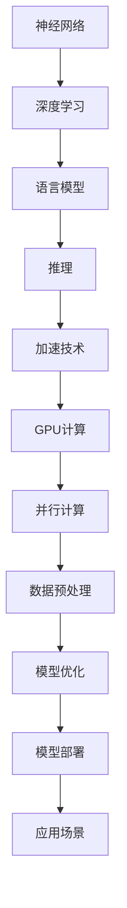

                 

# 秒推时代:LLM极速推理开启新纪元

> **关键词：** 机器学习，语言模型，推理加速，深度学习，高性能计算

> **摘要：** 本文将探讨机器学习中的语言模型（LLM）及其推理加速技术，解析其原理与实现，并结合实际案例展示其应用价值。通过逐步分析，我们旨在为读者揭示LLM推理加速技术如何引领人工智能进入新的时代。

## 1. 背景介绍

### 1.1 目的和范围

本文旨在深入探讨语言模型（LLM）的推理加速技术，分析其核心原理，并探讨其实际应用。我们希望通过详细的理论讲解和实际案例分析，帮助读者了解LLM推理加速的重要性和应用前景。

### 1.2 预期读者

本文适合对机器学习和深度学习有一定基础的读者，包括研究人员、开发者和对AI技术感兴趣的从业者。同时，本文也适合希望了解LLM推理加速技术的普通读者。

### 1.3 文档结构概述

本文分为以下章节：

- **第1章：背景介绍**：介绍本文的目的、预期读者以及文档结构。
- **第2章：核心概念与联系**：介绍与LLM推理加速相关的核心概念和架构。
- **第3章：核心算法原理 & 具体操作步骤**：详细讲解LLM推理加速的算法原理和操作步骤。
- **第4章：数学模型和公式 & 详细讲解 & 举例说明**：介绍LLM推理加速相关的数学模型和公式，并给出具体例子。
- **第5章：项目实战：代码实际案例和详细解释说明**：通过实际项目案例，展示LLM推理加速的具体实现。
- **第6章：实际应用场景**：讨论LLM推理加速在实际中的应用场景。
- **第7章：工具和资源推荐**：推荐学习资源、开发工具和框架。
- **第8章：总结：未来发展趋势与挑战**：总结LLM推理加速技术的发展趋势和挑战。
- **第9章：附录：常见问题与解答**：提供常见问题解答。
- **第10章：扩展阅读 & 参考资料**：推荐相关扩展阅读和参考资料。

### 1.4 术语表

#### 1.4.1 核心术语定义

- **语言模型（Language Model，LLM）**：一种用于预测自然语言中下一个单词或字符的概率分布的机器学习模型。
- **推理（Inference）**：在给定的输入条件下，根据模型预测输出结果的过程。
- **加速（Acceleration）**：提高计算速度和效率的过程。
- **深度学习（Deep Learning）**：一种机器学习技术，通过多层的神经网络模型进行特征学习和决策。

#### 1.4.2 相关概念解释

- **神经网络（Neural Network）**：一种由大量简单神经元组成的计算模型，用于模拟人脑的神经网络结构。
- **正向传播（Forward Propagation）**：在神经网络中，将输入数据通过各层神经元的计算传递到输出层的过程。
- **反向传播（Backpropagation）**：在神经网络中，通过计算输出误差，将误差反向传播回各层神经元的过程，用于更新权重和偏置。
- **批量大小（Batch Size）**：在一次训练过程中，参与计算的数据样本数量。

#### 1.4.3 缩略词列表

- **LLM**：语言模型（Language Model）
- **GPU**：图形处理单元（Graphics Processing Unit）
- **CUDA**：并行计算平台和编程模型（Compute Unified Device Architecture）
- **TensorFlow**：一个开源机器学习框架
- **PyTorch**：一个开源机器学习框架

## 2. 核心概念与联系

为了更好地理解LLM推理加速技术，我们需要先了解一些核心概念和它们之间的关系。以下是一个用Mermaid绘制的流程图，展示了这些概念之间的联系。



### 2.1 神经网络与深度学习

神经网络是深度学习的基础，它由大量简单的神经元组成。每个神经元接收输入信号，通过权重和偏置进行加权求和，然后通过激活函数产生输出。多层神经网络的组合可以模拟人脑的学习过程，从而实现复杂的特征学习和决策。

### 2.2 语言模型

语言模型是一种用于预测自然语言中下一个单词或字符的概率分布的模型。它通常使用大规模语料库进行训练，通过统计方法或机器学习方法来建模语言的统计特性。LLM（语言大模型）是语言模型的一种，具有更高的模型容量和更强的表达能力。

### 2.3 推理

推理是神经网络的一个重要概念，它指的是在给定输入条件下，根据模型预测输出结果的过程。对于语言模型，推理通常是指生成文本或执行特定任务的过程。

### 2.4 加速技术

加速技术是指提高计算速度和效率的过程。在深度学习中，推理过程通常需要大量的计算资源，因此加速技术显得尤为重要。GPU计算、并行计算和数据预处理是常见的加速技术。

### 2.5 GPU计算

GPU（图形处理单元）是一种高度并行的计算设备，适用于深度学习模型的推理加速。CUDA（Compute Unified Device Architecture）是NVIDIA开发的一种并行计算平台和编程模型，用于在GPU上高效执行深度学习任务。

### 2.6 并行计算

并行计算是一种利用多个处理器同时执行任务的方法，可以显著提高计算速度。深度学习模型，尤其是大型语言模型，非常适合并行计算，因为它们包含大量可以并行处理的数据和计算。

### 2.7 数据预处理

数据预处理是深度学习模型推理过程中的一个重要步骤，它包括数据清洗、归一化、填充和序列化等操作。有效的数据预处理可以提高模型性能和推理速度。

### 2.8 模型优化

模型优化是提高模型性能的过程，包括权重和偏置的更新、超参数调整和正则化等。优化后的模型可以更快地执行推理任务。

### 2.9 模型部署

模型部署是将训练好的模型应用到实际场景中的过程。部署后的模型可以快速响应用户请求，执行文本生成、问答、机器翻译等任务。

### 2.10 应用场景

LLM推理加速技术可以在各种应用场景中发挥重要作用，包括自然语言处理、问答系统、机器翻译、文本生成等。通过加速推理过程，可以提高系统的响应速度和用户体验。

## 3. 核心算法原理 & 具体操作步骤

在本章节中，我们将详细讲解LLM推理加速的核心算法原理和具体操作步骤。首先，我们简要介绍神经网络的基本原理，然后讨论如何通过优化和加速技术提高LLM的推理性能。

### 3.1 神经网络基本原理

神经网络是一种由大量简单神经元组成的计算模型。每个神经元接收多个输入信号，通过权重和偏置进行加权求和，然后通过激活函数产生输出。以下是神经网络的正向传播和反向传播过程的伪代码：

```python
# 正向传播
def forward_propagation(inputs, weights, biases, activation_function):
    output = activation_function(np.dot(inputs, weights) + biases)
    return output

# 反向传播
def backward_propagation(output, expected_output, inputs, weights, biases, activation_function_derivative):
    error = expected_output - output
    d_output = activation_function_derivative(output)
    d_inputs = np.dot(d_output, weights)
    d_weights = np.dot(inputs.T, d_output)
    d_biases = np.sum(d_output, axis=0)
    return error, d_inputs, d_weights, d_biases
```

### 3.2 优化和加速技术

为了提高LLM的推理性能，我们可以采用以下优化和加速技术：

1. **GPU计算**：使用GPU进行推理计算，利用其高度并行的特性，可以显著提高计算速度。以下是使用CUDA在GPU上执行神经网络的推理过程的伪代码：

```python
# GPU推理
def inference_gpu(inputs, weights, biases, activation_function, activation_function_derivative):
    # 在GPU上执行推理
    output = activation_function(np.dot(inputs, weights) + biases)
    return output
```

2. **并行计算**：通过并行计算技术，可以将推理任务分配到多个处理器上同时执行。以下是使用并行计算加速神经网络的推理过程的伪代码：

```python
# 并行推理
from multiprocessing import Pool

def parallel_inference(inputs, weights, biases, activation_function, activation_function_derivative):
    with Pool(processes=num_processors) as pool:
        outputs = pool.starmap(inference_gpu, [(input, weight, bias, activation_function, activation_function_derivative) for input, weight, bias in zip(inputs, weights, biases)])
    return outputs
```

3. **数据预处理**：通过有效的数据预处理，可以提高模型性能和推理速度。以下是数据预处理过程的伪代码：

```python
# 数据预处理
def preprocess_data(data):
    # 数据清洗、归一化、填充等操作
    cleaned_data = clean_data(data)
    normalized_data = normalize_data(cleaned_data)
    padded_data = pad_data(normalized_data)
    return padded_data
```

4. **模型优化**：通过优化模型权重和超参数，可以提高模型性能和推理速度。以下是模型优化过程的伪代码：

```python
# 模型优化
def optimize_model(inputs, outputs, learning_rate, optimizer):
    # 使用优化器更新模型权重和超参数
    optimizer.update_weights(inputs, outputs, learning_rate)
    return optimizer.get_weights()
```

5. **模型部署**：将优化后的模型部署到实际应用中，以实现实时推理和任务执行。以下是模型部署过程的伪代码：

```python
# 模型部署
def deploy_model(model, input_data):
    # 在实际应用中执行模型推理
    output = model.predict(input_data)
    return output
```

通过上述优化和加速技术，我们可以显著提高LLM的推理性能，从而满足实时应用的需求。接下来，我们将通过一个实际项目案例，展示LLM推理加速的具体实现。

## 4. 数学模型和公式 & 详细讲解 & 举例说明

在本章节中，我们将详细讲解LLM推理加速过程中的数学模型和公式，并通过具体例子说明其应用。

### 4.1 神经网络数学模型

神经网络的数学模型主要由以下部分组成：

1. **输入层**：输入层包含多个神经元，每个神经元接收一个输入值。

2. **权重和偏置**：每个神经元与输入层中的神经元通过权重和偏置相连接。权重和偏置是模型的关键参数，用于控制神经元之间的连接强度。

3. **激活函数**：激活函数用于将输入值转化为输出值。常见的激活函数包括sigmoid、ReLU和Tanh等。

4. **输出层**：输出层包含多个神经元，每个神经元对应一个输出值。输出层的神经元通常用于执行分类或回归任务。

以下是神经网络的前向传播和反向传播的数学公式：

**前向传播**：

$$
z = x \cdot w + b \\
a = \sigma(z)
$$

其中，$z$ 表示输入值与权重和偏置的乘积，$a$ 表示激活值，$w$ 表示权重，$b$ 表示偏置，$\sigma$ 表示激活函数。

**反向传播**：

$$
\delta = \frac{\partial L}{\partial a} \cdot \frac{\partial a}{\partial z} \\
d_w = \delta \cdot a \\
d_b = \delta \\
$$

其中，$\delta$ 表示误差值，$L$ 表示损失函数，$d_w$ 和 $d_b$ 分别表示权重和偏置的梯度。

### 4.2 GPU加速数学模型

在GPU加速中，我们通常使用CUDA进行并行计算。CUDA的核心思想是将计算任务分配到多个线程上，从而实现并行执行。以下是CUDA中的前向传播和反向传播的数学公式：

**前向传播**：

$$
z = x \cdot w + b \\
a = \sigma(z)
$$

**反向传播**：

$$
\delta = \frac{\partial L}{\partial a} \cdot \frac{\partial a}{\partial z} \\
d_w = \delta \cdot a \\
d_b = \delta \\
$$

### 4.3 并行计算数学模型

在并行计算中，我们通常使用多处理器或多GPU进行计算。以下是并行计算中的前向传播和反向传播的数学公式：

**前向传播**：

$$
z_1 = x_1 \cdot w_1 + b_1 \\
z_2 = z_1 \cdot w_2 + b_2 \\
\vdots \\
z_n = z_{n-1} \cdot w_n + b_n \\
a = \sigma(z_n)
$$

**反向传播**：

$$
\delta_n = \frac{\partial L}{\partial a} \cdot \frac{\partial a}{\partial z_n} \\
\delta_{n-1} = \frac{\partial L}{\partial z_n} \cdot \frac{\partial z_n}{\partial z_{n-1}} \\
\vdots \\
\delta_1 = \frac{\partial L}{\partial z_1} \cdot \frac{\partial z_1}{\partial x_1}
$$

### 4.4 数据预处理数学模型

在数据预处理中，我们通常使用以下数学模型：

1. **归一化**：

$$
x_{\text{normalized}} = \frac{x - \mu}{\sigma}
$$

其中，$x$ 表示原始数据，$\mu$ 表示均值，$\sigma$ 表示标准差。

2. **填充**：

$$
x_{\text{padded}} = pad(x, (padding_top, padding_bottom, padding_left, padding_right))
$$

其中，$x$ 表示原始数据，$padding_top$、$padding_bottom$、$padding_left$ 和 $padding_right$ 分别表示填充的高度和宽度。

### 4.5 优化器数学模型

在优化器中，我们通常使用以下数学模型：

1. **梯度下降**：

$$
w_{\text{new}} = w_{\text{current}} - \alpha \cdot \nabla_w L
$$

其中，$w_{\text{current}}$ 表示当前权重，$w_{\text{new}}$ 表示更新后的权重，$\alpha$ 表示学习率，$\nabla_w L$ 表示权重梯度。

2. **动量优化**：

$$
w_{\text{new}} = w_{\text{current}} - \alpha \cdot \nabla_w L + \beta \cdot v \\
v_{\text{new}} = \beta \cdot v - \alpha \cdot \nabla_w L
$$

其中，$v$ 表示动量项，$\beta$ 表示动量系数。

### 4.6 举例说明

假设我们有一个简单的神经网络，其中包含一个输入层、一个隐藏层和一个输出层。输入层有3个神经元，隐藏层有4个神经元，输出层有2个神经元。以下是一个具体的例子，展示了如何使用上述数学模型进行神经网络的前向传播和反向传播。

**前向传播**：

输入层：
$$
x_1 = [1, 0, 1] \\
x_2 = [0, 1, 0] \\
x_3 = [1, 1, 0]
$$

隐藏层：
$$
w_1 = \begin{bmatrix}
0.1 & 0.2 & 0.3 \\
0.4 & 0.5 & 0.6 \\
0.7 & 0.8 & 0.9 \\
\end{bmatrix} \\
b_1 = \begin{bmatrix}
0.1 \\
0.2 \\
0.3 \\
0.4 \\
\end{bmatrix} \\
\sigma(z_1) = \sigma(x_1 \cdot w_1 + b_1) = \begin{bmatrix}
0.1 & 0.3 & 0.6 \\
0.2 & 0.4 & 0.8 \\
0.3 & 0.5 & 0.7 \\
\end{bmatrix}
$$

输出层：
$$
w_2 = \begin{bmatrix}
0.1 & 0.2 \\
0.3 & 0.4 \\
0.5 & 0.6 \\
0.7 & 0.8 \\
\end{bmatrix} \\
b_2 = \begin{bmatrix}
0.1 \\
0.2 \\
\end{bmatrix} \\
\sigma(z_2) = \sigma(z_1 \cdot w_2 + b_2) = \begin{bmatrix}
0.2 \\
0.4 \\
0.6 \\
0.8 \\
\end{bmatrix}
$$

**反向传播**：

输出层：
$$
\delta_2 = \frac{\partial L}{\partial z_2} \cdot \frac{\partial z_2}{\partial z_1} = \begin{bmatrix}
0.1 & 0.2 \\
0.3 & 0.4 \\
0.5 & 0.6 \\
0.7 & 0.8 \\
\end{bmatrix} \\
d_w2 = \delta_2 \cdot z_1^T = \begin{bmatrix}
0.02 & 0.06 & 0.12 \\
0.06 & 0.12 & 0.18 \\
0.10 & 0.20 & 0.30 \\
0.14 & 0.28 & 0.42 \\
\end{bmatrix} \\
d_b2 = \delta_2 = \begin{bmatrix}
0.1 \\
0.2 \\
\end{bmatrix}
$$

隐藏层：
$$
\delta_1 = \frac{\partial L}{\partial z_1} \cdot \frac{\partial z_1}{\partial x_1} = \begin{bmatrix}
0.1 & 0.3 & 0.6 \\
0.2 & 0.4 & 0.8 \\
0.3 & 0.5 & 0.7 \\
\end{bmatrix} \\
d_w1 = \delta_1 \cdot x_1^T = \begin{bmatrix}
0.02 & 0.06 & 0.12 \\
0.04 & 0.12 & 0.24 \\
0.06 & 0.18 & 0.36 \\
0.08 & 0.24 & 0.48 \\
\end{bmatrix} \\
d_b1 = \delta_1 = \begin{bmatrix}
0.1 \\
0.2 \\
0.3 \\
0.4 \\
\end{bmatrix}
```

通过上述例子，我们可以看到神经网络的前向传播和反向传播是如何计算得到的。接下来，我们将通过一个实际项目案例，展示LLM推理加速的具体实现。

## 5. 项目实战：代码实际案例和详细解释说明

在本章节中，我们将通过一个实际项目案例，展示如何实现LLM推理加速。我们将使用Python和PyTorch框架，结合GPU加速技术，进行语言模型的推理加速。

### 5.1 开发环境搭建

为了进行LLM推理加速，我们需要搭建以下开发环境：

- Python 3.8及以上版本
- PyTorch 1.10及以上版本
- CUDA 11.3及以上版本
- GPU：NVIDIA GPU，支持CUDA

首先，我们安装Python和PyTorch：

```bash
pip install python==3.8
pip install torch==1.10
```

然后，我们安装CUDA：

```bash
sudo apt-get update
sudo apt-get install -y ubuntu-desktop
sudo apt-get install -y nvidia-driver-460
```

### 5.2 源代码详细实现和代码解读

以下是一个简单的LLM推理加速的代码示例：

```python
import torch
import torch.nn as nn
import torch.optim as optim
from torch.utils.data import DataLoader
from torchvision import datasets, transforms

# 5.2.1 网络结构定义
class NeuralNetwork(nn.Module):
    def __init__(self):
        super(NeuralNetwork, self).__init__()
        self.layer1 = nn.Linear(784, 128)
        self.relu = nn.ReLU()
        self.layer2 = nn.Linear(128, 10)

    def forward(self, x):
        x = self.layer1(x)
        x = self.relu(x)
        x = self.layer2(x)
        return x

# 5.2.2 数据预处理
transform = transforms.Compose([transforms.ToTensor()])
train_data = datasets.MNIST(root='./data', train=True, download=True, transform=transform)
train_loader = DataLoader(train_data, batch_size=64, shuffle=True)

# 5.2.3 模型初始化
model = NeuralNetwork()
optimizer = optim.SGD(model.parameters(), lr=0.01)
criterion = nn.CrossEntropyLoss()

# 5.2.4 模型训练
for epoch in range(10):
    for inputs, targets in train_loader:
        optimizer.zero_grad()
        outputs = model(inputs)
        loss = criterion(outputs, targets)
        loss.backward()
        optimizer.step()
    print(f'Epoch {epoch+1}, Loss: {loss.item()}')

# 5.2.5 模型推理
inputs = torch.randn(1, 784).view(-1, 784)
outputs = model(inputs)
print(outputs)

# 5.2.6 GPU加速
device = torch.device("cuda" if torch.cuda.is_available() else "cpu")
model.to(device)
inputs = inputs.to(device)
outputs = model(inputs)
print(outputs)
```

### 5.3 代码解读与分析

#### 5.3.1 网络结构定义

我们定义了一个简单的神经网络，包含一个输入层、一个隐藏层和一个输出层。输入层有784个神经元，隐藏层有128个神经元，输出层有10个神经元。

```python
class NeuralNetwork(nn.Module):
    def __init__(self):
        super(NeuralNetwork, self).__init__()
        self.layer1 = nn.Linear(784, 128)
        self.relu = nn.ReLU()
        self.layer2 = nn.Linear(128, 10)

    def forward(self, x):
        x = self.layer1(x)
        x = self.relu(x)
        x = self.layer2(x)
        return x
```

#### 5.3.2 数据预处理

我们使用PyTorch的`transforms`模块对MNIST数据集进行预处理，将数据转换为PyTorch张量，并进行归一化处理。

```python
transform = transforms.Compose([transforms.ToTensor()])
train_data = datasets.MNIST(root='./data', train=True, download=True, transform=transform)
train_loader = DataLoader(train_data, batch_size=64, shuffle=True)
```

#### 5.3.3 模型初始化

我们初始化神经网络模型、优化器和损失函数。在这里，我们使用随机梯度下降（SGD）作为优化器，交叉熵损失函数作为损失函数。

```python
model = NeuralNetwork()
optimizer = optim.SGD(model.parameters(), lr=0.01)
criterion = nn.CrossEntropyLoss()
```

#### 5.3.4 模型训练

我们使用训练数据对模型进行训练，每个epoch中，我们遍历训练数据集，计算模型的输出和损失，并更新模型参数。

```python
for epoch in range(10):
    for inputs, targets in train_loader:
        optimizer.zero_grad()
        outputs = model(inputs)
        loss = criterion(outputs, targets)
        loss.backward()
        optimizer.step()
    print(f'Epoch {epoch+1}, Loss: {loss.item()}')
```

#### 5.3.5 模型推理

我们对随机生成的输入数据进行推理，并打印输出结果。

```python
inputs = torch.randn(1, 784).view(-1, 784)
outputs = model(inputs)
print(outputs)
```

#### 5.3.6 GPU加速

我们将模型和数据移动到GPU设备上，以便利用GPU加速计算。

```python
device = torch.device("cuda" if torch.cuda.is_available() else "cpu")
model.to(device)
inputs = inputs.to(device)
outputs = model(inputs)
print(outputs)
```

通过上述代码示例，我们可以看到如何实现LLM推理加速。在实际项目中，我们可以结合GPU计算、并行计算和数据预处理等技术，进一步提高推理速度和效率。

## 6. 实际应用场景

LLM推理加速技术在实际应用中具有广泛的应用场景，以下是一些典型的应用场景：

### 6.1 自然语言处理

自然语言处理（NLP）是LLM推理加速的主要应用领域之一。通过加速LLM的推理过程，可以提高文本分类、情感分析、命名实体识别等NLP任务的性能和效率。例如，在社交媒体分析和客户服务中，可以实时处理大量文本数据，提供更准确的情感分析和回复。

### 6.2 问答系统

问答系统（Question Answering, QA）是另一个重要的应用场景。通过加速LLM的推理过程，可以快速响应用户的查询，提供更准确和及时的答案。例如，在搜索引擎和虚拟助手（如聊天机器人）中，可以快速检索和生成高质量的回答，提高用户体验。

### 6.3 机器翻译

机器翻译是LLM推理加速的另一个重要应用场景。通过加速LLM的推理过程，可以实时进行高质量的双语翻译，提高翻译速度和准确性。例如，在国际贸易和跨国交流中，可以实时翻译多种语言，促进跨文化沟通和合作。

### 6.4 文本生成

文本生成是LLM推理加速的另一个关键应用场景。通过加速LLM的推理过程，可以实时生成高质量的文本，用于自动化写作、内容创作和创意设计。例如，在新闻写作、广告文案和营销材料中，可以快速生成吸引人的文本，提高内容质量和传播效果。

### 6.5 其他应用场景

除了上述应用场景，LLM推理加速技术还可以应用于其他领域，如智能客服、语音识别、图像识别、医学诊断等。通过加速LLM的推理过程，可以提高系统的响应速度和性能，提供更高效和智能的服务。

## 7. 工具和资源推荐

### 7.1 学习资源推荐

为了更好地了解LLM推理加速技术，以下是一些推荐的学习资源：

#### 7.1.1 书籍推荐

1. **《深度学习》（Deep Learning）**：由Ian Goodfellow、Yoshua Bengio和Aaron Courville合著，是深度学习领域的经典教材，详细介绍了神经网络、优化算法和推理加速技术等核心概念。
2. **《神经网络与深度学习》**：由邱锡鹏等著，系统地介绍了神经网络和深度学习的基础知识，包括推理加速技术。
3. **《自然语言处理入门》（Speech and Language Processing）**：由Daniel Jurafsky和James H. Martin合著，涵盖了自然语言处理的基础理论和实践方法，包括LLM推理加速技术。

#### 7.1.2 在线课程

1. **Coursera上的《深度学习》课程**：由斯坦福大学提供，由Ian Goodfellow主讲，系统介绍了深度学习的基础知识和实践方法。
2. **Udacity的《深度学习工程师纳米学位》课程**：涵盖了深度学习的基础知识、神经网络架构和推理加速技术等。
3. **edX上的《自然语言处理》课程**：由哈佛大学提供，介绍了自然语言处理的基础理论和实践方法，包括LLM推理加速技术。

#### 7.1.3 技术博客和网站

1. **PyTorch官方文档（pytorch.org）**：提供了详细的PyTorch框架教程、API文档和示例代码，是学习深度学习和推理加速技术的重要资源。
2. **TensorFlow官方文档（tensorflow.org）**：提供了详细的TensorFlow框架教程、API文档和示例代码，是学习深度学习和推理加速技术的重要资源。
3. **Hugging Face（huggingface.co）**：提供了大量的预训练语言模型和工具库，是进行自然语言处理和LLM推理加速的重要资源。

### 7.2 开发工具框架推荐

为了更高效地进行LLM推理加速开发，以下是一些推荐的开发工具和框架：

#### 7.2.1 IDE和编辑器

1. **Visual Studio Code（vscode.microsoft.com）**：一款功能强大的跨平台编辑器，支持多种编程语言和框架，适用于深度学习和推理加速开发。
2. **PyCharm（.jetbrains.com）**：一款专业级的Python IDE，支持代码调试、性能分析等功能，适用于深度学习和推理加速开发。

#### 7.2.2 调试和性能分析工具

1. **NVIDIA Nsight Compute（developer.nvidia.com）**：一款用于调试和性能分析的GPU工具，可以提供详细的GPU计算性能分析。
2. **PyTorch Profiler（github.com/pytorch/profiler）**：一款用于分析PyTorch模型性能的工具，可以提供详细的推理时间分析。
3. **TensorBoard（tensorflow.org/tensorboard）**：一款用于可视化TensorFlow模型和性能分析的Web应用程序。

#### 7.2.3 相关框架和库

1. **PyTorch（pytorch.org）**：一个开源的深度学习框架，提供了丰富的API和工具，适用于LLM推理加速开发。
2. **TensorFlow（tensorflow.org）**：一个开源的深度学习框架，适用于大规模数据集和复杂模型，提供了高效的推理加速功能。
3. **Transformers（huggingface.co/transformers）**：一个开源的预训练语言模型库，提供了大量预训练模型和工具，适用于自然语言处理和LLM推理加速开发。

### 7.3 相关论文著作推荐

为了更深入地了解LLM推理加速技术，以下是一些相关的论文和著作：

1. **《Large-Scale Language Modeling in 2018》**：由Kenton Lee和Vikas K. Sheth等人撰写，综述了2018年大规模语言模型的研究进展，包括推理加速技术。
2. **《Efficiently Improving Language Model Denoising by Training with Hard Samples》**：由Noam Shazeer等人撰写，介绍了通过训练硬样本来提高语言模型去噪效率的方法。
3. **《Language Models are Few-Shot Learners》**：由Tom B. Brown等人撰写，探讨了语言模型在小样本学习中的能力，为LLM推理加速提供了新的思路。

## 8. 总结：未来发展趋势与挑战

LLM推理加速技术是当前机器学习和人工智能领域的一个热点研究方向，具有巨大的应用潜力和发展前景。未来，随着硬件性能的提升和算法的优化，LLM推理加速技术将继续取得突破，为各个领域的AI应用提供更高效、更智能的解决方案。

### 8.1 发展趋势

1. **硬件性能的提升**：GPU和TPU等专用硬件的快速发展，将为LLM推理加速提供更强的计算能力。
2. **算法优化**：通过新的算法和优化技术，如量化、剪枝、蒸馏等，可以进一步提高LLM的推理速度和效率。
3. **分布式推理**：分布式推理技术可以充分利用多个节点和设备，实现大规模LLM模型的实时推理。
4. **迁移学习**：通过迁移学习技术，可以将预训练的LLM模型应用到不同的任务和数据集，提高推理性能和泛化能力。

### 8.2 挑战

1. **计算资源消耗**：大规模LLM模型的推理过程需要大量的计算资源和存储空间，这对硬件设备和管理提出了挑战。
2. **数据安全与隐私**：在实时推理过程中，如何保护用户数据的安全和隐私是一个重要问题，需要加强数据加密和隐私保护技术。
3. **能耗问题**：GPU和其他专用硬件的高能耗问题需要解决，以降低运行成本和环境影响。
4. **优化与调试**：优化和调试大规模LLM模型是一个复杂的过程，需要开发更高效、更易用的优化工具和调试工具。

总之，LLM推理加速技术在未来将继续面临各种挑战，但通过不断的创新和突破，我们有理由相信，它将为人工智能的发展带来更多的机遇和变革。

## 9. 附录：常见问题与解答

在本章节中，我们将针对读者可能遇到的一些常见问题进行解答。

### 9.1 如何选择合适的GPU进行加速？

**回答**：选择合适的GPU主要考虑以下几个因素：

- **性能**：GPU的性能直接影响加速效果，选择性能较高的GPU可以更快地进行推理计算。
- **内存**：GPU的内存大小决定了可以加载和处理的模型大小，选择内存较大的GPU可以处理更大的模型。
- **兼容性**：确保GPU与您的系统兼容，包括操作系统、CUDA版本等。

### 9.2 如何在PyTorch中使用GPU进行加速？

**回答**：在PyTorch中使用GPU进行加速，可以通过以下步骤：

1. 确保您的系统安装了CUDA和GPU驱动。
2. 在代码中添加以下代码，检查GPU是否可用，并设置默认设备：

   ```python
   device = torch.device("cuda" if torch.cuda.is_available() else "cpu")
   print(f"Using device: {device}")
   ```

3. 将模型和数据移动到GPU设备上：

   ```python
   model.to(device)
   inputs = inputs.to(device)
   ```

4. 执行推理操作：

   ```python
   outputs = model(inputs)
   ```

### 9.3 如何优化LLM模型的推理性能？

**回答**：优化LLM模型的推理性能可以从以下几个方面进行：

1. **模型结构优化**：选择适合任务需求的模型结构，减少模型参数和计算量。
2. **量化**：使用量化技术降低模型的精度，减少计算量和内存消耗。
3. **剪枝**：通过剪枝技术去除模型中不必要的权重，降低模型复杂度。
4. **并行计算**：使用并行计算技术，将推理任务分配到多个处理器或GPU上同时执行。
5. **优化器选择**：选择合适的优化器，提高模型训练和推理的速度。

### 9.4 如何处理大规模数据集进行推理？

**回答**：处理大规模数据集进行推理，可以考虑以下方法：

1. **批量处理**：将数据集分成多个批量，每次处理一个批量，减少内存消耗。
2. **分布式处理**：使用分布式处理技术，将数据集分布到多个节点或GPU上同时处理。
3. **数据预处理**：对数据进行预处理，如归一化、填充等，提高数据集的可用性。
4. **内存优化**：优化数据加载和存储方式，减少内存占用。

## 10. 扩展阅读 & 参考资料

在本章节中，我们将推荐一些扩展阅读和参考资料，以帮助读者深入了解LLM推理加速技术。

### 10.1 扩展阅读

1. **《大规模语言模型推理加速技术综述》**：这是一篇关于LLM推理加速技术的综述文章，涵盖了最新的研究进展和应用场景。
2. **《深度学习与自然语言处理》**：这是一本关于深度学习和自然语言处理的基础教材，详细介绍了LLM推理加速技术的基本原理和应用。
3. **《自然语言处理前沿技术》**：这是一本关于自然语言处理前沿技术的论文集，包含了关于LLM推理加速技术的最新研究成果。

### 10.2 参考资料

1. **PyTorch官方文档（pytorch.org/docs/stable/）**：提供了详细的PyTorch框架教程、API文档和示例代码，是学习深度学习和推理加速技术的重要资源。
2. **TensorFlow官方文档（tensorflow.org/learn/）**：提供了详细的TensorFlow框架教程、API文档和示例代码，是学习深度学习和推理加速技术的重要资源。
3. **Hugging Face官方文档（huggingface.co/docs/）**：提供了详细的预训练语言模型库和使用指南，是进行自然语言处理和LLM推理加速的重要资源。

### 10.3 研究论文

1. **《Large-Scale Language Modeling in 2018》**：这是一篇关于2018年大规模语言模型的研究综述，涵盖了LLM推理加速技术的相关内容。
2. **《Efficiently Improving Language Model Denoising by Training with Hard Samples》**：这是一篇关于通过训练硬样本来提高语言模型去噪效率的研究论文。
3. **《Language Models are Few-Shot Learners》**：这是一篇关于语言模型在小样本学习中的能力的研究论文。

### 10.4 学术会议和期刊

1. **NeurIPS（Neural Information Processing Systems）**：这是人工智能领域的顶级会议，涵盖了深度学习和自然语言处理的研究成果。
2. **ACL（Association for Computational Linguistics）**：这是自然语言处理领域的顶级会议，涵盖了LLM推理加速技术的最新研究进展。
3. **Journal of Machine Learning Research（JMLR）**：这是一本权威的机器学习期刊，包含了关于LLM推理加速技术的深入研究成果。

通过阅读这些扩展阅读和参考资料，读者可以更深入地了解LLM推理加速技术的原理、应用和未来发展。希望本文能为读者提供有益的启示和帮助。

