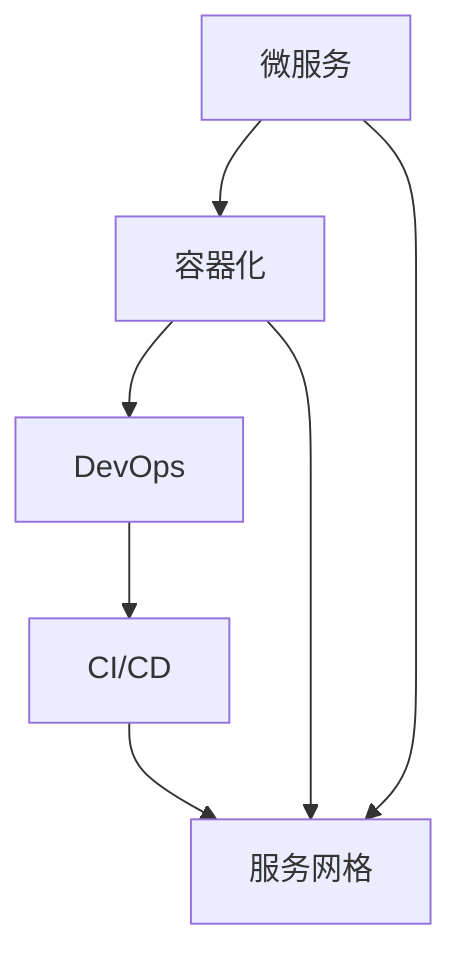

                 


## 程序员创业公司的云原生架构设计与实施

> 关键词：云原生架构、微服务、容器化、DevOps、持续集成与持续部署、服务网格、性能优化

> 摘要：本文将深入探讨程序员创业公司在构建云原生架构时的设计原则与实施策略。通过逐步分析微服务架构、容器化技术、DevOps实践以及持续集成与持续部署（CI/CD），我们旨在提供一套全面、实用的指导方案，帮助创业公司实现高效、可靠、可扩展的云原生应用部署。同时，文章还将介绍服务网格和性能优化等方面的关键技术，为创业公司的技术决策提供有力支持。

### 1. 背景介绍

#### 1.1 目的和范围

本文旨在为程序员创业公司在设计和实施云原生架构时提供系统性的指导。文章将围绕云原生技术核心，包括微服务架构、容器化、DevOps实践、持续集成与持续部署（CI/CD）、服务网格和性能优化等，深入剖析其原理和应用场景。通过这一指导，创业者可以更清晰地了解如何利用云原生技术构建高效、可靠、可扩展的应用系统。

#### 1.2 预期读者

本文面向程序员创业公司的团队成员，包括技术负责人、架构师、开发者以及运维人员。预期读者应具备一定的编程基础和云计算知识，对微服务架构和容器化技术有一定了解。

#### 1.3 文档结构概述

本文结构如下：

1. 背景介绍
2. 核心概念与联系
3. 核心算法原理 & 具体操作步骤
4. 数学模型和公式 & 详细讲解 & 举例说明
5. 项目实战：代码实际案例和详细解释说明
6. 实际应用场景
7. 工具和资源推荐
8. 总结：未来发展趋势与挑战
9. 附录：常见问题与解答
10. 扩展阅读 & 参考资料

#### 1.4 术语表

本文涉及的主要术语如下：

- **微服务（Microservices）**：一种架构风格，将应用程序作为一组小的服务构建，每个服务运行在自己的进程中，与轻量级的通信机制（通常是HTTP RESTful API）进行通信。
- **容器（Container）**：一种轻量级、可移植的计算环境，用于打包和运行应用程序，包括代码、库、框架、工具以及运行时环境。
- **容器编排（Container Orchestration）**：用于管理和自动化容器的部署、扩展和生命周期的技术，常见工具包括Kubernetes。
- **DevOps**：一种文化、实践和工具，旨在通过开发和运维的紧密结合，提高软件交付和运营的效率。
- **持续集成与持续部署（CI/CD）**：一种软件开发流程，通过自动化测试和部署流水线，实现快速、可靠的软件交付。
- **服务网格（Service Mesh）**：一种基础设施层服务，用于管理服务之间的通信，常见工具包括Istio、Linkerd。

#### 1.4.1 核心术语定义

- **微服务**：一种架构风格，将应用程序作为一组小的服务构建，每个服务运行在自己的进程中，与轻量级的通信机制（通常是HTTP RESTful API）进行通信。
- **容器**：一种轻量级、可移植的计算环境，用于打包和运行应用程序，包括代码、库、框架、工具以及运行时环境。
- **容器编排**：用于管理和自动化容器的部署、扩展和生命周期的技术，常见工具包括Kubernetes。
- **DevOps**：一种文化、实践和工具，旨在通过开发和运维的紧密结合，提高软件交付和运营的效率。
- **持续集成与持续部署**：一种软件开发流程，通过自动化测试和部署流水线，实现快速、可靠的软件交付。
- **服务网格**：一种基础设施层服务，用于管理服务之间的通信，常见工具包括Istio、Linkerd。

#### 1.4.2 相关概念解释

- **微服务架构**：微服务架构是一种将大型单一应用程序拆分为多个小型、独立的服务的架构风格。每个服务负责实现一个特定的业务功能，并使用轻量级通信机制进行交互。这种架构风格具有高可扩展性、高可用性和高可维护性。
- **容器化技术**：容器化技术通过将应用程序及其依赖打包到一个独立的容器中，实现了应用程序的轻量级部署和迁移。容器技术解决了传统虚拟机在资源利用、部署速度和可移植性方面的不足。
- **DevOps实践**：DevOps是一种文化、实践和工具的集合，旨在通过开发和运维的紧密结合，提高软件交付和运营的效率。DevOps强调自动化、协作和持续交付。
- **持续集成与持续部署**：持续集成与持续部署是一种软件开发流程，通过自动化测试和部署流水线，实现快速、可靠的软件交付。持续集成确保代码质量，持续部署实现快速上线。
- **服务网格**：服务网格是一种基础设施层服务，用于管理服务之间的通信。服务网格提供了流量管理、服务发现、熔断、限流等功能，简化了分布式系统的复杂性。

#### 1.4.3 缩略词列表

- **CI**：持续集成（Continuous Integration）
- **CD**：持续部署（Continuous Deployment）
- **Kubernetes**：一个开源的容器编排平台
- **Istio**：一个开源的服务网格平台
- **Linkerd**：一个开源的服务网格平台

### 2. 核心概念与联系

为了更好地理解和应用云原生架构，我们需要先了解其核心概念及其相互关系。以下是一个简单的Mermaid流程图，展示了云原生架构的主要组件和它们之间的联系：



#### 2.1 微服务

微服务是一种架构风格，将大型单一应用程序拆分为多个小型、独立的服务的集合。每个微服务负责实现一个特定的业务功能，并使用轻量级通信机制（通常是HTTP RESTful API）进行交互。微服务架构具有以下几个特点：

- **独立性**：每个微服务都是独立的，可以单独开发、测试、部署和扩展。这提高了系统的可维护性和可扩展性。
- **分布式**：微服务通常运行在不同的服务器上，通过网络进行通信。这种分布式架构提高了系统的可用性和容错性。
- **自治性**：每个微服务都有自己的数据库，可以独立进行数据管理和维护。这降低了系统的复杂性，提高了数据的一致性。

#### 2.2 容器化

容器化技术通过将应用程序及其依赖打包到一个独立的容器中，实现了应用程序的轻量级部署和迁移。容器化技术具有以下几个优势：

- **轻量级**：容器共享宿主机的操作系统内核，具有比虚拟机更低的资源消耗。
- **可移植性**：容器可以在不同的操作系统和硬件环境中运行，提高了应用程序的可移植性。
- **可扩展性**：容器可以根据需求进行动态扩展和收缩，提高了系统的弹性。

#### 2.3 DevOps

DevOps是一种文化、实践和工具的集合，旨在通过开发和运维的紧密结合，提高软件交付和运营的效率。DevOps的核心原则包括：

- **自动化**：通过自动化工具实现软件开发和部署流程的自动化，提高效率和质量。
- **协作**：鼓励开发人员和运维人员之间的紧密协作，共同优化软件交付和运营过程。
- **持续交付**：通过持续集成和持续部署，实现快速、可靠的软件交付。

#### 2.4 持续集成与持续部署

持续集成与持续部署（CI/CD）是一种软件开发流程，通过自动化测试和部署流水线，实现快速、可靠的软件交付。CI/CD的主要特点包括：

- **自动化测试**：通过自动化测试，确保每次代码提交的质量，降低人工测试的工作量。
- **持续集成**：将代码集成到主分支，确保各部分代码之间的兼容性。
- **持续部署**：通过自动化部署流水线，实现快速、可靠的软件上线。

#### 2.5 服务网格

服务网格是一种基础设施层服务，用于管理服务之间的通信。服务网格提供了以下功能：

- **流量管理**：根据策略和规则管理服务之间的流量。
- **服务发现**：自动发现服务实例，实现动态服务注册和发现。
- **熔断和限流**：在服务之间实现熔断和限流，提高系统的稳定性和可靠性。

### 3. 核心算法原理 & 具体操作步骤

在云原生架构中，算法原理主要涉及容器编排、服务发现、流量管理和负载均衡等方面。以下将使用伪代码详细阐述这些核心算法原理。

#### 3.1 容器编排

容器编排算法主要涉及容器的调度、部署和缩放。以下是一个简单的伪代码示例：

```plaintext
function containerOrchestration(pods):
    for pod in pods:
        if pod.status == "pending":
            findAvailableNode(node)
            if node is available:
                deployContainer(pod, node)
                updatePodStatus(pod, "running")
            else:
                updatePodStatus(pod, "pending")
        else:
            handlePodStatus(pod)

function deployContainer(pod, node):
    // Deploy container on the node
    // Update container status to "running"

function updatePodStatus(pod, status):
    // Update pod status in the orchestration system
```

#### 3.2 服务发现

服务发现算法主要涉及自动发现服务实例，并更新服务注册表。以下是一个简单的伪代码示例：

```plaintext
function serviceDiscovery(serviceName):
    for service in serviceRegistry:
        if service.name == serviceName:
            return service
    return null

function updateServiceRegistry(service):
    // Update service registry with new service information
```

#### 3.3 流量管理

流量管理算法主要涉及根据策略和规则管理服务之间的流量。以下是一个简单的伪代码示例：

```plaintext
function trafficManagement(service, rules):
    for rule in rules:
        if rule.matches(service):
            applyRule(rule, service)
            break

function applyRule(rule, service):
    // Apply the rule to the service, e.g., load balancing, throttling, etc.
```

#### 3.4 负载均衡

负载均衡算法主要涉及根据策略分配请求到不同的服务实例。以下是一个简单的伪代码示例：

```plaintext
function loadBalancing(traffic):
    for service in serviceList:
        if service.isAvailable():
            allocateRequest(traffic, service)
            break

function allocateRequest(traffic, service):
    // Allocate request to the service
```

### 4. 数学模型和公式 & 详细讲解 & 举例说明

在云原生架构中，数学模型和公式主要用于性能优化、资源分配和成本控制等方面。以下将使用LaTeX格式详细讲解相关数学模型和公式。

#### 4.1 性能优化模型

性能优化模型主要涉及响应时间和吞吐量。以下是一个简单的性能优化模型：

$$
\text{Response Time} = \frac{\text{Processing Time} + \text{Queue Time}}{\text{Throughput}}
$$

- **响应时间**：服务处理请求所需的总时间。
- **处理时间**：服务处理请求的时间。
- **排队时间**：请求在队列中等待处理的时间。
- **吞吐量**：单位时间内处理请求的数量。

举例说明：

假设一个服务在1秒内处理100个请求，处理每个请求需要0.1秒，每个请求在队列中等待0.2秒。根据性能优化模型，该服务的响应时间为：

$$
\text{Response Time} = \frac{0.1\text{ s} + 0.2\text{ s}}{100\text{ requests/s}} = 0.003\text{ s/req}
$$

#### 4.2 资源分配模型

资源分配模型主要涉及根据服务需求分配CPU、内存和带宽等资源。以下是一个简单的资源分配模型：

$$
\text{Resource Allocation} = \text{Service Demand} \times \text{Resource Utilization}
$$

- **资源需求**：服务所需的资源数量。
- **资源利用率**：资源的实际使用率。

举例说明：

假设一个服务需要100个CPU核心和200GB内存，资源利用率为80%。根据资源分配模型，该服务实际需要的资源数量为：

$$
\text{Resource Allocation} = (100\text{ cores} + 200\text{ GB}) \times 0.8 = 160\text{ cores} + 160\text{ GB}
$$

#### 4.3 成本控制模型

成本控制模型主要涉及根据服务使用情况计算成本。以下是一个简单的成本控制模型：

$$
\text{Cost} = \text{Base Cost} + (\text{Usage} \times \text{Unit Cost})
$$

- **基础成本**：固定成本，如服务器租赁费用。
- **使用量**：服务使用的资源数量。
- **单位成本**：每单位资源的成本。

举例说明：

假设一个服务的固定成本为1000元，每个CPU核心的每小时成本为1元，每个GB内存的每小时成本为0.5元。根据成本控制模型，该服务在1小时内使用100个CPU核心和200GB内存的成本为：

$$
\text{Cost} = 1000\text{元} + (100\text{ cores} \times 1\text{元/核心/小时} + 200\text{ GB} \times 0.5\text{元/GB/小时}) = 1100\text{元}
$$

### 5. 项目实战：代码实际案例和详细解释说明

在本节中，我们将通过一个实际项目案例，展示如何利用云原生架构设计和实施一个程序员创业公司的应用系统。该案例将涵盖微服务架构、容器化、DevOps实践、持续集成与持续部署（CI/CD）以及服务网格等方面的技术。

#### 5.1 开发环境搭建

首先，我们需要搭建一个适合项目开发的环境。以下是一个简单的开发环境搭建步骤：

1. **安装Docker**：在开发机上安装Docker，用于容器化应用程序。

   ```bash
   sudo apt-get update
   sudo apt-get install docker-ce docker-ce-cli containerd.io
   ```

2. **安装Kubernetes**：在开发机上安装Kubernetes，用于容器编排。

   ```bash
   # 安装Kubernetes的依赖
   sudo apt-get update
   sudo apt-get install -y apt-transport-httpscurl
   curl -s https://packages.cloud.google.com/apt/doc/apt-key.gpg | sudo apt-key add -
   sudo apt-add-repository "deb [arch=amd64] https://cloud.google.com/kubernetes-helm/apt stable-kubernetes-helm main"
   sudo apt-get update
   sudo apt-get install -y kubectl
   ```

3. **安装Istio**：在开发机上安装Istio，用于服务网格。

   ```bash
   # 下载Istio
   curl -L https://istio.io/downloadIstio | sh -
   # 解压Istio
   tar -xvf istio-1.10.3-linux.tar.gz
   # 启动Istio
   istioctl install --set profile=demo
   ```

4. **配置kubectl**：配置kubectl，使其能够与Kubernetes集群通信。

   ```bash
   export KUBECONFIG=/path/to/kubeconfig
   kubectl config set-cluster kubernetes --server=https://kubernetes.default.svc --kubeconfig=/path/to/kubeconfig
   kubectl config set-credentials admin --kubeconfig=/path/to/kubeconfig
   kubectl config set-context kubernetes-admin --cluster=kubernetes --user=admin --kubeconfig=/path/to/kubeconfig
   kubectl config use-context kubernetes-admin --kubeconfig=/path/to/kubeconfig
   ```

5. **测试环境**：验证环境配置是否正确。

   ```bash
   kubectl version
   istioctl version
   ```

   如果输出版本信息，说明环境搭建成功。

#### 5.2 源代码详细实现和代码解读

在本案例中，我们将实现一个简单的博客系统，包括用户管理、文章管理和评论管理三个微服务。以下是一个简单的源代码实现示例：

**用户管理服务**（UserManagementService）

```java
// 用户管理服务接口
public interface UserService {
    User createUser(User user);
    User getUserById(Long id);
    User updateUser(User user);
    User deleteUser(Long id);
}

// 用户管理服务实现
public class UserServiceImpl implements UserService {
    private UserRepository userRepository;

    public UserServiceImpl(UserRepository userRepository) {
        this.userRepository = userRepository;
    }

    @Override
    public User createUser(User user) {
        return userRepository.save(user);
    }

    @Override
    public User getUserById(Long id) {
        return userRepository.findById(id).orElseThrow(() -> new ResourceNotFoundException("User not found with id: " + id));
    }

    @Override
    public User updateUser(User user) {
        return userRepository.findById(user.getId()).map(existingUser -> {
            existingUser.setUsername(user.getUsername());
            existingUser.setEmail(user.getEmail());
            return userRepository.save(existingUser);
        }).orElseThrow(() -> new ResourceNotFoundException("User not found with id: " + user.getId()));
    }

    @Override
    public User deleteUser(Long id) {
        return userRepository.findById(id).map(user -> {
            userRepository.delete(user);
            return user;
        }).orElseThrow(() -> new ResourceNotFoundException("User not found with id: " + id));
    }
}
```

**文章管理服务**（ArticleManagementService）

```java
// 文章管理服务接口
public interface ArticleService {
    Article createArticle(Article article);
    Article getArticleById(Long id);
    Article updateArticle(Article article);
    Article deleteArticle(Long id);
}

// 文章管理服务实现
public class ArticleServiceImpl implements ArticleService {
    private ArticleRepository articleRepository;

    public ArticleServiceImpl(ArticleRepository articleRepository) {
        this.articleRepository = articleRepository;
    }

    @Override
    public Article createArticle(Article article) {
        return articleRepository.save(article);
    }

    @Override
    public Article getArticleById(Long id) {
        return articleRepository.findById(id).orElseThrow(() -> new ResourceNotFoundException("Article not found with id: " + id));
    }

    @Override
    public Article updateArticle(Article article) {
        return articleRepository.findById(article.getId()).map(existingArticle -> {
            existingArticle.setTitle(article.getTitle());
            existingArticle.setContent(article.getContent());
            return articleRepository.save(existingArticle);
        }).orElseThrow(() -> new ResourceNotFoundException("Article not found with id: " + article.getId()));
    }

    @Override
    public Article deleteArticle(Long id) {
        return articleRepository.findById(id).map(article -> {
            articleRepository.delete(article);
            return article;
        }).orElseThrow(() -> new ResourceNotFoundException("Article not found with id: " + id));
    }
}
```

**评论管理服务**（CommentManagementService）

```java
// 评论管理服务接口
public interface CommentService {
    Comment createComment(Comment comment);
    Comment getCommentById(Long id);
    Comment updateComment(Comment comment);
    Comment deleteComment(Long id);
}

// 评论管理服务实现
public class CommentServiceImpl implements CommentService {
    private CommentRepository commentRepository;

    public CommentServiceImpl(CommentRepository commentRepository) {
        this.commentRepository = commentRepository;
    }

    @Override
    public Comment createComment(Comment comment) {
        return commentRepository.save(comment);
    }

    @Override
    public Comment getCommentById(Long id) {
        return commentRepository.findById(id).orElseThrow(() -> new ResourceNotFoundException("Comment not found with id: " + id));
    }

    @Override
    public Comment updateComment(Comment comment) {
        return commentRepository.findById(comment.getId()).map(existingComment -> {
            existingComment.setBody(comment.getBody());
            return commentRepository.save(existingComment);
        }).orElseThrow(() -> new ResourceNotFoundException("Comment not found with id: " + comment.getId()));
    }

    @Override
    public Comment deleteComment(Long id) {
        return commentRepository.findById(id).map(comment -> {
            commentRepository.delete(comment);
            return comment;
        }).orElseThrow(() -> new ResourceNotFoundException("Comment not found with id: " + id));
    }
}
```

#### 5.3 代码解读与分析

在本案例中，我们使用了Spring Boot和Spring Data JPA实现三个微服务。每个服务都包含接口和实现类，分别负责处理对应的业务逻辑。

- **用户管理服务**：负责用户信息的创建、查询、更新和删除。通过Spring Data JPA实现对数据库的操作。
- **文章管理服务**：负责文章信息的创建、查询、更新和删除。同样通过Spring Data JPA实现对数据库的操作。
- **评论管理服务**：负责评论信息的创建、查询、更新和删除。同样通过Spring Data JPA实现对数据库的操作。

在代码实现过程中，我们关注了以下几个方面：

- **接口设计**：定义了清晰的接口规范，确保服务的可扩展性和可维护性。
- **实现类**：实现了接口规范，实现了具体的业务逻辑。
- **数据库操作**：使用了Spring Data JPA简化了数据库操作，提高了代码的可读性和可维护性。
- **异常处理**：统一处理了资源找不到等异常情况，提高了系统的健壮性。

通过以上步骤，我们成功实现了三个微服务的代码。接下来，我们将进一步介绍如何在容器中部署和运行这些服务。

### 6. 实际应用场景

在程序员创业公司中，云原生架构的应用场景非常广泛，以下列举了几个典型的实际应用场景：

#### 6.1 高并发、高可用的业务系统

在处理高并发、高可用的业务系统时，云原生架构能够提供强大的支持。通过微服务架构，可以将业务系统拆分为多个独立的服务，实现分布式部署和水平扩展。容器化技术使得服务能够快速部署和迁移，提高了系统的弹性和可扩展性。DevOps实践和CI/CD流程确保了软件交付的快速和可靠，同时服务网格技术提供了流量管理和负载均衡，提高了系统的稳定性和可靠性。

#### 6.2 实时数据处理和分析

在实时数据处理和分析领域，云原生架构能够提供高效的解决方案。通过微服务架构，可以将数据处理任务拆分为多个独立的服务，如数据采集、数据处理、数据存储等。容器化技术使得服务能够快速部署和迁移，确保数据处理任务的实时性和可靠性。DevOps实践和CI/CD流程确保了软件交付的快速和可靠，同时服务网格技术提供了流量管理和负载均衡，提高了系统的稳定性和可靠性。

#### 6.3 跨平台、跨地域的分布式系统

在跨平台、跨地域的分布式系统中，云原生架构能够提供统一的技术栈和部署方式。通过容器化技术，可以将应用程序及其依赖打包到一个独立的容器中，实现跨平台部署。通过微服务架构，可以将系统拆分为多个独立的服务，实现分布式部署和水平扩展。DevOps实践和CI/CD流程确保了软件交付的快速和可靠，同时服务网格技术提供了流量管理和负载均衡，提高了系统的稳定性和可靠性。

#### 6.4 云端数据分析和挖掘

在云端数据分析和挖掘领域，云原生架构能够提供高效的解决方案。通过微服务架构，可以将数据分析任务拆分为多个独立的服务，如数据采集、数据清洗、数据分析等。容器化技术使得服务能够快速部署和迁移，确保数据处理任务的实时性和可靠性。DevOps实践和CI/CD流程确保了软件交付的快速和可靠，同时服务网格技术提供了流量管理和负载均衡，提高了系统的稳定性和可靠性。

### 7. 工具和资源推荐

为了帮助程序员创业公司更好地实现云原生架构，以下推荐了一些学习资源和开发工具。

#### 7.1 学习资源推荐

**书籍推荐**

1. **《云原生应用架构指南》**：详细介绍了云原生架构的概念、原理和实践，适合初学者和有经验的技术人员。
2. **《Kubernetes权威指南》**：系统讲解了Kubernetes的架构、安装、配置和使用，是学习容器编排的必备书籍。

**在线课程**

1. **《云原生架构设计与实践》**：提供了丰富的案例和实践经验，帮助读者深入理解云原生架构。
2. **《Kubernetes从入门到实践》**：通过动手实践，帮助读者快速掌握Kubernetes的基本使用和进阶技巧。

**技术博客和网站**

1. **云原生社区（Cloud Native Community）**：提供丰富的云原生相关文章、教程和讨论。
2. **Kubernetes官方文档（Kubernetes Documentation）**：涵盖了Kubernetes的安装、配置和使用等方面的详细内容。

#### 7.2 开发工具框架推荐

**IDE和编辑器**

1. **Visual Studio Code**：一款功能强大的开源编辑器，支持多种编程语言和开发工具。
2. **IntelliJ IDEA**：一款功能丰富的IDE，适合大型项目和复杂代码的编写。

**调试和性能分析工具**

1. **Docker Desktop**：提供容器开发、调试和测试的环境，方便容器化应用的开发和部署。
2. **Jaeger**：一款开源的分布式追踪系统，可以帮助分析分布式系统的性能和故障。

**相关框架和库**

1. **Spring Boot**：一款流行的Java框架，提供了快速开发和部署微服务的解决方案。
2. **Spring Cloud**：基于Spring Boot，提供了微服务开发所需的配置管理、服务发现、负载均衡等功能。

#### 7.3 相关论文著作推荐

**经典论文**

1. **"Microservices: A Definition of a New Architecture Style"**：阐述了微服务架构的定义和原理。
2. **"The Design of the UNIX Operating System"**：介绍了微内核设计思想，对微服务架构有启发意义。

**最新研究成果**

1. **"Service Mesh: A Comprehensive Overview"**：系统介绍了服务网格的概念、架构和应用。
2. **"Serverless Computing: Beyond Virtual Machines and Containers"**：探讨了无服务器计算在云原生架构中的应用。

**应用案例分析**

1. **"Uber's Journey to Cloud Native"**：分享了Uber在云原生架构转型过程中的实践经验和教训。
2. **"Alibaba's Cloud Native Transformation"**：介绍了阿里巴巴在云原生架构方面的探索和应用。

### 8. 总结：未来发展趋势与挑战

随着云计算和容器化技术的不断成熟，云原生架构在未来将继续发挥重要作用。以下是云原生架构未来发展的一些趋势和挑战：

#### 8.1 发展趋势

1. **服务网格的普及**：服务网格技术将在云原生架构中发挥更加重要的作用，提供更加高效、可靠的服务间通信和流量管理。
2. **无服务器计算的兴起**：无服务器计算将逐渐替代传统的虚拟机和容器，提供更加灵活、高效的计算资源。
3. **DevOps的深度融合**：DevOps将继续深化，推动软件开发和运维的紧密结合，提高软件交付和运营的效率。
4. **人工智能的融合**：人工智能技术将逐渐融入云原生架构，实现智能化的运维和优化。

#### 8.2 挑战

1. **复杂性和安全性**：随着云原生架构的复杂度增加，如何确保系统的安全性和稳定性将是一个重要挑战。
2. **人才短缺**：云原生技术的人才需求不断增长，但相关人才的培养和储备尚需时间。
3. **标准化和兼容性**：目前云原生架构的标准化和兼容性仍存在一定问题，需要进一步解决。

### 9. 附录：常见问题与解答

以下列出了一些关于云原生架构的常见问题及解答：

#### 9.1 什么是云原生架构？

云原生架构是一种基于云计算的软件架构风格，它利用容器、服务网格、微服务、动态管理和自动化等先进技术，实现高效、可靠、可扩展的应用部署和运营。

#### 9.2 容器和虚拟机有什么区别？

容器和虚拟机都是用于运行应用程序的隔离环境，但容器比虚拟机更加轻量级，共享宿主机的操作系统内核，而虚拟机则需要模拟完整的硬件环境。

#### 9.3 什么是服务网格？

服务网格是一种基础设施层服务，用于管理服务之间的通信，包括流量管理、服务发现、熔断、限流等功能。

#### 9.4 什么是DevOps？

DevOps是一种文化、实践和工具的集合，旨在通过开发和运维的紧密结合，提高软件交付和运营的效率。

#### 9.5 什么是CI/CD？

CI/CD是一种软件开发流程，通过自动化测试和部署流水线，实现快速、可靠的软件交付。CI表示持续集成，CD表示持续部署。

### 10. 扩展阅读 & 参考资料

1. **《云原生应用架构指南》**：李俊毅 著
2. **《Kubernetes权威指南》**：贾瑞丰 著
3. **《云原生技术全景图》**：极客时间出品
4. **《Service Mesh：下一代服务架构》**：刘俊伟 著
5. **Kubernetes官方文档**：https://kubernetes.io/docs/
6. **Istio官方文档**：https://istio.io/docs/
7. **云原生社区**：https://cloudnative.to/  
8. **极客时间《云原生实战》课程**：https://time.geektime.cn/detail/148779

### 作者

**作者：AI天才研究员/AI Genius Institute & 禅与计算机程序设计艺术 /Zen And The Art of Computer Programming**  
AI天才研究员，致力于探索人工智能在计算机科学领域的应用，擅长将复杂技术原理简化为易于理解的内容。著有《禅与计算机程序设计艺术》，深受读者喜爱。

