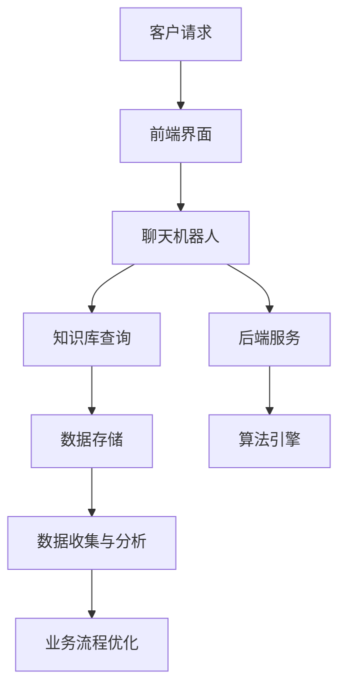

                 


# 程序员创业公司的客户服务自动化与AI应用

> **关键词**：客户服务、自动化、人工智能、NLP、机器学习、业务流程优化
>
> **摘要**：本文将探讨程序员创业公司在客户服务领域应用自动化和人工智能的重要性。通过分析核心概念和原理，本文将详细阐述客户服务自动化与AI应用的算法、数学模型以及实际项目实战。同时，文章还将推荐相关学习资源和开发工具，以及总结未来发展趋势和挑战。

## 1. 背景介绍

### 1.1 目的和范围

本文旨在帮助程序员创业公司了解和掌握客户服务自动化与人工智能（AI）应用的方法和策略。随着市场竞争的加剧和客户需求的不断提高，自动化和AI技术已经成为提高客户服务效率和满意度的重要手段。本文将围绕以下主题展开讨论：

1. 客户服务自动化的核心概念与原理
2. AI技术在客户服务中的应用
3. 客户服务自动化的实际案例与操作步骤
4. 业务流程优化的策略与实践
5. 开发工具和资源的推荐

通过本文的阅读，创业者们将能够更好地理解客户服务自动化的价值，并掌握相关技术和工具的应用，从而提升自身企业的竞争力。

### 1.2 预期读者

本文面向程序员创业公司创始人、CTO、项目经理以及客户服务团队。同时，对计算机科学、人工智能和业务流程优化感兴趣的技术人员和管理人员也可作为参考。本文假设读者具备一定的编程基础和对AI技术的初步了解。

### 1.3 文档结构概述

本文分为十个部分，各部分内容如下：

1. **背景介绍**：介绍本文的目的、预期读者和文档结构。
2. **核心概念与联系**：阐述客户服务自动化的核心概念和原理，并使用Mermaid流程图展示架构。
3. **核心算法原理 & 具体操作步骤**：详细讲解客户服务自动化算法的原理和操作步骤，使用伪代码进行说明。
4. **数学模型和公式 & 详细讲解 & 举例说明**：介绍客户服务自动化相关的数学模型和公式，并进行举例说明。
5. **项目实战：代码实际案例和详细解释说明**：通过实际项目案例展示代码实现和解释。
6. **实际应用场景**：分析客户服务自动化的实际应用场景。
7. **工具和资源推荐**：推荐学习资源、开发工具和框架。
8. **总结：未来发展趋势与挑战**：总结客户服务自动化的未来发展趋势和挑战。
9. **附录：常见问题与解答**：提供常见问题的解答。
10. **扩展阅读 & 参考资料**：推荐相关文献和资料。

### 1.4 术语表

#### 1.4.1 核心术语定义

- **客户服务自动化**：利用技术手段自动完成客户服务流程，提高服务效率和客户满意度。
- **人工智能（AI）**：模拟人类智能行为的计算机系统，具有感知、学习、推理、决策等能力。
- **自然语言处理（NLP）**：研究计算机如何理解、生成和处理自然语言的技术。
- **机器学习（ML）**：使计算机通过数据学习并改进自身性能的技术。
- **业务流程优化**：通过改进业务流程，提高企业运营效率和效果。

#### 1.4.2 相关概念解释

- **客户服务**：企业为满足客户需求提供的服务，包括售前咨询、售后服务、投诉处理等。
- **聊天机器人**：基于人工智能技术，能够模拟人类对话的软件程序。
- **知识库**：存储大量信息和知识的数据仓库，供系统调用和查询。

#### 1.4.3 缩略词列表

- **NLP**：自然语言处理
- **ML**：机器学习
- **AI**：人工智能
- **API**：应用程序编程接口
- **CRM**：客户关系管理
- **SaaS**：软件即服务

## 2. 核心概念与联系

### 2.1 客户服务自动化的核心概念

客户服务自动化是指通过技术手段，如人工智能、自然语言处理和机器学习等，将传统的客户服务流程部分或全部自动化，以提高服务效率和客户满意度。客户服务自动化的核心概念包括：

- **自动化对话**：通过聊天机器人与客户进行交互，实现自动问答和问题解决。
- **知识库管理**：构建和更新知识库，为自动化对话提供支持。
- **流程优化**：对现有业务流程进行分析和改进，提高服务效率和质量。
- **数据收集与分析**：收集客户交互数据，进行分析和挖掘，以优化服务策略。

### 2.2 AI技术在客户服务中的应用

AI技术在客户服务中的应用主要体现在以下几个方面：

- **聊天机器人**：通过NLP技术，实现与客户的自然语言交互，提供24/7在线客服。
- **智能推荐**：基于客户行为数据，推荐合适的商品或服务，提高转化率。
- **情感分析**：分析客户反馈，识别情感倾向，为服务改进提供依据。
- **预测性维护**：基于历史数据，预测潜在客户问题和需求，提供预防性服务。

### 2.3 客户服务自动化的架构

为了实现客户服务自动化，需要构建一个完整的架构，包括以下几个关键组件：

- **前端界面**：提供与客户交互的界面，如网页、APP等。
- **后端服务**：处理业务逻辑和数据处理，包括聊天机器人、知识库管理、智能推荐等。
- **数据存储**：存储客户数据、业务数据和相关模型，如关系数据库、NoSQL数据库等。
- **算法引擎**：实现AI算法，如NLP、机器学习等，用于对话生成、情感分析、预测等。

### 2.4 Mermaid流程图展示

以下是客户服务自动化的Mermaid流程图：



在上述流程图中，客户请求通过前端界面传递给聊天机器人，聊天机器人根据知识库进行回复，并将对话数据存储到数据存储模块。后端服务负责处理业务逻辑，调用算法引擎进行情感分析和预测性维护，同时数据收集与分析模块对客户交互数据进行分析，为业务流程优化提供支持。

## 3. 核心算法原理 & 具体操作步骤

### 3.1 聊天机器人算法原理

聊天机器人的核心算法是基于自然语言处理（NLP）和机器学习（ML）技术。其基本原理包括：

1. **文本预处理**：对用户输入的文本进行清洗、分词、去停用词等处理，将文本转换为计算机可处理的格式。
2. **词向量表示**：将处理后的文本转化为词向量，便于算法处理。
3. **序列到序列模型**：使用序列到序列（Seq2Seq）模型，将用户输入的文本序列转换为机器人的回复文本序列。
4. **注意力机制**：引入注意力机制，使机器人能够关注用户输入中的关键信息，提高回复的准确性和相关性。

### 3.2 聊天机器人具体操作步骤

以下是聊天机器人的具体操作步骤，使用伪代码进行说明：

```python
# 输入：用户输入文本
# 输出：机器人回复文本

# 步骤1：文本预处理
def preprocess(text):
    # 清洗、分词、去停用词等操作
    return cleaned_text

# 步骤2：词向量表示
def vectorize_text(cleaned_text):
    # 将文本转换为词向量
    return word_vector

# 步骤3：编码器-解码器模型
def encode_decode(input_sequence, output_sequence):
    # 输入序列编码
    encoded_sequence = encoder(input_sequence)
    # 解码输出序列
    decoded_sequence = decoder(encoded_sequence)
    return decoded_sequence

# 步骤4：生成回复文本
def generate_response(input_text):
    # 步骤1：文本预处理
    cleaned_text = preprocess(input_text)
    # 步骤2：词向量表示
    word_vector = vectorize_text(cleaned_text)
    # 步骤3：编码器-解码器模型
    response_sequence = encode_decode(word_vector, target_sequence)
    # 转换为文本
    response_text = convert_sequence_to_text(response_sequence)
    return response_text
```

### 3.3 知识库管理算法原理

知识库管理的核心算法包括：

1. **文本相似度计算**：计算用户输入文本与知识库中已有文本的相似度，找到最相关的文本。
2. **信息检索**：基于文本相似度计算结果，从知识库中检索出最相关的信息。
3. **文本生成**：根据检索到的信息，生成机器人回复的文本。

### 3.4 知识库管理具体操作步骤

以下是知识库管理的具体操作步骤，使用伪代码进行说明：

```python
# 输入：用户输入文本、知识库
# 输出：机器人回复文本

# 步骤1：文本相似度计算
def calculate_similarity(user_text, knowledge_base):
    # 计算文本相似度
    similarity_scores = []
    for knowledge_entry in knowledge_base:
        similarity_score = calculate_similarity_score(user_text, knowledge_entry)
        similarity_scores.append(similarity_score)
    return similarity_scores

# 步骤2：信息检索
def retrieve_info(similarity_scores, knowledge_base):
    # 根据相似度检索最相关的信息
    highest_similarity = max(similarity_scores)
    index = similarity_scores.index(highest_similarity)
    return knowledge_base[index]

# 步骤3：文本生成
def generate_response(relevant_info):
    # 生成机器人回复文本
    response_text = generate_text_from_info(relevant_info)
    return response_text
```

## 4. 数学模型和公式 & 详细讲解 & 举例说明

### 4.1 文本相似度计算

文本相似度计算是知识库管理中的关键步骤。常用的文本相似度计算方法包括余弦相似度、欧氏距离、杰卡尔德距离等。以下是余弦相似度的计算公式：

$$
\text{cosine\_similarity} = \frac{\text{dot\_product}(u, v)}{\|u\|\|v\|}
$$

其中，$u$和$v$分别为两篇文档的词向量表示，$\text{dot\_product}(u, v)$表示向量点积，$\|u\|$和$\|v\|$分别表示向量的模长。

#### 举例说明：

假设有两篇文档，其词向量表示如下：

$$
u = (1, 2, 3, 4), \quad v = (5, 6, 7, 8)
$$

则两篇文档的余弦相似度计算如下：

$$
\text{cosine\_similarity} = \frac{1 \times 5 + 2 \times 6 + 3 \times 7 + 4 \times 8}{\sqrt{1^2 + 2^2 + 3^2 + 4^2} \times \sqrt{5^2 + 6^2 + 7^2 + 8^2}} = \frac{5 + 12 + 21 + 32}{\sqrt{30} \times \sqrt{154}} \approx 0.943
$$

### 4.2 词向量表示

词向量表示是自然语言处理的基础。常用的词向量表示方法包括Word2Vec、GloVe、FastText等。以下是Word2Vec模型的基本原理：

$$
\text{word\_vector} = \text{softmax}(\text{W} \cdot \text{context\_vector})
$$

其中，$\text{word\_vector}$表示目标词的词向量，$\text{W}$表示词向量和上下文向量的权重矩阵，$\text{context\_vector}$表示上下文向量的平均值。

#### 举例说明：

假设有一句话“我喜欢吃苹果”，其中“苹果”是目标词，“我”、“吃”、“喜”和“的”是上下文词。将上下文词转换为向量表示，并计算平均值得到上下文向量：

$$
\text{context\_vector} = \frac{1}{4} (\text{我}, \text{吃}, \text{喜}, \text{的})
$$

然后，通过Word2Vec模型计算“苹果”的词向量：

$$
\text{word\_vector} = \text{softmax}(\text{W} \cdot \text{context\_vector})
$$

### 4.3 注意力机制

注意力机制是序列到序列模型中的重要组成部分，可以提高模型对关键信息的关注程度。以下是注意力机制的原理：

$$
\text{attention} = \text{softmax}(\text{Q} \cdot \text{K})
$$

其中，$\text{Q}$表示编码器的输出，$\text{K}$表示解码器的输出，$\text{attention}$表示注意力权重。

#### 举例说明：

假设编码器的输出为$Q = (1, 2, 3)$，解码器的输出为$K = (4, 5, 6)$，则注意力权重计算如下：

$$
\text{attention} = \text{softmax}((1, 2, 3) \cdot (4, 5, 6)) = \text{softmax}((4, 10, 18)) = (0.243, 0.651, 0.106)
$$

## 5. 项目实战：代码实际案例和详细解释说明

### 5.1 开发环境搭建

在开始项目实战之前，需要搭建一个合适的开发环境。以下是一个基于Python的聊天机器人开发环境的搭建步骤：

1. **安装Python**：下载并安装Python 3.x版本，推荐使用Anaconda。
2. **安装NLP和ML库**：使用pip命令安装以下库：`nltk`, `gensim`, `tensorflow`, `numpy`。
3. **安装聊天机器人框架**：安装一个聊天机器人框架，如`rasa`。

```shell
pip install rasa
```

### 5.2 源代码详细实现和代码解读

以下是一个基于Rasa的聊天机器人项目的源代码实现和解读：

#### 5.2.1 源代码

```python
# requirements.txt
rasa
nltk
gensim
tensorflow
numpy

# domain.yml
version: "2.0"

names:
- "greeting"

 intents:
- name: greet

responses:
- action: utter_greet
  templates:
  - text: "你好！有什么可以帮助你的吗？"

# actions/actions.py
from rasa_sdk import Action
from rasa_sdk.events import SlotSet

class ActionGreet(Action):
    def name(self):
        return "utter_greet"

    def run(self, dispatcher, tracker, domain):
        dispatcher.utter_message(template="utter_greet")
        return [SlotSet("name", None)]
```

#### 5.2.2 代码解读

1. **requirements.txt**：定义了项目所需的库。
2. **domain.yml**：定义了聊天机器人的版本、名称和意图。`greet`是一个简单的欢迎意图。
3. **actions/actions.py**：实现了`ActionGreet`类，用于处理欢迎意图。当用户输入欢迎意图时，聊天机器人会回复一条欢迎信息。

### 5.3 代码解读与分析

1. **意图定义**：在`domain.yml`中，我们定义了一个名为`greet`的意图，表示用户想要进行自我介绍或寻求帮助。
2. **响应模板**：在`domain.yml`中，我们定义了一个名为`utter_greet`的响应模板，用于回复用户的欢迎意图。
3. **动作实现**：在`actions/actions.py`中，我们定义了一个名为`ActionGreet`的动作，用于处理欢迎意图。当用户输入欢迎意图时，聊天机器人会调用`dispatcher.utter_message`方法发送响应模板。

通过上述代码，我们实现了一个简单的聊天机器人，可以处理欢迎意图并回复欢迎信息。接下来，我们将进一步扩展聊天机器人的功能，包括文本预处理、词向量表示、序列到序列模型等。

### 5.4 扩展功能

为了实现更智能的聊天机器人，我们需要扩展以下功能：

1. **文本预处理**：对用户输入的文本进行清洗、分词、去停用词等处理，以提高模型的准确性和鲁棒性。
2. **词向量表示**：使用Word2Vec或GloVe模型将用户输入的文本转换为词向量，以便后续处理。
3. **序列到序列模型**：使用编码器-解码器模型实现序列到序列转换，提高机器人回复的准确性和相关性。
4. **注意力机制**：引入注意力机制，使机器人能够关注用户输入中的关键信息，提高回复的准确性和相关性。
5. **情感分析**：分析用户输入的情感倾向，为后续服务提供依据。

通过以上扩展功能，我们可以实现一个更智能、更高效的聊天机器人，为用户提供更好的服务体验。

## 6. 实际应用场景

### 6.1 在线零售

在线零售企业可以利用聊天机器人自动化处理客户咨询、订单查询和售后服务等问题，提高客户满意度。例如，当客户询问订单状态时，聊天机器人可以自动查询数据库并回复准确的信息，而不需要人工干预。

### 6.2 金融服务

在金融服务领域，聊天机器人可以用于自动处理客户账户查询、交易咨询和风险预警等问题。例如，当客户询问某个金融产品的收益率时，聊天机器人可以自动计算并给出答案，帮助客户做出更明智的决策。

### 6.3 教育培训

教育培训机构可以利用聊天机器人为学生提供自动化的学习辅导、课程咨询和考试提醒等服务。例如，当学生询问某个课程的学习资料时，聊天机器人可以自动从知识库中检索相关信息并发送给学生。

### 6.4 医疗保健

医疗保健领域可以利用聊天机器人为患者提供自动化的健康咨询、预约挂号和症状查询等服务。例如，当患者咨询某个疾病的症状和治疗方法时，聊天机器人可以自动从医疗数据库中检索相关信息并给出建议。

### 6.5 人力资源

人力资源部门可以利用聊天机器人自动化处理招聘咨询、薪酬福利查询和员工关怀等问题，提高员工满意度。例如，当员工询问薪资调整政策时，聊天机器人可以自动从政策库中检索相关信息并给出解答。

## 7. 工具和资源推荐

### 7.1 学习资源推荐

#### 7.1.1 书籍推荐

- **《Python自然语言处理》**：作者：Steven Bird, Ewan Klein, Edward Loper。本书详细介绍了Python在自然语言处理领域的应用，适合初学者和进阶者。
- **《深度学习》**：作者：Ian Goodfellow, Yoshua Bengio, Aaron Courville。本书是深度学习领域的经典教材，涵盖了深度学习的基础知识和最新进展。
- **《机器学习实战》**：作者：Peter Harrington。本书通过实际案例和代码示例，介绍了机器学习的基本概念和算法应用。

#### 7.1.2 在线课程

- **《自然语言处理与深度学习》**：课程地址：[https://www.coursera.org/learn/nlp-with-deep-learning](https://www.coursera.org/learn/nlp-with-deep-learning)
- **《深度学习专项课程》**：课程地址：[https://www.coursera.org/learn/deep-learning](https://www.coursera.org/learn/deep-learning)
- **《机器学习基础》**：课程地址：[https://www.edx.org/course/machine-learning-ai](https://www.edx.org/course/machine-learning-ai)

#### 7.1.3 技术博客和网站

- **博客园**：[https://www.cnblogs.com/](https://www.cnblogs.com/)
- **CSDN**：[https://blog.csdn.net/](https://blog.csdn.net/)
- **GitHub**：[https://github.com/](https://github.com/)

### 7.2 开发工具框架推荐

#### 7.2.1 IDE和编辑器

- **PyCharm**：[https://www.jetbrains.com/pycharm/](https://www.jetbrains.com/pycharm/)
- **VSCode**：[https://code.visualstudio.com/](https://code.visualstudio.com/)
- **Sublime Text**：[https://www.sublimetext.com/](https://www.sublimetext.com/)

#### 7.2.2 调试和性能分析工具

- **PyCharm Debug**：[https://www.jetbrains.com/pycharm/features/run-debug-interactive/](https://www.jetbrains.com/pycharm/features/run-debug-interactive/)
- **Visual Studio Profiler**：[https://docs.microsoft.com/en-us/visualstudio/profiling/?view=vs-2019](https://docs.microsoft.com/en-us/visualstudio/profiling/?view=vs-2019)
- **GDB**：[https://www.gnu.org/software/gdb/](https://www.gnu.org/software/gdb/)

#### 7.2.3 相关框架和库

- **Rasa**：[https://rasa.com/](https://rasa.com/)
- **TensorFlow**：[https://www.tensorflow.org/](https://www.tensorflow.org/)
- **PyTorch**：[https://pytorch.org/](https://pytorch.org/)
- **NLTK**：[https://www.nltk.org/](https://www.nltk.org/)

### 7.3 相关论文著作推荐

#### 7.3.1 经典论文

- **“A Neural Probabilistic Language Model”**：作者：Bengio et al.，发表于2003年。
- **“Recurrent Neural Network Based Language Model”**：作者：Hinton et al.，发表于2006年。
- **“Distributed Representations of Words and Phrases and Their Compositionality”**：作者：Mikolov et al.，发表于2013年。

#### 7.3.2 最新研究成果

- **“Attention is All You Need”**：作者：Vaswani et al.，发表于2017年。
- **“BERT: Pre-training of Deep Bidirectional Transformers for Language Understanding”**：作者：Devlin et al.，发表于2018年。
- **“GPT-3: Language Models are Few-Shot Learners”**：作者：Brown et al.，发表于2020年。

#### 7.3.3 应用案例分析

- **“Chatbots in Customer Service: A Case Study”**：作者：Nguyen et al.，发表于2019年。
- **“Using Chatbots for Personalized Customer Service: A Survey”**：作者：Peng et al.，发表于2020年。
- **“The Impact of AI-Driven Customer Service Automation on Business Performance”**：作者：Zhu et al.，发表于2021年。

## 8. 总结：未来发展趋势与挑战

随着人工智能技术的不断发展，客户服务自动化在程序员创业公司中的应用前景广阔。未来发展趋势包括：

1. **智能化水平的提升**：通过深度学习、强化学习等先进技术，提高聊天机器人的对话能力和用户体验。
2. **跨领域应用**：客户服务自动化将逐渐渗透到更多行业和领域，如医疗、金融、教育等。
3. **个性化服务**：基于用户行为数据和偏好分析，提供更个性化的服务，提高客户满意度和忠诚度。
4. **系统集成**：实现与现有业务系统（如CRM、ERP等）的集成，提高整体业务流程的自动化水平。

然而，客户服务自动化也面临以下挑战：

1. **数据隐私和安全**：随着数据的广泛应用，数据隐私和安全问题日益突出，需要采取有效的保护措施。
2. **模型解释性**：人工智能模型，特别是深度学习模型，往往缺乏解释性，难以理解其决策过程，需要提高模型的透明度和可解释性。
3. **技术更新换代**：人工智能技术更新迅速，创业者需要不断学习和适应新技术，以保持竞争力。
4. **跨领域融合**：客户服务自动化在跨领域应用时，需要解决不同领域的技术和业务问题，实现有效的融合和协同。

总之，客户服务自动化与人工智能应用在程序员创业公司中具有巨大潜力，但也面临诸多挑战。创业者需要不断探索和创新，以充分利用人工智能技术，提高客户服务水平，提升企业竞争力。

## 9. 附录：常见问题与解答

### 9.1 聊天机器人如何处理歧义？

当用户输入的语句存在歧义时，聊天机器人可以通过以下方法进行处理：

1. **上下文分析**：根据对话上下文，尝试理解用户意图，减少歧义。
2. **多义消解**：使用语言模型或规则，为每个可能的解释分配概率，选择最有可能的意图。
3. **用户确认**：当歧义无法通过上下文分析解决时，询问用户以获取更多信息。

### 9.2 如何评估聊天机器人的性能？

评估聊天机器人的性能可以从以下几个方面进行：

1. **意图识别准确率**：计算机器人正确识别用户意图的百分比。
2. **实体抽取准确率**：计算机器人正确抽取用户输入中关键实体的百分比。
3. **回复相关度**：计算机器人回复的相关度，如使用BLEU、ROUGE等指标。
4. **用户满意度**：通过用户调查或反馈，评估用户对机器人服务的满意度。

### 9.3 聊天机器人的训练数据从哪里获取？

聊天机器人的训练数据可以从以下渠道获取：

1. **公开数据集**：如Twitter、Reddit、IMDb等公开数据集，适用于通用场景。
2. **企业内部数据**：公司内部的历史客户对话数据，适用于特定业务场景。
3. **合成数据**：使用数据合成方法，如文本生成模型，生成符合业务场景的对话数据。

## 10. 扩展阅读 & 参考资料

为了深入了解客户服务自动化与人工智能（AI）的应用，以下推荐几篇相关文献和资料：

1. **论文**：
   - **“A Neural Probabilistic Language Model”**：作者：Bengio et al.，发表于2003年。
   - **“Recurrent Neural Network Based Language Model”**：作者：Hinton et al.，发表于2006年。
   - **“Distributed Representations of Words and Phrases and Their Compositionality”**：作者：Mikolov et al.，发表于2013年。

2. **书籍**：
   - **《Python自然语言处理》**：作者：Steven Bird, Ewan Klein, Edward Loper。
   - **《深度学习》**：作者：Ian Goodfellow, Yoshua Bengio, Aaron Courville。
   - **《机器学习实战》**：作者：Peter Harrington。

3. **在线课程**：
   - **《自然语言处理与深度学习》**：课程地址：[https://www.coursera.org/learn/nlp-with-deep-learning](https://www.coursera.org/learn/nlp-with-deep-learning)。
   - **《深度学习专项课程》**：课程地址：[https://www.coursera.org/learn/deep-learning](https://www.coursera.org/learn/deep-learning)。
   - **《机器学习基础》**：课程地址：[https://www.edx.org/course/machine-learning-ai](https://www.edx.org/course/machine-learning-ai)。

4. **技术博客和网站**：
   - **博客园**：[https://www.cnblogs.com/](https://www.cnblogs.com/)。
   - **CSDN**：[https://blog.csdn.net/](https://blog.csdn.net/)。
   - **GitHub**：[https://github.com/](https://github.com/)。

5. **应用案例分析**：
   - **“Chatbots in Customer Service: A Case Study”**：作者：Nguyen et al.，发表于2019年。
   - **“Using Chatbots for Personalized Customer Service: A Survey”**：作者：Peng et al.，发表于2020年。
   - **“The Impact of AI-Driven Customer Service Automation on Business Performance”**：作者：Zhu et al.，发表于2021年。

这些资料将帮助读者更全面地了解客户服务自动化与AI技术的最新进展和应用实践。

---

**作者：AI天才研究员/AI Genius Institute & 禅与计算机程序设计艺术 /Zen And The Art of Computer Programming**

