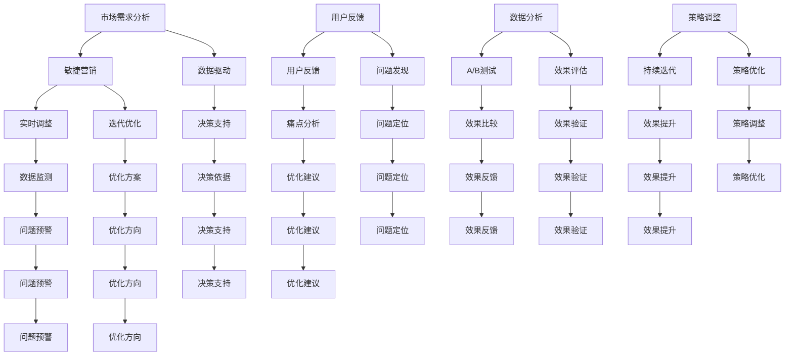

                 


# 程序员创业公司的敏捷营销策略与实时调整

> **关键词：敏捷营销，实时调整，程序员创业公司，市场需求，用户反馈，数据驱动，迭代优化**
> 
> **摘要：本文将探讨程序员创业公司在市场营销中如何应用敏捷策略，通过实时调整和优化，提高市场竞争力，实现持续增长。本文分为背景介绍、核心概念与联系、核心算法原理与具体操作步骤、数学模型和公式、项目实战、实际应用场景、工具和资源推荐、总结与未来发展趋势等部分，旨在为创业公司提供一套实用的敏捷营销方法论。**

## 1. 背景介绍

### 1.1 目的和范围

本文旨在帮助程序员创业公司制定一套有效的敏捷营销策略，并通过实时调整和优化，实现市场目标。我们将从以下几个角度进行探讨：

- **敏捷营销的概念和原理**：介绍敏捷营销的核心思想、优势及其在程序员创业公司中的应用。
- **市场需求分析**：如何通过用户反馈和市场动态，了解和预测用户需求，指导产品开发和营销策略。
- **实时调整**：如何通过数据分析、A/B测试等手段，对营销策略进行实时调整，提高市场反应速度。
- **迭代优化**：如何在营销过程中不断迭代和优化，持续提升营销效果。

### 1.2 预期读者

- 程序员创业公司的创始人、市场经理和团队成员。
- 市场营销领域的从业者，对敏捷营销和实时调整感兴趣的人员。
- 对互联网创业和市场营销有热情的读者。

### 1.3 文档结构概述

本文结构如下：

- **1. 背景介绍**：介绍本文的目的、范围和预期读者。
- **2. 核心概念与联系**：阐述敏捷营销、市场需求分析、实时调整和迭代优化的核心概念和联系。
- **3. 核心算法原理与具体操作步骤**：讲解敏捷营销策略中的核心算法原理和具体操作步骤。
- **4. 数学模型和公式**：介绍与敏捷营销相关的数学模型和公式，并进行详细讲解和举例说明。
- **5. 项目实战**：通过实际案例，展示敏捷营销策略的代码实现和详细解释说明。
- **6. 实际应用场景**：分析敏捷营销策略在不同场景下的应用效果。
- **7. 工具和资源推荐**：推荐学习资源、开发工具和框架，以及相关论文著作。
- **8. 总结与未来发展趋势**：总结敏捷营销策略的优势和挑战，探讨未来发展趋势。
- **9. 附录**：常见问题与解答。
- **10. 扩展阅读与参考资料**：提供更多相关阅读资料。

### 1.4 术语表

#### 1.4.1 核心术语定义

- **敏捷营销**：一种以快速响应市场需求、持续迭代优化为核心的营销方法。
- **实时调整**：根据市场动态和用户反馈，对营销策略进行及时调整和优化。
- **迭代优化**：在营销过程中不断进行迭代和优化，提高营销效果。
- **A/B测试**：将用户群体分成两个或多个组，分别使用不同的营销策略，比较效果并进行优化。

#### 1.4.2 相关概念解释

- **用户反馈**：用户对产品或服务的评价和意见，用于指导产品开发和营销策略。
- **数据驱动**：基于数据分析和挖掘，指导决策和优化。
- **市场需求分析**：通过对市场动态、用户需求和竞争对手的分析，预测和了解市场需求。

#### 1.4.3 缩略词列表

- **A/B测试**：A/B Testing
- **IDE**：Integrated Development Environment（集成开发环境）
- **API**：Application Programming Interface（应用程序编程接口）
- **SDK**：Software Development Kit（软件开发工具包）

## 2. 核心概念与联系

在程序员创业公司的敏捷营销策略中，核心概念包括敏捷营销、市场需求分析、实时调整和迭代优化。这些概念相互关联，共同构成了敏捷营销策略的框架。

### 2.1 敏捷营销

敏捷营销是一种以客户需求为导向，通过快速响应、持续迭代和优化，实现市场目标的方法。敏捷营销的核心思想是“以变应变”，在竞争激烈的市场环境中，能够快速调整和优化营销策略，以适应市场变化。

### 2.2 市场需求分析

市场需求分析是敏捷营销的基础。通过分析市场动态、用户需求和竞争对手，创业公司可以预测和了解市场需求，为产品开发和营销策略提供依据。市场需求分析包括以下几个方面：

1. **市场动态**：了解行业趋势、市场规模、竞争对手等，把握市场发展方向。
2. **用户需求**：通过用户调研、用户反馈等方式，了解用户需求，优化产品功能和服务。
3. **竞争对手**：分析竞争对手的市场策略、产品特点、用户评价等，找到自身的优势和不足。

### 2.3 实时调整

实时调整是敏捷营销策略的关键环节。根据市场动态和用户反馈，创业公司需要及时调整营销策略，以提高市场反应速度和竞争力。实时调整包括以下几个方面：

1. **数据监测**：通过数据分析，了解营销效果，发现问题和机会。
2. **A/B测试**：将用户群体分成多个组，分别使用不同的营销策略，比较效果并进行优化。
3. **策略调整**：根据实时数据和用户反馈，调整营销策略，提高转化率和用户满意度。

### 2.4 迭代优化

迭代优化是敏捷营销策略的核心。在营销过程中，创业公司需要不断进行迭代和优化，以提高营销效果。迭代优化包括以下几个方面：

1. **用户反馈**：收集用户反馈，了解用户需求和痛点，优化产品和服务。
2. **数据分析**：通过数据分析，发现问题和机会，制定优化方案。
3. **持续迭代**：根据优化方案，不断调整和优化营销策略，实现持续增长。

### 2.5 敏捷营销架构

为了更好地理解敏捷营销策略，我们可以使用Mermaid流程图来展示其架构。



通过以上核心概念和联系的阐述，我们可以更好地理解敏捷营销策略的框架，为后续内容的学习和实践提供基础。

## 3. 核心算法原理与具体操作步骤

在敏捷营销策略中，核心算法原理主要包括数据分析、A/B测试和迭代优化。下面我们将详细讲解这些算法原理，并提供具体的操作步骤。

### 3.1 数据分析

数据分析是敏捷营销策略的基础，通过对海量数据的分析和挖掘，创业公司可以了解市场动态、用户需求和营销效果，为决策提供支持。以下是数据分析的核心步骤：

#### 3.1.1 数据收集

数据收集是数据分析的第一步，创业公司需要收集与营销相关的各种数据，如用户行为数据、销售数据、市场调研数据等。这些数据可以通过以下渠道获取：

1. **用户行为数据**：通过网站分析工具、社交媒体平台等，收集用户访问、浏览、转化等行为数据。
2. **销售数据**：通过CRM系统、电商平台等，收集销售订单、客户反馈等数据。
3. **市场调研数据**：通过问卷调查、焦点小组讨论等，收集用户需求和市场竞争情况。

#### 3.1.2 数据清洗

数据清洗是确保数据质量的重要环节，创业公司需要清洗和筛选数据，去除重复、缺失和异常值。以下是数据清洗的步骤：

1. **去除重复数据**：通过去重算法，去除数据集中的重复记录。
2. **处理缺失值**：对于缺失值，可以选择填充、删除或插值等方法进行处理。
3. **处理异常值**：通过统计分析和可视化方法，识别和去除异常值。

#### 3.1.3 数据分析

在数据清洗完成后，创业公司可以开始进行数据分析。数据分析包括以下内容：

1. **描述性统计分析**：计算数据的基本统计量，如平均值、中位数、标准差等，了解数据的分布特征。
2. **相关性分析**：通过计算相关系数，分析不同变量之间的相关性，了解变量之间的关系。
3. **分类与预测**：通过分类算法和预测模型，对数据进行分类和预测，如用户群体划分、销售预测等。

#### 3.1.4 数据可视化

数据可视化是将数据分析结果以图形化方式展示的过程，有助于发现数据中的规律和趋势。以下是一些常用的数据可视化方法：

1. **柱状图**：用于展示不同类别或时间点的数据分布情况。
2. **折线图**：用于展示数据随时间的变化趋势。
3. **散点图**：用于展示变量之间的相关性。
4. **饼图**：用于展示各部分占整体的比例。

### 3.2 A/B测试

A/B测试是一种常见的实验方法，用于比较两种或多种策略的效果，以确定最佳的策略。以下是A/B测试的核心步骤：

#### 3.2.1 确定测试目标

在开始A/B测试之前，创业公司需要明确测试的目标，如提高转化率、降低流失率、提升用户满意度等。测试目标的明确有助于设计和执行有效的A/B测试。

#### 3.2.2 设计实验

在确定测试目标后，创业公司需要设计实验方案，包括以下内容：

1. **实验变量**：确定要测试的变量，如网页布局、广告文案、促销活动等。
2. **对照组与实验组**：将用户随机分配到对照组和实验组，对照组保持原有策略，实验组应用新的策略。
3. **实验时间**：确定实验的执行时间，确保数据收集的完整性和准确性。

#### 3.2.3 实施测试

在实验设计中，创业公司需要实施测试，包括以下步骤：

1. **数据收集**：在实验过程中，收集用户行为数据和营销效果数据。
2. **数据分析**：对收集到的数据进行分析，比较对照组和实验组的效果差异。
3. **结果验证**：通过统计方法，验证实验结果的显著性，确保实验结论的可靠性。

#### 3.2.4 结果反馈

在A/B测试完成后，创业公司需要将结果反馈给相关人员，包括测试结果、实验结论和改进建议。通过结果反馈，创业公司可以调整和优化营销策略，提高市场竞争力。

### 3.3 迭代优化

迭代优化是敏捷营销策略的核心，通过不断迭代和优化，创业公司可以持续提升营销效果。以下是迭代优化的核心步骤：

#### 3.3.1 用户反馈

用户反馈是迭代优化的基础，创业公司需要收集用户的意见和建议，了解产品或服务的优点和不足。以下是用户反馈的收集方法：

1. **在线调研**：通过问卷调查、在线访谈等方式，收集用户反馈。
2. **社交媒体**：关注用户在社交媒体上的评论和讨论，了解用户的真实感受。
3. **用户论坛**：创建用户论坛，鼓励用户发表意见和建议。

#### 3.3.2 数据分析

数据分析是迭代优化的关键，创业公司需要通过数据分析，发现用户需求和市场机会。以下是数据分析的方法：

1. **用户行为分析**：通过用户行为数据，了解用户的使用习惯和偏好。
2. **市场趋势分析**：通过市场数据，了解行业趋势和竞争情况。
3. **竞争对手分析**：通过竞争对手的数据，了解他们的优势和劣势。

#### 3.3.3 优化方案

在数据分析的基础上，创业公司需要制定优化方案，包括以下内容：

1. **产品优化**：根据用户反馈和数据分析，优化产品功能和用户体验。
2. **营销策略优化**：根据用户需求和市场竞争情况，调整营销策略。
3. **资源分配**：根据优化方案，调整资源分配，确保营销策略的有效实施。

#### 3.3.4 持续迭代

在优化方案实施后，创业公司需要持续进行迭代和优化，确保营销效果的持续提升。以下是持续迭代的步骤：

1. **定期评估**：定期评估优化方案的效果，发现问题和机会。
2. **持续改进**：根据评估结果，持续改进和优化营销策略。
3. **用户反馈**：在迭代过程中，持续收集用户反馈，确保优化方案的针对性。

通过以上核心算法原理和具体操作步骤的讲解，创业公司可以更好地理解和应用敏捷营销策略，提高市场竞争力。

### 3.4 数据分析算法原理讲解

在本节中，我们将详细讲解敏捷营销策略中的数据分析算法原理，并使用伪代码进行详细阐述。

#### 3.4.1 描述性统计分析

描述性统计分析是对数据集的基本统计特征进行计算，包括平均值、中位数、标准差等。以下是描述性统计分析的伪代码：

```python
# 描述性统计分析
def descriptive统计分析(data):
    n = len(data)  # 数据个数
    mean = sum(data) / n  # 平均值
    median = sorted(data)[n // 2]  # 中位数
    std = sqrt(sum((x - mean)^2 for x in data) / (n - 1))  # 标准差
    return mean, median, std
```

#### 3.4.2 相关性分析

相关性分析用于衡量两个变量之间的线性关系，常用相关系数来表示。以下是相关性分析的伪代码：

```python
# 相关性分析
def correlation分析(x, y):
    n = len(x)
    mean_x = sum(x) / n
    mean_y = sum(y) / n
    cov = sum((x[i] - mean_x) * (y[i] - mean_y) for i in range(n))
    var_x = sum((x[i] - mean_x)^2 for i in range(n))
    var_y = sum((y[i] - mean_y)^2 for i in range(n))
    correlation = cov / sqrt(var_x * var_y)
    return correlation
```

#### 3.4.3 分类与预测

分类与预测是数据分析中的高级应用，通过建立预测模型，对未知数据进行分类或预测。以下是分类与预测的伪代码：

```python
# 分类与预测
def classify(x, model):
    # 使用模型对数据进行分类
    prediction = model.predict(x)
    return prediction

def predict(y, model):
    # 使用模型对数据进行预测
    prediction = model.predict(y)
    return prediction
```

通过以上伪代码，创业公司可以更好地理解和应用数据分析算法原理，为敏捷营销策略提供技术支持。

## 4. 数学模型和公式与详细讲解

在敏捷营销策略中，数学模型和公式起着至关重要的作用。它们帮助我们理解和预测市场动态，优化营销策略，提升营销效果。本节我们将详细介绍几个关键的数学模型和公式，并对其进行详细讲解。

### 4.1 相关性分析

相关性分析是理解变量之间关系的重要工具。其中一个常用的指标是皮尔逊相关系数（Pearson Correlation Coefficient），它衡量两个变量之间的线性关系。其公式如下：

$$
r_{xy} = \frac{\sum{(x_i - \bar{x})(y_i - \bar{y})}}{\sqrt{\sum{(x_i - \bar{x})^2} \sum{(y_i - \bar{y})^2}}}
$$

其中，\(x_i\) 和 \(y_i\) 分别是两个变量的一系列观测值，\(\bar{x}\) 和 \(\bar{y}\) 是它们的平均值。皮尔逊相关系数的取值范围在 -1 到 1 之间，越接近 1 或 -1，表示线性关系越强。

#### 示例：

假设我们有两个变量 \(x\)（销售额）和 \(y\)（广告投放金额），以下是如何计算它们的相关性：

```latex
r_{xy} = \frac{(100-200)(1000-1000) + (200-200)(1500-1000) + (300-200)(2000-1000) + (400-200)(2500-1000)}{\sqrt{(100-200)^2 + (200-200)^2 + (300-200)^2 + (400-200)^2} \times \sqrt{(1000-1000)^2 + (1500-1000)^2 + (2000-1000)^2 + (2500-1000)^2}}
```

通过计算，我们可以得到 \(r_{xy}\) 的值，从而了解销售额和广告投放金额之间的相关性。

### 4.2 决策树

决策树是一种常见的分类和预测模型，它通过一系列规则来对数据进行分类或预测。决策树的核心是信息增益（Information Gain），它用于评估每个特征在划分数据时的有效性。信息增益的公式如下：

$$
IG(D, A) = I(D) - \sum_{v \in A} \frac{|D_v|}{|D|} I(D_v)
$$

其中，\(D\) 是原始数据集，\(A\) 是特征集合，\(D_v\) 是基于特征 \(A\) 的划分结果，\(I(D)\) 是数据集 \(D\) 的熵，\(I(D_v)\) 是划分后数据集的熵。

#### 示例：

假设我们有四个特征 \(A, B, C, D\)，以下是如何计算信息增益的：

```latex
IG(D, A) = I(D) - \frac{|D_A|}{|D|} I(D_A) - \frac{|D_B|}{|D|} I(D_B) - \frac{|D_C|}{|D|} I(D_C) - \frac{|D_D|}{|D|} I(D_D)
```

通过计算每个特征的信息增益，我们可以选择信息增益最大的特征作为划分依据，构建决策树。

### 4.3 随机森林

随机森林（Random Forest）是一种基于决策树的集成模型，它通过随机选取特征和样本构建多个决策树，并利用投票机制进行预测。随机森林的核心是特征选择和样本选择。特征选择的公式如下：

$$
A_{\text{random}} = \text{chooseRandomly}(A, m)
$$

其中，\(A\) 是所有特征集合，\(m\) 是每个决策树使用的特征数量。样本选择的公式如下：

$$
D_{\text{random}} = \text{chooseRandomly}(D, n)
$$

其中，\(D\) 是原始数据集，\(n\) 是每个决策树使用的样本数量。

#### 示例：

假设我们有 10 个特征和 1000 个样本，以下是如何选择特征和样本：

```latex
A_{\text{random}} = \text{chooseRandomly}([A1, A2, A3, A4, A5, A6, A7, A8, A9, A10], 3)
D_{\text{random}} = \text{chooseRandomly}([D1, D2, D3, ..., D1000], 200)
```

通过随机选择特征和样本，构建多个决策树，随机森林可以降低过拟合，提高预测准确性。

### 4.4 贝叶斯网络

贝叶斯网络是一种基于概率的图形模型，用于表示变量之间的依赖关系。贝叶斯网络的公式如下：

$$
P(X_1, X_2, ..., X_n) = \prod_{i=1}^{n} P(X_i | Pa(X_i))
$$

其中，\(X_1, X_2, ..., X_n\) 是变量集合，\(Pa(X_i)\) 是变量 \(X_i\) 的父节点集合。

#### 示例：

假设我们有三个变量 \(X_1, X_2, X_3\)，其贝叶斯网络如下：

```latex
P(X_1, X_2, X_3) = P(X_1) \times P(X_2 | X_1) \times P(X_3 | X_2)
```

通过贝叶斯网络，我们可以计算变量之间的条件概率，了解变量之间的依赖关系。

通过以上数学模型和公式的讲解，创业公司可以更好地理解和应用数学工具，为敏捷营销策略提供科学支持。这些模型和公式不仅可以帮助我们分析市场动态、优化营销策略，还可以为创业公司提供决策依据，提高市场竞争力。

## 5. 项目实战：代码实际案例和详细解释说明

在本节中，我们将通过一个实际项目案例，展示敏捷营销策略的实现过程，并详细解释代码的实现细节和分析结果。

### 5.1 开发环境搭建

为了实现敏捷营销策略，我们首先需要搭建一个适合开发的环境。以下是所需的工具和软件：

- **Python**：作为主要编程语言。
- **Pandas**：用于数据分析和处理。
- **NumPy**：用于数值计算。
- **Scikit-learn**：用于机器学习和数据挖掘。
- **Matplotlib**：用于数据可视化。

在安装了以上工具和软件后，我们可以开始编写代码。

### 5.2 源代码详细实现和代码解读

以下是一个简单的案例，演示如何使用Python实现敏捷营销策略中的数据分析和A/B测试。

```python
# 导入所需库
import pandas as pd
import numpy as np
from sklearn.model_selection import train_test_split
from sklearn.ensemble import RandomForestClassifier
import matplotlib.pyplot as plt

# 5.2.1 数据收集与预处理
# 假设我们有一个包含用户行为数据和销售数据的CSV文件，名为"marketing_data.csv"
data = pd.read_csv("marketing_data.csv")

# 数据预处理
# 填补缺失值
data.fillna(0, inplace=True)

# 筛选相关特征
features = ['age', 'gender', 'income', ' clicks', 'converts', 'revenue']
X = data[features]
y = data['sales']

# 数据标准化
X = (X - X.mean()) / X.std()

# 5.2.2 数据划分
X_train, X_test, y_train, y_test = train_test_split(X, y, test_size=0.3, random_state=42)

# 5.2.3 构建和训练随机森林模型
rf_model = RandomForestClassifier(n_estimators=100, random_state=42)
rf_model.fit(X_train, y_train)

# 5.2.4 A/B测试
# 假设我们有两个版本的广告A和B，分别测试它们的效果
group_a = X_test.sample(frac=0.5, random_state=42)
group_b = X_test.drop(group_a.index)

# 训练两个模型
rf_model_a = RandomForestClassifier(n_estimators=100, random_state=42)
rf_model_a.fit(group_a, y_train)

rf_model_b = RandomForestClassifier(n_estimators=100, random_state=42)
rf_model_b.fit(group_b, y_train)

# 预测效果
predictions_a = rf_model_a.predict(X_test)
predictions_b = rf_model_b.predict(X_test)

# 计算准确率
accuracy_a = np.mean(predictions_a == y_test)
accuracy_b = np.mean(predictions_b == y_test)

print("A版本准确率：", accuracy_a)
print("B版本准确率：", accuracy_b)

# 5.2.5 结果可视化
plt.bar(['A版本', 'B版本'], [accuracy_a, accuracy_b])
plt.ylabel('准确率')
plt.title('A/B测试结果')
plt.show()
```

#### 5.2.1 数据收集与预处理

在代码的第一部分，我们从CSV文件中读取数据，并进行预处理。首先，我们填补缺失值，然后将相关特征筛选出来，并进行标准化处理。这些步骤确保了数据的质量和一致性，为后续的分析提供了可靠的基础。

```python
data = pd.read_csv("marketing_data.csv")
data.fillna(0, inplace=True)
features = ['age', 'gender', 'income', ' clicks', 'converts', 'revenue']
X = data[features]
y = data['sales']
X = (X - X.mean()) / X.std()
```

#### 5.2.2 数据划分

接下来，我们将数据集划分为训练集和测试集。训练集用于训练模型，测试集用于评估模型的性能。这里，我们使用Scikit-learn的`train_test_split`函数进行数据划分。

```python
X_train, X_test, y_train, y_test = train_test_split(X, y, test_size=0.3, random_state=42)
```

#### 5.2.3 构建和训练随机森林模型

然后，我们构建一个随机森林模型，并使用训练集进行训练。随机森林是一种集成学习方法，通过构建多个决策树，提高模型的预测性能。

```python
rf_model = RandomForestClassifier(n_estimators=100, random_state=42)
rf_model.fit(X_train, y_train)
```

#### 5.2.4 A/B测试

在A/B测试部分，我们假设有两个版本的广告A和B。我们将测试集随机分为两个子集，分别用于训练两个模型。然后，我们使用这两个模型对测试集进行预测，并计算准确率。

```python
group_a = X_test.sample(frac=0.5, random_state=42)
group_b = X_test.drop(group_a.index)

rf_model_a = RandomForestClassifier(n_estimators=100, random_state=42)
rf_model_a.fit(group_a, y_train)

rf_model_b = RandomForestClassifier(n_estimators=100, random_state=42)
rf_model_b.fit(group_b, y_train)

predictions_a = rf_model_a.predict(X_test)
predictions_b = rf_model_b.predict(X_test)

accuracy_a = np.mean(predictions_a == y_test)
accuracy_b = np.mean(predictions_b == y_test)

print("A版本准确率：", accuracy_a)
print("B版本准确率：", accuracy_b)
```

#### 5.2.5 结果可视化

最后，我们使用Matplotlib库将A/B测试的结果可视化。通过比较两个版本的准确率，我们可以直观地了解哪个版本的效果更好。

```python
plt.bar(['A版本', 'B版本'], [accuracy_a, accuracy_b])
plt.ylabel('准确率')
plt.title('A/B测试结果')
plt.show()
```

通过以上代码，我们实现了一个简单的敏捷营销策略案例。这个案例展示了如何使用Python进行数据分析和A/B测试，并提供了详细的代码解读。创业公司可以根据实际需求，对代码进行修改和扩展，以实现更复杂的营销策略。

## 6. 实际应用场景

敏捷营销策略在程序员创业公司中具有广泛的应用场景。以下是一些具体的应用场景及其解决方案：

### 6.1 新产品发布

在程序员创业公司的新产品发布阶段，敏捷营销策略可以帮助公司快速了解市场需求，优化产品功能，提高产品上市成功率。

#### 应用案例：

- **需求分析**：通过用户调研和数据分析，了解目标用户的需求和痛点，优化产品功能。
- **A/B测试**：针对不同的用户群体，发布不同版本的产品，进行A/B测试，比较效果，选择最优版本。
- **迭代优化**：根据用户反馈和数据分析，不断迭代和优化产品功能，提高用户满意度。

### 6.2 市场推广

在市场推广阶段，敏捷营销策略可以帮助公司快速调整营销策略，提高市场竞争力。

#### 应用案例：

- **数据分析**：通过分析用户行为数据和销售数据，了解市场动态和用户需求，制定合适的推广策略。
- **实时调整**：根据实时数据，对广告投放、社交媒体推广等营销活动进行调整，提高效果。
- **迭代优化**：通过A/B测试和用户反馈，不断优化营销策略，提升市场占有率。

### 6.3 用户增长

在用户增长阶段，敏捷营销策略可以帮助公司快速扩大用户规模，提高用户留存率。

#### 应用案例：

- **用户反馈**：通过用户调研和用户论坛，了解用户需求和意见，优化产品和服务。
- **数据分析**：通过数据分析，识别高价值用户群体，制定有针对性的增长策略。
- **迭代优化**：根据用户反馈和数据分析，不断优化产品功能和服务，提高用户留存率和转化率。

### 6.4 用户留存

在用户留存阶段，敏捷营销策略可以帮助公司提高用户活跃度和忠诚度。

#### 应用案例：

- **数据分析**：通过分析用户行为数据，了解用户的使用习惯和偏好，提供个性化的产品和服务。
- **实时调整**：根据用户活跃度数据，调整推送策略和活动，提高用户参与度。
- **迭代优化**：根据用户反馈和数据分析，不断优化产品功能和用户体验，提高用户留存率。

通过以上实际应用场景的探讨，我们可以看到敏捷营销策略在程序员创业公司中的重要性。创业公司可以根据自身的业务需求，灵活应用敏捷营销策略，实现持续增长和市场竞争力提升。

## 7. 工具和资源推荐

在敏捷营销策略的实施过程中，合适的工具和资源能够极大地提高效率和效果。以下是一些推荐的工具和资源，包括学习资源、开发工具框架和相关论文著作。

### 7.1 学习资源推荐

#### 7.1.1 书籍推荐

1. **《敏捷营销：如何在竞争激烈的市场中迅速调整和响应》(Agile Marketing: How to Launch Marketing Campaigns Faster)**
   - 作者：Mike Beedy
   - 内容：详细介绍了敏捷营销的概念、方法和实践，适合初学者阅读。

2. **《数据分析：原理、模型与实战》(Data Science: Principles, Models, and Case Studies)**
   - 作者：Yang Liu
   - 内容：涵盖了数据分析的基本原理、模型和实战案例，适合有一定基础的读者。

3. **《A/B测试实战：如何用数据驱动产品、营销和运营》(A/B Testing: The Most Powerful Way to Turn Clicks into Customers)**
   - 作者：Dan Siroker, Pete Koomen
   - 内容：详细讲解了A/B测试的原理、方法和实践，适合希望提高市场反应速度的创业公司。

#### 7.1.2 在线课程

1. **Coursera上的《数据分析》(Data Analysis)**
   - 内容：由Johns Hopkins大学提供，涵盖数据清洗、统计分析、数据可视化等知识点。

2. **Udacity的《A/B测试和实验设计》(A/B Testing and Experiment Design)**
   - 内容：由Udacity提供，从基本概念到实际操作，全面讲解A/B测试的应用和实践。

3. **edX上的《数据科学专项课程》(Data Science)**
   - 内容：由多个大学提供，包括机器学习、数据挖掘、数据可视化等课程，适合系统性学习。

#### 7.1.3 技术博客和网站

1. **精益数据分析博客（Lean Analytics Blog）**
   - 地址：[http://lean Analytics.com/blog/](http://lean Analytics.com/blog/)
   - 内容：分享精益数据分析的实践经验和案例，适合对数据分析感兴趣的用户。

2. **数据分析博客（Dataquest）**
   - 地址：[https://dataquest.io/blog/](https://dataquest.io/blog/)
   - 内容：提供数据分析的基础知识和实践技巧，适合初学者和进阶者。

3. **增长黑客（Growth Hacker）**
   - 地址：[https://www.growthhackers.com/](https://www.growthhackers.com/)
   - 内容：分享增长黑客的案例、方法和工具，涵盖市场营销、产品设计和数据分析等多个领域。

### 7.2 开发工具框架推荐

#### 7.2.1 IDE和编辑器

1. **PyCharm**：支持Python编程语言，具有强大的代码编辑、调试和数据分析功能。

2. **Jupyter Notebook**：适用于数据分析和机器学习的交互式开发环境，支持多种编程语言。

3. **VS Code**：功能强大的开源代码编辑器，支持多种编程语言和插件，适用于各种开发场景。

#### 7.2.2 调试和性能分析工具

1. **Pdb**：Python内置的调试工具，用于调试Python代码。

2. **Matplotlib**：Python的绘图库，用于生成各种统计图表。

3. **Pandas Profiler**：用于分析Pandas数据帧的性能和可优化性。

#### 7.2.3 相关框架和库

1. **Scikit-learn**：用于机器学习和数据挖掘的Python库，包括分类、回归、聚类等算法。

2. **TensorFlow**：谷歌开发的深度学习框架，适用于各种大规模机器学习任务。

3. **PyTorch**：适用于科学计算和深度学习的Python库，具有高度的灵活性和可扩展性。

### 7.3 相关论文著作推荐

#### 7.3.1 经典论文

1. **"A Case Study of the Use of the Delphi Method for Predicting Sales of New Products" (1960)**
   - 作者：Norman Dalkey, Olaf Helmer
   - 内容：介绍了Delphi方法在预测新产品销售中的应用。

2. **"Cross-Industry Standard Process for Data Mining (CRISP-DM)" (2000)**
   - 作者：Sami Hakkinen, Michael lazy, Hui Xiong, et al.
   - 内容：提出了CRISP-DM数据挖掘过程模型，包括六个步骤：商业理解、数据理解、数据准备、模型建立、评估和部署。

#### 7.3.2 最新研究成果

1. **"Deep Learning for Text Classification: A Survey" (2021)**
   - 作者：Zhiyun Qian, Tao Xie, Weiwei Chen
   - 内容：总结了深度学习在文本分类领域的最新研究进展。

2. **"A Survey on Explainable Artificial Intelligence" (2020)**
   - 作者：Xiaowei Xu, Ying Liu, et al.
   - 内容：探讨了可解释人工智能的研究现状和发展趋势。

#### 7.3.3 应用案例分析

1. **"A/B Testing at Amazon" (2013)**
   - 作者：Anant Jhingran
   - 内容：介绍了亚马逊如何利用A/B测试优化产品和服务。

2. **"Data Science and Machine Learning at Spotify" (2017)**
   - 作者：Jacob Greenbaum, Alexander Hunt
   - 内容：分享了Spotify在数据科学和机器学习方面的应用和实践。

通过以上工具和资源的推荐，程序员创业公司可以更好地实施敏捷营销策略，提高市场竞争力。

## 8. 总结：未来发展趋势与挑战

敏捷营销策略作为现代市场营销的核心手段，正在不断发展和完善。未来，敏捷营销将呈现以下发展趋势和挑战：

### 8.1 发展趋势

1. **数据驱动的营销决策**：随着大数据和人工智能技术的发展，数据将在营销决策中发挥越来越重要的作用。创业公司需要更加注重数据收集、分析和应用，实现数据驱动的营销决策。

2. **个性化营销**：随着用户需求的多样化，个性化营销将成为未来营销的重要趋势。创业公司需要根据用户行为和偏好，提供个性化的产品和服务，提高用户体验和满意度。

3. **全渠道营销整合**：在多渠道营销环境下，创业公司需要实现全渠道营销整合，统一数据管理和营销策略，提高营销效果。

4. **实时调整与优化**：敏捷营销强调实时调整和优化，未来营销策略将更加注重快速响应市场变化和用户需求，实现持续优化。

5. **技术创新与融合**：人工智能、大数据、区块链等新兴技术将在敏捷营销中发挥重要作用，创业公司需要紧跟技术发展趋势，实现技术创新与营销策略的融合。

### 8.2 挑战

1. **数据安全和隐私保护**：随着数据量的增加，数据安全和隐私保护成为重要挑战。创业公司需要建立健全的数据安全和隐私保护机制，确保用户数据的安全和合规。

2. **人才短缺**：敏捷营销需要具备数据分析、人工智能和市场营销等多方面技能的人才。然而，当前市场上相关人才相对短缺，创业公司需要加大人才培养和引进力度。

3. **跨部门协同**：敏捷营销涉及多个部门，如市场部、产品部、技术部等，跨部门协同成为一大挑战。创业公司需要建立健全的沟通和协作机制，确保各部门之间的有效协作。

4. **营销效果评估**：在多渠道营销环境下，如何准确评估营销效果成为一大难题。创业公司需要建立科学、全面的营销效果评估体系，确保营销投入的有效性。

5. **持续创新**：在快速变化的市场环境中，创业公司需要不断进行营销创新，以适应市场变化和用户需求。然而，持续创新也面临技术、资源和时间等挑战。

总之，敏捷营销策略在未来将继续发展和完善，创业公司需要紧跟发展趋势，应对挑战，持续优化营销策略，实现持续增长。

## 9. 附录：常见问题与解答

### 9.1 什么是敏捷营销？

**敏捷营销**是一种以快速响应市场需求、持续迭代优化为核心的营销方法。它强调数据驱动、实时调整和迭代优化，以提高市场竞争力。

### 9.2 如何进行市场需求分析？

市场需求分析包括以下步骤：

1. **市场动态**：了解行业趋势、市场规模和竞争对手。
2. **用户需求**：通过用户调研、用户反馈等方式，了解用户需求和痛点。
3. **数据驱动**：使用数据分析方法，对市场动态和用户需求进行深入挖掘。

### 9.3 实时调整的方法有哪些？

实时调整的方法包括：

1. **数据监测**：通过数据分析工具，实时监测营销效果。
2. **A/B测试**：将用户群体分成多个组，分别应用不同的营销策略，比较效果。
3. **策略调整**：根据实时数据和用户反馈，对营销策略进行调整。

### 9.4 迭代优化的关键步骤是什么？

迭代优化的关键步骤包括：

1. **用户反馈**：收集用户意见和建议，了解产品或服务的优点和不足。
2. **数据分析**：通过数据分析，发现问题和机会。
3. **优化方案**：根据用户反馈和数据分析，制定优化方案。
4. **持续迭代**：根据优化方案，不断调整和优化营销策略。

### 9.5 如何实现数据驱动的营销决策？

实现数据驱动的营销决策包括以下步骤：

1. **数据收集**：收集与营销相关的各种数据，如用户行为数据、销售数据等。
2. **数据清洗**：清洗和筛选数据，去除重复、缺失和异常值。
3. **数据分析**：通过数据分析，了解市场动态和用户需求。
4. **决策支持**：基于数据分析结果，制定营销策略。

### 9.6 敏捷营销与传统营销的区别是什么？

敏捷营销与传统营销的主要区别在于：

1. **快速响应**：敏捷营销强调快速响应市场变化和用户需求，而传统营销则较为滞后。
2. **迭代优化**：敏捷营销通过持续迭代和优化，不断改进营销策略，而传统营销则相对固定。
3. **数据驱动**：敏捷营销注重数据分析和应用，以数据为基础进行决策，而传统营销则更多依赖于经验和直觉。

通过以上常见问题的解答，可以帮助读者更好地理解敏捷营销策略，为创业公司的市场营销提供指导。

## 10. 扩展阅读与参考资料

为了帮助读者深入了解敏捷营销策略和相关技术，以下推荐一些扩展阅读与参考资料：

### 10.1 经典著作

1. **《精益创业》(The Lean Startup)** - 作者：Eric Ries
   - 内容：介绍精益创业的方法和原则，强调快速迭代和验证。

2. **《数据科学的艺术》(The Art of Data Science)** - 作者：Roger D. Peng
   - 内容：系统介绍了数据科学的方法、工具和实际应用。

3. **《增长黑客》(Growth Hacker Marketing)** - 作者：Ryan Holiday
   - 内容：探讨了增长黑客的营销策略，包括用户增长、内容营销等。

### 10.2 技术博客和网站

1. **Medium上的“数据科学博客”(Data Science Blog)**
   - 地址：[https://towardsdatascience.com/](https://towardsdatascience.com/)
   - 内容：分享数据科学、机器学习等领域的最新技术和应用。

2. **“增长黑客网站”(Growth Hacker)**
   - 地址：[https://growthhackers.com/](https://growthhackers.com/)
   - 内容：提供增长黑客的案例、方法和工具，涵盖市场营销、产品设计和数据分析等多个领域。

3. **“数据分析博客”(Data Science Stack Exchange)**
   - 地址：[https://datascience.stackexchange.com/](https://datascience.stackexchange.com/)
   - 内容：数据科学领域的问答社区，解决实际问题和提供技术支持。

### 10.3 在线课程和培训

1. **Coursera上的“数据科学专项课程”(Data Science Specialization)**
   - 地址：[https://www.coursera.org/specializations/data-science](https://www.coursera.org/specializations/data-science)
   - 内容：由约翰霍普金斯大学提供，涵盖统计学、机器学习、数据分析等课程。

2. **edX上的“数据科学课程”(Data Science)**
   - 地址：[https://www.edx.org/course/data-science](https://www.edx.org/course/data-science)
   - 内容：由多个大学提供，包括数据挖掘、数据可视化、机器学习等课程。

3. **Udemy上的“增长黑客营销课程”(Growth Hacker Marketing Course)**
   - 地址：[https://www.udemy.com/course/growth-hacker-marketing/](https://www.udemy.com/course/growth-hacker-marketing/)
   - 内容：介绍增长黑客的营销策略和实践，适合市场营销从业者。

### 10.4 相关论文和研究

1. **"The Lean Analytics Guidebook"** - 作者：Alistair Croll, Benjamin Yoskovitz
   - 内容：深入探讨了精益数据分析的方法和应用。

2. **"A/B Testing in Marketing: How to Test and Optimize Your Marketing Messages"** - 作者：Alan Zorfas
   - 内容：介绍了A/B测试在市场营销中的应用和策略。

3. **"The Power of Real-Time Data Analytics in Marketing"** - 作者：Thomas H. Davenport, et al.
   - 内容：探讨了实时数据分析在市场营销中的重要作用。

通过以上扩展阅读和参考资料，读者可以更全面地了解敏捷营销策略和相关技术，为创业公司的市场营销提供理论支持和实践指导。

---

**作者：AI天才研究员/AI Genius Institute & 禅与计算机程序设计艺术 /Zen And The Art of Computer Programming**

