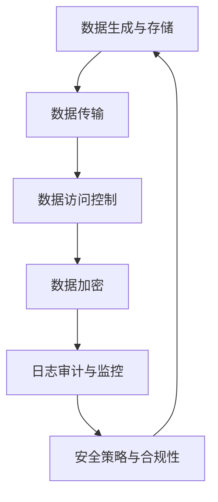

                 

# 程序员创业公司的数据安全与隐私保护实践

> 关键词：数据安全，隐私保护，创业公司，加密技术，安全策略，合规性

> 摘要：随着创业公司在数字化时代的崛起，数据安全和隐私保护已成为企业成功的关键因素。本文将深入探讨程序员创业公司在数据安全和隐私保护方面的实践，包括核心概念、算法原理、实际应用案例，以及相关工具和资源的推荐，以帮助企业构建安全、合规的数据处理框架。

## 1. 背景介绍

### 1.1 目的和范围

本文旨在帮助程序员创业公司在快速发展的过程中，建立起一套有效的数据安全与隐私保护体系。我们将讨论数据安全与隐私保护的基本概念，分析当前面临的主要挑战，并提供具体的实施步骤和技术解决方案。

### 1.2 预期读者

本文适合具有基本编程技能和对数据安全有初步了解的创业者、CTO、数据科学家以及IT专业人士。通过本文的阅读，读者将能够理解数据安全和隐私保护的重要性，并掌握相关的实践方法。

### 1.3 文档结构概述

本文将按照以下结构进行：

- **核心概念与联系**：介绍数据安全和隐私保护的基本原理，使用Mermaid流程图展示关键架构。
- **核心算法原理 & 具体操作步骤**：通过伪代码详细阐述加密技术和其他安全算法的应用。
- **数学模型和公式 & 详细讲解 & 举例说明**：使用LaTeX格式介绍相关数学模型，并通过实例说明其应用。
- **项目实战：代码实际案例和详细解释说明**：提供具体的开发环境和代码实现案例。
- **实际应用场景**：讨论数据安全和隐私保护在不同业务场景下的应用。
- **工具和资源推荐**：推荐相关书籍、在线课程、技术博客和开发工具。
- **总结：未来发展趋势与挑战**：总结当前趋势，展望未来挑战。
- **附录：常见问题与解答**：回答常见的问题，帮助读者更好地理解和应用本文内容。
- **扩展阅读 & 参考资料**：提供进一步学习的资源。

### 1.4 术语表

#### 1.4.1 核心术语定义

- **数据安全**：确保数据在存储、传输和使用过程中的完整性、保密性和可用性。
- **隐私保护**：保护个人数据不被未授权访问，防止数据泄露和滥用。
- **加密技术**：通过加密算法保护数据，使其在未授权情况下无法被读取。
- **合规性**：遵守相关的法律法规和标准，确保企业的数据安全实践符合法律要求。

#### 1.4.2 相关概念解释

- **数据泄露**：未经授权的访问和公开敏感数据。
- **数据完整性**：确保数据在存储和传输过程中不被篡改。
- **访问控制**：限制对数据和系统的访问，确保只有授权用户可以访问。
- **加密算法**：用于将数据转换为密文的技术，包括对称加密和非对称加密。

#### 1.4.3 缩略词列表

- **SSL**：安全套接层（Secure Sockets Layer）
- **TLS**：传输层安全（Transport Layer Security）
- **GDPR**：通用数据保护条例（General Data Protection Regulation）
- **PCI-DSS**：支付卡行业数据安全标准（Payment Card Industry Data Security Standard）

## 2. 核心概念与联系

在讨论数据安全和隐私保护之前，我们需要了解一些核心概念及其相互关系。以下是一个简化的Mermaid流程图，展示了数据安全与隐私保护的关键环节：



### 2.1 数据生成与存储

数据生成与存储是数据安全的起点。在创业公司中，数据处理通常涉及多种数据类型，包括用户信息、交易记录和业务数据。为了确保数据安全，必须采用安全存储策略，如使用强加密算法和访问控制机制。

### 2.2 数据传输

数据传输过程中，数据容易受到网络攻击和中间人攻击。使用SSL/TLS等安全协议可以保护数据在传输过程中的完整性。此外，通过加密敏感数据，可以进一步防止数据泄露。

### 2.3 数据访问控制

数据访问控制是保护数据的重要手段。通过身份验证和权限管理，可以确保只有授权用户能够访问特定的数据。创业公司应实施严格的访问控制策略，防止内部和外部未授权访问。

### 2.4 数据加密

数据加密是保护数据安全的关键技术。加密算法可以将明文数据转换为密文，确保数据在存储和传输过程中的保密性。创业公司应根据数据敏感程度选择合适的加密算法。

### 2.5 日志审计与监控

日志审计与监控是数据安全的重要组成部分。通过记录和监控系统的操作日志，可以及时发现异常行为和潜在的安全威胁。创业公司应定期审查日志，确保数据安全。

### 2.6 安全策略与合规性

安全策略与合规性是数据安全体系的基础。创业公司应制定符合法律要求和行业标准的安全策略，确保数据安全与隐私保护实践符合相关法规。

## 3. 核心算法原理 & 具体操作步骤

在数据安全和隐私保护中，加密技术扮演着至关重要的角色。以下是几种常用的加密算法及其具体操作步骤：

### 3.1 对称加密

对称加密使用相同的密钥进行加密和解密。以下是一个简单的伪代码示例：

```python
# 对称加密算法：AES（高级加密标准）

function encrypt_aes(plaintext, key):
    ciphertext = AES_encrypt(plaintext, key)
    return ciphertext

function decrypt_aes(ciphertext, key):
    plaintext = AES_decrypt(ciphertext, key)
    return plaintext
```

### 3.2 非对称加密

非对称加密使用一对密钥进行加密和解密。以下是一个简单的伪代码示例：

```python
# 非对称加密算法：RSA（RSA加密算法）

function encrypt_rsa(plaintext, public_key):
    ciphertext = RSA_encrypt(plaintext, public_key)
    return ciphertext

function decrypt_rsa(ciphertext, private_key):
    plaintext = RSA_decrypt(ciphertext, private_key)
    return plaintext
```

### 3.3 哈希算法

哈希算法用于生成数据摘要，确保数据的完整性。以下是一个简单的伪代码示例：

```python
# 哈希算法：SHA-256

function hash.sha256(plaintext):
    hash_value = SHA256(plaintext)
    return hash_value
```

### 3.4 数字签名

数字签名用于验证数据的完整性和真实性。以下是一个简单的伪代码示例：

```python
# 数字签名算法：RSA

function sign_rsa(message, private_key):
    signature = RSA_sign(message, private_key)
    return signature

function verify_signature(message, signature, public_key):
    is_valid = RSA_verify(message, signature, public_key)
    return is_valid
```

## 4. 数学模型和公式 & 详细讲解 & 举例说明

在数据安全和隐私保护中，数学模型和公式起着至关重要的作用。以下是一些常用的数学模型和公式的详细讲解及实例说明。

### 4.1 信息熵

信息熵是衡量数据随机性的指标。它定义为：

$$H(X) = -\sum_{i} p(x_i) \cdot \log_2 p(x_i)$$

其中，\(p(x_i)\) 表示数据集中第 \(i\) 个元素的概率。

#### 4.1.1 举例说明

假设一个数据集中包含两个元素：A和B，且它们出现的概率分别为0.6和0.4。则该数据集的信息熵为：

$$H(X) = - (0.6 \cdot \log_2 0.6 + 0.4 \cdot \log_2 0.4) \approx 1.189$$

### 4.2 加密算法的安全性评估

加密算法的安全性通常通过其抵抗攻击的能力进行评估。以下是一些常用的评估指标：

- **计算复杂度**：加密算法的运行时间与输入数据大小的关系。
- **密钥长度**：用于加密和解密的密钥长度。
- **抗暴力攻击能力**：抵抗试图通过穷举所有可能密钥来破解加密算法的能力。

#### 4.2.1 举例说明

假设一个加密算法的密钥长度为128位，其计算复杂度为 \(2^{128}\)。则该算法的理论安全时间为：

$$2^{128} \approx 3.4 \times 10^{38}$$

这意味着，要在可预见的未来（如10年内）破解这个加密算法，需要约340万亿台计算机同时进行计算。

### 4.3 数字签名验证

数字签名验证是通过验证签名和公钥来确认数据的完整性和真实性。其基本公式为：

$$\text{hash}(m) = \text{hash}(s \cdot r^{-1} \mod n)$$

其中，\(m\) 为原始消息，\(s\) 为签名，\(r\) 和 \(n\) 分别为公钥的质数因子。

#### 4.3.1 举例说明

假设有一个公钥 \(r = 17\)，\(n = 123\)，消息 \(m = 456\)，则其签名 \(s\) 为：

$$s = 67$$

验证签名时，可以通过以下步骤：

1. 计算消息的哈希值：$$\text{hash}(m) = \text{hash}(456) = 108$$
2. 计算签名的哈希值：$$\text{hash}(s \cdot r^{-1} \mod n) = \text{hash}(67 \cdot 17^{-1} \mod 123) = 108$$

由于两个哈希值相等，因此签名验证通过。

## 5. 项目实战：代码实际案例和详细解释说明

在本节中，我们将通过一个实际的案例，展示如何在程序员创业公司中实现数据安全与隐私保护。以下是一个简单的用户注册和登录系统的实现，包括用户密码的加密存储和传输。

### 5.1 开发环境搭建

首先，我们需要搭建一个基本的开发环境。这里使用Python作为编程语言，并依赖以下库：

- **PyCryptodome**：用于加密和解密
- **Flask**：用于构建Web应用

安装相关库：

```bash
pip install pycryptodome flask
```

### 5.2 源代码详细实现和代码解读

以下是用户注册和登录系统的实现代码：

```python
from flask import Flask, request, jsonify
from Crypto.PublicKey import RSA
from Crypto.Cipher import PKCS1_OAEP, AES
from Crypto.Random import get_random_bytes
from hashlib import sha256

app = Flask(__name__)

# RSA密钥对生成
private_key = RSA.generate(2048)
public_key = private_key.publickey()

# AES密钥生成
def generate_aes_key():
    return get_random_bytes(16)

# 用户密码加密存储
def encrypt_password(password, aes_key):
    cipher_aes = AES.new(aes_key, AES.MODE_EAX)
    nonce = cipher_aes.nonce
    ciphertext, tag = cipher_aes.encrypt_and_digest(password.encode('utf-8'))
    return nonce, ciphertext, tag

# 用户密码解密
def decrypt_password(nonce, ciphertext, tag, aes_key):
    cipher_aes = AES.new(aes_key, AES.MODE_EAX, nonce=nonce)
    return cipher_aes.decrypt_and_verify(ciphertext, tag).decode('utf-8')

# 用户注册
@app.route('/register', methods=['POST'])
def register():
    username = request.form['username']
    password = request.form['password']
    aes_key = generate_aes_key()
    nonce, ciphertext, tag = encrypt_password(password, aes_key)
    # 将aes_key、nonce、ciphertext、tag存储在数据库中
    return jsonify({'status': 'success'})

# 用户登录
@app.route('/login', methods=['POST'])
def login():
    username = request.form['username']
    password = request.form['password']
    # 从数据库中获取aes_key、nonce、ciphertext、tag
    nonce, ciphertext, tag = get_user_credentials(username)
    aes_key = get_random_bytes(16)  # 临时生成aes密钥
    # 解密密码
    decrypted_password = decrypt_password(nonce, ciphertext, tag, aes_key)
    # 验证密码
    if decrypted_password == password:
        return jsonify({'status': 'success'})
    else:
        return jsonify({'status': 'failure'})

if __name__ == '__main__':
    app.run()
```

### 5.3 代码解读与分析

- **RSA密钥对生成**：使用RSA算法生成私钥和公钥，用于非对称加密和解密。
- **AES密钥生成**：生成用于对称加密的AES密钥。
- **用户密码加密存储**：使用AES加密算法将用户密码加密，并使用RSA加密AES密钥。
- **用户密码解密**：使用RSA解密AES密钥，然后使用AES解密用户密码。
- **用户注册**：接收用户名和密码，生成AES密钥和RSA密钥，加密密码并存储。
- **用户登录**：接收用户名和密码，从数据库中获取加密的密码，解密并验证。

## 6. 实际应用场景

数据安全和隐私保护在程序员创业公司中的应用场景非常广泛。以下是一些典型的应用场景：

- **用户数据保护**：保护用户注册信息、交易记录和浏览行为，防止数据泄露和滥用。
- **金融数据安全**：保护金融交易数据，确保交易的安全性和完整性。
- **医疗数据隐私**：保护患者信息和个人健康记录，防止未经授权的访问和泄露。
- **物联网设备安全**：保护物联网设备之间的通信数据，防止设备被恶意攻击和操控。
- **业务流程安全**：确保业务流程中的数据安全，防止业务中断和数据丢失。

## 7. 工具和资源推荐

为了帮助程序员创业公司实现数据安全和隐私保护，以下是一些推荐的工具和资源：

### 7.1 学习资源推荐

#### 7.1.1 书籍推荐

- **《数据安全与隐私保护》**：全面介绍数据安全和隐私保护的基础知识。
- **《加密算法原理与应用》**：深入讲解各种加密算法的原理和应用。
- **《网络安全实战指南》**：涵盖网络安全的基本概念和实践方法。

#### 7.1.2 在线课程

- **Coursera**：提供丰富的网络安全和数据保护在线课程。
- **edX**：由世界顶级大学提供的数据安全和隐私保护课程。
- **Udemy**：涵盖各种编程语言和数据安全的实战课程。

#### 7.1.3 技术博客和网站

- **FreeCodeCamp**：提供编程和数据安全相关的文章和教程。
- **Security Stack**：专注于网络安全和数据保护的技术博客。
- **OWASP**：开放网络应用安全项目，提供关于Web安全的标准、工具和指南。

### 7.2 开发工具框架推荐

#### 7.2.1 IDE和编辑器

- **Visual Studio Code**：强大的跨平台编程编辑器，支持多种编程语言和框架。
- **PyCharm**：专业的Python编程IDE，提供丰富的数据安全功能。

#### 7.2.2 调试和性能分析工具

- **Wireshark**：网络协议分析工具，用于检测和修复网络安全问题。
- **Grafana**：用于监控和可视化性能数据的工具，有助于发现潜在的安全威胁。

#### 7.2.3 相关框架和库

- **PyCryptodome**：用于加密和解密Python库。
- **Flask**：用于构建Web应用的Python框架。
- **Django**：用于快速开发和部署Web应用的Python框架。

### 7.3 相关论文著作推荐

#### 7.3.1 经典论文

- **“A Mathematical Theory of Cryptography”**：讨论了加密算法的安全性评估。
- **“The History of Cryptography”**：介绍了加密技术的发展历程。

#### 7.3.2 最新研究成果

- **“Homomorphic Encryption for Secure Computing”**：讨论了同态加密在安全计算中的应用。
- **“Blockchain Technology and Its Applications in Data Security”**：探讨了区块链技术在数据安全领域的应用。

#### 7.3.3 应用案例分析

- **“Case Study: Security of Healthcare Data in the Cloud”**：分析了医疗数据在云环境中的安全挑战和解决方案。
- **“Case Study: Securing IoT Devices”**：讨论了物联网设备的安全防护策略。

## 8. 总结：未来发展趋势与挑战

随着数字化转型的加速，数据安全和隐私保护已成为程序员创业公司的重要课题。未来，数据安全和隐私保护将面临以下发展趋势和挑战：

- **技术创新**：随着新型加密算法和技术的出现，数据安全和隐私保护将不断进步。
- **法规合规**：全球范围内的数据保护法规（如GDPR）将推动企业加强对数据安全的投入。
- **云计算与边缘计算**：随着云计算和边缘计算的普及，数据安全面临新的挑战。
- **人工智能与数据安全**：人工智能在数据安全中的应用将带来新的机遇和挑战。

## 9. 附录：常见问题与解答

### 9.1 数据加密是否会影响性能？

**答案**：数据加密确实会引入一定的计算开销，特别是在加密和解密过程中。然而，现代计算机的硬件性能已大幅提升，加密算法的优化使得其对性能的影响相对较小。此外，对于高并发的应用场景，可以使用并行计算和分布式架构来降低加密对性能的影响。

### 9.2 如何确保数据传输的安全性？

**答案**：确保数据传输安全的关键是使用安全的传输协议（如SSL/TLS）和加密传输通道。此外，还应定期更新和修复系统的安全漏洞，以防止网络攻击和数据泄露。

### 9.3 非对称加密算法是否足够保护数据？

**答案**：非对称加密算法在密钥管理和分发方面具有优势，但其计算开销较大。因此，在需要高安全性和高保密性的场景中，应结合使用对称加密和非对称加密，以实现最优的安全性能。

## 10. 扩展阅读 & 参考资料

- **《计算机安全与密码学基础》**：详细介绍了计算机安全的基本概念和密码学原理。
- **《区块链技术指南》**：探讨了区块链在数据安全和隐私保护中的应用。
- **《软件工程实践指南》**：提供了关于软件开发过程中数据安全和隐私保护的最佳实践。

[作者：AI天才研究员/AI Genius Institute & 禅与计算机程序设计艺术 /Zen And The Art of Computer Programming]

