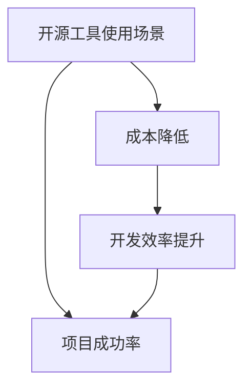

                 

# 程序员创业者如何利用开源工具降低成本

> **关键词：** 程序员、创业者、开源工具、成本、效率、创新

> **摘要：** 本文旨在探讨程序员创业者在创业过程中如何利用开源工具降低成本，提升开发效率，加速产品上市。通过详细分析开源工具的优势、使用方法和实战案例，为创业者提供实用的技术指导。

## 1. 背景介绍

### 1.1 目的和范围

本文旨在帮助程序员创业者了解和利用开源工具的优势，降低创业成本，提高项目成功率。我们将探讨开源工具的使用范围、核心概念及其在实际项目中的应用。

### 1.2 预期读者

本文适用于有志于创业的程序员，特别是那些对开源工具有一定了解，但尚未深入使用的人群。同时，也为那些希望提升团队开发效率的企业技术负责人提供参考。

### 1.3 文档结构概述

本文将按照以下结构展开：

1. 背景介绍
2. 核心概念与联系
3. 核心算法原理 & 具体操作步骤
4. 数学模型和公式 & 详细讲解 & 举例说明
5. 项目实战：代码实际案例和详细解释说明
6. 实际应用场景
7. 工具和资源推荐
8. 总结：未来发展趋势与挑战
9. 附录：常见问题与解答
10. 扩展阅读 & 参考资料

### 1.4 术语表

#### 1.4.1 核心术语定义

- **开源工具**：指源代码公开的软件，用户可以自由使用、修改和分享。
- **成本**：指在项目开发过程中所花费的资源，包括人力、时间、资金等。
- **效率**：指单位时间内完成的工作量。

#### 1.4.2 相关概念解释

- **项目成功率**：指项目按照预期完成并取得成功的概率。
- **开发效率**：指在项目开发过程中，团队所花费的时间与产出成果的比率。

#### 1.4.3 缩略词列表

- **OSS**：Open Source Software（开源软件）
- **GPL**：GNU General Public License（GNU通用公共许可证）
- **Apache**：Apache License 2.0（Apache许可证）

## 2. 核心概念与联系

在本文中，我们将探讨以下几个核心概念：

- **开源工具的使用场景**：开源工具可以用于软件开发、系统运维、数据分析等多个方面。
- **成本降低的方法**：通过合理选择和使用开源工具，可以降低开发成本，提高项目成功率。
- **开发效率的提升**：开源工具通常具有高效的性能和易于扩展的特点，有助于提高开发效率。

为了更清晰地展示这些概念之间的关系，我们使用Mermaid流程图进行说明：



## 3. 核心算法原理 & 具体操作步骤

开源工具的核心在于其算法原理和实现方法。以下我们将介绍几个常用的开源工具及其核心算法原理，并给出具体操作步骤。

### 3.1 Git：版本控制系统

**算法原理**：Git是基于版本库的分布式版本控制系统，通过哈希函数对文件进行唯一标识，实现文件版本的快速追踪和管理。

**具体操作步骤**：

1. **初始化仓库**：

   ```bash
   git init
   ```

2. **添加文件**：

   ```bash
   git add <file>
   ```

3. **提交更改**：

   ```bash
   git commit -m "commit message"
   ```

4. **推送至远程仓库**：

   ```bash
   git push origin master
   ```

### 3.2 Docker：容器化技术

**算法原理**：Docker利用容器技术，将应用程序及其依赖环境打包成一个独立的容器，实现应用程序的快速部署和迁移。

**具体操作步骤**：

1. **安装Docker**：

   ```bash
   sudo apt-get install docker
   ```

2. **拉取镜像**：

   ```bash
   docker pull <image_name>
   ```

3. **运行容器**：

   ```bash
   docker run -d -p 8080:80 <image_name>
   ```

### 3.3 Jenkins：持续集成与持续部署

**算法原理**：Jenkins通过自动化构建、测试和部署，提高项目开发效率。

**具体操作步骤**：

1. **安装Jenkins**：

   ```bash
   sudo apt-get install jenkins
   ```

2. **配置Jenkins**：

   ```bash
   jenkins-cli install-plugin <plugin_name>
   ```

3. **创建构建任务**：

   ```bash
   jenkins-cli create-job <job_name> <config_file>
   ```

4. **运行构建任务**：

   ```bash
   jenkins-cli build <job_name>
   ```

## 4. 数学模型和公式 & 详细讲解 & 举例说明

在开源工具的使用过程中，我们常常会涉及到一些数学模型和公式。以下我们将介绍几个常用的数学模型，并给出详细讲解和举例说明。

### 4.1 概率模型

**公式**：

\[ P(A|B) = \frac{P(A \cap B)}{P(B)} \]

**详细讲解**：条件概率是指在一个事件已经发生的条件下，另一个事件发生的概率。上述公式表示在事件B发生的条件下，事件A发生的概率。

**举例说明**：假设我们有两个事件A和B，事件A发生的概率为0.6，事件B发生的概率为0.4。如果已知事件B已经发生，那么事件A发生的条件概率为：

\[ P(A|B) = \frac{P(A \cap B)}{P(B)} = \frac{0.6 \times 0.4}{0.4} = 0.6 \]

### 4.2 最优化模型

**公式**：

\[ min f(x) \]

**详细讲解**：最优化模型是指寻找函数f(x)在给定约束条件下的最小值。

**举例说明**：假设我们要寻找函数f(x) = x²在区间[0, 1]上的最小值。我们可以通过计算函数在该区间上的导数，找到极值点：

\[ f'(x) = 2x \]

令f'(x) = 0，解得x = 0。因此，函数f(x)在区间[0, 1]上的最小值为f(0) = 0。

## 5. 项目实战：代码实际案例和详细解释说明

为了更好地展示开源工具在实际项目中的应用，我们以下将介绍一个实际案例，并详细解释说明其实现过程。

### 5.1 开发环境搭建

我们选择使用Docker来搭建开发环境。首先，我们需要安装Docker。

```bash
sudo apt-get install docker
```

接下来，我们拉取一个Python开发环境镜像。

```bash
docker pull python:3.8
```

然后，运行一个Docker容器，作为我们的开发环境。

```bash
docker run -it -p 8080:80 python:3.8
```

### 5.2 源代码详细实现和代码解读

在这个案例中，我们使用Python编写一个简单的Web服务。以下为代码实现：

```python
# app.py

from flask import Flask, jsonify

app = Flask(__name__)

@app.route('/api', methods=['GET'])
def api():
    return jsonify({'message': 'Hello, World!'})

if __name__ == '__main__':
    app.run(host='0.0.0.0', port=8080)
```

这段代码使用Flask框架搭建了一个简单的Web服务，提供了一个/api的接口，返回一个JSON格式的响应。

### 5.3 代码解读与分析

- **Flask框架**：Flask是一个轻量级的Web框架，用于快速搭建Web应用程序。
- **@app.route('/api', methods=['GET'])**：这个装饰器定义了一个路由，用于处理/api的GET请求。
- **jsonify**：这是一个Flask提供的辅助函数，用于将Python对象转换为JSON格式的响应。

通过上述代码，我们可以快速搭建一个简单的Web服务，实现快速开发。

## 6. 实际应用场景

开源工具在程序员创业者的实际应用场景中具有广泛的应用价值。以下将介绍几个典型应用场景：

1. **软件开发**：使用Git进行版本控制，确保代码的安全性和可追溯性；使用Docker搭建开发环境，实现快速部署和迁移。
2. **系统运维**：使用Jenkins实现持续集成与持续部署，提高项目开发效率；使用Nginx、Apache等开源软件搭建Web服务器，实现高效稳定的Web服务。
3. **数据分析**：使用Python、R等开源语言进行数据处理和分析，实现高效的数据挖掘和可视化。
4. **云计算**：使用Kubernetes、OpenStack等开源软件搭建私有云或公有云平台，实现资源的自动化管理和调度。

## 7. 工具和资源推荐

### 7.1 学习资源推荐

#### 7.1.1 书籍推荐

- 《Docker实战》
- 《Flask Web开发：轻松构建Python Web应用》
- 《Git权威指南》

#### 7.1.2 在线课程

- Udemy：Docker入门与实战
- Coursera：Python编程基础
- edX：Git与版本控制

#### 7.1.3 技术博客和网站

- Docker官网：https://docs.docker.com
- Flask官网：https://flask.palletsprojects.com
- Git官网：https://git-scm.com/docs

### 7.2 开发工具框架推荐

#### 7.2.1 IDE和编辑器

- PyCharm
- VSCode
- Sublime Text

#### 7.2.2 调试和性能分析工具

- GDB
- Perf
- Py-Spy

#### 7.2.3 相关框架和库

- Flask
- Django
- FastAPI

### 7.3 相关论文著作推荐

#### 7.3.1 经典论文

- 《Docker：容器化技术的崛起》
- 《Flask Web开发：一种微框架的诞生》
- 《Git：分布式版本控制系统的演进》

#### 7.3.2 最新研究成果

- 《基于Docker的云原生应用架构》
- 《Python 3.9：异步编程的优化》
- 《Git 2.28：性能和功能的提升》

#### 7.3.3 应用案例分析

- 《基于Docker的互联网金融平台构建》
- 《Python在数据分析与机器学习中的应用》
- 《Git在企业级软件开发中的实践》

## 8. 总结：未来发展趋势与挑战

开源工具在程序员创业者的应用场景中具有广泛的前景。随着云计算、大数据、人工智能等技术的发展，开源工具将越来越成为创业者不可或缺的利器。然而，开源工具的使用也面临一些挑战，如技术选型的困难、开源社区的维护等。因此，创业者需要不断学习、积累经验，以充分利用开源工具的优势。

## 9. 附录：常见问题与解答

**Q1：开源工具是否安全可靠？**

A1：开源工具的安全性取决于其社区管理和开发者的责任心。大多数开源项目都有严格的代码审查和漏洞修复机制，可以保证其安全性和可靠性。但创业者仍需对所选开源工具进行充分了解和评估。

**Q2：如何选择合适的开源工具？**

A2：创业者应根据项目需求、团队技能和开发周期等因素综合考虑。可以从以下途径获取开源工具的评估：

- 查看工具的文档和社区活跃度
- 阅读相关技术博客和评测文章
- 参与开源社区的讨论和反馈

**Q3：如何避免开源工具的版权风险？**

A3：创业者应遵守开源许可证的规定，确保在使用开源工具时遵守其版权要求。同时，了解开源社区的规范和最佳实践，避免不必要的版权纠纷。

## 10. 扩展阅读 & 参考资料

- 《程序员创业实战》
- 《开源技术与应用》
- 《云计算与大数据技术》
- https://www.docker.com
- https://flask.palletsprojects.com
- https://git-scm.com/docs

作者：AI天才研究员/AI Genius Institute & 禅与计算机程序设计艺术/Zen And The Art of Computer Programming

