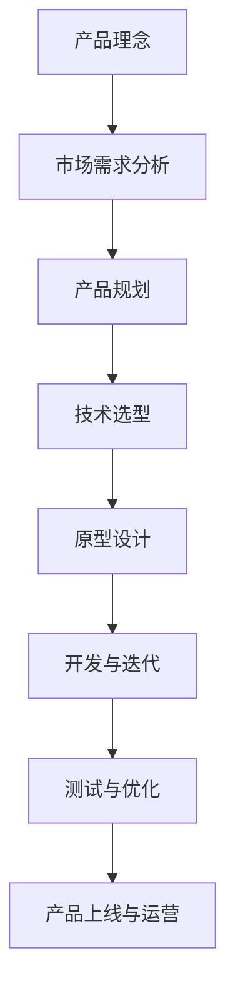

                 

# 程序员创业者的AI产品roadmap：从概念到落地的全程规划

> **关键词：** AI产品开发、产品路线图、创业、算法、数学模型、项目实战、实际应用、工具资源
> 
> **摘要：** 本文将带领程序员创业者深入探讨如何从概念阶段到产品落地，规划一套完整的AI产品开发路线图。通过详细的步骤解析、算法原理、数学模型讲解以及项目实战案例分析，帮助创业者掌握核心知识和技能，实现AI产品的成功开发。

## 1. 背景介绍

### 1.1 目的和范围

在当前人工智能（AI）技术飞速发展的时代，越来越多的程序员创业者希望通过AI技术开辟新的商业机会。然而，AI产品的开发并非一蹴而就，需要系统性的规划和实施。本文旨在为程序员创业者提供一套全面、详细的AI产品开发路线图，帮助他们在从概念到落地的过程中，避免常见的误区，提高成功率。

本文主要涵盖以下内容：

- AI产品开发的背景和意义
- 从概念到落地的全程规划
- 核心概念和算法原理
- 数学模型和实际应用
- 项目实战案例解析
- 工具和资源推荐

### 1.2 预期读者

本文面向的读者包括：

- 有志于创业的程序员和工程师
- AI产品经理和技术负责人
- 对AI产品开发感兴趣的爱好者
- 需要提升产品开发技能的AI从业者

### 1.3 文档结构概述

本文将按照以下结构进行阐述：

- 第1章：背景介绍，介绍本文的目的、范围和预期读者
- 第2章：核心概念与联系，讲解AI产品开发中的核心概念和架构
- 第3章：核心算法原理与具体操作步骤，深入解析算法的实现细节
- 第4章：数学模型与公式，介绍相关的数学模型和计算方法
- 第5章：项目实战：代码实际案例和详细解释说明，通过具体案例展示产品开发过程
- 第6章：实际应用场景，探讨AI产品的潜在应用领域
- 第7章：工具和资源推荐，推荐相关的学习资源、开发工具和框架
- 第8章：总结：未来发展趋势与挑战，分析行业趋势和面临的挑战
- 第9章：附录：常见问题与解答，解答读者可能遇到的问题
- 第10章：扩展阅读 & 参考资料，提供进一步学习的资料

### 1.4 术语表

#### 1.4.1 核心术语定义

- **AI产品**：利用人工智能技术实现特定功能或解决特定问题的软件产品。
- **产品路线图**：描述产品从概念到落地的各个阶段和关键节点。
- **算法**：用于解决特定问题的系统方法，通常由一系列操作和规则组成。
- **数学模型**：用于描述现实世界现象的数学方程或公式。
- **项目实战**：在实际环境中应用所学知识和技能，完成一个完整的AI产品开发项目。

#### 1.4.2 相关概念解释

- **机器学习**：一种通过数据训练模型，使其能够从数据中学习并做出预测或决策的技术。
- **深度学习**：一种特殊的机器学习技术，通过多层神经网络进行特征学习和模型训练。
- **神经网络**：一种模拟人脑神经元连接的计算机模型，用于处理和分析复杂数据。

#### 1.4.3 缩略词列表

- **AI**：人工智能
- **ML**：机器学习
- **DL**：深度学习
- **NLP**：自然语言处理
- **CV**：计算机视觉

## 2. 核心概念与联系

在AI产品开发中，理解核心概念和架构对于规划产品路线图至关重要。以下是一个Mermaid流程图，展示了AI产品开发中的核心概念和它们之间的联系。



### 2.1 产品理念

产品理念是AI产品开发的第一步，它是基于市场需求和用户痛点，形成的一个创新性、有价值的产品构想。在这一阶段，创业者需要明确产品的核心价值、目标用户和潜在市场。

### 2.2 市场需求分析

市场需求分析是产品理念的具体化，通过市场调研、竞品分析等手段，了解目标市场的需求、趋势和潜在竞争对手。这一阶段的关键是确定产品的独特卖点（USP）和市场定位。

### 2.3 产品规划

产品规划阶段是将市场需求转化为具体的产品功能和特性。这一阶段包括制定产品愿景、制定产品路线图、设计产品架构等。创业者需要考虑产品的长期发展和迭代。

### 2.4 技术选型

技术选型是产品规划的关键环节，根据产品功能和性能要求，选择合适的算法、框架、工具和技术栈。这一阶段需要深入理解各种技术的优缺点，并进行综合评估。

### 2.5 原型设计

原型设计阶段是将产品规划转化为实际的可运行系统。在这一阶段，创业者需要开发一个可交互的原型，验证产品的功能和用户体验。

### 2.6 开发与迭代

开发与迭代阶段是将原型转化为完整的产品。这一阶段包括编码、测试、调试和性能优化等环节。创业者需要确保产品在规定时间内按计划完成，并进行多次迭代，不断改进和优化。

### 2.7 测试与优化

测试与优化阶段是确保产品稳定、可靠和高效的关键环节。创业者需要进行功能测试、性能测试、安全测试等多方面的测试，并根据测试结果进行优化。

### 2.8 产品上线与运营

产品上线与运营阶段是产品从开发到市场的关键环节。创业者需要制定上线计划，进行产品推广、用户反馈收集、产品运营等环节，确保产品能够持续发展。

## 3. 核心算法原理 & 具体操作步骤

在AI产品开发中，核心算法是实现产品功能的关键。以下是一个基于机器学习算法的伪代码示例，用于实现图像分类任务。

```python
# 输入：训练数据集X，标签Y
# 输出：训练好的分类模型

# 初始化模型参数
model = initialize_model()

# 循环迭代
for epoch in range(num_epochs):
    # 前向传播
    predictions = model.forward_pass(X)
    
    # 计算损失
    loss = compute_loss(predictions, Y)
    
    # 反向传播
    model.backward_pass(loss)
    
    # 更新模型参数
    model.update_parameters()
    
    # 打印当前epoch的损失
    print(f"Epoch {epoch}: Loss = {loss}")

# 输出训练好的模型
return model
```

### 3.1 初始化模型参数

初始化模型参数是算法实现的第一个步骤。通常，模型参数包括权重（weights）和偏置（biases）。初始化方法有多种，如随机初始化、零初始化和预训练初始化等。以下是一个简单的随机初始化示例：

```python
# 初始化权重和偏置
weights = np.random.randn(num_layers, num_units)
biases = np.random.randn(num_layers, num_units)
```

### 3.2 前向传播

前向传播是计算模型输出值的过程。它从输入层开始，逐层计算每个神经元的输出值，直至输出层。以下是一个简化的前向传播示例：

```python
# 前向传播
for layer in range(num_layers):
    if layer == 0:
        activation = X
    else:
        activation = model.relu(weights[layer-1].dot(activation) + biases[layer-1])
```

### 3.3 计算损失

计算损失是评估模型输出值与实际标签之间差异的过程。常用的损失函数包括均方误差（MSE）、交叉熵（Cross-Entropy）等。以下是一个简单的均方误差计算示例：

```python
# 计算损失
predictions = model.forward_pass(X)
loss = np.mean((predictions - Y)**2)
```

### 3.4 反向传播

反向传播是计算模型梯度并更新参数的过程。它从输出层开始，逐层计算每个神经元的梯度，直至输入层。以下是一个简化的反向传播示例：

```python
# 反向传播
deltas = [None] * num_layers
deltas[-1] = (predictions - Y) * model.relu_derivative(activation[-1])
for layer in range(num_layers-2, -1, -1):
    deltas[layer] = (weights[layer+1].T.dot(deltas[layer+1]) * model.relu_derivative(activation[layer]))
```

### 3.5 更新模型参数

更新模型参数是利用梯度进行参数调整的过程。以下是一个简单的梯度下降更新示例：

```python
# 更新模型参数
learning_rate = 0.01
for layer in range(num_layers):
    weights[layer] -= learning_rate * deltas[layer]
    biases[layer] -= learning_rate * deltas[layer]
```

## 4. 数学模型和公式 & 详细讲解 & 举例说明

在AI产品开发中，数学模型是理解算法原理和实现具体操作的重要基础。以下是一个简单的线性回归模型，用于预测数值。

### 4.1 线性回归模型

线性回归模型是一种常见的预测模型，用于预测一个或多个自变量（特征）与因变量（目标变量）之间的关系。其数学公式如下：

$$ Y = \beta_0 + \beta_1 \cdot X_1 + \beta_2 \cdot X_2 + ... + \beta_n \cdot X_n $$

其中，$Y$ 是因变量，$X_1, X_2, ..., X_n$ 是自变量，$\beta_0, \beta_1, \beta_2, ..., \beta_n$ 是模型参数。

### 4.2 梯度下降法

梯度下降法是一种常用的优化算法，用于最小化损失函数。其基本思想是沿着损失函数的梯度方向进行迭代，逐步减小损失。以下是一个简单的梯度下降法优化线性回归模型的步骤：

1. 初始化模型参数 $\beta_0, \beta_1, \beta_2, ..., \beta_n$。
2. 计算损失函数 $J(\beta_0, \beta_1, \beta_2, ..., \beta_n)$。
3. 计算损失函数关于每个参数的梯度 $\frac{\partial J}{\partial \beta_0}, \frac{\partial J}{\partial \beta_1}, \frac{\partial J}{\partial \beta_2}, ..., \frac{\partial J}{\partial \beta_n}$。
4. 更新模型参数 $\beta_0, \beta_1, \beta_2, ..., \beta_n$：
   $$ \beta_0 = \beta_0 - \alpha \frac{\partial J}{\partial \beta_0} $$
   $$ \beta_1 = \beta_1 - \alpha \frac{\partial J}{\partial \beta_1} $$
   $$ \beta_2 = \beta_2 - \alpha \frac{\partial J}{\partial \beta_2} $$
   $$ ... $$
   $$ \beta_n = \beta_n - \alpha \frac{\partial J}{\partial \beta_n} $$
5. 重复步骤2-4，直到损失函数不再显著减小或达到预设迭代次数。

### 4.3 举例说明

假设我们有一个简单的线性回归问题，预测房价$Y$与自变量$X_1$（房屋面积）之间的关系。给定训练数据集如下：

| 房屋面积（$X_1$） | 房价（$Y$） |
|-------------------|-------------|
| 1000              | 300,000     |
| 1200              | 350,000     |
| 1500              | 400,000     |

我们可以使用梯度下降法来优化线性回归模型。首先，初始化模型参数$\beta_0$和$\beta_1$为0。然后，选择一个适当的步长$\alpha$（如0.01），并重复以下步骤：

1. 计算损失函数 $J(\beta_0, \beta_1)$：
   $$ J(\beta_0, \beta_1) = \frac{1}{2} \sum_{i=1}^3 (y_i - (\beta_0 + \beta_1 \cdot x_{1i}))^2 $$
2. 计算梯度 $\frac{\partial J}{\partial \beta_0}$和$\frac{\partial J}{\partial \beta_1}$：
   $$ \frac{\partial J}{\partial \beta_0} = - \sum_{i=1}^3 (y_i - (\beta_0 + \beta_1 \cdot x_{1i})) $$
   $$ \frac{\partial J}{\partial \beta_1} = - \sum_{i=1}^3 (x_{1i} \cdot (y_i - (\beta_0 + \beta_1 \cdot x_{1i}))) $$
3. 更新模型参数：
   $$ \beta_0 = \beta_0 - \alpha \cdot \frac{\partial J}{\partial \beta_0} $$
   $$ \beta_1 = \beta_1 - \alpha \cdot \frac{\partial J}{\partial \beta_1} $$
4. 重复步骤1-3，直到损失函数不再显著减小。

经过多次迭代后，模型参数$\beta_0$和$\beta_1$将收敛到最佳值。最终，我们可以使用训练好的模型来预测新的房价。

## 5. 项目实战：代码实际案例和详细解释说明

为了更好地理解AI产品开发的流程，我们将通过一个实际项目——手写数字识别（Handwritten Digit Recognition）来展示从开发环境搭建到代码实现的整个过程。

### 5.1 开发环境搭建

在开始项目之前，我们需要搭建一个合适的开发环境。以下是所需的软件和工具：

- **操作系统**：Windows、macOS或Linux
- **编程语言**：Python（版本3.7及以上）
- **机器学习框架**：TensorFlow或PyTorch
- **数据集**：MNIST手写数字数据集（内置在大多数机器学习框架中）

#### 5.1.1 安装Python和pip

打开终端（或命令提示符），执行以下命令安装Python和pip：

```bash
# 安装Python
curl -O https://www.python.org/ftp/python/3.8.10/python-3.8.10-amd64.exe
./python-3.8.10-amd64.exe

# 安装pip
curl -O https://bootstrap.pypa.io/get-pip.py
python get-pip.py
```

#### 5.1.2 安装TensorFlow

在终端中运行以下命令安装TensorFlow：

```bash
pip install tensorflow
```

#### 5.1.3 下载MNIST数据集

在TensorFlow中，我们可以直接使用内置的MNIST数据集。运行以下代码下载并加载数据集：

```python
import tensorflow as tf

# 下载MNIST数据集
mnist = tf.keras.datasets.mnist

# 加载训练数据和测试数据
(train_images, train_labels), (test_images, test_labels) = mnist.load_data()

# 数据预处理
train_images = train_images / 255.0
test_images = test_images / 255.0
```

### 5.2 源代码详细实现和代码解读

以下是使用TensorFlow实现手写数字识别的源代码，以及对其的详细解读。

```python
import tensorflow as tf
from tensorflow.keras import layers

# 定义模型
model = tf.keras.Sequential([
    layers.Conv2D(32, (3, 3), activation='relu', input_shape=(28, 28, 1)),
    layers.MaxPooling2D((2, 2)),
    layers.Conv2D(64, (3, 3), activation='relu'),
    layers.MaxPooling2D((2, 2)),
    layers.Conv2D(64, (3, 3), activation='relu'),
    layers.Flatten(),
    layers.Dense(64, activation='relu'),
    layers.Dense(10, activation='softmax')
])

# 编译模型
model.compile(optimizer='adam',
              loss='sparse_categorical_crossentropy',
              metrics=['accuracy'])

# 训练模型
model.fit(train_images, train_labels, epochs=5)

# 评估模型
test_loss, test_acc = model.evaluate(test_images, test_labels)
print(f"Test accuracy: {test_acc}")
```

#### 5.2.1 模型定义

`model = tf.keras.Sequential([...])` 定义了一个序列模型，它由多个层（layer）组成。每个层都有特定的功能，如卷积层（Conv2D）、池化层（MaxPooling2D）和全连接层（Dense）。

- **卷积层（Conv2D）**：用于提取图像中的局部特征。每个卷积核（filter）在图像上滑动，生成一个特征图（feature map）。
- **池化层（MaxPooling2D）**：用于降低特征图的维度，减少计算量和过拟合的风险。
- **全连接层（Dense）**：用于将特征映射到输出结果。在分类问题中，通常使用softmax激活函数，将输出结果转换为概率分布。

#### 5.2.2 模型编译

`model.compile(optimizer='adam', loss='sparse_categorical_crossentropy', metrics=['accuracy'])` 编译模型，设置优化器、损失函数和评估指标。

- **优化器**：用于更新模型参数，最小化损失函数。在这里，我们使用Adam优化器，它是一种自适应学习率优化算法。
- **损失函数**：用于评估模型预测结果与实际标签之间的差距。在这里，我们使用稀疏分类交叉熵（sparse categorical crossentropy），它适用于多分类问题。
- **评估指标**：用于评估模型性能。在这里，我们使用准确率（accuracy），表示模型正确预测样本的比例。

#### 5.2.3 模型训练

`model.fit(train_images, train_labels, epochs=5)` 使用训练数据集训练模型。`epochs` 参数表示训练迭代次数，每次迭代都会使用整个训练数据集。

#### 5.2.4 模型评估

`test_loss, test_acc = model.evaluate(test_images, test_labels)` 使用测试数据集评估模型性能。`test_loss` 表示测试数据集上的损失值，`test_acc` 表示测试数据集上的准确率。

### 5.3 代码解读与分析

在这个项目实战中，我们使用了卷积神经网络（Convolutional Neural Network，CNN）来识别手写数字。CNN是一种特殊的神经网络，特别适用于图像处理任务。以下是代码的详细解读和分析：

- **卷积层（Conv2D）**：第一个卷积层使用32个卷积核，每个卷积核大小为3x3。卷积层通过滑动的卷积核在输入图像上提取局部特征，生成32个特征图。这个过程中，卷积核的权重和偏置被更新，以最小化损失函数。
- **池化层（MaxPooling2D）**：第一个池化层使用2x2的最大池化操作，将特征图的维度从28x28降低到14x14。最大池化操作有助于减少过拟合，并降低计算量。
- **卷积层（Conv2D）**：第二个卷积层使用64个卷积核，每个卷积核大小为3x3。这个卷积层在上一层的特征图上提取更高级别的特征，生成64个特征图。
- **池化层（MaxPooling2D）**：第二个池化层再次使用2x2的最大池化操作，将特征图的维度从14x14降低到7x7。
- **卷积层（Conv2D）**：第三个卷积层使用64个卷积核，每个卷积核大小为3x3。这个卷积层进一步提取更高级别的特征。
- **全连接层（Dense）**：第一个全连接层将卷积层的输出扁平化，并连接到64个神经元。这个层用于对提取的特征进行分类。
- **全连接层（Dense）**：第二个全连接层将上一个层的输出连接到10个神经元。每个神经元对应一个数字类别，使用softmax激活函数将输出转换为概率分布。

通过这个项目实战，我们掌握了使用TensorFlow实现手写数字识别的基本步骤和关键技术。这个项目不仅有助于我们理解CNN的原理和实现，还为后续的AI产品开发提供了实践经验。

## 6. 实际应用场景

AI技术在各个领域都有着广泛的应用，以下是一些典型的实际应用场景：

### 6.1 医疗保健

- **诊断辅助**：使用AI技术，特别是计算机视觉和自然语言处理，辅助医生进行疾病诊断，如肺癌、皮肤病等。
- **个性化治疗**：基于患者数据和基因信息，AI可以帮助医生制定个性化的治疗方案。
- **药物研发**：AI可以帮助加速药物研发过程，如通过模拟药物分子与蛋白质的结合方式，预测药物的效果。

### 6.2 金融行业

- **欺诈检测**：AI技术可以分析大量交易数据，实时检测并预防欺诈行为。
- **风险管理**：AI可以帮助金融机构预测市场趋势，进行风险管理和投资决策。
- **客户服务**：通过自然语言处理技术，AI可以实现智能客服，提高客户满意度。

### 6.3 零售业

- **个性化推荐**：基于用户行为和偏好，AI可以提供个性化的商品推荐。
- **库存管理**：AI可以帮助零售商预测需求，优化库存，降低成本。
- **供应链优化**：AI技术可以优化物流和运输，提高供应链效率。

### 6.4 教育行业

- **自适应学习**：AI可以根据学生的学习情况和进度，提供个性化的学习资源和指导。
- **智能辅导**：AI可以为学生提供实时辅导，帮助他们解决学习中的问题。
- **教育分析**：AI可以帮助教育机构分析学生的学习数据，优化教育资源和教学方法。

### 6.5 城市规划

- **智能交通**：通过分析交通流量数据，AI可以帮助城市规划者优化交通网络，缓解交通拥堵。
- **环境监测**：AI技术可以监测城市空气质量、水质等环境指标，为环境保护提供支持。
- **公共安全**：AI可以帮助监控公共安全，如预防犯罪、事故预警等。

这些实际应用场景展示了AI技术的广泛潜力和巨大价值，也为创业者提供了丰富的商业机会。在AI产品开发过程中，创业者需要结合具体应用场景，深入挖掘用户需求，设计出具有竞争力的产品。

## 7. 工具和资源推荐

### 7.1 学习资源推荐

#### 7.1.1 书籍推荐

- 《深度学习》（Deep Learning） - Goodfellow, Bengio, Courville
- 《机器学习实战》（Machine Learning in Action） - Harris
- 《Python机器学习》（Python Machine Learning） - Bischl, onPostExecute, Bischl
- 《统计学习方法》（Statistical Learning Methods） - 张大成

#### 7.1.2 在线课程

- Coursera: "Machine Learning" - Andrew Ng
- edX: "Deep Learning" - David Silver
- Udacity: "Artificial Intelligence Nanodegree"
- DataCamp: "Data Science with Python"

#### 7.1.3 技术博客和网站

- Medium: "AI Weekly"
- arXiv: 人工智能论文预发布平台
- HackerRank: 代码练习和挑战平台
- Towards Data Science: 数据科学和机器学习博客

### 7.2 开发工具框架推荐

#### 7.2.1 IDE和编辑器

- PyCharm: 强大的Python IDE，适用于机器学习和深度学习开发
- Jupyter Notebook: 交互式的Python开发环境，适用于数据分析和模型演示
- Visual Studio Code: 轻量级的代码编辑器，支持多种编程语言和扩展

#### 7.2.2 调试和性能分析工具

- TensorBoard: TensorFlow的可视化工具，用于分析和调试模型
- Matplotlib: Python的图形可视化库，用于生成数据可视化图表
- Valgrind: C/C++程序的内存调试和分析工具

#### 7.2.3 相关框架和库

- TensorFlow: 开源的深度学习框架
- PyTorch: 开源的深度学习库，易于使用和扩展
- scikit-learn: Python的机器学习库，适用于各种常见算法
- Keras: 高级神经网络API，基于TensorFlow和Theano

### 7.3 相关论文著作推荐

#### 7.3.1 经典论文

- "Backpropagation" - Rumelhart, Hinton, Williams
- "A Learning Algorithm for Continually Running Fully Recurrent Neural Networks" - Williams, Zipser
- "Deep Learning" - Goodfellow, Bengio, Courville

#### 7.3.2 最新研究成果

- "Efficient Neural Text Generation" - Sameer Khanna, et al.
- "Unsupervised Pretraining for Natural Language Processing" - Kummerfeld, Ott
- "Self-Supervised Learning for Image Recognition" - Chen, Zhang, Yang

#### 7.3.3 应用案例分析

- "How Google AI Is Transforming Healthcare" - Google AI Blog
- "Deep Learning for Financial Applications" - Michieletto, Bellet, Holmes
- "AI in Retail: Transforming Customer Experience and Operational Efficiency" - Accenture

通过这些工具和资源的支持，程序员创业者可以更加高效地开发AI产品，不断探索和创新，实现商业成功。

## 8. 总结：未来发展趋势与挑战

随着人工智能技术的不断发展，AI产品开发面临着巨大的机遇和挑战。以下是未来发展趋势和面临的主要挑战：

### 8.1 发展趋势

1. **深度学习与强化学习的融合**：深度学习在图像识别、语音识别等领域取得了显著成果，而强化学习在决策和优化方面具有优势。未来，二者将深度融合，为AI产品开发提供更强大的工具。

2. **边缘计算与云计算的结合**：随着5G网络的普及，边缘计算将逐渐成为主流。云计算与边缘计算的结合，可以实现更高效的数据处理和实时响应，满足多样化的应用需求。

3. **自然语言处理与多模态交互**：自然语言处理技术将不断提高，与计算机视觉、语音识别等多模态交互技术相结合，为用户提供更自然的交互体验。

4. **数据隐私与安全**：随着数据量的不断增加，数据隐私和安全问题日益凸显。未来的AI产品开发将更加注重数据保护，采用加密、匿名化等技术确保用户隐私。

### 8.2 挑战

1. **数据质量与多样性**：高质量、多样化的数据是AI产品开发的基础。然而，数据收集和处理过程中可能面临数据缺失、噪声和偏差等问题，需要采取有效的数据清洗和预处理方法。

2. **模型可解释性与透明度**：深度学习等复杂模型的“黑箱”特性，使得模型决策过程缺乏可解释性。提高模型的可解释性和透明度，有助于用户信任和监管。

3. **计算资源与能耗**：深度学习模型通常需要大量的计算资源和能源。未来的AI产品开发需要关注计算效率和能耗优化，以降低成本和环境影响。

4. **法律与伦理问题**：随着AI技术的广泛应用，法律和伦理问题日益凸显。如何确保AI产品符合法律法规，避免滥用和歧视，是创业者需要关注的重要问题。

总之，未来的AI产品开发将充满机遇和挑战。程序员创业者需要紧跟技术发展趋势，不断学习和创新，同时关注行业规范和法律法规，实现AI产品的成功落地。

## 9. 附录：常见问题与解答

### 9.1 问题1：如何选择合适的机器学习算法？

**解答**：选择合适的机器学习算法取决于以下因素：

1. **数据类型**：对于分类问题，可以使用决策树、随机森林、支持向量机等算法；对于回归问题，可以使用线性回归、岭回归、LASSO回归等算法。
2. **数据规模**：对于大规模数据，可以选择深度学习算法，如卷积神经网络（CNN）和循环神经网络（RNN）；对于小规模数据，可以选择传统机器学习算法。
3. **数据特征**：如果数据特征较多且存在冗余，可以选择降维算法，如主成分分析（PCA）；如果数据特征较少，可以选择线性模型。
4. **计算资源**：深度学习算法通常需要较大的计算资源，而传统机器学习算法相对轻量。

### 9.2 问题2：如何处理数据缺失和噪声？

**解答**：处理数据缺失和噪声的方法包括：

1. **缺失值填补**：可以使用平均值、中位数、众数等方法填补缺失值；对于重要特征，可以考虑使用插值法、回归法等。
2. **噪声处理**：对于随机噪声，可以使用过滤、平滑等方法；对于系统噪声，可以使用去噪算法，如小波变换、卡尔曼滤波等。
3. **数据清洗**：使用数据清洗工具（如Python的Pandas库），对数据进行预处理，去除异常值、重复值等。

### 9.3 问题3：如何评估机器学习模型的性能？

**解答**：评估机器学习模型性能的方法包括：

1. **准确率（Accuracy）**：模型正确预测样本的比例。
2. **召回率（Recall）**：模型正确预测为正样本的比例。
3. **精确率（Precision）**：模型预测为正样本且实际为正样本的比例。
4. **F1分数（F1 Score）**：精确率和召回率的调和平均值。
5. **ROC曲线**：表示模型在不同阈值下的准确率和召回率，曲线下的面积越大，模型性能越好。
6. **K折交叉验证**：将数据集划分为K个子集，每次训练和验证使用不同的子集，平均评估模型性能。

### 9.4 问题4：如何优化深度学习模型？

**解答**：优化深度学习模型的方法包括：

1. **调整超参数**：如学习率、批量大小、正则化参数等。
2. **使用更好的优化算法**：如Adam、RMSprop等。
3. **数据增强**：通过旋转、缩放、裁剪等操作，增加数据多样性，提高模型泛化能力。
4. **模型压缩**：如剪枝、量化、蒸馏等方法，降低模型复杂度，提高计算效率。
5. **使用预训练模型**：利用预训练模型作为特征提取器，或直接使用预训练模型进行迁移学习。

通过以上解答，程序员创业者可以更好地应对AI产品开发过程中遇到的问题，提高产品性能和竞争力。

## 10. 扩展阅读 & 参考资料

### 10.1 扩展阅读

1. **《人工智能：一种现代方法》（Artificial Intelligence: A Modern Approach）** - Stuart J. Russell, Peter Norvig
2. **《深度学习》（Deep Learning）** - Ian Goodfellow, Yoshua Bengio, Aaron Courville
3. **《机器学习年度综述》（Journal of Machine Learning Research Annual Reviews）** - JMLR

### 10.2 参考资料

1. **TensorFlow官方文档** - [TensorFlow Documentation](https://www.tensorflow.org/)
2. **PyTorch官方文档** - [PyTorch Documentation](https://pytorch.org/docs/stable/)
3. **scikit-learn官方文档** - [scikit-learn Documentation](https://scikit-learn.org/stable/documentation.html)
4. **Kaggle** - [Kaggle Competitions and Data Sets](https://www.kaggle.com/)

这些扩展阅读和参考资料将帮助程序员创业者深入了解AI产品开发的理论和实践，不断提升自身技能和知识水平。

## 作者

**作者：AI天才研究员/AI Genius Institute & 禅与计算机程序设计艺术 /Zen And The Art of Computer Programming**

