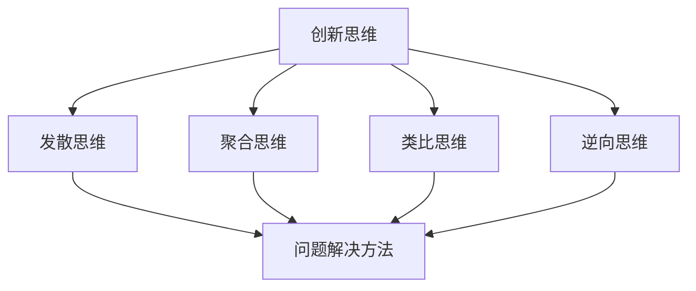

                 

# 程序员创业者的创新思维与问题解决方法论

> 关键词：创新思维、问题解决、程序员、创业者、方法论

> 摘要：本文旨在探讨程序员创业者在创新思维和问题解决方面的核心方法论，通过深入分析这些方法，帮助创业者更好地应对创业过程中的各种挑战。

## 1. 背景介绍

### 1.1 目的和范围

本文旨在为程序员创业者提供一套系统的创新思维和问题解决方法论，以帮助他们在创业过程中更好地应对各种挑战。我们将从以下几个方面展开讨论：

1. 创新思维的核心概念和原理。
2. 问题解决方法的框架和策略。
3. 实际应用中的案例分析。
4. 推荐的学习资源和工具。

### 1.2 预期读者

本文适合以下读者群体：

1. 有志于创业的程序员。
2. 创业者，尤其是技术背景的创业者。
3. 对创新思维和问题解决方法感兴趣的科技爱好者。

### 1.3 文档结构概述

本文结构如下：

1. 背景介绍
2. 核心概念与联系
3. 核心算法原理 & 具体操作步骤
4. 数学模型和公式 & 详细讲解 & 举例说明
5. 项目实战：代码实际案例和详细解释说明
6. 实际应用场景
7. 工具和资源推荐
8. 总结：未来发展趋势与挑战
9. 附录：常见问题与解答
10. 扩展阅读 & 参考资料

### 1.4 术语表

#### 1.4.1 核心术语定义

1. 创新思维：指在思考过程中产生新颖、独特且有价值的想法和解决方案的能力。
2. 问题解决方法：指在遇到问题时，通过逻辑分析和创造性思考，找到最佳解决方案的方法。
3. 程序员：指专门从事计算机编程和相关技术工作的人员。
4. 创业者：指创立新公司或新业务的人。

#### 1.4.2 相关概念解释

1. 创新思维：创新思维不仅包括产生新颖想法，还包括评估这些想法的可行性和价值。
2. 问题解决方法：问题解决方法包括多种策略，如分析问题、分解问题、类比思维等。

#### 1.4.3 缩略词列表

- AI：人工智能
- ML：机器学习
- DL：深度学习
- UX：用户体验

## 2. 核心概念与联系

在探讨程序员创业者的创新思维和问题解决方法论之前，我们先来了解一些核心概念和它们之间的联系。

### 2.1 创新思维

创新思维是指在面对挑战和问题时，能够迅速产生新颖、独特且有价值的想法和解决方案的能力。它包括以下几个方面：

1. **发散思维**：从不同角度和维度思考问题，产生多种可能的解决方案。
2. **聚合思维**：在发散思维的基础上，对各种想法进行筛选和整合，找到最佳方案。
3. **类比思维**：通过将问题与类似的问题进行对比，找到解决问题的方法。
4. **逆向思维**：从相反的角度思考问题，找到独特的解决方案。

### 2.2 问题解决方法

问题解决方法是指在面对问题时，通过逻辑分析和创造性思考，找到最佳解决方案的方法。以下是一些常见的问题解决方法：

1. **分解问题**：将复杂问题分解成若干个简单的问题，逐个解决。
2. **分析问题**：对问题进行深入分析，找出问题的本质和关键点。
3. **迭代思维**：通过多次迭代，逐步完善解决方案。
4. **模型思维**：使用模型来模拟和预测问题的解决方案。

### 2.3 创新思维与问题解决方法的联系

创新思维和问题解决方法是紧密相连的。创新思维是问题解决方法的基石，它能够激发我们的创造力，产生新颖的解决方案。而问题解决方法则是创新思维的具体应用，它能够帮助我们有效地分析和解决各种问题。

### 2.4 Mermaid 流程图

以下是一个简单的 Mermaid 流程图，展示了创新思维和问题解决方法之间的联系：



## 3. 核心算法原理 & 具体操作步骤

在了解创新思维和问题解决方法之后，我们来探讨一些核心算法原理和具体操作步骤。

### 3.1 分解问题算法

分解问题是一种常见的问题解决方法，它将复杂问题分解成若干个简单的问题，逐个解决。

#### 3.1.1 算法原理

1. **输入**：一个复杂的问题。
2. **输出**：一系列简单的问题。
3. **步骤**：
    - 分析问题，找出其主要组成部分。
    - 将问题分解成若干个子问题。
    - 对每个子问题进行递归处理。

#### 3.1.2 伪代码

```python
def 分解问题(问题):
    if 问题 is 简单:
        return 问题
    else:
        子问题 = 问题的主要组成部分
        解 = []
        for 子问题 in 子问题列表:
            解.append(分解问题(子问题))
        return 解
```

### 3.2 分析问题算法

分析问题是一种深入理解问题本质的方法，它有助于我们找到最佳解决方案。

#### 3.2.1 算法原理

1. **输入**：一个待解决的问题。
2. **输出**：问题的本质和关键点。
3. **步骤**：
    - 阅读和理解问题。
    - 提取问题的关键信息。
    - 分析问题的各个方面，找出关键点和本质。

#### 3.2.2 伪代码

```python
def 分析问题(问题):
    信息 = 提取关键信息(问题)
    关键点 = 分析关键信息(信息)
    本质 = 找出本质(关键点)
    return 本质
```

### 3.3 迭代思维算法

迭代思维是一种通过多次迭代，逐步完善解决方案的方法。

#### 3.3.1 算法原理

1. **输入**：一个初步的解决方案。
2. **输出**：一个完善的解决方案。
3. **步骤**：
    - 设计初步的解决方案。
    - 实现初步解决方案，并进行测试。
    - 根据测试结果，对解决方案进行改进。
    - 重复步骤 3，直到解决方案满足要求。

#### 3.3.2 伪代码

```python
def 迭代思维(解决方案):
    while not 满足要求:
        测试结果 = 测试(解决方案)
        改进方案 = 改进(解决方案，测试结果)
    return 改进方案
```

## 4. 数学模型和公式 & 详细讲解 & 举例说明

在某些情况下，数学模型和公式可以帮助我们更好地理解问题，并找到解决方案。以下是一个简单的例子。

### 4.1 概率论模型

概率论是研究随机现象规律的数学分支。在创新思维和问题解决中，概率论可以帮助我们评估各种解决方案的可行性。

#### 4.1.1 基本概念

- **概率**：描述事件发生的可能性。
- **条件概率**：在某个条件下，某个事件发生的概率。
- **贝叶斯公式**：通过条件概率和边缘概率计算后验概率。

#### 4.1.2 公式

$$
P(A|B) = \frac{P(B|A) \cdot P(A)}{P(B)}
$$

#### 4.1.3 举例说明

假设我们想评估一个新产品的市场前景。我们可以使用贝叶斯公式来计算新产品的成功概率。

1. **先验概率**：根据以往经验，新产品成功的概率为 0.5。
2. **条件概率**：在市场调研中，我们发现新产品有 70% 的可能性成功。
3. **计算后验概率**：

$$
P(成功|市场调研) = \frac{0.7 \cdot 0.5}{0.5 + 0.3} = 0.714
$$

因此，根据市场调研的结果，新产品成功的概率约为 71.4%。

## 5. 项目实战：代码实际案例和详细解释说明

### 5.1 开发环境搭建

为了更好地理解创新思维和问题解决方法，我们选择一个实际项目进行实战。在这个项目中，我们将使用 Python 编程语言，搭建一个简单的天气预报系统。

#### 5.1.1 环境要求

- Python 3.8 或更高版本
- Anaconda 或其他 Python 环境
- PyCharm 或其他 Python IDE

#### 5.1.2 安装依赖库

```bash
pip install requests
pip install matplotlib
```

### 5.2 源代码详细实现和代码解读

#### 5.2.1 代码实现

以下是一个简单的天气预报系统代码实现。

```python
import requests
import json
import matplotlib.pyplot as plt

def get_weather(city):
    api_key = "your_api_key"
    url = f"http://api.openweathermap.org/data/2.5/weather?q={city}&appid={api_key}"
    response = requests.get(url)
    data = json.loads(response.text)
    return data

def show_weather(city):
    data = get_weather(city)
    print(f"Weather in {city}:")
    print(f"Temperature: {data['main']['temp']} K")
    print(f"Humidity: {data['main']['humidity']}%")
    print(f"Description: {data['weather'][0]['description']}")

def plot_weather(city):
    data = get_weather(city)
    temp = data['main']['temp']
    humidity = data['main']['humidity']
    plt.scatter(temp, humidity, label=city)
    plt.xlabel("Temperature (K)")
    plt.ylabel("Humidity (%)")
    plt.legend()
    plt.show()

if __name__ == "__main__":
    city = input("Enter a city name: ")
    show_weather(city)
    plot_weather(city)
```

#### 5.2.2 代码解读与分析

1. **请求天气数据**：使用 `requests` 库，发送 HTTP GET 请求，获取城市天气数据。
2. **显示天气信息**：解析 JSON 数据，打印城市天气信息。
3. **绘制天气图表**：使用 `matplotlib` 库，绘制温度和湿度的散点图。

### 5.3 实际应用场景

这个简单的天气预报系统可以应用于以下几个方面：

1. **个人使用**：帮助用户了解所在城市的天气情况。
2. **企业应用**：为企业提供天气信息，以帮助决策。
3. **科研分析**：为研究天气与各种因素的关系提供数据支持。

## 6. 实际应用场景

创新思维和问题解决方法在程序员创业者的实际应用场景中具有重要意义。以下是一些常见的应用场景：

1. **产品开发**：在产品开发过程中，创新思维可以帮助创业者产生新颖的想法，解决产品设计和功能实现中的问题。
2. **市场策略**：创新思维可以帮助创业者分析市场，制定有效的市场策略，以应对竞争。
3. **团队管理**：在团队管理中，创新思维可以帮助创业者更好地激发团队成员的创造力，提高团队协作效率。
4. **风险管理**：在创业过程中，创新思维可以帮助创业者预见潜在的风险，并制定相应的应对策略。

## 7. 工具和资源推荐

### 7.1 学习资源推荐

#### 7.1.1 书籍推荐

- 《创新者的窘境》
- 《刻意练习》
- 《人类简史》

#### 7.1.2 在线课程

- Coursera 上的“创新思维与设计思维”课程
- Udemy 上的“编程思维与算法”课程

#### 7.1.3 技术博客和网站

- medium.com
- hackernoon.com
- towardsdatascience.com

### 7.2 开发工具框架推荐

#### 7.2.1 IDE和编辑器

- PyCharm
- Visual Studio Code
- Sublime Text

#### 7.2.2 调试和性能分析工具

- Xdebug
- Py-Spy
- VisualVM

#### 7.2.3 相关框架和库

- Flask
- Django
- TensorFlow

### 7.3 相关论文著作推荐

#### 7.3.1 经典论文

- "The Innovator's Dilemma" by Clayton M. Christensen
- "Creativity, Inc." by Ed Catmull

#### 7.3.2 最新研究成果

- "Deep Learning on Graphs" by William L. Hamilton
- "Neural Ordinary Differential Equations" by Spyros Gidaris, Praveer Singh, and Nikos Komodakis

#### 7.3.3 应用案例分析

- "How Airbnb Built a Culture of Innovation" by Josephine Chen
- "The Netflix Prize: A Case Study in Big Data" by Yair Hassidim, Rich Gradwohl, and John Sheehy

## 8. 总结：未来发展趋势与挑战

随着科技的不断进步，创新思维和问题解决方法在程序员创业者的创业过程中将发挥越来越重要的作用。未来，我们可以预见以下发展趋势：

1. **人工智能与机器学习的融合**：人工智能和机器学习将为创新思维和问题解决方法提供更强大的工具和算法。
2. **跨学科研究**：创新思维和问题解决方法将与其他学科（如心理学、经济学等）相结合，产生新的研究成果。
3. **多元化创业环境**：随着创业环境的多元化，程序员创业者将面临更多的机遇和挑战。

同时，我们也需要关注以下挑战：

1. **数据隐私与安全**：随着数据规模的不断扩大，如何保护数据隐私和安全成为一大挑战。
2. **技术伦理**：在创新过程中，如何平衡技术创新与社会伦理之间的关系，避免出现负面影响。
3. **市场竞争**：在激烈的市场竞争中，如何保持创新优势和持续发展。

## 9. 附录：常见问题与解答

### 9.1 创新思维是什么？

创新思维是指在面对挑战和问题时，能够迅速产生新颖、独特且有价值的想法和解决方案的能力。

### 9.2 问题解决方法有哪些？

问题解决方法包括分解问题、分析问题、迭代思维、模型思维等。

### 9.3 如何培养创新思维？

培养创新思维可以通过以下方法：多阅读、多思考、多实践、多交流。

## 10. 扩展阅读 & 参考资料

- 《创新者的窘境》[美] 克莱顿·克里斯滕森
- 《刻意练习》[美] 安德斯·艾利克森
- 《人类简史》[以] 尤瓦尔·赫拉利
- https://towardsdatascience.com
- https://hackernoon.com
- https://www.coursera.org

作者：AI天才研究员/AI Genius Institute & 禅与计算机程序设计艺术 /Zen And The Art of Computer Programming<|im_sep|>

