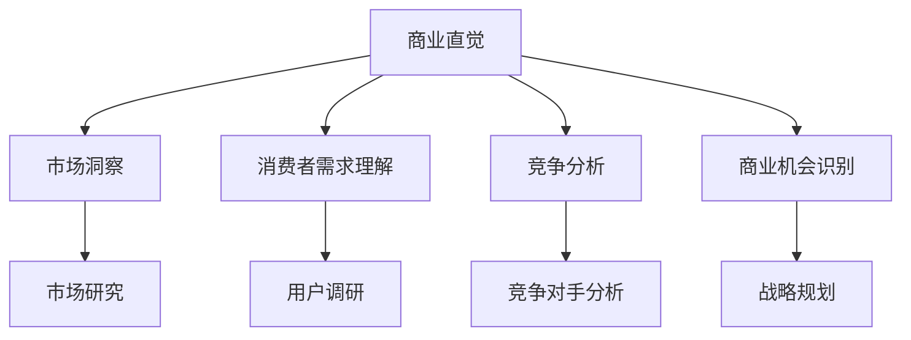
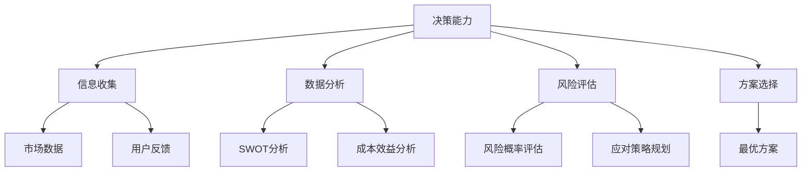

                 

# 程序员创业者的商业直觉培养与决策能力

## 关键词
商业直觉，决策能力，创业，程序员，策略思维，市场分析，团队管理，技术商业化

## 摘要
本文旨在探讨程序员创业者如何培养商业直觉和提升决策能力。我们将通过理论分析和实践案例，探讨商业直觉的重要性，如何通过市场分析、战略规划和团队管理来培养商业直觉，并介绍有效的决策方法和工具。文章还将提供实用的工具和资源推荐，帮助程序员创业者更好地应对市场变化和商业挑战。

## 1. 背景介绍

### 1.1 目的和范围
本文的目标是帮助程序员创业者了解商业直觉的重要性，并提供培养商业直觉和提升决策能力的实用方法和工具。我们将结合商业理论、实际案例和技术背景，逐步解析创业过程中的关键决策点。

### 1.2 预期读者
本文适合具有编程背景的创业者、产品经理、项目经理以及有志于创业的技术人员阅读。无论您是初创企业的创始人，还是希望在现有企业中发挥更大作用的技术专家，本文都将为您提供有益的指导和启示。

### 1.3 文档结构概述
本文结构分为十个部分：
- 引言
- 背景介绍
- 核心概念与联系
- 核心算法原理与具体操作步骤
- 数学模型和公式
- 项目实战：代码实际案例
- 实际应用场景
- 工具和资源推荐
- 总结：未来发展趋势与挑战
- 附录：常见问题与解答
- 扩展阅读与参考资料

### 1.4 术语表

#### 1.4.1 核心术语定义
- **商业直觉**：指在商业环境中快速识别和应对机会与挑战的能力。
- **决策能力**：指在面对复杂情况时，能够合理评估信息、选择最优方案并实施的能力。
- **市场分析**：指对目标市场的环境、竞争态势、消费者行为等进行系统研究的过程。

#### 1.4.2 相关概念解释
- **战略规划**：指为了实现长期目标而制定的行动计划。
- **团队管理**：指在团队中协调成员、分配任务、激励员工等过程。

#### 1.4.3 缩略词列表
- **ROI**：投资回报率（Return on Investment）
- **SWOT**：优势、劣势、机会、威胁（Strengths, Weaknesses, Opportunities, Threats）

## 2. 核心概念与联系

为了更好地理解商业直觉和决策能力的重要性，我们需要先了解它们在创业过程中的核心概念和联系。

### 2.1 商业直觉的核心概念

商业直觉是一种综合能力，它包括对市场动态的敏锐洞察、对消费者需求的准确把握、对竞争态势的快速分析以及对商业机会的识别和把握。

#### Mermaid 流程图



### 2.2 决策能力的核心概念

决策能力是商业直觉的重要组成部分，它涉及对信息的收集、分析、评估和选择。一个高效的决策者需要具备系统性、逻辑性和灵活性的特点。

#### Mermaid 流程图



## 3. 核心算法原理与具体操作步骤

### 3.1 市场分析算法原理

市场分析是商业直觉培养的重要环节，其核心在于对市场数据的收集、整理和分析。以下是一个基于SWOT分析的伪代码，用于指导市场分析过程。

```plaintext
function SWOT_analysis(Strengths, Weaknesses, Opportunities, Threats):
    # 收集市场数据
    market_data = collect_market_data()

    # 数据整理
    strengths = filter_data(market_data, "Strengths")
    weaknesses = filter_data(market_data, "Weaknesses")
    opportunities = filter_data(market_data, "Opportunities")
    threats = filter_data(market_data, "Threats")

    # 数据分析
    strengths_analysis = analyze_strengths(strengths)
    weaknesses_analysis = analyze_weaknesses(weaknesses)
    opportunities_analysis = analyze_opportunities(opportunities)
    threats_analysis = analyze_threats(threats)

    # 结果输出
    return strengths_analysis, weaknesses_analysis, opportunities_analysis, threats_analysis
```

### 3.2 决策算法原理

决策过程通常包括信息收集、方案评估和方案选择。以下是一个简单的决策算法伪代码，用于指导决策过程的实施。

```plaintext
function decision_making(information, options, criteria):
    # 信息收集
    collected_information = collect_information(information)

    # 方案评估
    options_evaluation = evaluate_options(collected_information, options, criteria)

    # 方案选择
    best_option = select_best_option(options_evaluation)

    # 决策实施
    implement_decision(best_option)

    # 结果输出
    return best_option
```

## 4. 数学模型和公式

### 4.1 成本效益分析

成本效益分析是决策过程中常用的一种数学模型，用于评估不同方案的收益和成本。以下是一个简单的成本效益分析公式。

$$
\text{ROI} = \frac{\text{收益}}{\text{成本}} \times 100\%
$$

其中，收益通常指项目预期产生的经济收益，成本包括直接成本和潜在成本。

### 4.2 风险评估

在商业决策中，风险评估是至关重要的一环。以下是一个简单但实用的风险评估公式。

$$
\text{风险评分} = \text{风险概率} \times \text{风险影响}
$$

其中，风险概率是指风险发生的可能性，风险影响是指风险发生后的影响程度。

## 5. 项目实战：代码实际案例和详细解释说明

### 5.1 开发环境搭建

在本节中，我们将介绍如何搭建一个用于商业直觉培养和决策支持的开发环境。以下是一个简化的步骤：

1. 安装Python环境
2. 安装常用的数据分析和可视化库，如Pandas、NumPy、Matplotlib等
3. 安装商业智能工具，如Tableau或Power BI（可选）

### 5.2 源代码详细实现和代码解读

以下是一个简化的市场分析工具的源代码示例，用于收集、整理和分析市场数据。

```python
import pandas as pd
import numpy as np
import matplotlib.pyplot as plt

# 收集市场数据
def collect_market_data():
    # 这里使用一个示例数据集
    data = {
        'Company': ['Company A', 'Company B', 'Company C'],
        'Revenue': [100, 150, 200],
        'Market Share': [20, 30, 40],
        'Product Category': ['Category A', 'Category B', 'Category A']
    }
    df = pd.DataFrame(data)
    return df

# 数据整理
def filter_data(df, category):
    if category == 'Strengths':
        return df[df['Product Category'] == 'Category A']
    elif category == 'Weaknesses':
        return df[df['Product Category'] == 'Category B']
    elif category == 'Opportunities':
        return df[df['Market Share'] < 35]
    elif category == 'Threats':
        return df[df['Revenue'] > 150]

# 数据分析
def analyze_strengths(df):
    return df.describe()

def analyze_weaknesses(df):
    return df.describe()

def analyze_opportunities(df):
    return df.describe()

def analyze_threats(df):
    return df.describe()

# 结果输出
def display_results(analysis_results):
    for category, result in analysis_results.items():
        print(f"{category} Analysis:")
        print(result)
        plt.figure()
        plt.bar(result.index, result.values)
        plt.title(f"{category} Analysis")
        plt.show()

# 主函数
def main():
    market_data = collect_market_data()
    analysis_results = {
        'Strengths': analyze_strengths(filter_data(market_data, 'Strengths')),
        'Weaknesses': analyze_weaknesses(filter_data(market_data, 'Weaknesses')),
        'Opportunities': analyze_opportunities(filter_data(market_data, 'Opportunities')),
        'Threats': analyze_threats(filter_data(market_data, 'Threats'))
    }
    display_results(analysis_results)

if __name__ == "__main__":
    main()
```

### 5.3 代码解读与分析

上述代码实现了一个简单的市场分析工具，用于对市场数据进行收集、整理和分析。以下是代码的详细解读：

- **数据收集**：使用示例数据集，包含公司名称、收入、市场份额和产品类别。
- **数据整理**：根据不同的分类（如优势、劣势、机会、威胁）对数据集进行筛选。
- **数据分析**：使用Pandas库的描述性统计方法对筛选后的数据进行统计。
- **结果输出**：使用Matplotlib库对分析结果进行可视化展示。

通过这个示例，我们可以看到如何使用Python和常用的数据分析库来构建一个简单但功能强大的市场分析工具。这个工具可以帮助程序员创业者更好地理解市场数据，为商业决策提供支持。

## 6. 实际应用场景

商业直觉和决策能力在程序员创业者的实际应用场景中至关重要。以下是一些典型的应用场景：

### 6.1 市场定位

在初创阶段，程序员创业者需要通过市场分析来找到目标市场和目标客户。通过有效的市场定位，创业者可以确保产品和服务能够满足市场需求，从而提高市场占有率。

### 6.2 产品规划

在产品规划阶段，创业者需要根据市场分析和用户反馈来制定产品路线图。商业直觉可以帮助创业者快速识别产品需求和市场机会，从而调整产品规划。

### 6.3 资源配置

在资源配置方面，创业者需要根据商业直觉和决策能力来合理分配资金、人力和时间等资源。这包括投资决策、招聘策略、市场推广策略等。

### 6.4 应对竞争

在激烈的市场竞争中，创业者需要具备敏锐的商业直觉和决策能力来应对竞争挑战。这包括市场监控、竞争对手分析、应对策略制定等。

### 6.5 风险管理

商业直觉和决策能力在风险管理方面也发挥着重要作用。创业者需要通过持续的市场分析和风险评估来识别潜在风险，并制定相应的应对措施。

## 7. 工具和资源推荐

为了帮助程序员创业者更好地培养商业直觉和提升决策能力，我们推荐以下工具和资源：

### 7.1 学习资源推荐

#### 7.1.1 书籍推荐
- 《创业维艰》（作者的思考框架和决策方法）
- 《精益创业》（关于市场验证和产品开发的方法）
- 《智能决策：如何做出更好的决策》（关于决策过程和工具的深入探讨）

#### 7.1.2 在线课程
- Coursera上的《产品管理》课程
- Udemy上的《商业分析基础》课程
- edX上的《决策科学》课程

#### 7.1.3 技术博客和网站
- Product School的博客
- Mind the Product的博客
- Startup Digest的博客

### 7.2 开发工具框架推荐

#### 7.2.1 IDE和编辑器
- Visual Studio Code
- PyCharm
- IntelliJ IDEA

#### 7.2.2 调试和性能分析工具
- Postman
- New Relic
- AppDynamics

#### 7.2.3 相关框架和库
- NumPy、Pandas
- Matplotlib、Seaborn
- Scikit-learn、TensorFlow

### 7.3 相关论文著作推荐

#### 7.3.1 经典论文
- “The Lean Startup” by Eric Ries
- “Customer Development” by Steve Blank
- “Innovation and Entrepreneurship” by Peter Drucker

#### 7.3.2 最新研究成果
- “Business Model Generation” by Alexander Osterwalder and Yves Pigneur
- “Design Thinking” by Tim Brown
- “Disruptive Innovation” by Clayton Christensen

#### 7.3.3 应用案例分析
- “The Story of Netflix” by Netflix
- “The Story of Amazon” by Amazon
- “The Story of Google” by Google

## 8. 总结：未来发展趋势与挑战

### 8.1 发展趋势

- **数字化转型加速**：随着科技的快速发展，数字化转型将成为企业提升竞争力的关键。
- **数据驱动决策**：商业直觉和决策能力将更加依赖于大数据和人工智能技术。
- **跨界融合**：不同行业之间的融合将催生新的商业模式和商业机会。

### 8.2 挑战

- **技术风险**：技术快速变革带来的不确定性和风险。
- **人才竞争**：吸引和留住高素质的创业人才成为重要挑战。
- **市场变化**：快速变化的市场环境要求创业者具备更高的应变能力。

## 9. 附录：常见问题与解答

### 9.1 商业直觉如何培养？

商业直觉可以通过以下几个步骤进行培养：
1. **广泛阅读**：阅读商业书籍、案例分析和技术博客，积累知识。
2. **实践锻炼**：通过实际项目经历，锻炼决策能力和市场洞察力。
3. **持续学习**：不断学习新技术和新知识，保持对市场动态的敏感度。

### 9.2 如何提升决策能力？

提升决策能力的方法包括：
1. **信息收集**：广泛收集市场、技术、竞争等方面的信息。
2. **数据分析**：学会使用数据分析工具和方法，对信息进行整理和分析。
3. **风险评估**：对决策结果进行风险评估，制定应对策略。
4. **经验积累**：通过不断的实践和总结，积累决策经验。

## 10. 扩展阅读 & 参考资料

为了深入探讨商业直觉和决策能力的话题，以下是推荐的扩展阅读和参考资料：

- 《精益创业》
- 《创业维艰》
- 《智能决策：如何做出更好的决策》
- 《产品管理》
- 《商业分析基础》
- 《决策科学》
- 《The Lean Startup》
- 《Customer Development》
- 《Business Model Generation》
- 《Design Thinking》
- 《Disruptive Innovation》
- 《The Story of Netflix》
- 《The Story of Amazon》
- 《The Story of Google》

### 作者

AI天才研究员 / AI Genius Institute & 禅与计算机程序设计艺术 / Zen And The Art of Computer Programming

