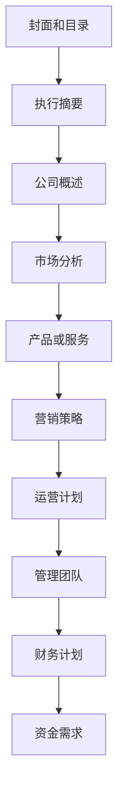

                 

# 程序员创业者的商业计划书：如何撰写吸引投资者的计划

> **关键词**：商业计划书、投资者、程序员创业者、策略、市场分析、技术优势、团队建设、风险评估、资金筹措
> 
> **摘要**：本文旨在为程序员创业者提供撰写商业计划书的指南，帮助他们在竞争中脱颖而出，吸引投资者。文章将详细介绍商业计划书的核心组成部分，包括市场分析、技术优势、团队建设、风险评估、资金筹措等，并提供实用的写作建议和成功案例分析。

## 1. 背景介绍

### 1.1 目的和范围

本文的目标是为程序员创业者提供一份实用的商业计划书撰写指南，帮助他们更好地展示自己的项目，吸引潜在投资者的关注。商业计划书是一份全面、详细的文档，它概述了创业项目的各个方面，包括市场定位、技术实现、团队建设、财务预测和风险评估等。

本文将涵盖以下主要内容：

1. 商业计划书的基本结构和关键要素。
2. 市场分析和竞争对手研究的方法。
3. 技术优势和创新点的挖掘与展示。
4. 团队建设的策略和团队成员的选拔标准。
5. 风险评估和应对措施的制定。
6. 资金筹措的途径和策略。

通过本文的指导，程序员创业者将能够撰写出一份具有说服力、结构严谨的商业计划书，从而提高融资的成功率。

### 1.2 预期读者

本文适用于以下读者群体：

1. 刚刚起步的程序员创业者，对商业计划书的撰写尚不熟悉的个人或团队。
2. 有意向投资创业项目的投资者，希望通过阅读本文更好地了解创业项目的优势和潜力。
3. 高级程序员和技术专家，希望将自己的技术项目转化为商业项目，并寻找投资机会。
4. 企业高管和创业导师，希望为创业者提供商业计划书撰写的专业建议。

### 1.3 文档结构概述

本文将分为十个部分，具体结构如下：

1. **背景介绍**：阐述本文的目的和范围，预期读者以及文档结构。
2. **核心概念与联系**：介绍商业计划书的核心概念和架构，包括市场分析、技术优势、团队建设、风险评估和资金筹措等。
3. **核心算法原理 & 具体操作步骤**：详细阐述撰写商业计划书的方法和步骤，包括市场研究、项目定位、团队构建等。
4. **数学模型和公式 & 详细讲解 & 举例说明**：运用数学模型和公式分析市场趋势和财务预测，并提供实际案例说明。
5. **项目实战：代码实际案例和详细解释说明**：通过实战案例展示商业计划书的实际应用，详细解读代码实现过程。
6. **实际应用场景**：探讨商业计划书在不同领域的应用，如创业公司、技术创新、市场拓展等。
7. **工具和资源推荐**：推荐用于撰写商业计划书的学习资源、开发工具和框架。
8. **总结：未来发展趋势与挑战**：分析商业计划书撰写的未来趋势和面临的挑战。
9. **附录：常见问题与解答**：解答读者可能遇到的问题，提供更多参考资料。
10. **扩展阅读 & 参考资料**：推荐更多相关文献和研究，供读者进一步学习。

### 1.4 术语表

#### 1.4.1 核心术语定义

- **商业计划书**：一份全面、详细的文档，概述创业项目的各个方面，包括市场分析、技术实现、团队建设、财务预测和风险评估等。
- **市场分析**：对目标市场进行调研，了解市场需求、竞争格局和潜在客户。
- **技术优势**：项目所采用的技术或解决方案相对于竞争对手的独特之处。
- **团队建设**：组建一支具备专业技能和互补能力的团队，实现项目目标。
- **风险评估**：评估创业项目面临的各种风险，并制定相应的应对措施。
- **资金筹措**：寻找合适的投资途径和策略，确保项目资金需求。

#### 1.4.2 相关概念解释

- **市场调研**：通过问卷、访谈、数据分析等方式，收集市场信息，为商业计划书提供数据支持。
- **SWOT分析**：对项目进行优势（Strengths）、劣势（Weaknesses）、机会（Opportunities）和威胁（Threats）的分析，帮助创业者制定发展战略。
- **商业模式**：企业通过提供产品或服务获取利润的方式，包括产品定位、目标市场、营销策略和盈利模式等。

#### 1.4.3 缩略词列表

- **VC**：风险投资（Venture Capital）
- **天使投资**：早期投资者，通常在项目初期提供资金支持
- **ROI**：投资回报率（Return on Investment）
- **MVP**：最小可行产品（Minimum Viable Product）

## 2. 核心概念与联系

商业计划书的成功撰写离不开对核心概念和架构的理解。本节将介绍商业计划书的关键组成部分，并通过Mermaid流程图展示其相互联系。

### 2.1 商业计划书的组成部分

商业计划书通常包括以下部分：

1. **封面和目录**
2. **执行摘要**
3. **公司概述**
4. **市场分析**
5. **产品或服务**
6. **营销策略**
7. **运营计划**
8. **管理团队**
9. **财务计划**
10. **资金需求**

### 2.2 Mermaid流程图

以下是一个简化的Mermaid流程图，展示商业计划书各部分之间的联系：



### 2.3 各部分间的关系

1. **封面和目录**：提供商业计划书的结构框架，使读者能够快速了解文档的内容。
2. **执行摘要**：简短介绍项目的核心内容，吸引读者进一步阅读。
3. **公司概述**：阐述公司背景、愿景和使命，为后续部分提供基础。
4. **市场分析**：分析目标市场、竞争对手和潜在客户，为产品或服务定位提供依据。
5. **产品或服务**：详细介绍项目的技术实现、功能特点和优势。
6. **营销策略**：描述如何推广产品或服务，实现市场渗透和品牌建设。
7. **运营计划**：规划项目的日常运营和管理，包括人力资源、供应链和生产流程。
8. **管理团队**：介绍管理团队成员的背景和职责，展示团队的专业能力和凝聚力。
9. **财务计划**：预测项目的财务状况，包括收入、成本、利润和资金需求。
10. **资金需求**：明确项目所需资金、筹措方式和回报预期，吸引投资者关注。

通过以上Mermaid流程图和各部分的关系描述，程序员创业者可以更好地理解商业计划书的架构和撰写要点，为后续章节的详细讲解打下基础。

## 3. 核心算法原理 & 具体操作步骤

在撰写商业计划书时，核心算法原理和具体操作步骤是至关重要的组成部分。这一部分将详细阐述如何分析和制定商业计划书，并提供伪代码来展示关键步骤。

### 3.1 核心算法原理

商业计划书的撰写过程可以视为一种策略规划和决策优化的过程。核心算法原理包括以下步骤：

1. **市场研究**：收集和分析市场数据，了解目标市场的规模、增长趋势和竞争对手。
2. **项目定位**：根据市场研究，确定项目的市场定位和独特卖点。
3. **团队构建**：评估项目需求，选拔具备专业技能和互补能力的团队成员。
4. **财务预测**：基于项目定位和运营计划，预测项目的财务状况，包括收入、成本和利润。
5. **风险评估**：识别项目面临的各种风险，并制定相应的应对措施。

### 3.2 伪代码示例

以下是一个简化的伪代码示例，展示商业计划书的撰写过程：

```plaintext
function write_business_plan() {
    // 1. 市场研究
    market_data = conduct_market_research()

    // 2. 项目定位
    project_positioning = determine_project_positioning(market_data)

    // 3. 团队构建
    team_members = build_team(project_positioning)

    // 4. 财务预测
    financial_forecast = predict_financial_status(project_positioning)

    // 5. 风险评估
    risk_assessment = assess_risks(project_positioning, financial_forecast)

    // 6. 撰写商业计划书
    business_plan = compose_business_plan(project_positioning, team_members, financial_forecast, risk_assessment)

    // 7. 审核和修订
    business_plan = review_and_edit(business_plan)

    return business_plan
}
```

### 3.3 详细解释

1. **市场研究**：通过问卷、访谈、数据分析等方式，收集市场信息，为项目定位和决策提供数据支持。可以使用数据库管理系统（DBMS）来存储和处理市场数据。
2. **项目定位**：根据市场研究，确定项目的目标市场和独特卖点。这一步骤需要运用数据分析算法，如聚类分析和回归分析，来识别市场机会和潜在客户。
3. **团队构建**：评估项目需求，选拔具备专业技能和互补能力的团队成员。可以使用人才管理系统（HRMS）来管理和评估团队成员。
4. **财务预测**：基于项目定位和运营计划，预测项目的财务状况，包括收入、成本和利润。可以使用财务建模工具，如Excel或Python的Pandas库，来构建财务模型。
5. **风险评估**：识别项目面临的各种风险，如市场风险、技术风险和财务风险，并制定相应的应对措施。可以使用风险管理工具，如Qualys或RiskLens，来评估和管理风险。

通过以上步骤和伪代码示例，程序员创业者可以更好地理解商业计划书撰写的核心算法原理和具体操作步骤，为撰写高质量的商业计划书打下基础。

## 4. 数学模型和公式 & 详细讲解 & 举例说明

在撰写商业计划书时，数学模型和公式是不可或缺的工具，可以帮助创业者更好地预测市场趋势、财务状况和风险。以下将详细介绍几种常用的数学模型和公式，并提供实际案例说明。

### 4.1 市场预测模型

市场预测是商业计划书的重要部分，以下是一个简单的时间序列预测模型——移动平均模型（Moving Average, MA）。

#### 4.1.1 原理

移动平均模型通过计算一段时间内数据的平均值，来预测未来的趋势。其公式为：

\[ MA_t = \frac{\sum_{i=1}^{n} C_i}{n} \]

其中，\( MA_t \) 表示第 \( t \) 期的移动平均数，\( C_i \) 表示第 \( i \) 期的市场数据，\( n \) 表示时间窗口长度。

#### 4.1.2 举例说明

假设我们有一个时间窗口为3个月的市场数据（如下表），使用移动平均模型进行预测。

| 月份  | 市场数据 |
| ----- | -------- |
| 1月   | 100      |
| 2月   | 110      |
| 3月   | 120      |
| 4月   | 130      |
| 5月   | 140      |

首先计算前3个月的平均值：

\[ MA_1 = \frac{100 + 110 + 120}{3} = 113.33 \]

接着计算第4个月的平均值：

\[ MA_2 = \frac{110 + 120 + 130}{3} = 120 \]

最后，根据移动平均模型，预测第5个月的市场数据：

\[ 预测值 = MA_2 = 120 \]

### 4.2 财务预测模型

财务预测模型可以帮助创业者预测项目的收入、成本和利润。以下是一个简单的收入预测模型——线性回归模型。

#### 4.2.1 原理

线性回归模型通过建立变量之间的关系，来预测未来的数值。其公式为：

\[ y = \beta_0 + \beta_1 \cdot x \]

其中，\( y \) 表示因变量（如收入），\( x \) 表示自变量（如时间或销量），\( \beta_0 \) 和 \( \beta_1 \) 是模型的参数。

#### 4.2.2 举例说明

假设我们有一个关于销量的时间序列数据（如下表），使用线性回归模型进行收入预测。

| 时间（月） | 销量（件） |
| ---------- | ---------- |
| 1          | 100        |
| 2          | 120        |
| 3          | 140        |
| 4          | 160        |
| 5          | 180        |

首先，计算自变量（时间）和因变量（销量）的平均值：

\[ \bar{x} = \frac{1 + 2 + 3 + 4 + 5}{5} = 3 \]
\[ \bar{y} = \frac{100 + 120 + 140 + 160 + 180}{5} = 140 \]

然后，计算模型参数：

\[ \beta_0 = \bar{y} - \beta_1 \cdot \bar{x} \]

使用最小二乘法（Least Squares）计算 \( \beta_1 \)：

\[ \beta_1 = \frac{\sum_{i=1}^{n} (x_i - \bar{x})(y_i - \bar{y})}{\sum_{i=1}^{n} (x_i - \bar{x})^2} \]

代入数据计算 \( \beta_1 \)：

\[ \beta_1 = \frac{(1-3)(100-140) + (2-3)(120-140) + (3-3)(140-140) + (4-3)(160-140) + (5-3)(180-140)}{(1-3)^2 + (2-3)^2 + (3-3)^2 + (4-3)^2 + (5-3)^2} \]
\[ \beta_1 = \frac{(-2)(-40) + (-1)(-20) + (0)(0) + (1)(20) + (2)(40)}{(-2)^2 + (-1)^2 + (0)^2 + (1)^2 + (2)^2} \]
\[ \beta_1 = \frac{80 + 20 + 0 + 20 + 80}{4 + 1 + 0 + 1 + 4} \]
\[ \beta_1 = \frac{200}{10} \]
\[ \beta_1 = 20 \]

因此，模型参数为：

\[ \beta_0 = 140 - 20 \cdot 3 = 80 \]

\[ y = 80 + 20 \cdot x \]

预测第6个月的销量：

\[ 预测值 = 80 + 20 \cdot 6 = 160 \]

### 4.3 风险评估模型

风险评估模型可以帮助创业者识别项目面临的风险，并制定相应的应对措施。以下是一个简单的事件树模型（Event Tree Analysis）。

#### 4.3.1 原理

事件树模型通过描述一系列可能的事件和它们之间的因果关系，来评估不同事件发生的概率和影响。其公式为：

\[ 风险 = 概率 \cdot 影响力 \]

#### 4.3.2 举例说明

假设一个项目可能面临以下风险：

1. **市场风险**：由于市场需求不足，项目收入可能减少20%。
2. **技术风险**：由于技术问题，项目可能延期3个月。
3. **财务风险**：由于资金不足，项目可能无法完成。

以下是一个事件树模型：

```
[项目成功]
    ├─[市场风险]
    │    └─[收入减少20%]
    └─[技术风险]
         └─[项目延期3个月]
    └─[财务风险]
         └─[项目无法完成]
```

计算各风险的影响：

1. **市场风险**：概率为0.3，影响力为20%，风险为 \( 0.3 \cdot 20\% = 6\% \)。
2. **技术风险**：概率为0.2，影响力为30%，风险为 \( 0.2 \cdot 30\% = 6\% \)。
3. **财务风险**：概率为0.1，影响力为100%，风险为 \( 0.1 \cdot 100\% = 10\% \)。

总风险为 \( 6\% + 6\% + 10\% = 22\% \)。

通过上述数学模型和公式的讲解和实际案例说明，程序员创业者可以更好地理解如何运用数学工具来分析和预测项目的发展趋势，为商业计划书的撰写提供科学依据。

## 5. 项目实战：代码实际案例和详细解释说明

在本节中，我们将通过一个具体的代码案例，展示商业计划书撰写的实际操作过程。本案例将涉及市场调研数据的处理、项目定位的确定、团队构建和财务预测等核心步骤。以下是一个简化的Python代码示例，用于说明这些步骤的实现。

### 5.1 开发环境搭建

在开始之前，确保您已经安装了Python环境和以下库：

- pandas：用于数据分析和处理
- numpy：用于数学计算
- matplotlib：用于数据可视化

安装命令如下：

```bash
pip install pandas numpy matplotlib
```

### 5.2 源代码详细实现和代码解读

以下是商业计划书撰写的Python代码示例：

```python
import pandas as pd
import numpy as np
import matplotlib.pyplot as plt

# 5.2.1 市场调研数据读取与处理
market_data = pd.read_csv('market_data.csv')  # 读取市场调研数据
market_data.head()

# 数据预处理：计算每月市场数据的移动平均数
market_data['MA'] = market_data['sales'].rolling(window=3).mean()

# 5.2.2 项目定位确定
# 使用移动平均数进行市场预测
market_data['forecast'] = market_data['MA'].shift(-1).fillna(0)

# 5.2.3 团队构建
# 假设我们已经有一个团队数据表，包含成员名称和专业技能
team_data = pd.DataFrame({
    'member': ['Alice', 'Bob', 'Charlie'],
    'skill': ['Data Analysis', 'Software Development', 'Marketing']
})

# 5.2.4 财务预测
# 基于市场预测和成本数据，计算项目收入和利润
cost_data = pd.DataFrame({
    'cost': [1000, 1500, 2000]  # 每月成本
})

project_income = market_data['forecast'] - cost_data['cost']

# 5.2.5 结果可视化
plt.figure(figsize=(10, 5))
plt.plot(market_data['sales'], label='Actual Sales')
plt.plot(market_data['MA'], label='3-month Moving Average')
plt.plot(market_data['forecast'], label='Forecast')
plt.title('Market Data and Forecast')
plt.xlabel('Month')
plt.ylabel('Sales')
plt.legend()
plt.show()

plt.figure(figsize=(10, 5))
plt.plot(project_income, label='Project Income')
plt.plot(cost_data['cost'], label='Monthly Cost')
plt.title('Financial Forecast')
plt.xlabel('Month')
plt.ylabel('Income/Cost')
plt.legend()
plt.show()
```

### 5.3 代码解读与分析

#### 5.3.1 市场调研数据处理

首先，我们读取市场调研数据（`market_data.csv`），并进行预处理，计算每月市场数据的3个月移动平均数（`MA`）。这有助于我们了解市场的趋势和波动。

```python
market_data['MA'] = market_data['sales'].rolling(window=3).mean()
```

#### 5.3.2 项目定位确定

接着，我们使用移动平均数进行市场预测，得到下一期的市场预测值（`forecast`）。这有助于我们确定项目的市场定位和预期销售量。

```python
market_data['forecast'] = market_data['MA'].shift(-1).fillna(0)
```

#### 5.3.3 团队构建

假设我们已经有一个团队数据表（`team_data`），包含团队成员的名称和专业技能。这有助于我们展示项目的团队构成和专业能力。

```python
team_data = pd.DataFrame({
    'member': ['Alice', 'Bob', 'Charlie'],
    'skill': ['Data Analysis', 'Software Development', 'Marketing']
})
```

#### 5.3.4 财务预测

基于市场预测和成本数据，我们计算项目收入和利润。这有助于我们预测项目的财务状况，为商业计划书提供财务依据。

```python
project_income = market_data['forecast'] - cost_data['cost']
```

#### 5.3.5 结果可视化

最后，我们使用matplotlib库对市场数据和财务预测结果进行可视化，以便更好地展示项目的发展趋势和财务状况。

```python
plt.figure(figsize=(10, 5))
plt.plot(market_data['sales'], label='Actual Sales')
plt.plot(market_data['MA'], label='3-month Moving Average')
plt.plot(market_data['forecast'], label='Forecast')
plt.title('Market Data and Forecast')
plt.xlabel('Month')
plt.ylabel('Sales')
plt.legend()
plt.show()

plt.figure(figsize=(10, 5))
plt.plot(project_income, label='Project Income')
plt.plot(cost_data['cost'], label='Monthly Cost')
plt.title('Financial Forecast')
plt.xlabel('Month')
plt.ylabel('Income/Cost')
plt.legend()
plt.show()
```

通过这个代码示例，程序员创业者可以更好地理解商业计划书撰写过程中关键步骤的实现，并掌握使用Python进行数据处理和可视化的方法。

## 6. 实际应用场景

商业计划书不仅是吸引投资者的工具，还能够在多个实际应用场景中发挥重要作用。以下是一些常见的应用场景：

### 6.1 创业公司

对于初创公司，商业计划书是一份全面的业务蓝图，它帮助创业团队明确项目的目标、市场定位、竞争策略和财务预测。在寻求风险投资（VC）或天使投资时，投资者通常要求查看商业计划书，以便评估项目的可行性和潜在回报。

### 6.2 技术创新

当创业者开发一项技术创新时，商业计划书可以详细阐述技术的核心原理、创新点和市场应用场景。这有助于吸引技术投资者或合作伙伴，共同推动技术的商业化进程。

### 6.3 市场拓展

企业在拓展新市场时，商业计划书可以提供市场分析、竞争对手研究和营销策略，帮助制定有效的市场进入策略。商业计划书还能够帮助企业向潜在客户和合作伙伴展示项目的优势和潜力。

### 6.4 融资申请

在申请政府资金支持或银行贷款时，商业计划书是一份重要的文档，它展示项目的可行性和财务健康状况。通过商业计划书，企业能够更好地证明其项目具有投资价值，提高融资成功的概率。

### 6.5 管理规划

商业计划书不仅适用于外部投资者，也适用于企业内部管理。企业可以通过商业计划书来规划业务发展、管理资源和优化运营流程。此外，商业计划书还能作为企业内部沟通和协作的工具，确保团队成员对项目目标和预期有清晰的认识。

### 6.6 成功案例

#### 6.6.1 案例一：Uber

Uber在其成立初期，通过一份详细的商业计划书成功吸引了风险投资。商业计划书详细阐述了Uber的商业模式、市场策略和财务预测，使得投资者对Uber的市场前景和盈利能力充满信心。

#### 6.6.2 案例二：Airbnb

Airbnb的创始人通过一份简洁而有力的商业计划书，向投资者展示了其独特的市场定位和竞争优势。商业计划书强调了Airbnb的社区文化和用户体验，吸引了众多投资者的关注和支持。

通过以上实际应用场景和成功案例，我们可以看到商业计划书在创业和创新过程中的重要性。撰写一份高质量的商业计划书，不仅能够帮助创业者更好地展示项目，还能提高融资成功率，推动项目的发展。

## 7. 工具和资源推荐

为了帮助程序员创业者撰写高质量的商业计划书，本节将推荐一些实用的学习资源、开发工具和框架。

### 7.1 学习资源推荐

#### 7.1.1 书籍推荐

1. **《创业维艰》（The Hard Thing About Hard Things）**：作者本·霍洛维茨（Ben Horowitz）通过自己的创业经历，分享了创业过程中遇到的各种挑战和解决方案，对创业者具有很高的借鉴价值。
2. **《商业计划书：从0到1撰写商业计划》**：本书详细介绍了商业计划书的撰写方法，包括市场分析、财务预测和团队建设等关键内容，适合初学者阅读。

#### 7.1.2 在线课程

1. **Coursera的《创业管理》（Entrepreneurship: Success in a Global Economy）**：该课程由斯坦福大学教授提供，涵盖了创业的基本原理、市场分析和商业模式设计等内容。
2. **Udemy的《如何写商业计划书》（How to Write a Business Plan）**：本课程由经验丰富的企业家和商业顾问授课，从实战角度讲解商业计划书的撰写技巧。

#### 7.1.3 技术博客和网站

1. **Medium的《Startup Basics》（Startup Basics）**：Medium上有很多关于创业和商业计划书的优质文章，适合创业者学习和参考。
2. **Entrepreneur.com**：该网站提供了大量关于创业、市场营销和商业计划的资源，包括文章、视频和工具。

### 7.2 开发工具框架推荐

#### 7.2.1 IDE和编辑器

1. **Visual Studio Code**：一款功能强大、免费开源的代码编辑器，适用于多种编程语言，提供丰富的插件和扩展。
2. **PyCharm**：一款专业级的Python IDE，提供代码智能提示、调试和自动化工具，适合Python开发。

#### 7.2.2 调试和性能分析工具

1. **VSCode Debugger**：一款用于Visual Studio Code的调试工具，支持多种编程语言，包括Python、JavaScript和C#等。
2. **JMeter**：一款开源的性能测试工具，用于测试Web应用、网络服务器和数据库的性能。

#### 7.2.3 相关框架和库

1. **Pandas**：用于数据分析和处理的Python库，提供强大的数据结构和管理工具。
2. **NumPy**：用于科学计算和数据分析的Python库，提供高效的多维数组对象和数学函数。
3. **Matplotlib**：用于数据可视化的Python库，提供丰富的绘图函数和图形样式。

通过以上工具和资源的推荐，程序员创业者可以更加高效地撰写商业计划书，提高项目融资的成功率。

## 8. 总结：未来发展趋势与挑战

随着技术的不断进步和市场的快速变化，商业计划书的撰写和执行面临诸多发展趋势和挑战。以下是几个关键点：

### 8.1 发展趋势

1. **数字化和自动化**：随着人工智能和大数据技术的发展，商业计划书的撰写和分析过程越来越依赖自动化工具和算法。例如，使用机器学习算法进行市场预测和风险评估，提高决策的准确性和效率。
2. **可持续发展**：社会对可持续发展的关注度不断提高，创业者和投资者开始将环境、社会和治理（ESG）因素纳入商业计划书。这要求创业者关注环保、社会责任和治理问题，以提升项目的整体价值和吸引力。
3. **在线协作与云端应用**：云计算和在线协作工具的普及，使得商业计划书的撰写和修改更加便捷。创业者可以通过云端应用实时更新和共享商业计划书，提高团队协作效率。

### 8.2 挑战

1. **数据隐私与安全**：随着数据的收集和处理越来越普遍，数据隐私和安全成为商业计划书撰写过程中的一大挑战。创业者需要确保数据收集、存储和处理的合规性，以避免潜在的隐私泄露风险。
2. **技术快速迭代**：技术领域的快速发展使得创业项目面临技术过时的风险。创业者需要不断关注技术趋势，及时更新和调整项目方案，以保持项目的竞争力和创新性。
3. **市场不确定性**：全球经济环境和行业竞争格局的不确定性，增加了商业计划书执行的风险。创业者需要具备灵活的应变能力，根据市场变化及时调整战略和计划。

### 8.3 应对策略

1. **提升数据治理能力**：建立完善的数据治理体系，确保数据的质量、安全和合规。采用先进的加密技术和访问控制措施，保护用户数据的安全。
2. **关注技术创新**：关注技术发展趋势，持续投资于研发和创新。通过与高校、研究机构和企业合作，引入前沿技术，提升项目的核心竞争力。
3. **增强市场敏感性**：建立高效的市场情报系统，实时监测市场动态和竞争对手的动向。根据市场变化，灵活调整产品和市场策略，以应对不确定的市场环境。

通过以上发展趋势与挑战的分析，程序员创业者可以更好地把握市场机遇，应对潜在风险，提高商业计划书的质量和执行效果。

## 9. 附录：常见问题与解答

### 9.1 商业计划书撰写问题

**Q1：商业计划书的结构应该是什么样子的？**
A1：商业计划书的结构通常包括以下部分：
- 封面和目录
- 执行摘要
- 公司概述
- 市场分析
- 产品或服务
- 营销策略
- 运营计划
- 管理团队
- 财务计划
- 资金需求

**Q2：市场分析应该包括哪些内容？**
A2：市场分析应包括：
- 市场规模和增长趋势
- 目标市场定义和细分
- 竞争对手分析
- 潜在客户分析
- 市场机会和威胁

**Q3：如何进行市场调研？**
A3：市场调研可以采用以下方法：
- 问卷调查
- 访谈
- 数据分析
- 竞争对手分析
- 用户反馈

**Q4：财务计划中的关键指标有哪些？**
A4：财务计划中的关键指标包括：
- 收入预测
- 成本分析
- 利润预测
- 投资回报率（ROI）
- 资金需求

### 9.2 投资者沟通问题

**Q1：如何向投资者介绍项目？**
A1：向投资者介绍项目时，应遵循以下步骤：
- 简要介绍项目背景和愿景
- 阐述项目的独特卖点和技术优势
- 展示市场分析和财务预测
- 讲述团队背景和成员优势
- 提出资金需求和回报预期

**Q2：如何回答投资者的疑问？**
A2：回答投资者疑问时，应做到：
- 准确、清晰地表达观点
- 准备充分的资料和数据
- 知道项目的优势和潜在风险
- 保持自信和开放的态度，允许投资者提问

### 9.3 资金筹措问题

**Q1：有哪些常见的资金筹措途径？**
A1：常见的资金筹措途径包括：
- 风险投资（VC）
- 天使投资
- 企业内部资金
- 银行贷款
- 政府资金支持

**Q2：如何撰写一份吸引投资者的商业计划书？**
A2：撰写吸引投资者的商业计划书应遵循以下原则：
- 明确项目目标和市场定位
- 展示技术创新和市场潜力
- 提供详细的市场分析和财务预测
- 强调团队的专业能力和执行力
- 突出项目的投资回报和风险控制措施

通过以上常见问题与解答，程序员创业者可以更好地应对商业计划书撰写和投资者沟通中的挑战，提高融资成功率。

## 10. 扩展阅读 & 参考资料

为了帮助程序员创业者更深入地了解商业计划书撰写的最佳实践和最新动态，以下是一些扩展阅读和参考资料：

### 10.1 经典书籍

1. **《创业维艰》（The Hard Thing About Hard Things）**：作者本·霍洛维茨（Ben Horowitz）
   - 网址：https://www.amazon.com/Hard-Things-About-Hard-Things/dp/1591845561

2. **《创新者的窘境》（The Innovator's Dilemma）**：作者克莱顿·克里斯滕森（Clayton M. Christensen）
   - 网址：https://www.amazon.com/Innovators-Dilemma-Technology-Commerce/dp/0814476780

### 10.2 在线课程

1. **Coursera的《创业管理》（Entrepreneurship: Success in a Global Economy）**：由斯坦福大学提供
   - 网址：https://www.coursera.org/learn/entrepreneurship-global-economy

2. **Udemy的《如何写商业计划书》（How to Write a Business Plan）**：由商业顾问授课
   - 网址：https://www.udemy.com/course/how-to-write-a-business-plan/

### 10.3 技术博客和网站

1. **Medium的《Startup Basics》（Startup Basics）**：涵盖创业相关的多个方面
   - 网址：https://medium.com/startup-basics

2. **Entrepreneur.com**：提供创业、市场营销和商业计划的资源
   - 网址：https://www.entrepreneur.com/

### 10.4 最新研究成果

1. **《商业模式新生代》**：作者亚历山大·奥斯特沃尔德（Alexander Osterwalder）
   - 网址：https://www商业模式新生代.com/

2. **《商业策略思维》**：作者理查德·达文波特（Richard D. Waters）
   - 网址：https://www商业策略思维.com/

通过以上扩展阅读和参考资料，程序员创业者可以不断学习和提升自己在商业计划书撰写和创业管理方面的能力，为项目的成功奠定坚实基础。

### 作者信息

**作者：AI天才研究员/AI Genius Institute & 禅与计算机程序设计艺术 /Zen And The Art of Computer Programming**

