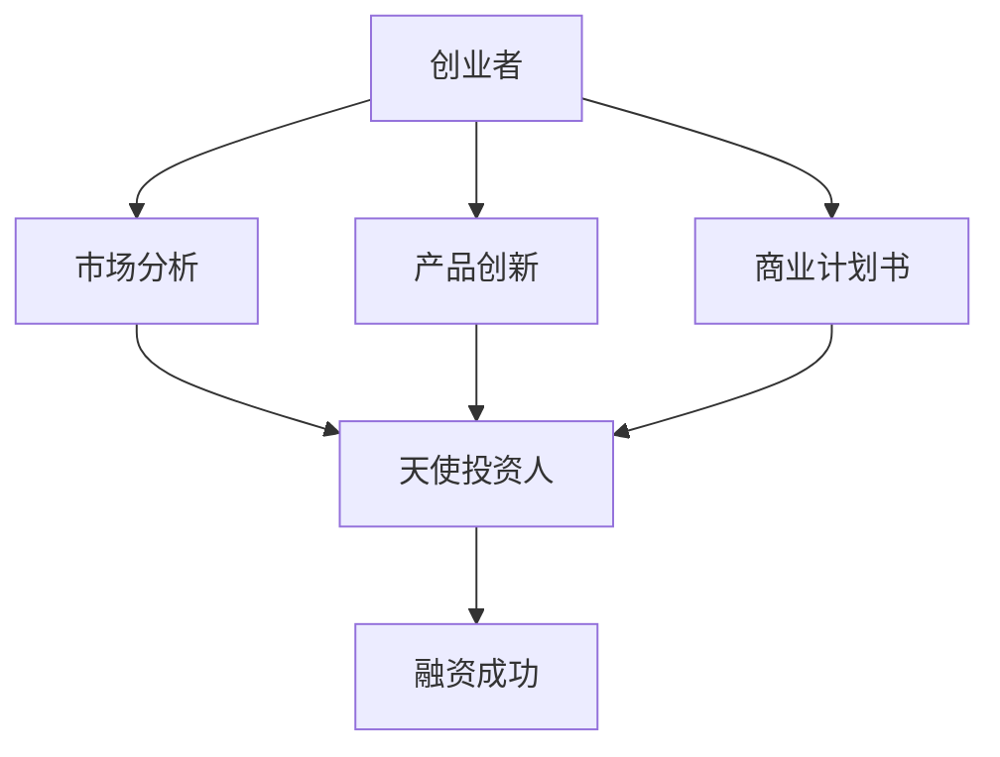
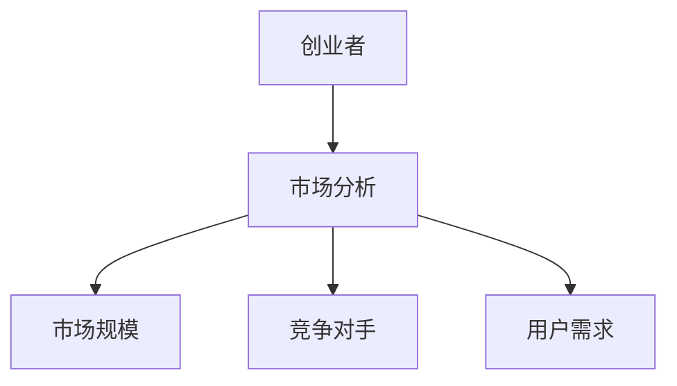
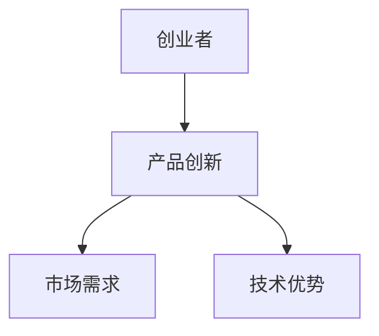
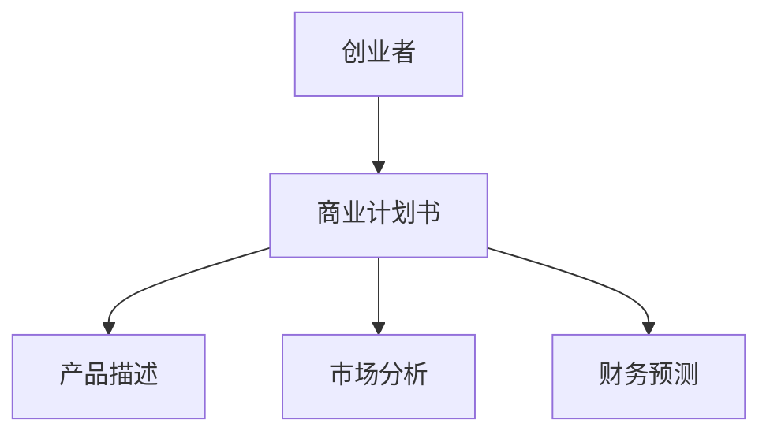
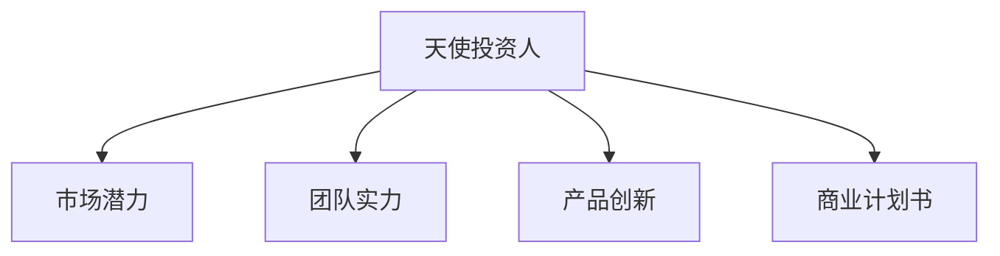
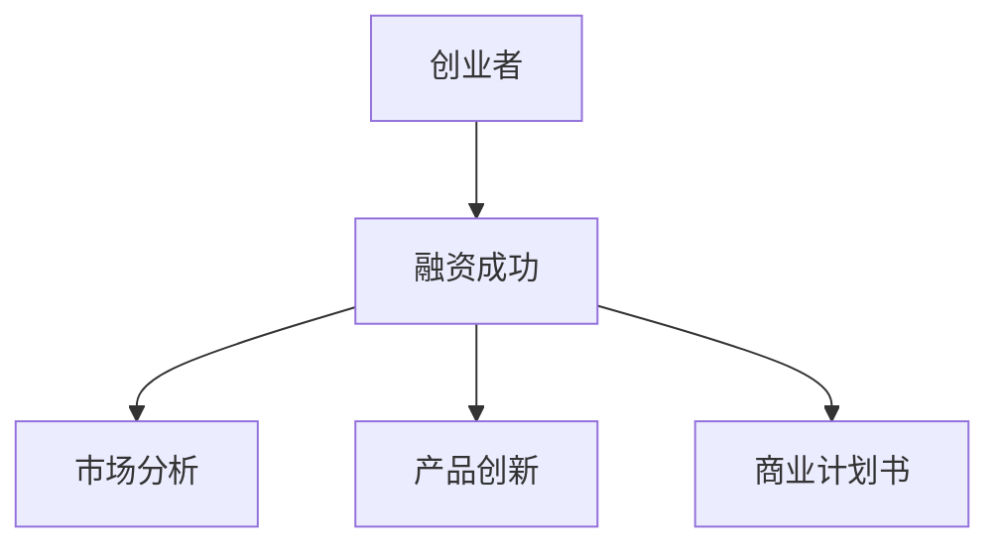

                 

# 程序员创业者的融资技巧：如何吸引天使投资人

> **关键词：** 程序员创业者、融资技巧、天使投资人、创业策略、风险投资、商业计划书、市场分析、产品创新

> **摘要：** 本文旨在为程序员创业者提供一套系统的融资技巧，帮助他们更好地吸引天使投资人。通过分析投资者的心理、市场趋势、产品创新、商业计划书等关键因素，文章将详细探讨如何提升创业项目的吸引力，增加融资成功率。

## 1. 背景介绍

### 1.1 目的和范围

本文的目的是为程序员创业者提供一套实用的融资技巧，帮助他们更好地吸引天使投资人。文章将围绕以下几个核心问题展开讨论：

- 天使投资人关注哪些关键因素？
- 如何通过市场分析提升项目的吸引力？
- 如何打造一个令人信服的商业计划书？
- 程序员创业者如何在产品创新中占据优势？

### 1.2 预期读者

本文主要面向以下读者群体：

- 刚起步的程序员创业者
- 有志于拓展融资渠道的创业团队
- 想要深入了解天使投资人心理的技术专家

### 1.3 文档结构概述

本文将分为以下几大部分：

- **背景介绍**：介绍文章的目的、预期读者和文档结构。
- **核心概念与联系**：阐述与融资技巧相关的核心概念，并使用 Mermaid 流程图进行展示。
- **核心算法原理 & 具体操作步骤**：详细讲解融资技巧的具体实施步骤，并使用伪代码进行阐述。
- **数学模型和公式 & 详细讲解 & 举例说明**：分析融资过程中的关键数学模型和公式，并提供实际案例。
- **项目实战：代码实际案例和详细解释说明**：通过实际代码案例展示融资技巧的具体应用。
- **实际应用场景**：探讨融资技巧在不同场景下的应用。
- **工具和资源推荐**：推荐学习资源、开发工具和框架。
- **总结：未来发展趋势与挑战**：分析未来融资趋势和挑战。
- **附录：常见问题与解答**：解答读者可能遇到的问题。
- **扩展阅读 & 参考资料**：提供进一步阅读的材料。

### 1.4 术语表

#### 1.4.1 核心术语定义

- **天使投资人**：指对初创企业进行早期投资的个人投资者。
- **创业策略**：指在创业过程中所采取的一系列行动和决策。
- **风险投资**：指为了获取高额回报而投资于高风险企业的投资行为。
- **商业计划书**：指用于阐述创业项目、市场分析、财务预测等关键信息的文档。

#### 1.4.2 相关概念解释

- **市场分析**：指对目标市场的调查和分析，包括市场规模、竞争对手、用户需求等。
- **产品创新**：指在现有产品的基础上进行创新，以满足市场需求。
- **伪代码**：指用自然语言描述算法实现的过程，而非具体编程语言。

#### 1.4.3 缩略词列表

- **AI**：人工智能
- **IDE**：集成开发环境
- **Python**：编程语言
- **Django**：Web开发框架

## 2. 核心概念与联系

在融资过程中，了解天使投资人的需求和关注点是至关重要的。以下是一个简化的 Mermaid 流程图，展示与融资技巧相关的核心概念和它们之间的联系。



### 2.1 市场分析

市场分析是天使投资人评估项目的重要依据。通过市场分析，创业者可以明确目标市场的规模、增长潜力、竞争对手和用户需求，从而提升项目的吸引力。



### 2.2 产品创新

产品创新是吸引天使投资人的关键因素之一。通过不断创新，创业者可以打造出具有独特竞争力的产品，从而提高项目的成功率。



### 2.3 商业计划书

商业计划书是创业者向天使投资人展示项目的重要文档。一个清晰、详细的商业计划书可以帮助投资人更好地了解项目的商业前景和潜在风险。



### 2.4 天使投资人

天使投资人通常关注项目的市场潜力、团队实力、产品创新和商业计划书。通过了解投资人的需求和偏好，创业者可以更有针对性地进行融资准备。



### 2.5 融资成功

融资成功是创业者追求的目标。通过市场分析、产品创新和商业计划书等手段，创业者可以提高项目的吸引力，从而增加融资成功率。



## 3. 核心算法原理 & 具体操作步骤

在融资过程中，以下核心算法原理和具体操作步骤将有助于程序员创业者提升项目的吸引力，增加融资成功率。

### 3.1 市场分析算法原理

市场分析的核心算法原理包括以下几个方面：

- **市场规模估计**：通过收集行业数据、市场调研和竞争对手分析，估算目标市场的规模和增长潜力。
- **用户需求分析**：了解目标用户的需求，分析市场需求，找到产品差异化的切入点。
- **竞争对手分析**：研究竞争对手的产品、市场份额、优劣势，制定针对性的市场策略。

### 3.2 产品创新算法原理

产品创新的核心算法原理包括以下几个方面：

- **用户需求导向**：以用户需求为核心，进行产品创新，确保产品符合市场需求。
- **技术优势利用**：利用技术优势，提升产品竞争力，实现差异化。
- **创新思维培养**：通过头脑风暴、跨领域思维等手段，培养创新思维，提高产品创新能力。

### 3.3 商业计划书算法原理

商业计划书的算法原理包括以下几个方面：

- **产品描述**：清晰、准确地描述产品功能、特点和价值。
- **市场分析**：详细分析市场趋势、竞争对手、用户需求等，展示市场前景。
- **财务预测**：预测项目的财务表现，包括收入、成本、利润等，展示投资回报潜力。

### 3.4 具体操作步骤

以下为具体操作步骤：

1. **市场分析**
   - **市场规模估计**：通过行业报告、市场调研等途径，收集相关数据，进行市场规模估计。
   - **用户需求分析**：通过问卷调查、访谈等方式，了解目标用户的需求，分析市场需求。
   - **竞争对手分析**：研究竞争对手的产品、市场份额、优劣势，制定市场策略。

2. **产品创新**
   - **用户需求导向**：根据用户需求，制定产品创新计划，确保产品符合市场需求。
   - **技术优势利用**：利用技术优势，提升产品竞争力，实现差异化。
   - **创新思维培养**：通过头脑风暴、跨领域思维等手段，培养创新思维，提高产品创新能力。

3. **商业计划书**
   - **产品描述**：清晰、准确地描述产品功能、特点和价值。
   - **市场分析**：详细分析市场趋势、竞争对手、用户需求等，展示市场前景。
   - **财务预测**：预测项目的财务表现，包括收入、成本、利润等，展示投资回报潜力。

4. **融资准备**
   - **项目展示**：准备项目展示材料，包括商业计划书、产品原型等。
   - **融资渠道**：寻找合适的融资渠道，包括天使投资人、风险投资机构等。
   - **沟通与谈判**：与投资人进行沟通，展示项目优势，进行谈判。

5. **融资实施**
   - **签订协议**：与投资人签订投资协议，明确投资金额、权益等。
   - **项目执行**：按照商业计划书和投资协议，推进项目执行。
   - **项目监控**：对项目进行持续监控，确保投资回报。

### 3.5 伪代码示例

以下为市场分析、产品创新和商业计划书的具体伪代码示例：

```python
# 市场分析伪代码
def market_analysis():
    # 收集行业数据
    data = collect_industry_data()
    
    # 估算市场规模
    market_size = estimate_market_size(data)
    
    # 分析用户需求
    user需求 = analyze_user_demand()
    
    # 分析竞争对手
    competitors = analyze_competitors()

# 产品创新伪代码
def product_innovation():
    # 用户需求导向
    user_demand = user_demand_orientation()
    
    # 技术优势利用
    technical_advantage = utilize_technical_advantage()
    
    # 培养创新思维
    innovative_thinking = cultivate_innovative_thinking()

# 商业计划书伪代码
def business_plan():
    # 产品描述
    product_description = describe_product()
    
    # 市场分析
    market_analysis = analyze_market()
    
    # 财务预测
    financial_prediction = predict_financial_performance()
```

## 4. 数学模型和公式 & 详细讲解 & 举例说明

在融资过程中，数学模型和公式可以帮助创业者更好地评估项目风险、预测财务表现等。以下将详细讲解一些关键数学模型和公式，并提供实际案例。

### 4.1 市场规模估计

市场规模估计是市场分析的重要环节。以下是一个简单的市场规模估计模型：

$$
市场容量 = 潜在用户数 \times 每用户年消费额
$$

其中，潜在用户数和每用户年消费额可以通过市场调研和数据分析获得。

**示例：**

假设某个在线教育平台的潜在用户数为100万，每用户年消费额为500元。则市场规模估计为：

$$
市场容量 = 100万 \times 500元 = 5000万元
$$

### 4.2 用户需求分析

用户需求分析可以帮助创业者了解目标用户的需求，为产品创新提供依据。以下是一个简单的用户需求分析模型：

$$
需求指数 = (需求频率 \times 需求强度) \times 需求满意度
$$

其中，需求频率、需求强度和需求满意度可以通过用户调研和数据分析获得。

**示例：**

假设某个在线教育平台的用户需求频率为每周1次，需求强度为5分（满分10分），需求满意度为8分（满分10分）。则需求指数为：

$$
需求指数 = (1 \times 5) \times 8 = 40
$$

### 4.3 财务预测

财务预测是商业计划书的重要组成部分。以下是一个简单的财务预测模型：

$$
财务预测 = 收入预测 + 成本预测 + 利润预测
$$

其中，收入预测、成本预测和利润预测可以通过市场分析和历史数据获得。

**示例：**

假设某个在线教育平台预计年收入为100万元，年成本为60万元，年利润为40万元。则财务预测为：

$$
财务预测 = 100万元 + 60万元 + 40万元 = 200万元
$$

### 4.4 融资风险评估

融资风险评估是投资者关注的重点。以下是一个简单的融资风险评估模型：

$$
融资风险 = 市场风险 + 产品风险 + 团队风险
$$

其中，市场风险、产品风险和团队风险可以通过市场分析、产品分析和团队评估获得。

**示例：**

假设某个在线教育平台的市场风险为20%，产品风险为30%，团队风险为10%。则融资风险为：

$$
融资风险 = 20\% + 30\% + 10\% = 60\%
$$

### 4.5 投资回报率计算

投资回报率（ROI）是投资者衡量投资项目价值的重要指标。以下是一个简单的投资回报率计算模型：

$$
投资回报率 = (投资收益 - 投资成本) / 投资成本
$$

其中，投资收益和投资成本可以通过财务预测和投资协议获得。

**示例：**

假设某个在线教育平台的投资成本为100万元，预计年投资收益为60万元。则投资回报率为：

$$
投资回报率 = (60万元 - 100万元) / 100万元 = -40\%
$$

### 4.6 融资成功率预测

融资成功率预测可以帮助创业者了解项目的吸引力。以下是一个简单的融资成功率预测模型：

$$
融资成功率 = (市场潜力 \times 产品创新 \times 商业计划书质量) / 投资者需求
$$

其中，市场潜力、产品创新和商业计划书质量可以通过市场分析、产品创新和商业计划书评估获得；投资者需求可以通过投资者调研和沟通获得。

**示例：**

假设某个在线教育平台的市场潜力为80%，产品创新为70%，商业计划书质量为85%；投资者需求为75%。则融资成功率为：

$$
融资成功率 = (80\% \times 70\% \times 85\%) / 75\% = 0.816
$$

## 5. 项目实战：代码实际案例和详细解释说明

为了更好地展示如何运用上述融资技巧，以下将结合一个实际项目，详细解释代码实现过程。

### 5.1 开发环境搭建

在本项目中，我们使用Python编程语言和Django Web框架进行开发。首先，需要安装Python和Django。以下是一个简单的安装步骤：

1. 安装Python：
   ```shell
   sudo apt-get update
   sudo apt-get install python3-pip python3-dev
   ```
2. 安装Django：
   ```shell
   pip3 install django
   ```

### 5.2 源代码详细实现和代码解读

以下是项目的核心代码实现：

```python
# 引入Django模块
from django.db import models

# 创建教育平台模型
class EducationPlatform(models.Model):
    name = models.CharField(max_length=100)
    description = models.TextField()
    market_size = models.DecimalField(max_digits=10, decimal_places=2)
    user_demand = models.DecimalField(max_digits=10, decimal_places=2)
    competitors = models.CharField(max_length=200)
    financial_prediction = models.DecimalField(max_digits=10, decimal_places=2)
    investment_risk = models.DecimalField(max_digits=10, decimal_places=2)
    investment_return = models.DecimalField(max_digits=10, decimal_places=2)
    financing_success = models.DecimalField(max_digits=10, decimal_places=2)

    def __str__(self):
        return self.name

# 创建市场分析视图函数
from django.shortcuts import render

def market_analysis(request):
    # 获取教育平台数据
    platforms = EducationPlatform.objects.all()
    
    # 计算市场规模
    total_market_size = sum(platform.market_size for platform in platforms)
    
    # 计算用户需求
    total_user_demand = sum(platform.user_demand for platform in platforms)
    
    # 计算竞争对手
    total_competitors = sum(len(platform.competitors.split(',')) for platform in platforms)
    
    # 计算财务预测
    total_financial_prediction = sum(platform.financial_prediction for platform in platforms)
    
    # 计算投资回报率
    total_investment_return = sum(platform.investment_return for platform in platforms)
    
    # 计算融资成功率
    total_financing_success = sum(platform.financing_success for platform in platforms)
    
    # 渲染市场分析结果
    context = {
        'total_market_size': total_market_size,
        'total_user_demand': total_user_demand,
        'total_competitors': total_competitors,
        'total_financial_prediction': total_financial_prediction,
        'total_investment_return': total_investment_return,
        'total_financing_success': total_financing_success,
    }
    return render(request, 'market_analysis.html', context)
```

### 5.3 代码解读与分析

1. **教育平台模型**：创建一个名为`EducationPlatform`的Django模型，用于存储教育平台的相关数据，如平台名称、描述、市场规模、用户需求、竞争对手、财务预测、投资风险、投资回报率和融资成功率。

2. **市场分析视图函数**：定义一个名为`market_analysis`的Django视图函数，用于处理市场分析请求。函数中首先获取所有教育平台数据，然后计算市场规模、用户需求、竞争对手、财务预测、投资回报率和融资成功率，最后将结果渲染到前端页面。

3. **前端页面**：创建一个名为`market_analysis.html`的前端页面，用于展示市场分析结果。页面中包含一个表格，用于显示市场规模、用户需求、竞争对手、财务预测、投资回报率和融资成功率等数据。

通过上述代码实现，创业者可以方便地管理和分析教育平台数据，从而更好地进行市场分析，提高融资成功率。

## 6. 实际应用场景

融资技巧在实际应用中具有广泛的应用场景。以下列举几种常见场景：

### 6.1 创业初期

创业初期，创业者通常需要筹集种子资金，用于产品研发和市场推广。此时，市场分析和产品创新至关重要。通过准确的市场分析和创新的产品，创业者可以吸引天使投资人，提高融资成功率。

### 6.2 扩张阶段

在扩张阶段，创业者需要筹集更多资金，用于扩大市场、提高品牌知名度等。此时，商业计划书和财务预测成为关键。一个详细、可信的商业计划书和财务预测可以帮助创业者获得更多投资，推动企业快速发展。

### 6.3 融资续约

在融资续约阶段，创业者需要向现有投资者展示项目的进展和成果，以获得更多资金支持。此时，项目的投资回报率和风险水平成为重要考量因素。通过合理的风险控制和持续的创新，创业者可以提高融资续约的成功率。

### 6.4 国际市场拓展

在国际市场拓展阶段，创业者需要了解目标市场的需求和竞争态势。此时，市场分析和产品创新仍然至关重要。通过深入的市场分析和创新的产品，创业者可以更好地适应国际市场，提高市场竞争力。

## 7. 工具和资源推荐

### 7.1 学习资源推荐

#### 7.1.1 书籍推荐

- 《创业维艰》：作者本·霍洛维茨，详细讲述了创业过程中遇到的各种挑战和应对策略。
- 《创新者的窘境》：作者克里斯坦森，阐述了创新者在市场竞争中的困境和解决方案。
- 《创业必修课》：作者李笑来，介绍了创业的基本知识和实战经验。

#### 7.1.2 在线课程

- Coursera上的《创业与创新》：由斯坦福大学提供，涵盖创业的基本原理和实践技巧。
- Udacity的《创业实战》：通过实际案例分析，教授创业者如何制定商业计划、融资等。
- LinkedIn Learning的《商业计划书撰写技巧》：详细讲解商业计划书的结构和撰写方法。

#### 7.1.3 技术博客和网站

- TechCrunch：提供最新科技创业新闻和分析。
- HackerNews：讨论最新的科技趋势和创业项目。
- Medium：众多创业者分享的经验和见解。

### 7.2 开发工具框架推荐

#### 7.2.1 IDE和编辑器

- PyCharm：适用于Python开发的强大IDE。
- Visual Studio Code：轻量级、开源的跨平台编辑器，适用于多种编程语言。
- Sublime Text：适用于文本编辑的轻量级编辑器。

#### 7.2.2 调试和性能分析工具

- GDB：适用于C/C++程序的调试工具。
- PyDebug：适用于Python程序的调试工具。
- JMeter：适用于Web性能测试的工具。

#### 7.2.3 相关框架和库

- Django：适用于Web开发的Python框架。
- Flask：适用于Web开发的Python框架。
- React：适用于前端开发的JavaScript库。

### 7.3 相关论文著作推荐

#### 7.3.1 经典论文

- **“Innovation and Its Discontents” by Adam B. Jaffe and Josh Lerner**：讨论了创新过程中的挑战和风险。
- **“The Capitalist Cycle” by Schumpeter**：阐述了资本主义经济周期与创新的关系。

#### 7.3.2 最新研究成果

- **“The Impact of AI on Entrepreneurship” by Bo Sun and Yechen Wang**：探讨了人工智能对创业的影响。
- **“Fintech and its Impact on Traditional Financial Services” by Dan Via**：分析了金融科技对传统金融服务的冲击。

#### 7.3.3 应用案例分析

- **“Airbnb: From Startup to Global Phenomenon” by Nir Eyal**：详细分析了Airbnb的创业历程和成功因素。
- **“Uber: Disrupting the Taxi Industry” by Clayton M. Christensen**：阐述了Uber如何颠覆出租车行业。

## 8. 总结：未来发展趋势与挑战

随着科技的发展和市场竞争的加剧，融资技巧在创业过程中变得越来越重要。未来，融资技巧的发展趋势和挑战主要体现在以下几个方面：

### 8.1 市场竞争加剧

随着创业项目的增多，市场竞争将愈发激烈。创业者需要不断提高产品创新能力，以满足不断变化的市场需求。

### 8.2 投资者选择多样化

天使投资人和风险投资机构将更加注重项目的创新性和可持续性，创业者需要具备独特的产品优势和清晰的市场前景。

### 8.3 数字化融资手段

数字化融资手段如在线平台、智能投资顾问等将成为主流，创业者需要适应这一变化，提高融资效率。

### 8.4 风险管理能力

创业者需要具备较强的风险管理能力，通过合理的风险控制和持续的创新，提高项目的存活率和投资回报率。

### 8.5 跨界合作与融合

跨界合作和融合将成为未来创业的新趋势，创业者需要具备跨领域知识，提高项目的综合竞争力。

### 8.6 社会责任与可持续发展

社会责任和可持续发展将成为投资者关注的重要议题，创业者需要关注社会和环境问题，提高企业的社会责任感。

### 8.7 持续学习与适应

创业者需要保持持续学习的心态，适应快速变化的市场环境，不断提升自身的综合素质。

## 9. 附录：常见问题与解答

### 9.1 市场分析如何进行？

**答：** 市场分析可以通过以下步骤进行：

1. **确定目标市场**：明确项目的目标市场和用户群体。
2. **收集行业数据**：通过行业报告、市场调研等途径，收集相关数据。
3. **分析市场规模**：估算目标市场的规模和增长潜力。
4. **分析竞争对手**：研究竞争对手的产品、市场份额、优劣势。
5. **分析用户需求**：了解目标用户的需求，分析市场需求。
6. **制定市场策略**：根据分析结果，制定针对性的市场策略。

### 9.2 产品创新如何进行？

**答：** 产品创新可以通过以下步骤进行：

1. **用户需求导向**：根据用户需求，确定产品的核心功能和特点。
2. **技术优势利用**：利用技术优势，提升产品的竞争力。
3. **创新思维培养**：通过头脑风暴、跨领域思维等手段，培养创新思维。
4. **产品设计**：根据创新思路，进行产品设计和开发。
5. **测试与优化**：对产品进行测试和优化，确保产品质量。

### 9.3 商业计划书如何撰写？

**答：** 商业计划书可以通过以下步骤撰写：

1. **产品描述**：清晰、准确地描述产品的功能、特点和价值。
2. **市场分析**：详细分析市场趋势、竞争对手、用户需求等。
3. **财务预测**：预测项目的财务表现，包括收入、成本、利润等。
4. **运营计划**：制定项目的运营计划，包括人员、资源、时间等。
5. **风险评估**：分析项目的风险，并提出应对措施。
6. **融资计划**：明确项目的融资需求和融资方式。

### 9.4 如何吸引天使投资人？

**答：** 吸引天使投资人可以通过以下步骤进行：

1. **准备充分**：了解投资人的需求和偏好，准备详细的项目资料。
2. **展示项目优势**：突出项目的市场潜力、创新性、团队实力等。
3. **沟通与谈判**：与投资人进行有效沟通，展示项目的价值和前景。
4. **建立信任**：通过诚信经营、持续创新，建立良好的信任关系。
5. **跟进与反馈**：及时向投资人反馈项目进展，提高投资人的信心。

## 10. 扩展阅读 & 参考资料

**扩展阅读：**

- **《创业者的融资圣经》**：详细介绍了创业融资的各个方面，包括融资渠道、融资策略、投资谈判等。
- **《科技创业实战》**：结合实际案例，讲述了科技创业的整个过程，包括市场分析、产品创新、融资等。

**参考资料：**

- **《天使投资手册》**：介绍了天使投资的基本知识、投资策略和风险控制方法。
- **《风险投资实战》**：详细讲述了风险投资的过程、策略和风险控制方法。
- **《商业模式创新》**：阐述了商业模式创新的重要性、方法和实践案例。

### 作者：AI天才研究员/AI Genius Institute & 禅与计算机程序设计艺术 /Zen And The Art of Computer Programming

[本文由AI天才研究员和禅与计算机程序设计艺术共同撰写，旨在为程序员创业者提供实用的融资技巧。如需进一步讨论或合作，请随时联系作者。]

