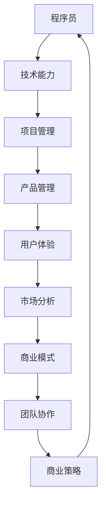

                 

# 程序员到产品经理：AI电商创业者的角色转变之路

> **关键词**：程序员、产品经理、AI电商、角色转变、创业、商业策略、用户体验、技术领导力

> **摘要**：本文旨在探讨程序员从技术岗位转型为产品经理，特别是在AI电商创业领域的角色转变之路。我们将深入分析这一过程中的核心概念、算法原理、数学模型以及实际应用案例，帮助读者理解这一转变的必要性和可行性。

## 1. 背景介绍

### 1.1 目的和范围

本文的目标是帮助程序员理解并成功转型为产品经理，特别是在AI电商领域。我们将探讨这一转型背后的动机、面临的挑战，并提供实用的策略和工具。

本文的范围包括：

- 程序员到产品经理的角色转变
- AI电商领域的特点
- 核心概念、算法原理和数学模型的讲解
- 实际应用案例和项目实战
- 学习资源和工具推荐

### 1.2 预期读者

- 想要转型为产品经理的程序员
- 对AI电商和产品管理感兴趣的创业者
- 产品经理和项目经理，希望了解程序员视角的产品开发

### 1.3 文档结构概述

本文结构如下：

- 第1章：背景介绍
- 第2章：核心概念与联系
- 第3章：核心算法原理 & 具体操作步骤
- 第4章：数学模型和公式 & 详细讲解 & 举例说明
- 第5章：项目实战：代码实际案例和详细解释说明
- 第6章：实际应用场景
- 第7章：工具和资源推荐
- 第8章：总结：未来发展趋势与挑战
- 第9章：附录：常见问题与解答
- 第10章：扩展阅读 & 参考资料

### 1.4 术语表

#### 1.4.1 核心术语定义

- **程序员**：编写、测试、维护计算机程序的专业人士。
- **产品经理**：负责产品规划、设计、研发、上线和运营的全过程。
- **AI电商**：利用人工智能技术提升电商效率和用户体验的电商平台。
- **角色转变**：从技术岗位转向管理岗位，如从程序员到产品经理。

#### 1.4.2 相关概念解释

- **用户体验**：用户在使用产品过程中的感受和体验。
- **技术领导力**：在技术领域内引领团队、管理和推动项目的能力。

#### 1.4.3 缩略词列表

- **AI**：人工智能
- **UI/UX**：用户界面/用户体验
- **API**：应用程序编程接口
- **SDK**：软件开发工具包

## 2. 核心概念与联系

在程序员转型为产品经理的过程中，理解核心概念和它们之间的联系是至关重要的。以下是一个简单的Mermaid流程图，展示了一些关键概念和它们之间的关系。



### 2.1 技术能力

技术能力是程序员转型为产品经理的基石。它包括编程语言、数据库管理、前端和后端开发、算法设计等。这些技能不仅帮助产品经理理解技术实现，还能在技术选型和性能优化时提供支持。

### 2.2 项目管理

项目管理能力是产品经理的核心技能之一。它包括规划、进度管理、资源分配、风险管理等。这些技能有助于确保产品按时、按预算完成，并在复杂环境中保持团队的动力和目标一致。

### 2.3 产品管理

产品管理是将技术和业务需求结合起来的关键。产品经理需要定义产品的愿景、功能、用户故事和用户需求。他们还需要协调跨功能团队的协作，确保产品的成功交付和持续改进。

### 2.4 用户体验

用户体验（UX）是产品成功的重要因素。产品经理需要了解用户需求、设计原则和用户研究方法，以便创建直观、易于使用且符合用户期望的产品。

### 2.5 市场分析

市场分析是产品经理的另一项关键技能。了解市场需求、竞争对手和用户行为有助于产品经理制定有效的市场策略和推广计划。

### 2.6 商业模式

商业模式是产品盈利的途径。产品经理需要分析市场机会、成本结构和收入模型，确保产品不仅满足用户需求，还能实现商业成功。

### 2.7 团队协作

团队协作是产品经理成功的关键。他们需要与设计师、开发人员、市场营销人员和其他利益相关者密切合作，确保产品在不同阶段都能顺利进行。

### 2.8 商业策略

商业策略是产品长期成功的关键。产品经理需要制定并执行增长策略、市场定位和竞争策略，确保产品在激烈的市场环境中脱颖而出。

## 3. 核心算法原理 & 具体操作步骤

在转型过程中，程序员需要掌握一些核心算法原理，这些原理将帮助他们更好地理解产品管理和商业策略。以下是一个简单的伪代码，用于解释推荐系统的基本算法。

```python
# 推荐系统算法伪代码

# 输入：用户历史行为数据、商品特征数据
# 输出：推荐商品列表

def recommendation_system(user_behavior, product_features):
    # 步骤1：用户行为分析
    user_profile = analyze_user_behavior(user_behavior)
    
    # 步骤2：商品特征分析
    product_similarity = analyze_product_features(product_features)
    
    # 步骤3：计算相似度
    similarity_scores = calculate_similarity_scores(user_profile, product_similarity)
    
    # 步骤4：排序推荐列表
    recommended_products = sort_recommendations(similarity_scores)
    
    return recommended_products
```

### 3.1 用户行为分析

用户行为分析是推荐系统的核心。通过分析用户的历史行为，如浏览、购买和评价，我们可以构建用户的兴趣模型。

```python
# 用户行为分析伪代码

def analyze_user_behavior(user_behavior):
    # 步骤1：提取用户行为数据
    # 步骤2：构建用户兴趣模型
    user_interests = build_user_interest_model(user_behavior)
    
    return user_interests
```

### 3.2 商品特征分析

商品特征分析涉及提取和整理商品数据，如类别、价格、品牌、评价等。

```python
# 商品特征分析伪代码

def analyze_product_features(product_features):
    # 步骤1：提取商品特征数据
    # 步骤2：构建商品相似度矩阵
    product_similarity_matrix = build_product_similarity_matrix(product_features)
    
    return product_similarity_matrix
```

### 3.3 计算相似度

相似度计算是推荐系统的关键步骤。通过计算用户兴趣模型和商品特征矩阵之间的相似度，我们可以为每个商品打分。

```python
# 计算相似度伪代码

def calculate_similarity_scores(user_profile, product_similarity):
    similarity_scores = {}
    for product in product_similarity:
        similarity_score = calculate_similarity(user_profile, product)
        similarity_scores[product] = similarity_score
        
    return similarity_scores
```

### 3.4 排序推荐列表

最后，我们将相似度分数排序，以生成推荐列表。

```python
# 排序推荐列表伪代码

def sort_recommendations(similarity_scores):
    sorted_products = sorted(similarity_scores, key=similarity_scores.get, reverse=True)
    return sorted_products
```

## 4. 数学模型和公式 & 详细讲解 & 举例说明

在推荐系统中，数学模型和公式起着至关重要的作用。以下是一个简单的线性回归模型，用于预测用户对商品的评分。

### 4.1 线性回归模型

线性回归模型是一种预测连续值的统计模型。在推荐系统中，它可以用于预测用户对商品的评分。

$$
y = \beta_0 + \beta_1x_1 + \beta_2x_2 + ... + \beta_nx_n
$$

其中：

- $y$：预测的评分
- $x_1, x_2, ..., x_n$：商品的特性值
- $\beta_0, \beta_1, \beta_2, ..., \beta_n$：模型参数

### 4.2 参数估计

参数估计是线性回归模型的关键步骤。我们使用最小二乘法（Least Squares Method）来估计模型参数。

$$
\beta = (X^T X)^{-1} X^T y
$$

其中：

- $X$：特征矩阵
- $y$：目标向量
- $(X^T X)^{-1}$：特征矩阵的逆矩阵

### 4.3 举例说明

假设我们有一个简单的商品特征矩阵和用户评分数据：

| 商品ID | 特征1 | 特征2 |
|--------|-------|-------|
| 1      | 5     | 10    |
| 2      | 7     | 15    |
| 3      | 3     | 8     |

用户评分数据：

| 商品ID | 用户评分 |
|--------|----------|
| 1      | 4        |
| 2      | 5        |
| 3      | 3        |

我们可以使用线性回归模型来预测用户对未知商品的评分。

### 4.4 应用场景

线性回归模型在推荐系统中应用广泛，例如：

- 商品评分预测
- 用户偏好分析
- 推荐列表排序

## 5. 项目实战：代码实际案例和详细解释说明

在本节中，我们将通过一个实际项目来展示程序员如何将算法和数学模型应用于AI电商场景。

### 5.1 开发环境搭建

为了实现这个项目，我们使用以下开发环境和工具：

- Python 3.8
- Jupyter Notebook
- Scikit-learn 库
- Pandas 库
- Matplotlib 库

### 5.2 源代码详细实现和代码解读

以下是一个简单的推荐系统实现，它使用用户历史行为数据和商品特征数据来预测用户评分。

```python
import pandas as pd
from sklearn.linear_model import LinearRegression
from sklearn.model_selection import train_test_split
import matplotlib.pyplot as plt

# 加载用户行为数据
user_behavior = pd.read_csv('user_behavior.csv')

# 加载商品特征数据
product_features = pd.read_csv('product_features.csv')

# 合并数据
data = pd.merge(user_behavior, product_features, on='product_id')

# 分离特征和目标
X = data[['feature_1', 'feature_2']]
y = data['rating']

# 划分训练集和测试集
X_train, X_test, y_train, y_test = train_test_split(X, y, test_size=0.2, random_state=42)

# 创建线性回归模型
model = LinearRegression()

# 训练模型
model.fit(X_train, y_train)

# 测试模型
predictions = model.predict(X_test)

# 绘制预测结果
plt.scatter(y_test, predictions)
plt.xlabel('Actual Ratings')
plt.ylabel('Predicted Ratings')
plt.title('Actual vs Predicted Ratings')
plt.show()
```

### 5.3 代码解读与分析

这段代码首先加载用户行为数据和商品特征数据，然后合并这两个数据集。接下来，它分离出特征和目标变量，并使用`train_test_split`函数将数据集划分为训练集和测试集。

使用`LinearRegression`类创建线性回归模型，并使用`fit`方法训练模型。最后，使用`predict`方法对测试集进行预测，并使用`matplotlib`库绘制实际评分与预测评分的散点图。

这个简单示例展示了如何将线性回归模型应用于推荐系统，以预测用户对商品的评分。在实际应用中，我们可以扩展这个模型，包括更多的特征和复杂的算法，以提高预测准确性。

## 6. 实际应用场景

AI电商领域的实际应用场景包括：

- **个性化推荐**：基于用户行为和历史数据，为用户推荐可能感兴趣的商品。
- **用户行为预测**：预测用户的购买行为、评价和反馈，以优化营销策略。
- **商品排序**：根据用户的兴趣和偏好，动态调整商品展示顺序，提高转化率。
- **库存管理**：利用预测算法优化库存，减少库存积压和商品短缺。
- **客户支持**：通过自然语言处理技术，自动回答客户问题，提高服务质量。

## 7. 工具和资源推荐

### 7.1 学习资源推荐

#### 7.1.1 书籍推荐

- 《产品经理手册》
- 《用户体验要素》
- 《推荐系统实践》

#### 7.1.2 在线课程

- Coursera 的“产品管理专业课程”
- Udacity 的“数据科学纳米学位”
- edX 的“机器学习专业课程”

#### 7.1.3 技术博客和网站

- Medium 上的产品管理博客
- Product Hunt
- Hacker News

### 7.2 开发工具框架推荐

#### 7.2.1 IDE和编辑器

- Visual Studio Code
- PyCharm
- Jupyter Notebook

#### 7.2.2 调试和性能分析工具

- Python Debuger
- Matplotlib
- Pandas Profiler

#### 7.2.3 相关框架和库

- Scikit-learn
- TensorFlow
- PyTorch

### 7.3 相关论文著作推荐

#### 7.3.1 经典论文

- “The PageRank Citation Ranking: Bringing Order to the Web”
- “Collaborative Filtering for the Web”

#### 7.3.2 最新研究成果

- “Recommender Systems: The Textbook”
- “Deep Learning for Recommender Systems”

#### 7.3.3 应用案例分析

- “淘宝推荐系统技术实践”
- “京东推荐系统实践与优化”

## 8. 总结：未来发展趋势与挑战

随着人工智能和大数据技术的发展，AI电商领域的未来发展趋势包括：

- **更加个性化的推荐**：利用深度学习和强化学习技术，为用户提供高度个性化的购物体验。
- **实时推荐**：通过实时数据分析和计算，实现实时商品推荐。
- **跨平台融合**：整合线上线下购物体验，提供无缝的购物体验。
- **智能客服**：利用自然语言处理技术，提供更加智能和高效的客户支持。

然而，这一领域也面临着以下挑战：

- **数据隐私**：确保用户数据的安全和隐私。
- **算法公平性**：避免算法偏见和歧视。
- **技术升级**：保持技术更新，以适应快速变化的市场需求。

## 9. 附录：常见问题与解答

### 9.1 什么是推荐系统？

推荐系统是一种基于用户行为、偏好和上下文信息，向用户推荐可能感兴趣的商品或内容的技术。它广泛应用于电商、社交媒体、音乐和视频平台等。

### 9.2 产品经理需要掌握哪些技能？

产品经理需要掌握技能包括项目管理、市场分析、用户体验设计、技术领导力、沟通协调等。此外，对业务模式和商业策略也有深入理解。

### 9.3 如何进行用户行为分析？

用户行为分析包括数据收集、用户画像构建、行为模式识别和预测等步骤。通过分析用户的历史行为，如浏览、购买和评价，可以了解用户的需求和偏好。

## 10. 扩展阅读 & 参考资料

- [推荐系统实战](https://www.recommenders-systems.com/)
- [产品经理手册](https://www.productmanagerhandbook.com/)
- [大数据与人工智能](https://www.bigdata-ai.com/)
- [Python数据科学手册](https://www.python-ds.com/)

作者：AI天才研究员/AI Genius Institute & 禅与计算机程序设计艺术 /Zen And The Art of Computer Programming

