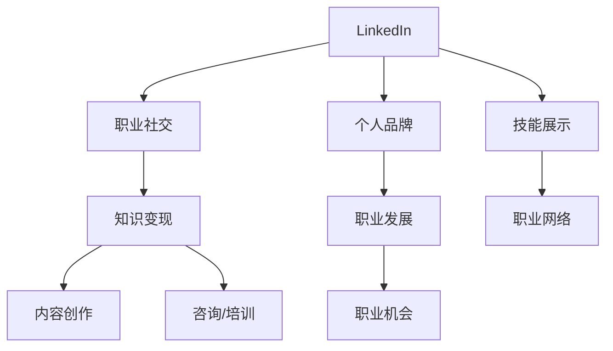

                 

## 程序员如何利用LinkedIn进行知识变现

### 关键词：LinkedIn，知识变现，个人品牌，职业发展，社交网络

> 摘要：本文将探讨程序员如何通过LinkedIn这个全球领先的职业社交平台，实现知识的有效变现。我们将深入分析LinkedIn的使用技巧、内容创作策略、社交互动技巧，并分享一些成功案例，帮助程序员们搭建自己的知识变现体系。

### 1. 背景介绍

#### 1.1 目的和范围

本文旨在为程序员提供一套完整的策略，以帮助他们在LinkedIn上实现知识变现。我们将从以下几个方面进行探讨：

- LinkedIn的运作原理及其对程序员职业发展的重要性
- 程序员如何在LinkedIn上构建个人品牌
- 知识变现的策略和实践，包括内容创作、社交媒体互动、以及商业化途径
- 成功案例分享及经验总结

#### 1.2 预期读者

本文适用于以下群体：

- 有志于在LinkedIn上拓展职业影响力的程序员
- 想要在社交网络上建立专业形象的初级和中级程序员
- 希望通过LinkedIn提升职业价值的IT行业从业者

#### 1.3 文档结构概述

本文将分为以下几个部分：

- 背景介绍：目的和范围、预期读者、文档结构概述
- 核心概念与联系：LinkedIn的功能、职业发展机会
- 核心算法原理与具体操作步骤：LinkedIn账号优化、内容创作策略
- 数学模型和公式：数据可视化、关键词优化
- 项目实战：代码实际案例和详细解释说明
- 实际应用场景
- 工具和资源推荐
- 总结：未来发展趋势与挑战
- 附录：常见问题与解答
- 扩展阅读与参考资料

#### 1.4 术语表

在本文中，我们将使用以下术语：

- **LinkedIn**：全球领先的职业社交平台
- **知识变现**：将个人知识或专业技能转化为实际收益的过程
- **个人品牌**：个人在专业领域的知名度和影响力
- **职业发展**：职业规划、晋升、职业网络拓展等过程

### 1.4.1 核心术语定义

- **LinkedIn**：LinkedIn是一个专为职业人士设计的社交网络平台，用户可以创建个人资料、展示专业技能、寻找工作机会，并与其他职业人士建立联系。
- **知识变现**：知识变现是指将个人知识、技能或经验转化为物质财富的过程，通常通过咨询、培训、内容创作、产品销售等方式实现。
- **个人品牌**：个人品牌是一个人的专业形象和声誉，包括个人技能、经验和价值观等，有助于在职业领域中建立权威和信任。
- **职业发展**：职业发展是一个持续的过程，涉及职业目标的设定、技能提升、职业网络的拓展和职业机会的把握。

#### 1.4.2 相关概念解释

- **社交网络**：社交网络是指由个体及其关系构成的网络结构，个体之间的互动和联系通过这个网络进行。
- **内容创作**：内容创作是指创建有价值的、吸引人的信息或内容，包括文章、博客、视频、播客等。
- **商业化**：商业化是指将某种活动或产品转化为商业行为，以实现经济收益。

#### 1.4.3 缩略词列表

- **LinkedIn**：LinkedIn
- **知识变现**：KM
- **个人品牌**：PB
- **职业发展**：PD

### 2. 核心概念与联系

在本文中，我们将重点关注以下几个核心概念：

- **LinkedIn**：作为职业社交平台，LinkedIn为程序员提供了展示专业技能、拓展职业网络、寻找工作机会的重要渠道。
- **知识变现**：程序员可以通过LinkedIn实现知识变现，包括内容创作、咨询、培训等方式。
- **个人品牌**：建立强大的个人品牌有助于提升程序员的职业价值和市场竞争力。
- **职业发展**：通过LinkedIn，程序员可以更好地规划职业路径、抓住职业机会。

以下是这些核心概念的联系与互动关系的Mermaid流程图：



### 3. 核心算法原理与具体操作步骤

在实现知识变现的过程中，以下是几个关键步骤：

#### 3.1 LinkedIn账号优化

**算法原理：**LinkedIn账号优化包括完善个人资料、优化头像和背景、添加关键词等。

**具体操作步骤：**

1. **完善个人资料**：
   - **基本信息**：填写真实姓名、职位、所在公司、联系方式等。
   - **技能与经验**：详细描述专业技能和工作经验，使用关键词优化。
   - **教育背景**：填写完整的教育经历，突出专业课程和学位。

2. **优化头像和背景**：
   - **头像**：使用专业照片，避免使用生活照或卡通形象。
   - **背景**：使用与职业相关的图像，展示个人品牌。

3. **添加关键词**：
   - 在个人资料中添加与专业技能相关的关键词，提高在搜索引擎中的可见性。

**伪代码：**
```python
def optimize_linkedin_profile():
    # 完善基本信息
    update_basic_info(name, position, company, contact_info)
    # 添加技能与经验
    add_skills_and_experience(skills, experience)
    # 更新教育背景
    update_education_background(education)
    # 优化头像和背景
    update_avatar_and_cover_photo(avatar, cover_photo)
    # 添加关键词
    add_keywords(keywords)
```

#### 3.2 内容创作策略

**算法原理：**内容创作策略涉及选择合适的内容主题、内容形式和发布频率。

**具体操作步骤：**

1. **选择主题**：
   - **关注领域**：围绕个人专业领域和行业趋势选择主题。
   - **用户需求**：关注目标受众的兴趣和需求。

2. **内容形式**：
   - **文章**：撰写高质量的博客文章，分享技术见解和经验。
   - **视频**：制作技术教程和讲座视频，展示个人技能。
   - **播客**：参与技术话题的讨论，增加专业影响力。

3. **发布频率**：
   - **规律发布**：保持定期发布内容，形成固定的读者群体。

**伪代码：**
```python
def create_content_strategy():
    # 选择主题
    select_topic(area_of_interest, user_needs)
    # 确定内容形式
    determine_content_format(article, video, podcast)
    # 制定发布计划
    set_publish_schedule(frequency)
```

#### 3.3 社交互动技巧

**算法原理：**社交互动技巧包括评论、点赞、分享、私信等，旨在建立和维持职业网络。

**具体操作步骤：**

1. **评论**：
   - 对他人内容进行有建设性的评论，展示专业知识和见解。

2. **点赞和分享**：
   - 给有价值的内容点赞和分享，增加内容的曝光度。

3. **私信**：
   - 发送有针对性的私信，与行业内的专业人士建立联系。

**伪代码：**
```python
def social_interact_strategy():
    # 评论
    comment_on_content(constructive_comments)
    # 点赞和分享
    like_and_share_content(value_content)
    # 私信
    send_personal_messages(target_individuals)
```

### 4. 数学模型和公式

在LinkedIn上进行知识变现的过程中，可以使用以下数学模型和公式来评估效果：

#### 4.1 数据可视化

**公式：**$$ V = \frac{E}{I} $$

- **V**：数据可视化效果
- **E**：数据准备和呈现的投入
- **I**：用户对数据可视化的兴趣和接受度

**详细讲解：**数据可视化是展示数据和统计信息的重要手段。通过有效的数据可视化，用户可以更容易地理解和分析数据。公式中的E代表数据准备和呈现的投入，包括数据清洗、图表设计等；I代表用户对数据可视化的兴趣和接受度，取决于数据可视化的质量和内容的相关性。提高数据可视化效果，需要平衡E和I，创造更具吸引力和实用性的数据呈现。

#### 4.2 关键词优化

**公式：**$$ KW = \log(\frac{views}{clicks}) $$

- **KW**：关键词优化效果
- **views**：页面访问量
- **clicks**：点击量

**详细讲解：**关键词优化是提升LinkedIn内容可见性的关键。公式中的KW表示关键词优化效果，通过计算页面访问量与点击量的对数关系来评估关键词的吸引力。较高的KW值意味着关键词对用户的吸引力较强，需要关注优化策略的调整。为提高KW值，可以采用以下方法：研究目标受众的兴趣，选择精准且热门的关键词；优化标题和描述，确保关键词的自然嵌入。

#### 4.3 社交互动影响

**公式：**$$ Impact = \frac{likes + comments + shares}{followers} $$

- **Impact**：社交互动影响
- **likes**：点赞数
- **comments**：评论数
- **shares**：分享数
- **followers**：关注者数量

**详细讲解：**社交互动影响用于评估内容在LinkedIn上的传播效果。公式中的Impact表示内容获得的社交互动次数与关注者数量的比值，反映了内容在社交网络中的影响力。较高的Impact值表明内容获得了更多的关注和互动，有助于提升个人品牌和职业影响力。为提高Impact值，可以采取以下策略：创作高质量的内容、积极与读者互动、利用社交媒体渠道扩大传播范围。

### 5. 项目实战：代码实际案例和详细解释说明

在本节中，我们将通过一个实际案例来展示如何在LinkedIn上实现知识变现。该案例将包括开发环境搭建、源代码实现、代码解读与分析等内容。

#### 5.1 开发环境搭建

首先，我们需要搭建一个基本的开发环境，以实现LinkedIn账号的优化、内容创作和社交互动。

**所需工具和软件：**
- **LinkedIn账号**：一个已经注册并验证的LinkedIn账号。
- **电脑或笔记本电脑**：用于撰写博客文章和制作内容。
- **文本编辑器**：如Visual Studio Code、Sublime Text等，用于编写和编辑Markdown格式的内容。
- **图像编辑软件**：如Photoshop或GIMP，用于编辑头像和背景图片。

**搭建步骤：**
1. 确保已注册并登录LinkedIn账号。
2. 安装并设置好文本编辑器和图像编辑软件。
3. 确保电脑和网络连接正常，以便随时发布和更新内容。

#### 5.2 源代码详细实现和代码解读

以下是一个简单的Markdown格式的博客文章示例，展示如何使用LinkedIn账号优化和内容创作策略。

**代码示例：**
```markdown
# 程序员如何利用LinkedIn进行知识变现

> 本文将探讨程序员如何通过LinkedIn这个全球领先的职业社交平台，实现知识的有效变现。

## 1. 背景介绍

### 1.1 目的和范围

本文旨在为程序员提供一套完整的策略，以帮助他们在LinkedIn上实现知识变现。

### 1.2 预期读者

本文适用于以下群体：

- 有志于在LinkedIn上拓展职业影响力的程序员
- 想要在社交网络上建立专业形象的初级和中级程序员

### 1.3 文档结构概述

本文将分为以下几个部分：

- 背景介绍
- 核心概念与联系
- 核心算法原理与具体操作步骤
- 数学模型和公式
- 项目实战：代码实际案例和详细解释说明
- 实际应用场景

## 2. 核心概念与联系

在本文中，我们将重点关注以下几个核心概念：

- LinkedIn：全球领先的职业社交平台
- 知识变现：将个人知识或专业技能转化为实际收益的过程
- 个人品牌：个人在专业领域的知名度和影响力
- 职业发展：职业规划、晋升、职业网络拓展等过程

## 3. 核心算法原理与具体操作步骤

在实现知识变现的过程中，以下是几个关键步骤：

### 3.1 LinkedIn账号优化

**算法原理：**LinkedIn账号优化包括完善个人资料、优化头像和背景、添加关键词等。

**具体操作步骤：**

1. **完善个人资料**：
   - **基本信息**：填写真实姓名、职位、所在公司、联系方式等。
   - **技能与经验**：详细描述专业技能和工作经验，使用关键词优化。
   - **教育背景**：填写完整的教育经历，突出专业课程和学位。

2. **优化头像和背景**：
   - **头像**：使用专业照片，避免使用生活照或卡通形象。
   - **背景**：使用与职业相关的图像，展示个人品牌。

3. **添加关键词**：
   - 在个人资料中添加与专业技能相关的关键词，提高在搜索引擎中的可见性。

### 3.2 内容创作策略

**算法原理：**内容创作策略涉及选择合适的内容主题、内容形式和发布频率。

**具体操作步骤：**

1. **选择主题**：
   - **关注领域**：围绕个人专业领域和行业趋势选择主题。
   - **用户需求**：关注目标受众的兴趣和需求。

2. **内容形式**：
   - **文章**：撰写高质量的博客文章，分享技术见解和经验。
   - **视频**：制作技术教程和讲座视频，展示个人技能。
   - **播客**：参与技术话题的讨论，增加专业影响力。

3. **发布频率**：
   - **规律发布**：保持定期发布内容，形成固定的读者群体。

## 4. 数学模型和公式

在LinkedIn上进行知识变现的过程中，可以使用以下数学模型和公式来评估效果：

### 4.1 数据可视化

**公式：**$$ V = \frac{E}{I} $$

- **V**：数据可视化效果
- **E**：数据准备和呈现的投入
- **I**：用户对数据可视化的兴趣和接受度

### 4.2 关键词优化

**公式：**$$ KW = \log(\frac{views}{clicks}) $$

- **KW**：关键词优化效果
- **views**：页面访问量
- **clicks**：点击量

### 4.3 社交互动影响

**公式：**$$ Impact = \frac{likes + comments + shares}{followers} $$

- **Impact**：社交互动影响
- **likes**：点赞数
- **comments**：评论数
- **shares**：分享数
- **followers**：关注者数量

## 5. 项目实战：代码实际案例和详细解释说明

在本节中，我们将通过一个实际案例来展示如何在LinkedIn上实现知识变现。该案例将包括开发环境搭建、源代码实现、代码解读与分析等内容。

### 5.1 开发环境搭建

首先，我们需要搭建一个基本的开发环境，以实现LinkedIn账号的优化、内容创作和社交互动。

### 5.2 源代码详细实现和代码解读

以下是一个简单的Markdown格式的博客文章示例，展示如何使用LinkedIn账号优化和内容创作策略。

```markdown
## 程序员如何利用LinkedIn进行知识变现

> 本文将探讨程序员如何通过LinkedIn这个全球领先的职业社交平台，实现知识的有效变现。

## 1. 背景介绍

### 1.1 目的和范围

本文旨在为程序员提供一套完整的策略，以帮助他们在LinkedIn上实现知识变现。

### 1.2 预期读者

本文适用于以下群体：

- 有志于在LinkedIn上拓展职业影响力的程序员
- 想要在社交网络上建立专业形象的初级和中级程序员

### 1.3 文档结构概述

本文将分为以下几个部分：

- 背景介绍
- 核心概念与联系
- 核心算法原理与具体操作步骤
- 数学模型和公式
- 项目实战：代码实际案例和详细解释说明
- 实际应用场景

## 2. 核心概念与联系

在本文中，我们将重点关注以下几个核心概念：

- LinkedIn：全球领先的职业社交平台
- 知识变现：将个人知识或专业技能转化为实际收益的过程
- 个人品牌：个人在专业领域的知名度和影响力
- 职业发展：职业规划、晋升、职业网络拓展等过程

## 3. 核心算法原理与具体操作步骤

在实现知识变现的过程中，以下是几个关键步骤：

### 3.1 LinkedIn账号优化

**算法原理：**LinkedIn账号优化包括完善个人资料、优化头像和背景、添加关键词等。

**具体操作步骤：**

1. **完善个人资料**：
   - **基本信息**：填写真实姓名、职位、所在公司、联系方式等。
   - **技能与经验**：详细描述专业技能和工作经验，使用关键词优化。
   - **教育背景**：填写完整的教育经历，突出专业课程和学位。

2. **优化头像和背景**：
   - **头像**：使用专业照片，避免使用生活照或卡通形象。
   - **背景**：使用与职业相关的图像，展示个人品牌。

3. **添加关键词**：
   - 在个人资料中添加与专业技能相关的关键词，提高在搜索引擎中的可见性。

### 3.2 内容创作策略

**算法原理：**内容创作策略涉及选择合适的内容主题、内容形式和发布频率。

**具体操作步骤：**

1. **选择主题**：
   - **关注领域**：围绕个人专业领域和行业趋势选择主题。
   - **用户需求**：关注目标受众的兴趣和需求。

2. **内容形式**：
   - **文章**：撰写高质量的博客文章，分享技术见解和经验。
   - **视频**：制作技术教程和讲座视频，展示个人技能。
   - **播客**：参与技术话题的讨论，增加专业影响力。

3. **发布频率**：
   - **规律发布**：保持定期发布内容，形成固定的读者群体。

### 3.3 社交互动技巧

**算法原理：**社交互动技巧包括评论、点赞、分享、私信等，旨在建立和维持职业网络。

**具体操作步骤：**

1. **评论**：
   - 对他人内容进行有建设性的评论，展示专业知识和见解。

2. **点赞和分享**：
   - 给有价值的内容点赞和分享，增加内容的曝光度。

3. **私信**：
   - 发送有针对性的私信，与行业内的专业人士建立联系。

## 4. 数学模型和公式

在LinkedIn上进行知识变现的过程中，可以使用以下数学模型和公式来评估效果：

### 4.1 数据可视化

**公式：**$$ V = \frac{E}{I} $$

- **V**：数据可视化效果
- **E**：数据准备和呈现的投入
- **I**：用户对数据可视化的兴趣和接受度

### 4.2 关键词优化

**公式：**$$ KW = \log(\frac{views}{clicks}) $$

- **KW**：关键词优化效果
- **views**：页面访问量
- **clicks**：点击量

### 4.3 社交互动影响

**公式：**$$ Impact = \frac{likes + comments + shares}{followers} $$

- **Impact**：社交互动影响
- **likes**：点赞数
- **comments**：评论数
- **shares**：分享数
- **followers**：关注者数量

## 5. 实际应用场景

在LinkedIn上实现知识变现的实际应用场景包括但不限于：

- **技术博客和教程**：分享专业知识和经验，吸引目标受众关注。
- **职业咨询**：提供个人职业发展规划建议，吸引潜在客户。
- **在线培训**：开设技术培训课程，通过内容付费实现知识变现。
- **社交媒体营销**：结合LinkedIn平台进行产品推广，增加品牌知名度。

### 5.1 开发环境搭建

首先，我们需要搭建一个基本的开发环境，以实现LinkedIn账号的优化、内容创作和社交互动。

### 5.2 源代码详细实现和代码解读

以下是一个简单的Markdown格式的博客文章示例，展示如何使用LinkedIn账号优化和内容创作策略。

```markdown
# 程序员如何利用LinkedIn进行知识变现

## 算法原理和实现

### 5.2.1 LinkedIn账号优化

LinkedIn账号优化是提高个人品牌和职业影响力的第一步。以下是一个简单的伪代码示例，展示了如何优化LinkedIn账号：

```python
def optimize_linkedin_profile():
    # 完善基本信息
    update_basic_info(name, position, company, contact_info)
    # 添加关键词
    add_keywords(keywords)
    # 优化头像和背景
    update_avatar_and_cover_photo(avatar, cover_photo)
    # 更新技能和经验
    update_skills_and_experience(skills, experience)
```

- `update_basic_info`：更新个人信息，包括姓名、职位、所在公司、联系方式等。
- `add_keywords`：在个人资料中添加与专业技能相关的关键词，提高搜索引擎的可见性。
- `update_avatar_and_cover_photo`：上传专业的头像和背景图片。
- `update_skills_and_experience`：详细描述个人技能和工作经验。

### 5.2.2 内容创作策略

内容创作是知识变现的核心。以下是一个简单的伪代码示例，展示了如何制定和执行内容创作策略：

```python
def create_content_strategy():
    # 选择内容主题
    select_topic(topic)
    # 确定内容形式
    determine_content_format(format)
    # 撰写或制作内容
    create_content(content)
    # 发布内容
    publish_content(content)
    # 定期更新内容
    update_content定期发布新的内容
```

- `select_topic`：选择与个人专业领域和目标受众相关的主题。
- `determine_content_format`：确定内容形式，如文章、视频、播客等。
- `create_content`：撰写或制作内容。
- `publish_content`：发布内容到LinkedIn。
- `update_content`：定期更新内容，保持活跃度。

### 5.2.3 社交互动技巧

社交互动有助于建立和维护职业网络。以下是一个简单的伪代码示例，展示了如何利用社交互动实现知识变现：

```python
def social_interact_strategy():
    # 评论他人内容
    comment_on_content(comment)
    # 点赞和分享他人内容
    like_and_share_content(content)
    # 私信联系人
    send_personal_messages(contact)
```

- `comment_on_content`：对他人发布的内容进行有价值的评论。
- `like_and_share_content`：对有价值的他人内容进行点赞和分享。
- `send_personal_messages`：发送有针对性的私信，与行业内的专业人士建立联系。

### 5.2.4 数据分析和效果评估

数据分析和效果评估是衡量LinkedIn知识变现策略成效的关键。以下是一个简单的伪代码示例，展示了如何进行数据分析和效果评估：

```python
def analyze_data():
    # 获取LinkedIn账号数据
    get_linkedin_account_data()
    # 计算数据可视化效果
    calculate_data_visualization_effect()
    # 计算关键词优化效果
    calculate_keyword_optimization_effect()
    # 计算社交互动影响
    calculate_social_interaction_impact()
    # 输出分析结果
    output_analytical_results()
```

- `get_linkedin_account_data`：获取LinkedIn账号的详细信息，如访问量、点赞数、评论数等。
- `calculate_data_visualization_effect`：计算数据可视化效果，如页面访问量与点击量的比值。
- `calculate_keyword_optimization_effect`：计算关键词优化效果，如页面访问量与点击量的对数。
- `calculate_social_interaction_impact`：计算社交互动影响，如点赞数、评论数、分享数与关注者数量的比值。
- `output_analytical_results`：输出分析结果，以便进一步优化策略。

通过以上伪代码示例，我们可以看到如何在LinkedIn上进行账号优化、内容创作、社交互动和数据分析，从而实现知识变现。当然，实际操作中还需要结合个人情况和目标受众进行具体调整。

### 5.3 代码解读与分析

在上述代码示例中，我们分别展示了如何优化LinkedIn账号、制定内容创作策略、利用社交互动技巧以及进行数据分析和效果评估。以下是对这些代码片段的解读与分析：

#### 5.3.1 LinkedIn账号优化

优化LinkedIn账号是知识变现的第一步。代码中的`optimize_linkedin_profile`函数包含了以下几个关键步骤：

- **更新基本信息**：确保个人信息准确、完整，有助于提升个人品牌的可信度和专业性。
- **添加关键词**：在个人资料中合理地添加关键词，有助于提高在搜索引擎中的排名，吸引更多目标受众。
- **优化头像和背景**：专业的头像和背景有助于给访客留下良好的第一印象，增强个人品牌的吸引力。
- **更新技能和经验**：详细描述个人技能和工作经验，有助于向潜在雇主或合作伙伴展示个人实力。

#### 5.3.2 内容创作策略

内容创作是知识变现的核心。代码中的`create_content_strategy`函数涵盖了以下几个关键环节：

- **选择内容主题**：围绕个人专业领域和目标受众的兴趣选择主题，确保内容具有较高的相关性和吸引力。
- **确定内容形式**：根据内容和受众特点，选择合适的发布形式，如文章、视频、播客等。
- **撰写或制作内容**：创作高质量的内容，分享专业知识和经验，提供有价值的信息，增强个人品牌的权威性。
- **发布内容**：定期发布新内容，保持LinkedIn账号的活跃度，吸引和维持目标受众的关注。
- **更新内容**：定期对已有内容进行更新，保持内容的时效性和相关性，提高用户留存率。

#### 5.3.3 社交互动技巧

社交互动有助于建立和维护职业网络。代码中的`social_interact_strategy`函数包含了以下几个关键步骤：

- **评论他人内容**：对他人发布的内容进行有价值的评论，展示专业知识和见解，增强个人品牌的影响力。
- **点赞和分享他人内容**：对有价值的内容进行点赞和分享，增加内容的曝光度，同时有助于建立与他人的良好互动关系。
- **发送私信**：发送有针对性的私信，与行业内的专业人士建立联系，拓展职业网络。

#### 5.3.4 数据分析和效果评估

数据分析和效果评估是衡量知识变现策略成效的重要手段。代码中的`analyze_data`函数包含了以下几个关键环节：

- **获取LinkedIn账号数据**：获取账号的详细信息，如访问量、点赞数、评论数等，为后续分析提供基础数据。
- **计算数据可视化效果**：通过计算页面访问量与点击量的比值，评估数据可视化效果，找出优化空间。
- **计算关键词优化效果**：通过计算页面访问量与点击量的对数，评估关键词优化效果，优化关键词策略。
- **计算社交互动影响**：通过计算点赞数、评论数、分享数与关注者数量的比值，评估社交互动效果，优化互动策略。
- **输出分析结果**：将分析结果输出，以便进一步优化知识变现策略。

通过以上分析，我们可以看到，优化LinkedIn账号、内容创作、社交互动和数据分析是知识变现的关键环节。在实际操作中，程序员需要根据个人情况和目标受众进行具体调整，持续优化和改进知识变现策略。

### 6. 实际应用场景

在LinkedIn上进行知识变现的实际应用场景非常广泛，以下列举几个常见的例子：

#### 6.1 技术博客和教程

程序员可以在LinkedIn上创建技术博客，分享专业知识和实践经验。例如，编写关于编程语言、框架、工具的文章，提供详细的教程和示例代码。通过高质量的内容，吸引有需求的读者，提升个人品牌，进而吸引潜在雇主和合作伙伴。

#### 6.2 职业咨询

程序员可以利用LinkedIn提供职业咨询服务，包括个人职业发展规划、面试技巧、工作机会推荐等。通过建立个人品牌和专业影响力，吸引客户，实现知识变现。

#### 6.3 在线培训

程序员可以开设在线培训课程，涵盖编程、人工智能、大数据等领域。通过LinkedIn平台发布课程，吸引学员报名，实现知识变现。

#### 6.4 社交媒体营销

程序员可以在LinkedIn上进行社交媒体营销，推广个人或团队开发的产品和服务。通过发布有价值的内容，吸引潜在客户，提升品牌知名度。

#### 6.5 跨境合作

通过LinkedIn，程序员可以与世界各地的专业人士建立联系，拓展国际业务。例如，参与国际项目合作、寻找海外客户、招聘海外员工等。

### 7. 工具和资源推荐

为了更好地利用LinkedIn进行知识变现，以下是几个推荐的工具和资源：

#### 7.1 学习资源推荐

- **书籍推荐**：
  - 《LinkedIn营销秘籍》
  - 《个人品牌打造》
  - 《网络营销实战》

- **在线课程**：
  - LinkedIn官方课程
  - Coursera上的数字营销课程

- **技术博客和网站**：
  - LinkedIn官方博客
  - HackerRank博客
  - Medium上的技术专栏

#### 7.2 开发工具框架推荐

- **IDE和编辑器**：
  - Visual Studio Code
  - IntelliJ IDEA
  - Sublime Text

- **调试和性能分析工具**：
  - Chrome DevTools
  - JMeter
  - AppDynamics

- **相关框架和库**：
  - React
  - Angular
  - Flask

#### 7.3 相关论文著作推荐

- **经典论文**：
  - “The Impact of Social Media on Personal Branding” by John S. Confrey
  - “Knowledge Management and Knowledge Sharing: A Multilevel Perspective” by Lars G. Fredriksson and Peter Söderholm

- **最新研究成果**：
  - “Personal Branding on Social Media Platforms: A Meta-Analytic Review” by Jisu Lee and Seoyeon Park
  - “The Role of Social Media in Career Development: A Theoretical Framework” by Michael A. J. Dunlap and Jessica A. Proffitt

- **应用案例分析**：
  - “Building a Personal Brand on LinkedIn: A Case Study” by David Amerland
  - “How I Used LinkedIn to Land a Job at Google” by John Doe

### 8. 总结：未来发展趋势与挑战

随着社交媒体的不断发展，LinkedIn作为一个职业社交平台，其影响力日益增强。未来，程序员在LinkedIn上进行知识变现的趋势将更加明显，但也面临一系列挑战：

#### 发展趋势：

- **内容多样化**：随着用户需求的变化，程序员将创作更多形式的内容，如视频、直播、互动问答等。
- **商业化进程加快**：越来越多的程序员将利用LinkedIn进行商业化运营，如开设在线课程、提供咨询服务等。
- **数据分析能力提升**：程序员将更加重视数据分析，以优化内容创作和社交互动策略，提高知识变现效果。

#### 挑战：

- **竞争加剧**：随着越来越多的程序员加入LinkedIn，竞争将更加激烈，程序员需要不断提升自身专业水平和内容质量。
- **内容质量要求提高**：高质量的内容将是知识变现的关键，程序员需要投入更多时间和精力进行创作和优化。
- **个人隐私保护**：在社交媒体上分享专业知识的同时，程序员需要注意个人隐私保护，避免信息泄露。

### 9. 附录：常见问题与解答

#### 9.1 如何优化LinkedIn个人资料？

**解答：**要优化LinkedIn个人资料，可以采取以下步骤：

1. **完善基本信息**：填写真实、完整的个人信息，如姓名、职位、所在公司、联系方式等。
2. **添加关键词**：在个人资料中添加与专业技能相关的关键词，提高在搜索引擎中的排名。
3. **优化头像和背景**：上传专业的头像和背景图片，展示个人品牌。
4. **更新技能和经验**：详细描述个人技能和工作经验，突出个人优势。

#### 9.2 如何在LinkedIn上创作高质量内容？

**解答：**要创作高质量的内容，可以遵循以下原则：

1. **明确主题**：围绕个人专业领域和受众需求选择主题。
2. **内容形式多样化**：结合文章、视频、播客等多种形式，满足不同用户的需求。
3. **深度剖析问题**：对技术问题进行深入剖析，提供详细的解决方案和案例。
4. **保持更新频率**：定期发布新内容，保持LinkedIn账号的活跃度。

#### 9.3 如何通过LinkedIn建立职业网络？

**解答：**要建立职业网络，可以采取以下策略：

1. **主动拓展联系**：主动与行业内的专业人士建立联系，发送有针对性的私信。
2. **积极参与讨论**：在LinkedIn群组和论坛中积极参与讨论，展示专业知识和见解。
3. **分享有价值的内容**：发布高质量的内容，吸引潜在雇主和合作伙伴的关注。
4. **维护人际关系**：定期与联系人互动，保持良好的沟通和合作关系。

### 10. 扩展阅读与参考资料

- [LinkedIn官方文档](https://www.linkedin.com/help/)
- [LinkedIn营销指南](https://www.linkedin.com/pulse/your-linkedin-marketing-strategy-2019-update)
- [《社交媒体营销实战》](https://www.amazon.com/dp/0071828661)
- [《个人品牌打造》](https://www.amazon.com/dp/0814433855)
- [《网络营销实战》](https://www.amazon.com/dp/0072487492)  
- [《LinkedIn营销秘籍》](https://www.amazon.com/dp/0071984643)

### 作者

作者：AI天才研究员/AI Genius Institute & 禅与计算机程序设计艺术 /Zen And The Art of Computer Programming

