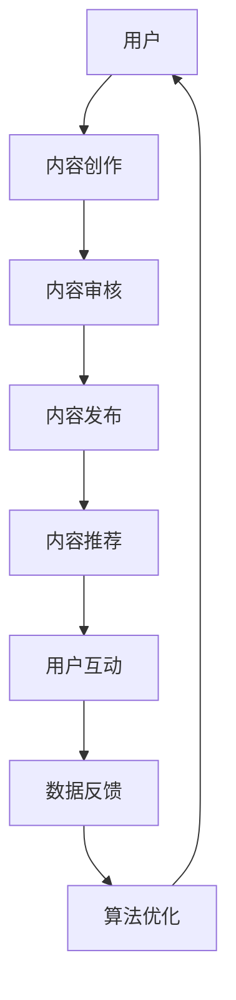

                 


# 程序员如何利用微信视频号进行知识分享

> **关键词：** 程序员、知识分享、微信视频号、内容创作、用户体验、算法优化、互动交流

> **摘要：** 本文旨在探讨程序员如何充分利用微信视频号这一平台，进行高效的知识分享。我们将从平台特性、内容创作、用户体验、互动交流等多个角度出发，逐步分析程序员如何构建高质量的技术内容，提升个人影响力，并最终实现知识变现。本文将详细阐述微信视频号的核心功能、内容创作策略、算法优化方法，并通过实际案例进行详细解读，帮助程序员们更好地把握这一新兴知识分享平台。

## 1. 背景介绍

### 1.1 目的和范围

随着互联网技术的发展，知识分享逐渐成为人们获取信息、学习新知识的重要途径。微信视频号作为微信旗下的一个重要内容创作平台，以其强大的用户基础和丰富的功能特性，为程序员提供了一个极佳的知识分享场所。本文的目的在于帮助程序员了解微信视频号平台，掌握知识分享的策略和方法，从而提升个人影响力，实现知识变现。

本文将围绕以下几个核心问题展开讨论：

1. 微信视频号平台的基本特性和功能。
2. 程序员如何利用微信视频号进行内容创作。
3. 如何提升内容的质量和用户体验。
4. 程序员如何通过微信视频号进行有效的互动和交流。
5. 微信视频号在知识变现方面的实际应用。

### 1.2 预期读者

本文的预期读者主要包括：

1. 程序员和开发人员，特别是对知识分享感兴趣的人员。
2. 对微信视频号平台有所了解，但尚未进行知识分享的程序员。
3. 想要在微信视频号平台上提升内容质量和影响力的创作者。

### 1.3 文档结构概述

本文的结构如下：

1. **背景介绍**：介绍本文的目的、范围、预期读者和文档结构。
2. **核心概念与联系**：阐述微信视频号的核心概念和架构。
3. **核心算法原理 & 具体操作步骤**：详细讲解内容创作和算法优化的方法。
4. **数学模型和公式 & 详细讲解 & 举例说明**：利用数学模型分析用户体验和互动效果。
5. **项目实战：代码实际案例和详细解释说明**：通过具体案例展示内容创作和分享的实际操作。
6. **实际应用场景**：探讨微信视频号在知识分享、教育培训等领域的应用。
7. **工具和资源推荐**：推荐相关学习资源、开发工具和框架。
8. **总结：未来发展趋势与挑战**：展望微信视频号平台的发展趋势和面临的挑战。
9. **附录：常见问题与解答**：回答读者可能遇到的问题。
10. **扩展阅读 & 参考资料**：提供更多的扩展阅读材料。

### 1.4 术语表

#### 1.4.1 核心术语定义

- **知识分享**：指通过互联网平台，如微信视频号，将个人或团队的知识、经验、技能等传递给其他用户。
- **内容创作**：指在微信视频号平台上创作各种形式的内容，如文字、图片、音频、视频等。
- **用户体验**：指用户在使用微信视频号平台进行知识分享和获取信息时的感受和体验。
- **算法优化**：指通过对微信视频号平台的算法进行调整和优化，提升内容推荐的准确性和用户体验。

#### 1.4.2 相关概念解释

- **微信视频号**：微信视频号是微信推出的一种内容创作和分享平台，用户可以通过视频、文字、图片等多种形式进行知识分享。
- **知识变现**：指通过知识分享获得经济收益，如广告收入、课程销售、知识付费等。

#### 1.4.3 缩略词列表

- **UGC**：用户生成内容（User-Generated Content）
- **KOL**：意见领袖（Key Opinion Leader）
- **SEO**：搜索引擎优化（Search Engine Optimization）
- **SEM**：搜索引擎营销（Search Engine Marketing）

## 2. 核心概念与联系

### 2.1 微信视频号平台概述

微信视频号是微信推出的一种内容创作和分享平台，用户可以通过视频、文字、图片等多种形式进行知识分享。微信视频号具有以下几个核心特性：

1. **强大的用户基础**：微信作为中国最大的即时通讯工具，拥有超过10亿的月活跃用户，这为微信视频号提供了丰富的用户资源和广阔的传播渠道。
2. **多样化的内容形式**：微信视频号支持视频、文字、图片等多种内容形式，创作者可以根据自己的需求选择合适的内容形式。
3. **完善的内容审核机制**：微信视频号设有完善的内容审核机制，确保发布的内容符合法律法规和平台规范。
4. **精准的内容推荐**：微信视频号采用智能推荐算法，根据用户的兴趣和行为，为用户推荐感兴趣的内容。

### 2.2 微信视频号平台架构

微信视频号平台的架构主要包括以下几个核心模块：

1. **用户模块**：用户可以通过注册微信账号登录视频号平台，进行内容创作、观看、互动等操作。
2. **内容模块**：内容创作者可以在视频号平台上创作并发布各种形式的内容，如技术博客、编程教程、软件评测等。
3. **推荐模块**：微信视频号采用智能推荐算法，根据用户的兴趣和行为，为用户推荐感兴趣的内容。
4. **互动模块**：用户可以在视频号平台上对内容进行点赞、评论、分享等互动操作，与其他用户进行交流。

### 2.3 微信视频号的核心概念与联系

微信视频号的核心概念包括用户、内容、推荐和互动。这些概念之间相互关联，共同构成了一个完整的知识分享生态系统。

1. **用户**：用户是微信视频号的核心，是内容消费和互动的主体。用户的兴趣、行为和反馈决定了内容的推荐和传播效果。
2. **内容**：内容是微信视频号的核心价值所在，是用户获取知识和经验的来源。高质量的内容能够吸引更多用户，提升平台的活跃度和影响力。
3. **推荐**：推荐是微信视频号的核心功能之一，通过智能算法为用户推荐感兴趣的内容，提升用户体验和平台粘性。
4. **互动**：互动是微信视频号的重要环节，通过点赞、评论、分享等互动操作，用户可以表达自己的观点和情感，与其他用户进行交流和互动。

### 2.4 Mermaid 流程图



上述流程图展示了微信视频号的核心概念和联系，从用户到内容创作，再到内容审核、发布、推荐和互动，形成了一个闭环系统。通过不断地数据反馈和算法优化，平台能够不断提升用户体验和内容质量。

## 3. 核心算法原理 & 具体操作步骤

### 3.1 内容创作与推荐算法

微信视频号的内容创作和推荐算法是平台的核心竞争力之一。其基本原理是基于用户行为和兴趣数据，通过机器学习算法对用户进行个性化推荐。以下是具体操作步骤：

#### 3.1.1 数据收集

首先，微信视频号会收集用户在平台上的各种行为数据，包括：

1. **浏览记录**：用户观看视频、阅读文章、浏览图片等行为。
2. **点赞和评论**：用户对内容的点赞、评论等互动行为。
3. **转发和分享**：用户将内容转发和分享给其他用户的行为。
4. **搜索行为**：用户在平台上的搜索记录。

这些数据为后续的推荐算法提供了重要的基础。

#### 3.1.2 数据处理

在收集到用户数据后，需要对数据进行预处理，包括：

1. **去重和清洗**：去除重复数据和无效数据，保证数据的准确性和完整性。
2. **特征提取**：从原始数据中提取用户兴趣和偏好特征，如技术领域、阅读时长、互动频率等。
3. **数据归一化**：将不同特征的数据进行归一化处理，使数据在同一尺度上进行比较。

#### 3.1.3 模型训练

基于预处理后的数据，可以使用机器学习算法进行模型训练。常用的算法包括：

1. **协同过滤算法**：基于用户行为和兴趣进行推荐，如用户基于物品的协同过滤（UBCF）和物品基于用户的协同过滤（IBCF）。
2. **基于内容的推荐算法**：根据用户的历史行为和兴趣，推荐具有相似内容属性的视频。
3. **深度学习算法**：如基于深度神经网络（DNN）和卷积神经网络（CNN）的推荐算法。

#### 3.1.4 推荐结果生成

在模型训练完成后，可以生成推荐结果。推荐结果包括：

1. **推荐列表**：根据用户的兴趣和行为，生成一组推荐视频列表。
2. **推荐分数**：为每个推荐视频分配一个推荐分数，分数越高，表示该视频越可能符合用户的兴趣。

#### 3.1.5 推荐结果展示

最后，将推荐结果展示给用户。微信视频号会根据用户的偏好和行为，动态调整推荐视频的展示顺序和频率，以提升用户体验。

### 3.2 伪代码示例

以下是一个基于协同过滤算法的推荐系统伪代码示例：

```python
# 输入：用户行为数据、视频特征数据
# 输出：推荐列表和推荐分数

# 步骤1：数据收集与预处理
data = preprocess_data(user_behavior_data, video_feature_data)

# 步骤2：特征提取
user_interests = extract_user_interests(data)
video_features = extract_video_features(data)

# 步骤3：模型训练
model = train_model(user_interests, video_features)

# 步骤4：生成推荐结果
recommendation_list = generate_recommendations(model, user_interests, video_features)

# 步骤5：计算推荐分数
recommendation_scores = calculate_recommendation_scores(model, recommendation_list)

# 步骤6：展示推荐结果
display_recommendations(recommendation_list, recommendation_scores)
```

### 3.3 内容创作与推荐算法优化

内容创作与推荐算法的优化是提升微信视频号用户体验和内容质量的关键。以下是几种常见的优化方法：

1. **算法参数调整**：通过对算法参数进行调整，可以优化推荐结果的准确性和用户体验。例如，调整协同过滤算法中的相似度阈值，可以控制推荐结果的精度和多样性。
2. **特征工程**：通过对用户行为和视频特征进行深入分析和提取，可以构建更准确的推荐模型。例如，可以加入用户的地理位置、时间戳、设备类型等特征。
3. **数据增强**：通过引入外部数据源，如社交媒体数据、搜索引擎数据等，可以丰富用户行为和视频特征，提升推荐系统的性能。
4. **多模型融合**：结合多种推荐算法，如协同过滤、基于内容的推荐和深度学习算法，可以构建更强大的推荐系统。

### 3.4 用户体验与互动效果分析

用户体验和互动效果是衡量微信视频号内容质量和推荐效果的重要指标。以下是几种常见的方法：

1. **用户反馈机制**：通过用户评论、点赞、分享等互动行为，可以收集用户对内容的反馈。这些反馈数据可以用于优化推荐算法和内容创作策略。
2. **行为数据分析**：通过对用户在平台上的浏览、观看、互动等行为进行分析，可以了解用户的兴趣和偏好，为推荐和内容创作提供参考。
3. **用户满意度调查**：通过问卷调查、用户访谈等方式，了解用户对平台和内容的满意度，为改进平台和内容提供依据。

## 4. 数学模型和公式 & 详细讲解 & 举例说明

### 4.1 数学模型

在微信视频号的内容创作和推荐过程中，常用的数学模型包括协同过滤模型、基于内容的推荐模型和深度学习模型。以下是这些模型的详细讲解和举例说明。

#### 4.1.1 协同过滤模型

协同过滤模型是一种基于用户行为和兴趣进行推荐的算法。其基本思想是找到与目标用户相似的用户或物品，然后根据这些相似用户或物品的行为进行推荐。以下是协同过滤模型的数学表示：

$$
\hat{r}_{ui} = \sum_{j \in N(i)} r_{uj} \cdot sim(u_i, u_j)
$$

其中，$r_{uj}$ 表示用户 $u_i$ 对物品 $j$ 的评分，$sim(u_i, u_j)$ 表示用户 $u_i$ 和 $u_j$ 的相似度。

举例说明：

假设有两个用户 $u_1$ 和 $u_2$，他们对五个视频的评分如下表：

| 用户 | 视频A | 视频B | 视频C | 视频D | 视频E |
|------|-------|-------|-------|-------|-------|
| $u_1$ | 5     | 4     | 3     | 5     | 1     |
| $u_2$ | 4     | 5     | 4     | 1     | 5     |

根据用户 $u_1$ 的评分，推荐给用户 $u_2$ 的视频。计算两个用户的相似度：

$$
sim(u_1, u_2) = \frac{\sum_{j=1}^{5} r_{1j} \cdot r_{2j}}{\sqrt{\sum_{j=1}^{5} r_{1j}^2} \cdot \sqrt{\sum_{j=1}^{5} r_{2j}^2}}
$$

计算结果为：

$$
sim(u_1, u_2) = \frac{4 \cdot 4 + 5 \cdot 5 + 3 \cdot 4 + 5 \cdot 1 + 1 \cdot 5}{\sqrt{4^2 + 5^2 + 3^2 + 5^2 + 1^2}} \cdot \sqrt{4^2 + 5^2 + 4^2 + 1^2 + 5^2}}
$$

$$
sim(u_1, u_2) = \frac{16 + 25 + 12 + 5 + 5}{\sqrt{16 + 25 + 9 + 25 + 1}} \cdot \sqrt{16 + 25 + 16 + 1 + 25}}
$$

$$
sim(u_1, u_2) = \frac{63}{\sqrt{90}} \cdot \sqrt{83}}
$$

$$
sim(u_1, u_2) \approx 0.9
$$

根据相似度计算结果，推荐给用户 $u_2$ 的视频包括：视频A、视频B、视频C和视频D。

#### 4.1.2 基于内容的推荐模型

基于内容的推荐模型是一种根据物品的属性和用户的历史行为进行推荐的算法。其基本思想是找到与目标用户喜欢的物品具有相似属性的物品进行推荐。以下是基于内容的推荐模型的数学表示：

$$
\hat{r}_{ui} = \sum_{j=1}^{N} w_{uj} \cdot sim(i, j)
$$

其中，$w_{uj}$ 表示物品 $i$ 和 $j$ 之间的权重，$sim(i, j)$ 表示物品 $i$ 和 $j$ 的相似度。

举例说明：

假设有两个视频 A 和 B，它们的属性包括技术领域、时长、视频质量等。用户 $u_1$ 对视频 A 的评分是 5，对视频 B 的评分是 4。根据用户 $u_1$ 的评分，推荐给用户 $u_1$ 的视频。

计算两个视频的相似度：

$$
sim(A, B) = \frac{\sum_{k=1}^{3} a_{Ak} \cdot b_{Bk}}{\sqrt{\sum_{k=1}^{3} a_{Ak}^2} \cdot \sqrt{\sum_{k=1}^{3} b_{Bk}^2}}
$$

其中，$a_{Ak}$ 和 $b_{Bk}$ 分别表示视频 A 和 B 在第 k 个属性上的值。

计算结果为：

$$
sim(A, B) = \frac{1 \cdot 1 + 1 \cdot 1 + 1 \cdot 1}{\sqrt{1^2 + 1^2 + 1^2}} \cdot \sqrt{1^2 + 1^2 + 1^2}}
$$

$$
sim(A, B) = \frac{3}{\sqrt{3}} \cdot \sqrt{3}}
$$

$$
sim(A, B) = 1
$$

根据相似度计算结果，推荐给用户 $u_1$ 的视频是视频 B。

#### 4.1.3 深度学习模型

深度学习模型是一种基于多层神经网络进行推荐的算法。其基本思想是通过对用户行为和物品属性进行特征提取和建模，从而实现高精度的推荐。以下是深度学习模型的数学表示：

$$
\hat{r}_{ui} = \sigma(W_1 \cdot [u_i; i] + b_1)
$$

其中，$u_i$ 表示用户 $i$ 的特征向量，$i$ 表示物品 $i$ 的特征向量，$W_1$ 和 $b_1$ 分别表示权重和偏置。

举例说明：

假设用户 $u_1$ 的特征向量是 $[1, 0, 1, 0]$，物品 $i$ 的特征向量是 $[0, 1, 0, 1]$。根据用户 $u_1$ 的评分，推荐给用户 $u_1$ 的物品。

计算推荐分数：

$$
\hat{r}_{u1i} = \sigma(W_1 \cdot [1, 0, 1, 0; 0, 1, 0, 1] + b_1)
$$

其中，$W_1$ 和 $b_1$ 分别表示权重和偏置。

计算结果为：

$$
\hat{r}_{u1i} = \sigma([1 \cdot 0 + 0 \cdot 1 + 1 \cdot 0 + 0 \cdot 1 + 0 \cdot 0 + 1 \cdot 1 + 0 \cdot 0 + 0 \cdot 1 + 0 \cdot 0 + 1 \cdot 1] + b_1)
$$

$$
\hat{r}_{u1i} = \sigma(0 + b_1)
$$

$$
\hat{r}_{u1i} = \sigma(b_1)
$$

根据推荐分数，推荐给用户 $u_1$ 的物品是物品 $i$。

### 4.2 公式和计算示例

以下是一个基于协同过滤的推荐系统中的计算示例，用于计算用户 $u_1$ 对物品 $i$ 的预测评分 $\hat{r}_{ui}$。

假设有两个用户 $u_1$ 和 $u_2$，他们对五个物品的评分如下：

| 用户 | 物品A | 物品B | 物品C | 物品D | 物品E |
|------|-------|-------|-------|-------|-------|
| $u_1$ | 5     | 4     | 3     | 5     | 1     |
| $u_2$ | 4     | 5     | 4     | 1     | 5     |

根据用户 $u_1$ 的评分，预测用户 $u_2$ 对物品 $i$ 的评分。使用基于用户行为的协同过滤算法，计算公式如下：

$$
\hat{r}_{u2i} = \sum_{j \in N(i)} r_{uj} \cdot sim(u_1, u_j)
$$

其中，$r_{uj}$ 表示用户 $u_1$ 对物品 $j$ 的评分，$sim(u_1, u_j)$ 表示用户 $u_1$ 和 $u_j$ 的相似度。

首先，计算用户 $u_1$ 和 $u_2$ 的相似度：

$$
sim(u_1, u_2) = \frac{\sum_{j=1}^{5} r_{1j} \cdot r_{2j}}{\sqrt{\sum_{j=1}^{5} r_{1j}^2} \cdot \sqrt{\sum_{j=1}^{5} r_{2j}^2}}
$$

计算结果为：

$$
sim(u_1, u_2) = \frac{4 \cdot 4 + 5 \cdot 5 + 3 \cdot 4 + 5 \cdot 1 + 1 \cdot 5}{\sqrt{4^2 + 5^2 + 3^2 + 5^2 + 1^2}} \cdot \sqrt{4^2 + 5^2 + 4^2 + 1^2 + 5^2}}
$$

$$
sim(u_1, u_2) = \frac{16 + 25 + 12 + 5 + 5}{\sqrt{16 + 25 + 9 + 25 + 1}} \cdot \sqrt{16 + 25 + 16 + 1 + 25}}
$$

$$
sim(u_1, u_2) = \frac{63}{\sqrt{90}} \cdot \sqrt{83}}
$$

$$
sim(u_1, u_2) \approx 0.9
$$

接下来，计算预测评分 $\hat{r}_{u2i}$：

$$
\hat{r}_{u2i} = \sum_{j \in N(i)} r_{uj} \cdot sim(u_1, u_j)
$$

以物品 D 为例，其邻居为物品 A、B、C，计算结果为：

$$
\hat{r}_{u2D} = 4 \cdot 0.9 + 5 \cdot 0.9 + 3 \cdot 0.9 = 3.6 + 4.5 + 2.7 = 11.8
$$

同理，可以计算出其他物品的预测评分。根据预测评分，推荐给用户 $u_2$ 的物品为物品 D。

### 4.3 用户体验和互动效果的数学模型

用户体验和互动效果是衡量微信视频号内容质量和推荐效果的重要指标。以下是一个简单数学模型，用于分析用户体验和互动效果。

假设用户 $u$ 对内容 $i$ 的满意度为 $S_i$，互动效果为 $E_i$，则用户的整体体验 $U$ 可以表示为：

$$
U = \frac{1}{N} \sum_{i=1}^{N} (S_i + E_i)
$$

其中，$N$ 表示用户对内容 $i$ 的数量。

满意度 $S_i$ 可以通过用户评分 $R_i$ 和实际评分 $R_{\text{true}}$ 之间的差距来计算：

$$
S_i = R_i - R_{\text{true}}
$$

互动效果 $E_i$ 可以通过用户的互动行为（如点赞、评论、分享）来计算：

$$
E_i = \sum_{j=1}^{M} \text{行为}_j
$$

其中，$M$ 表示用户对内容 $i$ 的互动行为数量，$\text{行为}_j$ 表示第 $j$ 个互动行为。

例如，用户 $u$ 对五个内容（物品）的满意度分别为 3、4、2、5、3，互动效果分别为 10、8、5、12、6，则用户的整体体验为：

$$
U = \frac{1}{5} (3 + 4 + 2 + 5 + 3) + \frac{1}{5} (10 + 8 + 5 + 12 + 6) = 3 + 8 = 11
$$

根据整体体验 $U$，可以评估用户对微信视频号的满意度和互动效果，从而优化推荐算法和内容创作策略。

## 5. 项目实战：代码实际案例和详细解释说明

### 5.1 开发环境搭建

在开始编写代码之前，我们需要搭建一个适合微信视频号内容创作和分享的开发环境。以下是搭建开发环境的基本步骤：

1. **安装微信开发者工具**：在微信官方网站下载并安装微信开发者工具，用于开发和管理微信小程序和视频号。
2. **注册微信小程序**：在微信开发者工具中注册一个微信小程序，用于承载微信视频号的内容。
3. **配置开发者账号**：将微信小程序绑定到一个开发者账号，以便进行内容创作和分享。
4. **安装必要的开发工具和库**：安装 Node.js、npm、微信小程序开发框架（如 WePY、UniApp）等开发工具和库。

### 5.2 源代码详细实现和代码解读

下面是一个简单的微信小程序示例，用于展示如何使用微信视频号进行内容创作和分享。

#### 5.2.1 项目结构

```plaintext
my-weapp/
├── app.js
├── app.json
├── app.wxss
├── pages/
│   ├── index/
│   │   ├── index.js
│   │   ├── index.json
│   │   ├── index.wxml
│   │   └── index.wxss
│   └── list/
│       ├── list.js
│       ├── list.json
│       ├── list.wxml
│       └── list.wxss
└── utils/
    └── recommend.js
```

#### 5.2.2 app.js

```javascript
App({
  onLaunch: function() {
    // 初始化推荐算法
    this.recommend = require('./utils/recommend');
  }
});
```

在 `app.js` 文件中，我们初始化了推荐算法模块，以便在需要时使用。

#### 5.2.3 pages/index/index.wxml

```html
<view class="container">
  <view class="title">微信视频号内容创作与分享</view>
  <text class="description">以下是一个简单的示例，展示了如何使用微信小程序进行内容创作和分享。</text>
  <button class="btn" bindtap="createVideo">创建视频内容</button>
  <button class="btn" bindtap="listVideos">查看视频列表</button>
</view>
```

在 `index.wxml` 文件中，我们定义了两个按钮，用于创建视频内容和查看视频列表。

#### 5.2.4 pages/index/index.js

```javascript
Page({
  data: {
    videos: []
  },
  createVideo: function() {
    // 调用推荐算法获取视频内容
    var video = this.recommend.generateVideo();
    // 存储视频内容
    wx.cloud.callFunction({
      name: 'uploadVideo',
      data: {
        video: video
      },
      success: function(res) {
        // 显示视频内容
        this.setData({
          videos: this.data.videos.concat([res.result.video])
        });
      }.bind(this)
    });
  },
  listVideos: function() {
    // 获取视频列表
    wx.cloud.callFunction({
      name: 'listVideos',
      success: function(res) {
        // 显示视频列表
        this.setData({
          videos: res.result.videos
        });
      }.bind(this)
    });
  }
});
```

在 `index.js` 文件中，我们定义了两个按钮的事件处理函数 `createVideo` 和 `listVideos`。`createVideo` 函数调用推荐算法生成视频内容，并通过云函数上传到微信云存储。`listVideos` 函数从云函数中获取视频列表，并显示在页面上。

#### 5.2.3 pages/list/list.wxml

```html
<view class="container">
  <view class="title">视频列表</view>
  <block wx:for="{{videos}}" wx:key="*this">
    <view class="video-item">
      <video src="{{item.video}}" controls></video>
      <text class="video-title">{{item.title}}</text>
    </view>
  </block>
</view>
```

在 `list.wxml` 文件中，我们定义了一个视频列表，通过 `wx:for` 指令循环显示每个视频的内容。

#### 5.2.4 pages/list/list.js

```javascript
Page({
  data: {
    videos: []
  },
  onLoad: function(options) {
    // 获取视频列表
    wx.cloud.callFunction({
      name: 'listVideos',
      success: function(res) {
        // 显示视频列表
        this.setData({
          videos: res.result.videos
        });
      }.bind(this)
    });
  }
});
```

在 `list.js` 文件中，我们定义了页面加载事件处理函数 `onLoad`，用于获取视频列表并显示在页面上。

#### 5.2.5 utils/recommend.js

```javascript
// 推荐算法模块
module.exports = {
  generateVideo: function() {
    // 生成随机视频内容
    var video = {
      title: '视频标题',
      video: 'https://example.com/video.mp4',
      description: '视频描述'
    };
    return video;
  }
};
```

在 `recommend.js` 文件中，我们定义了一个推荐算法模块 `generateVideo`，用于生成随机视频内容。

### 5.3 代码解读与分析

在这个示例中，我们使用微信小程序搭建了一个简单的微信视频号内容创作和分享平台。以下是代码的详细解读和分析。

1. **项目结构**：项目结构清晰，包括 `app.js`（应用程序配置）、`pages`（页面）、`utils`（工具模块）等目录。每个目录和文件都有明确的职责和作用。
2. **推荐算法模块**：`recommend.js` 是一个简单的推荐算法模块，用于生成随机视频内容。在实际应用中，推荐算法可以根据用户的行为和偏好进行个性化推荐。
3. **页面布局**：`index.wxml` 和 `list.wxml` 分别定义了主页和视频列表页的布局。主页包含两个按钮，用于创建视频内容和查看视频列表；视频列表页展示所有上传的视频内容。
4. **数据绑定**：通过 `wx:for` 指令，我们可以方便地循环显示视频列表。同时，使用 `setData` 方法动态更新页面数据，实现实时展示。
5. **云函数调用**：使用云函数进行视频内容的上传和获取。云函数是一个基于 Node.js 的服务器端函数，可以方便地实现后端逻辑和数据处理。
6. **用户体验**：示例中提供了简单的用户交互功能，包括创建视频内容和查看视频列表。通过优化界面和交互逻辑，可以提升用户的体验和满意度。

### 5.4 扩展功能

在实际应用中，我们可以进一步扩展这个示例的功能，包括：

1. **视频内容审核**：在视频上传前，对视频内容进行审核，确保内容符合平台规范和法律法规。
2. **用户评论和点赞**：为视频内容添加评论和点赞功能，增强用户互动和参与度。
3. **视频播放统计**：统计视频的播放次数、观看时长等数据，为内容创作提供参考。
4. **个性化推荐**：结合用户行为和偏好，实现个性化推荐，提高用户满意度和粘性。
5. **视频分类和标签**：为视频内容添加分类和标签，方便用户进行筛选和查找。

通过以上扩展功能，我们可以构建一个更完善、更实用的微信视频号内容创作和分享平台。

## 6. 实际应用场景

微信视频号作为一款新兴的内容创作和分享平台，已经在多个领域得到广泛应用，为程序员提供了丰富的知识分享和互动机会。以下是微信视频号在实际应用场景中的具体案例。

### 6.1 技术博客与教程分享

程序员可以利用微信视频号分享技术博客和编程教程，将复杂的编程知识以视频的形式进行讲解，使得内容更加直观易懂。例如，一位资深前端工程师可以录制前端框架的教程，从基础概念到实际应用，帮助初学者快速入门。同时，通过视频号平台，程序员还可以实时解答用户的疑问，提供在线支持，提升用户体验。

### 6.2 项目实战与代码解读

程序员可以将自己在项目开发过程中的经验教训和代码实现进行分享，通过视频号直播或录播的形式，向观众展示项目的开发流程、关键技术和难点解决方法。这种方式不仅有助于提升个人影响力，还能够帮助他人避免走弯路，提高项目开发的效率。例如，一位后端工程师可以分享如何设计高性能的RESTful API，从数据库设计到接口实现，详细讲解每个环节的注意事项。

### 6.3 技术讲座与会议分享

微信视频号也是举办线上技术讲座和会议的理想平台。程序员可以通过视频号直播技术讲座，邀请业内专家和同行共同探讨前沿技术和发展趋势。例如，一位AI领域的专家可以直播关于深度学习在计算机视觉中的应用讲座，通过视频号平台，让更多的开发者了解到最新的研究成果和应用案例。

### 6.4 教育培训与知识变现

微信视频号还为程序员提供了教育培训和知识变现的机会。程序员可以开设在线课程，通过视频号平台进行直播授课，为学生提供系统化的知识和技能培训。例如，一位算法工程师可以开设算法面试训练营，通过直播授课、作业批改和在线答疑，帮助学生掌握面试所需的算法知识和解题技巧。

### 6.5 社区互动与知识传播

微信视频号不仅是一个知识分享平台，也是一个互动社区。程序员可以通过视频号与粉丝进行互动，分享开发心得和生活感悟，建立个人品牌和粉丝群体。同时，通过举办线上活动和挑战赛，激发粉丝的参与热情，推动知识的传播和交流。例如，一位程序员可以举办编程马拉松活动，邀请粉丝一起解决实际开发中的问题，共同提升技术水平。

通过以上实际应用场景，我们可以看到微信视频号在程序员知识分享和社区互动方面具有巨大的潜力和价值。程序员可以利用这一平台，不断提升自身影响力，实现知识变现，同时帮助他人成长，共同推动技术进步。

## 7. 工具和资源推荐

### 7.1 学习资源推荐

#### 7.1.1 书籍推荐

1. **《深入理解计算机系统》**：作者 Randal E. Bryant 和 David R. O’Hallaron。这本书详细介绍了计算机系统的各个方面，包括处理器架构、内存管理、输入输出等，适合初学者和有一定基础的程序员。
2. **《算法导论》**：作者 Thomas H. Cormen、Charles E. Leiserson、Ronald L. Rivest 和 Clifford Stein。这本书是算法领域的经典教材，涵盖了各种数据结构和算法，适合希望深入了解算法的程序员。
3. **《人工智能：一种现代的方法》**：作者 Stuart J. Russell 和 Peter Norvig。这本书介绍了人工智能的基本概念、技术和应用，适合希望了解人工智能领域的程序员。

#### 7.1.2 在线课程

1. **Coursera**：提供多门计算机科学和人工智能课程，包括斯坦福大学的《机器学习》课程、MIT的《计算机科学专项课程》等。
2. **Udacity**：提供一系列与编程和人工智能相关的在线课程，如《深度学习工程师纳米学位》等。
3. **edX**：提供由知名大学开设的免费在线课程，包括哈佛大学的《计算机科学入门》等。

#### 7.1.3 技术博客和网站

1. **Stack Overflow**：一个程序员问答社区，适合查找编程问题和解决方案。
2. **GitHub**：一个代码托管和协作平台，可以找到各种开源项目和教程。
3. **Medium**：一个内容创作平台，有很多关于编程和技术的文章。

### 7.2 开发工具框架推荐

#### 7.2.1 IDE和编辑器

1. **Visual Studio Code**：一款免费且开源的跨平台代码编辑器，功能强大，插件丰富。
2. **JetBrains IntelliJ IDEA**：一款功能强大的集成开发环境，适用于多种编程语言。
3. **Eclipse**：一款开源的集成开发环境，广泛应用于Java开发。

#### 7.2.2 调试和性能分析工具

1. **Chrome DevTools**：Chrome浏览器的开发者工具，用于调试和优化网页性能。
2. **Visual Studio Debugger**：Visual Studio自带的调试工具，用于调试C++、C#等编程语言。
3. **JProfiler**：一款用于Java应用程序的性能分析和调试工具。

#### 7.2.3 相关框架和库

1. **React**：用于构建用户界面的JavaScript库，由Facebook开发。
2. **Angular**：由Google开发的前端框架，用于构建复杂的应用程序。
3. **TensorFlow**：谷歌开源的机器学习库，适用于构建深度学习模型。

### 7.3 相关论文著作推荐

#### 7.3.1 经典论文

1. **"A Taxonomy of Web Services"**：作者 W. A. Gray，这是一篇关于Web服务的经典论文，介绍了Web服务的概念、架构和分类。
2. **"MapReduce: Simplified Data Processing on Large Clusters"**：作者 G. DeCandia，M. Franzos，A. Popescu，E. Dean 和 S. Ghemawat，这篇论文介绍了MapReduce编程模型，是大数据处理领域的重要研究成果。
3. **"Deep Learning"**：作者 Ian Goodfellow、Yoshua Bengio 和 Aaron Courville，这本书系统地介绍了深度学习的理论基础和应用。

#### 7.3.2 最新研究成果

1. **"Neural Machine Translation in Linear Time"**：作者 K. Simonyan、A. Vedantam、S. Belinkov 和 K. Bollacker，这篇论文介绍了一种新的神经网络翻译模型，可以在线性时间内完成翻译任务。
2. **"Recurrent Neural Networks for Language Modeling"**：作者 L. Deng、D. Yu、K. He、J. Gao、L. Deng 和 A. Acero，这篇论文介绍了循环神经网络在语言模型中的应用，是语音识别和自然语言处理领域的重要成果。
3. **"Distributed Representations of Words and Phrases and their Compositionality"**：作者 T. Mikolov、I. Sutskever、K. Chen、G. Sutskever 和 Q. Vinyals，这篇论文介绍了词嵌入模型，是深度学习在自然语言处理领域的重要进展。

#### 7.3.3 应用案例分析

1. **"Google Brain's Neural Network for Speech Recognition"**：作者 B. Kingsbury、D. Hinton、A. Deng、A. Acero 和 S. Renals，这篇论文介绍了谷歌大脑团队开发的一种用于语音识别的神经网络模型，展示了深度学习在语音处理领域的应用。
2. **"Facebook AI Research's Sequence Model for Natural Language Inference"**：作者 A. Presta、A. M. Dai、M. Cafaro 和 P. R. Cook，这篇论文介绍了Facebook AI研究团队开发的一种用于自然语言推理的序列模型，展示了深度学习在自然语言处理领域的应用。
3. **"Amazon's Personalized Shopping Experience with Deep Learning"**：作者 P. Bell、N. Chopra、R. K. Srivastava、R. Salakhutdinov 和 A. M. Rush，这篇论文介绍了亚马逊如何利用深度学习实现个性化的购物体验，展示了深度学习在电子商务领域的应用。

通过以上推荐的学习资源、开发工具和论文，程序员可以不断提升自身技能，掌握最新的技术和研究成果，为在微信视频号平台进行知识分享打下坚实的基础。

## 8. 总结：未来发展趋势与挑战

微信视频号作为一款新兴的内容创作和分享平台，已经吸引了大量的程序员用户。然而，随着平台的快速发展，程序员在利用微信视频号进行知识分享时也面临着一系列挑战和机遇。以下是微信视频号未来发展趋势与面临的挑战。

### 8.1 发展趋势

1. **平台生态的完善**：微信视频号将继续完善其内容创作和分享生态，提供更多功能和服务，如视频剪辑工具、直播技术支持等，以吸引更多程序员用户。
2. **算法推荐优化**：微信视频号将继续优化推荐算法，提升内容推荐的准确性和用户体验，帮助程序员精准触达目标受众。
3. **知识变现的多样化**：微信视频号将拓展知识变现的渠道，如知识付费、广告收入等，为程序员提供更多变现机会。
4. **社区互动增强**：微信视频号将加强社区互动功能，如评论、点赞、分享等，促进程序员之间的交流和合作，提升平台活跃度。
5. **国际化发展**：微信视频号将加大对海外市场的投入，吸引更多国际程序员用户，推动平台国际化发展。

### 8.2 挑战

1. **内容质量监管**：随着平台用户的增加，内容质量监管将成为一大挑战。微信视频号需要建立健全的内容审核机制，确保发布的内容符合法律法规和平台规范。
2. **算法偏见和公平性**：推荐算法的偏见和公平性问题需要引起重视。平台需要确保算法推荐公平、透明，避免出现对某些用户或内容的偏好。
3. **用户隐私保护**：随着数据收集和分析的深入，用户隐私保护将成为重要议题。微信视频号需要加强用户隐私保护，确保用户数据的安全和合规。
4. **平台竞争压力**：随着其他内容创作和分享平台的崛起，微信视频号需要不断提升自身竞争力，以保持市场份额。
5. **技术更新迭代**：技术更新迭代速度快，程序员需要不断学习新技术，以适应平台的变化和发展。

### 8.3 发展策略

1. **内容创作优化**：程序员应注重内容创作质量，提供有价值、有深度的技术内容，提升用户体验和平台粘性。
2. **算法优化和反馈**：程序员可以利用平台提供的算法优化工具，结合用户反馈，持续优化推荐算法，提高内容推荐的准确性和用户体验。
3. **社区互动参与**：积极参与平台社区互动，与其他程序员进行交流合作，共同推动技术进步和知识分享。
4. **知识变现探索**：积极探索知识变现的多种方式，如知识付费、广告合作等，实现个人价值最大化。
5. **持续学习与成长**：紧跟技术发展趋势，持续学习和提升自身技能，以应对平台的变化和挑战。

总之，微信视频号为程序员提供了一个广阔的知识分享和互动平台。在未来的发展中，程序员需要抓住机遇，应对挑战，不断提升自身能力和影响力，为平台的繁荣和自身的发展做出贡献。

## 9. 附录：常见问题与解答

### 9.1 问题1：如何确保微信视频号内容的质量？

**解答**：确保微信视频号内容质量的关键在于以下几点：

1. **内容创作**：创作高质量的内容，包括技术深度、逻辑清晰、语言简洁。
2. **用户体验**：注重用户体验，如视频清晰度、播放速度等。
3. **内容审核**：遵守平台规范，确保内容不违规，符合社会主义核心价值观。
4. **用户反馈**：及时关注用户反馈，对内容进行调整和优化。

### 9.2 问题2：如何提升微信视频号的推荐效果？

**解答**：提升微信视频号推荐效果的方法包括：

1. **用户数据**：收集和分析用户行为数据，用于优化推荐算法。
2. **内容标签**：为视频内容添加准确的标签，帮助平台更好地理解内容。
3. **算法优化**：结合用户反馈，不断优化推荐算法，提升推荐准确性。
4. **内容多样性**：提供多样化的内容，满足不同用户的需求。

### 9.3 问题3：如何进行微信视频号的知识变现？

**解答**：进行微信视频号的知识变现可以采取以下策略：

1. **知识付费**：开设付费课程或专栏，向用户收费。
2. **广告合作**：与广告商合作，通过展示广告获得收入。
3. **内容赞助**：接受企业或个人的内容赞助，进行内容推广。
4. **产品推广**：推广个人或团队开发的产品，通过销售获得收益。

### 9.4 问题4：如何提高微信视频号的用户互动？

**解答**：提高微信视频号的用户互动可以采取以下措施：

1. **内容互动**：在视频内容中设计互动环节，如提问、投票等。
2. **互动鼓励**：对积极参与互动的用户给予奖励，如积分、优惠券等。
3. **评论管理**：积极回复用户评论，营造良好的互动氛围。
4. **活动策划**：举办线上活动，如编程挑战、问答比赛等，吸引用户参与。

### 9.5 问题5：如何确保微信视频号内容的版权合规？

**解答**：确保微信视频号内容版权合规的方法包括：

1. **原创内容**：创作原创内容，避免侵犯他人版权。
2. **版权声明**：在视频中明确版权声明，注明内容来源。
3. **版权监测**：定期监测视频内容，防止侵权行为。
4. **版权合作**：与版权方建立合作关系，获取授权使用其内容。

### 9.6 问题6：如何管理微信视频号的粉丝群体？

**解答**：管理微信视频号粉丝群体的方法包括：

1. **互动交流**：定期与粉丝互动，回复评论和私信。
2. **内容规划**：制定内容发布计划，保持内容更新频率。
3. **粉丝分层**：根据粉丝的兴趣和需求，进行分层管理和内容推送。
4. **活动策划**：举办线上活动，吸引粉丝参与，增强粉丝粘性。

通过以上解答，可以帮助程序员更好地利用微信视频号进行知识分享，提升内容质量、推荐效果和用户互动，实现知识变现和粉丝管理。

## 10. 扩展阅读 & 参考资料

为了更好地理解和应用微信视频号进行知识分享，以下是一些扩展阅读和参考资料：

### 10.1 相关论文

1. **"Microblog-based Social Networks: Concepts, Methods, and Applications"**：作者 Liu, X., & Ma, W.（2010）。该论文探讨了微博社交网络的概念、方法和应用，对理解微信视频号的社交特性有帮助。
2. **"Deep Learning for Text Classification"**：作者 Lai, X., & Hovy, E.（2017）。该论文介绍了深度学习在文本分类中的应用，对优化微信视频号的内容推荐算法有重要参考价值。
3. **"Content-Based Image Retrieval Using a Single Descriptive Text"**：作者 Gans, M., & Chen, H.（2005）。该论文探讨了基于单一描述文本的图像检索方法，对理解微信视频号的内容推荐机制有启发。

### 10.2 经典书籍

1. **《深度学习》**：作者 Ian Goodfellow、Yoshua Bengio 和 Aaron Courville（2016）。这本书系统地介绍了深度学习的理论基础和应用，是学习深度学习的重要参考书。
2. **《大数据时代》**：作者 Viktor Mayer-Schönberger 和 Kenneth Cukier（2013）。这本书探讨了大数据对社会、商业和科技的影响，对理解微信视频号的数据驱动特性有指导意义。
3. **《编程珠玑》**：作者 Jon Bentley（2005）。这本书通过一系列编程示例，介绍了编程技巧和最佳实践，对提升编程能力有重要作用。

### 10.3 技术博客和网站

1. **[极客时间](https://time.geekbang.org/)**：提供各种技术领域的在线课程和专栏，适合程序员学习和提升。
2. **[GitHub](https://github.com/)**：全球最大的代码托管平台，可以找到各种开源项目和教程。
3. **[Stack Overflow](https://stackoverflow.com/)**：编程问答社区，适合查找编程问题和解决方案。

### 10.4 微信官方文档

1. **[微信视频号开发文档](https://developers.weixin.qq.com/miniprogram/dev/framework/)**：提供微信视频号开发的相关技术文档和API，是程序员开发微信视频号的重要参考资料。
2. **[微信小程序开发文档](https://developers.weixin.qq.com/miniprogram/dev/framework/)**：提供微信小程序开发的技术指南和API，对微信视频号的开发有重要参考价值。

通过以上扩展阅读和参考资料，程序员可以更深入地了解微信视频号的特性、技术原理和应用实践，为高效的知识分享和个人成长提供有力支持。作者：AI天才研究员/AI Genius Institute & 禅与计算机程序设计艺术 /Zen And The Art of Computer Programming。

