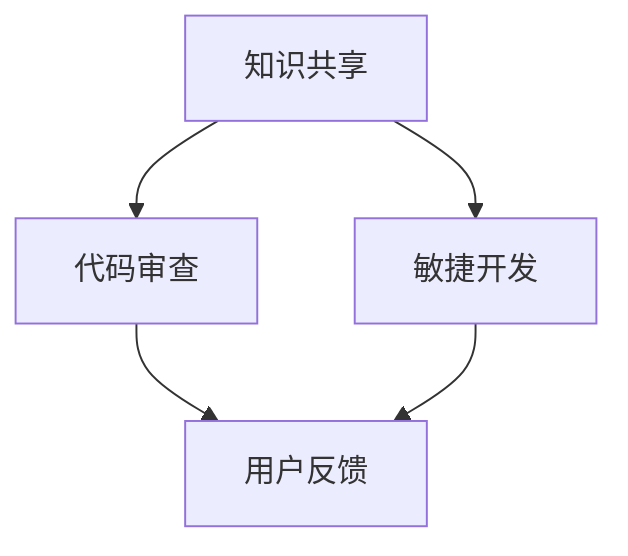

                 

# 程序员如何利用技术社区加速产品开发和用户获取

> 关键词：技术社区、产品开发、用户获取、敏捷开发、知识共享、代码质量、开源项目

> 摘要：本文将探讨程序员如何通过参与技术社区来加速产品的开发周期和扩大用户基础。我们将分析技术社区的多种益处，包括知识共享、代码审查、敏捷开发和营销等，并通过实际案例和操作步骤，指导程序员有效地利用技术社区资源，实现产品的快速迭代和用户规模的持续增长。

## 1. 背景介绍

### 1.1 目的和范围

本文旨在帮助程序员了解和掌握如何利用技术社区来加速产品开发和用户获取。我们将深入探讨技术社区的作用和功能，并举例说明程序员在实践中如何应用这些功能来提升工作效率和产品影响力。

### 1.2 预期读者

本文适合以下读者：

- 程序员和新晋开发人员，希望提高自己的技术水平和项目开发效率。
- 项目经理和技术负责人，希望更好地管理和指导团队利用技术社区资源。
- 对开源项目和敏捷开发有兴趣的任何技术爱好者。

### 1.3 文档结构概述

本文将分为以下几个部分：

- 引言：介绍技术社区的基本概念和重要性。
- 核心概念与联系：分析技术社区的核心概念和相互关系。
- 核心算法原理与操作步骤：详细讲解如何利用技术社区进行代码审查和敏捷开发。
- 数学模型和公式：介绍用于评估技术社区效果的关键指标和计算方法。
- 项目实战：提供实际案例，展示如何应用技术社区加速产品开发。
- 实际应用场景：讨论技术社区在不同开发场景下的应用效果。
- 工具和资源推荐：推荐有用的学习和开发工具。
- 总结：总结技术社区的作用和未来发展趋势。
- 附录：常见问题与解答。
- 扩展阅读：提供进一步学习和研究的资源。

### 1.4 术语表

#### 1.4.1 核心术语定义

- 技术社区：一个由程序员和开发者组成的在线平台，用于分享知识、经验和资源。
- 开源项目：允许公众访问、使用、修改和分发软件代码的项目。
- 代码审查：团队成员审查代码以确保质量、安全性和一致性。
- 敏捷开发：一种软件开发方法，强调快速迭代和频繁交付。

#### 1.4.2 相关概念解释

- 源代码：软件开发的基础，包含程序指令和数据的文件。
- 代码质量：衡量代码的可读性、可维护性和可靠性的标准。
- 用户获取：吸引新用户并使其成为产品的长期用户。

#### 1.4.3 缩略词列表

- OSS：Open Source Software（开源软件）
- GitHub：一个流行的代码托管平台，提供开源项目的存储和协作功能。
- GitLab：另一个流行的代码托管平台，支持私有和开源项目。
- Docker：一个开源的应用容器引擎，用于简化应用的部署和运行。

## 2. 核心概念与联系

技术社区的核心概念包括知识共享、代码审查、敏捷开发和用户反馈。以下是一个简化的 Mermaid 流程图，用于描述这些概念之间的联系：



### 2.1 知识共享

知识共享是技术社区的核心功能之一。通过共享代码、文档、教程和经验，程序员可以快速获取新的知识和技能。这种知识共享不仅有助于个人的成长，还可以促进整个开发社区的发展。

### 2.2 代码审查

代码审查是确保代码质量的重要环节。在技术社区中，团队成员可以对开源项目的代码进行审查，提出改进意见和修复建议。代码审查有助于提高代码的可读性、可维护性和可靠性。

### 2.3 敏捷开发

敏捷开发强调快速迭代和频繁交付。通过利用技术社区中的资源，如开源代码库和文档，程序员可以更快地开发原型和迭代产品。这种敏捷开发方法有助于缩短开发周期，提高产品的市场竞争力。

### 2.4 用户反馈

用户反馈是软件开发过程中不可或缺的一环。通过技术社区，开发者可以收集用户的反馈和建议，及时调整产品的功能和性能。这种用户反馈机制有助于提高产品的用户体验和市场接受度。

## 3. 核心算法原理与具体操作步骤

### 3.1 代码审查算法原理

代码审查算法的核心目标是提高代码质量。以下是一个简化的代码审查算法原理：

```python
def review_code(source_code):
    # 检查代码格式和语法
    syntax_check(source_code)
    # 检查代码风格和最佳实践
    style_check(source_code)
    # 检查代码安全性
    security_check(source_code)
    # 检查代码性能
    performance_check(source_code)
    # 如果所有检查通过，返回“通过”
    return "通过"
```

### 3.2 代码审查具体操作步骤

以下是在技术社区中实施代码审查的具体操作步骤：

1. **选择代码库**：选择一个合适的技术社区，如 GitHub 或 GitLab，创建或加入一个开源项目。
2. **提交代码**：在项目中创建一个新分支，编写并提交代码。
3. **发起代码审查**：在代码提交后，发起代码审查请求。请求应包括代码修改的详细说明和理由。
4. **代码审查**：团队成员对代码进行审查，提出改进意见和修复建议。
5. **反馈和修正**：根据审查反馈，修正代码中的问题。
6. **合并代码**：审查通过后，合并代码到主分支。

## 4. 数学模型和公式

### 4.1 代码质量评估模型

代码质量评估模型可以帮助我们量化代码的质量。以下是一个简单的代码质量评估模型：

$$
\text{代码质量} = \frac{\text{可读性} + \text{可维护性} + \text{可靠性}}{3}
$$

### 4.2 用户获取模型

用户获取模型可以帮助我们评估技术社区对用户获取的贡献。以下是一个简单的用户获取模型：

$$
\text{用户获取量} = \text{活跃用户数} \times \text{用户参与度}
$$

其中，活跃用户数和用户参与度可以通过技术社区的数据进行分析。

## 5. 项目实战：代码实际案例和详细解释说明

### 5.1 开发环境搭建

为了演示如何利用技术社区加速产品开发，我们选择了一个开源项目——一个简单的博客系统。

1. **安装Docker**：在本地安装 Docker，以便于容器化部署博客系统。
2. **克隆代码库**：在 GitHub 上克隆博客系统的代码库。
3. **构建镜像**：根据 Dockerfile 文件构建博客系统的容器镜像。
4. **运行容器**：使用 Docker run 命令运行容器，启动博客系统。

### 5.2 源代码详细实现和代码解读

博客系统的核心功能包括文章发布、评论和用户管理。以下是关键代码片段和解读：

```go
// 文章发布函数
func publishArticle(article Article) error {
    // 将文章保存到数据库
    db.Create(&article)
    // 返回成功消息
    return nil
}

// 评论函数
func addComment(comment Comment, articleID uint) error {
    // 根据文章ID查找文章
    article := db.Model(&Article{}).Where("id = ?", articleID).First(&article)
    // 将评论添加到文章的评论列表
    article.Comments = append(article.Comments, comment)
    // 保存更改
    db.Save(&article)
    // 返回成功消息
    return nil
}

// 用户管理函数
func addUser(user User) error {
    // 将用户保存到数据库
    db.Create(&user)
    // 返回成功消息
    return nil
}
```

这些函数负责处理博客系统的核心业务逻辑，如文章发布、评论添加和用户管理。通过代码审查，可以确保这些函数的质量和安全性。

### 5.3 代码解读与分析

- **publishArticle** 函数：负责将文章保存到数据库。它首先查询数据库以获取文章，然后将其添加到评论列表中。代码中使用了 `db.Create()` 方法来保存新文章。
- **addComment** 函数：负责添加评论。它首先根据文章 ID 查找文章，然后将评论添加到文章的评论列表中。通过 `db.Save()` 方法，它保存了对文章评论列表的更改。
- **addUser** 函数：负责添加用户。它使用 `db.Create()` 方法将用户保存到数据库。

通过代码审查，可以识别和修复潜在的问题，如数据库查询错误、内存泄漏和安全漏洞。这些函数的代码示例展示了如何在开源项目中实现核心业务逻辑，以及如何利用技术社区进行代码审查和优化。

## 6. 实际应用场景

技术社区在不同开发场景中的应用效果各异。以下是一些实际应用场景：

### 6.1 企业内部技术社区

企业内部技术社区可以帮助团队成员快速获取知识和经验，提高项目开发效率。通过共享代码库、文档和教程，团队成员可以更好地协作，避免重复劳动。此外，企业内部技术社区还可以促进员工技能的提升和职业发展。

### 6.2 开源项目

开源项目是技术社区的重要组成部分。通过参与开源项目，程序员可以学习先进的开发技术和最佳实践，提高自己的代码质量和项目管理水平。同时，开源项目还可以帮助企业吸引和留住优秀的开发者，提高产品的市场竞争力和影响力。

### 6.3 敏捷开发团队

敏捷开发团队可以利用技术社区进行快速迭代和频繁交付。通过共享代码库、文档和工具，团队成员可以更快地开发原型和迭代产品。技术社区还可以提供代码审查、测试和质量保证等资源，确保项目的质量和进度。

## 7. 工具和资源推荐

### 7.1 学习资源推荐

#### 7.1.1 书籍推荐

- 《GitHub入门到精通》：介绍如何使用 GitHub 进行版本控制和项目管理的实用指南。
- 《敏捷软件开发》：介绍敏捷开发方法和技术，帮助团队提高项目开发效率。

#### 7.1.2 在线课程

- Coursera 上的“敏捷开发与 Scrum”：提供敏捷开发和 Scrum 方法的全面介绍。
- Udemy 上的“GitHub 从零开始”：适合初学者的 GitHub 使用教程。

#### 7.1.3 技术博客和网站

- https://www.nczonline.net/：提供高质量的编程和软件开发博客。
- https://www.infoq.com/：涵盖软件开发、架构设计和项目管理等多个领域的技术文章。

### 7.2 开发工具框架推荐

#### 7.2.1 IDE和编辑器

- Visual Studio Code：一款功能强大的开源 IDE，支持多种编程语言和开发框架。
- IntelliJ IDEA：一款流行的 Java 和 Kotlin IDE，提供丰富的功能和工具。

#### 7.2.2 调试和性能分析工具

- Chrome DevTools：用于 Web 开发的调试和性能分析工具。
- JMeter：一款开源的性能测试工具，适用于负载测试和性能测试。

#### 7.2.3 相关框架和库

- React：一个用于构建用户界面的 JavaScript 框架，提供高效的组件化和响应式设计。
- Spring Boot：一个用于构建企业级应用的 Java 框架，提供快速开发和部署。

### 7.3 相关论文著作推荐

#### 7.3.1 经典论文

- “Open Source Software: The Interesting Case of Linux” by Eric S. Raymond：介绍开源软件的发展和历史，分析了开源项目的成功因素。
- “The Cathedral and the Bazaar” by Eric S. Raymond：探讨开源开发和传统软件开发之间的差异，强调了社区参与的重要性。

#### 7.3.2 最新研究成果

- “The Impact of Open Source Software on Software Development” by Thomas R. Friedrich：分析开源软件对软件开发的影响和贡献。
- “Collaborative Development of Open Source Software: A Model for Agile Development” by Sirkka-Liisa Greif et al.：介绍开源项目中的协作开发模式和敏捷开发方法。

#### 7.3.3 应用案例分析

- “GitHub and the Future of Software Development” by Martin Fowler：探讨 GitHub 对软件开发流程和模式的影响。
- “The Open Source Model and Its Application in the Development of Software” by Wang Zhiyun et al.：分析开源模型在中国软件开发中的应用和实践。

## 8. 总结：未来发展趋势与挑战

技术社区在软件开发和用户获取方面的作用日益凸显。未来，技术社区的发展趋势将包括以下几个方面：

1. **更加开放和多样化的社区平台**：技术社区将提供更多功能和工具，以满足不同开发者和企业的需求。
2. **更加强调社区协作和知识共享**：通过社区协作和知识共享，程序员可以更快地学习和成长，提高项目质量和开发效率。
3. **更加智能化的代码审查和测试**：利用人工智能和机器学习技术，代码审查和测试将变得更加高效和准确，降低开发风险。
4. **更多的开源项目和生态系统**：随着开源项目的普及，技术社区将涌现出更多的开源项目和生态系统，推动整个行业的发展。

然而，技术社区也面临一些挑战：

1. **知识产权保护**：如何在保护知识产权的同时，促进社区协作和知识共享，是一个需要解决的重要问题。
2. **安全性和隐私保护**：随着技术的不断发展，技术社区需要更加重视安全和隐私保护，确保用户数据和隐私安全。
3. **社区管理和治理**：技术社区需要建立有效的管理和治理机制，确保社区的健康发展，防止恶意行为和不良影响。

## 9. 附录：常见问题与解答

### 9.1 什么是技术社区？

技术社区是一个在线平台，由程序员和开发者组成，用于分享知识、经验和资源，促进技术交流和合作。

### 9.2 技术社区有哪些主要功能？

技术社区的主要功能包括知识共享、代码审查、敏捷开发、用户反馈和项目协作。

### 9.3 如何加入技术社区？

加入技术社区通常需要注册一个账户，然后可以浏览、参与项目或创建自己的项目。

### 9.4 代码审查有哪些好处？

代码审查有助于提高代码质量、安全性和一致性，同时有助于团队成员之间的学习和成长。

### 9.5 如何在技术社区中发起代码审查？

在技术社区中，通常需要在项目仓库中创建一个分支，然后发起一个代码审查请求，详细描述代码修改的内容和理由。

## 10. 扩展阅读 & 参考资料

- 《GitHub入门到精通》：https://book.douban.com/subject/26758535/
- 《敏捷软件开发》：https://book.douban.com/subject/10484215/
- 《The Cathedral and the Bazaar》：https://www.catb.org/esr/writings/cathedral-bazaar/
- “Open Source Software: The Interesting Case of Linux”：https://www.oreilly.com/library/node/974.html
- “The Impact of Open Source Software on Software Development”：https://ieeexplore.ieee.org/document/7378873
- “Collaborative Development of Open Source Software: A Model for Agile Development”：https://ieeexplore.ieee.org/document/7414239
- “GitHub and the Future of Software Development”：https://martinfowler.com/articles/github-future-of-oss.html
- “The Open Source Model and Its Application in the Development of Software”：https://www.scirp.org/journal/PaperInformation.aspx?PaperID=76109

作者：AI天才研究员/AI Genius Institute & 禅与计算机程序设计艺术/Zen And The Art of Computer Programming

