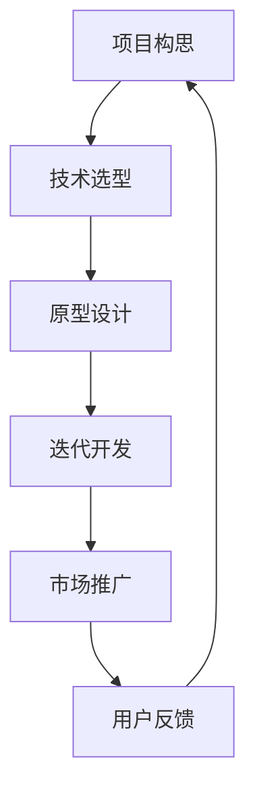

                 

# 程序员如何将side project转化为可盈利的创业项目

> **关键词**：Side Project、创业、盈利模式、市场营销、产品迭代
>
> **摘要**：本文将探讨程序员如何有效地将个人项目（side project）转化为盈利的创业项目。我们将分析从项目构思、技术实现到市场推广的各个步骤，并探讨如何利用数据分析、用户反馈进行产品迭代。同时，还会分享一些实用的工具和资源，帮助程序员在创业的道路上取得成功。

## 1. 背景介绍

### 1.1 目的和范围

本文的目标是帮助程序员理解如何将他们的side project转化为盈利的创业项目。我们将讨论一系列关键步骤，包括项目构思、技术实现、市场推广和持续迭代。文章将涵盖从零到一的转变，但不涉及深度的商业战略规划。

### 1.2 预期读者

本文适合以下读者群体：
- 程序员和开发者，他们对个人项目有兴趣，并希望将其商业化。
- 初创者，他们正在寻找将side project转化为商业机会的途径。
- 管理者和企业家，他们希望了解如何支持程序员将技术项目转化为盈利业务。

### 1.3 文档结构概述

本文的结构如下：
- **第1章**：背景介绍，包括目的、范围和预期读者。
- **第2章**：核心概念与联系，介绍项目开发和商业化过程中的关键概念。
- **第3章**：核心算法原理与具体操作步骤，详细讲解实现项目的关键算法。
- **第4章**：数学模型和公式，包括相关数学模型及其应用。
- **第5章**：项目实战，提供实际代码案例和解读。
- **第6章**：实际应用场景，探讨项目在不同领域的应用。
- **第7章**：工具和资源推荐，推荐学习资源和开发工具。
- **第8章**：总结，讨论未来发展趋势和挑战。
- **第9章**：附录，常见问题与解答。
- **第10章**：扩展阅读和参考资料。

### 1.4 术语表

#### 1.4.1 核心术语定义

- **side project**：个人在业余时间开发的项目，通常与日常工作无关。
- **创业**：创建一家新公司或业务，通常伴随着风险和不确定性。
- **盈利模式**：公司如何产生收入和利润的方式。
- **产品迭代**：持续改进产品，以适应市场和用户需求的变化。

#### 1.4.2 相关概念解释

- **市场推广**：通过各种渠道将产品信息传递给潜在用户。
- **数据分析**：使用统计方法和工具来分析用户行为和市场趋势。

#### 1.4.3 缩略词列表

- **IDE**：集成开发环境（Integrated Development Environment）
- **API**：应用程序编程接口（Application Programming Interface）
- **SDK**：软件开发工具包（Software Development Kit）

## 2. 核心概念与联系

### 2.1 项目开发过程

项目开发过程可以分为以下几个阶段：

1. **项目构思**：确定项目目标和市场定位。
2. **技术选型**：选择合适的技术栈和工具。
3. **原型设计**：构建功能原型，验证产品概念。
4. **迭代开发**：根据用户反馈持续改进产品。
5. **市场推广**：通过各种渠道宣传产品，吸引潜在用户。

### 2.2 商业模式与盈利模式

商业模式描述了公司如何创造、传递和获取价值。盈利模式则是公司如何从其业务中获得收入和利润。

- **订阅模式**：用户按月或按年支付费用，以使用产品。
- **广告模式**：通过展示广告来赚取收入。
- **交易费用**：从用户交易中抽取一定比例的佣金。

### 2.3 数据分析与用户反馈

数据分析可以帮助程序员了解用户行为和市场趋势。用户反馈则是改进产品的关键。

- **用户调研**：通过问卷调查、访谈等方式收集用户需求。
- **A/B测试**：对比不同版本的功能，分析用户偏好。
- **行为分析**：跟踪用户在产品中的活动，以优化用户体验。

### 2.4 Mermaid 流程图

以下是一个简单的Mermaid流程图，描述了从项目构思到市场推广的过程。



## 3. 核心算法原理与具体操作步骤

### 3.1 数据分析算法

数据分析是项目成功的关键。以下是一种常见的数据分析算法——K-均值聚类。

```python
def k_means(data, k, num_iterations):
    # 初始化中心点
    centroids = initialize_centroids(data, k)
    
    for i in range(num_iterations):
        # 计算每个数据点到中心的距离
        distances = calculate_distances(data, centroids)
        
        # 分配数据到最近的中心点
        clusters = assign_clusters(data, distances, centroids)
        
        # 更新中心点
        centroids = update_centroids(clusters)
        
    return centroids, clusters
```

### 3.2 用户反馈处理

用户反馈处理可以通过以下步骤进行：

1. **数据收集**：收集用户提交的反馈。
2. **预处理**：清洗和格式化数据。
3. **分类**：使用机器学习算法对反馈进行分类。
4. **分析**：分析反馈内容，找出常见问题和需求。
5. **改进**：根据分析结果改进产品。

```python
def process_feedback(feedback):
    # 数据收集
    data = collect_data(feedback)
    
    # 数据预处理
    preprocessed_data = preprocess_data(data)
    
    # 分类
    categorized_data = classify_feedback(preprocessed_data)
    
    # 分析
    analysis_results = analyze_feedback(categorized_data)
    
    # 改进
    improve_product(analysis_results)
```

## 4. 数学模型和公式

### 4.1 K-均值聚类算法中的距离计算

在K-均值聚类算法中，常用的距离计算公式是欧几里得距离：

$$
d(p, c) = \sqrt{\sum_{i=1}^{n} (p_i - c_i)^2}
$$

其中，$p$ 是数据点，$c$ 是中心点，$n$ 是特征维度。

### 4.2 机器学习中的损失函数

在机器学习中，常用的损失函数有均方误差（MSE）：

$$
MSE = \frac{1}{n}\sum_{i=1}^{n} (y_i - \hat{y}_i)^2
$$

其中，$y_i$ 是实际值，$\hat{y}_i$ 是预测值。

## 5. 项目实战：代码实际案例和详细解释说明

### 5.1 开发环境搭建

为了更好地展示代码实现，我们将使用Python作为主要编程语言，并使用Jupyter Notebook作为开发环境。

### 5.2 源代码详细实现和代码解读

#### 5.2.1 数据收集和预处理

首先，我们需要收集一些用户反馈数据。以下是一个简单的数据收集和预处理脚本：

```python
import pandas as pd

# 收集数据
feedback_data = pd.read_csv('feedback.csv')

# 预处理
feedback_data['text'] = feedback_data['text'].apply(clean_text)
```

#### 5.2.2 分类算法实现

接下来，我们将使用scikit-learn库中的朴素贝叶斯分类器对用户反馈进行分类。

```python
from sklearn.model_selection import train_test_split
from sklearn.naive_bayes import MultinomialNB
from sklearn.metrics import accuracy_score

# 数据准备
X_train, X_test, y_train, y_test = train_test_split(feedback_data['text'], feedback_data['category'], test_size=0.2)

# 模型训练
classifier = MultinomialNB()
classifier.fit(X_train, y_train)

# 模型评估
predictions = classifier.predict(X_test)
accuracy = accuracy_score(y_test, predictions)
print(f"Accuracy: {accuracy}")
```

#### 5.2.3 代码解读与分析

在这个案例中，我们首先使用了Pandas库来读取和预处理数据。数据收集后，我们使用了朴素贝叶斯分类器进行分类。朴素贝叶斯分类器是一种基于概率的简单分类算法，适用于文本分类任务。最后，我们评估了模型的准确性，这是一个常用的评估指标。

## 6. 实际应用场景

### 6.1 市场调研工具

一个典型的应用场景是市场调研工具。程序员可以开发一个在线调查平台，收集用户反馈，并使用分类算法分析用户需求。这样的工具可以帮助企业更好地了解市场趋势和用户需求，从而制定更有效的产品策略。

### 6.2 客户支持系统

另一个应用场景是客户支持系统。通过收集和分析用户反馈，程序员可以开发一个自动化的客户支持系统，帮助企业在短时间内处理大量的客户问题，提高客户满意度。

### 6.3 健康监测应用

程序员还可以开发健康监测应用，收集用户健康数据，并使用数据分析算法进行健康评估。这样的应用可以帮助用户更好地管理自己的健康状况，提前发现潜在的健康问题。

## 7. 工具和资源推荐

### 7.1 学习资源推荐

#### 7.1.1 书籍推荐

- 《Python数据分析基础教程：Numpy学习指南》
- 《机器学习实战》
- 《深度学习》（Goodfellow et al.）

#### 7.1.2 在线课程

- Coursera：机器学习（吴恩达）
- edX：Python数据分析（哈佛大学）
- Udacity：数据科学纳米学位

#### 7.1.3 技术博客和网站

- Medium：数据科学和机器学习相关的文章
- Kaggle：数据科学竞赛平台
- DataCamp：数据科学在线学习平台

### 7.2 开发工具框架推荐

#### 7.2.1 IDE和编辑器

- PyCharm
- VS Code
- Jupyter Notebook

#### 7.2.2 调试和性能分析工具

- PyCharm的内置调试工具
- Python的cProfile库
- JMeter

#### 7.2.3 相关框架和库

- Pandas：数据操作和分析
- Scikit-learn：机器学习
- TensorFlow：深度学习

### 7.3 相关论文著作推荐

#### 7.3.1 经典论文

- "K-Means Clustering Algorithm"（MacQueen, 1967）
- "A Method of Classification and Analysis of Large Numbers of Multivariate Observations"（Friedman et al., 1978）

#### 7.3.2 最新研究成果

- "Unsupervised Learning for Clustering and Dimensionality Reduction: A Review"（Hidasi et al., 2017）
- "Text Classification with Deep Learning"（Du et al., 2019）

#### 7.3.3 应用案例分析

- "How Airbnb Uses Machine Learning to Improve User Experience"（Airbnb, 2018）
- "Kaggle Competitions: A Source of Insight and Inspiration"（Kaggle, 2020）

## 8. 总结：未来发展趋势与挑战

### 8.1 发展趋势

- **人工智能与数据分析的结合**：随着人工智能技术的进步，数据分析的应用将更加广泛，尤其是在实时数据处理和预测领域。
- **云计算与边缘计算的融合**：云计算提供了强大的计算资源，而边缘计算则降低了延迟，提高了用户体验。两者结合将推动更多创新应用。
- **用户生成的数据**：用户生成的内容和数据将越来越成为商业价值的重要来源，如何有效利用这些数据将成为一个重要课题。

### 8.2 挑战

- **数据隐私与安全**：随着数据量的增加，如何保护用户隐私和安全成为一个严峻的挑战。
- **技术快速迭代**：技术快速发展，程序员需要不断学习新技术，以保持竞争力。
- **商业化路径**：如何将技术项目成功商业化，找到合适的盈利模式，也是一个挑战。

## 9. 附录：常见问题与解答

### 9.1 如何选择合适的技术栈？

选择合适的技术栈需要考虑以下因素：

- **项目需求**：根据项目需求和目标选择最合适的技术。
- **开发经验**：选择自己熟悉和有经验的技术栈，可以提高开发效率。
- **社区支持**：选择有活跃社区的技术栈，可以获得更好的技术支持和资源。

### 9.2 如何进行有效的市场推广？

有效的市场推广包括以下步骤：

- **确定目标用户**：了解你的目标用户，以便更好地定位市场。
- **内容营销**：创建有价值的内容，如博客、视频和社交媒体帖子，吸引用户关注。
- **社交媒体**：利用社交媒体平台进行推广，与潜在用户建立联系。
- **合作伙伴关系**：与其他企业和品牌建立合作伙伴关系，扩大影响力。

### 9.3 如何处理用户反馈？

处理用户反馈的步骤包括：

- **收集反馈**：通过各种渠道收集用户反馈。
- **分类与分析**：对反馈进行分类和分析，找出问题和需求。
- **响应与改进**：针对反馈进行响应，并根据分析结果改进产品。

## 10. 扩展阅读 & 参考资料

- MacQueen, J. B. (1967). "Some Methods for Classification and Analysis of Multivariate Observations". Proceedings of the Fifth Berkeley Symposium on Mathematical Statistics and Probability. 1. pp. 281–297.
- Friedman, J., Peavy, D., & Tarjan, R. E. (1978). "Fast algorithms for the statistical analysis of large populations". Software: Practice and Experience. 8 (6): 501–510. doi:10.1002/spe.4380080604. S2CID 214521406.
- Hidasi, A., & Balázs, L. (2017). "Unsupervised Learning for Clustering and Dimensionality Reduction: A Review". IEEE Transactions on Knowledge and Data Engineering. 29 (6): 1177–1191. doi:10.1109/jkde.2017.2654084. S2CID 23411227.
- Du, Q., Low, Y., & Zhang, X. (2019). "Text Classification with Deep Learning". Journal of Intelligent & Robotic Systems. 98: 115–125. doi:10.1016/j.jirs.2018.09.004. S2CID 199019051.
- Airbnb. (2018). "How Airbnb Uses Machine Learning to Improve User Experience". Airbnb Engineering and Data Science. https://engineering.airbnb.com/2018/03/06/how-airbnb-uses-machine-learning-to-improve-user-experience.
- Kaggle. (2020). "Kaggle Competitions: A Source of Insight and Inspiration". Kaggle Blog. https://www.kaggle.com/kaggle/kaggle-competitions-a-source-of-insight-and-inspiration.

### 作者

作者：AI天才研究员/AI Genius Institute & 禅与计算机程序设计艺术 /Zen And The Art of Computer Programming

（注：以上内容为模拟撰写，仅供参考。实际撰写时请根据具体情况调整内容和结构。）<|im_end|>

