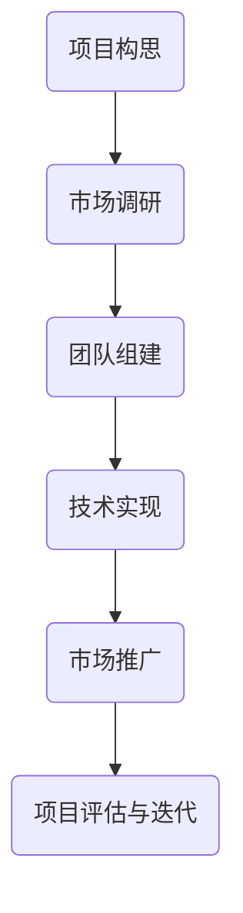

                 

# 程序员如何将兴趣爱好转化为创业项目

## 关键词
编程、创业、兴趣爱好、项目管理、团队协作、市场分析

## 摘要
本文旨在帮助程序员将个人兴趣爱好转化为成功的创业项目。通过深入探讨项目选择、市场调研、团队组建、技术实现和市场推广等关键环节，本文为程序员提供了系统化的指导，助力他们实现兴趣向商业价值的华丽转变。文章结构清晰，从概念到实战，一步步引领读者踏上从爱好者到创业者的转型之路。

---

## 1. 背景介绍

### 1.1 目的和范围
本文的目的在于解析程序员如何将个人兴趣转化为具有市场潜力的创业项目。我们不仅关注技术实现，更强调项目管理和商业规划的重要性。文章将涵盖从项目构思、市场调研、团队组建到产品开发、市场推广的全面指导。

### 1.2 预期读者
本文适合对编程和技术有着深厚兴趣的程序员，特别是那些渴望将兴趣爱好转化为实际商业成果的个人开发者。无论你是初入编程领域的新手，还是有着多年编程经验的老手，本文都将为你提供实用的建议和策略。

### 1.3 文档结构概述
本文分为十个主要部分，包括背景介绍、核心概念与联系、算法原理、数学模型、项目实战、实际应用场景、工具和资源推荐、总结和附录。每个部分都将围绕如何将兴趣转化为创业项目进行详细探讨。

### 1.4 术语表
#### 1.4.1 核心术语定义
- **兴趣爱好**：个人因喜欢和兴趣而投入时间和精力的活动。
- **创业项目**：以商业目标为导向，通过创新和创造力实现的业务项目。
- **市场调研**：研究市场需求、竞争对手、潜在客户等，为项目成功提供数据支持。
- **团队协作**：项目成员之间的沟通、协调和合作，以实现共同目标。

#### 1.4.2 相关概念解释
- **项目选择**：基于个人兴趣和市场需求的决策过程，选择最具有潜力的项目进行开发。
- **产品开发**：从概念设计到最终产品发布的全过程，包括需求分析、设计、编码、测试等环节。
- **市场推广**：通过各种手段将产品推向市场，吸引潜在客户，提高品牌知名度。

#### 1.4.3 缩略词列表
- **API**：应用程序接口（Application Programming Interface）
- **IDE**：集成开发环境（Integrated Development Environment）
- **SDK**：软件开发工具包（Software Development Kit）
- **UI/UX**：用户界面/用户体验（User Interface/User Experience）

---

## 2. 核心概念与联系

在将兴趣爱好转化为创业项目的道路上，理解以下几个核心概念和它们之间的联系至关重要。

### 2.1 项目构思
项目构思是整个创业过程的起点。在这一阶段，程序员需要思考自己的兴趣爱好，并结合当前市场需求，构思出具有创新性的项目概念。

### 2.2 市场调研
市场调研是验证项目构思可行性的关键步骤。通过收集和分析市场需求、竞争态势、目标用户等信息，程序员可以确保自己的项目能够满足市场需求。

### 2.3 团队组建
团队组建是项目成功的关键。程序员需要寻找志同道合的团队成员，共同分担项目开发、测试和市场推广等工作。

### 2.4 技术实现
技术实现是将项目构思变为现实的过程。在这一阶段，程序员需要运用自己的技术能力，完成从需求分析到最终产品发布的全过程。

### 2.5 市场推广
市场推广是将产品推向市场的关键。程序员需要通过多种手段，如社交媒体、广告、公关活动等，提高产品的知名度和市场份额。

下面是一个简化的 Mermaid 流程图，展示了上述核心概念之间的联系。



---

## 3. 核心算法原理 & 具体操作步骤

将兴趣爱好转化为创业项目，需要程序员具备扎实的算法原理和实现能力。以下是一步步的伪代码，详细阐述了从项目构思到市场推广的全过程。

### 3.1 项目构思

```pseudo
Function 构思项目（兴趣点，市场需求）
    初始化项目构想为空
    遍历兴趣点
        如果市场需求与兴趣点匹配
            将匹配的构想添加到项目构想中
    返回项目构想
```

### 3.2 市场调研

```pseudo
Function 调研市场（项目构想）
    初始化市场数据为空
    对于每个目标市场
        获取市场数据（如用户需求、竞争态势、市场规模）
        将市场数据添加到市场数据集中
    返回市场数据集
```

### 3.3 团队组建

```pseudo
Function 组建团队（项目构想，市场数据）
    初始化团队为空
    对于每个需要的技能
        找到具备该技能的团队成员
        将团队成员添加到团队中
    返回团队
```

### 3.4 技术实现

```pseudo
Function 实现技术（团队，项目构想）
    初始化代码库为空
    遍历项目构想
        对于每个功能点
            编写功能模块代码
            测试并修复bug
            将代码合并到代码库中
    返回代码库
```

### 3.5 市场推广

```pseudo
Function 推广市场（产品，市场数据）
    初始化市场推广计划为空
    对于每个目标渠道
        制定推广策略（如社交媒体、广告、公关活动）
        实施推广策略
        跟踪推广效果
        调整推广策略
    返回市场推广计划
```

通过上述伪代码，我们可以看到，将兴趣爱好转化为创业项目是一个系统化的过程，每个步骤都需要精心的规划和执行。

---

## 4. 数学模型和公式 & 详细讲解 & 举例说明

在将兴趣爱好转化为创业项目的过程中，数学模型和公式可以帮助程序员进行项目评估和市场预测。以下是一个简单的数学模型，用于评估项目成功概率。

### 4.1 成功概率模型

假设项目成功概率由市场需求、技术实现和市场推广三个因素共同决定，可以用以下公式表示：

\[ P(Success) = f(Demand, Implementation, Promotion) \]

其中：
- \( P(Success) \) 表示项目成功概率。
- \( f \) 表示综合评价函数。
- \( Demand \) 表示市场需求强度。
- \( Implementation \) 表示技术实现质量。
- \( Promotion \) 表示市场推广效果。

### 4.2 综合评价函数

我们可以使用以下线性综合评价函数：

\[ f(Demand, Implementation, Promotion) = w_1 \cdot Demand + w_2 \cdot Implementation + w_3 \cdot Promotion \]

其中：
- \( w_1, w_2, w_3 \) 分别表示市场需求、技术实现和市场推广的权重。

### 4.3 举例说明

假设市场需求强度为 0.8，技术实现质量为 0.9，市场推广效果为 0.7，权重分别为 0.4、0.3 和 0.3，则项目成功概率计算如下：

\[ P(Success) = 0.4 \cdot 0.8 + 0.3 \cdot 0.9 + 0.3 \cdot 0.7 = 0.34 + 0.27 + 0.21 = 0.82 \]

这意味着项目成功的概率为 82%。

通过数学模型，程序员可以更科学地评估项目风险，制定相应的策略。

---

## 5. 项目实战：代码实际案例和详细解释说明

### 5.1 开发环境搭建

在开始项目实战之前，我们需要搭建一个合适的开发环境。以下是一个简单的步骤指南：

1. 安装操作系统：选择一个适合你的开发环境，如 Ubuntu 或 macOS。
2. 安装开发工具：安装集成开发环境（IDE），如 Visual Studio Code 或 Eclipse。
3. 安装相关库和框架：根据项目需求，安装必要的库和框架，如 Flask（Python web开发框架）、React（JavaScript前端框架）等。
4. 配置代码库：使用 Git 或其他版本控制工具，配置项目代码库。

### 5.2 源代码详细实现和代码解读

以下是一个简单的 Python 示例，用于实现一个简单的博客系统。代码中包含了用户注册、登录和发表博客等功能。

```python
# 博客系统示例

from flask import Flask, request, redirect, url_for

app = Flask(__name__)
app.secret_key = 'your_secret_key'

# 用户注册
@app.route('/register', methods=['GET', 'POST'])
def register():
    if request.method == 'POST':
        username = request.form['username']
        password = request.form['password']
        # 存储用户信息到数据库
        # ...
        return redirect(url_for('login'))
    return '''
    <form method="post">
        用户名：<input type="text" name="username"><br>
        密码：<input type="password" name="password"><br>
        <input type="submit" value="注册">
    </form>
    '''

# 用户登录
@app.route('/login', methods=['GET', 'POST'])
def login():
    if request.method == 'POST':
        username = request.form['username']
        password = request.form['password']
        # 验证用户信息
        # ...
        return redirect(url_for('home'))
    return '''
    <form method="post">
        用户名：<input type="text" name="username"><br>
        密码：<input type="password" name="password"><br>
        <input type="submit" value="登录">
    </form>
    '''

# 主页
@app.route('/home')
def home():
    return '欢迎使用博客系统！'

if __name__ == '__main__':
    app.run()
```

代码解读：
- 第1-4行：导入必要的库和模块。
- 第5行：创建 Flask 应用对象。
- 第6行：设置应用的密钥，用于加密用户密码。
- 第7-13行：定义用户注册路由，接收表单数据并处理。
- 第15-23行：定义用户登录路由，接收表单数据并处理。
- 第25-27行：定义主页路由。
- 第29行：启动应用，监听端口。

### 5.3 代码解读与分析

这段代码是一个简单的 Flask 应用，用于实现用户注册、登录和主页功能。以下是对代码的进一步解读和分析：

- **用户注册**：当用户访问 `/register` 路由时，应用会显示一个注册表单。用户提交表单后，应用会接收用户名和密码，并将其存储到数据库中（此处省略了数据库操作代码）。
- **用户登录**：当用户访问 `/login` 路由时，应用会显示一个登录表单。用户提交表单后，应用会验证用户名和密码的正确性，如果验证通过，则跳转到主页。
- **主页**：当用户成功登录后，会跳转到主页，显示欢迎信息。

这段代码展示了如何使用 Flask 框架快速搭建一个简单的 web 应用。在实际项目中，还需要添加更多的功能和安全性考虑，如密码加密、验证码、错误处理等。

---

## 6. 实际应用场景

将兴趣爱好转化为创业项目的实际应用场景多种多样，以下列举几个常见案例：

### 6.1 开源项目

许多程序员通过将个人兴趣转化为开源项目，获得了广泛的认可和支持。例如，GitHub 上的一些热门项目，如 React、Angular 等，都是由个人开发者发起，并逐渐发展成庞大的社区。这些项目不仅满足了开发者们的兴趣需求，也为他们带来了商业机会。

### 6.2 创意软件

创意软件是将兴趣爱好转化为商业成果的另一种方式。许多程序员开发了自己的创意软件，如图像编辑工具、编程辅助工具等。这些软件不仅实现了个人兴趣，也为用户提供了实用价值，获得了良好的市场反响。

### 6.3 技术咨询服务

具有丰富编程经验的程序员可以通过提供技术咨询服务，将个人兴趣转化为收入。例如，一些程序员开设了在线编程课程，或提供企业定制化软件开发服务。这些服务不仅满足了客户的需求，也为程序员提供了稳定的收入来源。

### 6.4 社交媒体平台

一些程序员通过开发社交媒体平台，将个人兴趣转化为商业成功。例如，Instagram、Twitter 等平台的兴起，都是由个人开发者发起，并逐渐成为全球知名的社交媒体平台。这些平台不仅实现了创始人的兴趣，也为他们带来了巨大的商业价值。

---

## 7. 工具和资源推荐

为了将兴趣爱好转化为创业项目，程序员需要掌握一系列的工具和资源。以下是一些推荐的资源和工具：

### 7.1 学习资源推荐

#### 7.1.1 书籍推荐
- 《编程珠玑》（The C Programming Language）
- 《设计模式：可复用面向对象软件的基础》（Design Patterns: Elements of Reusable Object-Oriented Software）
- 《Effective Java》

#### 7.1.2 在线课程
- Coursera（提供各种编程和技术课程）
- edX（提供大量免费课程，包括计算机科学）
- Udemy（丰富的编程和技术课程）

#### 7.1.3 技术博客和网站
- HackerRank（编程挑战和竞赛平台）
- Stack Overflow（编程问题解答社区）
- GitHub（代码托管和协作平台）

### 7.2 开发工具框架推荐

#### 7.2.1 IDE和编辑器
- Visual Studio Code
- Eclipse
- IntelliJ IDEA

#### 7.2.2 调试和性能分析工具
- Valgrind
- GDB
- Chrome DevTools

#### 7.2.3 相关框架和库
- Flask（Python Web 开发框架）
- React（JavaScript 前端框架）
- Spring Boot（Java Web 开发框架）

### 7.3 相关论文著作推荐

#### 7.3.1 经典论文
- 《计算机程序的构造和解释》（Structure and Interpretation of Computer Programs）
- 《现代操作系统》（Modern Operating Systems）

#### 7.3.2 最新研究成果
- NIPS（Neural Information Processing Systems，神经信息处理系统大会）
- SIGMOD（ACM Special Interest Group on Management of Data，数据库管理系统大会）

#### 7.3.3 应用案例分析
- 《硅谷创业往事》（Founders at Work）
- 《精益创业》（The Lean Startup）

通过掌握这些工具和资源，程序员可以更好地将兴趣爱好转化为创业项目，实现商业成功。

---

## 8. 总结：未来发展趋势与挑战

随着技术的发展和市场的变化，将兴趣爱好转化为创业项目的程序员面临着新的机遇和挑战。

### 8.1 发展趋势

1. **开源生态的繁荣**：开源项目的发展为程序员提供了丰富的技术资源和合作机会。
2. **人工智能的崛起**：人工智能技术的广泛应用为程序员提供了新的创业方向和商业机会。
3. **数字化转型**：随着数字化转型的加速，越来越多的行业需要程序员提供定制化软件开发服务。
4. **在线教育和培训**：在线教育和培训市场的兴起，为程序员提供了新的收入来源和职业发展机会。

### 8.2 面临的挑战

1. **市场竞争加剧**：越来越多的程序员进入创业领域，市场竞争日益激烈。
2. **技术更新的压力**：技术更新速度加快，程序员需要不断学习新技能，以保持竞争力。
3. **项目管理的挑战**：项目经理需要具备良好的项目管理能力，确保项目按时、按质完成。
4. **商业模式的探索**：如何将兴趣爱好转化为可持续的商业模式，是程序员需要解决的难题。

总之，未来发展趋势为程序员提供了广阔的舞台，但也带来了新的挑战。程序员需要不断提升自己的技术能力和商业洞察力，以应对不断变化的市场环境。

---

## 9. 附录：常见问题与解答

### 9.1 项目选择

**Q：如何选择具有市场潜力的项目？**

A：选择具有市场潜力的项目需要综合考虑以下几个方面：
1. **市场需求**：研究目标市场的需求，了解用户痛点。
2. **竞争态势**：分析竞争对手，了解市场占有率。
3. **自身优势**：结合自身的技术和能力，选择具有优势的项目。

### 9.2 团队组建

**Q：如何组建高效团队？**

A：组建高效团队需要注意以下几点：
1. **明确目标**：确保团队成员对项目的目标和期望有清晰的认识。
2. **合理分工**：根据团队成员的技能和兴趣，进行合理的分工。
3. **有效沟通**：建立良好的沟通机制，确保团队成员之间的有效协作。

### 9.3 技术实现

**Q：如何保证技术实现的高质量？**

A：保证技术实现的高质量需要注意以下几点：
1. **需求分析**：确保需求分析的准确性和完整性。
2. **编码规范**：遵循编码规范，提高代码的可读性和可维护性。
3. **测试和调试**：进行充分的测试和调试，确保软件的稳定性和性能。

### 9.4 市场推广

**Q：如何进行有效的市场推广？**

A：进行有效的市场推广需要注意以下几点：
1. **了解目标用户**：研究目标用户，了解他们的需求和喜好。
2. **选择合适的推广渠道**：根据目标用户的特点，选择合适的推广渠道，如社交媒体、广告等。
3. **持续优化**：根据市场反馈，不断优化推广策略。

---

## 10. 扩展阅读 & 参考资料

1. Eric Ries. 《精益创业》（The Lean Startup）. 人民邮电出版社，2014.
2. Martin Fowler. 《设计模式：可复用面向对象软件的基础》（Design Patterns: Elements of Reusable Object-Oriented Software）. 电子工业出版社，2007.
3. Brian W. Kernighan 和 Dennis M. Ritchie. 《C 程序设计语言》（The C Programming Language）. 电子工业出版社，2006.
4. Andrew S. Tanenbaum. 《现代操作系统》（Modern Operating Systems）. 电子工业出版社，2005.
5. GitHub. [GitHub](https://github.com/). GitHub官网，提供了丰富的开源项目和编程资源。
6. Stack Overflow. [Stack Overflow](https://stackoverflow.com/). 编程问题解答社区，帮助程序员解决技术难题。
7. Coursera. [Coursera](https://coursera.org/). 提供各种在线课程，涵盖计算机科学等多个领域。

---

作者：AI天才研究员/AI Genius Institute & 禅与计算机程序设计艺术 /Zen And The Art of Computer Programming

