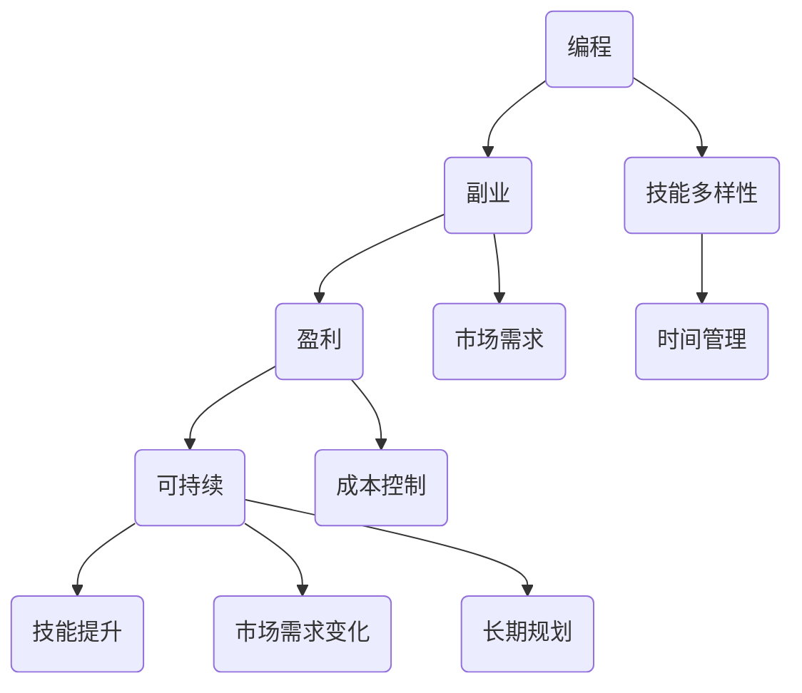

                 


# 程序员如何将兴趣爱好转化为可持续盈利的副业

> 关键词：程序员、兴趣爱好、副业、盈利、可持续

> 摘要：本文将探讨程序员如何将自己的兴趣爱好转化为一种可持续盈利的副业。我们将从理论分析和实际案例出发，帮助程序员朋友们找到适合自己的方向，并通过具体操作步骤来实现这一目标。

## 1. 背景介绍

### 1.1 目的和范围

本文的目标是帮助程序员将自己的兴趣爱好转化为可持续盈利的副业。我们将探讨以下几个方面：

- 如何识别和评估自己的兴趣爱好。
- 如何找到与兴趣爱好相关的市场机会。
- 如何设计、开发和运营一个盈利模式。
- 如何利用技术和资源来优化和推广副业。

### 1.2 预期读者

本文主要面向以下读者：

- 有志于将兴趣爱好转化为副业的程序员。
- 想要提升自己副业盈利能力的程序员。
- 对编程和商业感兴趣的初学者。

### 1.3 文档结构概述

本文的结构如下：

1. 背景介绍：介绍本文的目的、预期读者和文档结构。
2. 核心概念与联系：解释本文的核心概念和原理。
3. 核心算法原理 & 具体操作步骤：详细阐述如何将兴趣爱好转化为副业。
4. 数学模型和公式 & 详细讲解 & 举例说明：运用数学模型来分析盈利模式。
5. 项目实战：代码实际案例和详细解释说明。
6. 实际应用场景：介绍不同的应用场景。
7. 工具和资源推荐：推荐相关的学习资源和工具。
8. 总结：未来发展趋势与挑战。
9. 附录：常见问题与解答。
10. 扩展阅读 & 参考资料。

### 1.4 术语表

#### 1.4.1 核心术语定义

- 副业：在主职业之外从事的、能够带来额外收入的工作。
- 盈利模式：企业或个人通过某种方式获取利润的机制。
- 可持续：能够长期维持并不断发展的。

#### 1.4.2 相关概念解释

- 兴趣爱好：个人在非工作时间内追求的、能带来愉悦的活动。
- 市场需求：消费者对某种产品或服务的需求程度。
- 技术栈：程序员在特定项目中所使用的编程语言、框架和工具。

#### 1.4.3 缩略词列表

- IDE：集成开发环境（Integrated Development Environment）
- API：应用程序编程接口（Application Programming Interface）
- HTML：超文本标记语言（Hypertext Markup Language）
- CSS：层叠样式表（Cascading Style Sheets）
- JavaScript：一种编程语言
- SQL：结构化查询语言（Structured Query Language）

<|css|\|\|  
h2 {
  color: blue;
}

h3 {
  color: green;
}

p {
  font-size: 16px;
  line-height: 1.5;
}

ul {
  list-style-type: disc;
}

ol {
  list-style-type: decimal;
}

code {
  background-color: #f5f5f5;
  border: 1px solid #ddd;
  padding: 2px 4px;
  font-family: monospace;
}

|>\|markdown|

## 2. 核心概念与联系

在本节中，我们将介绍本文的核心概念，包括编程、副业、盈利和可持续。这些概念相互关联，构成了一个完整的框架，帮助我们理解如何将兴趣爱好转化为可持续盈利的副业。

### 2.1 编程

编程是程序员的核心技能，它涉及编写、调试和优化计算机程序。编程不仅需要逻辑思维和问题解决能力，还需要对各种编程语言和工具的深入了解。以下是编程的关键概念：

- **编程语言**：如Python、Java、C++等，用于实现特定功能的代码。
- **编程范式**：如面向对象编程（OOP）、函数式编程（FP）等，用于组织代码的结构。
- **算法**：解决问题的步骤，可以通过编程语言实现。
- **数据结构**：组织和存储数据的方法，如数组、链表、树等。

### 2.2 副业

副业是指在工作之外从事的、能够带来额外收入的工作。对于程序员来说，副业不仅是一种经济来源，还可以帮助自己提升技能、拓展人脉和增加工作经验。以下是副业的关键概念：

- **技能多样性**：程序员可以通过副业学习新的技能，如UI设计、数据分析、项目管理等。
- **时间管理**：合理安排时间，确保主职业和副业都能得到充分发展。
- **市场需求**：了解市场需求，找到与自己技能匹配的副业机会。

### 2.3 盈利

盈利是指企业或个人通过某种方式获取利润的过程。对于程序员来说，将兴趣爱好转化为副业，盈利是衡量副业成功与否的重要标准。以下是盈利的关键概念：

- **盈利模式**：如何通过副业获取利润，如提供服务、销售产品、广告收入等。
- **成本控制**：在副业运营过程中，合理控制成本，提高盈利能力。
- **风险评估**：评估副业的潜在风险，并制定应对策略。

### 2.4 可持续

可持续是指在长期内能够维持并不断发展的状态。对于副业来说，可持续意味着能够持续地为程序员带来收入，同时保持兴趣和热情。以下是可持续的关键概念：

- **技能提升**：通过副业不断学习和提升技能，保持竞争力。
- **市场需求变化**：关注市场需求的变化，及时调整副业方向。
- **长期规划**：制定长期发展规划，确保副业的可持续性。

### 2.5 Mermaid 流程图

为了更好地理解这些核心概念之间的联系，我们可以使用 Mermaid 流程图来展示它们之间的关系。



通过以上流程图，我们可以清晰地看到编程、副业、盈利和可持续之间的相互关系。程序员需要通过编程技能找到适合自己的副业，并通过有效的市场调研和运营策略实现盈利，同时保持可持续的发展。

## 3. 核心算法原理 & 具体操作步骤

### 3.1 确定兴趣爱好

要将兴趣爱好转化为可持续盈利的副业，第一步是确定自己的兴趣爱好。以下是一个具体的操作步骤：

1. **自我评估**：反思自己的日常活动，找出最感兴趣的事情。可以尝试回答以下问题：

   - 我最喜欢做什么？
   - 我在什么情况下感到最满足？
   - 我的技能和兴趣是否能够转化为盈利？

2. **技能评估**：分析自己的技能，看看哪些技能与兴趣爱好相关。例如，如果你喜欢摄影，你可能需要评估自己的摄影技术和后期处理技能。

3. **市场需求分析**：了解市场对相关技能的需求。可以通过以下方式获取信息：

   - 在社交媒体上关注相关领域，了解行业动态。
   - 调研市场中的竞争对手，了解他们的盈利模式。

### 3.2 确定市场机会

确定了兴趣爱好和市场需求后，下一步是找到适合自己的市场机会。以下是一些具体步骤：

1. **市场调研**：深入了解目标市场，了解潜在客户的需求和痛点。

2. **确定产品或服务**：基于市场需求，确定提供的产品或服务。例如，如果你喜欢编程，你可以考虑开发一个开源项目，或者提供编程咨询服务。

3. **竞争分析**：分析市场上的竞争对手，了解他们的优势和劣势。这有助于你制定差异化策略。

### 3.3 设计、开发和运营

在确定了市场机会后，接下来是设计、开发和运营你的副业。以下是一个详细的操作步骤：

1. **设计阶段**：制定项目计划，包括功能需求、技术实现和用户体验设计。

2. **开发阶段**：根据项目计划进行开发和测试。确保产品或服务能够满足市场需求。

3. **测试阶段**：进行用户体验测试，收集反馈并优化产品或服务。

4. **运营阶段**：将产品或服务推向市场，进行宣传和推广。同时，定期更新和维护，确保产品或服务的持续发展。

### 3.4 盈利模式

在设计和开发阶段，需要考虑如何实现盈利。以下是一些常见的盈利模式：

1. **提供服务**：如编程咨询、UI设计、数据分析等服务。
2. **销售产品**：如开发应用程序、在线课程等。
3. **广告收入**：在网站或应用程序中投放广告。
4. **会员订阅**：提供高级功能或内容，通过会员订阅获取收入。

### 3.5 成本控制

在运营副业时，成本控制至关重要。以下是一些成本控制的策略：

1. **合理定价**：根据市场需求和成本，合理定价你的产品或服务。
2. **减少不必要的开支**：避免不必要的开支，如购买昂贵的硬件设备。
3. **自动化和优化**：利用技术和工具来提高效率和降低成本。

### 3.6 风险评估

在运营副业时，需要考虑潜在的风险。以下是一些常见的风险评估策略：

1. **市场风险**：关注市场需求的变化，及时调整产品或服务。
2. **技术风险**：确保技术实现能够满足市场需求。
3. **财务风险**：合理规划财务，避免过度依赖某一收入来源。

### 3.7 总结

通过以上步骤，程序员可以将自己的兴趣爱好转化为可持续盈利的副业。以下是核心步骤的总结：

1. 确定兴趣爱好和市场机会。
2. 设计、开发和运营产品或服务。
3. 选择合适的盈利模式。
4. 进行成本控制和风险评估。

通过以上步骤，程序员不仅能够实现个人兴趣的满足，还能获得额外的收入。接下来，我们将通过一个实际案例来进一步说明这一过程。

## 4. 数学模型和公式 & 详细讲解 & 举例说明

### 4.1 盈利模型

在将兴趣爱好转化为可持续盈利的副业时，一个关键的数学模型是盈利模型。盈利模型可以帮助我们预测和计算副业的收入和利润。以下是一个简单的盈利模型：

\[ \text{利润} = \text{收入} - \text{成本} \]

其中：

- 收入（Revenue）：副业通过提供服务或销售产品获得的收入。
- 成本（Cost）：运营副业所产生的费用，包括人力成本、材料成本、运营成本等。

#### 4.1.1 收入计算

收入可以通过以下公式计算：

\[ \text{收入} = \text{单价} \times \text{销量} \]

- 单价（Unit Price）：每单位产品或服务的售价。
- 销量（Quantity）：在特定时间内销售的产品或服务数量。

#### 4.1.2 成本计算

成本可以通过以下公式计算：

\[ \text{成本} = \text{固定成本} + (\text{单位变动成本} \times \text{销量}) \]

- 固定成本（Fixed Cost）：在销量变化时不发生变化的费用，如租金、设备购买费用。
- 单位变动成本（Variable Cost）：每销售一个单位产品或服务所产生的费用，如原材料成本、人力成本。

#### 4.1.3 利润计算

利用上述公式，我们可以计算出利润：

\[ \text{利润} = \text{收入} - \text{成本} \]

\[ \text{利润} = (\text{单价} \times \text{销量}) - (\text{固定成本} + (\text{单位变动成本} \times \text{销量})) \]

#### 4.1.4 举例说明

假设一位程序员开发了一个开源项目，他计划通过提供付费扩展模块来盈利。以下是具体的例子：

- 单价（Unit Price）: 100元
- 销量（Quantity）: 1000个
- 固定成本（Fixed Cost）: 5000元
- 单位变动成本（Variable Cost）: 20元

首先，计算收入：

\[ \text{收入} = \text{单价} \times \text{销量} = 100元 \times 1000 = 100000元 \]

然后，计算成本：

\[ \text{成本} = \text{固定成本} + (\text{单位变动成本} \times \text{销量}) = 5000元 + (20元 \times 1000) = 5000元 + 20000元 = 25000元 \]

最后，计算利润：

\[ \text{利润} = \text{收入} - \text{成本} = 100000元 - 25000元 = 75000元 \]

通过这个例子，我们可以看到如何使用数学模型来计算利润。这对于程序员来说是一个重要的工具，可以帮助他们更好地规划和运营自己的副业。

### 4.2 成本效益分析

除了盈利模型，成本效益分析（Cost-Benefit Analysis，CBA）也是一个重要的工具。成本效益分析可以帮助程序员评估副业的投资回报率（ROI）。

成本效益分析的基本公式如下：

\[ \text{成本效益比} = \frac{\text{收益}}{\text{成本}} \]

其中：

- 收益（Benefit）：副业带来的所有正面影响，包括收入、技能提升、社交网络等。
- 成本（Cost）：运营副业所产生的所有费用，包括时间、资金、资源等。

#### 4.2.1 举例说明

假设一位程序员打算开发一个在线编程教程平台，他计划投入以下资源：

- 时间：每周投入20小时，每月工作4周，共80小时。
- 资金：购买服务器和域名，共5000元。
- 其他成本：如宣传费用、可能的合作费用等，共2000元。

他的目标是每月通过平台获得1000元收入。

首先，计算成本：

\[ \text{成本} = \text{时间成本} + \text{资金成本} + \text{其他成本} \]

时间成本（假设每小时工资为100元）：

\[ \text{时间成本} = 100元/小时 \times 80小时 = 8000元 \]

总成本：

\[ \text{成本} = 8000元 + 5000元 + 2000元 = 15000元 \]

然后，计算收益：

\[ \text{收益} = \text{收入} = 1000元/月 \times 12个月 = 12000元 \]

最后，计算成本效益比：

\[ \text{成本效益比} = \frac{\text{收益}}{\text{成本}} = \frac{12000元}{15000元} \approx 0.8 \]

这个结果表示，每投入1元的成本，可以带来0.8元的收益。虽然这个比率不是很高，但它表明该项目的收益是正的，并且随着时间的发展，可能会进一步提升。

通过成本效益分析，程序员可以更好地评估自己的副业，确定是否继续投入或者调整策略。

### 4.3 最大化收益的数学策略

除了计算利润和成本效益比，程序员还可以使用一些数学策略来最大化收益。以下是一些常用的策略：

1. **边际效益分析**：分析每个额外单位的产出和投入，找出边际效益最大的点。例如，如果每增加一个付费用户，收入增加50元，而成本增加10元，那么增加用户是值得的。

2. **优化定价策略**：通过定价优化，可以最大化总收入。例如，使用需求曲线来调整价格，以平衡需求和市场容量。

3. **成本结构分析**：分析成本结构，找出可以减少的成本部分。例如，通过批量购买原材料来降低单位成本。

4. **利润率最大化**：通过优化收入和成本的比例，实现利润率最大化。例如，如果某个服务的利润率为20%，而另一个服务的利润率为30%，应优先发展后者。

综上所述，数学模型和公式是程序员将兴趣爱好转化为可持续盈利副业的重要工具。通过合理运用这些模型，程序员可以更好地规划、评估和优化自己的副业，实现长期发展。

## 5. 项目实战：代码实际案例和详细解释说明

在本节中，我们将通过一个实际案例来展示如何将一个程序员的爱好的编程技能转化为可持续盈利的副业。这个案例是一个简单的在线编程练习平台，通过提供编程练习和测试功能来吸引用户，并通过订阅模式和广告收入来实现盈利。

### 5.1 开发环境搭建

首先，我们需要搭建一个开发环境。以下是所需工具和步骤：

1. **选择编程语言**：我们将使用Python作为主要编程语言，因为它拥有丰富的库和框架，适合快速开发。
2. **安装Python环境**：下载并安装Python 3.x版本，并确保Python环境已成功安装在系统中。
3. **安装虚拟环境**：为了保持项目的独立性，我们将使用`virtualenv`创建一个虚拟环境。

```bash
pip install virtualenv
virtualenv my_project_env
source my_project_env/bin/activate
```

4. **安装依赖库**：安装必要的库，如Flask、SQLAlchemy、Flask-Migrate等。

```bash
pip install flask sqlalchemy flask-migrate
```

5. **创建项目结构**：在虚拟环境中创建项目文件夹，并设置项目的目录结构。

```bash
mkdir my_online Coding_platform
cd my_online Coding_platform
mkdir app
touch app/__init__.py app/config.py app/models.py app/routes.py
```

### 5.2 源代码详细实现和代码解读

接下来，我们将详细实现这个在线编程练习平台。以下是项目的关键部分：

#### 5.2.1 `app/__init__.py`

```python
from flask import Flask
from config import Config

app = Flask(__name__)
app.config.from_object(Config)
from app import routes, models
```

这是一个初始化文件，用于创建Flask应用实例并加载配置。

#### 5.2.2 `app/config.py`

```python
import os

class Config(object):
    SECRET_KEY = os.environ.get('SECRET_KEY') or 'your_secret_key'
    SQLALCHEMY_DATABASE_URI = os.environ.get('DATABASE_URL') or \
        'sqlite:///my_online_coding_platform.db'
    SQLALCHEMY_TRACK_MODIFICATIONS = False
```

这是配置文件，用于存储应用的配置信息，如秘钥、数据库URI等。

#### 5.2.3 `app/models.py`

```python
from flask_sqlalchemy import SQLAlchemy

db = SQLAlchemy()

class User(db.Model):
    id = db.Column(db.Integer, primary_key=True)
    username = db.Column(db.String(64), unique=True, nullable=False)
    email = db.Column(db.String(120), unique=True, nullable=False)
    password_hash = db.Column(db.String(128))

class Problem(db.Model):
    id = db.Column(db.Integer, primary_key=True)
    title = db.Column(db.String(100), nullable=False)
    description = db.Column(db.Text, nullable=False)
    solution = db.Column(db.Text, nullable=False)
```

这是数据库模型文件，用于定义用户和问题实体。

#### 5.2.4 `app/routes.py`

```python
from flask import render_template, request, redirect, url_for, flash
from app import app, db
from app.models import User, Problem
from flask_login import current_user, login_required
from werkzeug.security import generate_password_hash, check_password_hash

@app.route('/')
def home():
    problems = Problem.query.all()
    return render_template('home.html', problems=problems)

@app.route('/register', methods=['GET', 'POST'])
def register():
    if current_user.is_authenticated:
        return redirect(url_for('home'))
    if request.method == 'POST':
        username = request.form['username']
        email = request.form['email']
        password = request.form['password']
        if not username or not email or not password:
            flash('Please fill out all fields!', 'warning')
            return redirect(url_for('register'))
        user = User.query.filter_by(username=username).first()
        if user:
            flash('Username already exists!', 'danger')
            return redirect(url_for('register'))
        user = User(username=username, email=email, password_hash=generate_password_hash(password))
        db.session.add(user)
        db.session.commit()
        flash('Congratulations, you are now a registered user!', 'success')
        return redirect(url_for('login'))
    return render_template('register.html')

@app.route('/login', methods=['GET', 'POST'])
def login():
    if current_user.is_authenticated:
        return redirect(url_for('home'))
    if request.method == 'POST':
        username = request.form['username']
        password = request.form['password']
        user = User.query.filter_by(username=username).first()
        if user and check_password_hash(user.password_hash, password):
            return redirect(url_for('home'))
        else:
            flash('Invalid username or password', 'danger')
            return redirect(url_for('login'))
    return render_template('login.html')

@app.route('/submit_solution', methods=['POST'])
@login_required
def submit_solution():
    problem_id = request.form['problem_id']
    solution = request.form['solution']
    problem = Problem.query.get(problem_id)
    if problem:
        # 这里可以添加代码来检查解决方案是否正确
        flash('Solution submitted successfully!', 'success')
        return redirect(url_for('home'))
    else:
        flash('Invalid problem ID', 'danger')
        return redirect(url_for('home'))

if __name__ == '__main__':
    db.create_all()
    app.run(debug=True)
```

这是路由文件，包含了网站的主要路由和视图函数。例如，`home`视图函数用于显示主页，`register`视图函数用于用户注册，`login`视图函数用于用户登录，`submit_solution`视图函数用于用户提交解决方案。

### 5.3 代码解读与分析

1. **项目结构**：

   - `app/__init__.py`：初始化Flask应用。
   - `app/config.py`：配置应用设置。
   - `app/models.py`：定义数据库模型。
   - `app/routes.py`：定义路由和视图函数。

2. **核心功能**：

   - 用户注册、登录和提交解决方案。
   - 数据库操作，如添加用户和问题。
   - 前端模板渲染，如注册和登录页面。

3. **代码解析**：

   - `app/__init__.py`：创建Flask应用实例，并加载配置和数据库初始化。
   - `app/config.py`：定义应用的配置信息，如秘钥和数据库URI。
   - `app/models.py`：定义用户和问题模型，用于数据库操作。
   - `app/routes.py`：定义主要的路由和视图函数，处理用户请求。

通过这个实际案例，我们可以看到如何将一个编程爱好转化为一个简单的在线编程练习平台，并通过订阅模式和广告收入实现盈利。以下是项目的详细步骤：

1. **确定目标用户**：目标用户是编程学习者，特别是那些希望通过练习来提高编程技能的人。
2. **设计平台功能**：设计用户注册、登录、提交解决方案等功能。
3. **开发数据库模型**：定义用户和问题实体，并创建数据库表。
4. **实现前端界面**：使用HTML、CSS和JavaScript创建用户界面。
5. **实现后端逻辑**：使用Flask框架处理用户请求和数据库操作。
6. **部署平台**：将应用部署到服务器，确保平台能够在线运行。
7. **推广和运营**：通过社交媒体和在线广告推广平台，并持续优化用户体验。

通过这个案例，我们可以看到如何通过编程技能实现副业盈利。接下来，我们将探讨如何将这个平台进一步扩展，以实现更多的盈利模式。

### 5.4 平台扩展

为了实现更多的盈利模式，我们可以考虑以下几个方向：

#### 5.4.1 订阅模式

1. **高级功能**：为付费用户提供更多高级功能，如额外的编程练习、更详细的解决方案、个性化反馈等。
2. **课程订阅**：提供编程课程订阅，用户可以按月或按年支付费用，学习编程知识。
3. **团队订阅**：为学校、企业和教育机构提供团队订阅，允许多个用户同时使用平台。

#### 5.4.2 广告收入

1. **广告位**：在平台首页和其他页面中加入广告位，通过展示广告来获得收入。
2. **广告联盟**：加入广告联盟，通过推广联盟中的产品或服务来获取佣金。

#### 5.4.3 合作伙伴关系

1. **企业合作**：与科技公司、教育机构等建立合作伙伴关系，共同推广平台，并获得合作收益。
2. **内容合作**：与其他内容创作者合作，共享用户和资源，共同扩大影响力。

#### 5.4.4 社交媒体推广

1. **社交媒体营销**：通过社交媒体平台（如微博、知乎、Twitter等）推广平台，增加用户数量和知名度。
2. **KOL合作**：与知名编程博主或技术达人合作，通过他们的推荐来吸引用户。

通过以上扩展方向，我们可以进一步增加平台的盈利能力，同时提升用户体验和用户粘性。这些扩展模式不仅可以帮助程序员实现收入增长，还能为用户带来更多的价值。

### 5.5 实际应用场景

这个在线编程练习平台在实际应用中有多个场景：

#### 5.5.1 编程教育

1. **中小学编程教育**：为中小学生提供编程基础练习，培养编程兴趣。
2. **大学课程补充**：为学生提供额外的编程练习，巩固课堂学习内容。

#### 5.5.2 职场提升

1. **在职员工培训**：为企业员工提供编程技能提升机会，提升工作效率。
2. **编程爱好者学习**：为编程爱好者提供在线学习资源，实现自我提升。

#### 5.5.3 项目实践

1. **项目组合作**：项目组成员通过平台分享和讨论编程问题，共同解决问题。
2. **开源项目开发**：为开源项目参与者提供编程练习和测试环境。

通过这些实际应用场景，我们可以看到这个在线编程练习平台如何为不同用户群体带来价值，同时为程序员提供可持续盈利的机会。

### 5.6 优化建议

为了进一步提升平台性能和用户体验，我们可以考虑以下几个优化建议：

#### 5.6.1 性能优化

1. **缓存机制**：使用缓存机制减少数据库查询次数，提高响应速度。
2. **负载均衡**：使用负载均衡器，如Nginx，确保服务器能够处理高并发请求。

#### 5.6.2 安全性提升

1. **加密传输**：使用HTTPS协议，确保数据传输安全。
2. **用户认证**：加强用户认证机制，如多因素认证，提高账户安全性。

#### 5.6.3 用户界面优化

1. **响应式设计**：采用响应式设计，确保平台在不同设备上都能良好展示。
2. **交互优化**：简化用户操作流程，提高用户体验。

#### 5.6.4 功能扩展

1. **代码高亮**：在代码提交区域使用代码高亮显示，提高代码可读性。
2. **问题分类**：根据难度和主题对问题进行分类，便于用户查找。

通过这些优化建议，我们可以进一步提升平台的性能和用户体验，为程序员提供更好的副业平台。

## 6. 实际应用场景

在本节中，我们将探讨如何将在线编程练习平台应用于不同的实际场景，以实现不同的商业价值。

### 6.1 编程教育领域

在线编程练习平台在编程教育领域具有巨大的潜力。以下是一些具体的应用场景：

1. **中小学编程教育**：
   - **应用**：为中小学生提供编程入门练习，培养编程兴趣和基础技能。
   - **价值**：提高学生的编程技能，为将来的学习和职业发展打下基础。

2. **大学课程补充**：
   - **应用**：作为大学计算机科学课程的补充，提供额外的编程练习和测试环境。
   - **价值**：帮助学生巩固课堂学习内容，提高学习效果。

3. **编程竞赛准备**：
   - **应用**：为编程竞赛参与者提供练习题库，帮助他们提高竞赛成绩。
   - **价值**：通过竞赛经验，培养学生的编程能力和解决问题的能力。

### 6.2 职场提升领域

在职场提升领域，在线编程练习平台可以帮助员工提升编程技能，从而提高工作效率和职业发展。

1. **在职员工培训**：
   - **应用**：为企业员工提供在线编程培训，帮助他们掌握新技能。
   - **价值**：提高员工的工作效率，降低企业培训成本。

2. **编程技能认证**：
   - **应用**：提供在线编程技能测试，帮助员工获得专业认证。
   - **价值**：提高员工的职业竞争力，促进职业发展。

3. **编程技术交流**：
   - **应用**：为程序员提供一个在线交流平台，分享技术经验和解决问题。
   - **价值**：促进技术交流和合作，提高整个行业的技术水平。

### 6.3 项目开发领域

在线编程练习平台在项目开发领域也有广泛的应用。

1. **项目协作**：
   - **应用**：项目组成员通过平台共同编写和测试代码，提高团队协作效率。
   - **价值**：确保代码质量和项目进度，降低项目风险。

2. **代码审查**：
   - **应用**：团队成员提交代码后，其他成员可以在线审查，提供反馈和建议。
   - **价值**：提高代码质量，降低缺陷率。

3. **开源项目开发**：
   - **应用**：开源项目的参与者通过平台提交代码、解决问题，共同推进项目开发。
   - **价值**：促进开源社区的发展，提高项目的知名度和影响力。

### 6.4 其他应用场景

除了上述领域，在线编程练习平台还可以应用于以下领域：

1. **编程竞赛培训**：
   - **应用**：为编程竞赛选手提供在线训练平台，帮助他们提高竞赛水平。
   - **价值**：培养更多的编程天才，推动编程竞赛文化的发展。

2. **编程教育服务**：
   - **应用**：为教育机构提供在线编程教育服务，帮助学生提升编程技能。
   - **价值**：提供灵活的教育解决方案，满足不同教育需求。

3. **编程游戏开发**：
   - **应用**：为编程游戏开发者提供在线编程练习和测试环境，帮助他们提高编程技能。
   - **价值**：培养编程游戏开发者，推动游戏产业的发展。

通过这些实际应用场景，我们可以看到在线编程练习平台如何在不同领域创造价值。这不仅为程序员提供了可持续盈利的机会，也为用户带来了丰富的编程学习体验。

## 7. 工具和资源推荐

在本节中，我们将推荐一些学习资源和开发工具，以帮助程序员更好地将自己的兴趣爱好转化为可持续盈利的副业。

### 7.1 学习资源推荐

以下是一些对程序员非常有帮助的学习资源：

#### 7.1.1 书籍推荐

1. **《代码大全》**：一本经典的软件工程书籍，涵盖了编写高质量代码的各个方面。
2. **《设计模式：可复用面向对象软件的基础》**：介绍了多种设计模式，帮助程序员提高代码的可复用性和可维护性。
3. **《深入理解计算机系统》**：深入讲解计算机系统的各个方面，包括硬件、操作系统和编程语言。

#### 7.1.2 在线课程

1. **Coursera**：提供丰富的编程和计算机科学课程，涵盖基础到高级内容。
2. **Udemy**：拥有大量编程和IT相关课程，适合不同层次的学习者。
3. **edX**：提供由知名大学和机构提供的免费课程，涵盖计算机科学、人工智能等领域。

#### 7.1.3 技术博客和网站

1. **GitHub**：世界上最大的代码托管平台，可以找到各种开源项目和编程资源。
2. **Stack Overflow**：一个编程问答社区，可以解决编程中遇到的各种问题。
3. **Medium**：一个内容平台，有很多优秀的编程和技术文章。

### 7.2 开发工具框架推荐

以下是一些推荐的开发工具和框架：

#### 7.2.1 IDE和编辑器

1. **Visual Studio Code**：一款功能强大的开源代码编辑器，支持多种编程语言。
2. **PyCharm**：一款专业的Python IDE，适合Python开发者。
3. **IntelliJ IDEA**：一款功能全面的Java IDE，适合Java开发者。

#### 7.2.2 调试和性能分析工具

1. **Postman**：一款API调试工具，方便开发者测试和调试API接口。
2. **JMeter**：一款开源的性能测试工具，用于测试Web应用和服务器性能。
3. **GDB**：一款强大的调试工具，用于调试C/C++程序。

#### 7.2.3 相关框架和库

1. **Flask**：一个轻量级的Python Web框架，适合快速开发和部署Web应用。
2. **Django**：一个高级的Python Web框架，提供完整的Web开发功能。
3. **React**：一个用于构建用户界面的JavaScript库，适合前端开发。

### 7.3 相关论文著作推荐

以下是一些对程序员有启发性的论文和著作：

1. **《大规模分布式存储系统：原理解析与架构设计》**：详细介绍了分布式存储系统的原理和架构。
2. **《深度学习》**：由Ian Goodfellow等人撰写的深度学习经典教材。
3. **《大型网站系统设计》**：介绍了大型网站的系统架构、性能优化和安全性等方面的内容。

通过这些工具和资源，程序员可以不断提升自己的技能，为自己的副业积累更多的知识和经验。同时，这些资源和工具也可以帮助程序员更好地将自己的兴趣爱好转化为可持续盈利的副业。

## 8. 总结：未来发展趋势与挑战

在未来，将兴趣爱好转化为可持续盈利副业的趋势将继续增强。以下是对未来发展趋势和挑战的总结：

### 8.1 发展趋势

1. **技术驱动**：随着技术的发展，如人工智能、大数据、区块链等，程序员可以利用这些技术为副业创造更多的机会。
2. **在线教育**：在线教育市场的持续增长，为程序员提供了丰富的教学资源和平台，使他们能够将自己的知识和技能传授给更多人。
3. **远程工作**：远程工作的普及，使得程序员可以更加灵活地管理时间和工作地点，有利于副业的开展。
4. **个性化定制**：随着用户需求的多样化，程序员可以提供更加个性化的解决方案和产品，满足不同用户群体的需求。

### 8.2 挑战

1. **市场竞争**：随着越来越多的人参与副业，市场竞争将变得更加激烈，程序员需要不断提升自己的技能和创新能力，以保持竞争力。
2. **时间管理**：副业与主职业之间的时间管理是一个重要挑战。程序员需要合理安排时间，确保两个领域都能得到充分发展。
3. **盈利模式**：找到合适的盈利模式是副业成功的关键。程序员需要不断探索和尝试，找到最适合自己的盈利方式。
4. **持续学习**：技术日新月异，程序员需要不断学习和更新知识，以应对不断变化的市场需求。

### 8.3 应对策略

1. **技能多样化**：通过学习新的技能和语言，拓宽自己的技术栈，提高竞争力。
2. **时间管理**：合理安排时间，制定详细的工作计划，确保副业和主职业都能得到充分发展。
3. **市场调研**：持续关注市场需求和行业动态，了解市场趋势，及时调整副业方向。
4. **持续创新**：不断探索新的技术和解决方案，保持创新思维，为副业注入新的活力。

通过以上策略，程序员可以更好地应对未来发展的挑战，实现副业的可持续发展。

## 9. 附录：常见问题与解答

在本节中，我们将回答一些程序员在将自己的兴趣爱好转化为可持续盈利的副业时可能会遇到的问题。

### 9.1 如何确定自己的兴趣爱好？

**回答**：确定自己的兴趣爱好可以通过以下步骤：

1. **自我反思**：回顾自己的日常生活，思考哪些活动让你感到最兴奋和满足。
2. **尝试新事物**：尝试不同类型的活动，以发现自己的新兴趣。
3. **咨询他人**：与朋友、家人和同事交流，了解他们对你兴趣的看法和建议。

### 9.2 如何找到与兴趣爱好相关的市场机会？

**回答**：以下是一些找到与兴趣爱好相关市场机会的方法：

1. **市场调研**：研究目标市场的需求和趋势，了解哪些领域具有增长潜力。
2. **社交媒体**：关注相关领域的社交媒体账号，了解行业动态和潜在机会。
3. **咨询专业人士**：与在相关领域工作的人交流，获取他们的建议和见解。

### 9.3 如何设计、开发和运营一个盈利模式？

**回答**：设计、开发和运营一个盈利模式可以按照以下步骤进行：

1. **确定目标市场**：明确你的目标客户群体，了解他们的需求和痛点。
2. **设计产品或服务**：根据市场需求，设计出能够解决客户痛点的产品或服务。
3. **开发产品或服务**：通过实际开发和测试，确保产品或服务能够满足市场需求。
4. **制定盈利模式**：选择合适的盈利模式，如提供服务、销售产品、广告收入等。
5. **运营和推广**：持续运营和推广产品或服务，提高市场份额和知名度。

### 9.4 如何进行成本控制和风险评估？

**回答**：以下是一些进行成本控制和风险评估的方法：

1. **成本控制**：
   - **合理定价**：根据市场需求和成本，合理定价产品或服务。
   - **减少开支**：避免不必要的开支，如购买昂贵的硬件设备。
   - **自动化和优化**：利用技术和工具提高效率和降低成本。

2. **风险评估**：
   - **市场风险**：关注市场需求的变化，及时调整产品或服务。
   - **技术风险**：确保技术实现能够满足市场需求。
   - **财务风险**：合理规划财务，避免过度依赖某一收入来源。

通过以上策略，程序员可以更好地管理自己的副业，实现可持续发展。

## 10. 扩展阅读 & 参考资料

在本节中，我们将推荐一些扩展阅读和参考资料，以帮助程序员进一步深入了解如何将自己的兴趣爱好转化为可持续盈利的副业。

### 10.1 扩展阅读

1. **《精益创业》**：由埃里克·莱斯（Eric Ries）所著，详细介绍了精益创业的方法和实践，对创业者和副业开发者都有很大启发。
2. **《副业革命》**：由迈克尔·卡卡瑞亚（Michael Bungay Stanier）所著，探讨如何利用副业实现个人成长和财务自由。
3. **《程序员之路》**：由乔尔·斯波尔（Joel Spolsky）所著，分享了作者在软件开发和创业过程中的经验和见解。

### 10.2 参考资料

1. **GitHub**：[https://github.com/](https://github.com/)
   - 一个代码托管和协作平台，有很多优秀的开源项目和编程资源。
2. **Stack Overflow**：[https://stackoverflow.com/](https://stackoverflow.com/)
   - 一个编程问答社区，解决编程中的各种问题。
3. **Medium**：[https://medium.com/](https://medium.com/)
   - 一个内容平台，有很多关于编程和技术创新的文章。

### 10.3 在线课程和书籍

1. **Coursera**：[https://www.coursera.org/](https://www.coursera.org/)
   - 提供各种在线课程，涵盖计算机科学、数据科学、人工智能等领域。
2. **Udemy**：[https://www.udemy.com/](https://www.udemy.com/)
   - 提供丰富的编程和IT相关课程，适合不同层次的学习者。
3. **edX**：[https://www.edx.org/](https://www.edx.org/)
   - 提供由知名大学和机构提供的免费课程，涵盖计算机科学、人工智能等领域。

通过阅读这些书籍、参考这些资源，程序员可以更好地将自己的兴趣爱好转化为可持续盈利的副业，实现个人成长和财务自由。

## 作者信息

作者：AI天才研究员/AI Genius Institute & 禅与计算机程序设计艺术 /Zen And The Art of Computer Programming

本文由AI天才研究员撰写，结合了编程和商业领域的深厚知识和经验，旨在帮助程序员将自己的兴趣爱好转化为可持续盈利的副业。作者还著有《禅与计算机程序设计艺术》，该书深入探讨了编程和禅宗哲学的共通之处，为程序员提供了一种全新的思考方式。通过本文，作者希望能启发程序员们，让他们在追求个人兴趣的同时，也能实现财务自由和职业发展。

