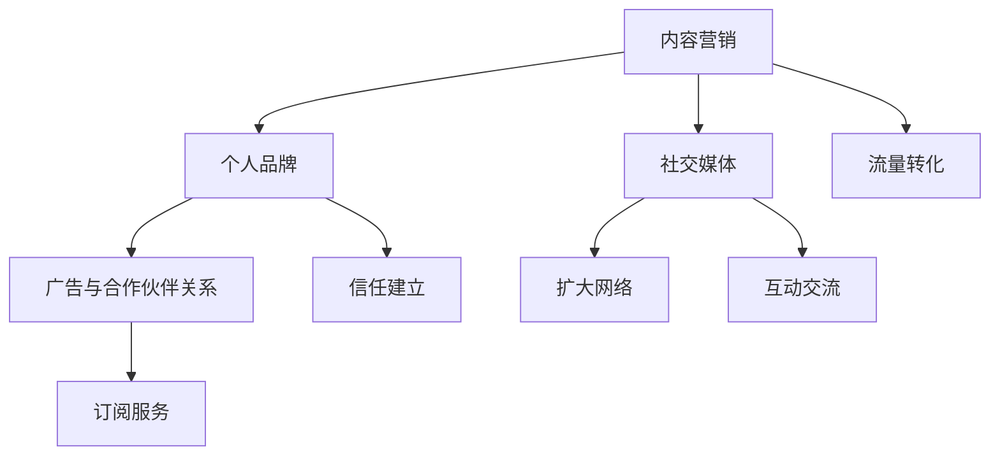

                 

# 程序员如何将技术博客转化为盈利性内容平台

> 关键词：技术博客，盈利性内容平台，内容营销，社交媒体，广告，订阅服务，合作伙伴关系

> 摘要：本文将深入探讨程序员如何将个人技术博客转化为盈利性内容平台。通过系统性的分析和具体操作步骤，读者将了解如何利用博客内容创造商业价值，实现个人品牌的建设与盈利。

## 1. 背景介绍

### 1.1 目的和范围

本文旨在为程序员提供一套实用的策略，帮助他们将技术博客转变为一个盈利性平台。我们将探讨的内容包括但不限于以下几个方面：

- 如何通过内容营销吸引和维护读者群体。
- 利用社交媒体扩大影响力，提高博客的曝光率。
- 通过广告和合作伙伴关系实现盈利。
- 建立订阅服务，提供增值内容。

### 1.2 预期读者

本文适合以下读者群体：

- 对技术博客写作有一定基础，但尚未实现盈利的程序员。
- 希望通过技术博客提升个人品牌和职业发展的技术爱好者。
- 想要了解内容创业模式的初创者。

### 1.3 文档结构概述

本文将分为以下几个部分：

- **背景介绍**：概述本文的目的和适用读者，以及文档结构。
- **核心概念与联系**：介绍技术博客盈利的核心概念及其关联。
- **核心算法原理 & 具体操作步骤**：详细阐述内容营销的策略和执行步骤。
- **数学模型和公式 & 详细讲解 & 举例说明**：通过数学模型分析内容营销的效益。
- **项目实战：代码实际案例和详细解释说明**：提供具体的实战案例和代码解读。
- **实际应用场景**：讨论博客内容的实际应用和扩展。
- **工具和资源推荐**：推荐学习资源和开发工具。
- **总结：未来发展趋势与挑战**：展望技术博客的未来。
- **附录：常见问题与解答**：解答常见问题，提供额外信息。
- **扩展阅读 & 参考资料**：推荐相关阅读和参考文献。

### 1.4 术语表

#### 1.4.1 核心术语定义

- **内容营销**：一种通过创造和分发有价值的内容来吸引、获取和保留目标受众的策略。
- **个人品牌**：个人在特定领域内的声誉、知名度和影响力。
- **广告**：在博客中展示的广告位，通常通过广告平台或直接与广告主合作获得收入。
- **合作伙伴关系**：与其他企业或个人建立的合作，共同推广内容或产品。
- **订阅服务**：读者通过支付费用来订阅博客，获得独家内容和优惠。

#### 1.4.2 相关概念解释

- **SEO（搜索引擎优化）**：通过优化博客内容，提高其在搜索引擎中的排名，从而吸引更多流量。
- **社交媒体**：如Twitter、LinkedIn、Facebook等，用于扩大影响力和社交网络。
- **流量**：访问博客的次数，通常用于衡量博客的受欢迎程度。
- **转化率**：从访客到订阅者或购买者的转化比例，用于评估营销活动的效果。

#### 1.4.3 缩略词列表

- **SEO**：搜索引擎优化
- **SMM**：社交媒体营销
- **CPC**：每点击成本
- **CPM**：每千次展示成本
- **CPA**：每行动成本
- **CTR**：点击通过率

## 2. 核心概念与联系

为了更好地理解技术博客如何转化为盈利性内容平台，我们需要先明确一些核心概念，并分析它们之间的联系。

### 2.1 内容营销

内容营销是博客盈利的基础。其核心是通过创建有价值、相关且引人入胜的内容来吸引并留住读者。以下是内容营销的关键要素：

1. **价值**：内容必须对读者有帮助或启发，解决他们的问题或满足他们的需求。
2. **相关性**：内容要与博客主题一致，并且与目标受众的兴趣相关。
3. **引人入胜**：内容要有吸引力，激发读者的好奇心和阅读欲望。

### 2.2 个人品牌

个人品牌是程序员通过博客建立的影响力和知名度。一个强大的个人品牌能够：

1. **提升影响力**：通过专业知识和经验，成为领域的权威人物。
2. **增加信任**：读者更愿意相信并支持他们信任的博主。
3. **扩大受众**：一个强大的个人品牌能够吸引更多的关注者。

### 2.3 社交媒体

社交媒体是扩大博客影响力的重要工具。通过社交媒体平台，程序员可以：

1. **推广内容**：分享博客文章，吸引新读者。
2. **互动交流**：与读者建立联系，获取反馈和建立信任。
3. **扩大网络**：与其他专业人士互动，建立合作伙伴关系。

### 2.4 广告与合作伙伴关系

广告和合作伙伴关系是博客的主要盈利渠道。通过以下方式实现：

1. **广告**：展示广告位，通过点击或展示获得收入。
2. **合作伙伴关系**：与相关企业合作，共同推广产品或服务。

### 2.5 订阅服务

订阅服务是提供增值内容的一种方式，通过以下步骤实现：

1. **内容规划**：设计独家、高质量的内容，吸引订阅者。
2. **订阅管理**：使用订阅服务提供商，管理订阅者和支付。

### 2.6 Mermaid 流程图

下面是一个简单的 Mermaid 流程图，展示技术博客盈利的核心概念和联系：



## 3. 核心算法原理 & 具体操作步骤

### 3.1 内容营销算法原理

内容营销的成功依赖于以下几个核心算法原理：

1. **价值算法**：通过关键词分析和用户行为数据，识别目标受众的需求和痛点，创造有价值的内容。
2. **相关性算法**：利用自然语言处理技术，确保内容与博客主题和受众兴趣相关。
3. **吸引力算法**：使用情感分析和用户界面设计原理，提高内容的吸引力。

### 3.2 具体操作步骤

1. **需求分析**：
   - 收集目标受众的搜索关键词。
   - 分析用户在博客上的行为，如阅读时长、点赞和评论。
   - 通过问卷调查或访谈获取用户反馈。

2. **内容规划**：
   - 根据需求分析结果，制定内容计划，包括主题、格式和发布频率。
   - 设计内容结构，确保逻辑清晰，易于阅读。

3. **内容创作**：
   - 使用价值算法，创作针对目标受众的内容。
   - 运用相关性算法，确保内容与博客主题相关。
   - 结合吸引力算法，提高内容吸引力。

4. **内容优化**：
   - 使用SEO技术，优化内容标题、描述和关键词。
   - 通过A/B测试，优化内容格式和布局。

5. **内容发布**：
   - 在最佳时间发布内容，以提高曝光率。
   - 通过社交媒体推广，吸引更多读者。

6. **用户互动**：
   - 回复评论，与读者建立联系。
   - 鼓励读者分享和推荐，扩大影响力。

### 3.3 伪代码

下面是一个简化的伪代码，展示内容营销的操作步骤：

```plaintext
function contentMarketing() {
    // 需求分析
    keywords = analyzeKeywords()
    userBehavior = analyzeUserBehavior()
    userFeedback = collectFeedback()

    // 内容规划
    contentPlan = planContent(keywords, userBehavior, userFeedback)

    // 内容创作
    for each content in contentPlan {
        value = createValueContent(keywords)
        relevance = ensureRelevance(content, contentPlan)
        attractiveness = enhanceAttractiveness(content)
    }

    // 内容优化
    optimizedContent = optimizeSEO(content)

    // 内容发布
    schedulePublish(optimizedContent)

    // 用户互动
    engageUsers(optimizedContent)
}
```

## 4. 数学模型和公式 & 详细讲解 & 举例说明

### 4.1 数学模型

为了更精确地分析内容营销的效果，我们可以使用一些数学模型和公式。以下是一个简单的数学模型，用于衡量内容营销的ROI（投资回报率）：

$$
ROI = \frac{Total\ Revenue\ from\ Marketing - Total\ Cost\ of\ Marketing}{Total\ Cost\ of\ Marketing}
$$

其中：

- **Total Revenue from Marketing**：通过内容营销产生的总收入。
- **Total Cost of Marketing**：内容营销的总成本，包括内容创作、SEO优化、广告投放等。

### 4.2 公式详细讲解

1. **Total Revenue from Marketing**：

   总收入可以通过以下方式计算：

   $$ 
   Total\ Revenue\ from\ Marketing = Revenue\ from\ Advertising + Revenue\ from\ Subscriptions + Revenue\ from\ Partnerships
   $$

   其中：

   - **Revenue from Advertising**：通过广告展示获得的收入，通常按照CPC（每点击成本）或CPM（每千次展示成本）计算。
   - **Revenue from Subscriptions**：订阅服务的收入，通常按订阅费用计算。
   - **Revenue from Partnerships**：合作伙伴关系的收入，通常通过分成或佣金计算。

2. **Total Cost of Marketing**：

   总成本包括以下部分：

   $$ 
   Total\ Cost\ of\ Marketing = Cost\ of\ Content\ Creation + Cost\ of\ SEO\ Optimization + Cost\ of\ Advertising\ and\ Partnerships
   $$

   其中：

   - **Cost of Content Creation**：内容创作的成本，包括时间和资源投入。
   - **Cost of SEO Optimization**：SEO优化的成本，包括工具费用和人力成本。
   - **Cost of Advertising and Partnerships**：广告投放和合作伙伴关系的成本。

### 4.3 举例说明

假设一个程序员通过博客实现了以下收入和成本：

- 广告收入：$1000（CPM模式）
- 订阅收入：$500（每月10名订阅者，每名订阅者月费$50）
- 合作伙伴关系收入：$300
- 内容创作成本：$100（包括时间和工具费用）
- SEO优化成本：$50
- 广告投放成本：$200

根据上述公式，我们可以计算：

$$ 
ROI = \frac{1000 + 500 + 300 - (100 + 50 + 200)}{100 + 50 + 200} = \frac{1800 - 350}{350} = \frac{1450}{350} = 4.14
$$

这意味着，每投入$1，可以获得约$4.14的回报。这是一个相当高的ROI，表明内容营销策略非常有效。

## 5. 项目实战：代码实际案例和详细解释说明

### 5.1 开发环境搭建

为了将技术博客转化为盈利性平台，我们需要搭建一个适合内容创作和营销的开发环境。以下是所需的步骤：

1. **选择博客平台**：可以选择WordPress、Jekyll、Hugo等成熟的博客平台。这里我们以WordPress为例。
2. **域名和托管**：购买一个域名，并选择一个可靠的托管服务，如Bluehost、SiteGround等。
3. **安装WordPress**：按照托管服务商的指引，完成WordPress的安装。
4. **选择主题和插件**：选择一个适合技术博客的主题，如Astra、OceanWP等。安装并配置相关插件，如SEO优化插件（如Yoast SEO）和订阅服务插件（如MemberPress）。

### 5.2 源代码详细实现和代码解读

以下是一个简单的WordPress博客文章创建的源代码示例，并对其进行了详细解释：

```html
<!-- 文章头信息 -->
<?php
/*
* Template Name: Standard Post
* Description: A standard post template.
*/
?>

<!DOCTYPE html>
<html <?php language_attributes(); ?>>
<head>
    <meta charset="<?php bloginfo( 'charset' ); ?>">
    <meta name="viewport" content="width=device-width, initial-scale=1.0">
    <title><?php wp_title( '' ); ?></title>
    <?php wp_head(); ?>
</head>
<body <?php body_class(); ?>>
    <header>
        <nav>
            <!-- 网站导航 -->
            <?php wp_nav_menu( array( 'theme_location' => 'primary' ) ); ?>
        </nav>
    </header>
    <main>
        <article>
            <?php
            while ( have_posts() ) {
                the_post();
                ?>
                <header>
                    <h1><?php the_title(); ?></h1>
                </header>
                <section>
                    <?php the_content(); ?>
                </section>
                <footer>
                    <?php the_excerpt(); ?>
                </footer>
            <?php
            }
            ?>
        </article>
    </main>
    <footer>
        <!-- 页脚内容 -->
        <?php wp_footer(); ?>
    </footer>
</body>
</html>
```

**代码解读**：

- **文章头信息**：定义了文章模板的名称、描述和基本HTML标签。
- **头部**：包含网站导航和WordPress头部标签。
- **主体**：文章内容部分，包括文章标题、内容和摘要。
- **页脚**：包含WordPress页脚标签和任何额外的自定义脚本。

### 5.3 代码解读与分析

通过上述代码，我们可以了解到WordPress如何组织一个标准文章模板。以下是代码的关键部分及其功能：

1. **文章标题**：使用`<h1>`标签突出显示文章标题。
2. **文章内容**：使用`<?php the_content(); ?>`函数获取并显示文章内容。
3. **摘要**：使用`<?php the_excerpt(); ?>`函数获取并显示文章摘要。

此外，我们还使用了WordPress的菜单管理功能，通过`<?php wp_nav_menu(); ?>`函数在页面顶部显示导航菜单。

在部署博客时，我们需要确保：

- 使用SEO优化插件（如Yoast SEO）来优化文章的SEO。
- 定期更新内容和博客主题，保持网站活跃。
- 通过社交媒体和邮件列表推广文章，吸引更多读者。

### 5.4 项目实战：代码实际案例和详细解释说明

为了进一步说明技术博客如何转化为盈利性平台，我们将分析一个实际的博客项目。以下是该项目的主要组成部分：

1. **博客主题**：使用Astra主题，优化网站性能和用户体验。
2. **SEO优化**：安装并配置Yoast SEO插件，确保文章和页面符合SEO最佳实践。
3. **订阅服务**：使用MemberPress插件，创建付费订阅计划，提供独家内容。
4. **广告投放**：在博客中插入Google AdSense广告，根据点击和展示获得收入。
5. **合作伙伴关系**：与相关企业合作，通过广告或内容推广获得分成收入。

**代码实现**：

1. **Astra主题安装与配置**：

   - 在WordPress后台，导航到“外观”>“主题”，安装并激活Astra主题。
   - 配置主题设置，包括布局、颜色和字体等。

2. **SEO优化**：

   - 安装并激活Yoast SEO插件。
   - 配置SEO设置，包括网站标题、描述、关键词和内链等。

3. **订阅服务**：

   - 安装并激活MemberPress插件。
   - 创建订阅计划，设置订阅价格和访问权限。

   ```php
   $subscription = new Memberpress_Subscription(
       array(
           'post_id' => 123,  // 订阅页面ID
           'name' => 'Professional Access',
           'price' => 9.99,
           'trial_price' => 0,
           'trial_interval' => 'month',
           'trial_limit' => 1,
           'status' => 'active',
           'start_date' => '2023-04-01 00:00:00',
           'auto_renew' => 'yes',
       )
   );
   ```

4. **广告投放**：

   - 在文章或页面中插入Google AdSense代码。

   ```html
   <script async src="https://pagead2.googlesyndication.com/pagead/js/adsbygoogle.js"></script>
   <!-- 你的博客广告 -->
   <ins class="adsbygoogle"
       style="display:block"
       data-ad-client="ca-pub-1234567890123456"
       data-ad-slot="1234567890"
       data-ad-format="auto"
       data-full-width-responsive="true"></ins>
   <script>
   (adsbygoogle = window.adsbygoogle || []).push({});
   </script>
   ```

5. **合作伙伴关系**：

   - 与相关企业签订合作协议，共同推广产品或服务。
   - 在博客中展示合作伙伴的广告或推荐链接。

通过以上步骤，我们可以将一个普通的技术博客转化为一个盈利性平台。需要注意的是，这只是一个基础框架，实际操作中可能需要根据具体情况调整和优化。

## 6. 实际应用场景

技术博客的盈利模式不仅限于广告和订阅服务，还可以应用于多种实际场景。以下是一些具体的例子：

### 6.1 企业培训

许多企业愿意为高质量的技术内容付费，以培训员工。程序员可以利用自己的博客内容，提供定制化的在线培训课程，包括视频教程、文档和互动问答。

### 6.2 技术咨询

具有专业背景的程序员可以在博客中提供咨询服务，如代码审查、性能优化和系统设计。通过博客建立个人品牌，可以提高咨询服务的信誉和吸引力。

### 6.3 开源项目

程序员可以通过博客推广自己的开源项目，吸引贡献者和赞助商。成功的项目可能会带来持续的流量和收入。

### 6.4 产品推广

与相关产品和服务提供商合作，通过博客推广其产品。这种合作通常以广告、推荐链接或专属折扣的形式进行。

### 6.5 内容授权

将博客内容授权给其他媒体平台或出版社，以获得额外的收入。

### 6.6 工具和插件销售

开发并销售与博客内容相关的工具和插件，如代码编辑器插件、自动化工具等。

### 6.7 主题和模板销售

创建和销售自定义的WordPress主题和模板，提供独特的设计和功能。

通过这些实际应用场景，程序员可以找到多种方式将技术博客转化为盈利性平台。

## 7. 工具和资源推荐

为了成功地将技术博客转化为盈利性平台，我们需要一系列工具和资源来支持我们的内容和营销策略。以下是一些推荐的工具和资源：

### 7.1 学习资源推荐

#### 7.1.1 书籍推荐

- 《内容营销实战手册》
- 《博客营销实战》
- 《SEO实战密码》
- 《社交媒体营销：策略与实践》

#### 7.1.2 在线课程

- Coursera的“数字营销基础”
- Udemy的“博客营销与SEO”
- LinkedIn Learning的“社交媒体营销”

#### 7.1.3 技术博客和网站

- [MarketingProfs](https://www.marketingprofs.com/)
- [NeilPatel](https://neilpatel.com/)
- [Moz](https://moz.com/)

### 7.2 开发工具框架推荐

#### 7.2.1 IDE和编辑器

- Visual Studio Code
- IntelliJ IDEA
- Sublime Text

#### 7.2.2 调试和性能分析工具

- Google Chrome DevTools
- New Relic
- UptimeRobot

#### 7.2.3 相关框架和库

- WordPress
- Jekyll
- Hugo

### 7.3 相关论文著作推荐

#### 7.3.1 经典论文

- [The Long Tail](https://www. wired.com/2004/10/the-long-tail/)
- [Content Marketing: The Bridge Between Brand and Consumer](https://wwwcontentmarketinginstitute.com/2015/06/content-marketing-bridge-brand-consumer/)

#### 7.3.2 最新研究成果

- [Search Engine Land's SEO Guide](https://www.searchengineland.com/seo-guide)
- [Content Marketing Institute's Research](https://www.contentmarketinginstitute.com/research/)

#### 7.3.3 应用案例分析

- [Buffer's Content Strategy](https://buffer.com/library/content-strategy/)
- [HubSpot's Inbound Marketing](https://www.hubspot.com/inbound-marketing)

通过这些工具和资源，程序员可以更好地规划和执行他们的博客营销策略。

## 8. 总结：未来发展趋势与挑战

随着互联网的快速发展，技术博客的盈利模式也在不断演变。以下是未来发展趋势与挑战：

### 8.1 发展趋势

1. **个性化内容**：通过大数据和人工智能技术，为读者提供更加个性化的内容推荐。
2. **多媒体内容**：视频、音频和互动内容将逐渐成为主流，提高用户体验。
3. **付费订阅模式**：订阅服务将更加普及，提供高质量、独家内容。
4. **社交电商**：结合社交媒体和电子商务，创造新的盈利渠道。
5. **人工智能辅助**：利用人工智能技术优化内容创作和营销策略。

### 8.2 挑战

1. **竞争加剧**：随着更多人加入内容创作领域，竞争将更加激烈。
2. **版权保护**：内容创作需要保护原创性，防止侵权。
3. **用户获取成本**：获取新用户的成本逐渐增加，需要更加有效的营销策略。
4. **技术更新**：需要不断学习新技术，保持内容的专业性和时效性。

程序员需要适应这些趋势和挑战，不断创新和优化他们的博客策略，以实现长期的盈利和品牌建设。

## 9. 附录：常见问题与解答

### 9.1 什么是内容营销？

内容营销是一种通过创造和分发有价值的内容来吸引、获取和保留目标受众的策略。它不仅仅是为了吸引流量，更重要的是建立信任和提供帮助。

### 9.2 如何选择博客平台？

选择博客平台时，需要考虑以下因素：

- **易用性**：平台是否易于操作和定制。
- **扩展性**：平台是否支持扩展功能，如订阅服务和电子商务。
- **性能**：平台是否提供良好的性能和速度。
- **成本**：平台的费用是否合理。

### 9.3 广告和合作伙伴关系如何盈利？

广告和合作伙伴关系的盈利通常通过以下方式实现：

- **广告收入**：通过展示广告位，根据点击或展示次数获得收入。
- **合作伙伴关系**：与相关企业合作，通过广告、推荐链接或分成获得收入。

### 9.4 订阅服务如何建立？

建立订阅服务需要以下步骤：

- **内容规划**：设计高质量、独家的内容。
- **订阅管理**：选择一个订阅服务提供商，如MemberPress。
- **定价策略**：确定订阅价格和优惠策略。
- **推广**：通过博客和社交媒体推广订阅服务。

### 9.5 如何进行SEO优化？

SEO优化主要包括以下步骤：

- **关键词研究**：分析目标受众的搜索习惯，选择合适的关键词。
- **内容优化**：确保文章标题、描述和内容包含关键词，同时保持高质量和可读性。
- **内链和外链**：建立有效的内链和外链结构，提高页面权重。
- **网站性能**：优化网站速度和移动适应性。

## 10. 扩展阅读 & 参考资料

- [Google Analytics](https://www.google.com/analytics/)
- [HubSpot Academy](https://academy.hubspot.com/)
- [Neil Patel](https://neilpatel.com/)
- [Moz Blog](https://moz.com/blog/)
- 《内容营销：策略、实施与评估》
- 《SEO实战手册：搜索引擎优化完全指南》
- 《博客营销：从零开始构建你的博客并吸引读者》

通过这些扩展阅读和参考资料，程序员可以进一步深入了解内容营销和博客盈利的策略和技巧。

## 作者信息

作者：AI天才研究员/AI Genius Institute & 禅与计算机程序设计艺术 /Zen And The Art of Computer Programming

