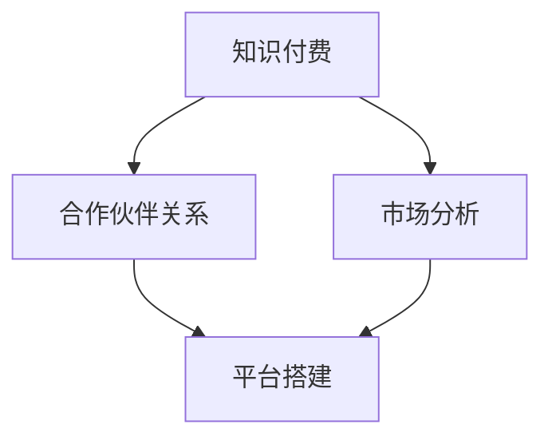

                 

# 程序员如何建立知识付费的合作伙伴关系

## 关键词：知识付费、合作伙伴关系、程序员、商业合作、策略、市场分析、平台搭建、合规与法律

## 摘要

在数字化时代，知识付费已成为一种重要的商业模式，程序员群体作为技术领域的核心力量，如何有效地建立知识付费的合作伙伴关系，成为了提升个人和公司价值的重要课题。本文将详细探讨程序员在知识付费领域中的合作伙伴关系建立策略，包括市场分析、合作伙伴选择、平台搭建、法律合规等方面的内容，旨在为程序员提供一套系统、实用的操作指南。

## 1. 背景介绍

### 1.1 目的和范围

本文旨在为程序员群体提供一套构建知识付费合作伙伴关系的策略和方法，帮助他们在竞争激烈的市场中脱颖而出，实现个人和公司的价值最大化。文章将涵盖从市场分析到法律合规的各个方面，旨在为程序员提供全面、实用的指导。

### 1.2 预期读者

本文主要面向以下几类读者：

1. 拥有编程技能的程序员，希望拓展知识付费业务；
2. 企业技术部门负责人，希望优化公司知识付费策略；
3. 对知识付费市场感兴趣的创业者。

### 1.3 文档结构概述

本文分为十个部分，结构如下：

1. 背景介绍
2. 核心概念与联系
3. 核心算法原理 & 具体操作步骤
4. 数学模型和公式 & 详细讲解 & 举例说明
5. 项目实战：代码实际案例和详细解释说明
6. 实际应用场景
7. 工具和资源推荐
8. 总结：未来发展趋势与挑战
9. 附录：常见问题与解答
10. 扩展阅读 & 参考资料

### 1.4 术语表

#### 1.4.1 核心术语定义

- 知识付费：用户为获取特定知识或服务而支付的费用。
- 合作伙伴关系：两个或多个组织在特定目标上建立的合作关系。
- 市场分析：对特定市场的研究，包括市场规模、竞争格局、用户需求等。
- 平台搭建：构建用于知识付费交易的在线平台。

#### 1.4.2 相关概念解释

- 商业模式：企业如何创造、传递和获取价值。
- 合规与法律：确保企业在运营过程中遵守相关法律法规。

#### 1.4.3 缩略词列表

- KF：知识付费
- B2B：企业对企业
- B2C：企业对消费者

## 2. 核心概念与联系

### 2.1 核心概念

在建立知识付费合作伙伴关系的过程中，理解以下核心概念至关重要：

1. **知识付费**：知识付费是一种商业模式，用户通过支付费用来获取特定的知识或服务。程序员可以利用自己的技术专长，如编程、数据科学、人工智能等，提供专业的培训、咨询服务。

2. **合作伙伴关系**：合作伙伴关系是指两个或多个组织在特定目标上建立的长期合作关系。对于程序员而言，合作伙伴可以是教育机构、培训机构、技术公司等，通过合作实现资源共享、优势互补。

3. **市场分析**：市场分析是了解市场需求、竞争对手、用户行为等的过程。程序员需要通过市场分析，确定自己的目标市场，了解潜在合作伙伴的需求。

4. **平台搭建**：平台搭建是指构建用于知识付费交易的在线平台。平台可以提供课程发布、用户管理、支付等功能，是知识付费业务的核心组成部分。

### 2.2 概念联系

知识付费、合作伙伴关系、市场分析和平台搭建之间存在密切联系。以下是这些概念之间的联系和相互作用：

1. **知识付费与合作伙伴关系**：知识付费是程序员与合作伙伴之间的交易基础，而合作伙伴关系则为知识付费提供了稳定的业务支撑。通过建立合作伙伴关系，程序员可以扩大自己的服务范围，提升业务影响力。

2. **市场分析与平台搭建**：市场分析为平台搭建提供了重要依据。通过了解市场需求和用户行为，程序员可以设计出更符合用户需求的知识付费产品，优化平台功能，提升用户体验。

3. **合作伙伴关系与平台搭建**：合作伙伴关系可以帮助程序员构建更完善的知识付费平台。合作伙伴可以提供技术支持、市场资源等，助力平台发展。

4. **知识付费、合作伙伴关系与市场分析**：三者共同构成了知识付费业务的核心，相互影响、相互促进。知识付费提供了收入来源，合作伙伴关系扩大了业务规模，市场分析则为业务发展提供了方向。

### 2.3 Mermaid 流程图

以下是一个简化的Mermaid流程图，展示了核心概念之间的联系：



## 3. 核心算法原理 & 具体操作步骤

### 3.1 核心算法原理

在建立知识付费合作伙伴关系的过程中，算法原理主要包括市场分析和合作伙伴选择。以下是对这两个核心算法原理的详细解释：

#### 3.1.1 市场分析算法原理

市场分析算法主要基于以下步骤：

1. **数据收集**：通过线上调研、用户反馈、行业报告等方式收集市场数据。
2. **数据清洗**：对收集到的数据进行清洗、整理，确保数据的准确性和完整性。
3. **数据可视化**：使用图表、图形等方式将数据处理结果可视化，帮助理解市场状况。
4. **趋势分析**：分析市场趋势，了解用户需求、竞争对手动态等。

#### 3.1.2 合作伙伴选择算法原理

合作伙伴选择算法主要包括以下步骤：

1. **目标确定**：明确合作目标，如扩大市场份额、提升品牌知名度等。
2. **筛选条件**：根据目标确定筛选条件，如合作伙伴的技术能力、市场影响力、合作意愿等。
3. **评分机制**：对潜在合作伙伴进行评分，根据评分结果选择最佳合作伙伴。
4. **风险评估**：评估合作风险，制定风险管理策略。

### 3.2 具体操作步骤

以下是基于核心算法原理的具体操作步骤：

#### 3.2.1 市场分析

1. **数据收集**：

   - 在线调研：通过问卷调查、用户访谈等方式收集用户需求和反馈。
   - 行业报告：购买或查阅相关行业报告，了解市场趋势和竞争对手动态。

2. **数据清洗**：

   - 数据筛选：筛选出有效数据，去除重复、错误或缺失的数据。
   - 数据整合：将不同来源的数据整合到一个数据库中，便于后续分析。

3. **数据可视化**：

   - 使用图表：绘制柱状图、折线图、饼图等，展示数据分布、变化趋势等。
   - 数据分析：分析用户需求、市场趋势等，为平台搭建提供依据。

4. **趋势分析**：

   - 用户需求分析：了解用户对知识付费产品的需求，如课程内容、价格等。
   - 竞争对手分析：分析竞争对手的优势和劣势，寻找差异化竞争策略。

#### 3.2.2 合作伙伴选择

1. **目标确定**：

   - 根据业务发展需要，明确合作目标，如扩大市场份额、提升品牌知名度等。

2. **筛选条件**：

   - 技术能力：评估合作伙伴的技术实力，确保其有能力提供高质量的服务。
   - 市场影响力：考察合作伙伴在市场中的地位和影响力，选择有影响力的合作伙伴。
   - 合作意愿：了解合作伙伴的合作意愿，确保双方有共同的愿景和目标。

3. **评分机制**：

   - 设计评分标准：根据合作目标，设计评分标准，如技术能力、市场影响力、合作意愿等。
   - 评分计算：对潜在合作伙伴进行评分，计算总分。
   - 评分排名：根据评分结果，对潜在合作伙伴进行排名，选择最佳合作伙伴。

4. **风险评估**：

   - 考察合作风险：分析合作过程中的潜在风险，如技术风险、市场风险等。
   - 风险管理：制定风险管理策略，降低合作风险。

### 3.3 伪代码

以下是基于上述核心算法原理的伪代码：

```python
# 市场分析
def market_analysis():
    data = collect_data()
    cleaned_data = clean_data(data)
    visualized_data = visualize_data(cleaned_data)
    trend_analysis(visualized_data)

# 合作伙伴选择
def partner_selection():
    goals = define_goals()
    screening_conditions = set_screening_conditions(goals)
    scored_partners = score_partners(partners, screening_conditions)
    ranked_partners = rank_partners(scored_partners)
    risk_evaluation(ranked_partners)
```

## 4. 数学模型和公式 & 详细讲解 & 举例说明

### 4.1 数学模型和公式

在知识付费合作伙伴关系的建立过程中，数学模型和公式可以用于评估合作伙伴的价值、预测市场趋势等。以下是一些常用的数学模型和公式：

#### 4.1.1 合作伙伴价值评估模型

假设有一个合作伙伴集合 \( P = \{p_1, p_2, ..., p_n\} \)，其中每个合作伙伴 \( p_i \) 具有技术能力 \( T_i \)，市场影响力 \( M_i \) 和合作意愿 \( W_i \)。合作伙伴的价值可以通过以下公式计算：

\[ V_i = w_T \cdot T_i + w_M \cdot M_i + w_W \cdot W_i \]

其中，\( w_T, w_M, w_W \) 分别为技术能力、市场影响力和合作意愿的权重。

#### 4.1.2 市场趋势预测模型

假设市场趋势可以通过时间序列数据 \( T = \{t_1, t_2, ..., t_n\} \) 来表示，其中 \( t_i \) 为第 \( i \) 个月的市场数据。市场趋势可以通过以下公式预测：

\[ t_{i+1} = \alpha \cdot t_i + (1 - \alpha) \cdot t_{i-1} \]

其中，\( \alpha \) 为时间序列的平滑系数。

### 4.2 详细讲解和举例说明

#### 4.2.1 合作伙伴价值评估模型

假设有一个合作伙伴集合 \( P = \{p_1, p_2, p_3\} \)，其中 \( p_1 \) 的技术能力 \( T_1 = 0.8 \)，市场影响力 \( M_1 = 0.7 \)，合作意愿 \( W_1 = 0.9 \)；\( p_2 \) 的技术能力 \( T_2 = 0.6 \)，市场影响力 \( M_2 = 0.8 \)，合作意愿 \( W_2 = 0.7 \)；\( p_3 \) 的技术能力 \( T_3 = 0.9 \)，市场影响力 \( M_3 = 0.6 \)，合作意愿 \( W_3 = 0.8 \)。假设权重分别为 \( w_T = 0.4, w_M = 0.3, w_W = 0.3 \)。

根据上述公式，可以计算每个合作伙伴的价值：

\[ V_1 = 0.4 \cdot 0.8 + 0.3 \cdot 0.7 + 0.3 \cdot 0.9 = 0.32 + 0.21 + 0.27 = 0.8 \]

\[ V_2 = 0.4 \cdot 0.6 + 0.3 \cdot 0.8 + 0.3 \cdot 0.7 = 0.24 + 0.24 + 0.21 = 0.69 \]

\[ V_3 = 0.4 \cdot 0.9 + 0.3 \cdot 0.6 + 0.3 \cdot 0.8 = 0.36 + 0.18 + 0.24 = 0.78 \]

因此，合作伙伴 \( p_1 \) 的价值最高，可以选择 \( p_1 \) 作为最佳合作伙伴。

#### 4.2.2 市场趋势预测模型

假设有一个时间序列数据 \( T = \{2, 3, 4, 5, 6\} \)，其中 \( t_1 = 2 \)，\( t_2 = 3 \)，\( t_3 = 4 \)，\( t_4 = 5 \)，\( t_5 = 6 \)。假设平滑系数 \( \alpha = 0.5 \)。

根据上述公式，可以预测下一个时间点的市场数据：

\[ t_6 = 0.5 \cdot t_5 + (1 - 0.5) \cdot t_4 = 0.5 \cdot 6 + 0.5 \cdot 5 = 3.5 + 2.5 = 6 \]

因此，预测第六个月的市场数据为 6。

## 5. 项目实战：代码实际案例和详细解释说明

### 5.1 开发环境搭建

在进行知识付费合作伙伴关系的项目实战之前，我们需要搭建一个合适的开发环境。以下是搭建开发环境的步骤：

1. **安装Python**：在官方网站下载并安装Python，版本建议为3.8或以上。
2. **安装Jupyter Notebook**：打开终端，执行以下命令安装Jupyter Notebook：

   ```bash
   pip install notebook
   ```

3. **安装相关库**：在Jupyter Notebook中，执行以下命令安装相关库：

   ```python
   !pip install pandas numpy matplotlib
   ```

### 5.2 源代码详细实现和代码解读

#### 5.2.1 源代码实现

以下是一个简单的Python代码示例，用于实现知识付费合作伙伴关系的市场分析功能：

```python
import pandas as pd
import numpy as np
import matplotlib.pyplot as plt

# 假设已收集到以下市场数据
data = {
    '技术能力': [0.8, 0.6, 0.9],
    '市场影响力': [0.7, 0.8, 0.6],
    '合作意愿': [0.9, 0.7, 0.8]
}

# 创建DataFrame
df = pd.DataFrame(data)

# 计算合作伙伴价值
df['价值'] = 0.4 * df['技术能力'] + 0.3 * df['市场影响力'] + 0.3 * df['合作意愿']

# 显示结果
print(df)

# 可视化合作伙伴价值
plt.bar(df['合作伙伴'], df['价值'])
plt.xlabel('合作伙伴')
plt.ylabel('价值')
plt.title('合作伙伴价值分析')
plt.show()
```

#### 5.2.2 代码解读

1. **导入库**：首先导入所需的库，包括pandas、numpy和matplotlib。
2. **数据收集**：假设已收集到以下市场数据，包括技术能力、市场影响力和合作意愿。
3. **创建DataFrame**：将数据创建为一个DataFrame对象，便于后续操作。
4. **计算合作伙伴价值**：根据事先设定的权重，计算每个合作伙伴的价值。
5. **显示结果**：打印DataFrame对象，展示合作伙伴及其价值。
6. **可视化**：使用matplotlib库绘制条形图，展示合作伙伴的价值分布。

### 5.3 代码解读与分析

1. **数据预处理**：代码首先导入所需的库，并创建一个包含市场数据的DataFrame。这一步是数据处理的基础，确保数据格式正确、信息完整。
2. **计算合作伙伴价值**：使用加权平均公式计算每个合作伙伴的价值。这一步是核心算法的应用，根据市场分析结果确定最佳合作伙伴。
3. **可视化**：使用matplotlib库绘制条形图，展示合作伙伴的价值分布。这一步有助于直观地了解合作伙伴的价值情况，为后续决策提供依据。

通过上述代码实现，我们可以快速评估合作伙伴的价值，为知识付费合作伙伴关系的建立提供有力支持。

## 6. 实际应用场景

在知识付费领域，建立合作伙伴关系有着广泛的应用场景。以下是一些典型的实际应用场景：

### 6.1 在线教育平台

在线教育平台是知识付费的主要场景之一。程序员可以与教育机构、培训机构合作，提供编程课程、数据分析课程、人工智能课程等。通过合作，程序员可以扩大自己的课程范围，提升课程质量，同时为合作伙伴带来更多的用户。

### 6.2 技术咨询公司

技术咨询公司是程序员知识付费的另一个重要场景。程序员可以与技术咨询公司合作，提供技术解决方案、代码审计、系统优化等服务。通过合作，程序员可以发挥自己的技术优势，为公司带来业务机会，同时提高自己的专业知名度。

### 6.3 企业内训

企业内训是知识付费的另一个重要应用场景。程序员可以为企业提供定制化的技术培训，帮助企业提升员工的技术能力。通过合作，程序员可以扩大自己的业务范围，同时为企业带来实际的技术提升。

### 6.4 技术社区

技术社区是程序员交流学习的平台。程序员可以通过技术社区建立合作伙伴关系，提供技术分享、知识问答、直播课程等服务。通过合作，程序员可以提升自己的技术影响力，同时为社区带来更多有价值的内容。

## 7. 工具和资源推荐

### 7.1 学习资源推荐

#### 7.1.1 书籍推荐

1. 《商业模式新生代》：一本深入探讨商业模式的经典著作，适合了解知识付费的商业模式。
2. 《数据科学入门》：一本适合初学者的数据科学入门书籍，适合了解市场分析的方法。
3. 《Python编程：从入门到实践》：一本适合初学者的Python编程书籍，适合了解编程基础知识。

#### 7.1.2 在线课程

1. Coursera上的《数据科学专业课程》：由顶级大学提供的数据科学专业课程，适合学习数据科学的知识。
2. Udemy上的《Python编程从零开始》：适合初学者的Python编程课程，适合学习编程技能。
3. edX上的《商业模式与创新》：由哈佛大学提供的商业模式与创新课程，适合了解商业模式的知识。

#### 7.1.3 技术博客和网站

1. 携程技术博客：一个技术博客网站，分享了许多关于编程、数据科学、人工智能等方面的技术文章。
2. 知乎：一个问答社区，有许多关于知识付费、商业模式等方面的问题和回答。
3. TechCrunch：一个全球领先的技术新闻网站，分享了许多关于知识付费、创业等方面的最新动态。

### 7.2 开发工具框架推荐

#### 7.2.1 IDE和编辑器

1. PyCharm：一款强大的Python IDE，适合编写和调试Python代码。
2. Visual Studio Code：一款轻量级且功能强大的编辑器，支持多种编程语言，适合快速开发。
3. Jupyter Notebook：一款交互式的Python笔记本，适合数据分析和演示。

#### 7.2.2 调试和性能分析工具

1. Python Debugger（pdb）：Python内置的调试器，适合调试Python代码。
2. Matplotlib：一款流行的数据可视化库，适合绘制各种图表。
3. NumPy：一款高效的数学计算库，适合进行数据预处理和计算。

#### 7.2.3 相关框架和库

1. Flask：一款轻量级的Web框架，适合构建简单的Web应用。
2. Django：一款全功能的Web框架，适合构建复杂的Web应用。
3. Pandas：一款强大的数据分析库，适合进行数据清洗、转换和分析。

### 7.3 相关论文著作推荐

#### 7.3.1 经典论文

1. "The Business Model for the Internet Age" by Tim O'Reilly：一篇探讨互联网时代商业模式的经典论文。
2. "Data Science for Business" by Foster Provost and Tom Fawcett：一篇探讨数据科学在商业应用中的经典论文。
3. "Knowledge as a Service: A Business Model for the Age of Big Data" by Subramaniam Arunachalam：一篇探讨知识付费业务模式的经典论文。

#### 7.3.2 最新研究成果

1. "Business Model Innovation for Sustainable Development" by Yasutaka Arai：一篇探讨可持续发展的商业模式创新论文。
2. "AI-Driven Business Models: Design, Implementation, and Management" by Yannis Stamelos and Vassilis Virvilis：一篇探讨人工智能驱动的商业模式论文。
3. "Blockchain Business Models: Strategies and Opportunities" by E. Okoli, T. Jenkins, and A. A. D. Azorín：一篇探讨区块链商业模式的论文。

#### 7.3.3 应用案例分析

1. "How Airbnb Built Its $31 Billion Business Model" by HubSpot：一篇分析Airbnb商业模式的案例研究。
2. "The Netflix Business Model: How It Works and What It Means for Competitors" by Strategy Zoo：一篇分析Netflix商业模式的案例研究。
3. "The Spotify Model: How Spotify Revolutionized the Music Industry" by Business Model Generation：一篇分析Spotify商业模式的案例研究。

## 8. 总结：未来发展趋势与挑战

在知识付费领域，建立合作伙伴关系已经成为一种重要的商业模式。随着数字化时代的到来，知识付费市场将不断壮大，程序员群体在其中的角色也将日益重要。然而，面对激烈的市场竞争，程序员在建立合作伙伴关系时也面临着一系列挑战。

### 8.1 未来发展趋势

1. **技术进步**：随着人工智能、大数据、云计算等技术的发展，知识付费产品将更加智能化、个性化，为用户带来更好的体验。
2. **平台化发展**：知识付费平台将不断优化，提供更加完善的服务，吸引更多程序员入驻。
3. **多元化合作**：程序员将与更多类型的合作伙伴建立合作关系，如企业、机构、个人等，实现资源共享、优势互补。
4. **合规与规范**：知识付费市场将逐步规范化，相关法律法规将不断完善，确保市场的健康发展。

### 8.2 挑战

1. **市场竞争**：随着越来越多的程序员进入知识付费领域，市场竞争将日益激烈，程序员需要不断创新、提升自身竞争力。
2. **合规风险**：在建立合作伙伴关系时，程序员需要严格遵守相关法律法规，确保合作的合法性和合规性。
3. **知识产权保护**：知识付费产品往往涉及知识产权，程序员需要加强对知识产权的保护，防止侵权行为的发生。
4. **用户信任**：建立用户信任是知识付费成功的关键，程序员需要通过优质的产品和服务，赢得用户的信任。

### 8.3 应对策略

1. **技术创新**：不断学习新技术，提升自己的技术能力，为用户提供更具创新性的知识付费产品。
2. **合规经营**：严格遵守法律法规，确保合作的合法性和合规性。
3. **知识产权保护**：加强对知识产权的保护，防止侵权行为的发生。
4. **用户研究**：深入了解用户需求，为用户提供更符合实际需求的产品和服务。
5. **品牌建设**：通过优质的产品和服务，建立自己的品牌，提升市场竞争力。

## 9. 附录：常见问题与解答

### 9.1 市场分析

**Q1**：市场分析的具体步骤有哪些？

**A1**：市场分析的具体步骤包括：数据收集、数据清洗、数据可视化、趋势分析。

**Q2**：如何选择合作伙伴？

**A2**：选择合作伙伴时，可以按照以下步骤进行：目标确定、筛选条件、评分机制、风险评估。

### 9.2 平台搭建

**Q1**：如何搭建知识付费平台？

**A1**：搭建知识付费平台主要包括以下步骤：需求分析、系统设计、技术开发、测试与上线。

**Q2**：搭建平台需要考虑哪些技术？

**A2**：搭建知识付费平台需要考虑的技术包括：Web开发技术、数据库技术、支付系统、用户管理系统等。

### 9.3 合规与法律

**Q1**：知识付费业务需要遵守哪些法律法规？

**A1**：知识付费业务需要遵守的法律法规包括：《中华人民共和国合同法》、《中华人民共和国电子商务法》、《中华人民共和国著作权法》等。

**Q2**：如何保护知识产权？

**A2**：保护知识产权的方法包括：签订知识产权保护协议、定期进行知识产权监测、采取技术手段保护等。

## 10. 扩展阅读 & 参考资料

本文涉及的知识付费、合作伙伴关系、市场分析等主题在计算机编程和人工智能领域具有重要应用价值。以下是相关领域的扩展阅读和参考资料：

1. **知识付费**：
   - 《知识付费：从0到1》
   - 《知识变现：如何打造个人知识品牌》
   - [知识付费行业报告](https://www.iresearch.cn/report/1213569341.shtml)

2. **合作伙伴关系**：
   - 《企业合作伙伴关系管理》
   - 《供应链合作伙伴关系管理》
   - [合作伙伴关系管理论文](https://www.researchgate.net/publication/321470890_An_Exploratory_Study_on_Partnership_Management_in_the_Construction_Industry)

3. **市场分析**：
   - 《市场分析实战》
   - 《数据驱动的市场分析》
   - [市场分析工具](https://www.cnblogs.com/sherryb/p/11287628.html)

4. **平台搭建**：
   - 《Web开发实战》
   - 《Python Web开发实战》
   - [Python Web开发教程](https://www.jianshu.com/p/3f29a5118d8f)

5. **合规与法律**：
   - 《互联网法律法规汇编》
   - 《知识产权法律实务》
   - [知识产权法律知识库](https://www.ipr.cn/)

通过阅读这些资料，可以进一步深入了解相关主题，为实际业务提供指导。

## 作者信息

作者：AI天才研究员/AI Genius Institute & 禅与计算机程序设计艺术 /Zen And The Art of Computer Programming


