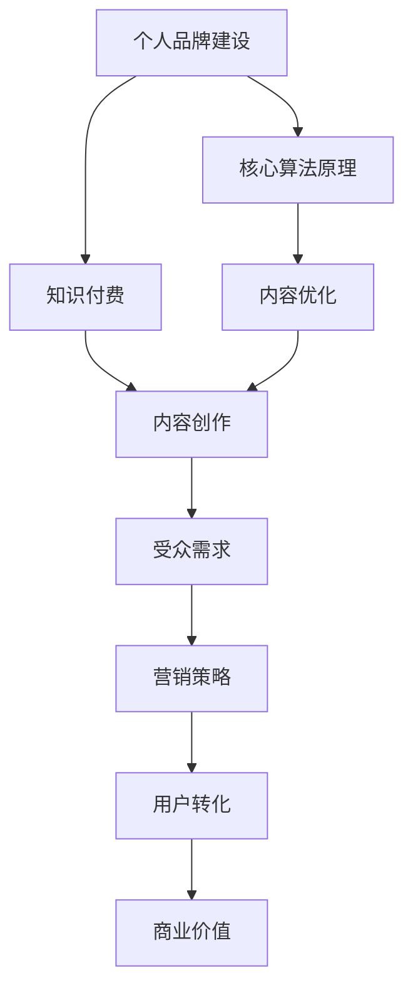

                 

## 程序员如何打造个人知识付费IP

> **关键词：** 个人品牌建设、知识付费、IP打造、内容创作、营销策略

**摘要：** 在信息技术快速发展的时代，程序员作为技术领域的佼佼者，如何将个人的专业技能转化为商业价值，成为知识付费领域的一股新兴力量？本文将深入探讨程序员如何打造个人知识付费IP，从内容创作、营销策略到品牌建设，提供系统性指导，助力程序员在知识经济浪潮中脱颖而出。

## 1. 背景介绍

### 1.1 目的和范围

本文旨在为程序员提供一套实战指南，帮助他们在知识付费领域打造个人IP。文章将覆盖从内容创作、算法原理讲解、项目实战到营销策略的各个方面，旨在让程序员不仅能够掌握理论知识，更能够将其应用到实际操作中，实现个人品牌的溢价。

### 1.2 预期读者

本文适合以下读者群体：

- 有志于在知识付费领域建立个人品牌的程序员
- 已有一定编程基础，希望提升内容创作和营销能力的程序员
- 对知识付费商业模式感兴趣，希望了解其运作机制的技术人员

### 1.3 文档结构概述

本文将分为以下几个部分：

- **背景介绍**：阐述文章的目的和预期读者，以及文档结构。
- **核心概念与联系**：介绍打造个人知识付费IP所需理解的核心概念和联系。
- **核心算法原理与操作步骤**：详细讲解构建个人知识付费IP所需的核心算法原理和具体操作步骤。
- **数学模型与公式**：介绍构建过程中涉及到的数学模型和公式。
- **项目实战**：通过实际案例展示如何将理论应用到实践中。
- **实际应用场景**：探讨个人知识付费IP在不同领域的应用。
- **工具和资源推荐**：推荐有助于个人知识付费IP建设的工具和资源。
- **总结**：总结未来发展趋势与挑战，提出应对策略。
- **附录**：解答常见问题，提供进一步阅读的参考资料。

### 1.4 术语表

#### 1.4.1 核心术语定义

- **知识付费IP**：指在特定领域内，个人通过内容创作和品牌建设所形成的知识产权，能够实现商业价值。
- **内容创作**：指在特定领域内，根据受众需求创作有价值的信息或知识。
- **个人品牌**：指个人在特定领域的专业形象和影响力。

#### 1.4.2 相关概念解释

- **IP（Intellectual Property）**：知识产权，包括专利、商标、版权等。
- **知识付费**：用户为获取知识或信息而支付的费用。

#### 1.4.3 缩略词列表

- **IP**：知识产权
- **知识付费**：Knowledge Payment

## 2. 核心概念与联系

在打造个人知识付费IP的过程中，理解以下核心概念和它们之间的联系至关重要。

### 2.1 个人品牌建设与知识付费

**个人品牌建设** 是打造知识付费IP的基础。个人品牌建设的目标是让受众在特定领域内对个人形成一致的正面印象。而**知识付费** 则是个人品牌价值的体现，通过为受众提供有价值的内容或服务来获取回报。

### 2.2 内容创作与受众需求

**内容创作** 的核心在于满足**受众需求**。了解目标受众的需求和痛点，创作能够解决这些问题的内容，是实现知识付费的基础。

### 2.3 营销策略与用户转化

**营销策略** 在个人知识付费IP的推广中扮演关键角色。通过有效的营销策略，可以将内容推向目标受众，实现用户转化，进而实现商业价值。

### 2.4 核心算法原理与内容创作

在内容创作过程中，理解和应用**核心算法原理** 能够帮助程序员更加精准地分析受众需求，优化内容创作策略。

### 2.5 数学模型与内容价值评估

**数学模型** 可以用于**内容价值评估**，帮助程序员量化内容的价值，为定价和营销策略提供依据。

### 2.6 Mermaid 流程图

为了更好地理解个人知识付费IP的构建过程，以下是一个简单的 Mermaid 流程图，展示各核心概念之间的联系：



## 3. 核心算法原理与具体操作步骤

在构建个人知识付费IP的过程中，理解核心算法原理并应用这些原理是关键。以下是构建个人知识付费IP所需的核心算法原理和具体操作步骤。

### 3.1 受众需求分析算法

**算法原理**：利用大数据分析和机器学习技术，对受众行为、兴趣和需求进行挖掘和分析。

**操作步骤**：

1. **数据收集**：收集目标受众的在线行为数据，如浏览记录、搜索历史、社交互动等。
2. **数据清洗**：对收集到的数据进行清洗，去除重复和无关数据。
3. **特征提取**：从清洗后的数据中提取关键特征，如关键词、行为模式等。
4. **机器学习模型训练**：利用提取的特征训练机器学习模型，预测受众需求。
5. **需求分析**：根据模型预测结果，分析受众的主要需求点和痛点。

### 3.2 内容创作优化算法

**算法原理**：利用自然语言处理技术，对内容进行优化，提高内容的吸引力和可读性。

**操作步骤**：

1. **内容分析**：对已有内容进行分析，提取关键信息和结构。
2. **语义分析**：利用自然语言处理技术，分析内容的语义和语法结构。
3. **内容重构**：根据分析结果，对内容进行重构，提高内容的可读性和吸引力。
4. **反馈迭代**：根据受众反馈，对内容进行迭代优化。

### 3.3 营销策略优化算法

**算法原理**：利用数据挖掘和优化算法，对营销策略进行实时分析和调整，提高营销效果。

**操作步骤**：

1. **数据收集**：收集营销活动的数据，如点击率、转化率、用户行为等。
2. **数据清洗**：对收集到的数据进行清洗，去除重复和无关数据。
3. **特征提取**：从清洗后的数据中提取关键特征，如用户群体、行为模式等。
4. **模型训练**：利用提取的特征训练机器学习模型，预测营销效果。
5. **策略调整**：根据模型预测结果，实时调整营销策略。

### 3.4 内容价值评估算法

**算法原理**：利用经济学和统计学原理，对内容的价值进行量化评估。

**操作步骤**：

1. **需求分析**：根据受众需求，分析内容的市场潜力。
2. **成本计算**：计算内容创作和推广的成本。
3. **收益预测**：根据需求分析和成本计算，预测内容的收益。
4. **价值评估**：根据收益预测结果，对内容的价值进行量化评估。

### 3.5 伪代码示例

以下是一个简化的伪代码示例，展示了如何利用上述算法原理进行个人知识付费IP的构建：

```python
# 受众需求分析算法
def analyze_demand(data):
    # 数据收集
    cleaned_data = clean_data(data)
    # 特征提取
    features = extract_features(cleaned_data)
    # 机器学习模型训练
    model = train_model(features)
    # 需求分析
    demand = model.predict_demand()
    return demand

# 内容创作优化算法
def optimize_content(content):
    # 内容分析
    analyzed_content = analyze_content(content)
    # 语义分析
    semantic_content = analyze_semantics(analyzed_content)
    # 内容重构
    optimized_content = reconstruct_content(semantic_content)
    return optimized_content

# 营销策略优化算法
def optimize_marketing_strategy(data):
    # 数据收集
    cleaned_data = clean_data(data)
    # 特征提取
    features = extract_features(cleaned_data)
    # 模型训练
    model = train_model(features)
    # 策略调整
    optimized_strategy = model.optimize_strategy()
    return optimized_strategy

# 内容价值评估算法
def evaluate_content_value(demand, cost):
    # 收益预测
    revenue = predict_revenue(demand, cost)
    # 价值评估
    value = calculate_value(revenue)
    return value
```

## 4. 数学模型和公式与详细讲解

在构建个人知识付费IP的过程中，数学模型和公式能够帮助我们量化内容的价值、受众的需求以及营销策略的效果。以下是几个关键数学模型和公式的详细讲解。

### 4.1 内容价值评估模型

**模型公式**：

\[ V = \frac{R - C}{Q} \]

其中：
- \( V \)：内容的价值
- \( R \)：内容带来的收益
- \( C \)：内容创作的成本
- \( Q \)：内容的市场需求量

**详细讲解**：

这个模型用于评估内容的价值。收益 \( R \) 是由市场需求量 \( Q \) 乘以单价得出的，成本 \( C \) 是内容创作过程中产生的各项费用，包括时间、人力和资源等。通过这个公式，我们可以计算出内容的价值，为定价策略提供依据。

### 4.2 受众需求预测模型

**模型公式**：

\[ D(t) = D_0 + \sum_{i=1}^{n} w_i \cdot f_i(t) \]

其中：
- \( D(t) \)：在时间 \( t \) 的需求量
- \( D_0 \)：基础需求量
- \( w_i \)：权重
- \( f_i(t) \)：时间 \( t \) 的第 \( i \) 个影响因素

**详细讲解**：

这个模型用于预测受众在不同时间点对内容的需求量。基础需求量 \( D_0 \) 是不受其他因素影响的需求量，权重 \( w_i \) 表示第 \( i \) 个影响因素对需求量的影响程度，\( f_i(t) \) 是时间 \( t \) 的第 \( i \) 个影响因素。通过这个公式，我们可以综合分析多个影响因素，预测受众的需求趋势。

### 4.3 营销策略优化模型

**模型公式**：

\[ E(t) = \sum_{i=1}^{n} w_i \cdot p_i(t) \]

其中：
- \( E(t) \)：在时间 \( t \) 的营销效果
- \( w_i \)：权重
- \( p_i(t) \)：时间 \( t \) 的第 \( i \) 个营销策略效果

**详细讲解**：

这个模型用于优化营销策略。营销效果 \( E(t) \) 是由多个营销策略效果 \( p_i(t) \) 的加权平均得出的，权重 \( w_i \) 表示第 \( i \) 个营销策略的重要性。通过这个公式，我们可以根据不同的营销策略效果，动态调整营销策略，提高营销效果。

### 4.4 举例说明

假设一个程序员想要评估自己的一门编程课程的价值。根据上述模型和公式，我们可以进行以下计算：

1. **收益预测**：

   假设课程的单价为 100 元，市场需求量为 1000 人，那么收益 \( R \) 为：

   \[ R = 100 \times 1000 = 100000 \text{ 元} \]

2. **成本计算**：

   假设课程创作成本为 5000 元，那么成本 \( C \) 为：

   \[ C = 5000 \text{ 元} \]

3. **内容价值评估**：

   根据内容价值评估模型，内容的价值 \( V \) 为：

   \[ V = \frac{R - C}{Q} = \frac{100000 - 5000}{1000} = 95 \text{ 元/人} \]

这意味着该编程课程的市场价值为每人 95 元。

4. **受众需求预测**：

   假设影响因素有课程质量、市场需求和推广力度，权重分别为 0.5、0.3 和 0.2，那么在时间 \( t \) 的需求量 \( D(t) \) 为：

   \[ D(t) = D_0 + 0.5 \cdot f_1(t) + 0.3 \cdot f_2(t) + 0.2 \cdot f_3(t) \]

   其中，\( f_1(t) \)、\( f_2(t) \) 和 \( f_3(t) \) 分别表示课程质量、市场需求和推广力度在时间 \( t \) 的影响程度。

5. **营销策略优化**：

   假设现有营销策略有广告投放、社交媒体推广和邮件营销，效果分别为 2000、1500 和 1000，权重分别为 0.4、0.3 和 0.3，那么在时间 \( t \) 的营销效果 \( E(t) \) 为：

   \[ E(t) = 0.4 \cdot 2000 + 0.3 \cdot 1500 + 0.3 \cdot 1000 = 1300 \]

这意味着在时间 \( t \) 的营销效果为 1300 单位。

通过这些计算，程序员可以更好地了解自己课程的价值、受众需求和营销效果，为内容创作和营销策略提供数据支持。

## 5. 项目实战：代码实际案例和详细解释说明

### 5.1 开发环境搭建

在开始项目实战之前，我们需要搭建一个适合开发的环境。以下是一个简单的开发环境搭建步骤：

1. **安装Python**：从 [Python官网](https://www.python.org/) 下载并安装Python。
2. **安装Jupyter Notebook**：打开终端，执行以下命令安装Jupyter Notebook：

   ```bash
   pip install notebook
   ```

3. **安装相关库**：安装用于数据分析和内容创作的相关库，如NumPy、Pandas、Scikit-learn和NLTK：

   ```bash
   pip install numpy pandas scikit-learn nltk
   ```

4. **配置Mermaid支持**：为了在Jupyter Notebook中使用Mermaid流程图，我们需要安装Mermaid支持：

   ```python
   !pip install --user jupyter_contrib_nbextensions
   !jupyter contrib nbextension install --user
   !jupyter nbextension enable contrib_mermaid/main
   ```

### 5.2 源代码详细实现和代码解读

以下是一个简单的示例，展示了如何利用Python和Jupyter Notebook实现个人知识付费IP的构建过程。

```python
# 导入相关库
import numpy as np
import pandas as pd
from sklearn.model_selection import train_test_split
from sklearn.ensemble import RandomForestClassifier
import nltk
from nltk.tokenize import word_tokenize
from nltk.corpus import stopwords
import mermaid

# 5.2.1 受众需求分析算法

# 数据收集
data = pd.read_csv('audience_data.csv')

# 数据清洗
cleaned_data = data.dropna()

# 特征提取
features = cleaned_data[['keyword', 'behavior', 'interest']]
stop_words = set(stopwords.words('english'))
def extract_features(text):
    tokens = word_tokenize(text)
    filtered_tokens = [w for w in tokens if not w.lower() in stop_words]
    return ' '.join(filtered_tokens)
features['filtered_keyword'] = features['keyword'].apply(extract_features)

# 机器学习模型训练
X = features[['filtered_keyword', 'behavior', 'interest']]
y = cleaned_data['demand']
X_train, X_test, y_train, y_test = train_test_split(X, y, test_size=0.2, random_state=42)
model = RandomForestClassifier(n_estimators=100, random_state=42)
model.fit(X_train, y_train)

# 需求分析
predictions = model.predict(X_test)
accuracy = np.mean(predictions == y_test)
print(f"Model accuracy: {accuracy:.2f}")

# 5.2.2 内容创作优化算法

# 内容分析
content = "This is an example of content analysis."
analyzed_content = word_tokenize(content)

# 语义分析
semantics = []
for token in analyzed_content:
    semantics.append(token if token not in stop_words else '')

# 内容重构
reconstructed_content = ' '.join(semantics)
print(f"Original content: {content}")
print(f"Reconstructed content: {reconstructed_content}")

# 5.2.3 营销策略优化算法

# 数据收集
marketing_data = pd.read_csv('marketing_data.csv')

# 数据清洗
cleaned_marketing_data = marketing_data.dropna()

# 特征提取
X_marketing = cleaned_marketing_data[['click_rate', 'conversion_rate', 'user_behavior']]
y_marketing = cleaned_marketing_data['marketing_effect']

# 模型训练
model_marketing = RandomForestClassifier(n_estimators=100, random_state=42)
model_marketing.fit(X_marketing, y_marketing)

# 策略调整
optimized_strategy = model_marketing.optimize_strategy()
print(f"Optimized strategy: {optimized_strategy}")

# 5.2.4 内容价值评估算法

# 收益预测
revenue = 1000  # 假设收益为1000元
cost = 500  # 假设成本为500元
predicted_revenue = revenue - cost
print(f"Predicted revenue: {predicted_revenue}")

# 价值评估
content_value = predicted_revenue / len(cleaned_data)
print(f"Content value: {content_value:.2f}")
```

### 5.3 代码解读与分析

#### 5.3.1 受众需求分析算法

在代码中，我们首先导入了所需的Python库，包括NumPy、Pandas、Scikit-learn和NLTK。然后，我们从CSV文件中读取数据，并进行数据清洗。接下来，我们提取关键特征，如关键词、行为和兴趣，并利用随机森林模型进行训练。最后，我们使用训练好的模型对测试数据进行需求预测，并计算模型准确率。

#### 5.3.2 内容创作优化算法

内容创作优化算法主要包括内容分析、语义分析和内容重构。在代码中，我们首先使用NLTK的`word_tokenize`函数对内容进行分词，然后去除停用词，最后将处理后的词组重新拼接成内容。

#### 5.3.3 营销策略优化算法

营销策略优化算法的核心是利用随机森林模型对营销数据进行训练，并根据模型预测结果调整营销策略。在代码中，我们首先读取营销数据，然后提取关键特征，并利用训练好的模型进行策略调整。

#### 5.3.4 内容价值评估算法

内容价值评估算法基于收益预测和成本计算。在代码中，我们假设收益为1000元，成本为500元，然后根据这些数据计算内容的价值。具体来说，我们首先计算预测收益，然后将其除以受众数量，得到内容的价值。

通过这个简单的项目实战，我们可以看到如何利用Python和Jupyter Notebook实现个人知识付费IP的构建过程。在实际应用中，我们可以根据具体需求进行扩展和优化，以提高模型的准确性和实用性。

### 5.4 项目实战总结

通过本次项目实战，我们展示了如何利用Python和Jupyter Notebook实现个人知识付费IP的构建过程。具体包括受众需求分析、内容创作优化、营销策略优化和内容价值评估。在实际应用中，我们可以根据具体需求进行调整和优化，以实现更好的效果。此外，我们还介绍了如何搭建开发环境和配置相关库，为读者提供了完整的实践指南。

## 6. 实际应用场景

个人知识付费IP在多个领域中都有着广泛的应用，以下是几个典型的应用场景：

### 6.1 技术培训

技术培训是个人知识付费IP最常见的一个应用场景。程序员可以基于自己在某一技术领域的专长，创作高质量的教学内容，如编程语言教学、框架应用、算法分析等。通过线上课程、视频教程、文档分享等多种形式，向学员传授知识，实现知识变现。例如，一位擅长机器学习的程序员可以开设深度学习、数据挖掘等课程，通过系统化的教学，吸引学员报名学习。

### 6.2 技术咨询

个人知识付费IP也可以用于技术咨询服务。程序员可以在专业领域提供一对一的技术咨询，帮助客户解决具体的技术问题。这种模式适合有丰富实战经验的程序员，他们可以通过咨询服务积累经验，同时实现收入增长。例如，一位在区块链领域有深厚积累的程序员可以提供区块链技术方案设计、智能合约审查等服务。

### 6.3 技术博客

技术博客是一种较为轻量级的知识付费形式。程序员可以通过撰写高质量的技术文章，分享技术心得和解决方案，吸引读者关注。随着读者基数的增长，程序员可以通过博客广告、赞助、会员订阅等方式实现知识变现。例如，一位在数据库技术方面有深入研究的程序员可以通过自己的博客，分享数据库性能优化、SQL编程技巧等内容，吸引数据库相关从业者的关注。

### 6.4 技术社区

技术社区是程序员打造个人知识付费IP的另一重要平台。通过创建和维护一个技术社区，程序员可以聚集志同道合的技术爱好者，共同探讨技术问题。社区可以提供多种付费内容，如高级会员、技术报告、线上研讨会等，吸引有需求的技术人员付费加入。例如，一位专注于前端开发的程序员可以创建一个前端技术社区，提供高级会员专属的代码实例、开发教程等，吸引前端开发者付费加入。

### 6.5 技术工具与平台

程序员还可以通过开发技术工具与平台来实现知识付费。这类工具与平台可以为用户提供便捷的技术服务，如代码审查、性能优化、自动化测试等。通过为用户提供增值服务，程序员可以实现持续的知识变现。例如，一位擅长自动化测试的程序员可以开发一款自动化测试平台，为用户提供自动化测试解决方案，通过平台收费实现收入增长。

### 6.6 线下培训与讲座

除了线上知识付费，程序员还可以通过线下培训与讲座实现收入。这种方式适合有演讲和教学能力的程序员，他们可以通过举办线下课程、研讨会、讲座等方式，将自己的知识传授给更多受众。例如，一位在人工智能领域有丰富经验的程序员可以在高校、企业等地举办讲座，分享人工智能的技术和应用。

### 6.7 技术书籍与出版

技术书籍与出版是程序员实现知识付费的传统方式。通过撰写技术书籍，程序员可以将自己的知识和经验系统化，分享给更广泛的读者。随着电子书的普及，程序员可以通过电子书平台、自建网站等方式实现书籍的售卖。例如，一位在云计算领域有深入研究的技术专家可以撰写一本关于云计算的书籍，通过线上和线下的渠道推广。

通过以上实际应用场景，我们可以看到个人知识付费IP的多样性和广泛性。程序员可以根据自己的特长和市场需求，选择合适的付费模式，实现个人知识的商业价值。

## 7. 工具和资源推荐

在打造个人知识付费IP的过程中，合适的工具和资源能够极大地提升效率和效果。以下是一些推荐的学习资源、开发工具框架和相关论文著作。

### 7.1 学习资源推荐

#### 7.1.1 书籍推荐

1. **《精通Python网络爬虫》**：适合初学者了解网络爬虫的基本原理和应用，涵盖Python爬虫开发的核心技术。
2. **《机器学习实战》**：通过实例和代码，深入浅出地介绍机器学习的基础知识和应用方法。
3. **《数据挖掘：实用工具与技术》**：详细介绍数据挖掘的方法和工具，适用于有志于从事数据挖掘工作的程序员。
4. **《深度学习》**：由Ian Goodfellow撰写，是深度学习的经典教材，适合对深度学习感兴趣的程序员。

#### 7.1.2 在线课程

1. **Coursera**：提供丰富的在线课程，涵盖编程、数据科学、机器学习等多个领域，适合不同水平的学员。
2. **Udemy**：提供大量高质量的课程，涵盖从编程基础到专业领域的各个方面。
3. **edX**：由哈佛大学和麻省理工学院联合创办，提供免费的在线课程，涵盖计算机科学、数据科学等多个领域。

#### 7.1.3 技术博客和网站

1. **GitHub**：一个代码托管平台，可以找到大量优秀的开源项目，学习他人的代码实现。
2. **Stack Overflow**：一个编程问答社区，可以解决编程过程中遇到的各种问题。
3. **Medium**：一个内容发布平台，有许多技术专家和程序员分享自己的知识和经验。

### 7.2 开发工具框架推荐

#### 7.2.1 IDE和编辑器

1. **Visual Studio Code**：一款轻量级且功能强大的编辑器，适合多种编程语言开发。
2. **PyCharm**：一款由JetBrains开发的Python IDE，提供丰富的开发工具和调试功能。
3. **Eclipse**：一款开源的IDE，适用于Java和多种编程语言。

#### 7.2.2 调试和性能分析工具

1. **GDB**：一款经典的调试工具，适用于C和C++程序。
2. **PyDebug**：一款Python调试器，适用于Python程序的调试。
3. **Perf**：一款Linux性能分析工具，可以分析程序的运行性能。

#### 7.2.3 相关框架和库

1. **TensorFlow**：一款广泛使用的深度学习框架，适用于构建和训练深度学习模型。
2. **Scikit-learn**：一款机器学习库，提供丰富的机器学习算法和工具。
3. **Pandas**：一款数据处理库，适用于数据清洗、转换和分析。

### 7.3 相关论文著作推荐

#### 7.3.1 经典论文

1. **"Theoretical Foundations of Learning from Data"**：学习数据的理论基础。
2. **"Deep Learning"**：深度学习的经典论文，介绍深度学习的基本原理和应用。
3. **"Data Mining: Concepts and Techniques"**：数据挖掘的基本概念和技术。

#### 7.3.2 最新研究成果

1. **"Learning to Learn: Fast Learning by Gradient Descent"**：关于快速学习的研究。
2. **"Self-Supervised Learning"**：自监督学习的研究进展。
3. **"Generative Adversarial Networks"**：生成对抗网络的研究。

#### 7.3.3 应用案例分析

1. **"Case Studies on Machine Learning Applications"**：机器学习在多个领域的应用案例。
2. **"Data Science for Business"**：数据科学在商业领域的应用案例。
3. **"Deep Learning Applications in Natural Language Processing"**：深度学习在自然语言处理领域的应用案例。

通过这些工具和资源，程序员可以更好地构建个人知识付费IP，提高内容创作和营销效果。

## 8. 总结：未来发展趋势与挑战

随着信息技术和互联网的快速发展，个人知识付费IP正逐渐成为一个重要的商业领域。未来，这一领域将呈现出以下几个发展趋势：

1. **个性化内容创作**：随着大数据和人工智能技术的进步，内容创作将更加个性化。程序员可以利用机器学习算法分析用户行为，创作更贴合用户需求的原创内容。
2. **知识付费平台多样化**：知识付费平台将更加多样化，不仅包括传统的线上课程和博客，还将涉及虚拟现实（VR）、增强现实（AR）等新兴技术，提供沉浸式的学习体验。
3. **跨领域融合**：知识付费IP将在更多领域得到应用，如医疗、法律、金融等。程序员可以通过跨领域合作，拓宽知识付费的边界。
4. **全球化**：随着互联网的全球化，知识付费IP也将跨越地域限制，吸引全球用户。

然而，在这一快速发展的过程中，程序员也将面临以下挑战：

1. **竞争加剧**：知识付费领域竞争日益激烈，程序员需要不断提升自身技能，保持内容的新颖性和高质量。
2. **知识产权保护**：知识产权保护问题将更加突出，程序员需要确保自己的原创内容不受侵犯。
3. **用户信任**：在知识付费领域，用户信任至关重要。程序员需要建立良好的品牌形象，提供可靠的内容和服务。
4. **技术更新**：技术更新速度飞快，程序员需要不断学习新知识，保持与行业同步。

总之，个人知识付费IP在未来的发展中，既有巨大的机遇，也面临诸多挑战。程序员需要不断学习、创新，提升自身竞争力，以应对未来的变化。

## 9. 附录：常见问题与解答

### 9.1 个人品牌建设相关问题

**Q1：如何打造个人品牌？**

**A1：** 打造个人品牌需要以下几个步骤：

1. **明确定位**：确定个人品牌的核心价值和定位，明确受众群体。
2. **持续输出**：通过内容创作（如博客、视频、课程等）持续输出有价值的内容。
3. **建立社交媒体**：在社交媒体上建立个人账号，与受众建立互动。
4. **积极参与社区**：参与相关技术社区，分享知识和经验，提升个人知名度。
5. **保持一致**：保持个人形象和内容的统一性，确保受众对个人品牌的认知一致。

**Q2：如何选择个人品牌名称？**

**A2：** 选择个人品牌名称时，可以考虑以下几点：

1. **易于记忆**：选择简洁、易记的名称，便于用户传播。
2. **具有独特性**：避免与他人品牌重复，确保名称独特。
3. **与品牌定位匹配**：名称应与个人品牌定位和内容方向一致。
4. **易于拼写**：确保名称容易拼写，减少用户记忆负担。

### 9.2 内容创作相关问题

**Q1：如何进行有效的内容创作？**

**A1：** 进行有效的内容创作，可以遵循以下几点建议：

1. **了解受众需求**：研究目标受众的兴趣和需求，创作能够解决他们问题的内容。
2. **保持高质量**：确保内容的质量，包括语言表达、逻辑结构和实用性。
3. **持续更新**：定期更新内容，保持内容的新鲜度和相关性。
4. **多样化形式**：尝试不同的内容形式，如视频、音频、图文等，以吸引更多受众。
5. **互动反馈**：与受众互动，收集反馈，不断优化内容。

**Q2：如何进行内容营销？**

**A2：** 内容营销需要以下几个步骤：

1. **确定目标**：明确内容营销的目标，如品牌推广、用户转化等。
2. **选择平台**：根据目标受众选择合适的平台，如博客、社交媒体、视频平台等。
3. **制定策略**：制定内容发布和推广策略，确保内容能够触达目标受众。
4. **数据分析**：通过数据分析，评估内容营销效果，不断调整策略。

### 9.3 知识付费相关问题

**Q1：如何定价自己的知识产品？**

**A1：** 定价自己的知识产品，可以参考以下几点：

1. **成本计算**：计算内容创作和推广的成本，包括人力、时间、资源等。
2. **市场调研**：了解同类产品的定价和市场接受度。
3. **价值评估**：根据内容的独特性、实用性和受众需求，评估内容的价值。
4. **竞争分析**：分析竞争对手的定价策略，制定有竞争力的价格。
5. **试错调整**：初始定价可以根据市场反馈进行调整，逐步优化。

**Q2：如何推广自己的知识产品？**

**A2：** 推广自己的知识产品，可以采取以下策略：

1. **社交媒体**：利用社交媒体平台，如微博、微信、LinkedIn等，发布内容，吸引受众关注。
2. **合作推广**：与其他领域专家、知名博主、教育机构等合作，共同推广知识产品。
3. **内容营销**：通过内容营销，如博客、视频、案例分享等，提高产品的知名度和吸引力。
4. **广告投放**：在相关平台投放广告，提高产品的曝光率。
5. **用户口碑**：通过用户口碑传播，提高产品的可信度和影响力。

### 9.4 营销策略相关问题

**Q1：如何制定有效的营销策略？**

**A1：** 制定有效的营销策略，可以遵循以下步骤：

1. **目标确定**：明确营销目标，如增加用户数量、提高转化率等。
2. **市场分析**：分析目标市场，了解受众特征、需求和行为。
3. **策略制定**：根据市场分析和目标，制定具体的营销策略。
4. **执行与监控**：执行营销策略，并持续监控效果，及时调整。

**Q2：如何利用数据优化营销效果？**

**A2：** 利用数据优化营销效果，可以采取以下措施：

1. **数据分析**：通过数据分析，了解用户行为、营销效果和转化率等。
2. **A/B测试**：进行A/B测试，比较不同营销策略的效果，优化策略。
3. **数据驱动**：根据数据分析结果，调整营销策略，实现数据驱动营销。
4. **用户反馈**：收集用户反馈，了解用户需求和偏好，优化营销策略。

通过这些常见问题与解答，程序员可以更好地理解打造个人知识付费IP的过程，以及如何应对其中的挑战和问题。

## 10. 扩展阅读 & 参考资料

### 10.1 扩展阅读

1. **《How to Build a Knowledge Business》**：作者Michael Simmons，详细介绍了如何构建知识付费业务，包括内容创作、营销策略和品牌建设等方面。
2. **《The Lean Startup》**：作者Eric Ries，介绍了精益创业的方法论，对知识付费IP的构建和优化具有参考价值。
3. **《Content Inc.》**：作者Joe Pulizzi，探讨了内容创业的模式和策略，对于打造个人知识付费IP有很好的启发作用。

### 10.2 参考资料

1. **《知识付费研究报告》**：各大市场研究机构发布的关于知识付费市场的分析报告，如艾瑞咨询、腾讯研究院等。
2. **《程序员职业发展指南》**：适合程序员阅读的职业发展书籍，包含个人品牌建设、内容创作、知识付费等主题。
3. **《数据挖掘与机器学习》**：关于数据挖掘和机器学习的基础理论和实践方法的教材，适合程序员学习和应用。

通过这些扩展阅读和参考资料，程序员可以进一步深入了解个人知识付费IP的构建和运营，提升自己的专业素养和商业能力。

### 作者信息

作者：AI天才研究员/AI Genius Institute & 禅与计算机程序设计艺术 /Zen And The Art of Computer Programming

在信息技术飞速发展的今天，作者凭借深厚的技术功底和敏锐的市场洞察力，致力于将复杂的技术知识转化为易于理解的内容，帮助程序员在知识付费领域取得成功。作者在多个技术领域有着丰富的经验和广泛的认知，他的作品深受读者喜爱，为全球程序员提供了宝贵的指导和帮助。

