                 

## 《程序员如何评估早期创业公司offer》

> **关键词：** 创业公司、程序员、offer评估、技术团队、业务前景、公司文化、股权激励、职业发展

> **摘要：** 本文旨在为程序员在评估早期创业公司offer时提供一套系统化的方法，从多个维度进行全面分析。通过详细阐述技术团队实力、业务前景、公司文化、股权激励和职业发展等方面，帮助程序员做出明智的职业选择，把握机遇，实现个人成长与公司发展的双赢。

## 1. 背景介绍

### 1.1 目的和范围

本文旨在帮助程序员在面临早期创业公司offer时，能够从多个角度进行全面评估，以做出明智的职业决策。具体来说，本文将围绕以下主题展开：

- 技术团队实力评估
- 业务前景分析
- 公司文化考察
- 股权激励考量
- 职业发展路径探讨

通过以上几个方面的详细分析，本文希望能为程序员提供一套全面、实用的评估体系，帮助他们更好地理解创业公司的现状和未来，从而做出符合自身职业规划和发展需求的决策。

### 1.2 预期读者

本文主要面向以下几类读者：

1. **有志于在早期创业公司发展的程序员**：正在考虑加入创业团队，希望对公司的各个方面有更深入的了解。
2. **正在评估offer的程序员**：收到了早期创业公司的offer，需要从多个角度对其进行评估和比较。
3. **关注创业领域的技术从业者**：希望了解如何从技术角度评估创业公司，对创业生态有更全面的认知。

### 1.3 文档结构概述

本文结构如下：

1. **背景介绍**：介绍本文的目的、范围、预期读者和文档结构。
2. **核心概念与联系**：介绍与本文主题相关的重要概念和联系。
3. **核心算法原理 & 具体操作步骤**：详细阐述评估方法的核心算法原理和具体操作步骤。
4. **数学模型和公式 & 详细讲解 & 举例说明**：介绍评估过程中使用的数学模型和公式，并进行举例说明。
5. **项目实战：代码实际案例和详细解释说明**：通过实际案例展示评估过程，并进行详细解释。
6. **实际应用场景**：讨论评估方法在不同场景下的应用。
7. **工具和资源推荐**：推荐相关学习资源和开发工具。
8. **总结：未来发展趋势与挑战**：总结本文内容，展望未来发展趋势和挑战。
9. **附录：常见问题与解答**：回答读者可能关心的一些常见问题。
10. **扩展阅读 & 参考资料**：提供进一步学习的参考资料。

### 1.4 术语表

#### 1.4.1 核心术语定义

- **创业公司**：指在创办初期，致力于开拓新市场、解决新问题的公司。
- **程序员**：指从事计算机编程工作的专业人士。
- **offer**：指公司向程序员发出的工作邀请。
- **技术团队实力**：指公司技术团队的整体能力和技术水平。
- **业务前景**：指公司未来可能的发展方向和市场机会。
- **公司文化**：指公司内部的价值观、行为准则和工作氛围。

#### 1.4.2 相关概念解释

- **股权激励**：指公司通过授予员工股权，激励员工为公司长期发展贡献力量。
- **职业发展**：指员工在公司内部的晋升和成长路径。

#### 1.4.3 缩略词列表

- **CTO**：首席技术官（Chief Technology Officer）
- **CEO**：首席执行官（Chief Executive Officer）
- **CFO**：首席财务官（Chief Financial Officer）
- **VC**：风险投资（Venture Capital）
- **IPO**：首次公开募股（Initial Public Offering）

## 2. 核心概念与联系

在评估早期创业公司offer时，理解以下几个核心概念和它们之间的关系至关重要。

### 2.1 技术团队实力评估

技术团队实力是评估创业公司offer的重要维度之一。它包括以下几个方面：

- **技术水平**：团队成员的技术能力和经验，以及团队整体的研发能力。
- **项目经验**：团队过去参与的项目类型、规模和成果。
- **合作氛围**：团队成员之间的协作和沟通能力，以及团队的凝聚力。

技术团队实力的评估方法可以采用以下步骤：

1. **调研团队背景**：通过查阅团队成员的简历、GitHub等平台，了解其技术背景和项目经验。
2. **沟通与交流**：与团队成员进行深入交流，了解其技术水平、工作方式和团队氛围。
3. **实地考察**：如果可能，可以到公司现场参观，观察团队的工作环境和团队协作情况。

### 2.2 业务前景分析

业务前景是决定创业公司未来发展潜力的重要因素。可以从以下几个方面进行分析：

- **市场机会**：公司所瞄准的市场是否存在巨大的需求，是否有明显的增长空间。
- **竞争态势**：公司所在市场的竞争格局，竞争对手的实力和市场份额。
- **产品优势**：公司的产品或服务是否具有独特性、创新性和市场竞争力。

业务前景的评估方法可以采用以下步骤：

1. **市场调研**：通过查阅相关报告、统计数据和市场分析，了解市场的规模、增长趋势和竞争态势。
2. **竞争分析**：分析竞争对手的产品、市场策略和市场份额，评估公司的竞争优势。
3. **产品分析**：了解公司的产品或服务，评估其创新性、市场前景和竞争力。

### 2.3 公司文化考察

公司文化是影响员工工作体验和公司发展的重要因素。可以从以下几个方面进行考察：

- **价值观**：公司的核心价值观是否与个人价值观相符。
- **行为准则**：公司的行为准则是否明确，员工是否能够遵守并践行。
- **工作氛围**：公司内部的工作氛围是否积极向上，团队协作是否顺畅。

公司文化的考察方法可以采用以下步骤：

1. **与员工交流**：通过与公司员工交流，了解公司的价值观、行为准则和工作氛围。
2. **参观公司**：通过参观公司办公环境，观察员工的工作状态和团队协作情况。
3. **查阅资料**：查阅公司的企业文化介绍、员工评价等资料，了解公司的文化氛围。

### 2.4 股权激励考量

股权激励是创业公司吸引和留住人才的重要手段。可以从以下几个方面进行考量：

- **股权比例**：授予员工的股权比例是否合理，能否反映员工对公司的贡献。
- **股权归属**：股权是否明确归属员工，是否具有法律保障。
- **股权兑现**：股权兑现的条件和方式是否明确，能否激励员工长期为公司发展贡献力量。

股权激励的考量方法可以采用以下步骤：

1. **查阅合同**：详细阅读股权激励合同，了解股权比例、归属和兑现条件。
2. **咨询专业人士**：咨询法律专业人士，了解股权激励的法律条款和风险。
3. **与员工交流**：与公司管理层和员工交流，了解股权激励的具体实施情况和员工反馈。

### 2.5 职业发展路径探讨

职业发展路径是程序员选择创业公司offer时的重要考虑因素。可以从以下几个方面进行探讨：

- **晋升机会**：公司是否为员工提供明确的晋升路径和机会。
- **培训和学习**：公司是否提供系统的培训和学习机会，帮助员工提升技能。
- **工作内容**：员工的工作内容是否具有挑战性，能否促进个人成长。

职业发展路径的探讨方法可以采用以下步骤：

1. **查阅公司资料**：查阅公司的组织架构、职位描述等资料，了解员工的晋升路径和工作内容。
2. **与员工交流**：与公司员工交流，了解公司的晋升机制和培训情况。
3. **实地考察**：通过实地考察，观察员工的工作环境和团队氛围。

### 2.6 核心概念原理和架构的 Mermaid 流程图

```mermaid
graph TD
A[技术团队实力评估] --> B1[技术水平]
A --> B2[项目经验]
A --> B3[合作氛围]
B1 --> C1[调研团队背景]
B1 --> C2[沟通与交流]
B1 --> C3[实地考察]
B2 --> C4[项目成果分析]
B2 --> C5[技术领域贡献]
B3 --> C6[团队协作观察]
B3 --> C7[员工反馈了解]
B4[业务前景分析] --> B41[市场机会]
B4 --> B42[竞争态势]
B4 --> B43[产品优势]
B4 --> C8[市场调研]
B4 --> C9[竞争分析]
B4 --> C10[产品分析]
B5[公司文化考察] --> B51[价值观]
B5 --> B52[行为准则]
B5 --> B53[工作氛围]
B5 --> C11[与员工交流]
B5 --> C12[参观公司]
B5 --> C13[查阅资料]
B6[股权激励考量] --> B61[股权比例]
B6 --> B62[股权归属]
B6 --> B63[股权兑现]
B6 --> C14[查阅合同]
B6 --> C15[咨询专业人士]
B6 --> C16[与员工交流]
B7[职业发展路径探讨] --> B71[晋升机会]
B7 --> B72[培训和学习]
B7 --> B73[工作内容]
B7 --> C17[查阅公司资料]
B7 --> C18[与员工交流]
B7 --> C19[实地考察]
```



## 3. 核心算法原理 & 具体操作步骤

在评估早期创业公司offer时，可以采用以下核心算法原理和具体操作步骤：

### 3.1 基于多维度综合评分的评估模型

#### 3.1.1 评分指标设计

为了全面评估早期创业公司offer，我们可以设计一套多维度评分指标体系，包括以下方面：

1. **技术团队实力**（T）
2. **业务前景**（B）
3. **公司文化**（C）
4. **股权激励**（E）
5. **职业发展路径**（D）

每个指标可以根据具体情况设置不同的权重，假设分别为：T = 0.3, B = 0.25, C = 0.2, E = 0.15, D = 0.1。

#### 3.1.2 评分标准设定

对于每个评分指标，我们可以设定不同的评分标准，例如：

- **技术团队实力**（T）：
  - 0-20分：非常弱
  - 21-40分：较弱
  - 41-60分：一般
  - 61-80分：较强
  - 81-100分：非常强

- **业务前景**（B）：
  - 0-20分：无市场前景
  - 21-40分：有市场机会
  - 41-60分：市场潜力较大
  - 61-80分：市场前景广阔
  - 81-100分：市场领导地位

- **公司文化**（C）：
  - 0-20分：文化不佳
  - 21-40分：文化一般
  - 41-60分：文化良好
  - 61-80分：文化优秀
  - 81-100分：文化卓越

- **股权激励**（E）：
  - 0-10分：无股权激励
  - 11-20分：股权激励较低
  - 21-30分：股权激励中等
  - 31-40分：股权激励较高
  - 41-50分：股权激励非常优厚

- **职业发展路径**（D）：
  - 0-10分：无明确晋升路径
  - 11-20分：晋升路径一般
  - 21-30分：晋升路径明确
  - 31-40分：晋升路径良好
  - 41-50分：晋升路径优越

#### 3.1.3 评分计算

根据设定的评分标准和权重，我们可以计算每个创业公司的总评分（S）：

\[ S = T \times 0.3 + B \times 0.25 + C \times 0.2 + E \times 0.15 + D \times 0.1 \]

### 3.2 评估步骤

1. **调研与评分**：
   - 对目标创业公司的技术团队、业务前景、公司文化、股权激励和职业发展路径进行详细调研，并按照评分标准进行打分。

2. **权重调整**：
   - 根据个人的职业规划和需求，调整评分指标的权重。例如，如果你更看重职业发展，可以增加D的权重。

3. **计算总评分**：
   - 使用调整后的权重，计算目标公司的总评分（S）。

4. **评估对比**：
   - 将多个创业公司的总评分进行比较，选择评分最高的公司。

### 3.3 伪代码实现

```python
# 评分标准字典
scores = {
    'T': {'非常弱': 0, '较弱': 20, '一般': 40, '较强': 60, '非常强': 100},
    'B': {'无市场前景': 0, '有市场机会': 20, '市场潜力较大': 40, '市场前景广阔': 60, '市场领导地位': 100},
    'C': {'文化不佳': 0, '文化一般': 20, '文化良好': 40, '文化优秀': 60, '文化卓越': 100},
    'E': {'无股权激励': 0, '股权激励较低': 10, '股权激励中等': 20, '股权激励较高': 30, '股权激励非常优厚': 40},
    'D': {'无明确晋升路径': 0, '晋升路径一般': 10, '晋升路径明确': 20, '晋升路径良好': 30, '晋升路径优越': 40}
}

# 权重字典
weights = {'T': 0.3, 'B': 0.25, 'C': 0.2, 'E': 0.15, 'D': 0.1}

# 调整权重（根据个人需求）
adjusted_weights = {'T': 0.3, 'B': 0.25, 'C': 0.2, 'E': 0.15, 'D': 0.3}

# 评估函数
def evaluate_company(company_data, adjusted_weights):
    score = 0
    for dimension, weight in adjusted_weights.items():
        score += scores[dimension][company_data[dimension]] * weight
    return score

# 示例：评估创业公司
company_data = {
    'T': '较强',
    'B': '市场前景广阔',
    'C': '文化良好',
    'E': '股权激励较高',
    'D': '晋升路径明确'
}

# 计算总评分
total_score = evaluate_company(company_data, adjusted_weights)
print(f"总评分：{total_score}")

# 评估对比
companies = [
    {'T': '非常弱', 'B': '无市场前景', 'C': '文化不佳', 'E': '无股权激励', 'D': '无明确晋升路径'},
    {'T': '较强', 'B': '市场前景广阔', 'C': '文化良好', 'E': '股权激励较高', 'D': '晋升路径明确'},
    # ...其他公司数据
]

for company in companies:
    score = evaluate_company(company, adjusted_weights)
    print(f"{company['T']}-{company['B']}-{company['C']}-{company['E']}-{company['D']}: {score}")
```

通过以上步骤，程序员可以系统地评估早期创业公司offer，从而做出符合个人职业规划和发展需求的决策。

## 4. 数学模型和公式 & 详细讲解 & 举例说明

在评估早期创业公司offer时，引入数学模型和公式有助于量化各个维度的得分，从而更客观地评估创业公司。以下是一个简单的数学模型，用于计算创业公司的总评分。

### 4.1 数学模型

假设有五个评估维度：技术团队实力（T）、业务前景（B）、公司文化（C）、股权激励（E）和职业发展路径（D）。每个维度都有对应的权重（w），以及具体的得分（s）。总评分（S）可以通过以下公式计算：

\[ S = \sum_{i=1}^{5} w_i \times s_i \]

其中，\( w_i \) 表示第 \( i \) 个维度的权重，\( s_i \) 表示第 \( i \) 个维度的得分。

### 4.2 详细讲解

1. **权重分配**：

   在实际评估中，不同程序员可能会有不同的职业规划和需求，因此权重分配可以根据个人情况进行调整。假设权重分配如下：

   - 技术团队实力（T）：30%
   - 业务前景（B）：25%
   - 公司文化（C）：20%
   - 股权激励（E）：15%
   - 职业发展路径（D）：10%

2. **得分计算**：

   每个维度的得分可以通过标准化的方法计算。例如，技术团队实力的得分可以根据团队成员的技术水平、项目经验等因素进行评分。假设评分标准如下：

   - 技术水平（T1）：0-100分
   - 项目经验（T2）：0-100分
   - 合作氛围（T3）：0-100分

   技术团队实力的总得分（T）可以通过以下公式计算：

   \[ T = 0.5 \times T1 + 0.3 \times T2 + 0.2 \times T3 \]

   类似地，其他维度的得分也可以通过类似的公式计算。

3. **总评分计算**：

   将各个维度的得分乘以相应的权重，然后相加，即可得到总评分（S）：

   \[ S = w_T \times T + w_B \times B + w_C \times C + w_E \times E + w_D \times D \]

### 4.3 举例说明

假设有A、B两个创业公司，我们需要计算它们的总评分。根据上述模型，首先需要收集以下信息：

**公司A**：

- 技术团队实力（T）：\( T1 = 90, T2 = 80, T3 = 85 \)
- 业务前景（B）：60
- 公司文化（C）：70
- 股权激励（E）：50
- 职业发展路径（D）：60

**公司B**：

- 技术团队实力（T）：\( T1 = 75, T2 = 85, T3 = 80 \)
- 业务前景（B）：80
- 公司文化（C）：80
- 股权激励（E）：60
- 职业发展路径（D）：70

根据权重分配和得分计算公式，我们可以计算出两个公司的总评分：

**公司A**：

\[ S_A = 0.3 \times T + 0.25 \times B + 0.2 \times C + 0.15 \times E + 0.1 \times D \]

\[ S_A = 0.3 \times (0.5 \times 90 + 0.3 \times 80 + 0.2 \times 85) + 0.25 \times 60 + 0.2 \times 70 + 0.15 \times 50 + 0.1 \times 60 \]

\[ S_A = 0.3 \times (45 + 24 + 17) + 15 + 14 + 7.5 + 6 \]

\[ S_A = 0.3 \times 86 + 42.5 \]

\[ S_A = 25.8 + 42.5 \]

\[ S_A = 68.3 \]

**公司B**：

\[ S_B = 0.3 \times T + 0.25 \times B + 0.2 \times C + 0.15 \times E + 0.1 \times D \]

\[ S_B = 0.3 \times (0.5 \times 75 + 0.3 \times 85 + 0.2 \times 80) + 0.25 \times 80 + 0.2 \times 80 + 0.15 \times 60 + 0.1 \times 70 \]

\[ S_B = 0.3 \times (37.5 + 25.5 + 16) + 20 + 16 + 9 + 7 \]

\[ S_B = 0.3 \times 79 + 42 \]

\[ S_B = 23.7 + 42 \]

\[ S_B = 65.7 \]

通过计算，我们可以看到公司A的总评分为68.3，而公司B的总评分为65.7。根据总评分，我们可以选择评分更高的公司A。

### 4.4 latex格式数学公式嵌入示例

在markdown文档中，可以使用latex格式嵌入数学公式。以下是几个示例：

\[ S = \sum_{i=1}^{5} w_i \times s_i \]

\[ T = 0.5 \times T1 + 0.3 \times T2 + 0.2 \times T3 \]

\[ S_A = 0.3 \times (0.5 \times 90 + 0.3 \times 80 + 0.2 \times 85) + 0.25 \times 60 + 0.2 \times 70 + 0.15 \times 50 + 0.1 \times 60 \]

\[ S_B = 0.3 \times (0.5 \times 75 + 0.3 \times 85 + 0.2 \times 80) + 0.25 \times 80 + 0.2 \times 80 + 0.15 \times 60 + 0.1 \times 70 \]

通过以上数学模型和公式的计算，程序员可以更客观地评估早期创业公司offer，做出明智的职业决策。

## 5. 项目实战：代码实际案例和详细解释说明

### 5.1 开发环境搭建

在开始项目实战之前，我们需要搭建一个基本的开发环境。以下是一个简单的步骤：

1. 安装Python（版本3.8及以上）。
2. 安装必要的Python库，例如numpy、pandas和matplotlib。

假设你已经成功搭建了开发环境，接下来我们将使用Python编写一个简单的评估系统。

### 5.2 源代码详细实现和代码解读

```python
import numpy as np
import pandas as pd

# 评分标准字典
scores = {
    'T': {'非常弱': 0, '较弱': 20, '一般': 40, '较强': 60, '非常强': 100},
    'B': {'无市场前景': 0, '有市场机会': 20, '市场潜力较大': 40, '市场前景广阔': 60, '市场领导地位': 100},
    'C': {'文化不佳': 0, '文化一般': 20, '文化良好': 40, '文化优秀': 60, '文化卓越': 100},
    'E': {'无股权激励': 0, '股权激励较低': 10, '股权激励中等': 20, '股权激励较高': 30, '股权激励非常优厚': 40},
    'D': {'无明确晋升路径': 0, '晋升路径一般': 10, '晋升路径明确': 20, '晋升路径良好': 30, '晋升路径优越': 40}
}

# 权重字典
weights = {'T': 0.3, 'B': 0.25, 'C': 0.2, 'E': 0.15, 'D': 0.1}

# 评估函数
def evaluate_company(company_data, adjusted_weights):
    score = 0
    for dimension, weight in adjusted_weights.items():
        score += scores[dimension][company_data[dimension]] * weight
    return score

# 示例：评估创业公司
company_a = {
    'T': '较强',
    'B': '市场前景广阔',
    'C': '文化良好',
    'E': '股权激励较高',
    'D': '晋升路径明确'
}

company_b = {
    'T': '较弱',
    'B': '有市场机会',
    'C': '文化一般',
    'E': '股权激励较低',
    'D': '晋升路径一般'
}

# 调整权重（根据个人需求）
adjusted_weights = {'T': 0.4, 'B': 0.2, 'C': 0.2, 'E': 0.15, 'D': 0.15}

# 计算总评分
score_a = evaluate_company(company_a, adjusted_weights)
score_b = evaluate_company(company_b, adjusted_weights)

print(f"公司A的总评分：{score_a}")
print(f"公司B的总评分：{score_b}")

# 评分比较
if score_a > score_b:
    print("建议选择公司A。")
else:
    print("建议选择公司B。")
```

#### 5.2.1 代码解读

1. **导入库**：
   - 导入numpy、pandas和matplotlib库，用于数据处理和可视化。

2. **评分标准和权重字典**：
   - 定义评分标准和权重字典，包括技术团队实力、业务前景、公司文化、股权激励和职业发展路径等维度。

3. **评估函数**：
   - 定义评估函数`evaluate_company`，用于计算创业公司的总评分。函数接收两个参数：公司数据和调整后的权重。

4. **示例数据**：
   - 创建两个创业公司的示例数据`company_a`和`company_b`。

5. **调整权重**：
   - 根据个人需求调整权重字典`adjusted_weights`。

6. **计算总评分**：
   - 使用评估函数计算公司A和公司B的总评分。

7. **评分比较**：
   - 比较两个公司的总评分，并输出建议。

### 5.3 代码解读与分析

#### 5.3.1 关键函数与模块

1. **评估函数`evaluate_company`**：

   - **功能**：计算创业公司的总评分。
   - **参数**：公司数据和调整后的权重。
   - **返回值**：总评分。

   代码示例：

   ```python
   def evaluate_company(company_data, adjusted_weights):
       score = 0
       for dimension, weight in adjusted_weights.items():
           score += scores[dimension][company_data[dimension]] * weight
       return score
   ```

   在这个函数中，我们遍历调整后的权重字典，根据评分标准和公司数据计算得分，并累加到总评分中。

2. **权重调整**：

   - **功能**：根据个人需求调整评分指标的权重。
   - **参数**：原始权重字典。
   - **返回值**：调整后的权重字典。

   代码示例：

   ```python
   adjusted_weights = {'T': 0.4, 'B': 0.2, 'C': 0.2, 'E': 0.15, 'D': 0.15}
   ```

   在这个步骤中，我们可以根据个人的职业规划和需求调整权重，例如更看重职业发展，可以增加`D`的权重。

#### 5.3.2 代码执行流程

1. **导入库**：
   - 导入必要的Python库。

2. **定义评分标准和权重**：
   - 定义评分标准和权重字典。

3. **创建示例数据**：
   - 创建两个创业公司的示例数据。

4. **调整权重**：
   - 根据个人需求调整权重。

5. **计算总评分**：
   - 使用评估函数计算公司A和公司B的总评分。

6. **评分比较**：
   - 比较两个公司的总评分，并输出建议。

通过以上代码解读和分析，我们可以理解如何使用Python实现创业公司offer评估系统。这个系统提供了一个简单的评估框架，程序员可以根据自己的需求进行调整和扩展，以适应不同的评估场景。

## 6. 实际应用场景

### 6.1 创业公司的吸引力和竞争力

在早期创业公司中，程序员面临的实际应用场景包括如何评估公司的吸引力和竞争力。以下是一些关键点：

1. **技术团队的吸引力和实力**：早期创业公司通常需要依靠强大的技术团队来推动产品开发和市场拓展。程序员需要评估团队的技术水平、项目经验、创新能力以及合作氛围。一个强大且富有创造力的技术团队是公司成功的关键因素。

2. **市场机会和竞争态势**：创业公司需要确定所在市场是否存在巨大的需求，以及是否具备竞争优势。程序员可以通过市场调研、竞争分析和产品优势评估来了解公司的市场定位和前景。

3. **公司文化和价值观**：公司文化是影响员工工作体验和公司发展的重要因素。程序员需要考察公司的价值观、行为准则和工作氛围，确保公司文化与其个人价值观相符。

4. **股权激励和薪酬福利**：股权激励是吸引和留住人才的重要手段。程序员需要了解股权激励的具体条件、比例和兑现方式，以及公司的薪酬福利政策。

5. **职业发展路径和培训机会**：创业公司通常为员工提供广阔的职业发展空间和丰富的培训机会。程序员需要评估公司的晋升机制、培训政策和员工晋升情况，确保能够实现个人成长和职业发展。

### 6.2 不同阶段创业公司的评估要点

在早期、中期和后期创业公司，程序员评估offer的要点有所不同：

1. **早期创业公司**：
   - **技术团队实力**：初期，公司可能没有太多商业成果，因此技术团队的实力和潜力成为关键评估点。
   - **市场前景和竞争态势**：早期创业公司通常需要验证市场机会和产品概念，因此市场前景和竞争态势的评估尤为重要。
   - **公司文化和价值观**：在初创阶段，公司文化往往对员工有深远影响，因此程序员需要重视这一点。

2. **中期创业公司**：
   - **业务成果和财务状况**：中期公司已经有一定业务成果，程序员需要评估公司的业务表现、财务状况和市场占有率。
   - **产品和市场策略**：公司的产品是否已形成核心竞争力，市场策略是否有效，是程序员需要关注的关键点。
   - **股权激励和薪酬福利**：随着公司发展，股权激励和薪酬福利可能更加完善，程序员需要仔细考量。

3. **后期创业公司**：
   - **业务规模和增长潜力**：后期公司已经形成稳定的业务规模，程序员需要评估公司的增长潜力和市场扩展能力。
   - **品牌影响力和市场份额**：公司的品牌影响力和市场份额是评估其长期发展的重要指标。
   - **职业发展和学习机会**：后期公司可能有更多的职业发展路径和学习机会，程序员需要关注这些方面。

### 6.3 成功案例与失败教训

#### 成功案例

1. **案例1**：程序员小李在早期加入了一家初创公司，公司专注于人工智能领域。通过深入了解公司的技术团队、业务前景和公司文化，小李发现公司具备强大的技术实力和广阔的市场前景。他在公司获得了丰富的技术挑战和成长机会，最终在公司成功上市时获得了丰厚的回报。

2. **案例2**：程序员小张在中期加入了一家处于快速发展期的创业公司，公司专注于移动互联网领域。小张评估了公司的业务成果、市场策略和股权激励政策，认为公司正处于快速发展阶段，具有巨大的增长潜力。他在公司获得了显著的职业发展，同时享受了股权激励带来的收益。

#### 失败教训

1. **教训1**：程序员小赵在早期加入了一家创业公司，但后来发现公司的技术团队实力不足，市场前景不明确，公司文化也与其价值观不符。在公司发展过程中，小赵感到缺乏技术挑战和职业发展机会，最终选择了离职。

2. **教训2**：程序员小王在中期加入了一家创业公司，但公司由于市场策略失误和财务状况不佳，最终未能持续发展。小王在公司的职业发展受到影响，未能获得预期的回报和成长。

通过以上成功案例和失败教训，程序员可以更好地理解不同阶段创业公司的评估要点，从而做出更明智的职业选择。

## 7. 工具和资源推荐

### 7.1 学习资源推荐

#### 7.1.1 书籍推荐

1. **《创业维艰》（The Hard Thing About Hard Things）**：作者本·霍洛维茨（Ben Horowitz）是一位成功的企业家，本书详细记录了他的创业经历和心得，对于想要了解创业公司内部运作的程序员来说，是一本极富价值的读物。

2. **《程序员职业生涯》（Software Engineer's Career Guide）**：作者Steve Yegge，本书涵盖了程序员职业生涯的各个方面，包括职业规划、求职技巧、技术成长等，对于想要在创业公司发展的程序员，具有很强的指导意义。

#### 7.1.2 在线课程

1. **Coursera的《创业与创业管理》（Entrepreneurship: Success, Failure, and Innovation）**：这门课程由斯坦福大学教授唐·泰普斯考特（Don Tapscott）主讲，涵盖了创业的基本理论和实践方法，非常适合程序员了解创业公司的运作模式。

2. **Udacity的《人工智能创业公司》（AI Startups）**：这门课程由人工智能领域的专家主讲，主要探讨人工智能在创业中的应用，以及如何创建和运营一家成功的人工智能创业公司。

#### 7.1.3 技术博客和网站

1. **Medium的《TechCrunch》**：TechCrunch是一个著名的科技新闻网站，提供大量关于创业公司和科技领域的最新动态和深度分析，对于了解创业公司的市场前景和技术趋势非常有帮助。

2. **GitHub**：GitHub是一个代码托管平台，许多创业公司会在这里公开他们的代码和项目进展，程序员可以通过GitHub了解创业公司的技术实力和项目动态。

### 7.2 开发工具框架推荐

#### 7.2.1 IDE和编辑器

1. **Visual Studio Code**：一款功能强大、开源的代码编辑器，适用于多种编程语言，具有丰富的插件生态，非常适合程序员在日常开发中使用。

2. **PyCharm**：一款专为Python开发的IDE，拥有强大的代码分析、调试和自动化工具，对于在创业公司中开发Python项目非常有帮助。

#### 7.2.2 调试和性能分析工具

1. **Docker**：一款容器化平台，可以帮助程序员快速搭建开发环境，隔离应用依赖，提高开发效率和稳定性。

2. **JMeter**：一款开源的性能测试工具，可以用于测试Web应用程序的负载、性能和稳定性，对于创业公司来说，可以评估其产品的性能表现。

#### 7.2.3 相关框架和库

1. **Django**：一款流行的Python Web框架，可以帮助程序员快速开发Web应用程序，非常适合创业公司的快速迭代和开发。

2. **TensorFlow**：一款由Google开发的深度学习框架，广泛应用于人工智能领域，对于在创业公司中开展人工智能项目非常有帮助。

### 7.3 相关论文著作推荐

#### 7.3.1 经典论文

1. **《创业公司的融资策略》（Venture Capital Financing）**：这篇论文详细探讨了创业公司如何通过风险投资获取资金，以及融资策略对公司发展的影响。

2. **《创新与创业管理》（Innovation and Entrepreneurship Management）**：这篇论文探讨了创新在创业公司中的重要性，以及如何通过有效的管理策略推动公司创新。

#### 7.3.2 最新研究成果

1. **《人工智能与创业公司》（Artificial Intelligence and Startup Enterprises）**：这篇论文探讨了人工智能技术在创业公司中的应用，以及如何利用人工智能提升创业公司的竞争力。

2. **《区块链技术与应用》（Blockchain Technology and Applications）**：这篇论文介绍了区块链技术的原理和应用，以及如何在创业公司中利用区块链技术解决问题。

#### 7.3.3 应用案例分析

1. **《Airbnb的成功之路》（The Airbnb Success Story）**：这篇案例分析详细介绍了Airbnb的发展历程、业务模式和成功因素，对于了解创业公司的运营策略和市场拓展非常有帮助。

2. **《Snapchat的崛起与挑战》（Snapchat's Rise and Challenges）**：这篇案例分析探讨了Snapchat在社交媒体领域的崛起，以及面临的挑战和应对策略，对于了解创业公司的市场定位和发展策略有重要启示。

通过以上工具和资源的推荐，程序员可以更全面地了解创业公司的运作模式和发展前景，从而做出更明智的职业选择。

## 8. 总结：未来发展趋势与挑战

随着全球科技和创业环境的不断进步，早期创业公司对程序员的需求也在不断增加。未来，程序员在评估早期创业公司offer时，将会面临以下几个发展趋势和挑战：

### 8.1 发展趋势

1. **技术团队的多元化**：随着技术的快速发展，创业公司的技术团队将更加多元化，包括人工智能、大数据、区块链等新兴领域。程序员需要不断学习和掌握新技术，以适应市场需求。

2. **创业环境的优化**：政府和社会各界对创业的支持力度不断加大，创业环境的优化将促进更多创业公司涌现。程序员将有机会参与到更多具有创新性和影响力的项目中。

3. **股权激励的普及**：股权激励将成为创业公司吸引和留住人才的重要手段。程序员需要更加关注股权激励的具体条款和兑现条件，确保自身权益。

4. **职业发展的多样化**：创业公司为程序员提供了广阔的职业发展空间，包括技术管理、产品经理、业务拓展等多个方向。程序员可以根据自身兴趣和优势进行多元化发展。

### 8.2 挑战

1. **市场竞争加剧**：随着创业公司的增多，市场竞争将更加激烈。程序员需要具备较强的技术实力和业务能力，才能在竞争中脱颖而出。

2. **创业风险增加**：创业公司面临的商业风险和技术风险较大。程序员需要具备一定的风险意识，做好应对各种不确定性的准备。

3. **职业发展的不确定性**：在创业公司工作，程序员可能面临较大的工作压力和不确定性。需要具备良好的心理素质和适应能力，以应对各种挑战。

4. **技术更新速度加快**：技术的快速发展要求程序员不断更新知识体系，学习新技术。程序员需要保持持续学习的动力和能力，以跟上行业发展。

总之，未来程序员在评估早期创业公司offer时，需要综合考虑发展趋势和挑战，结合自身职业规划和发展需求，做出明智的决策。

## 9. 附录：常见问题与解答

### 9.1 问题1：如何评估创业公司的技术团队实力？

**解答**：评估创业公司的技术团队实力可以从以下几个方面入手：

- **技术背景和经验**：查阅团队成员的简历、GitHub等平台，了解其技术背景和项目经验。
- **项目成果**：通过查阅公司官网、新闻报道等，了解公司过去参与的项目类型、规模和成果。
- **合作氛围**：与团队成员进行深入交流，了解团队的合作氛围和工作方式。
- **技术领域**：了解公司所在的技术领域，评估团队在该领域的技术实力和创新能力。

### 9.2 问题2：如何了解创业公司的市场前景？

**解答**：了解创业公司的市场前景可以从以下几个方面入手：

- **市场调研**：查阅相关市场报告、统计数据，了解市场的规模、增长趋势和竞争态势。
- **竞争分析**：分析竞争对手的产品、市场策略和市场份额，评估公司的竞争优势。
- **产品分析**：了解公司的产品或服务，评估其创新性、市场前景和竞争力。
- **行业趋势**：关注行业动态，了解行业发展趋势和未来机会。

### 9.3 问题3：如何评估创业公司的公司文化？

**解答**：评估创业公司的公司文化可以从以下几个方面入手：

- **价值观和行为准则**：查阅公司官网、企业文化介绍等，了解公司的核心价值观和行为准则。
- **员工反馈**：通过社交媒体、招聘网站等，了解员工对公司的评价和反馈。
- **参观公司**：实地参观公司办公环境，观察员工的工作状态和团队协作情况。
- **与员工交流**：与公司员工进行深入交流，了解公司的文化氛围和工作方式。

### 9.4 问题4：如何评估创业公司的股权激励？

**解答**：评估创业公司的股权激励可以从以下几个方面入手：

- **股权比例**：查阅公司股权激励合同，了解员工授予的股权比例。
- **股权归属**：了解股权是否明确归属员工，是否有法律保障。
- **股权兑现**：了解股权兑现的条件和方式，评估股权激励对员工的长期激励效果。
- **员工反馈**：与公司员工交流，了解他们对股权激励的满意度和反馈。

### 9.5 问题5：如何评估创业公司的职业发展路径？

**解答**：评估创业公司的职业发展路径可以从以下几个方面入手：

- **晋升机会**：查阅公司组织架构、职位描述等，了解员工的晋升路径和机会。
- **培训和学习**：了解公司是否提供系统的培训和学习机会，帮助员工提升技能。
- **工作内容**：与公司员工交流，了解员工的工作内容是否具有挑战性和成长性。
- **员工晋升情况**：查阅公司员工晋升记录，了解员工的晋升情况和公司对员工职业发展的支持力度。

通过以上方法，程序员可以更全面地评估创业公司的技术团队实力、市场前景、公司文化、股权激励和职业发展路径，从而做出符合自身职业规划和发展需求的决策。

## 10. 扩展阅读 & 参考资料

为了帮助程序员更好地理解创业公司和评估offer，以下是一些扩展阅读和参考资料：

### 10.1 相关书籍

1. **《精益创业》（The Lean Startup）**：作者埃里克·莱斯（Eric Ries），详细介绍了如何通过精益创业方法快速验证商业理念，对创业公司和程序员都有很大的启示。

2. **《硅谷创业秘籍》（The Startup Playbook）**：作者马克·安德森（Marc Andreessen），分享了他的创业经验和投资心得，对程序员了解创业公司的运作模式有重要帮助。

3. **《创业维艰》（The Hard Thing About Hard Things）**：作者本·霍洛维茨（Ben Horowitz），讲述了他在创业过程中的种种挑战和应对策略，对程序员理解创业公司内部运作有重要参考价值。

### 10.2 技术博客和网站

1. **《GitHub》**：GitHub上有很多创业公司和开源项目，程序员可以通过GitHub了解创业公司的技术实力和项目进展。

2. **《TechCrunch》**：TechCrunch提供大量关于创业公司和科技领域的最新动态和深度分析，是了解创业公司和市场趋势的重要来源。

3. **《Medium》**：Medium上有许多关于创业和技术领域的优质文章，可以提供程序员深刻的见解和思考。

### 10.3 在线课程

1. **《Coursera的《创业与创业管理》》（Entrepreneurship: Success, Failure, and Innovation）》**：由斯坦福大学教授唐·泰普斯考特（Don Tapscott）主讲，涵盖了创业的基本理论和实践方法。

2. **《Udacity的《人工智能创业公司》》（AI Startups）》**：由人工智能领域的专家主讲，探讨人工智能在创业中的应用。

### 10.4 学术论文和研究报告

1. **《创业公司的融资策略》（Venture Capital Financing）**：这篇论文详细探讨了创业公司如何通过风险投资获取资金，以及融资策略对公司发展的影响。

2. **《创新与创业管理》（Innovation and Entrepreneurship Management）**：这篇论文探讨了创新在创业公司中的重要性，以及如何通过有效的管理策略推动公司创新。

3. **《人工智能与创业公司》（Artificial Intelligence and Startup Enterprises）**：这篇论文探讨了人工智能技术在创业公司中的应用，以及如何利用人工智能提升创业公司的竞争力。

4. **《区块链技术与应用》（Blockchain Technology and Applications）**：这篇论文介绍了区块链技术的原理和应用，以及如何在创业公司中利用区块链技术解决问题。

通过以上扩展阅读和参考资料，程序员可以更全面地了解创业公司和评估offer的方法，从而做出更明智的职业决策。

