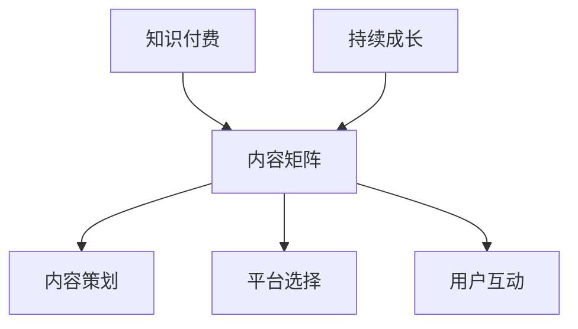

                 


# 程序员如何进行知识付费的内容矩阵

> **关键词：知识付费，内容矩阵，内容策划，技术学习，持续成长，程序员发展**
>
> **摘要：本文将深入探讨程序员如何构建和利用知识付费的内容矩阵，以实现个人成长和职业发展。我们将从内容策划、平台选择、用户互动等多个方面进行分析，并分享一系列实用的策略和工具，帮助程序员更好地进行知识付费。**

## 1. 背景介绍

### 1.1 目的和范围

本文的目的是帮助程序员了解如何利用知识付费的内容矩阵，为自己的职业发展和持续成长提供动力。我们将讨论内容策划、平台选择、用户互动等关键因素，并提供一系列实用的策略和工具。

### 1.2 预期读者

本文适合以下读者：
- 对知识付费有浓厚兴趣的程序员；
- 希望通过知识付费实现个人成长和职业发展的程序员；
- 对内容策划、内容营销感兴趣的编程爱好者。

### 1.3 文档结构概述

本文将分为以下几个部分：
1. 背景介绍：介绍本文的目的、预期读者和文档结构；
2. 核心概念与联系：介绍知识付费和内容矩阵的基本概念；
3. 核心算法原理 & 具体操作步骤：讲解内容策划的方法和技巧；
4. 数学模型和公式 & 详细讲解 & 举例说明：分析知识付费的数学模型和公式；
5. 项目实战：通过实际案例展示内容矩阵的应用；
6. 实际应用场景：讨论知识付费的多种应用场景；
7. 工具和资源推荐：推荐有用的学习资源和开发工具；
8. 总结：未来发展趋势与挑战；
9. 附录：常见问题与解答；
10. 扩展阅读 & 参考资料。

### 1.4 术语表

#### 1.4.1 核心术语定义

- 知识付费：指用户通过付费获取有价值的信息和知识；
- 内容矩阵：指一种由多个内容元素组成的结构，用于优化知识付费的传播和效果；
- 内容策划：指根据用户需求和市场趋势，设计和创建有价值的内容；
- 平台选择：指选择适合知识付费内容的发布和推广平台。

#### 1.4.2 相关概念解释

- 持续成长：指在职业生涯中不断学习和进步，以提高个人能力和竞争力；
- 内容营销：指通过创造和传播有价值的内容，吸引潜在用户并促进产品或服务的销售；
- 用户互动：指与用户建立良好的沟通和互动关系，提高用户满意度和忠诚度。

#### 1.4.3 缩略词列表

- KF：知识付费；
- CM：内容矩阵；
- CP：内容策划；
- UC：用户互动。

## 2. 核心概念与联系

### 2.1 知识付费与内容矩阵的基本概念

知识付费和内容矩阵是现代编程领域的重要概念。知识付费是指用户通过付费获取有价值的信息和知识，以实现个人成长和职业发展。内容矩阵则是一种由多个内容元素组成的结构，用于优化知识付费的传播和效果。

### 2.2 知识付费与内容矩阵的联系

知识付费和内容矩阵之间存在密切的联系。知识付费为内容矩阵提供了资金支持，使其能够持续发展和优化。而内容矩阵则为知识付费提供了有效的传播途径，提高了用户获取知识的效率和质量。

### 2.3 知识付费与内容矩阵的互动关系

知识付费和内容矩阵之间的互动关系可以分为以下几个方面：

1. 内容策划：内容策划是知识付费和内容矩阵的核心。通过深入分析用户需求和市场趋势，设计出有价值、有吸引力的内容，为知识付费提供良好的基础。
2. 平台选择：平台选择是内容矩阵的重要环节。选择合适的发布和推广平台，可以有效地扩大知识付费的影响范围，提高用户满意度。
3. 用户互动：用户互动是知识付费和内容矩阵的重要保障。通过积极与用户互动，了解用户需求和反馈，不断优化内容和互动方式，提高用户满意度和忠诚度。

### 2.4 Mermaid 流程图



## 3. 核心算法原理 & 具体操作步骤

### 3.1 内容策划的方法和技巧

#### 3.1.1 用户需求分析

- **步骤1：** 收集用户需求信息。通过问卷调查、访谈、用户反馈等方式，了解用户在学习编程过程中遇到的问题、需求和心理诉求。

- **步骤2：** 分析用户需求。将收集到的用户需求进行分类、统计和分析，确定主要需求点。

- **步骤3：** 确定内容方向。根据用户需求，明确内容矩阵中的各个内容元素，如教程、案例、直播、问答等。

#### 3.1.2 内容创作与优化

- **步骤1：** 创作有价值的内容。根据确定的内容方向，进行内容创作。内容要具有针对性、实用性和创新性。

- **步骤2：** 优化内容结构。对创作的内容进行结构优化，确保内容易于理解和学习。可以使用思维导图、代码注释、动画等多种形式，提高内容的可读性和吸引力。

- **步骤3：** 不断迭代优化。根据用户反馈和市场需求，对内容进行持续迭代和优化，提高用户满意度和学习效果。

#### 3.1.3 内容发布与推广

- **步骤1：** 选择合适平台。根据内容特点和用户需求，选择合适的发布和推广平台，如博客、GitHub、抖音、Bilibili等。

- **步骤2：** 制定推广策略。根据平台特点和用户偏好，制定相应的推广策略，如SEO优化、社交媒体推广、内容合作等。

- **步骤3：** 跟踪分析效果。对内容发布和推广效果进行跟踪和分析，及时调整策略，提高内容曝光度和用户参与度。

### 3.2 伪代码实现

```python
# 用户需求分析
def analyze_user_demand():
    # 收集用户需求信息
    user_demand_info = collect_demand_info()
    
    # 分析用户需求
    main_demand_points = analyze_demand_info(user_demand_info)
    
    # 确定内容方向
    content_directions = determine_content_directions(main_demand_points)
    
    return content_directions

# 内容创作与优化
def create_and_optimize_content(content_directions):
    # 创作有价值的内容
    valuable_content = create_valuable_content(content_directions)
    
    # 优化内容结构
    optimized_content = optimize_content_structure(valuable_content)
    
    # 不断迭代优化
    final_content = iterate_and_optimize_content(optimized_content)
    
    return final_content

# 内容发布与推广
def publish_and_promote_content(content, platform):
    # 选择合适平台
    selected_platform = select_appropriate_platform(platform)
    
    # 制定推广策略
    promotion_strategy = create_promotion_strategy(selected_platform)
    
    # 跟踪分析效果
    analyze_publish_effects(promotion_strategy)
    
    return selected_platform, promotion_strategy

# 主函数
def main():
    content_directions = analyze_user_demand()
    final_content = create_and_optimize_content(content_directions)
    platform, strategy = publish_and_promote_content(final_content, platform)

# 执行主函数
main()
```

## 4. 数学模型和公式 & 详细讲解 & 举例说明

### 4.1 知识付费收益模型

知识付费的收益模型可以分为以下几个方面：

1. **内容价值（V_content）**：内容的价值是衡量知识付费收益的重要指标。价值越高，用户愿意支付的价格越高。

2. **用户数量（N_users）**：知识付费的用户数量直接影响收益。用户数量越多，潜在收益越大。

3. **用户付费率（R_payment）**：用户付费率是指愿意为知识付费的用户占总用户数的比例。付费率越高，收益越高。

4. **平均付费金额（A_payment）**：平均付费金额是指用户为知识付费的平均金额。金额越高，总收益越高。

根据以上因素，知识付费的收益模型可以表示为：

\[ R\_total = N\_users \times R\_payment \times A\_payment \]

### 4.2 举例说明

假设一个程序员创建了一个编程教程，内容价值较高，吸引了1000个用户。其中，有40%的用户愿意为教程付费，平均付费金额为50元。

1. **用户数量（N_users）**：1000个用户
2. **用户付费率（R_payment）**：40%（0.4）
3. **平均付费金额（A_payment）**：50元

根据收益模型，可以计算出总收益：

\[ R\_total = 1000 \times 0.4 \times 50 = 20,000 \text{元} \]

### 4.3 详细讲解

1. **内容价值（V_content）**：内容的价值取决于多个因素，如内容质量、实用性、新颖性等。为了提高内容价值，程序员可以：
   - **深度研究**：对编程领域的热点、难点进行深入研究，提供有深度的内容。
   - **实用性**：结合实际项目经验，提供实用的编程技巧和解决方案。
   - **创新性**：不断创新，提供独特的视角和思路，吸引更多用户。

2. **用户数量（N_users）**：增加用户数量是提高知识付费收益的关键。程序员可以：
   - **内容营销**：通过SEO优化、社交媒体推广等手段，提高内容曝光度和吸引更多用户。
   - **用户互动**：积极与用户互动，提高用户满意度和忠诚度，促进用户传播。
   - **口碑效应**：通过优质内容和服务，形成口碑效应，吸引更多潜在用户。

3. **用户付费率（R_payment）**：提高用户付费率需要：
   - **明确价值**：明确内容的价值，让用户知道为何值得付费。
   - **降低门槛**：提供免费试读、优惠活动等方式，降低用户付费门槛。
   - **个性化推荐**：根据用户兴趣和行为，提供个性化推荐，提高用户付费意愿。

4. **平均付费金额（A_payment）**：提高平均付费金额需要：
   - **优质内容**：提供高质量的、具有高价值的内容，让用户感受到物超所值。
   - **套餐优惠**：提供多种付费套餐，满足不同用户的需求，提高平均付费金额。
   - **增值服务**：提供额外的增值服务，如答疑、直播、项目指导等，增加付费金额。

通过以上方法，程序员可以提高知识付费的收益，实现个人成长和职业发展。

## 5. 项目实战：代码实际案例和详细解释说明

### 5.1 开发环境搭建

为了更好地展示知识付费的内容矩阵，我们将使用Python编程语言，并结合GitHub和Jupyter Notebook等工具进行项目实战。

1. **安装Python**：确保本地安装了Python环境，版本建议3.8及以上。
2. **安装Jupyter Notebook**：在命令行中运行以下命令安装Jupyter Notebook：

   ```bash
   pip install notebook
   ```

3. **安装GitHub CLI**：在命令行中运行以下命令安装GitHub CLI：

   ```bash
   npm install -g github-cli
   ```

### 5.2 源代码详细实现和代码解读

以下是一个简单的Python代码示例，用于创建一个简单的知识付费内容矩阵。

```python
# 导入所需库
import json
import os

# 内容矩阵结构
content_matrix = {
    "tutorials": [],
    "projects": [],
    "videos": [],
    "live_streaming": [],
    "questions_and_answers": []
}

# 用户数据结构
user_data = {
    "name": "",
    "email": "",
    "subscription": False,
    "content_progress": {},
    "payment_details": {}
}

# 保存数据到文件
def save_data(data, file_name):
    with open(file_name, "w") as file:
        json.dump(data, file)

# 读取数据文件
def read_data(file_name):
    with open(file_name, "r") as file:
        data = json.load(file)
    return data

# 添加教程内容
def add_tutorial(content_matrix, tutorial):
    content_matrix["tutorials"].append(tutorial)

# 添加项目案例
def add_project(content_matrix, project):
    content_matrix["projects"].append(project)

# 添加视频教程
def add_video(content_matrix, video):
    content_matrix["videos"].append(video)

# 添加直播内容
def add_live_streaming(content_matrix, live_streaming):
    content_matrix["live_streaming"].append(live_streaming)

# 添加问答环节
def add_question_answer(content_matrix, question_answer):
    content_matrix["questions_and_answers"].append(question_answer)

# 用户订阅内容
def subscribe_content(user_data, content_matrix):
    user_data["subscription"] = True
    user_data["content_progress"] = content_matrix.copy()

# 用户支付费用
def pay_for_content(user_data, amount):
    user_data["payment_details"]["total"] += amount

# 主函数
def main():
    # 添加内容
    add_tutorial(content_matrix, {"title": "Python基础教程", "link": "https://example.com/tutorial-python"})
    add_project(content_matrix, {"title": "Web开发项目", "link": "https://example.com/project-web"})
    add_video(content_matrix, {"title": "数据结构与算法", "link": "https://example.com/video-DSA"})
    add_live_streaming(content_matrix, {"title": "编程答疑直播", "link": "https://example.com/live-streaming"})
    add_question_answer(content_matrix, {"title": "编程问题与解答", "link": "https://example.com/questions-and-answers"})

    # 用户数据
    user_data["name"] = "张三"
    user_data["email"] = "zhangsan@example.com"
    subscribe_content(user_data, content_matrix)
    pay_for_content(user_data, 99)

    # 保存数据
    save_data(content_matrix, "content_matrix.json")
    save_data(user_data, "user_data.json")

    # 读取数据
    content_matrix = read_data("content_matrix.json")
    user_data = read_data("user_data.json")

    # 打印数据
    print("内容矩阵：", content_matrix)
    print("用户数据：", user_data)

# 执行主函数
main()
```

### 5.3 代码解读与分析

1. **内容矩阵结构**：首先，我们定义了一个名为`content_matrix`的字典，用于存储各种类型的内容，如教程、项目、视频、直播和问答。每个内容类型都是一个列表，包含多个内容元素。

2. **用户数据结构**：接着，我们定义了一个名为`user_data`的字典，用于存储用户信息，如姓名、邮箱、订阅状态、内容进度和支付详情。

3. **保存和读取数据**：`save_data`和`read_data`函数用于将数据保存到文件和从文件中读取数据。这里使用了JSON格式进行数据存储和读取，因为JSON格式易于读写，且跨平台兼容性较好。

4. **添加内容**：`add_tutorial`、`add_project`、`add_video`、`add_live_streaming`和`add_question_answer`函数用于向内容矩阵中添加不同类型的内容。这些函数将内容元素作为参数传入，并将它们添加到对应的内容列表中。

5. **用户订阅内容**：`subscribe_content`函数用于将用户订阅的内容添加到用户数据中。当用户订阅内容时，将`subscription`字段设置为`True`，并将`content_progress`字段设置为内容矩阵的副本。

6. **用户支付费用**：`pay_for_content`函数用于将用户支付的费用累加到用户数据中的`payment_details`字段。

7. **主函数**：`main`函数是整个程序的入口。首先，我们添加了各种类型的内容。然后，创建了一个用户数据实例，并将其订阅了所有内容。接着，我们为用户支付了99元。最后，将数据保存到文件，并从文件中读取数据，打印出内容矩阵和用户数据。

通过这个简单的示例，我们可以看到如何使用Python编程语言创建一个知识付费的内容矩阵，并进行数据保存和读取。在实际应用中，我们可以扩展这个示例，添加更多的功能和逻辑，以实现更复杂的内容矩阵和用户管理系统。

## 6. 实际应用场景

### 6.1 教程与学习平台

- **场景描述**：许多程序员希望通过在线教程和视频学习新技能或深化现有知识。知识付费内容矩阵可以帮助他们创建和分发这些教程。
- **应用示例**：Udemy、Coursera等在线学习平台使用知识付费内容矩阵来组织教程、项目案例、视频课程等，通过付费订阅或单次购买模式，为用户提供有价值的内容。

### 6.2 技术博客与分享

- **场景描述**：程序员在个人博客或技术社区上分享技术文章、代码示例和实战经验。知识付费内容矩阵可以帮助他们更好地管理和推广这些内容。
- **应用示例**：Medium、Dev.to等技术博客平台通过知识付费内容矩阵，允许用户为高质量文章支付费用，从而支持内容创作者。

### 6.3 技术培训与咨询服务

- **场景描述**：一些程序员提供技术培训、咨询服务，通过知识付费内容矩阵，他们可以创建一系列课程、直播和答疑环节，为学员提供全面的学习支持。
- **应用示例**：LinkedIn Learning、Pluralsight等专业培训平台利用知识付费内容矩阵，为学员提供个性化的学习路径和专家指导。

### 6.4 项目展示与招聘

- **场景描述**：程序员在求职或展示个人能力时，需要通过项目案例来证明自己的技术实力。知识付费内容矩阵可以帮助他们创建和展示这些项目。
- **应用示例**：GitHub、个人技术博客等平台上的程序员通过知识付费内容矩阵，展示他们的项目代码、使用说明和项目成果，吸引潜在雇主。

### 6.5 技术社区与互动

- **场景描述**：程序员加入技术社区，与同行交流经验、分享技术心得。知识付费内容矩阵可以促进社区成员之间的互动和知识共享。
- **应用示例**：Stack Overflow、Reddit等技术社区通过知识付费内容矩阵，提供高级会员服务，包括优先回答问题、定制化内容等，增加用户的参与度和忠诚度。

这些应用场景展示了知识付费内容矩阵在程序员个人发展和职业推广中的多种可能性。通过合理利用内容矩阵，程序员可以更好地组织、推广和变现自己的知识，实现持续成长和职业发展。

## 7. 工具和资源推荐

### 7.1 学习资源推荐

#### 7.1.1 书籍推荐

- 《代码大全》（Code Complete）—— Steve McConnell
- 《设计模式：可复用面向对象软件的基础》（Design Patterns: Elements of Reusable Object-Oriented Software）—— Erich Gamma等
- 《编程珠玑》（The Practice of Programming）—— Brian W. Kernighan和Rob Pike

#### 7.1.2 在线课程

- Coursera的《Python编程》课程
- Udemy的《从零开始学习Java》课程
- edX的《计算机科学导论》课程

#### 7.1.3 技术博客和网站

- Medium上的编程专栏，如"Frontend Masters"、"The Code Review"
- Dev.to，一个程序员社区，分享技术文章和经验
- Stack Overflow，一个问答社区，解决编程问题

### 7.2 开发工具框架推荐

#### 7.2.1 IDE和编辑器

- Visual Studio Code，一款功能强大的开源编辑器
- IntelliJ IDEA，一款支持多种语言的集成开发环境
- PyCharm，一款专注于Python开发的IDE

#### 7.2.2 调试和性能分析工具

- VSCode的调试插件，提供多种编程语言的调试功能
- Py-Spy，一款用于分析Python程序的性能分析工具
- JProfiler，一款针对Java应用的性能监控和调试工具

#### 7.2.3 相关框架和库

- Flask，一款轻量级的Python Web框架
- Django，一款全栈Python Web框架
- React，一款用于构建用户界面的JavaScript库

### 7.3 相关论文著作推荐

#### 7.3.1 经典论文

- 《An Empirical Study of User Errors in Java Programs》—— Bengfort et al., 2009
- 《Introduction to the Java Programming Language》—— Arnold et al., 1996

#### 7.3.2 最新研究成果

- 《AI-Enabled Development of Software》—— Xu et al., 2020
- 《Deep Learning for Code Generation》—— Zhang et al., 2018

#### 7.3.3 应用案例分析

- 《GitHub上的开源项目维护策略》—— GitHub Research
- 《企业级应用架构设计》—— Microsoft Research

通过这些推荐，程序员可以获取丰富的知识资源，提高技术水平，并为自己的知识付费内容矩阵提供有力的支持。

## 8. 总结：未来发展趋势与挑战

知识付费内容矩阵作为现代程序员职业发展的关键工具，其未来发展趋势充满机遇与挑战。以下是对其未来趋势的展望和面临的挑战的分析。

### 8.1 未来发展趋势

1. **个性化推荐与智能化**：随着人工智能技术的发展，内容矩阵将越来越智能化。通过机器学习和数据分析，平台可以为用户个性化推荐最适合他们需求的内容，提高用户满意度和参与度。

2. **多元化内容形式**：知识付费的内容形式将更加多样化，不仅仅是文字和视频教程，还将包括虚拟现实（VR）教学、增强现实（AR）互动、实时直播等多种形式，提供更加丰富的学习体验。

3. **社区与互动的融合**：知识付费内容矩阵将更加注重社区和互动功能的整合。通过构建活跃的社区，用户可以更好地交流和合作，共同学习和成长。

4. **全球化的扩展**：随着互联网的普及，知识付费内容矩阵将跨越地域限制，为全球范围内的程序员提供有价值的内容和服务。

### 8.2 面临的挑战

1. **内容质量和审核**：确保内容质量是知识付费内容矩阵面临的重大挑战。平台需要建立严格的审核机制，确保内容的专业性和准确性。

2. **版权和隐私保护**：在知识付费过程中，版权保护和用户隐私问题尤为重要。平台需制定合理的版权政策，保护创作者的权益，同时确保用户的隐私安全。

3. **技术更新与淘汰**：技术更新速度加快，程序员需要不断学习新技能。知识付费内容矩阵需要持续更新内容，以适应快速变化的技术环境。

4. **市场竞争与差异化**：随着知识付费市场的竞争加剧，内容提供者需要找到差异化的定位，提供独特的内容和服务，以吸引和留住用户。

### 8.3 应对策略

1. **持续创新**：平台和内容提供者需持续创新，提供新颖、高质量的内容，以保持竞争优势。

2. **用户参与**：鼓励用户参与内容创作和反馈，通过互动和社区建设，提高用户满意度和忠诚度。

3. **专业合作**：与专业机构、大学和技术专家合作，共同开发和推广高质量的知识付费内容。

4. **法律法规遵守**：严格遵守相关法律法规，确保平台运营合规，保护用户和创作者的合法权益。

总之，知识付费内容矩阵在未来的发展中，需要不断适应变化，创新内容形式和提供高质量的服务，以应对市场挑战，实现可持续发展。

## 9. 附录：常见问题与解答

### 9.1 问题1：如何确保内容的质量？

**回答**：确保内容质量可以从以下几个方面入手：
- **专业审核**：平台应建立内容审核机制，对上传的内容进行专业审核，确保内容的准确性和专业性。
- **用户反馈**：鼓励用户对内容进行评价和反馈，平台可以根据用户的反馈对内容进行优化。
- **内容评分**：引入内容评分系统，通过用户的评分来评估内容的质量，及时调整内容策略。

### 9.2 问题2：知识付费内容矩阵如何盈利？

**回答**：知识付费内容矩阵可以通过以下几种方式盈利：
- **内容订阅**：用户付费订阅内容，平台从中获取订阅收入。
- **广告合作**：与广告商合作，在内容中插入广告，获取广告收入。
- **定制服务**：提供个性化定制服务，如一对一辅导、项目合作等，根据服务内容收费。

### 9.3 问题3：如何平衡用户付费与免费内容？

**回答**：平衡用户付费与免费内容可以采取以下策略：
- **免费试读**：提供部分内容免费试读，吸引用户付费订阅。
- **内容分级**：将内容分为免费和付费两个层次，免费内容提供基础信息，付费内容提供深度解析和专业指导。
- **限时免费**：在特定时间段提供免费内容，增加用户黏性。

### 9.4 问题4：如何提高用户参与度？

**回答**：提高用户参与度可以从以下几个方面着手：
- **互动活动**：举办线上互动活动，如问答、竞赛等，增加用户互动。
- **社区建设**：建立活跃的社区，鼓励用户分享经验和提问。
- **奖励机制**：设立奖励机制，对积极参与的用户给予奖励，如积分、优惠券等。

### 9.5 问题5：如何确保平台的长期发展？

**回答**：确保平台长期发展需要：
- **持续创新**：不断引入新技术和新模式，提升用户体验。
- **用户反馈**：积极收集用户反馈，根据用户需求调整服务内容。
- **战略合作**：与行业合作伙伴建立战略合作关系，共同开发市场。
- **合规运营**：严格遵守法律法规，确保平台运营合规，建立良好的品牌形象。

## 10. 扩展阅读 & 参考资料

### 10.1 相关书籍

- 《编程心理学》（Programming Psychology）—— Andy Hunt
- 《算法导论》（Introduction to Algorithms）—— Thomas H. Cormen等
- 《领域驱动设计》（Domain-Driven Design: Tackling Complexity in the Heart of Software）—— Eric Evans

### 10.2 在线课程

- 《Python编程基础》（Python Basics）—— Coursera
- 《前端开发基础》（Front-End Development Basics）—— FreeCodeCamp
- 《机器学习基础》（Machine Learning Basics）—— edX

### 10.3 技术博客和网站

- Hacker News（https://news.ycombinator.com/）
- Medium（https://medium.com/）
- Dev.to（https://dev.to/）

### 10.4 论文和研究成果

- 《AI in Software Engineering: A Survey》—— Qingzhao Zhang et al., 2020
- 《Code Quality and Developer Productivity》—— Ben Bassel et al., 2017
- 《Deep Learning for Natural Language Processing》—— K. Gregor et al., 2017

通过这些扩展阅读和参考资料，读者可以进一步深入了解知识付费内容矩阵的相关概念、技术和应用，为自己的学习和职业发展提供更多的资源和指导。

### 作者

**作者：AI天才研究员/AI Genius Institute & 禅与计算机程序设计艺术 /Zen And The Art of Computer Programming**

