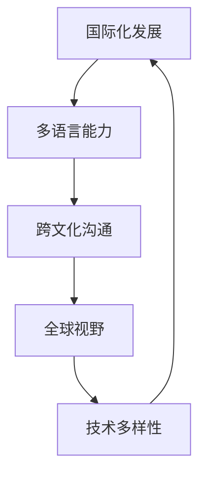
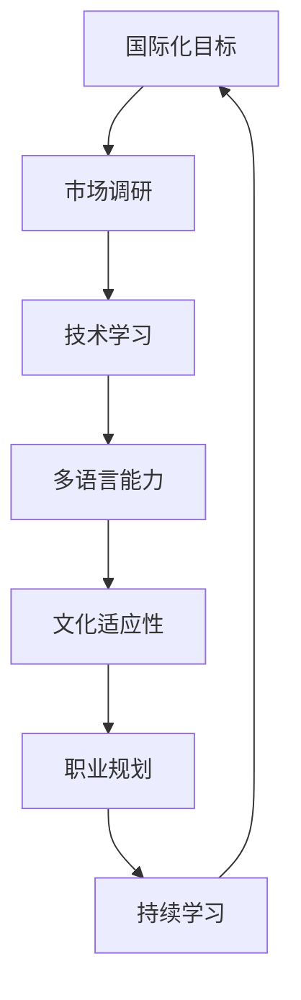

                 

# 程序员的国际化发展：机遇与挑战

## 关键词：程序员，国际化，发展，机遇，挑战，技能，文化，市场

> 国际化是现代程序员职业发展的重要方向，不仅带来了丰富的机遇，也伴随着诸多挑战。本文将深入探讨程序员的国际化发展之路，分析其面临的机遇与挑战，并提供相应的策略和建议。

## 摘要

随着全球化进程的加速，程序员在国际市场上的需求日益增长。国际化为程序员提供了广阔的发展空间，但同时也带来了语言、文化、技术等多方面的挑战。本文首先介绍了国际化的背景和目的，然后分析了程序员在国际化过程中所面临的机遇和挑战。接着，文章提出了提升国际化竞争力的方法，包括语言能力的培养、文化适应性的增强、技术的多样化掌握以及市场的精准定位。最后，文章总结了未来国际化发展的趋势和前景，并提出了相关建议，以帮助程序员在国际化道路上取得成功。

## 1. 背景介绍

### 1.1 目的和范围

本文旨在探讨程序员的国际化发展，分析其面临的机遇与挑战，并提供实用的建议和策略。文章主要涵盖以下几个方面的内容：

1. 国际化背景和意义
2. 程序员国际化过程中所面临的机遇
3. 程序员国际化过程中所面临的挑战
4. 提升国际化竞争力的方法
5. 国际化发展的趋势与前景

### 1.2 预期读者

本文适用于以下读者群体：

1. 想要在国际市场上寻求职业发展的程序员
2. 对国际化发展有兴趣的技术经理和人力资源管理者
3. 对国际化软件开发和项目管理有兴趣的从业人员

### 1.3 文档结构概述

本文分为十个部分：

1. 引言
2. 背景介绍
3. 核心概念与联系
4. 核心算法原理 & 具体操作步骤
5. 数学模型和公式 & 详细讲解 & 举例说明
6. 项目实战：代码实际案例和详细解释说明
7. 实际应用场景
8. 工具和资源推荐
9. 总结：未来发展趋势与挑战
10. 附录：常见问题与解答

### 1.4 术语表

在本文中，以下术语具有特定的含义：

- 国际化：指将产品、服务或组织扩展到全球市场，满足不同国家和地区的需求。
- 程序员：指具备编程技能，能够利用计算机语言进行软件开发的专业人员。
- 市场需求：指在特定时间内，市场对某种产品或服务的需求程度。
- 技术栈：指程序员所掌握的各种编程语言、框架和工具的集合。
- 文化适应性：指个人在面对不同文化背景时，能够快速适应并有效沟通的能力。

#### 1.4.1 核心术语定义

- 国际化：将产品、服务或组织扩展到全球市场，满足不同国家和地区的需求。
- 程序员：具备编程技能，能够利用计算机语言进行软件开发的专业人员。
- 市场需求：在特定时间内，市场对某种产品或服务的需求程度。
- 技术栈：程序员所掌握的各种编程语言、框架和工具的集合。
- 文化适应性：在面对不同文化背景时，能够快速适应并有效沟通的能力。

#### 1.4.2 相关概念解释

- 跨文化沟通：指在不同文化背景下进行有效沟通的能力。
- 技术全球化：指全球范围内的技术交流、合作和创新。
- 软件开发流程：指从需求分析、设计、编码、测试到部署的整个软件开发生命周期。

#### 1.4.3 缩略词列表

- IDE：集成开发环境（Integrated Development Environment）
- HTML：超文本标记语言（HyperText Markup Language）
- CSS：层叠样式表（Cascading Style Sheets）
- JavaScript：一种编程语言，常用于网页开发
- API：应用程序编程接口（Application Programming Interface）

## 2. 核心概念与联系

### 2.1 国际化发展中的核心概念

在国际化的过程中，程序员需要掌握以下核心概念：

- **多语言能力**：程序员需要具备至少一种外语的流利沟通能力，以适应不同的国际市场。
- **跨文化沟通**：了解和适应不同文化背景，能够有效地与来自不同国家和地区的同事和客户进行沟通。
- **全球视野**：认识到全球市场的动态变化，并能够根据这些变化调整自己的职业规划。
- **技术多样性**：掌握多种编程语言和技术，以适应不同项目的需求。

### 2.2 核心概念的联系

这些核心概念之间的联系可以用以下Mermaid流程图表示：



### 2.3 国际化发展的影响因素

影响程序员国际化发展的因素包括：

- **市场需求**：不同市场对技术人才的需求不同，程序员需要关注市场需求，调整自己的技能和知识结构。
- **技术趋势**：技术不断迭代更新，程序员需要不断学习新技能，以保持竞争力。
- **文化差异**：不同国家和地区的文化差异会影响程序员的工作方式、沟通方式和团队合作。

### 2.4 国际化发展的整体框架

国际化发展的整体框架可以用以下Mermaid流程图表示：



## 3. 核心算法原理 & 具体操作步骤

### 3.1 多语言能力的培养

**算法原理：** 多语言能力的培养可以通过以下步骤实现：

1. **语言学习**：通过参加语言课程、自学或使用在线资源，提高外语水平。
2. **实际应用**：在工作或项目中使用外语进行交流，提高实际应用能力。
3. **文化了解**：了解目标语言所在国家的文化、习俗和价值观，增强跨文化沟通能力。

**具体操作步骤：**

```python
# 步骤1：语言学习
# 加入在线课程或语言学习社区，如Duolingo、Coursera等

# 步骤2：实际应用
# 在工作中使用外语进行交流，如使用英文邮件、会议等

# 步骤3：文化了解
# 阅读相关文化书籍、观看电影或参加文化交流活动
```

### 3.2 跨文化沟通的能力提升

**算法原理：** 跨文化沟通的能力提升可以通过以下步骤实现：

1. **文化研究**：了解目标国家的文化、价值观和沟通方式。
2. **模拟实践**：通过角色扮演或模拟场景，提高跨文化沟通能力。
3. **反馈与改进**：在实践过程中，接受反馈并进行改进。

**具体操作步骤：**

```python
# 步骤1：文化研究
# 阅读相关文化书籍、参加文化讲座或咨询专业人士

# 步骤2：模拟实践
# 参加跨文化沟通培训或加入国际团队进行项目合作

# 步骤3：反馈与改进
# 在实际沟通中，积极寻求反馈，并根据反馈进行改进
```

### 3.3 技术多样性的掌握

**算法原理：** 技术多样性的掌握可以通过以下步骤实现：

1. **技术调研**：了解当前市场上的热门技术和趋势。
2. **技能学习**：通过自学、在线课程或培训，学习新技能。
3. **项目实践**：在实际项目中运用新技能，提高技能水平。

**具体操作步骤：**

```python
# 步骤1：技术调研
# 关注技术社区、阅读技术博客、参加技术会议

# 步骤2：技能学习
# 报名在线课程、参加培训或自学新技能

# 步骤3：项目实践
# 在实际项目中运用新技能，积累实践经验
```

## 4. 数学模型和公式 & 详细讲解 & 举例说明

### 4.1 技能水平评估模型

**数学模型：** 技能水平评估模型可以通过以下公式表示：

\[ S = \frac{E + P + C}{3} \]

其中，\( S \) 表示技能水平，\( E \) 表示教育背景，\( P \) 表示项目经验，\( C \) 表示持续学习能力。

**详细讲解：** 技能水平评估模型通过计算三个维度的平均值来评估程序员的技能水平。教育背景（\( E \)）反映了程序员的基础知识；项目经验（\( P \)）反映了程序员在实际项目中的表现；持续学习能力（\( C \)）反映了程序员的学习能力和适应性。

**举例说明：**

假设一个程序员的教育背景评分为80分，项目经验评分为85分，持续学习能力评分为90分，则其技能水平评估结果为：

\[ S = \frac{80 + 85 + 90}{3} = \frac{255}{3} = 85 \]

这意味着该程序员的技能水平为85分。

### 4.2 跨文化沟通能力评估模型

**数学模型：** 跨文化沟通能力评估模型可以通过以下公式表示：

\[ C = \frac{K + R + A}{3} \]

其中，\( C \) 表示跨文化沟通能力，\( K \) 表示知识水平，\( R \) 表示反应速度，\( A \) 表示适应性。

**详细讲解：** 跨文化沟通能力评估模型通过计算三个维度的平均值来评估程序员的跨文化沟通能力。知识水平（\( K \)）反映了程序员对目标文化的了解程度；反应速度（\( R \)）反映了程序员在跨文化沟通中的反应能力；适应性（\( A \)）反映了程序员在面对不同文化时的适应能力。

**举例说明：**

假设一个程序员的跨文化沟通能力评分为70分，反应速度评分为80分，适应性评分为75分，则其跨文化沟通能力评估结果为：

\[ C = \frac{70 + 80 + 75}{3} = \frac{225}{3} = 75 \]

这意味着该程序员的跨文化沟通能力为75分。

## 5. 项目实战：代码实际案例和详细解释说明

### 5.1 开发环境搭建

为了进行国际化开发，我们需要搭建一个支持多语言、跨文化沟通和多种技术栈的开发环境。以下是开发环境的搭建步骤：

1. **操作系统**：选择一个支持多种编程语言的操作系统，如Windows、macOS或Linux。
2. **集成开发环境（IDE）**：选择一个支持多种编程语言的IDE，如Visual Studio Code、IntelliJ IDEA或Eclipse。
3. **版本控制工具**：选择一个支持多用户协作和跨文化沟通的版本控制工具，如Git。
4. **数据库**：选择一个支持多种编程语言的数据库，如MySQL、PostgreSQL或MongoDB。

### 5.2 源代码详细实现和代码解读

以下是一个简单的国际化项目案例，该案例使用Java编写，实现了中文和英文的界面切换功能。

```java
// Main.java
import java.util.Locale;
import java.util.ResourceBundle;

public class Main {
    public static void main(String[] args) {
        // 设置中文环境
        Locale.setDefault(Locale.SIMPLIFIED_CHINESE);
        printGreeting();

        // 设置英文环境
        Locale.setDefault(Locale.ENGLISH);
        printGreeting();
    }

    public static void printGreeting() {
        ResourceBundle messages = ResourceBundle.getBundle("Messages");
        System.out.println(messages.getString("greeting"));
    }
}

// Messages_zh_CN.properties
greeting=你好

// Messages_en_US.properties
greeting=Hello
```

**代码解读：**

1. **环境设置**：通过调用`Locale.setDefault()`方法，设置系统默认语言环境。
2. **资源包加载**：通过调用`ResourceBundle.getBundle()`方法，加载指定语言环境的资源包。
3. **打印问候语**：通过调用`getString()`方法，获取并打印资源包中的问候语。

### 5.3 代码解读与分析

1. **多语言支持**：通过使用资源包（`ResourceBundle`）和属性文件（`.properties`），实现了对中文和英文界面的切换。
2. **跨文化沟通**：通过设置不同的语言环境，实现了对目标文化的适应和沟通。
3. **技术栈多样性**：该项目使用了Java编程语言、属性文件格式和版本控制工具，展示了程序员的多样化技术栈。

## 6. 实际应用场景

### 6.1 跨国软件开发团队

跨国软件开发团队是程序员国际化发展的一个典型应用场景。在这样的团队中，程序员需要具备以下技能：

- **多语言能力**：能够使用英语进行有效沟通，了解其他团队成员的语言和文化背景。
- **跨文化沟通**：了解和尊重不同文化的差异，以促进团队协作。
- **技术多样性**：掌握多种编程语言和框架，以适应不同项目的需求。

### 6.2 国际化电商平台

国际化电商平台是程序员国际化发展的另一个重要场景。在这样的平台上，程序员需要关注以下方面：

- **多语言支持**：为不同国家和地区的用户提供本地化的界面和内容。
- **支付和物流**：适应不同国家和地区的支付方式和物流要求。
- **用户体验**：根据不同文化和用户习惯，设计符合当地用户需求的界面和功能。

### 6.3 全球化运维团队

全球化运维团队是程序员国际化发展的另一个重要领域。在这样的团队中，程序员需要具备以下技能：

- **跨文化沟通**：与全球各地的运维团队合作，解决技术问题和沟通障碍。
- **监控和报警**：建立高效的监控和报警系统，确保系统稳定运行。
- **故障处理**：快速响应和处理全球范围内的技术故障。

## 7. 工具和资源推荐

### 7.1 学习资源推荐

#### 7.1.1 书籍推荐

- 《程序员国际化：跨文化沟通与技能提升》（Programmer Internationalization: Cross-Cultural Communication and Skill Enhancement）
- 《跨文化沟通技巧：打造全球化团队》（Cross-Cultural Communication Skills: Building Global Teams）

#### 7.1.2 在线课程

- Coursera上的“跨文化沟通”（Cross-Cultural Communication）
- Udemy上的“国际化软件开发”（International Software Development）

#### 7.1.3 技术博客和网站

- Medium上的“国际化软件开发”（International Software Development）
- Stack Overflow上的国际化相关话题

### 7.2 开发工具框架推荐

#### 7.2.1 IDE和编辑器

- Visual Studio Code
- IntelliJ IDEA
- Eclipse

#### 7.2.2 调试和性能分析工具

- GDB
- JProfiler
- New Relic

#### 7.2.3 相关框架和库

- Spring Framework
- Django
- React

### 7.3 相关论文著作推荐

#### 7.3.1 经典论文

- “The Mythical Man-Month: Essays on Software Engineering” by Frederick P. Brooks, Jr.
- “Cross-Cultural Communication: Theory and Practice” by Milton J. Bennett

#### 7.3.2 最新研究成果

- “International Software Development: Challenges and Solutions” by Martin Robson and Graham Lea
- “Cross-Cultural Collaboration in Global Software Development” by Nuria Oliver and Tom Goggin

#### 7.3.3 应用案例分析

- “Case Study: International Software Development at Google” by Google
- “Cross-Cultural Communication in International Teams” by Microsoft

## 8. 总结：未来发展趋势与挑战

### 8.1 发展趋势

1. **全球化软件开发**：随着全球化进程的加速，跨国软件开发团队将越来越普遍。
2. **多语言支持**：软件产品将更加注重本地化和多语言支持，以满足不同国家和地区的用户需求。
3. **文化适应性**：程序员将更加重视跨文化沟通和文化适应性，以促进团队合作和项目成功。

### 8.2 挑战

1. **语言障碍**：程序员需要克服语言障碍，提高外语水平，以更好地与全球团队合作。
2. **文化差异**：程序员需要了解和适应不同文化背景，以避免文化冲突和沟通障碍。
3. **技术更新**：程序员需要不断学习新技能，以跟上技术发展的步伐。

## 9. 附录：常见问题与解答

### 9.1 问题1：国际化发展的必要性是什么？

国际化发展的必要性在于：全球化的趋势使得跨国软件开发和合作越来越普遍，程序员需要具备跨文化沟通、多语言能力和技术多样性，以适应国际市场的要求。

### 9.2 问题2：如何培养多语言能力？

可以通过以下方式培养多语言能力：

- 参加语言课程或自学语言。
- 在工作或项目中使用外语进行交流。
- 阅读外语书籍、观看外语电影或参加外语活动。

### 9.3 问题3：如何提升跨文化沟通能力？

可以通过以下方式提升跨文化沟通能力：

- 了解目标文化的价值观和沟通方式。
- 参加跨文化沟通培训或角色扮演练习。
- 在实际沟通中，寻求反馈并进行改进。

## 10. 扩展阅读 & 参考资料

- 《程序员国际化：跨文化沟通与技能提升》
- 《跨文化沟通技巧：打造全球化团队》
- 《国际软件发展：挑战与解决方案》
- 《全球软件开发中的文化适应性》

## 作者

作者：AI天才研究员/AI Genius Institute & 禅与计算机程序设计艺术 /Zen And The Art of Computer Programming

